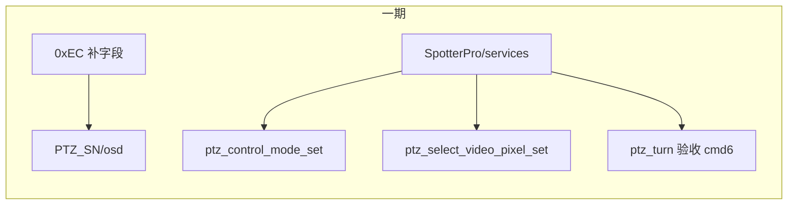

# SFL300：nexus_gateway PTZ 缺口补齐（精简方案）

> **与旧计划关系**：[`sfl300_tiandun_ptz_gaps_4337ce36.plan.md`](/home/skyfend/.cursor/plans/sfl300_tiandun_ptz_gaps_4337ce36.plan.md) **原样保留**。本文件为**新开发方案**。

---

## 0. 一期 / 二期（今天编码边界）

| 期 | 范围 | 状态 |
|----|------|------|
| **一期（今天一起编码）** | 0xEC 补字段；`ptz_control_mode_set`(0x8c)；`ptz_select_video_pixel_set`(0x95)；`ptz_turn` cmd=6 验收；可选 `ptz_zoom` 扫漏 | **可开工** |
| **二期** | `ptz_zoom`：无窗热能力时回 **`result=6`（不支持型号）** + 查能力表；不下发加热 | **协议已定，编码排二期** |

一期 **不改** 窗加热 cmd12/13 的现网行为（仍下发并回 0）。C2/alink 全程不在 SFL300 一期范围。

---

## 1. 方案变更（相对旧计划）

| 项 | 旧方案（保留文档） | **本方案** |
|----|-------------------|------------|
| 分支 | — | [`feature/sfl300`](ros_ws/src/nexus_gateway) |
| 节点 | 新建/改造 `nexus_gateway_sfl300` | **继续只用** [`nexus_gateway`](ros_ws/src/nexus_gateway) |
| 协议形态 | CloudMessage + `@type` + method 改名 | **现网 JSON 信封不变**（`tid/bid/method/gateway/data`） |
| 工作量 | 大重构 | **只补缺失功能** |
| 协议文档 | Spotter_Spotter Pro上云协议.md | [`云平台设备上云指导文档(对内).md`](/home/skyfend/workspace/ptz100_agx/云平台设备上云指导文档(对内).md)（仓库内最新） |

**明确不做**：Protobuf/`version` 信封、method 批量改名（`spotter_ptz_*`）、Topic 大迁、启用 `nexus_gateway_sfl300`。

---

## 2. 缺口清单与分期

| 项 | 天盾 MQTT 现状 | 分期 |
|----|----------------|------|
| 0xEC 缺 4 字段 + `ptz_ctl_mode` 占位 0 | 补上报 | **一期** |
| 0x8a `ptz_turn` cmd=6 | 代码已有 | **一期验收** |
| 0x8c 无 MQTT | 新增 `ptz_control_mode_set` | **一期** |
| 0x95 无 MQTT | 新增 `ptz_select_video_pixel_set` | **一期** |
| 0x8b `ptz_zoom` 扫漏 | 对照 alink，不改窗热语义 | **一期可选** |
| Z201 无窗加热 | 协议已扩 `result=6：不支持型号`；AGX 查能力表回 6 | **二期实现**（协议已定，可跟一期后马上做） |

Topic / SN 规则保持现网：心跳/推流用 **PTZ SN**；控制用 **主 SN** `/services`，目标在 `data.sn`。

---

## 3. 一期协议与实现（今天）

### 3.1 §4.8.2.4 PTZ 心跳 `device_heart`（0xEC）

- Topic：`thing/product/{PTZ_SN}/osd`，`gateway` = Spotter Pro 主 SN  
- 信封：`tid/bid/timestamp/method/gateway/data`（**一层 `data` + 一层根对象**；旧稿多一层 `}` 已废）  
- **新增四字段**（协议侧已改为完整键名，一期按此实现）：

| JSON 键 | 含义 |
|---------|------|
| `detect_camera_mode` | 0 自动 / 1 手动 |
| `detect_camera` | bit0 可见光，bit1 红外 |
| `defog_enable` | 0 关 / 1 开（仅和普） |
| `win_heat_enable` | 0 关 / 1 开（仅和普） |

- **修正**：`ptz_ctl_mode` 镜像真实值（勿写死 0）；已有经纬高/姿态/FOV/focus/`icr_*` 照旧  
- 改动链：`PtzOsdInfo.msg` → `ros_app_publish_ptz_osd_info` → `NexusPtzSubStatus` / `BuildPtzSubStatus`

> 0xEC **无 result**；`win_heat_enable`/`defog_enable` 只报 0/1 开关状态。

### 3.2 §4.8.4.18 `ptz_control_mode_set`（0x8c）

- Topic：`thing/product/{SpotterProSN}/services` → `services_reply`  
- data：`sn`，`cmd`（1），`ptzCtlMode`（0/1）  
- reply：`result` 0～5（现网枚举）  
- 实现：`CloudCommandHandler` 注册，复用 `alink_set_ptz_ctl_mode` 同类逻辑

### 3.3 §4.8.4.19 `ptz_select_video_pixel_set`（0x95）

- data：`sn`，`videoSourceEnum`，`pixelMaxU/V`，`pixelMinU/V`，`pixelAimX/Y`  
- 落地：`/ptz_track_pixel_cmd_from_user`

### 3.4 `ptz_turn` cmd=6 / `ptz_zoom`（一期）

- **turn**：联调确认角速度路径即可  
- **zoom**：一期最多扫漏补缺；**不**做能力表 / result=6



**一期编码顺序**：0xEC → 0x8c → 0x95 → turn 验收 →（可选 zoom 扫漏）

---

## 4. 二期（协议已定，今天一期不编码）

### 4.1 `ptz_zoom` `services_reply.result` 扩码（已写入对内协议）

现网枚举更新为：

`0 成功 / 1 失败 / 2 超时 / 3 设备不在线 / 4 状态冲突 / 5 重启中 / **6 不支持型号**`

（文档应答里 `method` 误写为 `ptz_turn`，实现/联调按 **`ptz_zoom`**。）

### 4.2 AGX 行为（二期编码）

```text
天盾 ptz_zoom cmd=12/13
  → 查 HepuPtzCapabilities.window_heat（按类型，不写死 Z201）
  → false：不下发加热，result = 6（不支持型号）
  → true：照常 /ptz_lens_cmd，result = 0
```

C2/alink 仍不动。天盾侧可不再按型号置灰，收到 6 提示即可。

---

## 5. 文档笔误（已对齐，可忽略）

旧稿曾出现 `detect_camer` / `win_heat_enab`；**最新协议已改为** `detect_camera` / `win_heat_enable`，一期直接用完整键名。

---

## 6. 非本任务

CloudMessage、`nexus_gateway_sfl300`、非 PTZ、改 SN 规则、**一期不做窗加热 result=6 / 置灰**、C2/alink 改码。
