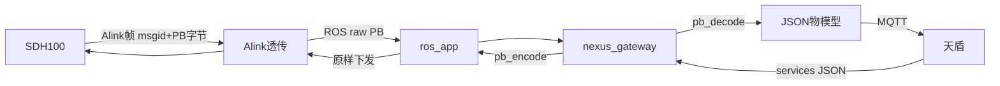
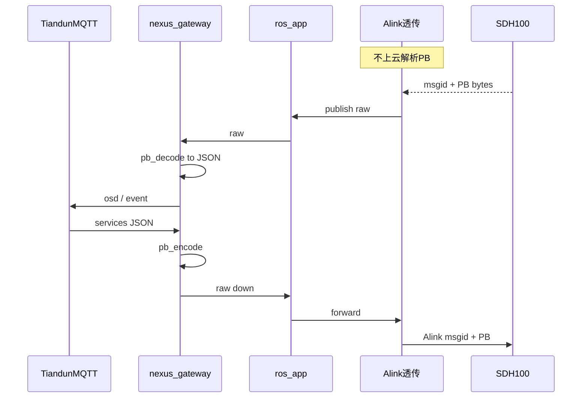

# SFL300 SDH100 ↔ 天盾：职责梳理与方案

## 背景结论（先对齐认知）

- **SFL300 对外名；仓库/AGX 主控仍是 SSF100**（`HOST_DEV_TYPE_SSF100 = 0x1b`），小雷达是子设备 `DEV_TYPE_RADAR_SDH100 = 1`。
- **旧链路**：天盾 → **C2 后端**（HTTP 4.14–4.23）→ Alink → AGX 透传 → SDH100。
- **新链路（已拍板）**：无 C2（仅标定保留）→ AGX 内嵌原 C2 翻译，但 **翻译落在 nexus_gateway**，不在 Alink 业务层解析各 msgid。

### 已拍板：透传架构（SFL300 小雷达上云）

| 层级 | 职责 |
|------|------|
| **Alink / ros_app（SSF100）** | **不解析、不按业务注册**雷达各消息内容；收到 Alink 帧后把 **msgid + PB 原始 payload** 原封不动丢到 ROS |
| **ROS** | 承载 raw PB（含 sn/sock/msgid 元数据即可） |
| **nexus_gateway** | **pb_decode** → 转天盾 JSON → MQTT 上云；下行则 JSON → **pb_encode** → ROS → Alink 原样下发雷达 |



**与现状差异**：陈俊臣链路是 Alink 已 `pb_decode` → `/radar_state`（结构化 ROS）→ nexus 只组 JSON；**SFL300 目标改为** Alink 不解码，**nexus 首次解码**。nexus 当前 **未链 nanopb**，P0 需引入 `radar.pb` + `pb_decode/encode`。

**边界**：若融合/标定等本地逻辑仍要读雷达位姿，属另路消费者（可继续本地 decode 或后续再收）；**上云路径**严格按上表透传。

---

## 仓库现状（SDH100）

| 层次 | 现状 | 关键路径 |
|------|------|----------|
| 设备 Alink PB | 0x10/12/14 侦测跟踪、**0x20 `RadarState`**、**0xB0/B1 `RadarC2Config`**、Mask **V1** 0xB2–B4、城市仅 **0x0104 `CityModeLearningEnable`** | [`radar.proto`](src/srv/alink/devices_pb/radar/radar.proto)、[`alink_track.cpp`](src/srv/alink/command/track/alink_track.cpp) |
| C2 透传（旧） | `radar_v2_transfer_commands` 已含 **0x20/B0–B6/0104/0105/1101/1102**（ opaque 转发，AGX 可不解码） | [`radar_network.cpp`](src/app/radars_network/radar_network.cpp) |
| 位姿/启停 | `SDH100_set_position*`、`SDH100_set_detect_enable*`、0x73 位姿 → 0xB0 | [`alink_system.cpp`](src/srv/alink/command/system/alink_system.cpp)、[`alink_track.cpp`](src/srv/alink/command/track/alink_track.cpp) |
| 上报到 ROS | 0x20 decode → `/radar_state` | `ros_app_publish_radar_state` |
| **天盾 MQTT（陈俊臣链路）** | `/radar_state` → `OnRadarState` → `BuildSdh100Status` → `thing/product/{sn}/osd`，**cloudType=1008**，method=`device_heart` | [`RosDataBridge.cpp`](ros_ws/src/nexus_gateway/src/ros/RosDataBridge.cpp)、[`ThingModelBuilder.cpp`](ros_ws/src/nexus_gateway/src/protocol/ThingModelBuilder.cpp)、[`SubDevicePublisher.cpp`](ros_ws/src/nexus_gateway/src/service/SubDevicePublisher.cpp) |
| 天盾雷达配置服务 | 已有 `get_radar_config` / `set_radar_config`，但走 **DPH 0xA6 / radarsListCfg**，**不是** SDH100 统一配置 0xB0/B1 | [`CloudCommandHandler.cpp`](ros_ws/src/nexus_gateway/src/service/CloudCommandHandler.cpp)、`ExecuteSetRadarConfig` |

PTZ 类比：0xEC → `/ptz_osd_info` → nexus OSD（物模型），**不是**简单照搬 C2 msgId `1000035` 字符串；SDH100 同理，已落地的是 **type=1008 OSD**，不是 msgId `1000001` PB 信封。

---

## 以 C2 4.14–4.22 为基准：radar.proto 字段级对照（是否要更新）

**判定规则**：以你贴的 **C2 协议 4.14–4.22** 为「要支持的完整能力」；对照仓库 [`radar.proto`](src/srv/alink/devices_pb/radar/radar.proto)。缺字段/缺消息 → **要更新**；已有同 tag/同类型 → **可继续用（增量追加，不改旧 tag）**。

**关于雷达协议文档（固定字节表）**：你贴的 0xB0 固定布局表（Sn 32B、Version 64B…）是**旧版非 PB / 偏旧文档**。当前 AGX↔雷达走 **nanopb**，且仓库 PB 已有 `clutterMode=21`，比该固定表还新。**以 C2 4.14 PB + 仓库 `radar.proto` 对照为准**，不以该旧固定表砍字段。

---

### 4.14 统一设置 0xB0 — `RadarSetConfigRequest` vs `RadarC2Config`

| tag | C2 字段 | 仓库 `RadarC2Config` | 结论 |
|-----|---------|----------------------|------|
| 1 | sn | 有 | OK |
| 2 | version | 有 | OK |
| 3–8 | longitude…rolling | 有 | OK |
| 9–12 | ele/azi ScanCenter/Scope | 有 | OK |
| 13–19 | radarScanRadius…tChannel | 有 | OK |
| 20 | mode | 有 | OK |
| 21 | clutterMode | 有 | OK |
| **22** | **imuHeight** | **无** | **要追加** |
| **23** | **enableCityMode** | **无** | **要追加** |
| **24** | **microDopplerFlag** | **无** | **要追加** |
| **25** | **aziScanStart** | **无** | **要追加** |
| **26** | **aziScanEnd** | **无** | **要追加** |
| **27** | **eleScanStart** | **无** | **要追加** |
| **28** | **eleScanEnd** | **无** | **要追加** |

**应答** `RadarSetConfigResponse` vs `RadarC2SetConfigRsp`：`status` + `repeated RadarC2ErrCode` — **OK，不必改**。

**4.14 结论**：消息可继续用；**必须增量更新**下列 7 个 optional（建议 tag 与 C2 一致 22–28）：

```protobuf
optional double imuHeight = 22;
optional uint32 enableCityMode = 23;
optional uint32 microDopplerFlag = 24;
optional float aziScanStart = 25;
optional float aziScanEnd = 26;
optional float eleScanStart = 27;
optional float eleScanEnd = 28;
```

---

### 4.15 统一查询 0xB1 — `RadarGetConfigResponse` vs 同一 `RadarC2Config`

**C2 已修订（2026-07）**：Get 响应去掉原 `versionType=20`，改为与 Set 一致的 **`mode=20`**，并含 tag 22–28。至此 **4.14 Set 与 4.15 Get 字段布局一致**，可共用设备侧 `RadarC2Config`。

请求仅 `sn`：设备侧 0xB1 一般不单独建 Req 消息，**OK**。

| tag | C2 Get 字段 | 仓库 `RadarC2Config` | 结论 |
|-----|-------------|----------------------|------|
| 1–19 | sn…tChannel | 有 | OK |
| 20 | **mode**（uint32） | 有 | OK（旧版 versionType 冲突已消除） |
| 21 | clutterMode | 有 | OK |
| **22–28** | imuHeight…eleScanEnd | **无** | **同 4.14，要追加** |

**4.15 结论**：与 4.14 **同一批 7 个字段（22–28）要追加**；Set/Get 共用一份 `RadarC2Config` 即可，无需再为 versionType 做特殊处理。

---

### 4.16 心跳 0x20 — `RadarState`（C2）vs `RadarState`（proto）

| C2 字段 | 仓库 | 结论 |
|---------|------|------|
| radarLLA / attitude / vAttitude / aAttitude | 有（嵌套 message） | OK |
| status, sn, version, electricity, sysStatus, timestampUs | 有 | OK |
| ele/azi ScanCenter/Scope, radarScanRadius | 有 | OK |
| gpsSOG, gpsSpeed | 有 | OK |
| imuHeight | 有，但名为 **`imuHight`**（tag18） | **保留 tag18**（改名破坏兼容）；文档/映射层当 imuHeight |
| **operatingTime** | **无** | **要追加** |
| **faultCount** | **无** | **要追加**（或仅依赖 repeated 长度） |
| **faultList / FaultData** | **无** | **要追加** message + repeated |

**4.16 结论**：主体可继续用；**要更新**：新增 `operatingTime`、`FaultData`、`faultList`（及 options 的 max_count）；`imuHight` 不改 tag。

---

### 4.17–4.19 Mask V2 — 0xB5 / 0xB6

仓库现有 Mask **V1**（`RadarC2Mask` / `RadarMaskZoneInfo`，0xB2–B4）与 C2 Mask V2 **模型不同**，**不能当 V2 用**。

**已拍板（以 C2 为准）**：**不再保留 V1 兼容路径**。SFL300/SDH100 只做 Mask V2（0xB5/B6）；proto 以 C2 4.17–4.19 新增 V2 消息为准，旧 V1 消息/透传（0xB2–B4）在本需求范围内按废弃处理（实现时从 SDH100 业务路径移除或不再注册，不双轨并存）。

C2 Mask **V2**（多边形点 + height/velocity/rcs + cmd 0x00/01/02/AA/BB/FF）—— **整套消息缺失**：

- **要新增**：`RadarMaskPointV2`、`RadarMaskInfoV2`、Set/Get/Report 等（字段严格按 C2 4.17–4.19）
- **options**：`maskInfo` max_count≈20、`points` max_count≈20、`maskName` max_size=32 等
- **清理**：SDH100 侧不再依赖 `RadarC2Mask` / 0xB2–B4

**4.17–4.19 结论**：**必须用 V2 替换 V1（以 C2 为准，不保留旧 V1）**。

---

### 4.20–4.23 城市模式（C2 目录已重编号）

| C2 节 | 含义 | cmd | 仓库 | 结论 |
|-------|------|-----|------|------|
| **4.20** | 启动/停止学习 | 0x0104 | 仅 `CityModeLearningEnable { enable }`，无 sn | sn 在 Alink 寻址；**enable OK**；若 payload 要带 sn 再补 |
| **4.21** | 获取学习信息 | 0x0105 | **整段无** | **要新增** 完整 Rsp |
| **4.22** | 上报学习进度 | 0x1101 | **无** | **要新增** `{ progress }` |
| **4.23** | 学习完成/失败上报 | 0x1102 | **无** | **要新增**（字段同 Get Rsp data） |

（注：早前文档曾把「获取学习信息」也标成 4.20；以你最新目录 **4.20 启停 / 4.21 获取 / 4.22 进度 / 4.23 完成失败** 为准。）

**4.20–4.23 结论**：**0x0104 部分可用；0x0105/1101/1102 要新增消息**。

---

### 总表：要不要改 proto？

| 节 | 要更新？ | 标出的缺口 |
|----|----------|------------|
| **4.14 0xB0** | **是（增量）** | **imuHeight, enableCityMode, microDopplerFlag, aziScanStart/End, eleScanStart/End** |
| **4.15 0xB1** | **同 4.14** | 同上补 22–28；C2 已改为 mode=20，与 Set/仓库一致 |
| **4.16 0x20** | **是（增量）** | **operatingTime, faultList(+FaultData)**；imuHight 保留 |
| **4.17–4.19** | **是（V2 替换 V1）** | 整套 MaskV2；**不保留** 0xB2–B4 V1 |
| **4.20–4.23** | **是（新消息）** | 0x0105/1101/1102 + 可选 0x0104 应答 |

改完后：更新 [`radar.options`](src/srv/alink/devices_pb/radar/radar.options) → 重生 `radar.pb.c/.h` → 与雷达固件字段号对齐联调。

---


## 你要做什么（职责清单）

**核心**：把原 C2「译码/组包」搬进 [`nexus_gateway`](ros_ws/src/nexus_gateway/)；Alink 只做 **字节透传管道**。

1. **透传管道（Alink + ROS）**  
   - 上报：SDH100 Alink 帧 → 不 `pb_decode` → ROS topic（建议携带 `msgid`、`sn`/`dev_id`、`payload[]`）。  
   - 下行：订阅 ROS 下行 topic → Alink 按 msgid 原样发往对应雷达 socket。  
   - **不为上云去注册/解析** 0x20/B0/B1/B5/B6/0104… 的业务语义（可仅维护「允许透传的 msgid 白名单」）。

2. **nexus_gateway（解码 + 上云 + 下行编码）**  
   - 链入 nanopb + 更新后的 `radar.pb.*`。  
   - 按 msgid：`pb_decode` → 映射天盾 JSON（OSD/event/services_reply）。  
   - services 下行：JSON → `pb_encode` → 发 ROS 下行 topic。  
   - 覆盖 4.14–4.23（配置/心跳/MaskV2/城市）；**勿复用** DPH 的 `get/set_radar_config`（0xA6）。

3. **proto**  
   - 仍按 C2 对照更新（见上节字段表）；**主要消费者是 nexus**，Alink 上云路径可不链接业务 decode。

4. **边界**  
   - 标定仍可走 C2；本地融合若仍依赖 `/radar_state`，与上云透传解耦，避免在 Alink 为上云再解一套。

---

## 推荐实现方案（已选定路径）

**选定**：
1. **管道**：Alink/ROS **opaque PB 透传**  
2. **翻译**：**仅 nexus_gateway** pb↔JSON↔MQTT  
3. **协议基准**：C2 4.14–4.23；Mask **仅 V2**

**相对陈俊臣现状的迁移**：现有「Alink decode → `/radar_state` → BuildSdh100Status」可作为参考字段映射；SFL300 上云应改为「raw PB → nexus decode → 同款/扩展 JSON」。是否废弃旧 `/radar_state` 上云入口，实施时二选一收敛，避免双路上云。

### 目标数据流



### 分期

| 阶段 | 内容 |
|------|------|
| **P0** | 透传管道 + nexus 引入 nanopb；0x20 心跳 decode→OSD；0xB0/B1 services encode/decode（proto 补 22–28） |
| **P1** | Mask V2 0xB5/B6 透传 + nexus 编解码；废弃 V1 |
| **P2** | 城市 4.20–4.23（0x0104/0105/1101/1102） |

### P0 主要改动点（实施时）

- **ros_app / alink**：新增或复用 raw 雷达 PB topic（上行/下行）；透传白名单含 0x20、0xB0、0xB1…  
- **nexus_gateway**：CMake 链 `radar.pb` + `pb.h`；按 msgid 分发 decode；`ThingModelBuilder` 从 PB 结构填 JSON（可复用现 `BuildSdh100Status` 字段名）。  
- **CloudCommandHandler**：SDH100 专用 method → encode `RadarC2Config` → 下行 ROS。  
- **proto**：[`radar.proto`](src/srv/alink/devices_pb/radar/radar.proto) 按 C2 增量更新并重生 `.pb.*`（nexus 与可选本地共用同一份）。

### Proto 更新策略（已定）

- 0xB0/B1/0x20：**追加** optional，不改旧 tag。  
- Mask：**仅 V2**；SDH100 **废弃 V1**。  
- 城市 4.20–4.23：补齐消息供 **nexus** decode。  
- Alink **不必**为上云实现各 msgid 的业务 handler。

---

## 风险与需确认

1. 天盾物模型（type=1008）vs C2 msgId 信封——默认物模型 JSON。  
2. 本地融合/标定是否仍依赖 Alink 侧 decode 的 `/radar_state`——与上云透传并存时勿混用两套字段源。  
3. ROS raw 消息定义（`uint8[]` + msgid）需与 ros_app / nexus 约定一致。
