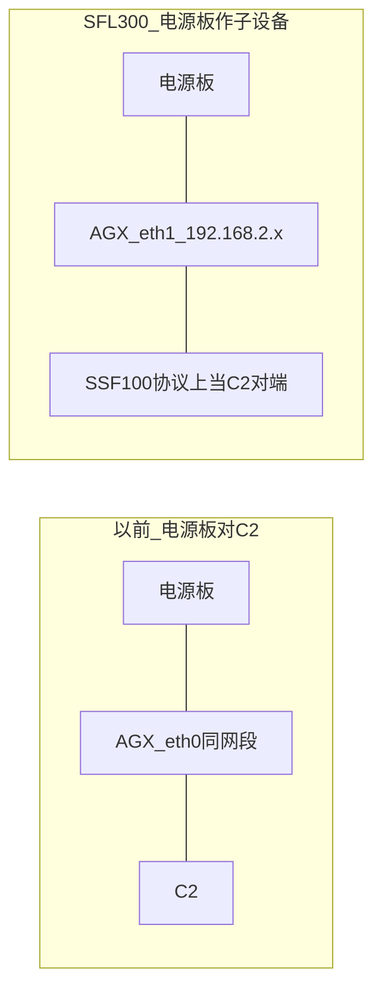
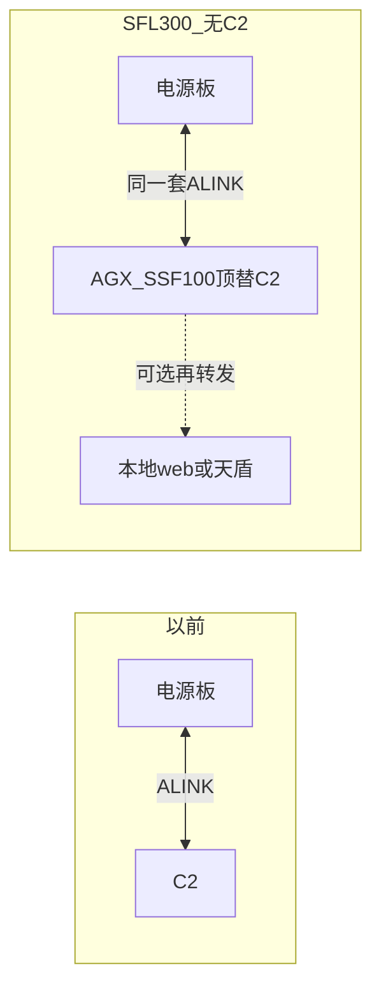
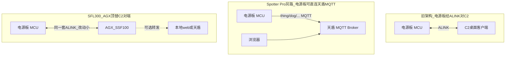
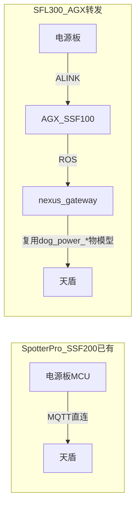
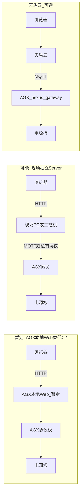
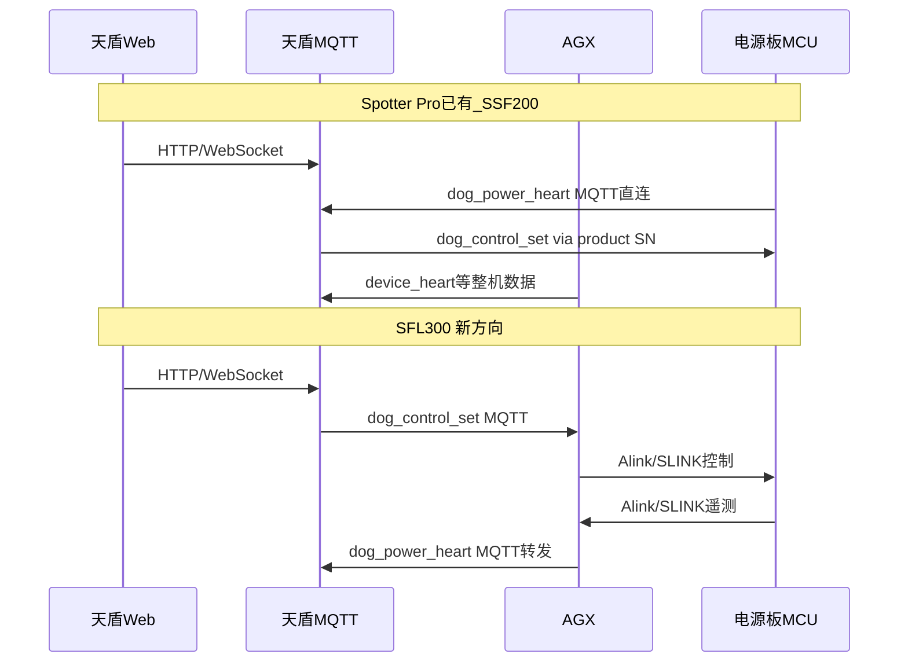

# 电源板现状与 BS 架构分析

## 1. 硬件与产品映射

**SFL300 在 AGX / 仓库里就是 SSF100**（`HOST_DEV_TYPE_SSF100` / `ALINK_DEV_ID_SSF100 = 0x1b`）。SFL300 只是对外产品名，**不是**独立的 `HostDevType` / `ALINK_DEV_ID`。

| 产品对外名称      | 仓库内 / AGX 主设备类型               | 系统组成                     | 电源板硬件      |
| ----------- | ----------------------------- | ------------------------ | ---------- |
| Spotter Pro | SSF200 (0x23) / SSF210 (0x34) | 中程雷达 + 中程 PTZ + STF200 等 | **同一块电源板** |
| **SFL300**  | **SSF100 (0x1b)**（AGX 主控即此类型） | 见下表                      | **同一块电源板** |

**SFL300 产品包组成（AGX 侧主设备固定为 SSF100）：**

| 组成部分        | 说明                                                    |
| ----------- | ----------------------------------------------------- |
| SSF100      | **AGX 主控**（`HOST_DEV_TYPE_SSF100`）；SFL300 在 AGX 中即此类型 |
| 和普 PTZ Z201 | PTZ **子设备**（`DEV_TYPE_PTZ_HEPU_Z201 = 37`）            |
| 1~4 个小雷达    | 近程雷达子设备                                               |
| 电侦          | Tracer / 电侦子设备                                        |
| Hunter V    | **车载无人机反制器**（谭工确认；非打击炮）                               |

聊天已确认：SFL300 与 Spotter Pro **电源板硬件一致**；差异在组网上下文。开发一律按 **SSF100**（即 SFL300 的 AGX 主控）+ 各子设备，**不新增**设备类型枚举。

### 1.2 Spotter Pro 已有能力（背景，非 SFL300 待开发项）

**Spotter Pro 产品线包括 SSF200 与 SSF210**，下列能力在 Spotter Pro 侧**已是成熟功能**，本文分析 SFL300 时仅作对照背景：

| 已有功能                          | 说明                                                            |
| ----------------------------- | ------------------------------------------------------------- |
| 电源板 MCU ↔ C2                  | 经 **ALINK**，与罗工对齐一致                                           |
| Spotter Pro（SSF200）整机 MQTT 上云 | **天盾**直连，电源板侧 `dog_power_heart` / `dog_control_set` 等物模型上报与控制 |

**SFL300 待做的是另一件事**：无 C2 时由 **AGX（SSF100）顶替 C2 协议对端**，电源板作为 **AGX 子设备**接入（见 §1.3），不是重做 Spotter Pro 已有链路。

### 1.3 电源板作 AGX 子设备：类型 + 网段（与接 C2 的差异）

| 点       | 结论                                                                                                                                                            |
| ------- | ------------------------------------------------------------------------------------------------------------------------------------------------------------- |
| 子设备类型   | **需要新增** `SubDevType`（当前 `[configCommDef.h](public/config/configUtils/configCommDef.h)` 无电源板项，最大已到 Z201=37）。类型码需与协议/配置/发现路径对齐（可参考 spotter-device-guide 子设备清单） |
| 物理接入网卡  | **AGX `eth1`，2 网段**（仓库惯例 `192.168.2.0/24`，如 AGX `192.168.2.132`；sysmonit 亦按 eth1 扫此网段）                                                                        |
| 以前接 C2  | 电源板与 C2 在 **AGX `eth0` 同一网段**（与上位机同网）                                                                                                                         |
| 现在接 AGX | 电源板进 **子设备网（eth1 / .2.x）**，**不再与 eth0/C2 同网段**                                                                                                                |

**含义澄清：**

- 「SSF100 看成 C2」= **协议角色**（解析/下发同一套 ALINK），**不是**网卡还走 eth0
- 接入实现必须：**绑定 eth1 / 2 网段** + **登记子设备类型** + 结构体接入；发现、配置、`subDevicesCfg` 认新类型（**不必**为电源板上报去改 0x77）

---

| 点            | 结论                                                              |
| ------------ | --------------------------------------------------------------- |
| 历史对接方式       | 电源板**以前就是通过 ALINK 对接 C2**（不是另一套私有协议）                            |
| 无 C2 时怎么做    | **AGX（SSF100）取代 C2 的对端位置**，继续走同一套 ALINK                         |
| 改动量预期        | **AGX 不必另定协议**：把 SSF100 **看成 C2**，按电源板既有协议定义结构体并接入即可            |
| 电气 / AGX 不下电 | **约束成立**。**初步方案：改电源板 MCU 程序**；**最终方案待系统确认**（同步罗工）。**AGX 侧暂不用管** |

**AGX 供电保护（待确认，非软件拍板）：**

- 业务上：一键断电 / 分路开关 **不得切断 AGX 自身供电通道**，否则网关掉电后无法再上电、也无法上报。
- 罗工关注点：硬件互锁、通道屏蔽、软件禁控、还是「总开关不含 AGX 路」——需系统工程师定保护方案。
- 软件侧可先约定：控制命令里 **不暴露 / 不响应「切断 AGX」**；最终以硬件保护为准。

---

## 2. 三种通信架构对比

### 2.1 Spotter Pro 已有：电源板 ↔ C2（经 ALINK）

- **状态**：**已有功能**（电源板 MCU 固件 + C2 对端均已实现）
- **协议**：电源板与 C2 走 **ALINK**（罗工确认）；文档见 [Spotter Pro 电源板 SLINK V1 协议](https://vxr5wm8r80r.feishu.cn/docx/Htxod04pcoMG2ixPO2KcIXThnSb)
- **拓扑**：C2 与电源板局域网直连；C2 内置电源监控/开关 UI

### 2.2 Spotter Pro（SSF200）已有：电源板 ↔ 天盾 MQTT

- **状态**：**已有功能**（电源板 MCU 内置 MQTT 客户端，SSF200 场景已上线）
- **协议**：天盾 MQTT 物模型
- **上行**：`dog_power_heart` / `dog_power_alarm`（`thing/dog/spotter-pro/.../osd`）
- **下行**：`dog_control_set`（`thing/product/{SN}/services`）
- **说明**：与 2.1 ALINK 对 C2 **可并存**于 Spotter Pro 不同部署；**不是 SFL300 要新开发的路径**

### 2.3 SFL300 待做：电源板 ↔ AGX（顶替 C2）↔ 可选上天盾

| 链路         | 方向              | 路径                                |
| ---------- | --------------- | --------------------------------- |
| 本地（核心，改动小） | 电源板 ↔ AGX       | **复用原 C2 侧 ALINK**（AGX 实现原 C2 对端） |
| 下行（可选）     | 天盾/本地 web → 电源板 | MQTT/HTTP → ROS → ALINK           |
| 上行（可选）     | 电源板 → 天盾/本地 web | ALINK → ROS → MQTT/HTTP           |

已确认：SFL300 **不做 C2**；无天盾时至少 **电源板 ↔ AGX**。

### 2.4 若 AGX(SSF100) 转发上天盾：复用物模型 + nexus_gateway 顶替 MCU MQTT

**结论：可以，且建议这样做。**

| 对比            | Spotter Pro（SSF200）已有                                     | SFL300 / AGX(SSF100) 转发                     |
| ------------- | --------------------------------------------------------- | ------------------------------------------- |
| MQTT 谁发       | **电源板 MCU** 直连天盾                                          | `**nexus_gateway`** 代发（顶替 MCU）              |
| method / JSON | `dog_power_heart` / `dog_control_set` / `dog_power_alarm` | **复用同一套**（4.8.2.5 / 4.8.4.12 / 4.8.7）       |
| 本地采集          | MCU 自采                                                    | 电源板 → **ALINK** → AGX → ROS → nexus_gateway |
| 控制下行          | 天盾 → MCU MQTT                                             | 天盾 → nexus_gateway → ROS → ALINK → 电源板      |

**AGX 侧分工：**

1. **alink / ros_app**：接电源板 ALINK（顶替 C2 对端），出 ROS 遥测/控制 topic
2. `**nexus_gateway`**：订阅 ROS → 组 `dog_power_heart` / `dog_power_alarm` 发 `thing/dog/.../osd`；收 `dog_control_set`（`thing/product/{SN}/services`）→ 转 ROS → ALINK

**实现时注意（待与天盾/产品确认）：**

- Topic 路径现写 `thing/dog/spotter-pro/{SpotterProSn}/osd`、`gateway` 字段偏 Spotter Pro；SFL300/SSF100 是否仍用 `spotter-pro` 前缀，还是改为 SSF100/产品 SN，需天盾侧确认（**JSON method 与 data 结构可先原样复用**）
- `power_switch` / `channel_metrics` 与 SFL300 分路映射对齐即可；**AGX 不下电路径由 MCU/系统保证，不在 AGX 做禁控**
- 图四若裁剪上报（如只报 3 路电流），是 data 字段子集，仍属同一 method

---

## 3. SFL300 显控路径：去掉 C2 后怎么走

以下针对 **SFL300 新场景**；Spotter Pro 侧电源板经天盾 MQTT 上 Web 已是既有能力（见 §1.2）。

### 3.1 SFL300：电源板不直连天盾，须经 AGX

聊天里的完整逻辑链：

1. **去掉 C2**：显控入口改为 **本地 web（暂定，以后可能由 AGX 本地 Web 替代 C2）** 和/或 **天盾**；不再经 C2 桌面直连电源板
2. **Spotter Pro 已有做法**（背景）：电源板 MCU 内置 MQTT 直连天盾——**SSF200 已上线，非待开发**
3. **SFL300 新做法**：电源板**不直连天盾**，只连 AGX；路径为 **电源板 ↔ AGX ↔ 天盾**，或无天盾时仅 **电源板 ↔ AGX**
4. **SFL300 电源板范围**：已确认**不再关心 C2**
5. 若 AGX 未做 ALINK 接入/转发，显控侧**看不到、控不了**电源板

### 3.2 「本地 web」落点（暂定）

**短答：** 去掉 C2 后显控剩 **本地 web + 天盾**；本地 web **暂定**以后可能由 **AGX 本地 Web 替代 C2**，落点尚未定稿。

周益辉原话：「以后去掉 c2 了，后面只有**本地 web 和天盾**，钟工他们准备给咱们来个**协议转换**。」

| 说法           | 含义                                                       |
| ------------ | -------------------------------------------------------- |
| 「上位机在 AGX」   | AGX 跑设备侧协议栈/网关（电源板 ALINK 对端、可选 nexus_gateway 转发）         |
| 「本地 web」（暂定） | 客户侧不依赖公有云天盾也能用的 Web 显控；**可能**由 AGX 本地 Web 替代 C2，待产品/钟工确认 |
| 「协议转换」       | 钟工侧把设备协议转成 Web/天盾可用形态；AGX 侧仍要做 **电源板 ↔ AGX** 接入          |
| 天盾           | 对客户可选；有则 AGX 经 nexus_gateway 复用 `dog_power`_* 物模型        |

「本地 web」可能落点（**待确认**）：

- **暂定 A**：AGX **本地 Web 替代 C2**（仓库已有运维向 `sysmonit`，非产品电源显控页；产品页若落 AGX 需另建/扩展）
- **可能 B**：本地 web 在现场另一台机，AGX 只做网关
- **共同点**：AGX 至少完成 **电源板 ALINK 接入**；有天盾时经 **nexus_gateway** 转发

> 落点需跟钟工/产品再确认；与电源板 ALINK 接入可并行推进。

### 3.3 与 C2 时代的对比

| 维度             | C2 时代                 | SFL300 新方向（已确认）                                |
| -------------- | --------------------- | ---------------------------------------------- |
| 用户界面           | C2 桌面原生 UI（CS）        | **本地 web + 天盾**（去掉 C2）                         |
| 天盾             | 可选 / 与 C2 并存          | 可选；无天盾时至少 **电源板 ↔ AGX**                        |
| 电源板连接对象        | C2 或天盾直连（Spotter Pro） | **仅 AGX**（不直连 C2/天盾）                           |
| SFL300 是否还做 C2 | —                     | **不做**                                         |
| 协议             | ALINK 对 C2            | **同一套 ALINK，对端改为 AGX**；对外可选再转本地 web / 天盾       |
| 多设备接入          | C2 逐设备连接              | AGX 统一网关                                       |
| AGX 供电         | C2 不在电源板上，无此问题        | **不得切断 AGX**；初步改 **MCU 程序**，最终待系统确认；**AGX 不管** |

## 4. ptz100_agx 仓库：与本次相关 / 无关

> **本次范围：仅 SSF100（SFL300）电源板子设备接入。**  
> **要做**：eth1 子设备类型 + ALINK 结构体 +（可选）nexus_gateway `dog_power`_*。  
> **解耦但勿改坏**：下列路径 **SSF200 等仍在用**——本次不把它们当 SSF100 电源板接入手段，**禁止当死代码删改**。

### 4.1 与本次解耦、但 SSF200 仍在用的路径

| 路径                                | 位置                                     | 说明                                                        |
| --------------------------------- | -------------------------------------- | --------------------------------------------------------- |
| PT100 / 主机温、「电源控制单元由电源板自行上报」      | `alink_system.cpp`                     | **SSF200 继续使用**。不是 SSF100 eth1 电源板遥测通道；**本次接入不要走这条，也勿改坏** |
| cmd 4/6「移交电源板 MCU，AGX skip」       | `alink_efence.cpp` / `system_work_set` | Spotter/C2 一键断电语义；SSF100 电源控制走新 ALINK 子设备路径，勿当本次入口去改      |
| 0x77 心跳 power/current/temperature | `ros_app.cpp`                          | 上报 C2；SFL300/SSF100 无 C2 → **本次不必补**。其他机型若仍报 C2，保持原样      |

### 4.2 本次真正缺口（仅 SSF100）

| 能力                                 | 仓库状态            |
| ---------------------------------- | --------------- |
| 电源板 `SubDevType`                   | **无**（需新增）      |
| eth1 / 192.168.2.x 上电源板发现与链路       | **未按电源板接入**     |
| 电源板 ALINK 结构体解析/下发（协议角色当 C2）       | **无**           |
| ROS topic 承载电源板遥测（供本地 web / nexus） | **无**（不依赖 0x77） |
| nexus_gateway `dog_power`_*        | **无**（可选上天盾时做）  |

### 4.3 协议文档位置（飞书，仓库仅索引）

- 电源板 SLINK/ALINK：[飞书 Docx](https://vxr5wm8r80r.feishu.cn/docx/Htxod04pcoMG2ixPO2KcIXThnSb)
- Spotter Pro 上云协议：[飞书 Wiki](https://vxr5wm8r80r.feishu.cn/wiki/MYTCwTmzviV8YnkuYCMces2fnSe)

---

## 5. Spotter Pro vs SFL300 电源板「变点」总结

| 变点     | Spotter Pro（已有）                        | SFL300（待做）                  |
| ------ | -------------------------------------- | --------------------------- |
| 产品线    | SSF200 + SSF210                        | **SFL300 = AGX 上的 SSF100**  |
| 电源板对端  | C2（ALINK）**已有**；SSF200 MQTT 上天盾 **已有** | **AGX 顶替 C2**（同一套 ALINK）    |
| 协议改动量  | —                                      | 预期不大改                       |
| 显控入口   | C2 / 天盾 Web                            | 本地 web + 天盾（去掉 C2）          |
| AGX 供电 | C2 不在电源板上                              | **MCU/系统侧**保证不下电；**AGX 不管** |
| AGX 仓库 | Spotter Pro 路径不经过 SSF100 顶替            | **对端尚未接上**                  |

---

## 6. AGX 侧实现原则（SSF100 看成 C2，不另定协议）

**结论：AGX 内部不用定义新 ALINK 协议。** 电源板仍按既有 ALINK 说话；SSF100 **协议角色**当 C2。但物理上是 **eth1 子设备**，还要 **新增子设备类型**。

| 要做                                           | 不要做                    |
| -------------------------------------------- | ---------------------- |
| **新增电源板 `SubDevType`**（当前枚举无此项）              | 不登记类型、匿名硬编码            |
| 链路绑 **eth1 / 192.168.2.x**（子设备网）             | 仍按 eth0、与原 C2 同网段去找电源板 |
| 按电源板↔C2 协议定义 **结构体**，`alink` 解析/下发           | 另起一套 AGX↔电源板私有协议       |
| 按需桥到 ROS / `nexus_gateway`（复用 `dog_power_`*） | 另发明 MQTT 物模型           |

**落地步骤：**

1. **定子设备类型码** → `configCommDef.h` / 消息枚举副本 / `subDevicesCfg` / eth1 发现
2. **网卡**：电源板在 eth1 的 2 网段；收发绑定 eth1
3. **ALINK 消息表** → 结构体 → SSF100 协议对端收发
4. **按需** ROS / nexus_gateway（复用 `dog_power`_*）

**明确不做（且勿破坏 SSF200）：**

- 不把 PT100/主机温路径当 SSF100 电源板接入；**SSF200 仍在用，禁止当残留删改**
- 不为 SSF100 去补 0x77 电源字段；不拿 efence 4/6 当本次电源控制入口

**前置依赖**：类型码 + 电源板 IP/发现 + ALINK 协议全文 +（若上天盾）Topic/SN。AGX 不下电跟系统/MCU。

---

## 7. 结论

**现状：**

- **本次需求范围**：**仅 SSF100（SFL300）** 电源板作 eth1 子设备接入
- **SSF200 仍在用**：PT100/主机温（含「电源控制单元由电源板自行上报」）——**勿当死代码动**；SSF100 电源板遥测另走 ALINK 子设备
- **SSF100 本次不做**：为电源板补 0x77；用 efence 4/6 当控制入口

**「电源板不能给 AGX 断电」：**

- 约束成立；**初步改电源板 MCU 程序**，**最终待系统确认**（同步罗工）
- **AGX 侧暂不用管**——不在 AGX 实现供电保护；只做协议接入与可选转发

**若 AGX 转发上天盾：**

- **可以复用** Spotter Pro 上云协议 4.8.2.5 / 4.8.4.12 / 4.8.7（`dog_power_heart` / `dog_control_set` / `dog_power_alarm`）
- AGX 侧由 `**nexus_gateway` 组包发 MQTT**，**顶替电源板 MCU 直连天盾**；本地仍走 ALINK → ROS → nexus_gateway
- Topic/产品前缀是否仍写 `spotter-pro` 需与天盾确认；method + data 结构建议先原样复用

**BS / 本地 web：** 仍是显控入口问题；与「ALINK 对端从 C2 换到 AGX」正交。钟工协议转换、本地 web 落点可并行确认。