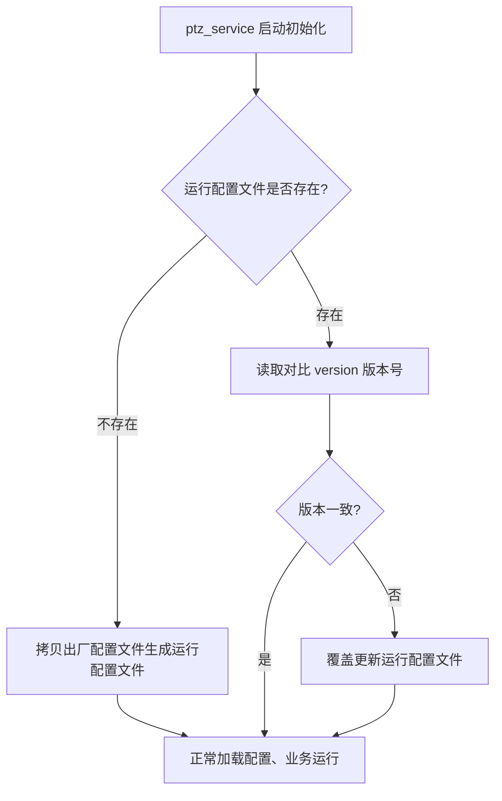

# FOV 配置表自动更新机制

## 一、需求说明

1. 软件部署完成后，用户可手动修改运行配置文件参数，正常重启不丢失自定义配置。
2. 软件升级后，支持配置全量更新，兼容配置 Key 增删、Value 修改、结构迭代等所有变更场景。

## 二、基础配置规则

### 1、双文件机制

- **出厂配置文件**（升级同步更新）：`ptz100_agx/config/ptz/ptzHepuViewCfg.yaml`
- **运行配置文件**（可手动修改、业务生效）：`/home/skyfend/config/ptzHepuViewCfg.yaml`

### 2、版本管控

所有配置文件顶层唯一管控字段 **version**，版本递增代表配置结构/内容发生变更，示例 "**version:** 1.0.0"

### 3、更新触发条件

运行配置文件不存在 **或** 运行配置文件 `version` != 出厂配置文件 `version`，触发全量覆盖更新。

### 4、用户配置保留规则

运行配置文件存在且版本号一致时，用户手动修改的配置永久保留，重启不重置。

## 三、更新方案

### 方案：ptz_service 服务启动校验（采用）

**执行时机**：ptz_service 初始化启动阶段

**执行流程**：

1. 服务启动后检测运行配置文件是否存在；
2. 文件不存在：自动拷贝出厂配置文件生成运行配置文件；
3. 文件已存在：读取并对比出厂配置文件与运行配置文件的 version 版本号；
4. 版本一致：正常加载配置，服务持续运行；
5. 版本不一致：覆盖更新运行配置文件，随后加载最新配置继续运行。

**时序流程**：

