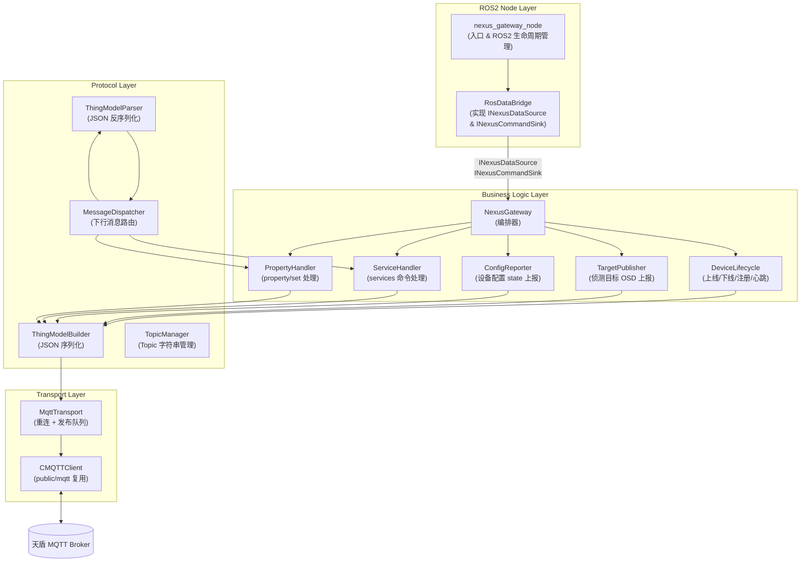
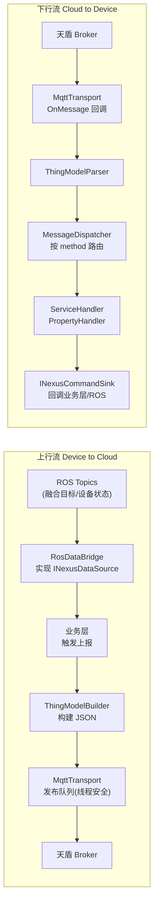
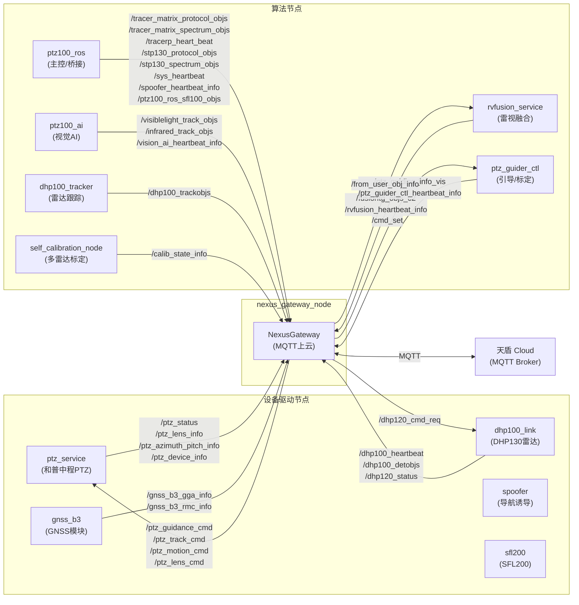
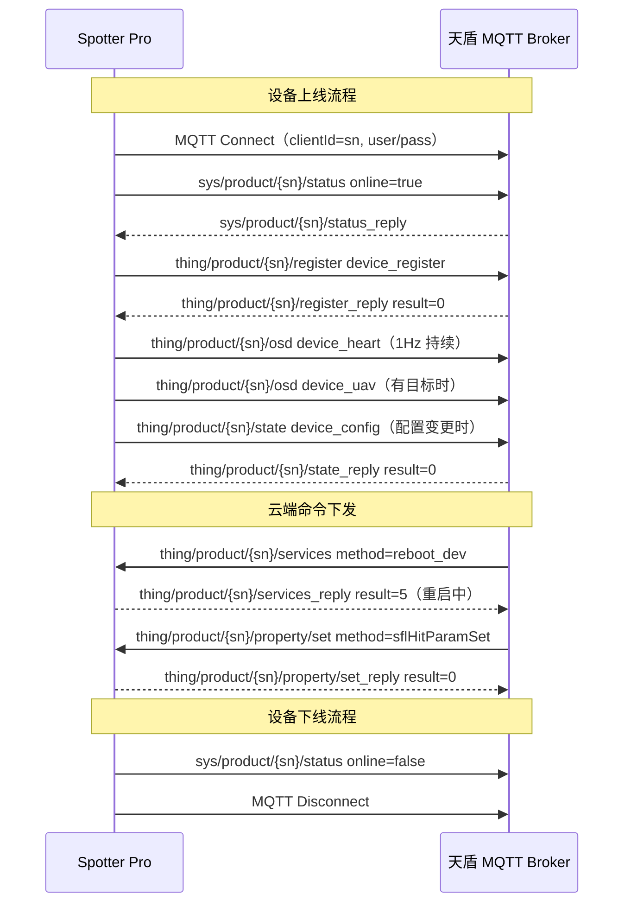

# NexusGateway 开发方案

> **项目**：Spotter Pro 直接上云（直连天盾云平台）
> **模块名称**：NexusGateway
> **文档版本**：v1.1
> **日期**：2026-03-31

---

## 目录

1. [项目背景与目标](#1-项目背景与目标)
2. [现有代码分析](#2-现有代码分析)
3. [架构设计](#3-架构设计)
4. [ROS Topic 订阅/发布总表](#4-ros-topic-订阅发布总表)
5. [模块目录结构](#5-模块目录结构)
6. [核心接口设计](#6-核心接口设计)
7. [实现步骤](#7-实现步骤)
8. [在线/离线生命周期时序](#8-在线离线生命周期时序)
9. [关键风险及应对](#9-关键风险及应对)
10. [实现优先级与工期估算](#10-实现优先级与工期估算)

---

## 1. 项目背景与目标

### 1.1 背景

Spotter Pro 是公司自研的侦测反制一体化设备（设备领域 domain=4，设备类型 type=1016）。天盾是公司平台软件部开发的云平台，功能类似 C2，通过标准 MQTT 物模型协议与设备通信。

**本项目目标**：Spotter Pro 设备通过 MQTT 协议直接连接天盾云平台，实现设备管理、数据上报、云端命令下发等功能，**无 C2 网关中转**。

### 1.2 核心通信关系

由于 Spotter Pro 直接上云，设备本身即充当网关角色，因此：

- `{gateway_sn}` = `{device_sn}` = Spotter Pro 序列号（SN）
- 设备直接与天盾 MQTT Broker 建立长连接

### 1.3 天盾 MQTT Topic 标准

天盾平台定义了两类 Topic 前缀：

| 类别 | Topic 前缀 | 说明 |
|------|-----------|------|
| 基础类 | `sys/` | 通用上云功能，如设备生命周期状态更新 |
| 物模型类 | `thing/` | 物模型功能，围绕 Property、Service、Event 展开 |

**消息公共字段**：

| 字段 | 类型 | 说明 |
|------|------|------|
| `tid` | string | 事务 UUID，长度 < 50，标识一次消息通信 |
| `bid` | string | 业务 UUID，标识跨多次通信的业务流程 |
| `timestamp` | int64 | 消息发送时的 UTC 毫秒时间戳（13位） |
| `method` | string | 物模型方法标识符 |
| `gateway` | string | 网关设备 SN |
| `need_reply` | int | 0=不需要回复，1=需要回复（events topic 使用） |
| `data` | object | 消息具体内容 |

**完整 MQTT Topic 定义**：

| Topic | 方向 | 说明 |
|-------|------|------|
| `thing/product/{sn}/osd` | 设备→云 | 定频属性推送（心跳、目标数据，1条/秒） |
| `thing/product/{sn}/state` | 设备→云 | 按需上报设备配置 |
| `thing/product/{sn}/state_reply` | 云→设备 | 配置上报回复 |
| `thing/product/{sn}/register` | 设备→云 | 设备注册 |
| `thing/product/{sn}/register_reply` | 云→设备 | 注册回复 |
| `thing/product/{sn}/services` | 云→设备 | 云端下发服务命令 |
| `thing/product/{sn}/services_reply` | 设备→云 | 服务命令执行结果 |
| `thing/product/{sn}/events` | 设备→云 | 设备事件上报 |
| `thing/product/{sn}/events_reply` | 云→设备 | 事件回复 |
| `thing/product/{sn}/requests` | 设备→云 | 设备请求（如临时上传凭证） |
| `thing/product/{sn}/requests_reply` | 云→设备 | 请求回复 |
| `thing/product/{sn}/property/set` | 云→设备 | 属性设置命令 |
| `thing/product/{sn}/property/set_reply` | 设备→云 | 属性设置响应 |
| `sys/product/{sn}/status` | 设备→云 | 设备上下线状态更新 |
| `sys/product/{sn}/status_reply` | 云→设备 | 平台响应 |

---

## 2. 现有代码分析

### 2.1 `public/mqtt/MqttClient` —— 可复用，含一处 Bug

**文件路径**：`public/mqtt/MqttClient.h` / `public/mqtt/MqttClient.cpp`

`CMQTTClient` 是对 libmosquitto 的轻量封装，职责单一，结构清晰，**作为传输层直接复用**。

**接口摘要**：

```cpp
class CMQTTClient {
public:
    int  InitClientInfo(const string& clientId, const string& server,
                        uint16_t port, const string& user, const string& passwd);
    bool Connect(uint32_t keepalive);
    bool Disconnect();
    bool Publish(const std::string& topic, const std::string& message);
    bool Subscribe(const std::string& topic);
    int  Start(void);   // 启动 mosquitto_loop_start（后台线程）
    void SetMessageHandler(MQTTMessageHandler handler, void* arg);
    bool IsConnected();
};
```

**已知 Bug**：`Disconnect()` 方法条件逻辑取反，`MOSQ_ERR_SUCCESS` 时错误地返回 `false`：

```cpp
// public/mqtt/MqttClient.cpp:86-93  ← 存在 Bug
bool CMQTTClient::Disconnect()
{
    if(MOSQ_ERR_SUCCESS == mosquitto_disconnect(m_mosq))
    {
        skyfend_log_error("mosquitto_disconnect error."); // 逻辑反了
        return false;
    }
    return true;
}
```

在 `MqttTransport` 封装层内绕过此方法，直接调用底层 API 或修正逻辑。

### 2.2 `electronic_fence/MQTTAgent` —— 不复用，仅参考 topic 格式

**文件路径**：`ros_ws/src/electronic_fence/src/mqtt/MQTTAgent.cpp`（约 2667 行）

| 问题 | 具体表现 |
|------|----------|
| **God Class 反模式** | 单文件近 2700 行，注册、心跳、目标上报、日志上传、OBS 云存储、雷达掩码全堆在一个类 |
| **职责混乱** | MQTT 传输、JSON 构造、业务逻辑、ROS 数据订阅全部耦合在同一个类中 |
| **无重连机制** | 断线后没有指数退避重连逻辑 |
| **硬编码常量** | Topic 字符串、设备类型等散落各处 |
| **线程不安全** | 多处 `Publish()` 调用无互斥锁保护 |
| **可借鉴之处** | JSON 配置加载模式（`InitFromJSON`）、Topic 格式字符串、OSD 字段命名 |

**结论：不复用，重新设计并实现 NexusGateway 模块。**

---

## 3. 架构设计

### 3.1 四层分层架构



### 3.2 数据流向



### 3.3 关键设计原则

| 原则 | 落地方式 |
|------|----------|
| **接口隔离** | 每层之间通过纯虚接口通信，上下层不直接依赖具体类 |
| **单一职责** | 每个类代码量控制在 300 行以内，只做一件事 |
| **线程安全发布** | `MqttTransport` 内置 `std::queue + std::mutex`，消费者线程统一 publish |
| **自动重连** | 断线后指数退避（1s → 2s → 4s → ... → 60s），重连后自动重订阅并触发重注册 |
| **配置驱动** | 所有 server/port/sn/credentials 从 JSON 文件加载，不硬编码 |
| **事件驱动命令处理** | 下行命令通过 `MessageDispatcher` 按 method 字符串分发，新增命令只需注册新 handler |

---

## 4. ROS Topic 订阅/发布总表

> **设计原则**：`nexus_gateway_node` 是纯通信节点，不是主控节点。它只做两件事：
> 1. **订阅**各设备/算法节点发布的状态/侦测数据 → 通过 MQTT 上报天盾
> 2. **发布**从天盾收到的控制命令 → 驱动对应子设备节点响应
>
> 参考 `ptz100_ros` 节点（`src/app/ros_app/ros_app.cpp`）的订阅模式，但去除主控逻辑。

### 4.1 系统节点关系图



### 4.2 nexus_gateway_node 订阅的 Topic（上行：数据→天盾）

#### A. PTZ 状态数据（来自 `ptz_service` 节点）

| Topic | 消息类型 | 说明 | 上报天盾 method |
|-------|---------|------|----------------|
| `/ptz_status` | `PtzStatus` | PTZ 实时状态（跟踪状态、工作模式等）| `device_heart` |
| `/ptz_lens_info` | `PtzLensInfo` | PTZ 相机镜头参数（焦距、变倍等）| `device_heart` |
| `/ptz_azimuth_pitch_info` | `PtzAzimuthPitchInfo` | PTZ 方位角/俯仰角实时角度 | `device_posture` |
| `/ptz_device_info` | `PtzDeviceInfo` | PTZ 设备信息（和普中程PTZ，供AI算法数据来源配置）| `device_config` |

#### B. 融合侦测数据（来自 `rvfusion_service` 节点 / `rvfusion_node`）

| Topic | 消息类型 | 说明 | 上报天盾 method |
|-------|---------|------|----------------|
| `/fusiontg_objs_c2` | `FusionTargetPack` | 雷视融合侦测目标（发给 C2 的专用 topic，nexus 直接复用）| `device_uav` |
| `/rvfusion_heartbeat_info` | `HeartbeatInfo` | 融合节点心跳 | `device_heart` |

#### C. TracerMatrix 侦测数据（来自 `ptz100_ros` 节点 / `ros_app`）

| Topic | 消息类型 | 说明 | 上报天盾 method |
|-------|---------|------|----------------|
| `/tracer_matrix_spectrum_objs` | `SpectrumTargetInfo` | TracerMatrix 频谱侦测数据 | `device_uav_spectrum` |
| `/tracer_matrix_protocol_objs` | `ProtocolTargetInfo` | TracerMatrix 协议侦测数据（DroneID/RemoteID）| `device_uav` |

> **说明**：TracerMatrix **无独立心跳 topic**。心跳信息通过 `/sys_heartbeat` 中的设备列表上报，也可从 `ProtocolTargetInfo.device_type == DEV_TYPE_TRACER_MATRIX` 判断设备在线状态。TracerMatrix 的数据由 `ptz100_ros` 节点（即 `ros_app`）桥接自 Alink 协议层后发布到 ROS。

#### D. TracerP (STP120/STP130) 数据（来自 `ptz100_ros` 节点 / `ros_app`）

| Topic | 消息类型 | 说明 | 上报天盾 method |
|-------|---------|------|----------------|
| `/tracerp_heart_beat` | `TracerpHeartBeat` | TracerP 心跳 | `device_heart` |
| `/stp130_spectrum_objs` | `SpectrumTargetInfo` | TracerP 频谱侦测数据（topic 变量名 `tracerp_spectrum_detect_topic_`）| `device_uav_spectrum` |
| `/stp130_protocol_objs` | `ProtocolTargetInfo` | TracerP 协议侦测数据（DroneID/RemoteID）| `device_uav` |
| `/tracerp_uav_info` | `TracerpUavInfo` | TracerP 无人机详细信息 | `device_uav` |
| `/tracerp_uas_info` | `TracerpUasInfo` | TracerP UAS 信息 | `device_uav` |
| `/tracerp_wifi_drone_info` | `TracerpWifiDroneInfo` | TracerP WiFi 无人机数据 | `device_uav` |

#### E. 视觉 AI 侦测数据（来自 `ptz100_ai` 节点 / `ai_node`）

| Topic | 消息类型 | 说明 | 上报天盾 method |
|-------|---------|------|----------------|
| `/visiblelight_track_objs` | `AiTargetInfo` | 可见光跟踪目标（耐杰中程PTZ 来自 `ptz100_ai`）| `device_uav` |
| `/infrared_track_objs` | `AiTargetInfo` | 红外跟踪目标 | `device_uav` |
| `/vision_ai_heartbeat_info` | `HeartbeatInfo` | 视觉 AI 节点心跳 | `device_heart` |

#### F. 引导/标定数据（来自 `ptz_guider_ctl` 节点）

| Topic | 消息类型 | 说明 | 上报天盾 method |
|-------|---------|------|----------------|
| `/ptz_guiding_info_vis` | `PtzGuidingInfoVis` | PTZ 引导状态（锁定目标信息、引导方位）| `device_state` |
| `/ptz_guider_ctl_heartbeat_info` | `HeartbeatInfo` | 引导节点心跳 | `device_heart` |

#### G. DHP130 雷达数据（来自 `dhp100_link` 节点）

| Topic | 消息类型 | 说明 | 上报天盾 method |
|-------|---------|------|----------------|
| `/dhp100_heartbeat` | `Dhp100Heartbeat` | DHP130 雷达心跳（含设备状态）| `device_heart` |
| `/dhp100_detobjs` | `DhpTargetPack` | 雷达原始探测点迹 | `device_uav` |
| `/dhp120_status` | `DhpStatusUpload` | 雷达状态上报（DHP120/130）| `device_heart` |

#### H. 中程四面阵雷达跟踪数据（来自 `dhp100_tracker` 节点）

| Topic | 消息类型 | 说明 | 上报天盾 method |
|-------|---------|------|----------------|
| `/dhp100_trackobjs` | `RadarTrackInfo` | 雷达跟踪目标（经 tracker 处理后）| `device_uav` |

#### I. 系统心跳与 Spoofer 数据（来自 `ptz100_ros` 节点 / `ros_app`）

| Topic | 消息类型 | 说明 | 上报天盾 method |
|-------|---------|------|----------------|
| `/sys_heartbeat` | `SysHeartbeat` | 系统级整体心跳（含设备列表在线状态）| `device_heart` |
| `/spoofer_heartbeat_info` | `HeartbeatInfo` | 导航诱导（NSF400/Spoofer）心跳 | `device_heart` |
| `/ptz100_ros_sfl100_objs` | `SentryTargetPack` | SFL200 侦测目标（通过 ptz100_ros 桥接）| `device_uav` |
| `/efence_heart_beat` | `EFenceHeartBeat` | 电子围栏心跳 | `device_heart` |

#### J. GNSS 定位数据（来自 `gnss_b3` 节点）

| Topic | 消息类型 | 说明 | 上报天盾 method |
|-------|---------|------|----------------|
| `/gnss_b3_gga_info` | `GnssGgaInfo` | GNSS GGA 定位数据（经纬度、海拔）| `device_heart` 中的位置字段 |
| `/gnss_b3_rmc_info` | `GnssRmcInfo` | GNSS RMC 速度/航向数据 | `device_heart` 中的位置字段 |

#### K. 标定状态（来自 `self_calibration_node` 节点）

| Topic | 消息类型 | 说明 | 上报天盾 method |
|-------|---------|------|----------------|
| `/calib_state_info` | `UserCalibState` | 多雷达标定状态（按需上报）| `device_config` |

---

### 4.3 nexus_gateway_node 发布的 Topic（下行：天盾命令→子设备）

#### A. PTZ 控制命令（发布给 `ptz_service` / `ptz_guider_ctl` 节点）

| Topic | 消息类型 | 说明 | 天盾 method 来源 |
|-------|---------|------|----------------|
| `/ptz_guidance_cmd` | `PtzGuidanceCmd` | PTZ 引导到指定目标 | `sflHitUav` / `services` |
| `/ptz_track_cmd` | `PtzTrackCmd` | PTZ 跟踪命令 | `services` |
| `/ptz_motion_cmd` | `PtzMotionCmd` | PTZ 云台运动控制（方位/俯仰角手动调节）| `property/set` |
| `/ptz_lens_cmd` | `PtzLensCmd` | PTZ 镜头控制（变倍/聚焦）| `property/set` |
| `/ptz_manual_lock_target_cmd` | `PtzManualLockTargetCmd` | 手动锁定目标 | `services` |
| `/ptz_switch_tracking_source_cmd` | `PtzSwitchTrackingSourceCmd` | 切换跟踪源 | `property/set` |

#### B. 雷达控制命令（发布给 `dhp100_link` 节点）

| Topic | 消息类型 | 说明 | 天盾 method 来源 |
|-------|---------|------|----------------|
| `/dhp120_cmd_req` | `Dhp120CmdReq` | DHP130 雷达命令下发（开关雷达、模式切换等）| `services` |

#### C. 融合/引导控制（发布给 `rvfusion_service` / `ptz_guider_ctl` 节点）

| Topic | 消息类型 | 说明 | 天盾 method 来源 |
|-------|---------|------|----------------|
| `/from_user_obj_info` | `FromUserObjListInfo` | 用户指定目标（云端指定打击目标）| `sflHitUav` |
| `/cmd_set` | `CmdSet` | 全局命令集（系统级控制）| `services` |

---

### 4.4 Topic 汇总统计

| 分类 | 订阅数量 | 发布数量 |
|------|---------|---------|
| PTZ 状态 | 4 | 6 |
| 融合侦测 | 2 | 2 |
| TracerMatrix | 2 | 0 |
| TracerP (STP) | 6 | 0 |
| 视觉 AI | 3 | 0 |
| 引导/标定 | 2 | 1 |
| DHP130 雷达 | 3 | 1 |
| 系统/Spoofer/SFL | 4 | 0 |
| GNSS | 2 | 0 |
| 标定状态 | 1 | 0 |
| **合计** | **29** | **10** |

---

## 5. 模块目录结构

```
ros_ws/src/nexus_gateway/
├── CMakeLists.txt
├── package.xml
├── config/
│   └── nexus_gateway.json              # 设备配置(server/port/sn/creds/device_info)
├── include/
│   └── nexus_gateway/
│       ├── INexusDataSource.h          # 上行数据抽象接口（纯虚）
│       └── INexusCommandSink.h         # 下行命令抽象接口（纯虚）
└── src/
    ├── main.cpp                        # ROS2 node 入口
    │
    ├── transport/
    │   ├── CMakeLists.txt
    │   ├── MqttTransport.h             # ITransport 实现，含重连+发布队列
    │   └── MqttTransport.cpp
    │
    ├── protocol/
    │   ├── CMakeLists.txt
    │   ├── TopicManager.h              # 所有 topic 字符串常量/生成函数
    │   ├── ThingModelMessage.h         # 公共消息 struct 定义（纯数据，无方法）
    │   ├── ThingModelBuilder.h         # JSON 序列化（基于 cjson）
    │   ├── ThingModelBuilder.cpp
    │   ├── ThingModelParser.h          # JSON 反序列化
    │   ├── ThingModelParser.cpp
    │   ├── MessageDispatcher.h         # 按 topic+method 路由下行消息
    │   └── MessageDispatcher.cpp
    │
    ├── service/
    │   ├── CMakeLists.txt
    │   ├── DeviceLifecycle.h           # 设备生命周期(上线/下线/注册/心跳定时器)
    │   ├── DeviceLifecycle.cpp
    │   ├── TargetPublisher.h           # 侦测目标 OSD 上报
    │   ├── TargetPublisher.cpp
    │   ├── ConfigReporter.h            # 设备配置 state 上报（含重试）
    │   ├── ConfigReporter.cpp
    │   ├── ServiceHandler.h            # services 命令处理
    │   ├── ServiceHandler.cpp
    │   ├── PropertyHandler.h           # property/set 处理
    │   └── PropertyHandler.cpp
    │
    ├── ros/
    │   ├── CMakeLists.txt
    │   ├── RosDataBridge.h             # 订阅 ROS topics，实现 INexusDataSource/Sink
    │   └── RosDataBridge.cpp
    │
    ├── NexusGateway.h                  # 顶层编排器声明
    └── NexusGateway.cpp                # 顶层编排器实现（薄层，只做组装）
```

---

## 6. 核心接口设计

### 6.1 `INexusDataSource.h` —— 上行数据抽象接口

```cpp
// include/nexus_gateway/INexusDataSource.h
#pragma once
#include <functional>
#include <vector>
#include <cstdint>
#include <string>

/*
 * Struct: NexusDeviceHeartbeat
 * Description: Spotter Pro 设备心跳数据（对应 method=device_heart）
 */
struct NexusDeviceHeartbeat {
    double longitude;       // 经度（必填）
    double latitude;        // 纬度（必填）
    double altitude;        // 海拔高度（必填）
    int    electricity;     // 电量百分比 0~100
    int    workStatus;      // 设备工作状态
    int    faultLevel;      // 故障等级 0=无异常 1=功能受限 2=无法使用
    int    satellitesNum;   // GNSS 卫星数
    float  elevation;       // 俯仰角
    float  gunDirection;    // 方位角
};

/*
 * Struct: NexusUavTarget
 * Description: 侦测目标数据（对应 method=device_uav）
 */
struct NexusUavTarget {
    std::string serialNum;          // 无人机 SN
    std::string droneName;          // 无人机名称
    double      droneLongitude;     // 经度
    double      droneLatitude;      // 纬度
    double      droneAltitude;      // 海拔
    float       droneHeight;        // 相对高度
    float       droneSpeed;         // 对地速度
    float       droneAzimuth;       // 方向角
    float       dronePitch;         // 俯仰角
    float       droneVerticalSpeed; // 垂直速度
    double      pilotLongitude;     // 飞手经度
    double      pilotLatitude;      // 飞手纬度
    double      pilotAltitude;      // 飞手海拔
    int         classification;     // 目标类别（0x01=无人机等）
    int         classificationProb; // 类别置信度 0~100
    int         objId;              // 融合 objId
    uint32_t    source;             // 数据源 bitmask
    int         existingProb;       // 目标存在概率 0~100
    float       lifetime;           // 目标生命周期（秒）
    int         dangerLevel;        // 威胁等级
    int64_t     targetTimestamp;    // 目标时间戳（毫秒）
};

/*
 * Class: INexusDataSource
 * Description: 上行数据抽象接口，由 RosDataBridge 实现
 *              业务层通过注册回调获取数据，不直接依赖 ROS
 */
class INexusDataSource {
public:
    virtual ~INexusDataSource() = default;

    using HeartbeatCallback = std::function<void(const NexusDeviceHeartbeat&)>;
    using TargetCallback    = std::function<void(const std::vector<NexusUavTarget>&)>;

    virtual void SetHeartbeatCallback(HeartbeatCallback cb) = 0;
    virtual void SetTargetCallback(TargetCallback cb) = 0;
};
```

### 6.2 `INexusCommandSink.h` —— 下行命令抽象接口

```cpp
// include/nexus_gateway/INexusCommandSink.h
#pragma once
#include <string>
#include <functional>
#include "INexusDataSource.h"   // 复用 NexusUavTarget

/*
 * Class: INexusCommandSink
 * Description: 下行命令抽象接口，由 RosDataBridge 实现
 *              云端命令通过此接口转发到 ROS 执行层
 */
class INexusCommandSink {
public:
    virtual ~INexusCommandSink() = default;

    using RebootCallback    = std::function<void(const std::string& tid,
                                                  const std::string& bid)>;
    using HitUavCallback    = std::function<void(const std::string& tid,
                                                  const std::string& bid,
                                                  const NexusUavTarget& target)>;
    using HitParamCallback  = std::function<void(const std::string& tid,
                                                  const std::string& bid,
                                                  int angleBegin, int angleEnd,
                                                  int hitTime,
                                                  int pitchBegin, int pitchEnd)>;
    using HitModeCallback   = std::function<void(const std::string& tid,
                                                  const std::string& bid,
                                                  int hitMode)>;
    using PowerOnOffCallback = std::function<void(const std::string& tid,
                                                   const std::string& bid,
                                                   int switchStatus)>;
    using StopHitCallback   = std::function<void(const std::string& tid,
                                                  const std::string& bid)>;

    virtual void SetRebootCallback(RebootCallback cb)       = 0;
    virtual void SetHitUavCallback(HitUavCallback cb)       = 0;
    virtual void SetHitParamCallback(HitParamCallback cb)   = 0;
    virtual void SetHitModeCallback(HitModeCallback cb)     = 0;
    virtual void SetPowerOnOffCallback(PowerOnOffCallback cb) = 0;
    virtual void SetStopHitCallback(StopHitCallback cb)     = 0;
};
```

### 6.3 `TopicManager.h` —— Topic 字符串管理

```cpp
// src/protocol/TopicManager.h
#pragma once
#include <string>

/*
 * Class: TopicManager
 * Description: 集中管理所有 MQTT Topic 字符串，避免硬编码散落各处
 *              所有 topic 均以设备 SN 为参数动态生成
 */
class TopicManager {
public:
    explicit TopicManager(const std::string& sn) : m_sn(sn) {}

    // 物模型类 Topic
    std::string TopicOsd()              const { return "thing/product/" + m_sn + "/osd"; }
    std::string TopicState()            const { return "thing/product/" + m_sn + "/state"; }
    std::string TopicStateReply()       const { return "thing/product/" + m_sn + "/state_reply"; }
    std::string TopicRegister()         const { return "thing/product/" + m_sn + "/register"; }
    std::string TopicRegisterReply()    const { return "thing/product/" + m_sn + "/register_reply"; }
    std::string TopicServices()         const { return "thing/product/" + m_sn + "/services"; }
    std::string TopicServicesReply()    const { return "thing/product/" + m_sn + "/services_reply"; }
    std::string TopicEvents()           const { return "thing/product/" + m_sn + "/events"; }
    std::string TopicEventsReply()      const { return "thing/product/" + m_sn + "/events_reply"; }
    std::string TopicPropertySet()      const { return "thing/product/" + m_sn + "/property/set"; }
    std::string TopicPropertySetReply() const { return "thing/product/" + m_sn + "/property/set_reply"; }

    // 基础类 Topic
    std::string TopicSysStatus()        const { return "sys/product/" + m_sn + "/status"; }
    std::string TopicSysStatusReply()   const { return "sys/product/" + m_sn + "/status_reply"; }

    const std::string& GetSn() const { return m_sn; }

private:
    std::string m_sn;
};
```

### 6.4 `MqttTransport.h` —— 传输层（含重连+发布队列）

```cpp
// src/transport/MqttTransport.h
#pragma once
#include <string>
#include <queue>
#include <mutex>
#include <thread>
#include <functional>
#include <atomic>
#include <vector>
#include <utility>
#include "MqttClient.h"

/*
 * Struct: MqttTransportConfig
 * Description: MQTT 连接配置，从 nexus_gateway.json 加载
 */
struct MqttTransportConfig {
    std::string clientId;
    std::string host;
    uint16_t    port            = 1883;
    std::string username;
    std::string password;
    uint32_t    keepalive       = 60;
    int         maxReconnectSec = 60;   // 指数退避上限（秒）
    size_t      maxQueueSize    = 1000; // 发布队列最大容量
};

/*
 * Class: MqttTransport
 * Description: 对 CMQTTClient 的增强封装
 *              - 指数退避自动重连（独立线程）
 *              - 线程安全发布队列（独立线程消费）
 *              - 重连后自动重订阅并通知上层重新注册
 */
class MqttTransport {
public:
    using MessageHandler    = std::function<void(const std::string& topic,
                                                  const std::string& payload)>;
    using ReconnectedHandler = std::function<void()>;

    int  Init(const MqttTransportConfig& cfg);
    void Start();
    void Stop();

    bool Publish(const std::string& topic, const std::string& payload);
    bool Subscribe(const std::string& topic);
    void SetMessageHandler(MessageHandler handler);
    void SetReconnectedHandler(ReconnectedHandler handler);
    bool IsConnected() const;

private:
    void ReconnectLoop();       // 断线指数退避重连线程
    void PublishLoop();         // 发布队列消费线程
    void OnConnected();
    void OnDisconnected();
    void ResubscribeAll();      // 重连后重新订阅所有 topic
    static int OnMqttMessage(const struct mosquitto_message* msg, void* arg);

    CMQTTClient              m_client;
    MqttTransportConfig      m_cfg;
    MessageHandler           m_messageHandler;
    ReconnectedHandler       m_reconnectedHandler;

    std::atomic<bool>        m_running{false};
    std::atomic<bool>        m_connected{false};
    std::atomic<bool>        m_needResubscribe{false};

    std::queue<std::pair<std::string, std::string>> m_publishQueue;
    std::mutex               m_queueMutex;

    std::vector<std::string> m_subscriptions;
    std::mutex               m_subMutex;

    std::thread              m_reconnectThread;
    std::thread              m_publishThread;
};
```

### 6.5 配置文件 `nexus_gateway.json`

```json
{
    "sn": "SPOTTER_PRO_XXXXXX",
    "device": {
        "domain": 4,
        "type": 1016,
        "sub_type": 0,
        "thing_version": "1.0.0",
        "name": "Spotter Pro"
    },
    "mqtt": {
        "server_addr": "192.168.1.100",
        "server_port": 1883,
        "user_name": "spotter",
        "password": "your_password",
        "keepalive": 60,
        "max_reconnect_sec": 60
    }
}
```

---

## 7. 实现步骤

### Step 1：搭建模块骨架

**目标**：创建 `nexus_gateway` ROS2 包，能够 `colcon build` 编译通过。

**工作内容**：

1. 按第 4 节的目录树创建全部文件夹
2. 编写 `package.xml`，声明依赖：`rclcpp`、`skyfend_interfaces`、`ament_cmake`
3. 编写顶层 `CMakeLists.txt`，`add_subdirectory` 四个子模块
4. 编写空的 `main.cpp`（只初始化 ROS2 node，不做任何逻辑）
5. 放置 `config/nexus_gateway.json` 配置文件模板

**顶层 CMakeLists.txt 关键片段**：

```cmake
cmake_minimum_required(VERSION 3.8)
project(nexus_gateway)

find_package(ament_cmake REQUIRED)
find_package(rclcpp REQUIRED)
find_package(skyfend_interfaces REQUIRED)
find_package(ament_index_cpp REQUIRED)

# 复用 public/mqtt 的 CMQTTClient
set(PUBLIC_MQTT_DIR ${CMAKE_SOURCE_DIR}/../../../public/mqtt)
include_directories(${PUBLIC_MQTT_DIR})

# mosquitto 第三方库
include_directories(${CMAKE_SOURCE_DIR}/../../../thirdpart/mosquitto/aarch64/include)
link_directories(${CMAKE_SOURCE_DIR}/../../../thirdpart/mosquitto/aarch64/lib)

# cJSON 第三方库（用于 JSON 构建/解析）
include_directories(${CMAKE_SOURCE_DIR}/../../../thirdpart/cjson/aarch64/include)
link_directories(${CMAKE_SOURCE_DIR}/../../../thirdpart/cjson/aarch64/lib)

# 公共头文件目录
include_directories(include)

add_subdirectory(src/transport)
add_subdirectory(src/protocol)
add_subdirectory(src/service)
add_subdirectory(src/ros)

add_executable(nexus_gateway_node src/main.cpp src/NexusGateway.cpp)
target_link_libraries(nexus_gateway_node
    nexus_transport nexus_protocol nexus_sftp://skyfend@192.168.201.102/home/skyfend/log/nexus_gateway.logservice nexus_ros
    mosquitto cjson)
ament_target_dependencies(nexus_gateway_node rclcpp skyfend_interfaces ament_index_cpp)

install(TARGETS nexus_gateway_node DESTINATION lib/${PROJECT_NAME})
install(DIRECTORY config/ DESTINATION share/${PROJECT_NAME}/config)
```

**验收标准**：`colcon build --packages-select nexus_gateway` 编译无报错。

---

### Step 2：传输层 `MqttTransport`

**目标**：封装 `CMQTTClient`，提供自动重连和线程安全发布能力。

**核心逻辑**：

```
MqttTransport::Init()
  → 调用 CMQTTClient::InitClientInfo()
  → 注册 OnMqttMessage 静态回调（透传给 m_messageHandler）

MqttTransport::Start()
  → m_running = true
  → 启动 m_reconnectThread（ReconnectLoop）
  → 启动 m_publishThread（PublishLoop）

ReconnectLoop() — 断线重连逻辑:
  → while(m_running):
      if(!m_connected):
          delay = min(delay * 2, maxReconnectSec)  // 指数退避
          sleep(delay)
          CMQTTClient::Connect() + Start()
          if 成功: delay = 1, m_needResubscribe = true
      else:
          sleep(1s)

PublishLoop() — 发布队列消费:
  → while(m_running):
      if m_needResubscribe:
          ResubscribeAll()
          m_needResubscribe = false
          触发 m_reconnectedHandler（通知 DeviceLifecycle 重新注册）
      if m_connected && !m_publishQueue.empty():
          取出队头 (topic, payload) → CMQTTClient::Publish()

MqttTransport::Publish(topic, payload):
  → 加锁
  → 若队列满（> maxQueueSize），丢弃最旧消息
  → 入队（非阻塞，不等待发送完成）
```

**验收标准**：能连接 MQTT broker，能断线后自动重连，Publish 调用不阻塞调用线程，多线程并发 Publish 无崩溃。

---

### Step 3：协议层 `protocol/`

**目标**：实现 JSON 消息构建/解析、Topic 路由。

#### 3.1 `ThingModelMessage.h` —— 公共消息数据结构

```cpp
// src/protocol/ThingModelMessage.h
#pragma once
#include <string>
#include <cstdint>

struct DeviceInfo {
    std::string sn;
    int         domain;         // 4 = 侦测反制类
    int         type;           // 1016 = SPOTTER
    int         sub_type;       // 0
    std::string thing_version;
    std::string name;
};

struct ThingModelEnvelope {
    std::string tid;            // 事务 UUID
    std::string bid;            // 业务 UUID
    std::string method;         // 物模型方法
    std::string gateway;        // 网关 SN（直连场景 = 设备 SN）
    int64_t     timestamp;      // UTC 毫秒时间戳
    int         need_reply = 0;
};
```

#### 3.2 `ThingModelBuilder` —— JSON 序列化（基于 cJSON）

每个方法返回 `std::string`（完整 JSON），接受强类型参数，使用 RAII 包装 `cJSON*` 避免内存泄漏：

| 方法 | 对应 Topic | method 字段 |
|------|-----------|-------------|
| `BuildOnlineStatus(online)` | `sys/product/{sn}/status` | - |
| `BuildDeviceRegister(DeviceInfo)` | `thing/product/{sn}/register` | `device_register` |
| `BuildHeartbeat(NexusDeviceHeartbeat)` | `thing/product/{sn}/osd` | `device_heart` |
| `BuildTargetList(vector<NexusUavTarget>)` | `thing/product/{sn}/osd` | `device_uav` |
| `BuildConfigReport(config_data)` | `thing/product/{sn}/state` | `device_config` |
| `BuildServiceReply(tid, bid, method, result)` | `thing/product/{sn}/services_reply` | - |
| `BuildPropertySetReply(tid, bid, method, result)` | `thing/product/{sn}/property/set_reply` | - |

#### 3.3 `ThingModelParser` —— JSON 反序列化

```cpp
struct ParsedMessage {
    std::string tid;
    std::string bid;
    std::string method;
    std::string gateway;
    int64_t     timestamp;
    cJSON*      data;   // 调用方负责 cJSON_Delete
};

// 返回 false 表示解析失败（JSON 格式错误或字段缺失）
bool Parse(const std::string& payload, ParsedMessage& out);
```

#### 3.4 `MessageDispatcher` —— 下行消息路由

```cpp
class MessageDispatcher {
public:
    using Handler = std::function<void(const std::string& tid,
                                        const std::string& bid,
                                        cJSON* data)>;

    // ServiceHandler/PropertyHandler 在 Init 阶段向 dispatcher 注册
    void RegisterHandler(const std::string& method, Handler h);

    // MqttTransport 的 MessageHandler 调用此方法
    void Dispatch(const std::string& topic, const std::string& payload);
};
```

路由实现：`std::unordered_map<std::string, Handler>`，O(1) 查找，无 method 的消息打印警告后丢弃。

**验收标准**：对 `device_register` 注册请求和 `reboot_dev`/`sflHitUav` 命令，均能正确序列化、反序列化、路由。

---

### Step 4：业务层 `service/`

#### 4.1 `DeviceLifecycle`

**目标**：管理设备上线注册流程与心跳定时发送。

```
Start():
  1. 订阅 register_reply、status_reply、state_reply
  2. 发布 sys/status → online
  3. 发布 thing/register（device_register）
  4. 等待 register_reply：
     - result=0：启动 1Hz 心跳定时器
     - result!=0：5秒后重新注册（最多重试 5 次）

HeartbeatTimer() — 每秒执行:
  → 从 INexusDataSource 最新心跳数据（由 RosDataBridge 缓存）
  → BuildHeartbeat() → Publish(osd)

Stop():
  → 停止心跳定时器
  → 发布 sys/status → offline
  → 等待 publish 完成后断开连接
```

`MqttTransport::SetReconnectedHandler` 注册回调，重连后重新执行上线注册流程（从步骤 2 开始）。

#### 4.2 `TargetPublisher`

**目标**：侦测目标数据实时上报。

```
Init(INexusDataSource):
  → 注册 SetTargetCallback：
    回调触发时 → BuildTargetList() → Publish(osd, method=device_uav)

说明：
  - 不设定时器，数据由 ROS 回调驱动（融合层以约 1Hz 频率发布）
  - 目标列表为空时跳过发布
```

#### 4.3 `ConfigReporter`

**目标**：设备配置变更时上报，支持失败重试。

```
ReportConfig(config_data):
  → BuildConfigReport() → Publish(state)
  → 等待 state_reply（超时 3s）
  → 失败或超时：重试最多 3 次
  → 3次失败后记录 error 日志，下次配置变更再重试
```

#### 4.4 `ServiceHandler`

**目标**：处理云端通过 `services` topic 下发的命令。

向 `MessageDispatcher` 注册的 method：

| method | 处理逻辑 |
|--------|---------|
| `reboot_dev` | 调用 `INexusCommandSink::RebootCallback`，先回复 result=5（重启中），触发重启 |
| `sflHitUav` | 解析目标参数 → 调用 `HitUavCallback`，回复 result=0 |
| `powerOnOff` | 解析 switchStatus → 调用 `PowerOnOffCallback`，回复 result=0 |
| `stopHit` | 调用 `StopHitCallback`，回复 result=0 |

所有回复通过 `BuildServiceReply()` 发布到 `services_reply` topic，保持 tid/bid 一致。

#### 4.5 `PropertyHandler`

**目标**：处理云端通过 `property/set` topic 下发的属性设置。

向 `MessageDispatcher` 注册的 method：

| method | 处理逻辑 |
|--------|---------|
| `sflHitParamSet` | 解析打击参数 → 调用 `HitParamCallback`，发布 `property/set_reply` |
| `sflHitModeSet` | 解析打击模式 → 调用 `HitModeCallback`，发布 `property/set_reply` |

---

### Step 5：ROS 数据桥接 `ros/RosDataBridge`

**目标**：订阅第 4 节所列的全部 ROS topics，实现 `INexusDataSource` 和 `INexusCommandSink`，将 ROS 消息转换为 NexusGateway 内部数据结构。

`RosDataBridge` 的订阅分组与第 4.2 节对应，以下是骨架实现：

```cpp
class RosDataBridge : public INexusDataSource,
                      public INexusCommandSink {
public:
    void Init(rclcpp::Node::SharedPtr node);

    // INexusDataSource
    void SetHeartbeatCallback(HeartbeatCallback cb) override;
    void SetTargetCallback(TargetCallback cb) override;

    // INexusCommandSink（命令执行结果回调，nexus 收到后发 services_reply）
    void SetRebootCallback(RebootCallback cb) override;
    void SetHitUavCallback(HitUavCallback cb) override;
    void SetHitParamCallback(HitParamCallback cb) override;
    void SetHitModeCallback(HitModeCallback cb) override;
    void SetPowerOnOffCallback(PowerOnOffCallback cb) override;
    void SetStopHitCallback(StopHitCallback cb) override;

private:
    // ── A. PTZ 状态（来自 ptz_service）──────────────────────────
    rclcpp::Subscription<skyfend_interfaces::msg::PtzStatus>::SharedPtr          m_ptzStatusSub;          // /ptz_status
    rclcpp::Subscription<skyfend_interfaces::msg::PtzLensInfo>::SharedPtr        m_ptzLensSub;            // /ptz_lens_info
    rclcpp::Subscription<skyfend_interfaces::msg::PtzAzimuthPitchInfo>::SharedPtr m_ptzAzimuthSub;        // /ptz_azimuth_pitch_info
    rclcpp::Subscription<skyfend_interfaces::msg::PtzDeviceInfo>::SharedPtr      m_ptzDeviceInfoSub;      // /ptz_device_info

    // ── B. 融合侦测（来自 rvfusion_service）─────────────────────
    rclcpp::Subscription<skyfend_interfaces::msg::FusionTargetPack>::SharedPtr   m_fusionObjsSub;         // /fusiontg_objs_c2
    rclcpp::Subscription<skyfend_interfaces::msg::HeartbeatInfo>::SharedPtr      m_fusionHeartbeatSub;    // /rvfusion_heartbeat_info

    // ── C. TracerMatrix（来自 ptz100_ros / ros_app）───────────────
    rclcpp::Subscription<skyfend_interfaces::msg::SpectrumTargetInfo>::SharedPtr m_tmSpectrumSub;         // /tracer_matrix_spectrum_objs
    rclcpp::Subscription<skyfend_interfaces::msg::ProtocolTargetInfo>::SharedPtr m_tmProtocolSub;         // /tracer_matrix_protocol_objs

    // ── D. TracerP STP130（来自 ptz100_ros / ros_app）────────────
    rclcpp::Subscription<skyfend_interfaces::msg::TracerpHeartBeat>::SharedPtr   m_tracerpHeartbeatSub;   // /tracerp_heart_beat
    rclcpp::Subscription<skyfend_interfaces::msg::SpectrumTargetInfo>::SharedPtr m_stpSpectrumSub;        // /stp130_spectrum_objs
    rclcpp::Subscription<skyfend_interfaces::msg::ProtocolTargetInfo>::SharedPtr m_stpProtocolSub;        // /stp130_protocol_objs
    rclcpp::Subscription<skyfend_interfaces::msg::TracerpUavInfo>::SharedPtr     m_tracerpUavSub;         // /tracerp_uav_info
    rclcpp::Subscription<skyfend_interfaces::msg::TracerpUasInfo>::SharedPtr     m_tracerpUasSub;         // /tracerp_uas_info
    rclcpp::Subscription<skyfend_interfaces::msg::TracerpWifiDroneInfo>::SharedPtr m_tracerpWifiSub;      // /tracerp_wifi_drone_info

    // ── E. 视觉 AI（来自 ptz100_ai）──────────────────────────────
    rclcpp::Subscription<skyfend_interfaces::msg::AiTargetInfo>::SharedPtr       m_visibleTrackSub;       // /visiblelight_track_objs
    rclcpp::Subscription<skyfend_interfaces::msg::AiTargetInfo>::SharedPtr       m_infraredTrackSub;      // /infrared_track_objs
    rclcpp::Subscription<skyfend_interfaces::msg::HeartbeatInfo>::SharedPtr      m_aiHeartbeatSub;        // /vision_ai_heartbeat_info

    // ── F. 引导/标定（来自 ptz_guider_ctl）──────────────────────
    rclcpp::Subscription<skyfend_interfaces::msg::PtzGuidingInfoVis>::SharedPtr  m_guidingInfoSub;        // /ptz_guiding_info_vis
    rclcpp::Subscription<skyfend_interfaces::msg::HeartbeatInfo>::SharedPtr      m_guiderHeartbeatSub;    // /ptz_guider_ctl_heartbeat_info

    // ── G. DHP130 雷达（来自 dhp100_link）────────────────────────
    rclcpp::Subscription<skyfend_interfaces::msg::Dhp100Heartbeat>::SharedPtr    m_dhpHeartbeatSub;       // /dhp100_heartbeat
    rclcpp::Subscription<skyfend_interfaces::msg::DhpTargetPack>::SharedPtr      m_dhpDetObjsSub;         // /dhp100_detobjs
    rclcpp::Subscription<skyfend_interfaces::msg::DhpStatusUpload>::SharedPtr    m_dhp120StatusSub;       // /dhp120_status

    // ── H. 雷达跟踪（来自 dhp100_tracker）───────────────────────
    rclcpp::Subscription<skyfend_interfaces::msg::RadarTrackInfo>::SharedPtr     m_dhpTrackObjsSub;       // /dhp100_trackobjs

    // ── I. 系统心跳/Spoofer/SFL（来自 ptz100_ros）───────────────
    rclcpp::Subscription<skyfend_interfaces::msg::SysHeartbeat>::SharedPtr       m_sysHeartbeatSub;       // /sys_heartbeat
    rclcpp::Subscription<skyfend_interfaces::msg::HeartbeatInfo>::SharedPtr      m_spooferHeartbeatSub;   // /spoofer_heartbeat_info
    rclcpp::Subscription<skyfend_interfaces::msg::SentryTargetPack>::SharedPtr   m_sfl100ObjsSub;         // /ptz100_ros_sfl100_objs
    rclcpp::Subscription<skyfend_interfaces::msg::EFenceHeartBeat>::SharedPtr    m_efenceHeartbeatSub;    // /efence_heart_beat

    // ── J. GNSS（来自 gnss_b3）───────────────────────────────────
    rclcpp::Subscription<skyfend_interfaces::msg::GnssGgaInfo>::SharedPtr        m_gnssGgaSub;            // /gnss_b3_gga_info
    rclcpp::Subscription<skyfend_interfaces::msg::GnssRmcInfo>::SharedPtr        m_gnssRmcSub;            // /gnss_b3_rmc_info

    // ── K. 标定状态（来自 self_calibration_node）─────────────────
    rclcpp::Subscription<skyfend_interfaces::msg::UserCalibState>::SharedPtr     m_calibStateSub;         // /calib_state_info

    // ── 下行命令 Publisher（天盾 → 子设备）───────────────────────
    rclcpp::Publisher<skyfend_interfaces::msg::PtzGuidanceCmd>::SharedPtr        m_ptzGuidancePub;        // /ptz_guidance_cmd
    rclcpp::Publisher<skyfend_interfaces::msg::PtzTrackCmd>::SharedPtr           m_ptzTrackPub;           // /ptz_track_cmd
    rclcpp::Publisher<skyfend_interfaces::msg::PtzMotionCmd>::SharedPtr          m_ptzMotionPub;          // /ptz_motion_cmd
    rclcpp::Publisher<skyfend_interfaces::msg::PtzLensCmd>::SharedPtr            m_ptzLensCmdPub;         // /ptz_lens_cmd
    rclcpp::Publisher<skyfend_interfaces::msg::PtzManualLockTargetCmd>::SharedPtr m_ptzManualLockPub;     // /ptz_manual_lock_target_cmd
    rclcpp::Publisher<skyfend_interfaces::msg::PtzSwitchTrackingSourceCmd>::SharedPtr m_ptzSwitchSrcPub;  // /ptz_switch_tracking_source_cmd
    rclcpp::Publisher<skyfend_interfaces::msg::Dhp120CmdReq>::SharedPtr          m_dhp120CmdPub;          // /dhp120_cmd_req
    rclcpp::Publisher<skyfend_interfaces::msg::FromUserObjListInfo>::SharedPtr   m_fromUserObjPub;        // /from_user_obj_info
    rclcpp::Publisher<skyfend_interfaces::msg::CmdSet>::SharedPtr                m_cmdSetPub;             // /cmd_set

    // 各类回调（见 INexusDataSource / INexusCommandSink 接口）
    HeartbeatCallback    m_heartbeatCb;
    TargetCallback       m_targetCb;
    RebootCallback       m_rebootCb;
    HitUavCallback       m_hitUavCb;
    // ...

    // 线程安全缓存（心跳数据由定时器拉取，目标数据由回调推送）
    NexusDeviceHeartbeat m_lastHeartbeat;
    std::mutex           m_heartbeatMutex;
};
```

> **关键原则**：`RosDataBridge` 只做消息格式转换（ROS msg → 内部 struct），不包含任何 MQTT 或 JSON 逻辑，零耦合。每个 subscription callback 只做：解析字段 → 填充内部 struct → 触发对应 callback。

---

### Step 6：顶层编排器 `NexusGateway`

**目标**：薄层编排器，通过依赖注入组装各层，不包含业务逻辑。

```cpp
class NexusGateway {
public:
    int  Init(const std::string& config_path,
              std::shared_ptr<INexusDataSource> data_source,
              std::shared_ptr<INexusCommandSink> cmd_sink);
    int  Start();
    void Stop();

private:
    int LoadConfig(const std::string& path);  // 解析 nexus_gateway.json

    std::shared_ptr<MqttTransport>     m_transport;
    std::shared_ptr<TopicManager>      m_topics;
    std::shared_ptr<MessageDispatcher> m_dispatcher;
    std::shared_ptr<DeviceLifecycle>   m_lifecycle;
    std::shared_ptr<TargetPublisher>   m_targetPub;
    std::shared_ptr<ConfigReporter>    m_configReporter;
    std::shared_ptr<ServiceHandler>    m_serviceHandler;
    std::shared_ptr<PropertyHandler>   m_propHandler;

    MqttTransportConfig m_mqttCfg;
    DeviceInfo          m_deviceInfo;
};
```

`Init()` 负责按依赖顺序构造并连接各层（依赖注入），`Start()` 按顺序启动各层，`Stop()` 逆序关闭。

---

### Step 7：`main.cpp` 入口

```cpp
// src/main.cpp
#include "rclcpp/rclcpp.hpp"
#include "ament_index_cpp/get_package_share_directory.hpp"
#include "skyfend_log.h"
#include "ros/RosDataBridge.h"
#include "NexusGateway.h"

int main(int argc, char** argv)
{
    rclcpp::init(argc, argv);
    auto node = rclcpp::Node::make_shared("nexus_gateway");

    std::string pkg_path = ament_index_cpp::get_package_share_directory("nexus_gateway");
    int ret = skyfend_log_init(pkg_path.c_str(), "nexus_gateway");
    if (ret != 0) {
        RCLCPP_FATAL(node->get_logger(), "skyfend_log_init failed");
        return -1;
    }

    std::string config_path = pkg_path + "/config/nexus_gateway.json";

    auto bridge = std::make_shared<RosDataBridge>();
    bridge->Init(node);

    auto gateway = std::make_shared<NexusGateway>();
    if (gateway->Init(config_path, bridge, bridge) != 0) {
        RCLCPP_FATAL(node->get_logger(), "NexusGateway init failed");
        return -1;
    }

    if (gateway->Start() != 0) {
        RCLCPP_FATAL(node->get_logger(), "NexusGateway start failed");
        return -1;
    }

    rclcpp::spin(node);

    gateway->Stop();
    rclcpp::shutdown();
    return 0;
}
```

> `RosDataBridge` 同时实现 `INexusDataSource` 和 `INexusCommandSink`，作为同一个 `shared_ptr` 传入两个接口，main.cpp 无需感知具体类型。

---

### Step 8：`colcon build` 集成验证

1. 在 `ros_ws/src/` 下执行 `colcon build --packages-select nexus_gateway`
2. 连接测试 MQTT broker 验证上线注册流程
3. 使用 MQTT 客户端工具（如 MQTTX）模拟云端下发 `reboot_dev`，验证命令路由
4. 查看 `/home/skyfend/log/nexus_gateway/` 确认日志正常输出

---

## 8. 在线/离线生命周期时序

（无 C2 网关，Spotter Pro 直接连接天盾云平台）



---

## 9. 关键风险及应对

| 风险 | 影响 | 应对措施 |
|------|------|---------|
| MQTT 掉线导致数据丢失 | 目标数据无法上报 | 发布队列容量上限（1000条），超限丢弃最旧消息，保证实时性优先 |
| 注册失败后心跳发送无效 | 云端不认可设备 | `DeviceLifecycle` 状态机，注册成功后才启动心跳，失败重试（最多5次，间隔5s） |
| 1Hz 心跳阻塞 ROS 回调线程 | 系统卡顿 | 心跳定时器在独立线程，`Publish()` 只入队不等待 |
| cJSON 内存泄漏 | 长时运行内存耗尽 | `ThingModelBuilder` 使用 RAII wrapper 封装 `cJSON*`，析构时调用 `cJSON_Delete` |
| tid/bid UUID 碰撞 | 云端消息关联错误 | 实现轻量 UUIDv4 生成器（基于 `/dev/urandom` 或 `uuid_generate`） |
| 密码明文存储 | 配置文件泄漏风险 | v1 先明文，后续与天盾团队协商对称加密方案 |
| 重连期间命令丢失 | 操作未执行 | 断线期间队列保留，重连成功后先重注册再发送积压数据 |

---

## 10. 实现优先级与工期估算

| 优先级 | Step | 内容 | 预估工期 |
|--------|------|------|---------|
| **P0 必须** | Step 1 | 模块骨架 + CMakeLists 编译通过 | 0.5 天 |
| **P0 必须** | Step 2 | 传输层 MqttTransport（重连+队列）| 1.5 天 |
| **P0 必须** | Step 3 | 协议层（Builder/Parser/Dispatcher）| 1.5 天 |
| **P0 必须** | Step 4.1 | DeviceLifecycle（上线/注册/心跳）| 1 天 |
| **P0 必须** | Step 4.2 | TargetPublisher（侦测目标上报）| 0.5 天 |
| **P1 重要** | Step 4.4 | ServiceHandler（云端命令处理）| 1 天 |
| **P1 重要** | Step 4.5 | PropertyHandler（属性设置处理）| 0.5 天 |
| **P1 重要** | Step 5 | RosDataBridge 完整接入 | 1.5 天 |
| **P2 补充** | Step 4.3 | ConfigReporter（含重试机制）| 0.5 天 |
| **P2 补充** | Step 6-8 | 编排器 + 集成联调 | 1 天 |

**总计约 10 个工作日**完成核心功能并可联调上线。

---

## 附录：Spotter Pro 设备类型信息

| 字段 | 值 |
|------|----|
| 设备名称 | SPOTTER / Spotter Pro |
| 天盾设备类型名称 | Spotter |
| 领域 domain | 4（侦测反制类）|
| 设备类型 type | 1016 |
| 子设备类型 sub_type | 0 |
