# PTZ 设备模块设计文档

> **文档版本**：v1.1
> **更新日期**：2026-04-02
> **负责人**：—
> **状态**：现状描述 + 云端推流方案

本文档描述 PTZ 设备模块的设计与现状，涵盖三条链路：**视频流链路**（拉流、解码、SHM 传图、AI 处理、编码推流）、**控制链路**（引导/跟踪/转台/镜头等指令下发）、**状态上报链路**（设备状态、镜头信息、方位俯仰等上报），以及 **PTZ 与上位机 C2 的交互链路**（Alink 上报/下发）。

**文档结构（推荐阅读顺序）**  
- **一、概述**：PTZ 介绍、背景、模块目标  
- **二、系统架构总览**：整体数据流（视频）、设备工厂  
- **视频流链路**（第三～七章）：设备详细说明 → 视频框架演进 → GStreamer 详解 → 共享内存 → MediaMTX  
- **控制链路**（第八章）：控制 Topic、按设备分流、协议差异  
- **状态上报链路**（第九章）：状态 Topic 与数据流向  
- **PTZ 与 C2 交互**（第十章）：AGX↔C2 上报（0xE5/0xEB/0xEC）、下发（0x81 手选目标、0x86/0x8a/0x8b）、与 ROS2 关系  
- **十一～十三**：设备配置、三类设备对比、现状与可选优化  
- **十四、云端推流**（SSF200 上云）：GstCloudPusher 免转码重封装推流至天盾云端  
- **附录**：端口、源文件、播放地址、MediaMTX 配置、缩略语  

---

## 一、概述

### 1.1 PTZ 设备介绍

**PTZ**（Pan-Tilt-Zoom）即**云台摄像机**，是一种可远程控制水平旋转（Pan）、俯仰（Tilt）和光学变焦（Zoom）的摄像设备，常用于安防监控、光电跟踪、目标观测等场景。

**典型组成**：

| 组成部分 | 说明 |
|----------|------|
| **云台** | 机械转动机构，实现水平/俯仰转动，承载相机与镜头 |
| **光学镜头** | 变焦（Zoom）、对焦（Focus），可选电动光圈 |
| **可见光相机** | 主码流/子码流，输出可见光视频（如 1920×1080 H.264） |
| **红外/热像相机** | 可选，输出红外或热成像视频（如 640×512），用于夜间或测温 |
| **控制与网络** | 以太网/串口等，接收 PTZ 控制指令（引导、跟踪、镜头控制等）并输出视频流 |

本平台所接入的**耐杰 PTZ**、**和普 PTZ** 均为上述云台摄像机；**激光 PTZ**（霍克眼 HEF/HEP 系列）在云台 + 可见光/红外相机基础上，集成了激光测距/指示等能力，视频流多为 SDK 回调的 JPEG 帧。

### 1.2 背景

PTZ100 AGX 平台需要接入多种不同厂家的 PTZ/激光设备，实现视频拉流、解码、AI 推理、OSD 叠加及推流的完整链路。代码通过 `GstRtspClient` 将编码后的 H264 以 RTP over UDP 推送至 MediaMTX，由 MediaMTX 对外提供 RTSP 服务（端口 9554）。当前系统已接入以下三类设备：

| 设备类型 | 厂家 | 型号 | 代码位置 |
|---------|------|------|---------|
| 耐杰近程/中程 PTZ | 耐杰 | PTZ_NAIJIE / PTZ_NAIJIE_MID | `ptz100_ros` 节点（`src/app/ptz/ptz_app.cpp`） |
| 和普 PTZ | 和普 | 三型 Z50（非制冷）/ 四型 Z50（制冷） | `ros_ws/src/ptz_service/` (新架构) |
| 激光 PTZ | 霍克眼 | HEF100 / HEP10 / HEP21 | `ros_ws/src/laser_service/` (新架构) |

### 1.3 模块目标

- **视频流链路**：统一设备接入与视频流管理；GStreamer + NVDEC 硬件解码；SHM 零拷贝传图给 AI；GstRtspClient 编码推流至 MediaMTX
- **控制链路**：统一 ROS2 Topic 接口，各节点转成设备协议下发（耐杰以太网、和普 HTTP/SDK、激光 SDK）
- **状态上报链路**：设备状态、镜头信息、方位俯仰等通过 ROS2 Topic 发布，供融合/显控使用

---

## 二、系统架构总览

### 2.1 整体数据流（仅视频流链路）

下图仅描述**视频处理**整体流程（设备 → 解码 → 传输层/SHM → AI → 推流）；控制链路见第八章，状态上报见第九章，C2 交互见第十章。

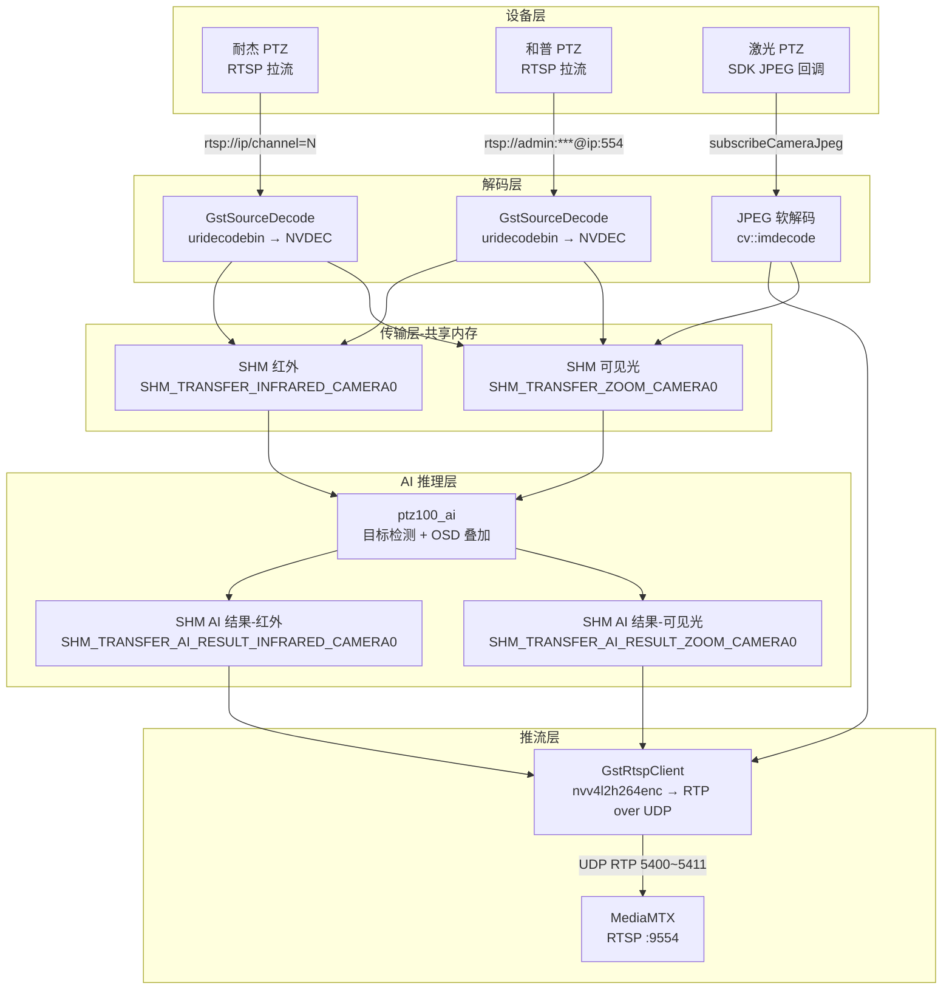

### 2.2 设备工厂模式

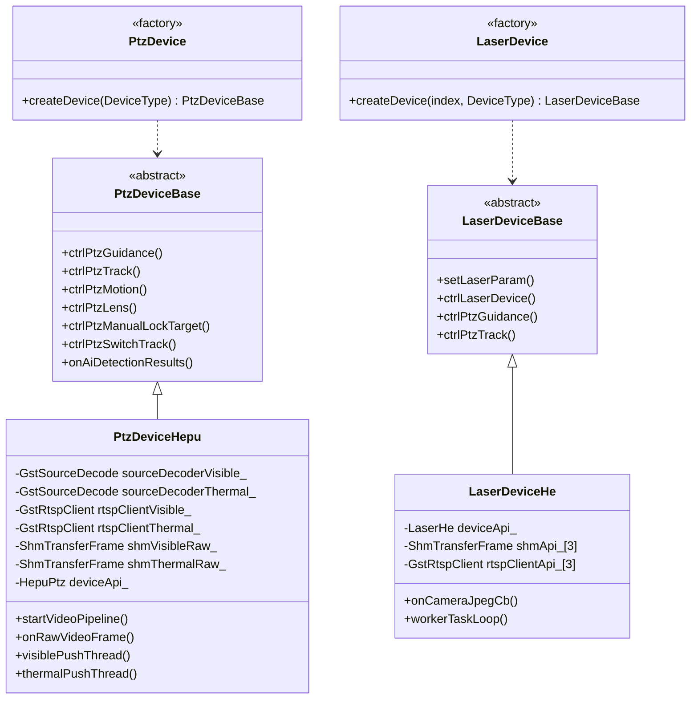

---

## 三、设备详细说明

### 3.1 耐杰 PTZ（ptz100_ros 节点，GStreamer）

| 属性 | 说明 |
|------|------|
| **配置类型** | `PTZ_NAIJIE` (近程)、`PTZ_NAIJIE_MID` (中程) |
| **代码入口** | `src/app/ptz/ptz_app.cpp` → `load_ptz()` |
| **视频协议** | RTSP 拉流 |
| **可见光 URL** | `rtsp://<ip>/channel=0,stream=0` |
| **红外 URL** | `rtsp://<ip>/channel=1,stream=1` |
| **可见光分辨率** | 1920x1080 |
| **红外分辨率** | 640x512 |
| **控制协议** | 以太网自定义协议 `eth_link_ptz`，SDK 位于 `thirdpart/naijie/` |
| **解码方式** | 已从 FFmpeg 切换到 `GstSourceDecode` 硬解（FFmpeg 代码暂保留） |
| **AI 传图** | 共享内存 `SHM_TRANSFER_ZOOM_CAMERA0` / `SHM_TRANSFER_INFRARED_CAMERA0` |
| **推流方式** | `GstRtspClient` H264 硬编码 → UDP RTP :5410/:5411 → MediaMTX |
| **推流代码** | `src/app/alg_app/alg_app.cpp`（`image_get_thread` / `image_get_thread_infrared`） |

**视频处理数据流：**

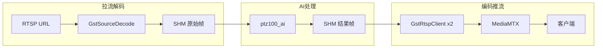

> **说明**：耐杰 PTZ 的视频处理已从 FFmpeg 切换到 GStreamer，拉流解码使用 `GstSourceDecode`，编码推流使用 `GstRtspClient`，拉流 → 解码 → SHM → AI → SHM → 编码推流 → MediaMTX 完整链路已打通。代码在 `ptz100_ros` 节点（`src/app/`）中运行，与和普的 `ptz_service`、激光的 `laser_service` 并行，FFmpeg 旧代码暂保留未删除。

### 3.2 和普 PTZ（新架构）

| 属性 | 说明 |
|------|------|
| **配置类型** | `PTZ_HEPU` (三型非制冷)、`PTZ_HEPU_COOLED` (四型制冷) |
| **代码入口** | `ros_ws/src/ptz_service/` → `PtzDeviceHepu` |
| **视频协议** | RTSP 拉流（设备自带 RTSP 服务） |
| **可见光 URL** | `rtsp://admin:Abc.12345@<ip>:554/ch0/stream1`（1920x1080, H264, 4Mbps） |
| **红外 URL** | `rtsp://admin:Abc.12345@<ip>:554/ch1/stream1`（640x512, H264, 2Mbps） |
| **控制协议** | 和普 HTTP/SDK API `ptz_hepu.h`，AI 结果通过 UDP 回传设备 `PtzHepuSmart` |
| **解码方式** | `GstSourceDecode`：`uridecodebin` → `nvvidconv` → `appsink` (RGB) |
| **AI 传图** | 共享内存写入原始帧，AI 处理后写入结果帧 |
| **推流方式** | `visiblePushThread` / `thermalPushThread` → `GstRtspClient` → UDP RTP → MediaMTX |

**视频处理数据流：**

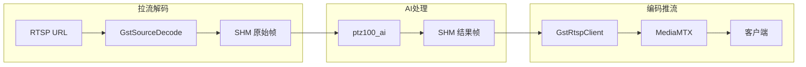

**组件清单：**

| 组件 | 数量 | 用途 |
|------|------|------|
| `GstSourceDecode` | 2 | 可见光解码器 + 红外解码器 |
| `GstRtspClient`（原始流） | 2 | 调试用原始流推流 |
| `GstRtspClient`（处理后流） | 2 | AI 处理后流推流 |
| `ShmTransferFrame` | 4 | 可见光/红外 x 原始/AI 结果 |
| `PtzHepuSmart` | 1 | AI 检测结果回传和普设备 |

### 3.3 激光 PTZ（新架构）

| 属性 | 说明 |
|------|------|
| **配置类型** | `PTZ_HEF100`、`PTZ_HEP10`、`PTZ_HEP21` |
| **代码入口** | `ros_ws/src/laser_service/` → `LaserDeviceHe` |
| **视频协议** | SDK JPEG 回调（非 RTSP 拉流） |
| **相机通道** | zoom0（粗跟踪）、zoom1（精跟踪）、infrared（红外） |
| **分辨率** | 512x512（各通道） |
| **控制协议** | `LaserHe` SDK，支持出光打击、照明、红外切换 |
| **解码方式** | `cv::imdecode` JPEG 软解 → RGB |
| **AI 传图** | 共享内存 `ShmTransferFrame shmApi_[3]` |
| **推流方式** | `GstRtspClient` x3 → UDP RTP → MediaMTX |

**视频处理数据流：**

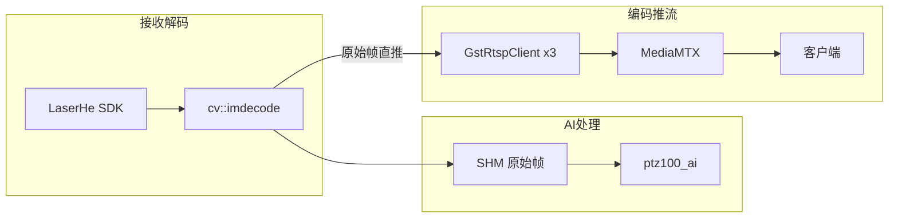

> **注意**：激光 PTZ 当前推流的是解码后的原始帧（非 AI 处理后帧），AI 结果帧尚未接入推流链路。

---

## 四、视频框架演进：FFmpeg → GStreamer

### 4.1 新旧架构对照

项目视频处理经历了从 FFmpeg 到 GStreamer 的演进。耐杰 PTZ 最早使用 FFmpeg 实现，后续新增的和普 PTZ 与激光 PTZ 全部采用 GStreamer（gstNvDeeps）架构。当前耐杰的拉流解码和编码推流已从 FFmpeg 切换到 GStreamer（`GstSourceDecode` + `GstRtspClient`），三类设备均使用 GStreamer 框架，FFmpeg 旧代码暂保留未删除。

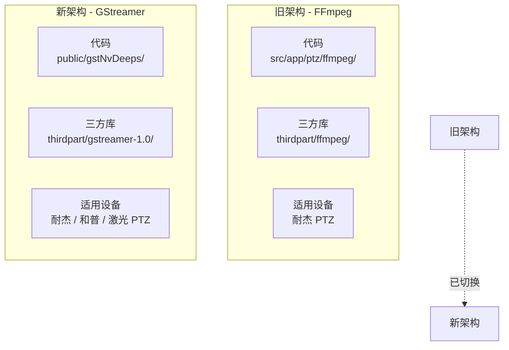

### 4.2 代码与依赖对照

| 维度 | FFmpeg（旧） | GStreamer（新） |
|------|-------------|----------------|
| **业务代码** | `src/app/ptz/ffmpeg/` | `public/gstNvDeeps/` |
| **三方库** | `thirdpart/ffmpeg/`（含 x86 和 aarch64） | `thirdpart/gstreamer-1.0/` |
| **核心类** | `FfmpegService`、`CEncodecBase`、`CDecodecBase`、`AvH264`、`NvEncodec`、`NvDecodec` | `GstSourceDecode`、`GstRtspClient`、`GstRtspServer` |
| **使用设备** | 耐杰 PTZ（早期） | 耐杰 PTZ、和普 PTZ、激光 PTZ（当前） |

### 4.3 FFmpeg 旧架构组件

| 文件 | 类 | 职责 |
|------|-----|------|
| `ffmpegservice.h/cpp` | `FfmpegService` | 拉流主服务：RTSP 拉流、解码、帧回调、RTMP 推流 |
| `CodecBase.h` | `CEncodecBase` / `CDecodecBase` | 编解码器抽象基类 |
| `NvEncodec.h/cpp` | `NvEncodec` | NVIDIA 硬件 H264 编码（基于 FFmpeg `h264_nvenc`） |
| `NvDecodec.h/cpp` | `NvDecodec` | NVIDIA 硬件 H264 解码（基于 FFmpeg `h264_cuvid`） |
| `AvH264.h/cpp` | `AvH264` | H264 软编码/软解码封装 |
| `CodecUtils.h/cpp` | — | 编解码工具函数 |

**FFmpeg 拉流流程：**


### 4.4 GStreamer 新架构组件

| 文件 | 类 | 职责 |
|------|-----|------|
| `gstSourceDecode.h/cpp` | `GstSourceDecode` | 拉流解码：RTSP/文件 → NVDEC 硬解 → RGB 帧回调 |
| `gstRtspClient.h/cpp` | `GstRtspClient` | 编码推流：RGB 帧 → H264 硬编码 → RTP/UDP 推流 |
| `gstCloudPusher.h/cpp` | `GstCloudPusher` | 云端推流：RTSP 拉流 → 免转码重封装 → RTMP 推流（见第十四章） |
| `gstRtspServer.h/cpp` | `GstRtspServer` | RTSP 服务端（已被 MediaMTX 替代） |

**GStreamer 拉流流程：**

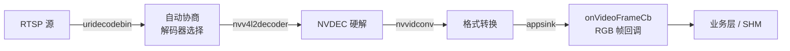

### 4.5 FFmpeg vs GStreamer 对比

| 对比维度 | FFmpeg（旧） | GStreamer（新） |
|---------|-------------|----------------|
| **架构模式** | 命令式 API，手动管理每一步 | Pipeline 管道模型，声明式组装 |
| **硬件加速** | 需手动指定 `h264_nvenc` / `h264_cuvid` | `uridecodebin` 自动选择 NVDEC，`nvv4l2h264enc` 原生支持 Jetson |
| **Jetson 适配** | 需额外编译适配 CUDA/NVENC | NVIDIA 官方提供 DeepStream 插件，原生支持 `nvv4l2decoder` / `nvvidconv` |
| **线程管理** | 手动创建线程处理拉流/推流 | Pipeline 自动管理线程，各 Element 独立线程运行 |
| **错误恢复** | 手动检测超时 (`ffmpeg_interrupt_function_cbk`) 和重连 | Pipeline 状态机 + Bus 消息机制，自动重连和错误上报 |
| **内存管理** | 手动 `av_frame_alloc` / `av_frame_free`，易泄漏 | GstBuffer 引用计数自动管理，零拷贝传输 |
| **协议支持** | RTSP/RTMP/文件 | RTSP/RTMP/HLS/WebRTC/SRT/文件（通过插件扩展） |
| **推流能力** | 需手动拼装 `AVPacket` 推 RTMP | `appsrc` + Pipeline 自动处理编码和推流 |
| **代码量** | ~11 个文件，编解码/推流/拉流耦合 | 3 个核心类，模块化清晰 |
| **跨平台** | x86 / aarch64 需分别编译库 | Jetson 系统预装，`thirdpart/gstreamer-1.0` 统一 |

### 4.6 GStreamer 的核心优势

1. **Jetson 原生支持**：NVIDIA DeepStream 基于 GStreamer，`nvv4l2decoder` / `nvv4l2h264enc` / `nvvidconv` 均为 Jetson 官方插件，硬件加速零配置
2. **Pipeline 自动化**：`uridecodebin` 自动协商协议、容器、编解码器，无需手动处理 `AVFormatContext` → `AVCodecContext` 链路
3. **内存安全**：GstBuffer 引用计数替代手动 `malloc/free`，历史上 FFmpeg 版本存在内存泄漏问题（代码中 `#define USE_NEW_VIDEO_API` 注释已指出）
4. **模块化扩展**：新增设备只需组装 Pipeline，不需要改动底层编解码逻辑
5. **多协议输出**：配合 MediaMTX 可同时输出 RTSP / HLS / WebRTC / SRT，FFmpeg 仅支持 RTMP 推流

### 4.7 当前状态

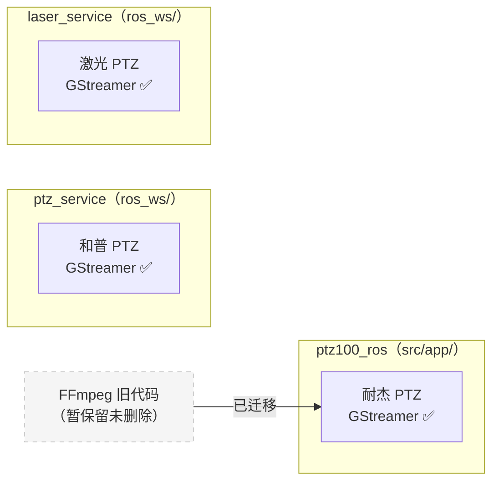

| 设备 | 视频框架 | ROS2 节点 | 说明 |
|------|---------|---------|------|
| 耐杰 PTZ | GStreamer ✅ | `ptz100_ros`（`src/app/`） | 已从 FFmpeg 切换到 GStreamer |
| 和普 PTZ | GStreamer ✅ | `ptz_service`（`ros_ws/`） | 工厂模式 |
| 激光 PTZ | GStreamer ✅ | `laser_service`（`ros_ws/`） | 工厂模式 |

> **耐杰后续两种方案**：
> 1. **保持现状**：当前 `ptz100_ros` 节点功能完整，拉流/解码/AI/推流链路已从 FFmpeg 切换到 GStreamer，可继续运行
> 2. **迁入 ptz_service**：将耐杰设备纳入 ROS2 统一架构，实现 `PtzDeviceNaijie` 子类，与和普/激光共用工厂模式和代码结构

---

## 五、GStreamer 组件串联详解

### 5.1 端到端完整流程（和普 PTZ）

和普 PTZ 是最完整的 GStreamer 流程，涵盖「拉流解码 → SHM 传图 → AI 处理 → SHM 回传 → 编码推流 → MediaMTX 分发」全链路。

```mermaid
flowchart LR
    subgraph 和普PTZ设备
        DEV_V["可见光 RTSP 1920x1080"]
        DEV_T["红外 RTSP 640x512"]
    end

    subgraph GstSourceDecode x2
        URI[uridecodebin] --> NVC[nvvidconv] --> FLT["capsfilter BGRx"] --> CVT[videoconvert] --> SINK[appsink]
    end

    subgraph SHM原始帧
        SHM_V[可见光]
        SHM_T[红外]
    end

    subgraph AI
        AI_P[ptz100_ai<br/>检测+OSD]
    end

    subgraph SHM结果帧
        SHM_AV[可见光AI帧]
        SHM_AT[红外AI帧]
    end

    subgraph GstRtspClient x2
        SRC[appsrc] --> CVT2[videoconvert] --> NVC2[nvvidconv] --> ENC[nvv4l2h264enc] --> PAY[rtph264pay] --> UDP["udpsink :5410/5411"]
    end

    subgraph MediaMTX
        MTX["RTSP :9554"]
    end

    DEV_V & DEV_T --> URI
    SINK --> SHM_V & SHM_T
    SHM_V & SHM_T --> AI_P
    AI_P --> SHM_AV & SHM_AT
    SHM_AV & SHM_AT -->|pushFrame| SRC
    UDP --> MTX
```

### 5.2 端到端完整流程（激光 PTZ）

激光 PTZ 不使用 RTSP 拉流，而是通过 SDK JPEG 回调获取图像，使用 JPEG 专用管道编码推流。

```mermaid
flowchart LR
    subgraph LaserHe SDK
        CAM0[zoom0 粗跟踪]
        CAM1[zoom1 精跟踪]
        CAM2[infrared 红外]
    end

    subgraph 回调+SHM
        DEC[onCameraJpegCb]
        SHM[SHM x3]
    end

    subgraph GstRtspClient JPEG管道 x3
        SRC_J[appsrc JPEG] --> JDEC[nvjpegdec] --> NVC_J[nvvidconv] --> ENC_J[nvv4l2h264enc] --> PAY_J[rtph264pay] --> UDP_J["udpsink :5400-5402"]
    end

    subgraph MediaMTX
        MTX["RTSP :9554"]
    end

    CAM0 & CAM1 & CAM2 --> DEC
    DEC --> SHM
    DEC -->|pushFrame| SRC_J
    UDP_J --> MTX
```

### 5.3 GstSourceDecode 解码管道 Element 详解

从代码 `createSourceDecodePipeline()` 中提取的实际管道结构：

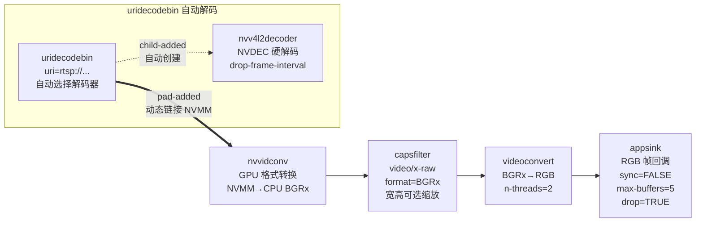

**关键配置参数：**

| Element | 参数 | 值 | 说明 |
|---------|------|----|------|
| `uridecodebin` | uri | RTSP/RTMP/文件 URL | 自动协商协议和解码器 |
| `nvv4l2decoder` | drop-frame-interval | 可配置 | 丢帧间隔，降低 CPU 负载 |
| `nvvidconv` | — | — | GPU 上 NVMM → CPU 内存格式转换 |
| `capsfilter` | caps | `video/x-raw,format=BGRx[,width=W,height=H]` | GPU 输出 BGRx 降低延迟，可选缩放 |
| `videoconvert` | n-threads | 2 | BGRx→RGB 轻量转换，多线程 |
| `appsink` | emit-signals | TRUE | 启用 new-sample 信号 |
| `appsink` | sync | FALSE | 禁用时钟同步，降低延迟 |
| `appsink` | async | FALSE | 禁用异步，防止帧乱序 |
| `appsink` | max-buffers | 5 | 最大缓存 5 帧 |
| `appsink` | drop | TRUE | 缓冲满时丢旧帧 |

### 5.4 GstRtspClient 编码推流管道 Element 详解

`GstRtspClient` 根据输入源类型选择不同管道：

**管道 A：RGB/GRAY8 原始图像输入**（和普 PTZ 使用）

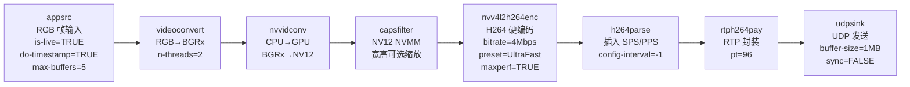

**管道 B：JPEG 图像输入**（激光 PTZ 使用）

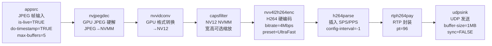

**关键配置参数：**

| Element | 参数 | 值 | 说明 |
|---------|------|----|------|
| `appsrc` | is-live | TRUE | 实时流模式 |
| `appsrc` | do-timestamp | TRUE | 自动生成时间戳 |
| `appsrc` | max-buffers | 5 | 最大缓存帧数 |
| `nvv4l2h264enc` | bitrate | 4000000 (默认) | 编码码率 bps |
| `nvv4l2h264enc` | preset-level | 1 (UltraFast) | 编码速度预设 |
| `nvv4l2h264enc` | iframeinterval | 30 | I 帧间隔 |
| `nvv4l2h264enc` | insert-sps-pps | TRUE | 每个 IDR 帧前插入参数集 |
| `nvv4l2h264enc` | maxperf-enable | TRUE | 启用最大性能模式 |
| `h264parse` | config-interval | -1 | 每个 I 帧插入 SPS/PPS |
| `rtph264pay` | pt | 96 | RTP Payload Type |
| `udpsink` | sync | FALSE | 禁用时钟同步，实时发送 |
| `udpsink` | buffer-size | 1048576 | 1MB 发送缓冲区 |

### 5.5 Jetson 硬件加速 vs x86 软件回退

`GstRtspClient` 根据平台自动切换编码管道。当前项目运行在 Jetson AGX 平台，默认使用硬件加速编码；x86 软件编码路径作为预留，用于不具备硬件加速条件的环境：

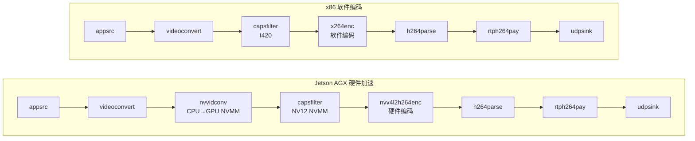

| 对比 | Jetson 硬件 | x86 软件 |
|------|-----------|---------|
| 格式转换 | `nvvidconv` (GPU) | 无（`videoconvert` 直出 I420） |
| 中间格式 | `NV12 (memory:NVMM)` | `I420` |
| H264 编码 | `nvv4l2h264enc` | `x264enc` |
| H265 编码 | `nvv4l2h265enc` | `x265enc` |
| JPEG 解码 | `nvjpegdec` (GPU) | `jpegdec` (CPU) |
| CPU 占用 | 极低（GPU 卸载） | 较高 |

### 5.6 管道生命周期与自动重连

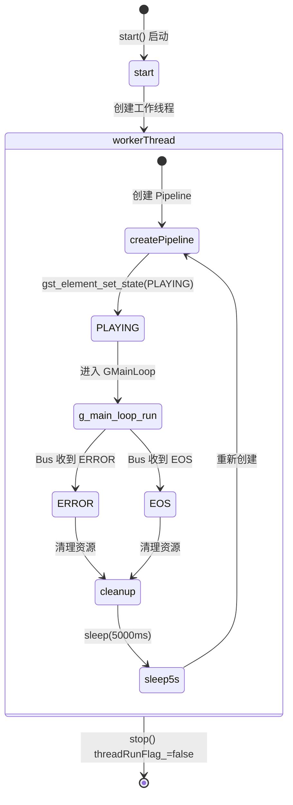

- `GstSourceDecode` 和 `GstRtspClient` 均采用 `workerTaskLoopForever()` 循环
- Pipeline 异常（ERROR/EOS）后自动清理并等待 5 秒（解码）/ 2 秒（推流）重建
- 通过 `GstBus` 监听 `GST_MESSAGE_ERROR` / `GST_MESSAGE_EOS` / `GST_MESSAGE_WARNING` 实现状态管理

---

## 六、共享内存传输

### 6.1 SHM 通道定义

| SHM 名称 | 方向 | 用途 |
|----------|------|------|
| `SHM_TRANSFER_ZOOM_CAMERA0` | 设备 → AI | 可见光原始帧 |
| `SHM_TRANSFER_INFRARED_CAMERA0` | 设备 → AI | 红外原始帧 |
| `SHM_TRANSFER_AI_RESULT_ZOOM_CAMERA0` | AI → 推流 | 可见光 AI 处理结果帧 |
| `SHM_TRANSFER_AI_RESULT_INFRARED_CAMERA0` | AI → 推流 | 红外 AI 处理结果帧 |

### 6.2 工作原理

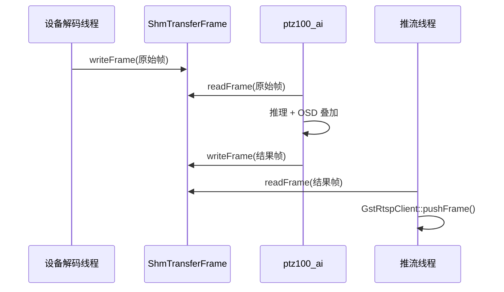

---

## 七、MediaMTX 流媒体服务

### 7.1 服务配置

MediaMTX 接收来自 `GstRtspClient` 的 UDP RTP 流，对外提供多种协议访问。当前项目**主要使用 RTSP 协议**，其余协议为 MediaMTX 默认开启但未主动使用：

| 协议 | 端口 | 当前使用 | 说明 |
|------|------|---------|------|
| RTSP | 9554 | **主要使用** | 客户端拉流播放 |
| RTMP | 1935 | 未使用 | 兼容旧播放器（默认开启） |
| HLS | 8888 | 未使用 | 低延迟 HLS（默认开启） |
| WebRTC | 8889 | 未使用 | 超低延迟 Web 端（默认开启） |
| SRT | 8890 | 未使用 | 安全可靠传输（默认开启） |

### 7.2 路径映射

| 播放路径 | UDP 源端口 | 所属设备 | 内容 |
|---------|-----------|---------|------|
| `ptz/zoom/ch0` | 5410 | 和普/耐杰 PTZ | 可见光（AI 处理后） |
| `ptz/ir/ch0` | 5411 | 和普/耐杰 PTZ | 红外（AI 处理后） |
| `laser/zoom/ch0` | 5400 | 激光 PTZ | 粗跟踪可见光 |
| `laser/zoom/ch1` | 5401 | 激光 PTZ | 精跟踪可见光 |
| `laser/ir/ch0` | 5402 | 激光 PTZ | 红外 |
| `test/ch0` | 5420 | 测试 | 测试流 |

**播放示例：**

```bash
# 和普 PTZ 可见光
gst-launch-1.0 playbin uri="rtsp://127.0.0.1:9554/ptz/zoom/ch0"

# 激光 PTZ 粗跟踪
gst-launch-1.0 playbin uri="rtsp://127.0.0.1:9554/laser/zoom/ch0"
```

---

## 八、控制链路

除视频流处理外，PTZ 设备还需接收**控制指令**（引导、跟踪、转台运动、镜头变焦/对焦等）。控制链路与视频链路分离：指令经 ROS2 Topic 或 Alink/以太网下发，由对应节点转成设备协议后发送给设备。

### 8.1 控制指令统一接口（ROS2 Topic）

上层（融合、显控、算法等）通过以下 ROS2 Topic 下发 PTZ 控制，各 PTZ 节点订阅后转成各自设备协议：

| Topic | 类型 | 说明 |
|-------|------|------|
| `/ptz_guidance_cmd` | PtzGuidanceCmd | 引导控制（指向目标方位/俯仰） |
| `/ptz_track_cmd` | PtzTrackCmd | 跟踪控制 |
| `/ptz_motion_cmd` | PtzMotionCmd | 转台运动（水平/俯仰速度等） |
| `/ptz_lens_cmd` | PtzLensCmd | 镜头控制（变焦、对焦、光圈） |
| `/ptz_manual_lock_target_cmd` | PtzManualLockTargetCmd | 手动锁定目标 |
| `/ptz_switch_tracking_source_cmd` | PtzSwitchTrackingSourceCmd | 切换跟踪源（可见光/红外） |

AI 检测结果通过 `/visible_track`、`/infrared_track`（AiTargetInfo）下发，供设备实现跟踪闭环。

### 8.2 控制链路按设备分流

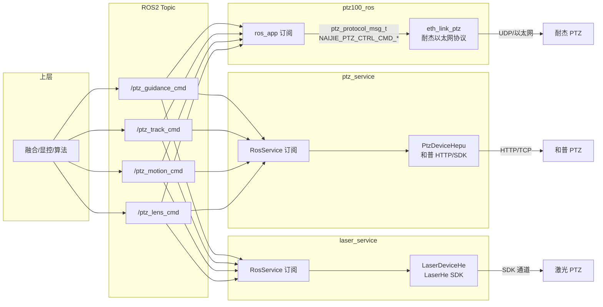

### 8.3 各设备控制实现概要

| 设备 | 节点 | 订阅 Topic | 协议转换 | 下发方式 |
|------|------|------------|----------|----------|
| 耐杰 PTZ | `ptz100_ros` | `/ptz_guidance_cmd`、`/ptz_track_cmd`、`/ptz_lens_cmd` 等 | `ros_app` 回调 → `ptz_control`、`NAIJIE_PTZ_CTRL_CMD_*` | `send_ptz_package()` → `eth_link_ptz` → 以太网至设备 |
| 和普 PTZ | `ptz_service` | 同上 | `RosService::cb_*` → `PtzDeviceHepu::ctrlPtz*()` | 和普 HTTP/SDK（`ptz_hepu_ctrl`） |
| 激光 PTZ | `laser_service` | 同上 | `RosService` → `LaserDeviceHe::ctrlPtz*()` | LaserHe SDK 控制通道 |

### 8.4 控制协议差异

三类设备底层控制协议不同，AGX 侧统一通过 ROS2 Topic 收口，再由各节点转换为设备私有协议。差异概要如下：

| 设备 | 传输方式 | 协议/代码位置 | 说明 |
|------|----------|----------------|------|
| **耐杰 PTZ** | 以太网 UDP/TCP | 自定义二进制协议，`src/srv/eth_link/ptz_protocol/` | 包头 `0x8A808988`，命令字见 `PTZ_PROTOCOL_COMMANDS`；镜头控制为 `NAIJIE_PTZ_CTRL_CMD_*`（变焦/对焦点动、连动等）。`eth_link_ptz` 封装发送，`send_ptz_package()` 下发。 |
| **和普 PTZ** | TCP | 和普私有协议，`iotDevices/ptzHepuSDK/`（`ptz_hepu_ctrl.h`） | 默认端口 **39020**（`HEPU_PTZ_TCP_PORT`）。`HepuPtzCtrl` 封装云台、镜头、跟踪、预置位、智能分析等；AI 检测结果通过 **UDP 39080** 回传设备。 |
| **激光 PTZ** | UDP | 霍克眼 LaserHe 协议，`iotDevices/laserHeSDK/`（`laserHeCtrl.h` 等） | `LaserHeCtrl` 封装引导/跟踪/转台/镜头；另有激光器控制 `ctrlLaser()`、参数设置 `setParams()` 等。图像通过 `subscribeCameraJpeg` 回调，控制与状态通过同一 UDP 通道。 |

> 上层仅依赖统一 ROS2 接口；协议差异由各节点内部消化，新增设备时需实现对应协议转换与 SDK 封装。

---

## 九、状态上报链路

各 PTZ 节点从设备读取状态后，通过 ROS2 Topic **发布**，供融合、显控等上层使用：

| Topic | 类型 | 说明 |
|-------|------|------|
| `/ptz_status` | PtzStatus | 设备状态 |
| `/ptz_lens_info` | PtzLensInfo | 镜头信息（变焦倍率、对焦等） |
| `/ptz_azimuth_pitch_info` | PtzAzimuthPitchInfo | 方位俯仰角 |
| `/ptz_device_info` | PtzDeviceInfo | 设备信息 |

数据流向：设备 → 节点（SDK/协议解析）→ 发布至上述 Topic → 上层订阅。

---

## 十、PTZ 与上位机 C2 的交互链路

上位机 C2（指挥控制/显控）与 AGX 通过 **Alink** 协议在以太网上通信。**当前 PTZ 与 C2 的交互均经由 ptz100_ros 节点所在进程**：Alink 连接在 `c2_network` 中建立，设备列表与心跳由 `eth_link` 周期任务上报，C2 下发的 PTZ 查询/控制在同一进程的 Alink 命令处理中响应（`src/srv/alink/`、`src/srv/eth_link/`、`src/app/c2_network/` 均在 ptz100_ros 进程内）。

### 10.1 AGX → C2（上报）

与 PTZ 相关的上报均由 **AGX 主设备**（ptz100_ros 进程）发起，PTZ 作为子设备信息被包含在心跳/设备列表中。

| msg_id | 含义 | 数据来源 / 触发 | 协议实现位置 |
|--------|------|------------------|---------------|
| **0xE5** | AGX 主设备心跳（含子设备列表） | AGX 主设备周期上报；`eth_link_task` → `send_slave_devices_info()` → `get_devices_online_info()`（汇总 TCP 子设备 + 耐杰/和普 PTZ）+ `alink_upload_heartbeat()`。列表中包含 PTZ 等子设备 SN、类型、IP、故障码（含码流状态） | `alink_system.cpp`：`heartbeat_data_package`、`alink_upload_heartbeat`；`eth_link.c`：`send_slave_devices_info` |
| **0xEB** | 设备列表 | 同上，AGX 主设备上报 `alink_upload_device_list()`；内容与 0xE5 一致，格式为 `alink_device_list_t` | `alink_system.cpp`：`system_device_list`、`alink_upload_device_list` |
| **0xEC** | PTZ 详情（单设备 SN + 码流 URL 等） | C2 请求 0x86 的响应；或 `ros_app`/AI 主动上报 `alink_upload_ptz_info()` | `alink_system.cpp`：`system_get_ptz_info`、`alink_upload_ptz_info`；`ros_app.cpp` / `ai_main.cpp` 调用 |

设备列表中的 PTZ 条目来源：`get_devices_online_info()`（`eth_link_server.c`）内会调用 `get_ptz_dev_info()`（耐杰）、`get_hepu_ptz_dev_info()`（和普），并将码流故障状态通过 `get_stream_push_status()` 填入 `fault` 字段（0x01 表示码流异常）。

### 10.2 C2 → AGX（下发）

| msg_id | 含义 | 处理逻辑 | 协议实现位置 |
|--------|------|----------|---------------|
| **0x81** | 手选雷达目标（控制 PTZ 转向该目标搜索无人机） | C2 下发用户选中的雷达目标（`user_track_target_t`：type、objid、坐标、SN 等），AGX 转成 `TRACK_INFO_FROM_USER` 通过 `msg_send_to_alg()` 送算法；算法据此驱动 PTZ 转向该方向并搜索/跟踪无人机目标 | `alink_target.c`：`user_custom_track_target`、`alink_register_cmd(..., 0x81, ...)` |
| **0x86** | 查询 PTZ 设备信息 | 按 C2 下发的 SN 查询耐杰/激光/和普，返回 `alink_ptz_dev_info_t`（IP、端口、可见光/红外码流 URL） | `alink_system.cpp`：`alink_get_ptzdev_info`；内部调 `get_ptz_dev_info`、`getLaserDevInfo`、`get_hepu_ptz_dev_info` |
| **0x8a** | 云台控制 | 解析 `alink_ptz_ctrl_req_t`，根据首设备类型走耐杰或激光：耐杰/和普 → `ros_app::ros_app_cmd_set(CMD_ID_SETTING_USER_PTZ_CONTROLLER_ROTATION)`，激光 → `ros_app::ros_app_pub_laser_cmd_set(...)` | `alink_system.cpp`：`alink_ctrl_ptz` |
| **0x8b** | 镜头控制（变焦/对焦） | 解析 `alink_ptz_zoom_ctrl_req_t`，同样按设备类型转 ROS2 或激光引导节点 | `alink_system.cpp`：`alink_ctrl_ptz_zoom` |

C2 下发的控制经 Alink 进入 AGX 后，由上述处理函数转为 ROS2 或耐杰以太网协议，再经**第八章**所述控制链路到达对应 PTZ/激光设备。即：**C2 --Alink--> ptz100_ros 进程 --ROS2/eth_link_ptz--> 设备**。其中 0x81 为 C2 手选雷达目标后，驱动 PTZ 转过去搜索无人机目标的专用指令。

### 10.3 与 ROS2 的关系

- 设备列表在 AGX 内除经 Alink 上报 C2 外，`ptz100_ros` 会发布 `/ptz100_ros_devlist`（DevList），供 SFL200 等节点订阅。
- 控制与状态仍以第八章、第九章的 ROS2 Topic 与状态上报为主；C2 通过 Alink 下发的 PTZ 相关指令（0x81 手选目标、0x8a/0x8b 云台/镜头控制）在 AGX 侧转为 ROS2 或直接走 `eth_link_ptz`（耐杰）。

### 10.4 协议与代码索引

- **C2 连接与上报包注册**：`src/app/c2_network/c2_network.cpp`（`alink_connect_send` 注册 0xE5、0xEB、0xEC 等）。
- **心跳与设备列表上报**：`src/srv/eth_link/eth_link.c`（`eth_link_task` → `send_slave_devices_info`）、`src/srv/alink/command/system/alink_system.cpp`（0xE5、0xEB、0xEC 的 package 与 `upload` 接口）。
- **设备列表内容汇总**：`src/srv/eth_link/eth_link_server.c`（`get_devices_online_info`）、`src/srv/eth_link/eth_link_ptz.cpp`（`get_ptz_dev_info`、`get_hepu_ptz_dev_info`）。
- **C2 下发命令处理**：`src/srv/alink/command/system/alink_system.cpp`（0x86、0x8a、0x8b 的 `alink_register_cmd` 与处理函数）；`src/srv/alink/command/target/alink_target.c`（0x81 手选雷达目标，`user_custom_track_target` → `msg_send_to_alg` 驱动 PTZ 转向搜索无人机）。

> **说明**：视频帧传输走共享内存，不走 ROS2；控制指令走 ROS2 Topic 或 Alink 转 ROS2/以太网下发，状态上报走 ROS2 Topic 发布；PTZ 与 C2 的对接由 AGX 主设备经 Alink 上报 0xE5/0xEB 设备列表、0xEC PTZ 详情，以及 C2 下发 0x81（手选雷达目标控 PTZ）/0x86/0x8a/0x8b 完成，且均经 **ptz100_ros** 节点所在进程。

---

## 十一、设备配置管理

### 11.1 配置文件

设备信息通过 `PtzDevicesCfg` 管理，配置文件路径：`config/ptzDevicesCfg.yaml`

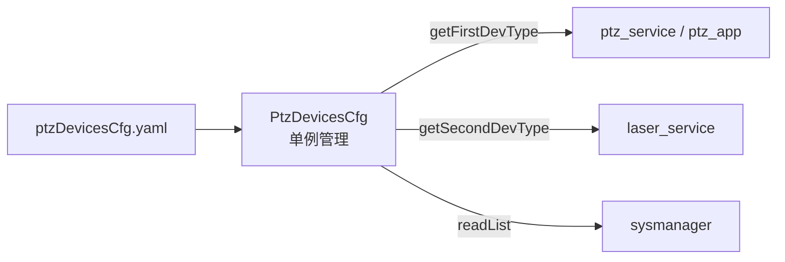

### 11.2 设备类型枚举

| 枚举值 | 数值 | 说明 |
|--------|------|------|
| `PTZ_NAIJIE` | 0 | 耐杰近程 PTZ |
| `PTZ_HEF100` | 1 | 霍克眼激光 HEF100 |
| `PTZ_HEP10` | 2 | 霍克眼激光 HEP10 |
| `PTZ_HEP21` | 3 | 霍克眼激光 HEP21 |
| `PTZ_HEPU` | 4 | 和普三型 Z50（非制冷） |
| `PTZ_NAIJIE_MID` | 5 | 耐杰中程 PTZ |
| `PTZ_HEPU_COOLED` | 6 | 和普四型 Z50（制冷） |

---

## 十二、三类设备对比

| 对比维度 | 耐杰 PTZ | 和普 PTZ | 激光 PTZ |
|---------|---------|---------|---------|
| **ROS2 节点** | `ptz100_ros`（`src/app/`） | `ptz_service`（`ros_ws/`） | `laser_service`（`ros_ws/`） |
| **视频框架** | GStreamer (gstNvDeeps) | GStreamer (gstNvDeeps) | GStreamer (gstNvDeeps) |
| **视频框架代码** | 解码: `public/gstNvDeeps/`，推流: `src/app/alg_app/alg_app.cpp` | `public/gstNvDeeps/` | `public/gstNvDeeps/` |
| **视频框架依赖** | `thirdpart/gstreamer-1.0/` | `thirdpart/gstreamer-1.0/` | `thirdpart/gstreamer-1.0/` |
| **视频接入** | RTSP 拉流 | RTSP 拉流 | SDK JPEG 回调 |
| **解码** | GstSourceDecode (NVDEC) | GstSourceDecode (NVDEC) | cv::imdecode |
| **编码推流** | GstRtspClient `nvv4l2h264enc` → RTP/UDP（`alg_app.cpp`） | GstRtspClient `nvv4l2h264enc` → RTP/UDP | GstRtspClient `nvv4l2h264enc` → RTP/UDP |
| **相机数** | 2（可见光 + 红外） | 2（可见光 + 红外） | 3（粗跟踪 + 精跟踪 + 红外） |
| **可见光分辨率** | 1920x1080 | 1920x1080 | 512x512 |
| **红外分辨率** | 640x512 | 640x512 | 512x512 |
| **AI 传输** | SHM | SHM | SHM |
| **推流** | MediaMTX (5410/5411) | MediaMTX (5410/5411) | MediaMTX (5400/5401/5402) |
| **控制协议** | 以太网自定义协议 | 和普 HTTP/SDK API | LaserHe SDK |
| **工厂类** | 无（硬编码判断） | `PtzDevice::createDevice()` | `LaserDevice::createDevice()` |

---

## 十三、现状说明与可选优化

### 13.1 现状说明

| 编号 | 现状 | 说明 |
|------|------|------|
| 1 | 三类设备视频处理均使用 GStreamer | 耐杰已从 FFmpeg 切换到 GStreamer，和普/激光直接采用 GStreamer，链路完整 |
| 2 | 耐杰 PTZ 运行在 `ptz100_ros` 节点（`src/app/`） | 拉流在 `ptz_app.cpp`，推流在 `alg_app.cpp`，与 `ptz_service`/`laser_service` 并行，功能正常 |
| 3 | 和普/激光 PTZ 运行在 ROS2 架构（`ptz_service` / `laser_service`） | 使用工厂模式，代码集中在 `ros_ws/` |
| 4 | FFmpeg 旧代码仍保留在代码库中 | `src/app/ptz/ffmpeg/` 和 `thirdpart/ffmpeg/` 未删除，已通过 `USE_NEW_VIDEO_API` 宏弃用 |
| 5 | `PtzDevice` 工厂仅注册了和普设备类型 | 耐杰在 `ptz100_ros` 节点中，激光使用 `LaserDevice` 工厂 |
| 6 | 激光设备使用 JPEG 软解码（`cv::imdecode`） | CPU 解码，未使用 GStreamer 硬件 JPEG 解码 |

### 13.2 耐杰 PTZ 后续方案

| 方案 | 说明 | 优点 | 缺点 |
|------|------|------|------|
| **方案一：保持现状** | 耐杰继续在 `ptz100_ros` 节点运行 | 无额外开发量，当前功能稳定 | 耐杰代码在 `src/app/`，和普/激光在 `ros_ws/` |
| **方案二：迁入 ptz_service** | 实现 `PtzDeviceNaijie` 子类，纳入 ROS2 统一架构 | 三类设备统一管理，复用工厂模式 | 需要开发和验证工作量 |

### 13.3 可选优化

- **清理 FFmpeg 遗留代码**：`src/app/ptz/ffmpeg/` 和 `thirdpart/ffmpeg/` 已弃用，可择机移除
- **激光硬解**：激光设备可考虑使用 GStreamer `nvjpegdec` 替代 `cv::imdecode` 实现硬件加速
- **工厂扩展**：如选择方案二，在 `PtzDevice` 工厂中注册耐杰设备类型

---

## 十四、云端推流（SSF200 上云）

### 14.1 背景

SSF200 上云场景下，视频流需要推送至天盾云端流媒体服务器，而非仅在局域网内通过 MediaMTX 分发给 C2。AGX 通过 MQTT 向天盾请求 RTMP 推流地址，获取后使用 `GstCloudPusher` 从本地 MediaMTX 拉取已编码的 H.264 RTSP 流，免转码重封装为 FLV，通过 RTMP 推送到云端。

**前提条件**：eth0 必须具备公网访问能力（路由器/4G/VPN），否则无法连接天盾 MQTT Broker 和 RTMP 服务器。

### 14.2 架构

GstCloudPusher 作为 MediaMTX 的下游消费者，与现有管道完全解耦：

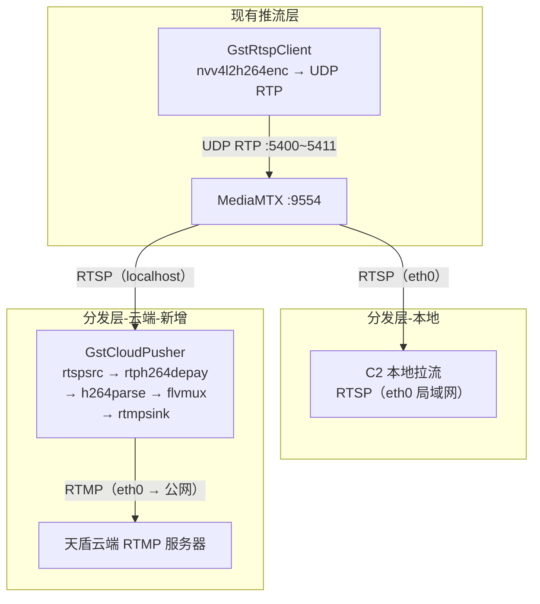

### 14.3 GstCloudPusher 组件

**位置**：`public/gstNvDeeps/gstCloudPusher/`

与 `gstSourceDecode`（拉流解码）和 `gstRtspClient`（编码推流）并列，属于 GStreamer 基础能力层。

**管道结构**（免转码重封装）：

```mermaid
flowchart LR
    SRC["rtspsrc<br/>latency=300"]
    DEPAY["rtph264depay<br/>RTP 解封装"]
    PARSE["h264parse<br/>帧边界解析"]
    MUX["flvmux<br/>streamable=true"]
    SINK["rtmpsink<br/>RTMP 推流"]

    SRC ==>|"pad-added<br/>动态链接"| DEPAY --> PARSE --> MUX --> SINK
```

| Element | 作用 | 关键参数 |
|---------|------|----------|
| `rtspsrc` | 从本地 MediaMTX 拉 RTSP 流 | `location`, `latency=300`, `protocols=TCP` |
| `rtph264depay` | RTP 解封装，提取 H.264 NALU | -- |
| `h264parse` | 确保 H.264 帧边界正确 | -- |
| `flvmux` | 封装为 FLV（RTMP 要求的容器格式） | `streamable=true` |
| `rtmpsink` | 推送到天盾返回的 RTMP 地址 | `location`, `sync=false` |

### 14.4 与现有推流的对比

| 对比维度 | GstRtspClient（本地推流） | GstCloudPusher（云端推流） |
|---------|------------------------|------------------------|
| 数据源 | appsrc（RGB/JPEG 帧） | rtspsrc（RTSP 已编码流） |
| 是否编码 | 是（nvv4l2h264enc 硬编码） | 否（免转码重封装） |
| 输出格式 | RTP over UDP | FLV over RTMP |
| 目标 | 本地 MediaMTX（127.0.0.1） | 天盾云端 RTMP 服务器（公网） |
| CPU/GPU 开销 | 较高（硬件编码） | 极低（仅容器转换） |
| 代码位置 | `public/gstNvDeeps/gstRtspClient/` | `public/gstNvDeeps/gstCloudPusher/` |
| 调用者 | ptz_service / alg_app | nexus_gateway |

### 14.5 MQTT 协议交互（4.8.5 设备获取推流地址）

**请求**（AGX → 天盾）：

```
Topic: thing/product/{PTZ_设备 SN}/requests
{
    "tid": "<uuid>",
    "bid": "<uuid>",
    "timestamp": <utc毫秒>,
    "method": "device_stream_url",
    "gateway": "<Spotter Pro 设备 SN>",
    "data": {
        "Camera": [{
            "type": "zoom",       // zoom-变焦 wide-广角 normal-普通 ir-红外 night-夜视
            "camera_id": "<摄像头ID>"
        }]
    }
}
```

**回复**（天盾 → AGX）：

```
Topic: thing/product/{设备SN}/requests_reply
{
    "tid": "<uuid>",
    "bid": "<uuid>",
    "timestamp": <utc毫秒>,
    "method": "device_stream_url",
    "data": {
        "result": 0,
        "output": {
            "streams": [{
                "type": "zoom",
                "streamUrl": "rtmp://cn.cloud-dev.skyfend.com:1935/live/dev/.../1"
            }]
        }
    }
}
```

天盾返回的 `streamUrl` 是拼接好的完整 RTMP 地址，直接用作 `rtmpsink location` 参数。

### 14.6 摄像头类型与本地 RTSP 路径映射

| 天盾 type | 本地 RTSP 路径 | MediaMTX UDP 端口 | 说明 |
|-----------|---------------|-------------------|------|
| `zoom` | `rtsp://127.0.0.1:9554/ptz/zoom/ch0` | 5410 | 和普/耐杰 可见光 |
| `ir` | `rtsp://127.0.0.1:9554/ptz/ir/ch0` | 5411 | 和普/耐杰 红外 |
| `zoom`（激光） | `rtsp://127.0.0.1:9554/laser/zoom/ch0` | 5400 | 激光粗跟踪 |
| `ir`（激光） | `rtsp://127.0.0.1:9554/laser/ir/ch0` | 5402 | 激光红外 |

### 14.7 管道生命周期与自动重连

与 GstRtspClient 一致的 `workerTaskLoopForever()` 模式：Pipeline 异常（ERROR/EOS）后自动清理并等待 `reconnectDelayMs`（默认 5 秒）重建。

### 14.8 使用方式

```cpp
#include "gstCloudPusher.h"

auto pusher = std::make_unique<GstCloudPusher>();
pusher->startPush("rtsp://127.0.0.1:9554/ptz/zoom/ch0",
                   "rtmp://cn.cloud-dev.skyfend.com:1935/live/dev/.../1");

// 多路推流：每路一个实例
auto pusherIr = std::make_unique<GstCloudPusher>();
pusherIr->startPush("rtsp://127.0.0.1:9554/ptz/ir/ch0",
                     "rtmp://cn.cloud-dev.skyfend.com:1935/live/dev/.../2");
```

### 14.9 测试工具

`public/gstNvDeeps/examples/cloudPusherTest.cpp` 提供无 PTZ 设备时的联调测试。

**编译**：

```bash
cd public/gstNvDeeps/examples
mkdir -p build && cd build
cmake .. && make -j$(nproc)
```

**运行**：

```bash
# 本地闭环测试（不需要 PTZ 和公网，需要 MediaMTX 已启动）
./cloudPusherTest "rtmp://127.0.0.1:1935/live/cloud_test"
# 另一终端验证：
gst-launch-1.0 playbin uri="rtsp://127.0.0.1:9554/live/cloud_test"

# 推流到天盾云端（需要 eth0 有公网访问）
./cloudPusherTest "rtmp://cn.cloud-dev.skyfend.com:1935/live/dev/spotter-pro-test-001/spotter-pro-ptz-001/1"

# 仅启动假视频源（不推云端，用 VLC 验证 MediaMTX test/ch0）
./cloudPusherTest
```

**本地闭环测试数据流**：

```
假视频帧(1080P,25fps) → GstRtspClient → UDP RTP :5420 → MediaMTX [test/ch0]
                                                              ↓ RTSP pull (localhost)
                                                        GstCloudPusher (rtmp2sink)
                                                              ↓ RTMP push
                                                        MediaMTX [live/cloud_test]
                                                              ↓ RTSP pull
                                                        VLC/gst-launch 验证
```

### 14.10 实现备注

- **RTMP Sink 选型**：优先使用 `rtmp2sink`（GStreamer 内置实现），如不可用则降级到 `rtmpsink`（librtmp）。在 Jetson AGX 环境实测中 `rtmpsink` 存在静默推流失败问题，`rtmp2sink` 工作正常
- **管道增加 queue**：在 `h264parse` 和 `flvmux` 之间插入 `queue` 元素，解耦 rtspsrc 和 flvmux 的线程模型，避免死锁
- **h264parse 配置**：`config-interval=-1`，每个 I 帧前插入 SPS/PPS，确保 RTMP 接收端能正确解码

---

## 附录

### A. 端口分配表

| 端口范围 | 用途 |
|---------|------|
| 554 | 设备自身 RTSP 服务（和普 PTZ） |
| 5400~5402 | 激光 PTZ → MediaMTX (UDP RTP) |
| 5410~5411 | 和普/耐杰 PTZ → MediaMTX (UDP RTP) |
| 5420 | 测试流 → MediaMTX (UDP RTP) |
| 9554 | MediaMTX RTSP 服务 |
| 1935 | 天盾云端 RTMP 服务（GstCloudPusher 出站目标） |
| 8888 | MediaMTX HLS 服务 |
| 8889 | MediaMTX WebRTC 服务 |
| 8890 | MediaMTX SRT 服务 |

### B. 关键源文件索引

| 文件 | 说明 |
|------|------|
| **GStreamer 新架构** | |
| `public/gstNvDeeps/gstSourceDecode/` | GStreamer 视频拉流解码模块 |
| `public/gstNvDeeps/gstRtspClient/` | GStreamer 视频编码推流模块 |
| `public/gstNvDeeps/gstCloudPusher/` | GStreamer 云端推流模块（RTSP→RTMP 免转码重封装，见第十四章） |
| `public/gstNvDeeps/gstRtspServer/` | GStreamer RTSP 服务端（已被 MediaMTX 替代） |
| `public/gstNvDeeps/examples/` | GStreamer 各模块测试用例（含 cloudPusherTest 云端推流联调测试） |
| `thirdpart/gstreamer-1.0/` | GStreamer 三方库（头文件 + 链接库） |
| **FFmpeg 旧架构** | |
| `src/app/ptz/ffmpeg/ffmpegservice.h/cpp` | FFmpeg 拉流/推流主服务 |
| `src/app/ptz/ffmpeg/NvEncodec.h/cpp` | FFmpeg NVIDIA 硬件编码封装 |
| `src/app/ptz/ffmpeg/NvDecodec.h/cpp` | FFmpeg NVIDIA 硬件解码封装 |
| `src/app/ptz/ffmpeg/AvH264.h/cpp` | FFmpeg H264 软编解码封装 |
| `src/app/ptz/ffmpeg/CodecBase.h` | FFmpeg 编解码器抽象基类 |
| `thirdpart/ffmpeg/` | FFmpeg 三方库（x86 + aarch64） |
| **设备实现** | |
| `ros_ws/src/ptz_service/src/ptzDevice/` | PTZ 设备抽象与和普实现（GStreamer） |
| `ros_ws/src/laser_service/src/laserDevice/` | 激光设备抽象与霍克眼实现（GStreamer） |
| `src/app/ptz/ptz_app.cpp` | 耐杰 PTZ 拉流解码（GstSourceDecode）+ SHM 写入 |
| `src/app/alg_app/alg_app.cpp` | 耐杰 PTZ AI 结果帧 SHM 读取 + GstRtspClient 编码推流（5410/5411） |
| **控制协议 / 设备 SDK** | |
| `src/srv/eth_link/ptz_protocol/` | 耐杰 PTZ 以太网控制协议 |
| `iotDevices/ptzHepuSDK/` | 和普 PTZ 控制 SDK（TCP 39020） |
| `iotDevices/laserHeSDK/` | 霍克眼激光 PTZ 控制 SDK（UDP） |
| **配置与依赖** | |
| `config/ptzDevicesCfg.yaml` | 设备类型与列表配置（见第十一章） |
| `public/config/yamlConfig/ptzDevicesCfg.h/cpp` | 设备配置解析（PtzDevicesCfg） |
| `thirdpart/mediamtx/mediamtx.yml` | MediaMTX 流媒体配置 |
| `thirdpart/naijie/demo/sdk/` | 耐杰 SDK 头文件 |

### C. 播放地址速查

```bash
# 和普/耐杰 PTZ（经 MediaMTX，AI 处理后）
rtsp://127.0.0.1:9554/ptz/zoom/ch0    # 可见光
rtsp://127.0.0.1:9554/ptz/ir/ch0      # 红外

# 激光 PTZ
rtsp://127.0.0.1:9554/laser/zoom/ch0  # 粗跟踪可见光
rtsp://127.0.0.1:9554/laser/zoom/ch1  # 精跟踪可见光
rtsp://127.0.0.1:9554/laser/ir/ch0    # 红外

# 和普设备原始流（直连设备时）
rtsp://admin:Abc.12345@<设备IP>:554/ch0/stream0  # 可见光主码流
rtsp://admin:Abc.12345@<设备IP>:554/ch1/stream0  # 红外主码流
```

### D. MediaMTX 流媒体服务器及配置说明

#### D.1 简介与作用

**MediaMTX**（原 rtsp-simple-server）是一款开源的流媒体服务器，支持 RTSP、RTMP、HLS、WebRTC、SRT 等多种协议。在本项目中用于：

- **接收**：AGX 上各节点（`GstRtspClient`）编码后的 H.264 通过 **RTP over UDP** 推送到 MediaMTX 指定端口；
- **分发**：对外提供统一 RTSP（及可选 HLS/WebRTC/SRT）拉流地址，供显控、VLC、Web 等客户端播放。

即：**设备/节点 → GstRtspClient 推 UDP RTP → MediaMTX 收流并转协议 → 客户端 RTSP/HLS/WebRTC 拉流**。

#### D.2 配置文件位置

| 项目 | 说明 |
|------|------|
| 配置文件 | `thirdpart/mediamtx/mediamtx.yml` |
| 可执行文件 | `thirdpart/mediamtx/` 目录下 MediaMTX 二进制（由部署/启动脚本指定） |

#### D.3 服务端口（全局）

| 协议 | 配置项 | 默认端口 | 说明 |
|------|--------|----------|------|
| RTSP | `rtspAddress` | **9554** | 主要拉流端口，客户端使用 |
| RTMP | `rtmpAddress` | 1935 | 可选推流/拉流 |
| HLS | `hlsAddress` | 8888 | HTTP 切片，适合 Web 播放 |
| WebRTC | `webrtcAddress` | 8889 | 低延迟浏览器播放 |
| SRT | `srtAddress` | 8890 | SRT 推拉流 |

#### D.4 路径与 UDP RTP 输入（paths）

AGX 向 MediaMTX **推流**时，使用 **UDP RTP**：节点将 H.264 通过 RTP 发往本机 `127.0.0.1:端口`，MediaMTX 在对应端口监听并绑定到逻辑路径。路径与端口对应关系如下（与 `mediamtx.yml` 中 `paths` 一致）：

| 路径（Path） | 源配置（source） | 用途 |
|--------------|------------------|------|
| `ptz/zoom/ch0` | `udp+rtp://127.0.0.1:5410` | 和普/耐杰 可见光（AI 处理后） |
| `ptz/ir/ch0` | `udp+rtp://127.0.0.1:5411` | 和普/耐杰 红外（AI 处理后） |
| `laser/zoom/ch0` | `udp+rtp://127.0.0.1:5400` | 激光 粗跟踪可见光 |
| `laser/zoom/ch1` | `udp+rtp://127.0.0.1:5401` | 激光 精跟踪可见光 |
| `laser/ir/ch0` | `udp+rtp://127.0.0.1:5402` | 激光 红外 |
| `test/ch0` | `udp+rtp://127.0.0.1:5420` | 测试用 |

每个 path 的 `rtpSDP` 在配置中声明为 H.264 RTP/AVP 96，与 `GstRtspClient` 的 RTP 封装一致。

#### D.5 关键全局配置项（简要）

| 配置项 | 推荐/说明 |
|--------|-----------|
| `logLevel` | `info`，排查问题时可为 `debug` |
| `readTimeout` / `writeTimeout` | 默认 10s，可按需调整 |
| `udpReadBufferSize` | 本项目已设为 **1048576**（1MB），减轻高码率下 UDP 丢包；需保证 `cat /proc/sys/net/core/rmem_max` ≥ 该值 |
| `rtsp: true` | 启用 RTSP 服务 |
| `rtspAddress: :9554` | RTSP 监听端口 |
| `paths` | 见 D.4，按 path 配置 `source` 与 `rtpSDP` |

新增一路 PTZ/激光流时：在 `paths` 下增加新 path 名称，并指定 `source: udp+rtp://127.0.0.1:端口` 及对应 `rtpSDP`（H.264 可复用现有片段），同时确保 GstRtspClient 推流目标端口与该端口一致。

### E. 缩略语与术语

| 术语/缩略语 | 说明 |
|-------------|------|
| AGX | 本平台主控设备（Jetson 等），运行 ptz100_ros、ptz_service、laser_service 等节点 |
| Alink | 本平台与上位机 C2 之间的应用层通信协议，用于设备列表、心跳、PTZ 控制等 |
| C2 | 上位机指挥控制/显控，通过 Alink 与 AGX 通信 |
| PTZ | Pan-Tilt-Zoom，云台摄像机（水平/俯仰/变焦） |
| SHM | 共享内存（Shared Memory），用于设备与 AI、AI 与推流间零拷贝传帧 |
| NVDEC / NVENC | NVIDIA 硬件解码 / 编码（Jetson 上常用 nvv4l2decoder、nvv4l2h264enc） |
| RTSP | 实时流协议，用于拉流/播放 |
| RTP | 实时传输协议，通常 over UDP，用于 GstRtspClient 向 MediaMTX 推流 |
| MediaMTX | 流媒体服务器，接收 UDP RTP 推流，对外提供 RTSP/HLS/WebRTC 等 |
| path | MediaMTX 中逻辑路径，如 `ptz/zoom/ch0`，与 UDP 端口一一对应 |
| RTMP | 实时消息传输协议，用于 GstCloudPusher 向天盾云端推流 |
| FLV | Flash Video 容器格式，RTMP 协议要求的封装格式 |
| remux | 重封装，不重新编码，仅更换容器格式（如 RTP→FLV），CPU 开销极低 |
| 天盾 | Skyfend 云端平台，提供设备管理、流媒体服务、MQTT Broker 等 |
| GstCloudPusher | 云端推流组件，从 MediaMTX 拉 RTSP 流免转码重封装推 RTMP 到天盾 |
