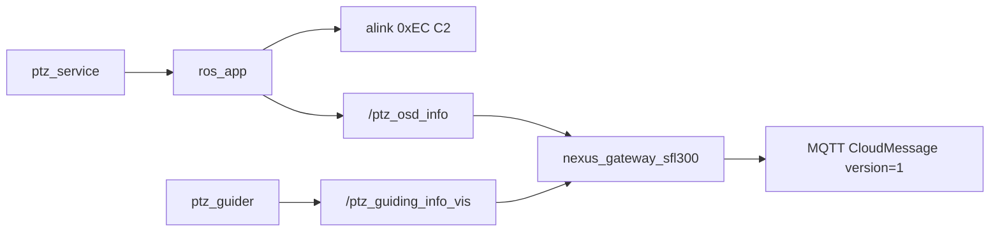

# SFL300：天盾 PTZ 上云缺口与协议对齐（增量修订）

> **维护约定**：本计划只做增量修订，不整份清空重写。

## 定稿协议源与双节点架构（2026-07-29）

### 两份协议文档

| 角色 | 文档 | 形态 |
|------|------|------|
| **旧** | 云平台设备上云指导文档(对内).md | 手写 JSON 信封（无 `@type` / 无统一 CloudMessage version） |
| **新** | Spotter_Spotter Pro上云协议.md | **仍走 MQTT JSON**；结构由 `CloudMessage` proto 定义；`data` 为 Any 的 **JSON 映射**（`@type` + 字段平铺） |

### Wire 形态定稿（用户理解 + 答复确认，2026-07-29）

**结论：外层 JSON，内层按 Protobuf 定义（示例为 Any 的 JSON，不是 MQTT 整包 binary）。**

```text
MQTT payload = JSON(CloudMessage)
  tid / bid / timestamp / gateway / method / version(=1)
  data: {
    "@type": "type.googleapis.com/cloud.SpotterVisionLockData",  // 等
    ...业务字段平铺...
  }
```

| 层次 | 含义 |
|------|------|
| 传输 | MQTT 文本 **JSON**（broker/网关易读、易路由） |
| 外层 schema | `CloudMessage`（proto 定义字段；含 **`version=1`**） |
| 内层 schema | 各 `SpotterXxxData` proto；JSON 里用 **`@type`** 标明类型 |
| 与旧协议差 | 统一信封 + `version` + `data.@type` + method/Topic/字段按新表；不是把 MQTT 改成发 `.SerializeToString()` 二进制整包 |

实现含义（纠正此前「整包 Protobuf 序列化」的歧义）：

- sfl300 可继续用 **cJSON / nlohmann** 组 JSON，但字段必须对齐 proto（含 `version`、`data.@type`）。
- 可选：用 protobuf JSON util 做校验/生成；**不要求** MQTT 发 binary `CloudMessage`。
- 与云端联调按文档「上报示例」对照即可（如 0xE3 `device_uav_video`）。

参考示例（协议正文）：`thing/product/{SpotterSN}/uav` · `device_uav_video` · `@type` = `cloud.SpotterVisionLockData`。

### 分析报告

出处：[Spotter Pro 上云协议升级与 MQTT 迁移分析报告.md](/home/skyfend/workspace/ptz100_agx/Spotter%20Pro%20上云协议升级与%20MQTT%20迁移分析报告.md)

可参考：分层信封、`version` 共存、灰度思路。报告里 **Base64(二进制 PB) 方案忽略**（用户确认不一定对）；`data` **只按 Spotter 协议正文**：`@type` + 字段平铺 JSON。

### 天盾兼容：`version`

```protobuf
int version = 6;           // 0=老协议，1=v1
google.protobuf.Any data = 7;
```

发出填 **`version: 1`**。（本地 Spotter md 若仍 `data=6` 无 version，以飞书为准并回写。）

### 嵌入式节点分工

| 节点 | 协议 | 产品 |
|------|------|------|
| [`nexus_gateway`](ros_ws/src/nexus_gateway) | 旧 JSON（保持不动） | Spotter Pro |
| [`nexus_gateway_sfl300`](ros_ws/src/nexus_gateway_sfl300) | 新协议（从 gateway **拷贝**后改造） | SFL300 |

**实现范围 = 仅 sfl300。** 现状：拷贝后仍是旧 cJSON 组包，需改为 CloudMessage JSON + `@type` + 新 method/Topic。

现状：`nexus_gateway_sfl300` 已从旧包 fork，仍用 **cJSON JSON 信封**（见 `ThingModelBuilder.cpp` / `ThingModelMessage.h`），**尚未**接入 protobuf / `version`。第一步是在该包内落地 CloudMessage 编解码层。

新协议业务细节仍以 Spotter md「协议一览 / Method→Payload / 各 CMD」为准。文档笔误默认：

| 处 | 本计划默认 |
|----|------------|
| CloudMessage 示例 method `spotter_device_heart` | 一览：**`device_heart`** |
| 0xE0 method 名 | **`device_fault`** |
| 推流 | **`device_stream_url`@{PTZ_SN}/requests**；查流另做 `spotter_get_stream_info` |
| Camera | 一次申请 **zoom+ir** |
| CloudMessage `version` | **以飞书截图为准**：`int version = 6`（0=老协议，1=v1）；`data = 7`。仓库 md 磁盘副本目前仍是 `data = 6`、无 version（见下），导出未同步；实现按飞书，并应回写本地 md |

**本地 md 与飞书差异（已核对磁盘文件）**：[`Spotter_Spotter Pro上云协议.md`](/home/skyfend/workspace/ptz100_agx/Spotter_Spotter%20Pro上云协议.md) 第 20–27 行当前为：

```protobuf
message CloudMessage {
  string tid       = 1;
  string bid       = 2;
  int64  timestamp = 3;
  string gateway   = 4;
  string method    = 5;
  google.protobuf.Any data = 6;  // ← 飞书已改为 version=6, data=7
}
```

飞书最新应为：

```protobuf
int version = 6;  // 默认0=老协议，1=v1
google.protobuf.Any data = 7;
```

---

## A. 背景与已定位问题（保留）

### A.1 光柱跳动（未锁定跳、锁定稳）

- **C2**：光柱跟 alink **0xEC** 地理系方位（`alink_upload_ptz_info`：`fmod(pan + mark_parm.heading, 360)`）。
- **天盾**：同时有两路角度：
  - `{PTZ_SN}/osd` · `device_heart` · `azimuth`（应与 0xEC 同源，经 `/ptz_osd_info`）
  - 感知包 · `guiding_azimuth`（设备系引导角，频率更高）
- 前端若混用两路，未锁定时 `guiding_*` 与真实 pan 不一致 → `displayAngle` 在 0↔地理角间跳。
- **已做清理**：去掉 `OnPtzDeviceInfo` / `OnPtzAzimuthPitch` 对 `m_ptzSubStatus.azimuth` 的竞争写入，方位仅来自 `OnPtzOsdInfo`。
- **前端侧建议**（非本仓）：光柱只跟 PTZ `device_heart.azimuth`，勿跟感知包引导角。

### A.2 数据流

**旧（Spotter Pro，保留）**：`nexus_gateway` + JSON 信封，见对内指导文档。

**新（SFL300，本计划）**：



关键路径（**均在 `nexus_gateway_sfl300`**）：

- 镜像：[`alink_upload_ptz_info`](src/srv/alink/command/system/alink_system.cpp) → `ros_app_publish_ptz_osd_info`（与 C2 共用，两节点都可订）
- 天盾缓存：[`RosDataBridge::OnPtzOsdInfo`](ros_ws/src/nexus_gateway_sfl300/src/ros/RosDataBridge.cpp)
- 组包：[`ThingModelBuilder`](ros_ws/src/nexus_gateway_sfl300/src/protocol/ThingModelBuilder.cpp)（现状仍 cJSON，待改 Protobuf）
- 发布：[`SubDevicePublisher`](ros_ws/src/nexus_gateway_sfl300/src/service/SubDevicePublisher.cpp)
- 控制：[`CloudCommandHandler`](ros_ws/src/nexus_gateway_sfl300/src/service/CloudCommandHandler.cpp)

### A.3 架构原则（周益辉，保留）

- PTZ **不要**走 `DevOriginData` 透传主控。
- 优先：`ptz100_ros`/alink 产出 ROS → **sfl300** 订阅转 MQTT；复杂命令复用 alink 共用函数。
- **双节点并存**：现场按产品启动其一；勿在同一进程混发新旧信封。

---

## B. C2 ↔ 天盾缺口（缺口在 sfl300 上补；method 见 §D）

| C2 CMD | C2 能力 | 当前 sfl300（fork 旧包） | 缺口 |
|--------|---------|--------------------------|------|
| 0xEC | PTZ 状态全字段 | JSON `device_heart`@{PTZ_SN}，字段不全 | **Protobuf + 补字段** |
| 0xE3 | 视觉锁定 | JSON `device_uav_video`，Topic 多为 `/osd` | **改 `/uav` + PB** |
| 0x81 | 选跟踪目标 | `target_track` | **改 method + 平铺** |
| 0x8A | 转台控制 | `ptz_turn`（cmd=6 已有） | **改 method** |
| 0x8B | 变焦/镜头 | `ptz_zoom` | **改 method**；修 8/9；Z201 |
| 0x8C | 手动/自动 | **无** | **新增** |
| 0x95 | 像素点选 | **无** | **新增** |
| 0x82 | 跟踪状态 | 无 | **新增 `device_track`** |
| 0x86 | 查流信息 | 无 | **新增** |
| — | RTMP 推流 | `device_stream_url` | **保留并包进 PB** |

0x95 C2 链（已通，天盾只需 MQTT 入口）：见 [C2_0x95文档](doc/2-软件资料/软件模块设计说明/C2_0x95手点像素锁定_耐杰和普链路说明.md)  
`0x95` → `/ptz_track_pixel_cmd_from_user` → guider → `/ptz_manual_lock_target_cmd` → 耐杰 eth / 和普 SelectRect。

---

## C. 协议修订记录（增量）

### C.1 2026-07-27 版（已部分作废）

曾要求：上报 method 全改 `spotter_*`；0xEC 迁到 **Spotter SN** 的 `spotter_ptz_status`。

### C.2 2026-07-28～29（新协议定稿）

1. **JSON 信封 → Protobuf `CloudMessage` + Any**；飞书增补 **`version`（缺省旧 / 1=v1）**，`data` 字段号改为 7
2. 上报多为 `device_*`；下行多为 `spotter_*`
3. 0xEC：`{PTZ_SN}/osd` · `device_heart` · `SpotterPtzStatusData`
4. 0xE3：`{SpotterSN}/uav` · `device_uav_video`
5. **工程落地**：新协议只进 **`nexus_gateway_sfl300`**；**`nexus_gateway` 保持旧 JSON** 给 Spotter Pro

### C.3 2026-07-29 双文档对照

| | 旧 | 新 |
|--|----|----|
| 文档 | 云平台设备上云指导文档(对内).md | Spotter_Spotter Pro上云协议.md |
| 节点 | `nexus_gateway` | `nexus_gateway_sfl300` |
| 信封 | JSON + cJSON | Protobuf CloudMessage `version=1` |

---

## D. PTZ 批次：定稿映射（在 sfl300 实现）

| C2 | method | Topic | payload | 动作 |
|----|--------|-------|---------|------|
| 0xEC | `device_heart` | `{PTZ_SN}/osd` | `SpotterPtzStatusData` | 补字段 + PB |
| 0xE3 | `device_uav_video` | `{SpotterSN}/uav` | `SpotterVisionLockData` | 改 Topic + PB |
| 0x81 | `spotter_select_track_target` | `{SpotterSN}/services` | Req/Reply | 改名；平铺 |
| 0x8A | `spotter_ptz_control` | 同上 | Req/Reply | 原 `ptz_turn` |
| 0x8B | `spotter_ptz_zoom` | 同上 | Req/Reply | 原 `ptz_zoom` |
| 0x8C | `spotter_ptz_ctl_mode` | 同上 | Req/Reply | **新增** |
| 0x95 | `spotter_calib_pixel` | 同上 | Req/Reply | **新增** |
| 0x82 | `device_track` | `{SpotterSN}/osd` | `SpotterTrackStatusData` | **新增** |
| 0x86 | `spotter_get_stream_info` | services | Req/Reply | **新增** |
| 推流 | `device_stream_url` | `{PTZ_SN}/requests` | StreamUrl | **保留**；zoom+ir |

`SpotterPtzStatusData` 必含：`detect_camera_mode`、`detect_camera`、`icr_*`、`ptz_ctl_mode`、`defog_enable`、`win_heat_enable`。

---

## E. 实现要点（增量，目标包 = sfl300）

### E.1 CloudMessage JSON + Any（优先）

- MQTT **继续发 JSON 字符串**；组包字段对齐 `CloudMessage`（含 **`version: 1`**）。
- `data` 内：`@type` = `type.googleapis.com/cloud.<Payload>`，其余业务字段平铺（与 0xE3 上报示例一致）。
- 改造点仍在 sfl300：`ThingModelBuilder` / `Parser` / `CloudCommandHandler` / `ServiceRequestor`。
- **不修改** `nexus_gateway`；**不必**上 MQTT binary protobuf（除非云端另有要求）。
- proto 文件仍建议入库作字段契约/可选 codegen；wire 以文档 JSON 示例为准。

### E.2 0xEC 字段镜像

- 扩展 `PtzOsdInfo.msg` + `ros_app_publish_ptz_osd_info`（两节点共用镜像）。
- sfl300 `BuildPtzSubStatus` → `SpotterPtzStatusData` + pack 进 CloudMessage。
- Topic/method 不变：`{PTZ_SN}/osd` · `device_heart`。

### E.3～E.5

同前：0x8C/0x95 复用 alink；控制改名；视频 `device_stream_url` vs `spotter_get_stream_info` 勿混。

---

## F. 推荐开发顺序（sfl300）

1. CloudMessage JSON 组包（`version=1` + `data.@type`）
2. 0xEC 全字段
3. 0xE3 Topic→`/uav`；控制 method 改名
4. 0x8C、0x95
5. 0x82、0x86
6. Z201 / zoom8-9 / cmd=6 验收
7. 与 Spotter Pro：旧节点 JSON 旧信封，新节点仅新 JSON 契约

---

## G. 本 PTZ 批次不做

- 修改 / 迁移 [`nexus_gateway`](ros_ws/src/nexus_gateway)（Spotter Pro 旧 JSON 继续用）
- 标定 0x91/92/93/9A、mask、白名单、惯导、雷达 A6/A7、主心跳/融合全量业务迁完（可先做公共 PB 编解码层复用）

---

## H. 勿删内容索引（历史结论速查）

- 跳动根因：三源写 azimuth（已清）+ 前端混用心跳/引导角
- `/ptz_osd_info` = 0xEC 镜像（已加 heading）
- `gunDirection` 遗留未序列化，与光柱无关
- Z201 无窗加热（`ptz_hepu_capality.h`）
- 旧协议文档：对内指导；新协议文档：Spotter_Spotter Pro上云协议.md
- 新节点：`nexus_gateway_sfl300`；旧节点：`nexus_gateway`
