# sysmonit 方案设计文档

> **项目**：PTZ100 AGX 系统运维监控
> **模块名称**：sysmonit
> **源码路径**：`ros_ws/src/sysmonit`
> **文档版本**：v1.1
> **日期**：2026-06-09

---

## 目录

1. [概述](#1-概述) — 含 **整体系统架构图**
2. [技术栈](#2-技术栈) — 含前后端技术栈总览图
3. [软件架构](#3-软件架构) — 含分层架构、进程模块、线程模型、认证路由图
4. [视频页数据流（重点）](#4-视频页数据流重点) — 含端到端视频链路、轮询时序、场景 A/B 状态图
5. [REST API 设计](#5-rest-api-设计) — 含 API 模块 mindmap、登录时序图
6. [ROS 集成](#6-ros-集成) — 含 ROS 通信拓扑图
7. [前端页面结构](#7-前端页面结构) — 含 SPA 导航结构图
8. [部署与运行](#8-部署与运行) — 含部署架构、进程启停链路图
9. [安全与运维注意](#9-安全与运维注意)
10. [扩展开发建议](#10-扩展开发建议)

---

## 1. 概述

### 1.1 定位

**sysmonit** 是运行在 AGX 上的 **ROS 2 节点**，在进程内启动轻量级 **HTTP 服务**（默认端口 **12345**），对外提供：

- **Web 仪表盘**：浏览器访问 `http://<AGX_IP>:12345/`，单页应用覆盖系统概览、进程管理、设备配置、ROS 诊断、视频流、Bag 录制、网络抓包等
- **JSON REST API**：供运维脚本或第三方工具调用（需登录 Token）

sysmonit **不承载业务算法**，定位为现场调试与运维的**统一观测与控制入口**。

### 1.2 典型使用场景

| 场景 | 说明 |
|------|------|
| 现场调试 | 浏览器查看 CPU/内存、进程状态、视频链路 FPS、SHM 帧活跃情况 |
| 进程运维 | 通过 Web 或 API 对 18 个 ROS 进程执行 start/stop/restart（对接 monit） |
| 配置管理 | 在线编辑 `/home/skyfend/config` 下 YAML/XML 等配置文件 |
| 问题定位 | ROS Bag 录制/回放/绘图；tcpdump 抓包 + Alink 报文解析 |
| 视频诊断 | MediaMTX 代理 RTSP、WebRTC 低延迟预览、和普 PTZ 场景 A/B 切换 |

### 1.3 整体系统架构图

下图从 **AGX 整机视角** 展示 sysmonit 在运维体系中的位置：浏览器/脚本通过 HTTP 访问 sysmonit，sysmonit 再桥接 ROS 生态、文件系统、monit 与外部流媒体服务。

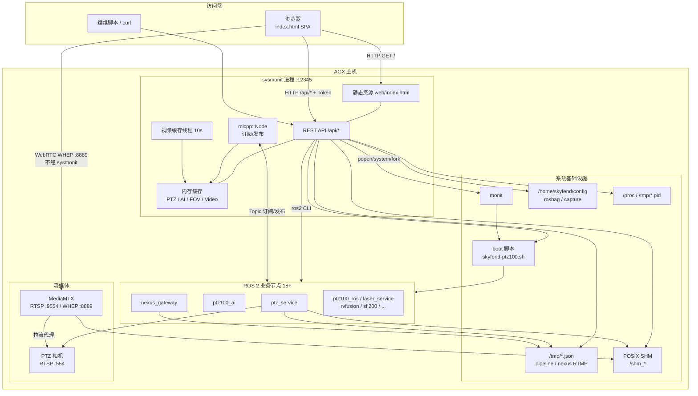
```mermaid
flowchart TB
  subgraph clients [访问端]
    Browser["浏览器<br/>index.html SPA"]
    Script["运维脚本 / curl"]
  end

  subgraph agx [AGX 主机]
    subgraph sysmonit_proc [sysmonit 进程 :12345]
      direction TB
      FE["静态资源 web/index.html"]
      API["REST API /api/*"]
      ROSN["rclcpp::Node<br/>订阅/发布"]
      CACHE["内存缓存<br/>PTZ / AI / FOV / Video"]
      BG["视频缓存线程 10s"]
      FE --- API
      API --- CACHE
      ROSN --> CACHE
      BG --> CACHE
    end

    subgraph ros_nodes [ROS 2 业务节点 18+]
      PS[ptz_service]
      AI[ptz100_ai]
      NG[nexus_gateway]
      OTH["ptz100_ros / laser_service<br/>rvfusion / sfl200 / ..."]
    end

    subgraph infra [系统基础设施]
      Monit[monit]
      Boot["boot 脚本<br/>skyfend-ptz100.sh"]
      FS["/home/skyfend/config<br/>rosbag / capture"]
      TMP["/tmp/*.json<br/>pipeline / nexus RTMP"]
      SHM["POSIX SHM<br/>/shm_*"]
      Proc["/proc / /tmp/*.pid"]
    end

    subgraph media [流媒体]
      MTX["MediaMTX<br/>RTSP :9554 / WHEP :8889"]
      PTZcam["PTZ 相机<br/>RTSP :554"]
    end
  end

  Browser -->|"HTTP GET /"| FE
  Browser -->|"HTTP /api/* + Token"| API
  Browser -->|"WebRTC WHEP :8889<br/>不经 sysmonit"| MTX
  Script --> API

  API -->|"popen/system/fork"| Monit
  API --> Boot
  API --> FS
  API --> TMP
  API --> SHM
  API --> Proc
  API -->|"ros2 CLI"| ros_nodes

  ROSN <-->|"Topic 订阅/发布"| ros_nodes
  PS --> TMP
  PS --> SHM
  NG --> TMP
  PS --> PTZcam
  MTX -->|"拉流代理"| PTZcam
  MTX --> SHM

  Monit --> Boot
  Boot --> ros_nodes
```

### 1.4 与周边模块关系（简图）

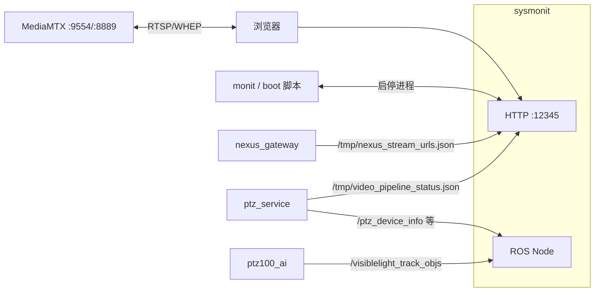
```mermaid
flowchart LR
  subgraph sysmonit [sysmonit]
    HTTP[HTTP :12345]
    ROS[ROS Node]
  end

  Browser[浏览器] --> HTTP
  Monit[monit / boot 脚本] <-->|启停进程| HTTP
  ptz_service -->|/ptz_device_info 等| ROS
  ptz100_ai -->|/visiblelight_track_objs| ROS
  nexus_gateway -->|/tmp/nexus_stream_urls.json| HTTP
  ptz_service -->|/tmp/video_pipeline_status.json| HTTP
  MediaMTX[MediaMTX :9554/:8889] <-->|RTSP/WHEP| Browser
```

---

## 2. 技术栈

### 2.1 后端

| 层次 | 技术 | 说明 |
|------|------|------|
| 语言 | **C++17** | 主业务逻辑 |
| ROS | **rclcpp** (Humble) | 节点生命周期、Topic 订阅/发布、图 API |
| HTTP 框架 | **libhv** (`thirdpart/libhv`) | 多线程 `HttpServer`，4 worker / 最大 32 连接 / keepalive 5s |
| 消息类型 | **skyfend_interfaces** | PTZ、AI、设备列表等自定义消息 |
| 配置读取 | **yamlConfig** | 读取 `ptzDevicesCfg.yaml` 等设备配置 |
| 日志 | **appLog** | 统一日志宏 |
| 辅助脚本 | **Python 3** | `bag_reader.py`（Bag 解析）、`alink_parser.py`（pcap 解析） |
| 系统调用 | `popen` / `system` / `fork` | 执行 `ros2` CLI、monit、tcpdump 等 |

**特点**：无独立 Web 框架（如 Flask/FastAPI），HTTP 与 ROS 同进程；JSON 由 `ostringstream` 手工拼接，无第三方 JSON 库。

### 2.2 前端

| 层次 | 技术 | 说明 |
|------|------|------|
| 形态 | **单文件 SPA** | `web/index.html`，内联 HTML + CSS + JavaScript |
| 构建 | **无** | 无 npm / webpack / Vite，改前端后 `colcon install` 即可 |
| 网络 | **Fetch API** | `fetch(API_BASE + path, { headers: { Authorization: 'Bearer ' + token } })` |
| 图表 | **自研 MiniChart** | Canvas 绘制 Bag 曲线，避免 CDN 依赖 |
| 视频播放 | **WebRTC WHEP** | 浏览器原生 `RTCPeerConnection`，对接 MediaMTX `:8889` |
| 国际化 | **内联 i18n 字典** | `LANG.en` / `LANG.zh`，localStorage 持久化语言 |
| 状态持久化 | **localStorage** | 如 `videoAgxIface`（eth0/eth1 选择） |

**特点**：深色运维风格 UI；Tab 切换通过 `.page` / `.page.active` CSS 类控制显示，无 React/Vue 框架。

### 2.3 前后端技术栈总览

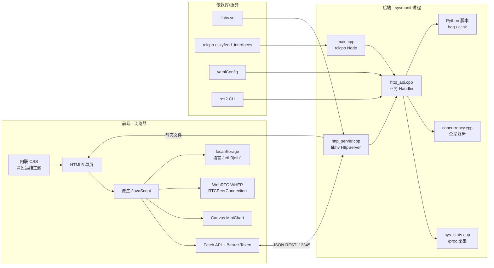
```mermaid
flowchart LR
  subgraph frontend [前端 - 浏览器]
    HTML["HTML5 单页"]
    CSS["内联 CSS<br/>深色运维主题"]
    JS["原生 JavaScript"]
    Fetch["Fetch API + Bearer Token"]
    Canvas["Canvas MiniChart"]
    WebRTC["WebRTC WHEP<br/>RTCPeerConnection"]
    LS["localStorage<br/>语言 / eth0|eth1"]
    HTML --> JS
    CSS --> HTML
    JS --> Fetch
    JS --> Canvas
    JS --> WebRTC
    JS --> LS
  end

  subgraph backend [后端 - sysmonit 进程]
    Main["main.cpp<br/>rclcpp Node"]
    HServer["http_server.cpp<br/>libhv HttpServer"]
    HApi["http_api.cpp<br/>业务 Handler"]
    Stats["sys_stats.cpp<br/>/proc 采集"]
    Conc["concurrency.cpp<br/>全局互斥"]
    Py["Python 脚本<br/>bag / alink"]
    Main --> HApi
    HServer --> HApi
    HApi --> Stats
    HApi --> Conc
    HApi --> Py
  end

  subgraph deps [依赖库/服务]
    LibHV["libhv.so"]
    RCL["rclcpp / skyfend_interfaces"]
    Yaml["yamlConfig"]
    ROS2CLI["ros2 CLI"]
    LibHV --> HServer
    RCL --> Main
    Yaml --> HApi
    ROS2CLI --> HApi
  end

  Fetch <-->|"JSON REST :12345"| HServer
  HServer -->|"静态文件"| HTML
```

### 2.4 运行期外部依赖

| 依赖 | 用途 | 是否必须 |
|------|------|----------|
| ROS 2 Humble + `ros2` CLI | 话题诊断、Bag 录制 | 是 |
| monit + boot 脚本 | 进程启停 | 进程管理功能需要 |
| MediaMTX | RTSP 代理（9554）、WebRTC WHEP（8889） | 视频页需要 |
| tcpdump | 网络抓包 | 抓包页需要 |
| nexus_gateway | 写入 `/tmp/nexus_stream_urls.json` | Nexus RTMP 卡片需要 |
| ptz_service / ptz100_ai | 写入 pipeline 状态、发布 ROS Topic | 视频诊断需要 |

---

## 3. 软件架构

### 3.1 分层架构图

sysmonit 采用 **单进程、多线程、前后端一体** 的分层结构，HTTP 与 ROS 共享同一地址空间，通过内存缓存解耦高频 ROS 数据与低频 HTTP 轮询。

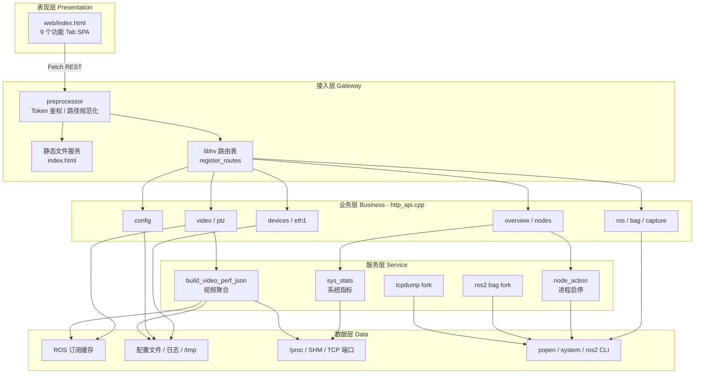
```mermaid
flowchart TB
  subgraph presentation [表现层 Presentation]
    UI["web/index.html<br/>9 个功能 Tab SPA"]
  end

  subgraph gateway [接入层 Gateway]
    Pre["preprocessor<br/>Token 鉴权 / 路径规范化"]
    Static["静态文件服务<br/>index.html"]
    Route["libhv 路由表<br/>register_routes"]
  end

  subgraph business [业务层 Business - http_api.cpp]
    HOverview["overview / nodes"]
    HDevices["devices / eth1"]
    HRos["ros / bag / capture"]
    HVideo["video / ptz"]
    HConfig["config"]
  end

  subgraph service [服务层 Service]
    StatsSvc["sys_stats<br/>系统指标"]
    NodeSvc["node_action<br/>进程启停"]
    VideoSvc["build_video_perf_json<br/>视频聚合"]
    BagSvc["ros2 bag fork"]
    CapSvc["tcpdump fork"]
  end

  subgraph data [数据层 Data]
    RosCache["ROS 订阅缓存"]
    FileIO["配置文件 / 日志 / /tmp"]
    SysProbe["/proc / SHM / TCP 端口"]
    Shell["popen / system / ros2 CLI"]
  end

  UI -->|"Fetch REST"| Pre
  Pre --> Route
  Pre --> Static
  Route --> HOverview & HDevices & HRos & HVideo & HConfig
  HOverview --> StatsSvc
  HOverview --> NodeSvc
  HDevices --> FileIO
  HRos --> Shell
  HVideo --> VideoSvc
  HVideo --> RosCache
  HConfig --> FileIO
  StatsSvc --> SysProbe
  NodeSvc --> Shell
  VideoSvc --> RosCache & FileIO & SysProbe
  BagSvc --> Shell
  CapSvc --> Shell
```

### 3.2 进程内模块划分

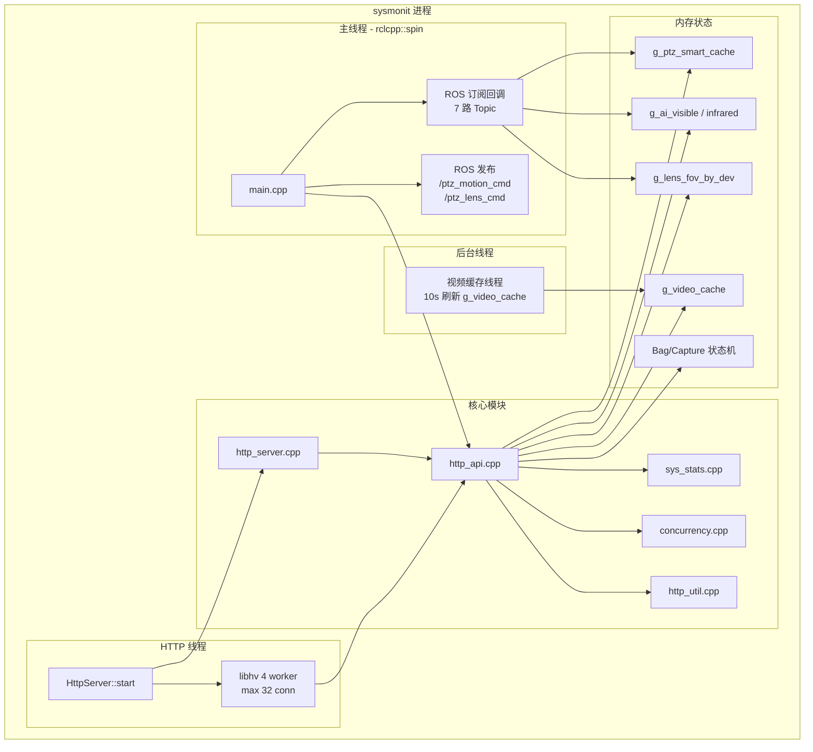
```mermaid
flowchart TB
  subgraph process [sysmonit 进程]
    subgraph main_thread [主线程 - rclcpp::spin]
      Main["main.cpp"]
      Sub["ROS 订阅回调<br/>7 路 Topic"]
      Pub["ROS 发布<br/>/ptz_motion_cmd<br/>/ptz_lens_cmd"]
      Main --> Sub
      Main --> Pub
    end

    subgraph http_thread [HTTP 线程]
      HS["HttpServer::start"]
      Workers["libhv 4 worker<br/>max 32 conn"]
      HS --> Workers
    end

    subgraph bg_thread [后台线程]
      VT["视频缓存线程<br/>10s 刷新 g_video_cache"]
    end

    subgraph modules [核心模块]
      HAPI["http_api.cpp"]
      HSRV["http_server.cpp"]
      STATS["sys_stats.cpp"]
      CONC["concurrency.cpp"]
      UTIL["http_util.cpp"]
    end

    subgraph mem [内存状态]
      C1["g_ptz_smart_cache"]
      C2["g_ai_visible / infrared"]
      C3["g_lens_fov_by_dev"]
      C4["g_video_cache"]
      C5["Bag/Capture 状态机"]
    end

    Main --> HAPI
    HS --> HSRV
    HSRV --> HAPI
    HAPI --> STATS
    HAPI --> CONC
    HAPI --> UTIL
    Sub --> C1 & C2 & C3
    VT --> C4
    HAPI --> C1 & C2 & C3 & C4 & C5
    Workers --> HAPI
  end
```

### 3.3 线程模型

| 线程 | 入口 | 职责 |
|------|------|------|
| **主线程** | `rclcpp::spin(node)` | ROS 订阅回调，更新 PTZ/AI/FOV 等内存缓存 |
| **HTTP 线程** | `std::thread → HttpServer::start()` | libhv 事件循环，4 worker 并发处理 HTTP |
| **视频缓存线程** | `HttpApi::start_video_cache_thread()` | 每 10s 调用 `build_video_perf_json("eth0")` 预热缓存 |

进程退出顺序：`server.stop()` → join HTTP 线程 → join 视频缓存线程 → `rclcpp::shutdown()`。

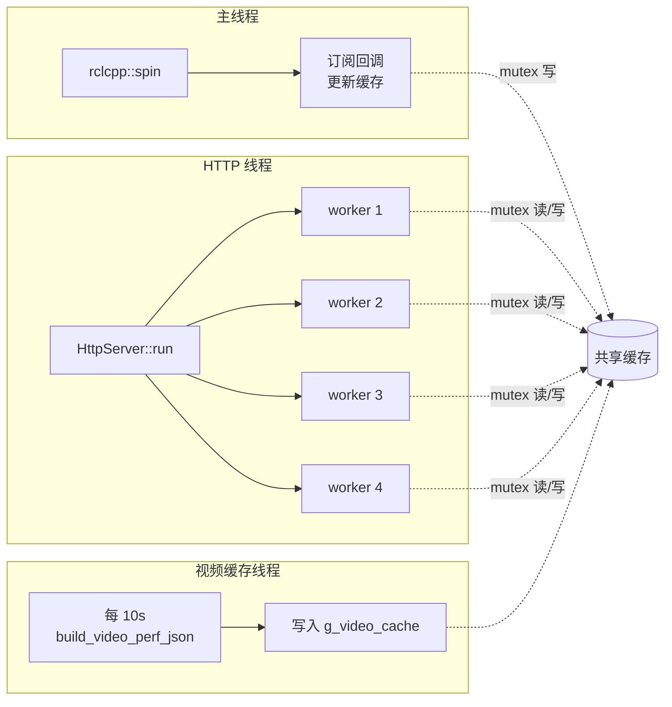
```mermaid
flowchart LR
  subgraph T1 [主线程]
    Spin["rclcpp::spin"]
    CB["订阅回调<br/>更新缓存"]
    Spin --> CB
  end

  subgraph T2 [HTTP 线程]
    Run["HttpServer::run"]
    W1["worker 1"]
    W2["worker 2"]
    W3["worker 3"]
    W4["worker 4"]
    Run --> W1 & W2 & W3 & W4
  end

  subgraph T3 [视频缓存线程]
    Loop["每 10s<br/>build_video_perf_json"]
    Loop --> VC["写入 g_video_cache"]
  end

  CB -.->|"mutex 写"| Cache[("共享缓存")]
  W1 & W2 & W3 & W4 -.->|"mutex 读/写"| Cache
  VC -.-> Cache
```

### 3.4 请求处理链路

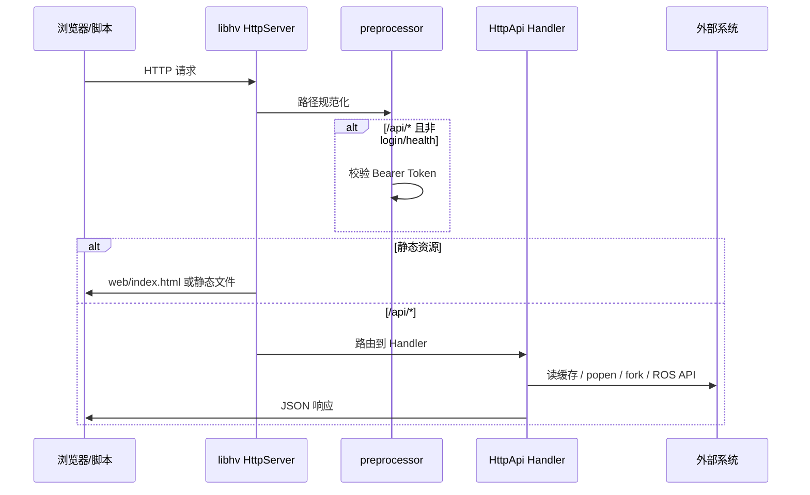
```mermaid
sequenceDiagram
  participant C as 浏览器/脚本
  participant H as libhv HttpServer
  participant P as preprocessor
  participant A as HttpApi Handler
  participant X as 外部系统

  C->>H: HTTP 请求
  H->>P: 路径规范化
  alt /api/* 且非 login/health
    P->>P: 校验 Bearer Token
  end
  alt 静态资源
    H->>C: web/index.html 或静态文件
  else /api/*
    H->>A: 路由到 Handler
    A->>X: 读缓存 / popen / fork / ROS API
    A->>C: JSON 响应
  end
```

### 3.5 认证与路由分发

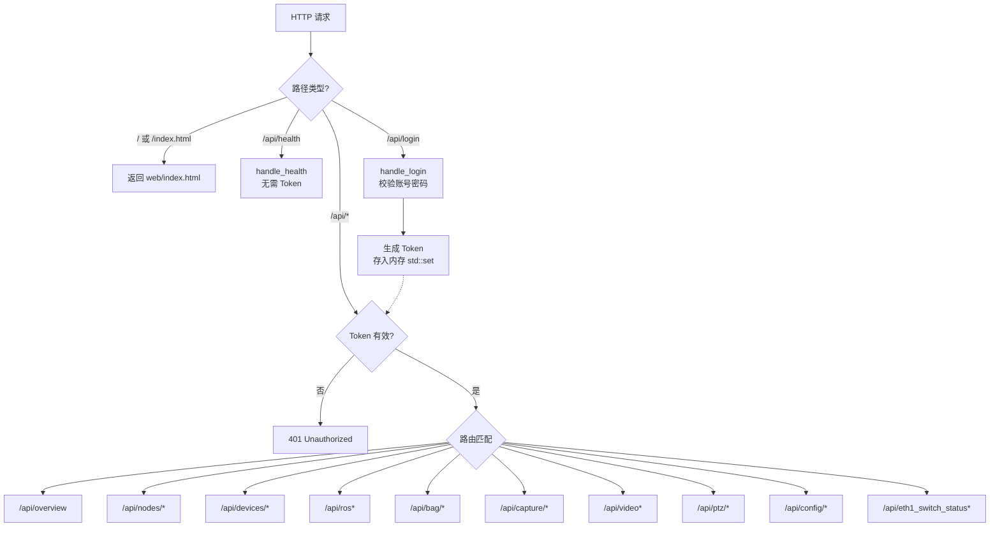
```mermaid
flowchart TD
  Req["HTTP 请求"] --> Path{"路径类型?"}

  Path -->|"/ 或 /index.html"| Static["返回 web/index.html"]
  Path -->|"/api/health"| Health["handle_health<br/>无需 Token"]
  Path -->|"/api/login"| Login["handle_login<br/>校验账号密码"]
  Path -->|"/api/*"| Auth{"Token 有效?"}

  Auth -->|否| Deny["401 Unauthorized"]
  Auth -->|是| Dispatch{"路由匹配"}

  Dispatch --> Overview["/api/overview"]
  Dispatch --> Nodes["/api/nodes/*"]
  Dispatch --> Devices["/api/devices/*"]
  Dispatch --> Ros["/api/ros*"]
  Dispatch --> Bag["/api/bag/*"]
  Dispatch --> Capture["/api/capture/*"]
  Dispatch --> Video["/api/video*"]
  Dispatch --> Ptz["/api/ptz/*"]
  Dispatch --> Config["/api/config/*"]
  Dispatch --> Eth1["/api/eth1_switch_status*"]

  Login --> Token["生成 Token<br/>存入内存 std::set"]
  Token -.-> Auth
```

### 3.6 目录结构

```
sysmonit/
├── CMakeLists.txt
├── package.xml
├── readme.md                    # 包内简要说明（本文档为完整设计版）
├── launch/sysmonit.launch.xml
├── web/index.html               # 单页前端
├── include/sysmonit/
│   ├── http_server.hpp          # libhv 封装、鉴权 preprocessor
│   ├── http_api.hpp             # API 路由与 Handler 声明
│   ├── http_util.hpp            # 路径/Token/响应工具
│   ├── concurrency.hpp          # 多线程互斥 RAII 锁
│   └── sys_stats.hpp            # 系统概览 JSON 接口
├── src/
│   ├── main.cpp                 # ROS 节点入口
│   ├── http_server.cpp
│   ├── http_api.cpp             # 核心业务（约 2900 行）
│   ├── http_util.cpp
│   ├── sys_stats.cpp
│   └── concurrency.cpp
└── scripts/
    ├── bag_reader.py
    └── alink_parser.py
```

### 3.7 并发安全设计

`concurrency.hpp` 对以下共享资源加锁，避免 libhv 多 worker 并发冲突：

| 互斥量 | 保护对象 |
|--------|----------|
| `g_ros_api_mtx` | `rclcpp::Node` 图查询（topic 列表等） |
| `g_shell_mtx` | `popen` / `system` / `ros2` CLI |
| `g_bag_mtx` | Bag 录制/播放状态机 |
| `g_capture_mtx` | tcpdump 抓包状态机 |
| `g_config_write_mtx` | 配置文件写入 |
| `g_ptz_cfg_mtx` | PTZ 设备配置读取 |
| `g_ptz_smart_mtx` | PTZ 智能分析服务器缓存 |
| `g_ai_target_mtx` | AI 目标快照 |
| `g_lens_fov_mtx` | 镜头 FOV 快照 |
| `g_video_cache_mtx` | 视频概览 JSON 缓存 |

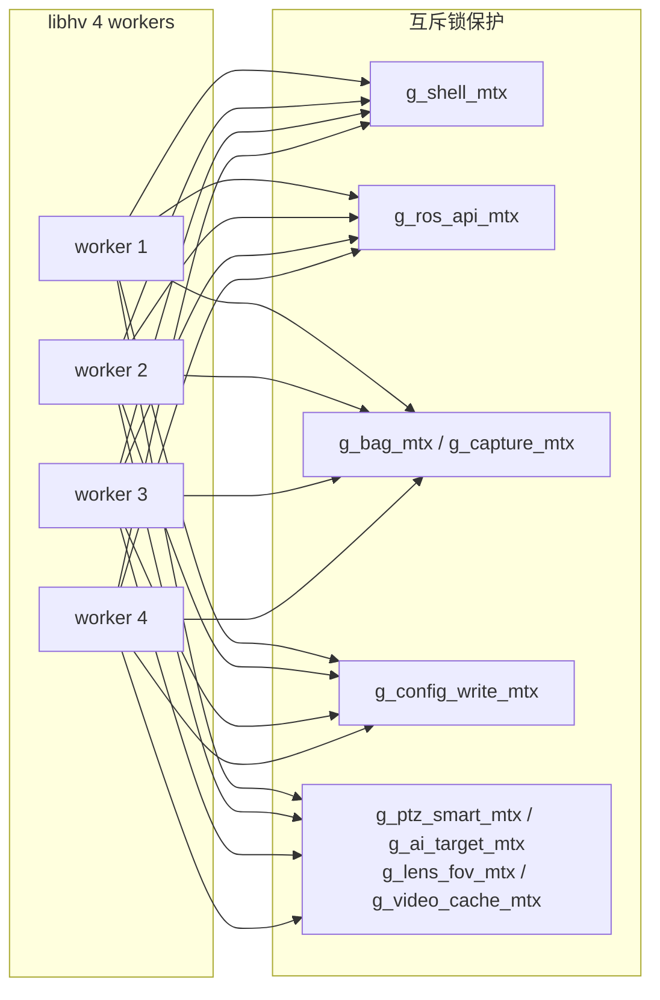
```mermaid
flowchart LR
  subgraph workers [libhv 4 workers]
    W1[worker 1]
    W2[worker 2]
    W3[worker 3]
    W4[worker 4]
  end

  subgraph locks [互斥锁保护]
    L1["g_shell_mtx"]
    L2["g_ros_api_mtx"]
    L3["g_bag_mtx / g_capture_mtx"]
    L4["g_config_write_mtx"]
    L5["g_ptz_smart_mtx / g_ai_target_mtx<br/>g_lens_fov_mtx / g_video_cache_mtx"]
  end

  W1 & W2 & W3 & W4 --> L1 & L2 & L3 & L4 & L5
```

---

## 4. 视频页数据流（重点）

视频页（`page-video`）是 sysmonit 最复杂的页面，聚合了 **ROS 实时数据**、**文件缓存**、**系统探测** 和 **浏览器 WebRTC** 四类数据源。

### 4.1 页面功能区块

| 区块 | DOM ID | 功能 |
|------|--------|------|
| 视频流列表 | `video-streams-list` | MediaMTX 代理状态、RTSP URL、Pipeline FPS |
| SHM 诊断 | `shm-info-panel` | 共享内存帧活跃情况（PTZ→AI、AI→Stream） |
| WebRTC 播放器 | `webrtc-player-section` | 通过 WHEP 低延迟预览可见光/红外 |
| AI 目标信息 | `ai-target-card` | 场景 B 下展示 AI 跟踪目标统计 |
| PTZ 遥控 | `ptz-control-card` | 方向/变焦/对焦/ICR/除雾/加热 |
| 原始 RTSP 查询 | `direct-rtsp-urls` | 按 PTZ 类型+IP 拼接相机直连 URL |
| Nexus RTMP | `nexus-rtmp-url-box` | 读取 nexus_gateway 缓存的推流地址 |

### 4.2 视频链路端到端架构图

从 PTZ 相机到浏览器预览的完整视频链路（sysmonit 负责观测与遥控，**不负责编解码**）：

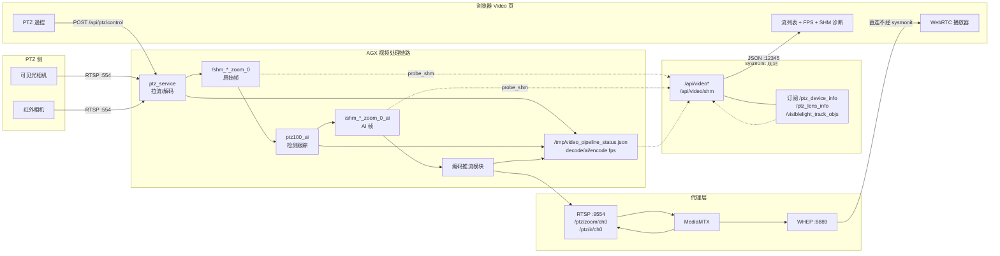
```mermaid
flowchart LR
  subgraph ptz_side [PTZ 侧]
    CamV["可见光相机"]
    CamI["红外相机"]
  end

  subgraph agx_pipeline [AGX 视频处理链路]
    PS["ptz_service<br/>拉流/解码"]
    SHM1["/shm_*_zoom_0<br/>原始帧"]
    AI["ptz100_ai<br/>检测跟踪"]
    SHM2["/shm_*_zoom_0_ai<br/>AI 帧"]
    Enc["编码推流模块"]
    Pipe["/tmp/video_pipeline_status.json<br/>decode/ai/encode fps"]
    PS --> SHM1 --> AI --> SHM2 --> Enc
    PS --> Pipe
    AI --> Pipe
    Enc --> Pipe
  end

  subgraph proxy [代理层]
    MTX["MediaMTX"]
    RTSP["RTSP :9554<br/>/ptz/zoom/ch0<br/>/ptz/ir/ch0"]
    WHEP["WHEP :8889"]
    MTX --> RTSP
    MTX --> WHEP
  end

  subgraph sysmonit_obs [sysmonit 观测]
    API["/api/video*<br/>/api/video/shm"]
    ROSsub["订阅 /ptz_device_info<br/>/ptz_lens_info<br/>/visiblelight_track_objs"]
    API --- ROSsub
  end

  subgraph browser [浏览器 Video 页]
    List["流列表 + FPS + SHM 诊断"]
    Player["WebRTC 播放器"]
    Ctrl["PTZ 遥控"]
  end

  CamV & CamI -->|"RTSP :554"| PS
  Enc --> RTSP
  RTSP --> MTX
  SHM1 & SHM2 -.->|"probe_shm"| API
  Pipe -.-> API
  ROSsub -.-> API
  API -->|"JSON :12345"| List
  WHEP -->|"直连不经 sysmonit"| Player
  Ctrl -->|"POST /api/ptz/control"| PS
```

### 4.3 数据源总览

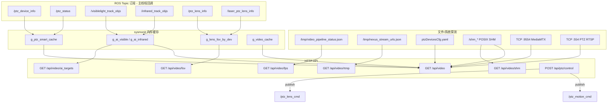
```mermaid
flowchart TB
  subgraph ros [ROS Topic 订阅 - 主线程回调]
    T1["/ptz_device_info"]
    T2["/ptz_status"]
    T3["/visiblelight_track_objs"]
    T4["/infrared_track_objs"]
    T5["/ptz_lens_info"]
    T6["/laser_ptz_lens_info"]
  end

  subgraph files [文件/系统探测]
    F1["/tmp/video_pipeline_status.json"]
    F2["/tmp/nexus_stream_urls.json"]
    F3["ptzDevicesCfg.yaml"]
    F4["/shm_* POSIX SHM"]
    F5["TCP :9554 MediaMTX"]
    F6["TCP :554 PTZ RTSP"]
  end

  subgraph cache [sysmonit 内存缓存]
    C1[g_ptz_smart_cache]
    C2[g_ai_visible / g_ai_infrared]
    C3[g_lens_fov_by_dev]
    C4[g_video_cache]
  end

  subgraph api [HTTP API]
    A1["GET /api/video"]
    A2["GET /api/video/fps"]
    A3["GET /api/video/shm"]
    A4["GET /api/video/fov"]
    A5["GET /api/video/ai_targets"]
    A6["GET /api/video/rtmp"]
    A7["POST /api/ptz/control"]
  end

  T1 --> C1
  T2 --> C1
  T3 --> C2
  T4 --> C2
  T5 --> C3
  T6 --> C3

  F1 --> A2
  F2 --> A6
  F3 --> A1
  F4 --> A1
  F4 --> A3
  F5 --> A1
  F6 --> A1

  C1 --> A1
  C2 --> A1
  C2 --> A5
  C3 --> A4
  C4 --> A1

  A7 -->|publish| P1["/ptz_motion_cmd"]
  A7 -->|publish| P2["/ptz_lens_cmd"]
```

### 4.4 后端：`build_video_perf_json` 组装逻辑

`GET /api/video?iface=eth0|eth1` 的核心由 `build_video_perf_json()` 生成，数据来源：

| 字段 | 来源 | 说明 |
|------|------|------|
| `iface` / `agx_ip` | `getifaddrs` 读网卡 IP | `?iface=eth1` 时 Proxy RTSP 用 eth1 IP |
| `mediamtx_online` | `connect()` 探测 `:9554` | MediaMTX RTSP 端口是否可达 |
| `pipeline_visible/thermal` | `/tmp/video_pipeline_status.json` | mtime < 10s 才有效；含 decode/ai/encode fps |
| `streams[]` | `ptzDevicesCfg.yaml` + SHM 探测 | 每设备可见光/红外两路 RTSP 代理 URL |
| `ptz_smart_servers[]` | `g_ptz_smart_cache`（来自 `/ptz_device_info`） | 智能分析服务器地址、场景 A/B 标志 |
| `ai_target_visible/infrared` | `g_ai_visible` / `g_ai_infrared` | 最新 AI 目标快照（2s 内视为 fresh） |

**缓存策略**：

- `iface=eth0`（默认）：读 `g_video_cache`（后台线程每 **10s** 刷新）
- `iface=eth1`：每次请求实时 `build_video_perf_json("eth1")`（不走缓存）

**streams 条目示例字段**：

```json
{
  "name": "Visible Camera",
  "sn": "SRP100-xxx",
  "cam_ip": "192.168.2.4",
  "type": 0,
  "rtsp": "rtsp://<agx_ip>:9554/ptz/zoom/ch0",
  "rtsp_direct": "rtsp://192.168.2.4:554",
  "online": true,
  "is_hepu_type": true,
  "cam_reachable": true,
  "proxy_reachable": true
}
```

`cam_reachable` 判定：PTZ `:554` 可达 **且** 对应 SHM（如 `/shm_0_zoom_0`）存在、有 frame_id、age < 10s。

### 4.5 视频子 API 分工

| API | 数据源 | 刷新特点 |
|-----|--------|----------|
| `GET /api/video` | 综合（见上） | eth0 走 10s 缓存；前端 5s 轮询一次 |
| `GET /api/video/fps` | 直读 `/tmp/video_pipeline_status.json` | 前端 **1Hz** 轮询，更新 Decode/AI/Encode FPS |
| `GET /api/video/shm` | `probe_shm()` 遍历 `/shm_{dev}_{zoom\|infrared}_0[_ai]` | 前端 **5s** 轮询 |
| `GET /api/video/fov` | `g_lens_fov_by_dev`（来自 `/ptz_lens_info`） | 前端 **1Hz** 轮询 |
| `GET /api/video/ai_targets` | `g_ai_visible` / `g_ai_infrared` | 前端 **1Hz** 轮询（与 `/api/video` 分离） |
| `GET /api/video/rtmp` | `/tmp/nexus_stream_urls.json` | 手动刷新或进入页面时加载 |
| `POST /api/ptz/control` | 发布 ROS `PtzMotionCmd` / `PtzLensCmd` | 用户操作触发 |

### 4.6 前端轮询时序

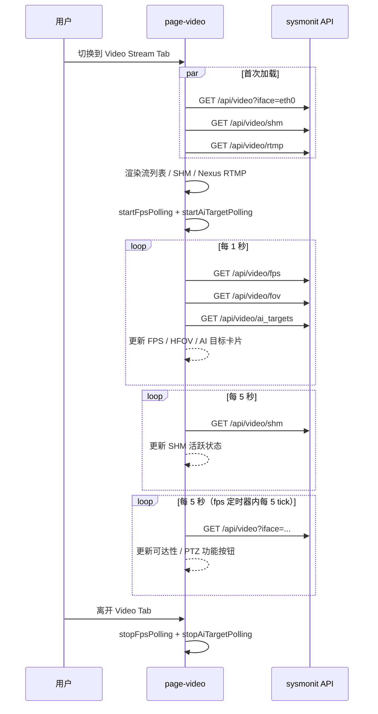
```mermaid
sequenceDiagram
  participant U as 用户
  participant P as page-video
  participant S as sysmonit API

  U->>P: 切换到 Video Stream Tab
  par 首次加载
    P->>S: GET /api/video?iface=eth0
    P->>S: GET /api/video/shm
    P->>S: GET /api/video/rtmp
  end
  P->>P: 渲染流列表 / SHM / Nexus RTMP
  P->>P: startFpsPolling + startAiTargetPolling

  loop 每 1 秒
    P->>S: GET /api/video/fps
    P->>S: GET /api/video/fov
    P->>S: GET /api/video/ai_targets
    P-->>P: 更新 FPS / HFOV / AI 目标卡片
  end

  loop 每 5 秒
    P->>S: GET /api/video/shm
    P-->>P: 更新 SHM 活跃状态
  end

  loop 每 5 秒（fps 定时器内每 5 tick）
    P->>S: GET /api/video?iface=...
    P-->>P: 更新可达性 / PTZ 功能按钮
  end

  U->>P: 离开 Video Tab
  P->>P: stopFpsPolling + stopAiTargetPolling
```

进入 Video Stream Tab 时触发：

```javascript
initVideoAgxIfaceSelect();
loadVideoPerf();        // 立即拉 /api/video，渲染流列表
loadShmInfo();          // 立即拉 /api/video/shm
loadNexusRtmpUrls();    // 立即拉 /api/video/rtmp
startFpsPolling();      // 启动 1s 定时器
startAiTargetPolling(); // 启动 1s AI 目标定时器
```

`startFpsPolling()` 内部 **1s 周期**：

| 每 tick | 请求 | 更新内容 |
|---------|------|----------|
| 每次 | `/api/video/fps` | `#fps-visible` / `#fps-thermal` Pipeline FPS |
| 每次 | `/api/video/fov` | SHM 卡片上的 HFOV 角度 |
| 每 5 tick | `/api/video?iface=...` | Proxy/Camera 可达性、`lastVideoPayload`、PTZ 功能按钮状态 |

`startAiTargetPolling()` **1s 周期**：

- 请求 `/api/video/ai_targets`
- 与 `lastVideoPayload` 合并后刷新 AI Target 卡片和 PTZ 特性控件

离开 Video Tab 时调用 `stopFpsPolling()` + `stopAiTargetPolling()` 释放定时器。

### 4.7 WebRTC 播放数据流

WebRTC **不经过 sysmonit 后端**，浏览器直连 MediaMTX WHEP 端点：

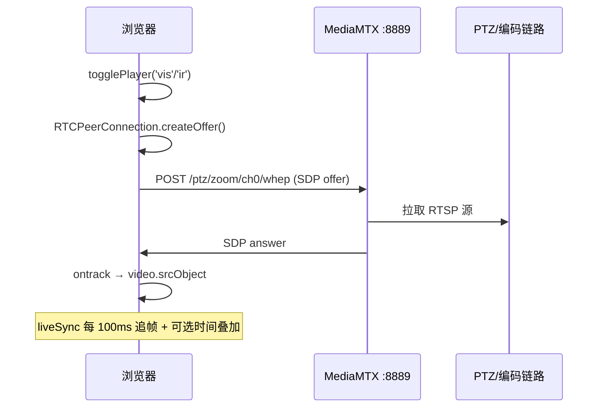
```mermaid
sequenceDiagram
  participant B as 浏览器
  participant M as MediaMTX :8889
  participant P as PTZ/编码链路

  B->>B: togglePlayer('vis'/'ir')
  B->>B: RTCPeerConnection.createOffer()
  B->>M: POST /ptz/zoom/ch0/whep (SDP offer)
  M->>P: 拉取 RTSP 源
  M->>B: SDP answer
  B->>B: ontrack → video.srcObject
  Note over B: liveSync 每 100ms 追帧 + 可选时间叠加
```

| 通道 | WHEP URL |
|------|----------|
| 可见光 | `http://<hostname>:8889/ptz/zoom/ch0/whep` |
| 红外 | `http://<hostname>:8889/ptz/ir/ch0/whep` |

低延迟优化：`jitterBufferTarget=0`、`playoutDelayHint=0`、缓冲滞后时动态调整 `playbackRate`（最高 1.18x）。

### 4.8 和普 PTZ 场景 A/B 数据流

视频页支持在 **场景 A（接和普 AI 盒子）** 与 **场景 B（直连 AGX）** 间切换：

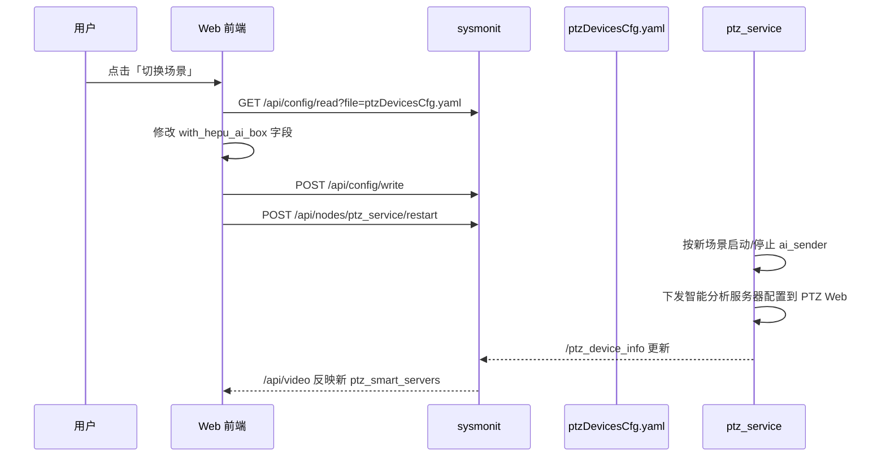
```mermaid
sequenceDiagram
  participant U as 用户
  participant W as Web 前端
  participant S as sysmonit
  participant Y as ptzDevicesCfg.yaml
  participant P as ptz_service

  U->>W: 点击「切换场景」
  W->>S: GET /api/config/read?file=ptzDevicesCfg.yaml
  W->>W: 修改 with_hepu_ai_box 字段
  W->>S: POST /api/config/write
  W->>S: POST /api/nodes/ptz_service/restart
  P->>P: 按新场景启动/停止 ai_sender
  P->>P: 下发智能分析服务器配置到 PTZ Web
  P-->>S: /ptz_device_info 更新
  S-->>W: /api/video 反映新 ptz_smart_servers
```

| 场景 | `with_hepu_ai_box` | ptz_service 行为 | AI Target 卡片 |
|------|-------------------|------------------|----------------|
| A | `true` | 不启动 ai_sender；跟踪模式=识别自适应 | 不显示 |
| B | `false` | 启动 ai_sender；自动下发 eth1:39080 | 和普 PTZ 在线时显示 |

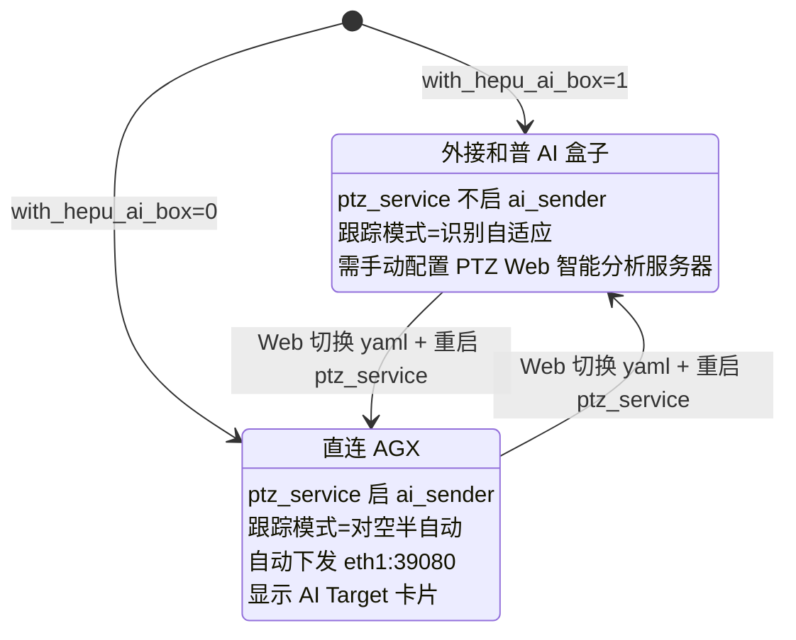
```mermaid
stateDiagram-v2
  [*] --> 场景A: with_hepu_ai_box=1
  [*] --> 场景B: with_hepu_ai_box=0

  场景A: 外接和普 AI 盒子
  场景A: ptz_service 不启 ai_sender
  场景A: 跟踪模式=识别自适应
  场景A: 需手动配置 PTZ Web 智能分析服务器

  场景B: 直连 AGX
  场景B: ptz_service 启 ai_sender
  场景B: 跟踪模式=对空半自动
  场景B: 自动下发 eth1:39080
  场景B: 显示 AI Target 卡片

  场景A --> 场景B: Web 切换 yaml + 重启 ptz_service
  场景B --> 场景A: Web 切换 yaml + 重启 ptz_service
```

### 4.9 SHM 命名与链路含义

每个 PTZ 设备索引 `devIdx`（来自 `ptzDevicesCfg.yaml` 顺序）对应 4 个 SHM：

| SHM 名 | 链路 |
|--------|------|
| `/shm_{dev}_zoom_0` | PTZ 可见光原始帧 → AI |
| `/shm_{dev}_zoom_0_ai` | AI 处理后 → 编码/推流 |
| `/shm_{dev}_infrared_0` | PTZ 红外原始帧 → AI |
| `/shm_{dev}_infrared_0_ai` | AI 处理后 → 编码/推流 |

前端根据 `exists`、`frame_id`、`age_ms` 显示 ✓(活跃) / ⚠(过期) / ✗(不存在)。

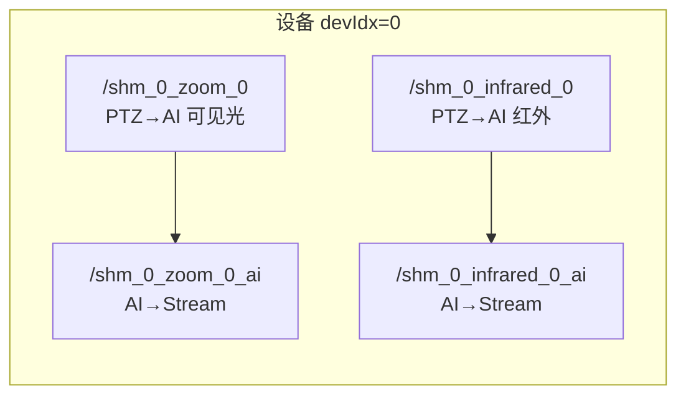
```mermaid
flowchart LR
  subgraph dev0 [设备 devIdx=0]
    Z0["/shm_0_zoom_0<br/>PTZ→AI 可见光"]
    Z0AI["/shm_0_zoom_0_ai<br/>AI→Stream"]
    I0["/shm_0_infrared_0<br/>PTZ→AI 红外"]
    I0AI["/shm_0_infrared_0_ai<br/>AI→Stream"]
    Z0 --> Z0AI
    I0 --> I0AI
  end
```

### 4.10 PTZ 遥控数据流

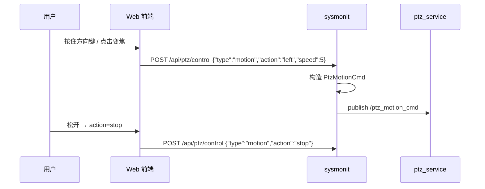
```mermaid
sequenceDiagram
  participant U as 用户
  participant W as Web 前端
  participant S as sysmonit
  participant PS as ptz_service

  U->>W: 按住方向键 / 点击变焦
  W->>S: POST /api/ptz/control {"type":"motion","action":"left","speed":5}
  S->>S: 构造 PtzMotionCmd
  S->>PS: publish /ptz_motion_cmd
  U->>W: 松开 → action=stop
  W->>S: POST /api/ptz/control {"type":"motion","action":"stop"}
```

镜头控制同理，发布到 `/ptz_lens_cmd`（变焦、对焦、除雾、加热、ICR 等）。

---

## 5. REST API 设计

### 5.1 API 模块架构图

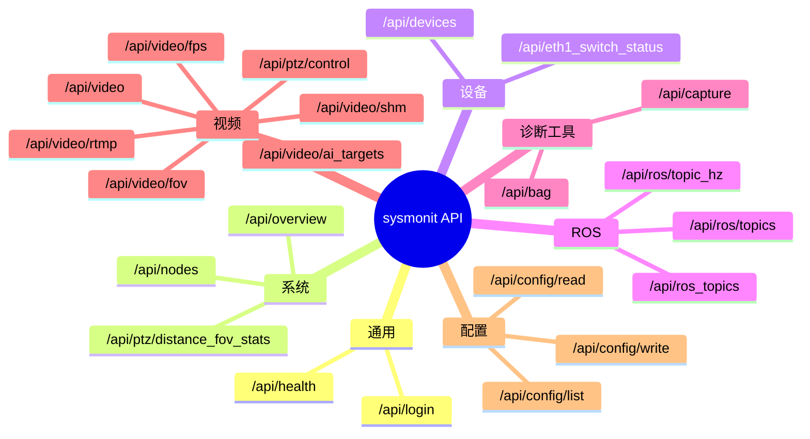
```mermaid
mindmap
  root((sysmonit API))
    通用
      /api/health
      /api/login
    系统
      /api/overview
      /api/nodes
      /api/ptz/distance_fov_stats
    设备
      /api/devices
      /api/eth1_switch_status
    ROS
      /api/ros_topics
      /api/ros/topics
      /api/ros/topic_hz
    诊断工具
      /api/bag
      /api/capture
    视频
      /api/video
      /api/video/fps
      /api/video/shm
      /api/video/fov
      /api/video/ai_targets
      /api/video/rtmp
      /api/ptz/control
    配置
      /api/config/list
      /api/config/read
      /api/config/write
```

### 5.2 认证

| 项目 | 说明 |
|------|------|
| 默认账号 | `admin` / `monit`（`http_api.cpp` 中 `kUser`/`kPass`，**生产需修改**） |
| 登录 | `POST /api/login` → `{"token":"..."}` |
| 鉴权 | `Authorization: Bearer <token>` 或 Cookie；`/api/health`、`/api/login` 除外 |
| 有效期 | 进程重启后 Token 失效 |

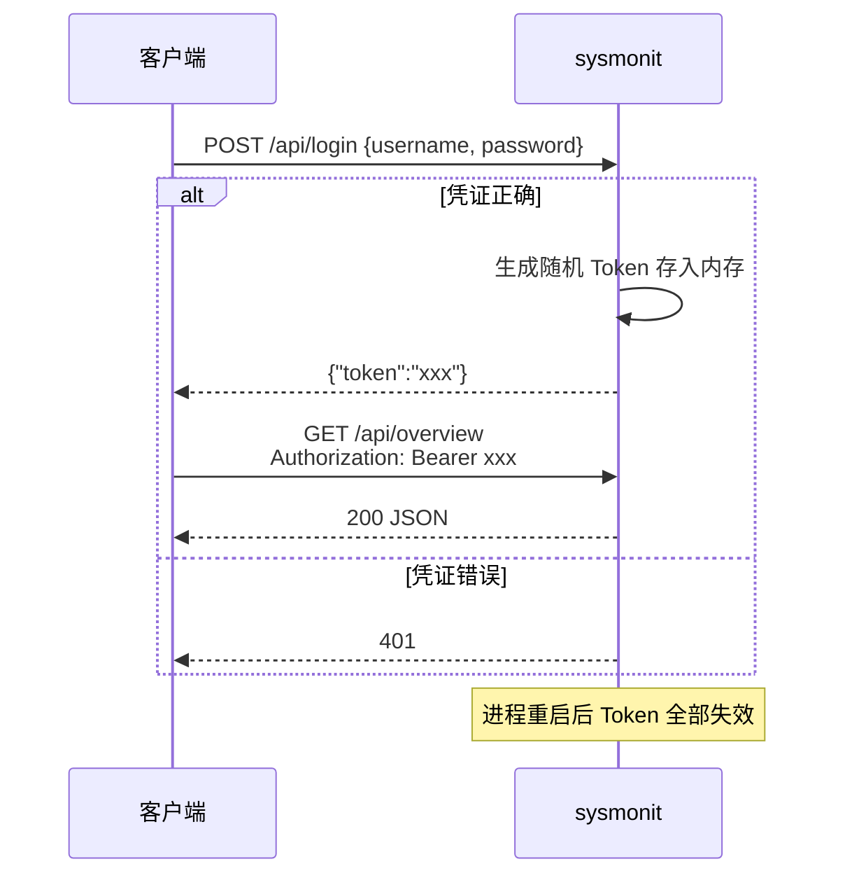
```mermaid
sequenceDiagram
  participant C as 客户端
  participant S as sysmonit

  C->>S: POST /api/login {username, password}
  alt 凭证正确
    S->>S: 生成随机 Token 存入内存
    S-->>C: {"token":"xxx"}
    C->>S: GET /api/overview<br/>Authorization: Bearer xxx
    S-->>C: 200 JSON
  else 凭证错误
    S-->>C: 401
  end
  Note over S: 进程重启后 Token 全部失效
```

### 5.3 API 分组一览

#### 通用

| 方法 | 路径 | 说明 |
|------|------|------|
| GET | `/api/health` | `{"status":"ok"}`，无需登录 |
| POST | `/api/login` | JSON 或 form 登录 |

#### 系统概览

| 方法 | 路径 | 说明 |
|------|------|------|
| GET | `/api/overview` | CPU/内存/磁盘/网络/温度/进程列表 |

#### 进程/节点（Monit）

| 方法 | 路径 | 说明 |
|------|------|------|
| GET | `/api/nodes` | 18 个监控节点状态 |
| GET | `/api/nodes/:name` | 单节点状态 |
| GET | `/api/nodes/:name/detail` | 节点详情 |
| POST | `/api/nodes/:name/:action` | `start`/`stop`/`restart`（异步 `std::thread`） |

监控节点列表：`ptz100_ros`、`ptz100_ai`、`rvfusion_service`、`sfl200`、`ptz_guider_ctl`、`laser_guider_ctl`、`multiple_radar_calibration`、`sysmanager`、`dhp100_link`、`dhp100_tracker`、`spoofer`、`spoofer_fixed_point`、`electronic_fence`、`br100a`、`laser_service`、`ptz_service`、`nexus_gateway`、`sysmonit`。

#### 设备类型

| 方法 | 路径 | 说明 |
|------|------|------|
| GET | `/api/devices/main` | 主设备列表 |
| GET | `/api/devices/sub` | 子设备列表 |
| GET | `/api/devices/current_type` | 当前主次设备类型 |
| POST | `/api/devices/settype` | 设置设备类型 |

#### eth1 交换机

| 方法 | 路径 | 说明 |
|------|------|------|
| GET | `/api/eth1_switch_status` | 读 ARP 扫描缓存 |
| POST | `/api/eth1_switch_status/scan` | 触发 `arp-scan`/`nmap`（5s 限流） |

#### ROS 诊断

| 方法 | 路径 | 说明 |
|------|------|------|
| GET | `/api/ros_topics` | 预设话题列表（兼容旧接口） |
| GET | `/api/ros_topics/:node_name` | 按节点名返回话题 |
| GET | `/api/ros/topics` | 当前 ROS 图全部 topic |
| GET | `/api/ros/nodes` | 节点名列表 |
| GET | `/api/ros/topic_detail?topic=` | topic 详情 |
| GET | `/api/ros/topic_hz?topic=` | 近似频率 |
| GET | `/api/ros/topic_echo?topic=` | echo 一条消息 |

#### ROS Bag

| 方法 | 路径 | 说明 |
|------|------|------|
| GET | `/api/bag/list` | `/home/skyfend/rosbag` 列表 |
| POST | `/api/bag/record` | 开始录制 |
| POST | `/api/bag/stop` | 停止录制 |
| GET | `/api/bag/status` | 录制状态 |
| GET | `/api/bag/info?name=` | Bag 详情（Python） |
| POST | `/api/bag/play` | 播放 |
| POST | `/api/bag/play_stop` | 停止播放 |
| POST | `/api/bag/delete` | 删除 |
| GET | `/api/bag/plot` | 绘图数据 |
| GET | `/api/bag/fields` | 可绘字段 |
| GET | `/api/bag/download?name=` | 下载 tar.gz |

#### 网络抓包

| 方法 | 路径 | 说明 |
|------|------|------|
| GET | `/api/capture/status` | tcpdump 状态 |
| POST | `/api/capture/start` | 启动抓包 |
| POST | `/api/capture/stop` | 停止 |
| GET | `/api/capture/list` | pcap 列表 |
| GET | `/api/capture/parse` | Alink 解析 |
| GET | `/api/capture/download` | 下载 pcap |
| POST | `/api/capture/delete` | 删除 |

#### 视频（见第 4 章）

| 方法 | 路径 | 说明 |
|------|------|------|
| GET | `/api/video?iface=` | 视频流综合信息 |
| GET | `/api/video/fps` | Pipeline FPS |
| GET | `/api/video/shm` | SHM 探测 |
| GET | `/api/video/fov` | 镜头水平 FOV |
| GET | `/api/video/ai_targets` | AI 目标快照 |
| GET | `/api/video/rtmp` | Nexus RTMP 地址 |
| POST | `/api/ptz/control` | PTZ 遥控 |
| GET | `/api/ptz/distance_fov_stats` | 距离-FOV 异常统计（读 ptz_service.log） |

#### 配置编辑

| 方法 | 路径 | 说明 |
|------|------|------|
| GET | `/api/config/list` | `/home/skyfend/config` 可编辑文件 |
| GET | `/api/config/read?file=` | 读文件 |
| POST | `/api/config/write` | 写文件（自动 `.bak` 备份） |

---

## 6. ROS 集成

### 6.1 ROS 通信拓扑图

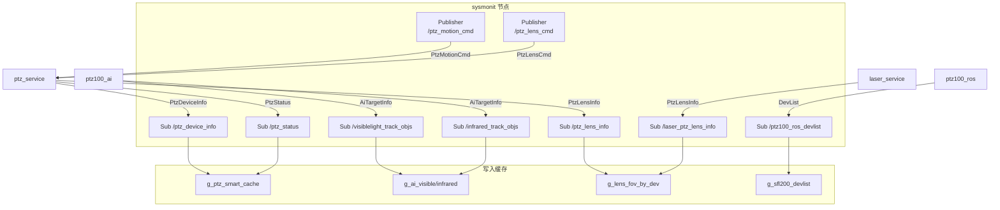
```mermaid
flowchart TB
  subgraph sysmonit_node [sysmonit 节点]
    direction TB
    PubM["Publisher<br/>/ptz_motion_cmd"]
    PubL["Publisher<br/>/ptz_lens_cmd"]
    Sub1["Sub /ptz_device_info"]
    Sub2["Sub /ptz_status"]
    Sub3["Sub /ptz100_ros_devlist"]
    Sub4["Sub /visiblelight_track_objs"]
    Sub5["Sub /infrared_track_objs"]
    Sub6["Sub /ptz_lens_info"]
    Sub7["Sub /laser_ptz_lens_info"]
  end

  PS[ptz_service]
  AI[ptz100_ai]
  ROS[ptz100_ros]
  Laser[laser_service]

  PS -->|"PtzDeviceInfo"| Sub1
  PS -->|"PtzStatus"| Sub2
  PS -->|"PtzLensInfo"| Sub6
  AI -->|"AiTargetInfo"| Sub4
  AI -->|"AiTargetInfo"| Sub5
  ROS -->|"DevList"| Sub3
  Laser -->|"PtzLensInfo"| Sub7

  PubM -->|"PtzMotionCmd"| PS
  PubL -->|"PtzLensCmd"| PS

  subgraph cache_map [写入缓存]
    C1["g_ptz_smart_cache"]
    C2["g_ai_visible/infrared"]
    C3["g_lens_fov_by_dev"]
    C4["g_sfl200_devlist"]
  end

  Sub1 & Sub2 --> C1
  Sub4 & Sub5 --> C2
  Sub6 & Sub7 --> C3
  Sub3 --> C4
```

### 6.2 发布

| Topic | 消息类型 | QoS | 触发 |
|-------|----------|-----|------|
| `/ptz_motion_cmd` | `skyfend_interfaces/msg/PtzMotionCmd` | 10 | `POST /api/ptz/control` type=motion |
| `/ptz_lens_cmd` | `skyfend_interfaces/msg/PtzLensCmd` | 10 | `POST /api/ptz/control` type=lens |

### 6.3 订阅

| Topic | 消息类型 | QoS | 缓存用途 |
|-------|----------|-----|----------|
| `/ptz_device_info` | `PtzDeviceInfo` | 10 | `g_ptz_smart_cache`：智能分析服务器、除雾/加热状态 |
| `/ptz_status` | `PtzStatus` | 10 | 补充 `day_night_mode`（ICR 状态） |
| `/ptz100_ros_devlist` | `DevList` | 10 | 子设备列表（Devices 页） |
| `/visiblelight_track_objs` | `AiTargetInfo` | KeepLast(5) best_effort | `g_ai_visible` |
| `/infrared_track_objs` | `AiTargetInfo` | KeepLast(5) best_effort | `g_ai_infrared` |
| `/ptz_lens_info` | `PtzLensInfo` | KeepLast(5) best_effort | `g_lens_fov_by_dev` |
| `/laser_ptz_lens_info` | `PtzLensInfo` | KeepLast(5) best_effort | 同上（激光 PTZ） |

**设计原则**：高频 Topic（AI 25Hz）采用「最新一帧覆盖」策略，HTTP 层以 1Hz 拉取缓存，避免背压。

---

## 7. 前端页面结构

### 7.1 SPA 导航结构图

```mermaid
flowchart TB
  Login["#login-page<br/>POST /api/login"] --> Dash["#dashboard"]

  Dash --> Nav["顶部导航 nav-tab"]
  Nav --> P1["page-overview<br/>系统概览"]
  Nav --> P2["page-nodes<br/>进程管理"]
  Nav --> P3["page-ros<br/>ROS 话题"]
  Nav --> P4["page-devices<br/>设备类型"]
  Nav --> P5["page-config<br/>配置编辑"]
  Nav --> P6["page-video<br/>视频流"]
  Nav --> P7["page-bag<br/>ROS Bag"]
  Nav --> P8["page-capture<br/>网络抓包"]

  P2 --> P2D["page-node-detail<br/>单节点详情子页"]

  P1 -.->|"5s 轮询"| API1["/api/overview"]
  P2 -.->|"手动/定时"| API2["/api/nodes"]
  P3 -.->|"按需"| API3["/api/ros/*"]
  P4 -.->|"自动刷新"| API4["/api/devices/*"]
  P5 -.->|"按需"| API5["/api/config/*"]
  P6 -.->|"1s/5s 轮询"| API6["/api/video/*"]
  P7 -.->|"按需"| API7["/api/bag/*"]
  P8 -.->|"按需"| API8["/api/capture/*"]
```

### 7.2 页面与 API 映射

| 页面 ID | Tab 名称 | 主要 API |
|---------|----------|----------|
| `page-overview` | Overview | `/api/overview`、`/api/ptz/distance_fov_stats` |
| `page-nodes` | Nodes | `/api/nodes` |
| `page-node-detail` | （子页） | `/api/nodes/:name/detail` |
| `page-ros` | ROS Topics | `/api/ros/topics`、`topic_echo` 等 |
| `page-devices` | Device Type | `/api/devices/*`、`/api/eth1_switch_status` |
| `page-config` | Config | `/api/config/*` |
| `page-video` | Video Stream | `/api/video/*`、`/api/ptz/control` |
| `page-bag` | ROS Bag | `/api/bag/*` |
| `page-capture` | Capture | `/api/capture/*` |

页面切换逻辑：`loadCurrentPage()` 根据 `data-page` 属性显示对应 `.page`，并启动/停止各页定时器。

---

## 8. 部署与运行

### 8.1 部署架构图

```mermaid
flowchart TB
  subgraph build [构建阶段]
    Src["ros_ws/src/sysmonit"]
    Colcon["colcon build --packages-select sysmonit"]
    Install["install/sysmonit/<br/>lib/sysmonit/sysmonit<br/>share/sysmonit/web/"]
    Src --> Colcon --> Install
  end

  subgraph runtime [运行阶段]
    StartSh["ros_ws/scripts/start.sh<br/>或 ros2 launch"]
    Monit["monit<br/>skyfend-ptz100-monit"]
    BootApp["boot_app.sh sysmonit start"]
    Exec["sysmonit 可执行文件"]
    PID["/tmp/sysmonit.pid"]

    StartSh --> Exec
    Monit --> BootApp --> Exec
    Exec --> PID
  end

  subgraph access [访问]
    Browser["http://AGX_IP:12345/"]
    Exec --> Browser
  end

  Install --> StartSh
  Install --> BootApp
```

### 8.2 进程启停链路

```mermaid
sequenceDiagram
  participant W as Web / API
  participant S as sysmonit
  participant M as program_monit.sh
  participant B as skyfend-ptz100.sh
  participant Mon as monit

  W->>S: POST /api/nodes/ptz_service/restart
  S->>S: std::thread 异步执行 node_action
  alt program_monit.sh 可执行
    S->>M: program_monit.sh ptz_service restart
  else 回退
    S->>B: bash skyfend-ptz100.sh -s ptz_service -e restart
  end
  M->>Mon: monit restart ptz_service
  B->>Mon: 等效启停
  Mon-->>S: 进程状态变化
  S-->>W: GET /api/nodes 反映新状态
```

### 8.3 编译安装

```bash
cd /path/to/ros_ws
source /opt/ros/humble/setup.bash
colcon build --packages-select sysmonit
source install/setup.bash
```

静态资源安装至：`install/sysmonit/share/sysmonit/web/`。

### 8.4 启动方式

```bash
# ROS launch
ros2 launch sysmonit sysmonit.launch.xml

# 或直接运行
ros2 run sysmonit sysmonit
```

`ros_ws/scripts/start.sh` 亦通过 `nohup` 启动 sysmonit。

### 8.5 monit 托管

`config/monit/skyfend-ptz100-monit` 配置：

```
check process sysmonit with pidfile /tmp/sysmonit.pid
    start program = ".../boot_app.sh sysmonit start"
    stop program  = ".../boot_app.sh sysmonit stop"
    restart program = ".../boot_app.sh sysmonit restart"
```

进程启停优先调用 `config/tools/program_monit.sh`，否则回退 `config/boot/skyfend-ptz100.sh`。

### 8.6 关键路径常量

| 常量 | 路径 |
|------|------|
| HTTP 端口 | `12345` |
| 配置目录 | `/home/skyfend/config` |
| Bag 目录 | `/home/skyfend/rosbag` |
| 抓包目录 | `/home/skyfend/capture` |
| Pipeline 状态 | `/tmp/video_pipeline_status.json` |
| Nexus RTMP 缓存 | `/tmp/nexus_stream_urls.json` |
| MediaMTX RTSP | `:9554` |
| MediaMTX WHEP | `:8889` |

---

## 9. 安全与运维注意

1. **默认密码硬编码**：`admin/monit` 写在源码中，生产环境务必修改或外置配置
2. **无 TLS**：HTTP 明文传输，仅建议内网/VPN 使用，或通过 Nginx 反代加 HTTPS
3. **命令执行风险**：多处 `popen`/`system`/`fork` 执行 shell 与 `ros2`，需控制运行用户权限
4. **sudo 依赖**：monit summary、arp-scan 等使用 `echo 123456 | sudo -S`
5. **慢 API 占满 worker**：`ros2 topic hz`、bag 打包等耗时操作会阻塞 libhv worker，前端不宜过高频轮询
6. **前端更新**：修改 `index.html` 后需重新 `colcon build` 并重启节点

---

## 10. 扩展开发建议

### 10.1 新增 API

1. 在 `http_api.hpp` 声明 Handler
2. 在 `http_api.cpp` 实现逻辑
3. 在 `register_routes()` 注册路由（注意路径前缀顺序）
4. 在 `index.html` 增加 `req('/api/...')` 调用

### 10.2 新增前端 Tab

1. 增加 `id="page-xxx"` 区块与导航 `data-page="xxx"`
2. 在 `loadCurrentPage()` 增加分支
3. 实现 `loadXxx()` 与对应定时器启停

### 10.3 建议外置化的配置

| 当前硬编码 | 建议 |
|------------|------|
| HTTP 端口 12345 | ROS 参数或 YAML |
| 账号密码 | 环境变量或加密配置文件 |
| 目录路径 | ROS 参数 |
| monit sudo 密码 | 专用 sudoers 免密规则 |

### 10.4 相关文档

- 包内简要说明：`ros_ws/src/sysmonit/readme.md`
- PTZ 多设备方案：`doc/和普PTZ多设备支持改造方案.md`
- Nexus 推流：`doc/NexusGateway_开发方案.md`

---

*文档维护：随 `ros_ws/src/sysmonit` 代码演进同步更新。*
