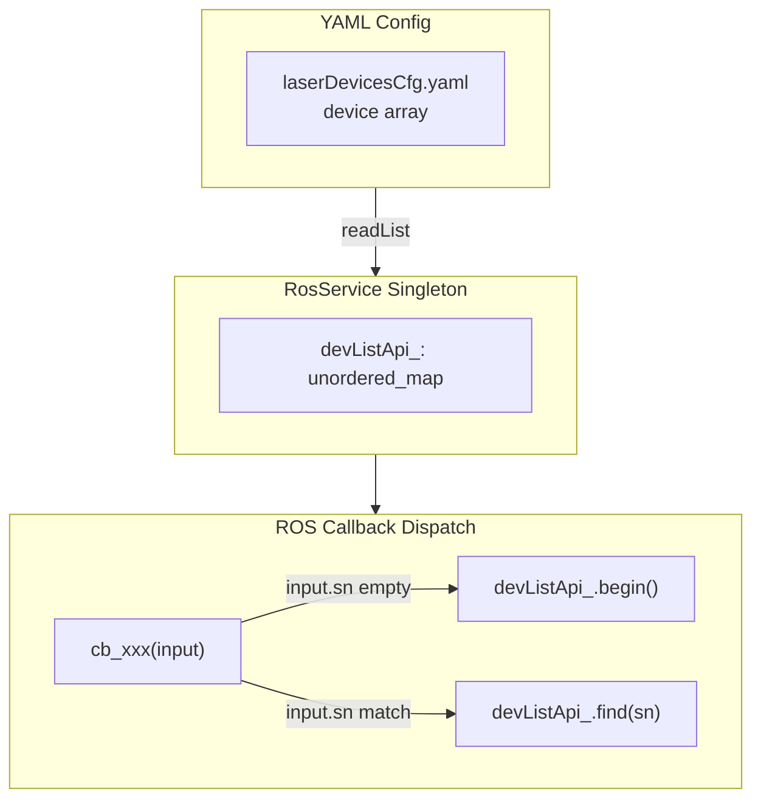

# ptz_service 多设备支持改造方案

## 现状分析

你说得对——`iotDevices/ptzHepuSDK` 的 `HepuPtz`/`HepuPtzCtrl` 不是单例，每个实例持有独立的 `DevHandle`、IP、连接状态，**SDK 层已支持多设备**。瓶颈在 `ptz_service` 层：

- `RosService` 单例只持有一个 `std::unique_ptr<PtzDeviceBase> deviceApi`_
- `PtzDeviceHepu` 构造函数里 `loadPtzConfigIp/Sn/Type` 写死 `getByIndex(0, ...)`
- SHM 命名写死 `generateShmName(0, ...)`, RTSP 推流端口写死 `5410/5411`

## 参考架构：laser_service 模式




**关键点**：topic 不按设备分，所有设备共享同一组 topic 名称，通过消息中的 `sn`/`dev_id` 字段路由到对应设备。PTZ 消息已有 `dev_id` 和 `photoelectricity_no` 字段，可复用。

## 改造方案（共 5 个文件）

### 1. PtzDevice 工厂：`createDevice` 增加 SN 参数

**文件**: [ptzDevice.h](ros_ws/src/ptz_service/src/ptzDevice/ptzDevice.h)

- `createDevice(DeviceType type, const std::string& sn)` 增加 `sn` 参数传入
- 内部 `std::make_unique<PtzDeviceHepu>(sn)` 将 SN 传给设备实例

### 2. PtzDeviceHepu：构造函数接受设备 index/SN，不再写死 index 0

**文件**: [ptzDeviceHepu.h](ros_ws/src/ptz_service/src/ptzDevice/ptzDeviceHepu.h), [ptzDeviceHepu.cpp](ros_ws/src/ptz_service/src/ptzDevice/ptzDeviceHepu.cpp)

- 构造函数改为 `PtzDeviceHepu(const std::string& sn)`，存储 SN
- `loadPtzConfigIp/Sn/Type` 改为通过 SN 查找配置（遍历 `ptzCfgApi`_ 按 SN 匹配），而非写死 `getByIndex(0, ...)`
- SHM 命名：根据设备在 YAML 中的索引（0 或 1）动态生成 `generateShmName(deviceIndex, ...)`, 不再写死 0
- RTSP 推流端口：根据设备索引偏移，如 index 0 用 5410/5411，index 1 用 5412/5413
- 状态上报时填充正确的 `dev_id`（基于设备索引或通过 SN 映射）

### 3. RosService：deviceApi_ 改为 unordered_map

**文件**: [rosService.h](ros_ws/src/ptz_service/src/rosService/rosService.h), [rosService.cpp](ros_ws/src/ptz_service/src/rosService/rosService.cpp)

**头文件改动**:

- `std::unique_ptr<PtzDeviceBase> deviceApi`_ 改为 `std::unordered_map<std::string, std::unique_ptr<PtzDeviceBase>> devListApi`_
- 新增 `PtzDeviceBase* findDevice(uint32_t dev_id)` 或 `findDevice(const std::string& sn)` 辅助查找方法

**init() 改动**:

- 遍历 `ptzCfgApi_.getCount()` 个设备，对每个调用 `getByIndex(i, ptzDev)`
- 为每个设备创建 `PtzDevice::createDevice(devType, ptzDev.sn)` 并 `try_emplace(ptzDev.sn, ...)`
- topic 名称保持不变（不按设备分 topic，参考 laser_service）

**回调改动（8 个 cb_ 函数）**:

- 控制类回调（`cb_ptz_guidance_cmd`, `cb_ptz_motion_cmd`, `cb_ptz_lens_cmd`, `cb_ptz_track_cmd`, `cb_ptz_manual_lock_target`, `cb_ptz_switch_track`）：消息中有 `dev_id`/`photoelectricity_no`，通过 `dev_id` 查找对应设备；如果 `dev_id == 0` 则路由到默认第一台（`begin()`）
- AI 检测回调（`cb_visible_track`, `cb_infrared_track`）：`AiTargetInfo` 消息需要确认是否有设备标识字段。如果没有，暂时路由到默认第一台设备（与 laser_service 对 PTZ 算法指令的处理一致）

**发布改动**:

- `pub_ptz_status`、`pub_ptz_device_info` 等发布函数不变，多台设备各自调用同一个 publisher 发布，消息中的 `dev_id`/`sn` 字段区分来源

**deInit() 改动**:

- 遍历 `devListApi`_ 逐个 reset，然后 clear

### 4. ~~PtzDevicesCfg：新增 getBySn 方法~~ — 不需要

`DevicesCfgBase<T>` 基类已内置 `getBySn` 和 `updateBySn` 方法（`devicesCfgBase.h` 第 268 行），`PtzDevicesCfg` 直接继承可用，与 laser_service 调用 `g_laserDevCfgApi.getBySn()` 方式完全一致。**无需新增任何方法。**

### 5. dev_id 路由策略 — 确定方案 A

**结论**：`dev_id` = YAML 设备索引（0, 1）。

**dev_id 上报链路分析**：`dev_id` 不是随便填的占位字段。在感知目标上报（0xE3 协议）链路中，`dev_id` 会从引导节点 → ros_app → alink → C2 完整透传：

- `ptz_guider_ctl` 发布 `PtzGuidingInfoVis`（含 `dev_id`）
- `ros_app::ptz_guiding_vis_callback` 将 `dev_id` 拷贝到 `alink_ptz_tracked.dev_id`
- `track_pkg_target_info_perception`（`alink_target.c:178`）将 `dev_id` 原样打包到 0xE3 二进制包发给 C2

**具体做法**：

- **上报**：`PtzDeviceHepu` 上报状态时 `dev_id = deviceIndex`_（设备在 YAML 中的索引）
- **接收**：`RosService` 回调中按 `input->dev_id` 查 `indexToSnMap_[dev_id]` → 路由到对应 `devListApi_[sn]`
- **兼容**：单台设备时 `dev_id = 0`，与当前行为一致；`dev_id == 0` 且 map 中只有 1 个 entry 时路由到唯一设备

## 资源隔离汇总


| 资源         | 当前                                   | 改造后                                          |
| ---------- | ------------------------------------ | -------------------------------------------- |
| SHM        | `/shm_0_zoom_0`, `/shm_0_infrared_0` | `/shm_{idx}_zoom_0`, `/shm_{idx}_infrared_0` |
| RTSP 推流端口  | 5410/5411                            | 5410+idx*2 / 5411+idx*2                      |
| ROS Topic  | 全局共享                                 | 保持共享，消息内 dev_id/sn 区分                        |
| HepuPtz 实例 | 1 个                                  | N 个，各自独立 IP/handle                           |


### 6. ptzHepuViewCfg：改为按 SN 存储每台设备独立 FOV 表

**文件**: [ptzHepuViewCfg.h](iotDevices/ptzHepuSDK/include/ptzHepuViewCfg.h), [ptzHepuViewCfg.cpp](iotDevices/ptzHepuSDK/src/ptzHepuViewCfg.cpp)

**问题**：当前 `PtzHepuViewCfg` 单例存储 3 张全局共享表（visible / uncooled_thermal / cooled_thermal）。但不同 PTZ 设备即使类型相同（如都是非制冷），可见光和热像镜头参数也可能不同，FOV 表不能共用。

**YAML 新格式**（一份文件，按 SN 分 section）：

```yaml
# ptzHepuViewCfg.yaml
devices:
  - sn: "SN-PTZ-A1234"
    visible_table:
      100: 20.0
      200: 12.0
      # ...
    thermal_table:
      100: 18.46
      200: 13.85
      # ...

  - sn: "SN-PTZ-B5678"
    visible_table:
      100: 15.0
      200: 10.0
      # ...
    thermal_table:
      100: 13.39
      200: 13.39
      # ...
```

每台设备 2 张表：`visible_table` + `thermal_table`（不再区分 cooled/uncooled，每台设备的热像就是它自己的那张表）。

**PtzHepuViewCfg 类改动**：

- 成员变量从 3 张 map 改为按 SN 索引的结构：

```cpp
  struct DeviceViewTables {
      std::map<uint32_t, double> visibleTable;
      std::map<uint32_t, double> thermalTable;
  };
  std::unordered_map<std::string, DeviceViewTables> devTablesMap_;
  

```

- 查询接口增加 SN 参数：

```cpp
  double getVisibleViewAngle(const std::string& sn, uint32_t distance);
  double getThermalViewAngle(const std::string& sn, uint32_t distance);
  

```

- `loadCfg` 解析新的 YAML 格式
- `createDefaultCfg` 生成新格式默认文件（当前 Z50 数据作为第一台设备默认值）
- 向后兼容：如果 YAML 中找不到某 SN，使用 `devTablesMap_.begin()` 的表作为 fallback 并 LOG_WARN

### 7. HepuPtzCtrl：distanceToView 改用设备 SN 查询

**文件**: [ptz_hepu_ctrl.h](iotDevices/ptzHepuSDK/include/ptz_hepu_ctrl.h), [ptz_hepu_ctrl.cpp](iotDevices/ptzHepuSDK/src/ptz_hepu_ctrl.cpp)

- `HepuPtzCtrl` 新增成员 `std::string deviceSn`_ 和 setter `void setDeviceSn(const std::string& sn)`
- `PtzDeviceHepu` 构造时调用 `deviceApi_->ctrl->setDeviceSn(deviceSn_)`
- `distanceToView` 彻底简化，去掉 `getByIndex(0)` 和制冷/非制冷判断：

```cpp
case VT_LIGHT:
    view = cfgInstance.getVisibleViewAngle(deviceSn_, distUint32);
    break;
case VT_IRD:
    view = cfgInstance.getThermalViewAngle(deviceSn_, distUint32);
    break;
```

## 不涉及的模块

- `ptzDevicesCfg.yaml` — 已支持多设备配置，无需修改
- `sysmonit` — C++ 后端动态遍历设备列表，功能不受影响（前端帮助文档可选更新）
- AI/引导团队代码 — 不修改

