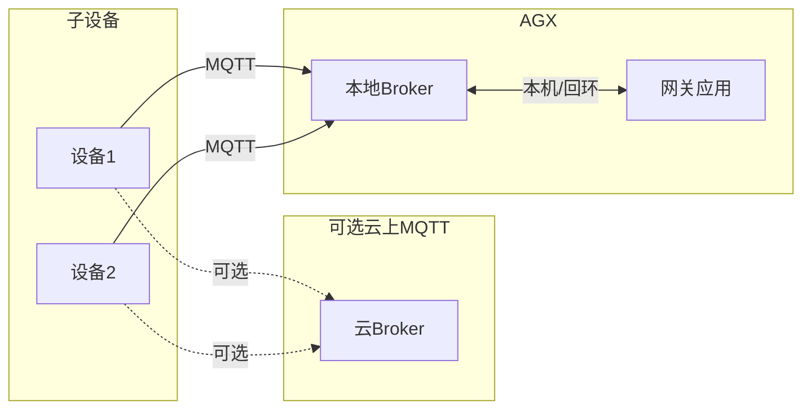
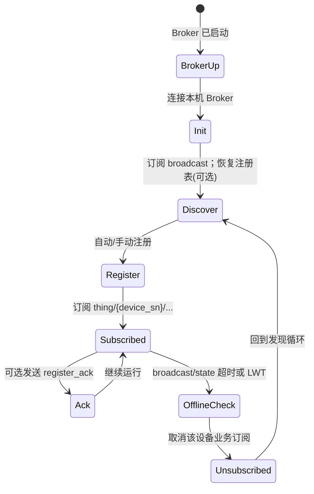
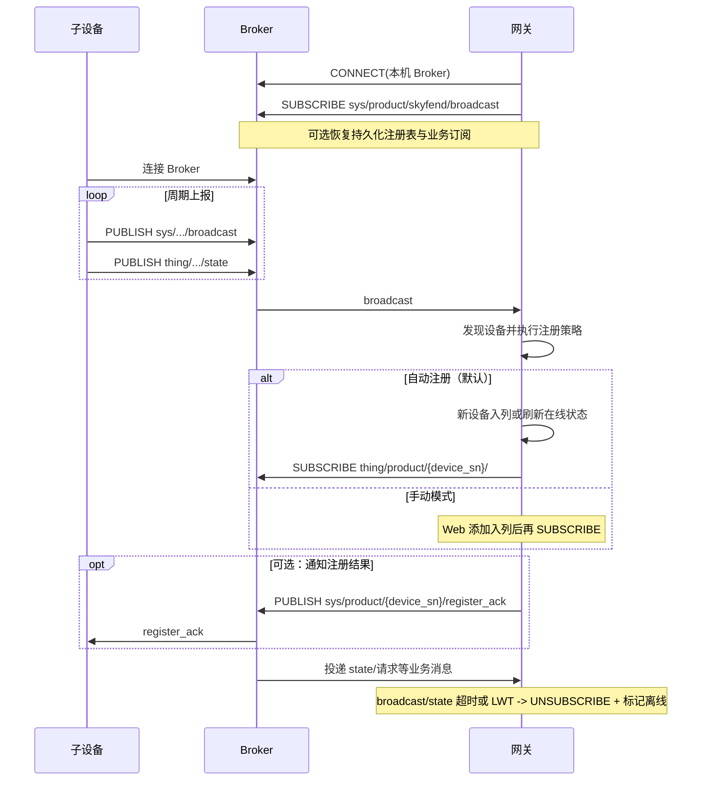

# 基于 MQTT + PB 的设备组网设计文档


| 项目  | 内容         |
| --- | ---------- |
| 版本  | v2.8       |
| 日期  | 2026-04-10 |
| 状态  | 设计稿        |


---

## 1. 概述

**场景**：以 **AGX 为网关**，在 AGX 上部署 **MQTT Broker**，多个子设备作为 **MQTT 客户端** 接入局域网，实现 **设备发现、自动注册、网关按类型/设备订阅业务主题**。子设备可同时或分阶段配置 **云上 MQTT**（OTA、运维等），与 AGX 侧为独立连接；本设计边界为 **AGX Broker 上的主题与流程**，消息编码统一采用 **Protobuf（PB）二进制**。

**设计目标**


| 目标   | 说明                                                                   |
| ---- | -------------------------------------------------------------------- |
| 统一入口 | 子设备优先连 AGX Broker，由网关应用完成发现、登记与订阅。                                   |
| 可发现  | 子设备经 `**sys/` 公共广播**（多类设备共用主题）上报信息，无需网关按型号预配。                        |
| 可扩展  | **系统公共**与**设备特性消息**分层；`thing/product/{device_sn}/` 下可扩展子主题，网关可用通配订阅。 |
| 云协同  | 云参数与 AGX 参数并存；可选 Broker **bridge** 到云。                               |


**角色**

- **Broker（AGX）**：如 Mosquitto/EMQX，监听局域网；**默认端口等见 §5**。  
- **网关应用**：作为 MQTT **客户端**须配置 **Broker 地址**、端口及认证等（见 **§5.2**）；连本机 Broker；订阅 `**sys/` 广播** 做发现；支持**自动/手动**注册子设备；按已注册设备的 `device_type`、`device_sn` **订阅**其 `**thing/`** 下业务主题（**MQTT 订阅**，非与子设备另建传输层连接）；依心跳/状态判离线并取消订阅；可选黑名单。  
- **子设备**：作为 MQTT **客户端**须配置 **Broker 地址**（AGX 的 IP）、端口及认证等（见 **§5.2**）；连 AGX Broker；上线向广播主题发设备信息，状态等走 **设备消息** 主题。

---

## 2. 组网系统架构

**逻辑拓扑**




---

## 3. 主题和消息定义

### 3.1 主题命名空间

主题分为两类：`**sys/` 系统公共消息** 与 `**thing/` 设备特性消息**。

- `**sys/`（系统公共消息）**：面向**多类设备共用**的**系统级、公共能力**，与具体型号、私域业务无关。例如：全网上线广播、注册登记确认、遗嘱/下线、OTA/对时等**公共功能**，均可放在 `sys/` 下统一约定，各类设备复用同一套主题与报文头，网关侧一次订阅即可覆盖多厂商/多类型终端。
- `**thing/`（设备特性消息）**：按**设备实例** `device_sn` 隔离，承载**单设备私域**状态、请求与应答等业务数据。

#### 3.1.1 系统公共消息（`sys/`）

**定位**：多类设备通用；**不**在主题中区分具体业务型号（除按 `device_sn` 做下行单播等必要路径外）。典型用途：发现与上线广播、登记结果回执、可选遗嘱/下线，以及后续扩展的**公共系统功能**。


| 主题                                     | 发送者 -> 订阅者 | 消息体                      | 说明                              |
| -------------------------------------- | ---------- | ------------------------ | ------------------------------- |
| `sys/product/skyfend/broadcast`        | 子设备 -> 网关  | **broadcast message**    | 公共广播：所有设备共用该主题，上报上线与能力，便于网关发现   |
| `sys/product/{device_sn}/register_ack` | 网关 -> 子设备  | **register_ack message** | 公共登记能力：网关对单设备下发注册登记结果（可选），单设备订阅 |


后续若扩展 **OTA、时间同步、远程参数** 等**跨设备类型的公共能力**，建议仍挂在 `sys/product/...` 或统一 `sys/...` 命名空间下，与 `thing/product/{device_sn}/` 下的**单设备业务**区分。

#### 3.1.2 **设备特性消息**（`thing/product/{device_sn}/…`）（可选示例）

按子设备维度隔离，`**device_sn`** 与铭牌/配置一致；与 `**sys/` 公共消息** 互补——私域业务、单设备数据走本分支。


| 主题                                         | 发送者 -> 订阅者 | 消息体                        | 说明       |
| ------------------------------------------ | ---------- | -------------------------- | -------- |
| `thing/product/{device_sn}/state`          | 子设备 -> 网关  | **state message**          | 设备状态数据上报 |
| `thing/product/{device_sn}/requests`       | 子设备 -> 网关  | **requests message**       | 设备发起请求   |
| `thing/product/{device_sn}/requests_reply` | 网关 -> 子设备  | **requests_reply message** | 对请求的应答   |


若后续增加遥测等，仍在 `thing/product/{device_sn}/` 下扩展。

### 3.2 消息体（PB）定义

各类型均遵循：**先字段说明表，再示例 Protobuf**；外层结构统一为 **§3.2.0 通用报文头**，`**sys/`** 与 `**thing/**` 共用。

#### 3.2.0 通用报文头（所有主题 Payload 外层一致）

MQTT 消息体为 **Protobuf（PB）二进制消息**，直接使用具体消息结构（如 `Broadcast` 或 `RegisterAck`），每个结构都包含公共头部 `Header`。**本项目为 C/C++，无需 Java 生成选项。**

**字段说明**


| 字段          | 类型     | 说明                                                     |
| ----------- | ------ | ------------------------------------------------------ |
| `tid`       | string | Transaction ID，事务 ID（UUID），单次请求/发布内唯一，便于链路追踪           |
| `bid`       | string | Business ID，业务 ID（UUID）；可与订单/会话等关联；无则可用全 0 或与 `tid` 同值 |
| `frame_id`  | uint64 | 帧序号（发送端本地递增计数）；用于去重、排序和链路排障                            |
| `timestamp` | uint64 | 毫秒时间戳（Unix epoch ms）                                   |


> MQTT Payload 采用 Protobuf 二进制编码，主题不变。上报时将具体消息结构（如 `Broadcast` 或 `RegisterAck`）序列化后作为 MQTT 消息体发送，每个消息携带公共头部 `header`。

**Protobuf 定义示例**

```proto
syntax = "proto3";
package common;

message Header {
  string tid = 1;
  string bid = 2;
  uint64 frame_id = 3;
  uint64 timestamp = 4;
}

message Broadcast {
  Header header = 1;
  string device_sn = 2;
  uint32 device_type = 3;
  string model = 4;
  string vendor = 5;
  string fw_version = 6;
  string ip = 7;
}

message RegisterAck {
  Header header = 1;
  bool status = 2;
  string message = 3;
}
```

> 说明：Protobuf 消息直接序列化后作为 MQTT Payload，每个具体消息都包含公共头部 `header`。

#### 3.2.1 **broadcast message**（`sys/product/skyfend/broadcast`）

`**sys/` 公共广播**：任意类型子设备均发布至此主题（如每 3 秒周期发布），网关统一订阅即可发现多类设备。

`**payload` 内字段说明**


| 字段            | 类型     | 说明                       |
| ------------- | ------ | ------------------------ |
| `device_sn`   | string | 设备序列号                    |
| `device_type` | uint32 | 设备类型（产品约定枚举）             |
| `model`       | string | 设备型号                     |
| `vendor`      | string | 可选；厂商                    |
| `fw_version`  | string | 固件版本（Firmware，`x.y.z` 等） |
| `ip`          | string | 设备当前 IP                  |


> 示例：使用 Protobuf 文本格式表示，下行 MQTT Payload 为 `Broadcast` 的 Protobuf 二进制编码。

```protobuf
Broadcast {
  header {
    tid: "xxxxxxxx-xxxx-xxxx-xxxx-xxxxxxxxxx"
    bid: "xxxxxxxx-xxxx-xxxx-xxxx-xxxxxxxxxx"
    frame_id: 1001
    timestamp: 1234567890123
  }
  device_sn: "SN001"
  device_type: 119
  vendor: "skyfend"
  model: "HEP10"
  fw_version: "v1.2.3"
  ip: "192.168.1.100"
}
```

#### 3.2.2 **register_ack message（可选）**（`sys/product/{device_sn}/register_ack`）

`**sys/` 公共注册登记回执**：网关对指定设备下发注册登记结果，与 **broadcast** 同属系统公共能力，**不**写入 `thing/product/…` 业务主题。

`**payload` 内字段说明**


| 字段        | 类型     | 说明      |
| --------- | ------ | ------- |
| `status`  | bool   | 注册登记结果  |
| `message` | string | 可选；说明文案 |


> 示例：使用 Protobuf 文本格式表示，下行 MQTT Payload 为 `RegisterAck` 的 Protobuf 二进制编码。

```protobuf
RegisterAck {
  header {
    tid: "xxxxxxxx-xxxx-xxxx-xxxx-xxxxxxxxxx"
    bid: "xxxxxxxx-xxxx-xxxx-xxxx-xxxxxxxxxx"
    frame_id: 22017
    timestamp: 1234567890123
  }
  status: true
  message: "success"
}
```

---

## 4. 启动流程、交互时序

### 4.1 启动流程

#### 网关侧（AGX）




| 步骤  | 说明                                                                                                 |
| --- | -------------------------------------------------------------------------------------------------- |
| 1   | **启动 MQTT Broker**：在 AGX 启动本机 Broker（如 `0.0.0.0:1883` 或 TLS 端口）。                                   |
| 2   | **连接并初始化订阅**：网关作为 MQTT 客户端连接本机 Broker，订阅 `sys/product/skyfend/broadcast`；若有持久化注册表可同步恢复。            |
| 3   | **发现在线子设备**：接收周期 `broadcast` 消息，维护实时在线子设备列表。                                                       |
| 4   | **注册子设备**：若设备未注册，则按策略加入注册列表；若设备已存在，则仅更新设备状态。自动注册策略（默认）直接入列；手动注册策略模式，由 Web/运维确认后入列。                 |
| 5   | **订阅业务主题**：对已注册设备订阅 `thing/product/{device_sn}/...`，开始接收状态、请求等设备业务消息。                              |
| 6   | **通知注册结果（可选）**：若启用注册反馈，网关发布 `sys/product/{device_sn}/register_ack` 通知子设备注册结果。                      |
| 7   | **离线或手动删除处理**：已注册设备，若自动离线或用户手动删除，则取消订阅该设备业务主题，并更新在线状态。依据周期 `broadcast`（默认）、`state` 心跳超时或 LWT 判定离线； |
| 8   | **设备黑名单（可选）**：对已注册设备可加入黑名单，加入后不再订阅该设备主题消息。                                                         |


#### 子设备侧


| 步骤  | 说明                                                                                                            |
| --- | ------------------------------------------------------------------------------------------------------------- |
| 1   | **配置 MQTT 客户端**：设置 `server_addr`、`server_port` 及认证参数（见 **§5.2**、**§5.3**）。                                    |
| 2   | **上线广播**：连接 Broker 成功后，周期发布 `sys/product/skyfend/broadcast`（如每 3 秒）用于被网关发现。                                   |
| 3   | **状态与回执处理**：持续上报 `thing/product/{device_sn}/state`（状态/心跳）；可选接收注册结果时订阅 `sys/product/{device_sn}/register_ack`。 |


### 4.2 交互时序




---

## 5. MQTT 服务默认配置

本章给出 **AGX 本机 Broker**（如 Mosquitto、EMQX 等）及 **MQTT 客户端**的**建议默认值**，现场可按安全与运维要求调整；与**云上 MQTT** 无关。

**网关应用**与**子设备**均为 MQTT **客户端**，连接前**必须配置 Broker 地址**（`server_addr`）及端口；二者连**同一台 Broker** 时，**端口、TLS、用户名密码、协议版本等应一致**，仅 `**server_addr`** 的取值因运行位置不同（见 **§5.3**）。

### 5.1 MQTT Broker（服务端）


| 配置项        | 建议默认值         | 说明                                                                          |
| ---------- | ------------- | --------------------------------------------------------------------------- |
| 监听地址       | `0.0.0.0`     | 局域网内子设备可访问；仅本机可用 `127.0.0.1`                                                |
| 明文端口       | `1883`        | 标准 MQTT                                                                     |
| TLS 端口（可选） | `8883`        | 生产环境建议启用 TLS，证书与密钥由部署配置                                                     |
| 协议版本       | MQTT 3.1.1    | 客户端需与 Broker 一致                                                             |
| 匿名登录       | **关闭（建议）**    | 关闭后，**所有客户端**（网关与子设备）均须在连接时提供 **用户名/密码**（或 **TLS 客户端证书**），并在 Broker 侧配置 ACL |
| 最大连接数      | 由产品定义         | 需大于「子设备数 + 网关应用连接数」余量                                                       |
| 消息持久化 / 会话 | 按 Broker 能力配置 | 遗嘱、QoS1 等依赖持久化时需开启对应选项                                                      |


### 5.2 MQTT 客户端（网关与子设备：地址、端口与认证）

**任何 MQTT 客户端在 `CONNECT` 前都必须配置**：**Broker 地址** `server_addr`、**端口** `server_port`（及按需 TLS、账号等）；**未配置地址则无法连接**。


| 配置项             | 建议默认值                  | 说明                                                                                           |
| --------------- | ---------------------- | -------------------------------------------------------------------------------------------- |
| `server_addr`   | **必填**                 | **Broker 主机地址**（IP 或域名）。**网关**：`127.0.0.1` 或 `localhost`；**子设备**：AGX **局域网 IP**（见 **§5.3**）。 |
| `server_port`   | `1883`（明文）或与 Broker 一致 | 与 §5.1 一致；若启用 TLS 一般为 `8883`                                                                 |
| `username`      | **按 Broker 账号配置填写**    | **生产环境建议必填**；与 `password` 成对                                                                 |
| `password`      | **按 Broker 账号配置填写**    | **生产环境建议必填**；勿硬编码进版本库，由安全配置或出厂下发                                                             |
| TLS / CA        | 若启用 `8883`             | 客户端校验服务端证书；双向认证时另配客户端证书                                                                      |
| `keepalive`     | `60`（秒，示例）             | 与 Broker `max_keepalive` 等限制匹配                                                               |
| `clean_session` | 按产品                    | 持久会话为 `false` 时需 Broker 支持                                                                   |
| `client_id`     | 全局唯一                   | 网关如 `gateway-agx`；子设备建议含 `device_sn` 或产品规则                                                   |


> **开发/调试**：若 Broker **临时允许匿名连接**，`username` / `password` 可留空，但须与 §5.1「匿名登录」策略一致；**转产或现场部署前**应改为账号认证并关闭匿名。

### 5.3 `server_addr` 填写说明

网关与子设备**都要配置地址**；区别仅在于 Broker 相对客户端的位置。


| 客户端      | 建议 `server_addr`                | 说明                                                 |
| -------- | ------------------------------- | -------------------------------------------------- |
| **网关应用** | `127.0.0.1` 或 `localhost`       | Broker 部署在 AGX 本机，走回环即可                            |
| **子设备**  | AGX **局域网 IP**（如 `192.168.1.x`） | 经局域网访问 AGX 上的 Broker；**不能**填 `127.0.0.1`（会指向子设备自身） |


---

## 附录：缩略语


| 缩写     | 含义                          |
| ------ | --------------------------- |
| AGX    | 网关硬件平台（如 Jetson AGX）        |
| Broker | MQTT 服务端                    |
| LWT    | Last Will and Testament（遗嘱） |
| QoS    | 服务质量等级                      |
| tid    | Transaction ID，事务标识（UUID）   |
| bid    | Business ID，业务标识（UUID）      |


---

**文档结束**