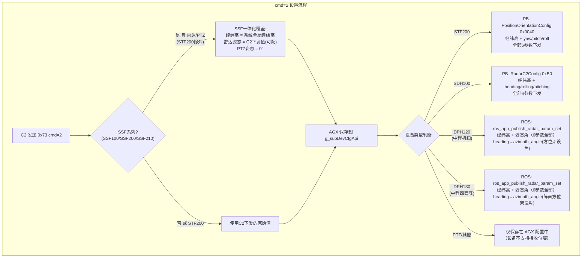

# 实现 0x73 子设备位姿查询/设置协议

## 一、协议结构设计

### 请求 (C2 -> AGX, 100 字节)

- cmd (uint8_t, 1字节): 命令选项，1=查询所有子设备位姿，2=设置指定子设备位姿
- sn (char[32], 32字节): 子设备SN
- type (uint8_t, 1字节): 子设备类型，参照附录A
- longitude (double, 8字节): 经度
- latitude (double, 8字节): 纬度
- altitude (float, 4字节): 绝对海拔高度
- heading (float, 4字节): 方位角（与地理正北的方位角）
- rolling (float, 4字节): 横滚角
- pitching (float, 4字节): 俯仰角
- reserve (uint8_t[34], 34字节): 预留

### 响应 (AGX -> C2)

固定头部（6字节）:

- result (int32_t, 4字节): 0=成功，其他=失败
- cmd (uint8_t, 1字节): 回传原始命令选项
- num (uint8_t, 1字节): 返回的设备个数

设备数组（99字节 * num）:

- sn (uint8_t[32], 32字节): 设备SN
- type (uint8_t, 1字节): 设备类型
- longitude (double, 8字节): 经度
- latitude (double, 8字节): 纬度
- altitude (float, 4字节): 绝对海拔高度
- heading (float, 4字节): 方位角
- rolling (float, 4字节): 横滚角
- pitching (float, 4字节): 俯仰角
- reserve (uint8_t[34], 34字节): 预留

各 cmd 响应行为:

- cmd=1 查询: result=0, num=子设备总数, list填充所有子设备位姿, 总长度 = 6 + 99*num
- cmd=2 设置: result=0(成功)/负数(失败), num=0, 不带设备数据, 总长度 = 6

## 二、雷达型号命名说明

- **DPH100** 是中程雷达的**对外统一型号**，内部分为两个子型号：
  - **DPH120** — 中程机扫雷达（内部型号），枚举 `DEV_TYPE_RADAR_DPH120 = 12`
  - **DPH130** — 中程四面阵雷达（内部型号），枚举 `DEV_TYPE_RADAR_DPH130 = 13`
- **SDH100** — 小雷达（近程雷达），枚举 `DEV_TYPE_RADAR_SDH100 = 1`，与 DPH 系列是完全不同的产品
- 代码中 `DEV_TYPE_RADAR_DPH100 = 8` 为历史遗留枚举，实际不再使用

## 三、SSF一体化设备规则（王志强提出）

### 王志强原始要求

> "这个设计给分体预留的，目前ptz的经纬度和俯偏滚以及雷达的经纬度没参与计算，只是显示。按一体化处理
> 保留系统和子设备的定位和定姿信息
> 雷达及ptz经纬度置灰（不可修改），填充与系统的经纬度一样的数值
> ptz俯偏滚置灰（不可修改），默认0°"

### 背景

0x73协议最初设计是**给分体式设备预留**的，允许C2独立配置每个子设备的经纬高和姿态角。目前SSF系列为一体式设备（子设备与主设备固定在同一机体上），子设备的物理位置与主设备相同。SRP系列暂不做一体化处理。

### 一体式主设备列表

仅以下SSF系列主设备按一体化规则处理：

| 系列 | 主设备 | ALINK ID |
| --- | --- | --- |
| Spotter | SSF100 | 0x1b |
| Spotter Pro | SSF200 | 0x23 |
| Spotter Pro | SSF210 | 0x24 |

> **注**: SRP系列（SRP100/SRP200/SRP210）暂不做一体化处理。SFL/Sentry/BPH等也不在一体化范围内。

### 一体化规则

1. **雷达/PTZ子设备经纬高 = 系统全局经纬高**（即0x71/0x72设置值），C2侧置灰不可修改
2. **雷达子设备俯偏滚：用户可正常配置**，C2侧SSF系列不置灰，AGX不做限制
3. **PTZ子设备俯仰/横滚/方位角 = 0°**，C2侧置灰不可控制
4. **STF200(电侦TracerMatrix)除外** — STF200可能为分体式独立AGX设备，作为子设备接入电子围栏，因此保留独立位姿设置能力

### 受影响的子设备类型

| 子设备类型 | 经纬高处理 | 姿态角(heading/rolling/pitching)处理 |
| --- | --- | --- |
| 雷达 (SDH100/DPH120/DPH130) | 填充系统全局经纬高，C2置灰 | **用户可配置**，AGX不做限制 |
| PTZ (耐杰/和普全系列) | 填充系统全局经纬高，C2置灰 | 强制为0°，C2置灰 |
| STF200 (电侦) | **不受一体化规则约束** | **不受一体化规则约束** |
| 其他设备 | 仅存AGX本地 | 仅存AGX本地 |

### 代码实现

在 `alink_system.cpp` 中通过内联判断 SSF 设备类型（与 `alink_target.c` 保持一致风格）：

```c
int32_t agx_type = get_agx_device_type();
bool isSSF = (ALINK_DEV_ID_SSF100 == agx_type || ALINK_DEV_ID_SSF200 == agx_type ||
              ALINK_DEV_ID_SSF210 == agx_type);
```

辅助函数 `isRadarSubDev(devType)` 和 `isPtzSubDev(devType)` 用于判断子设备类型。

**cmd=1 查询**: 若主设备为SSF且子设备为雷达/PTZ（非STF200），用 `g_hostDevCfgApi.getRadarV()` 获取系统全局经纬高覆盖返回值。PTZ子设备额外将heading/rolling/pitching返回0。雷达姿态角返回设备自身存储的值（不覆盖）。

**cmd=2 设置**: 若主设备为SSF且目标子设备为雷达/PTZ（非STF200），经纬高强制使用系统全局值。PTZ姿态角强制0°。雷达姿态角使用C2下发的值（用户可配置）。

## 四、各子设备位姿写入能力分析



| 子设备                          | 枚举值       | 能否写入设备 | 写入机制                                      | 写入内容                             | 备注                               |
| ------------------------------- | ------------ | ------------ | --------------------------------------------- | ------------------------------------ | ---------------------------------- |
| STF200 (TracerMatrix/电侦)      | 24           | 能(全部)     | PB `PositionOrientationConfig` (0x0040)     | 经纬高 + 姿态角（6参数全部）         | 需新增发送函数                     |
| SDH100 (小雷达/近程)            | 1            | 能(全部)     | `alink_upload_cmd_set_radar_att_v2_to_dest` | 经纬高 + 姿态角（6参数全部）         | 已有函数                           |
| DPH120 (中程机扫，对外DPH100)   | 12           | 能(全部)     | `ros_app_publish_radar_param_set`           | 经纬高 + 姿态角（6参数全部）         | heading→azimuth_angle(方位架设角)  |
| DPH130 (中程四面阵，对外DPH100) | 13           | 能(全部)     | `ros_app_publish_radar_param_set`           | 经纬高 + 姿态角（6参数全部）         | heading→azimuth_angle(阵面方位架设角) |
| PTZ 耐杰/和普                   | 2,9,23,30,33 | 不能         | 无位姿设置 API                                | 无                                   | 仅存 AGX                           |

## 五、核心实现文件

### 5.1 结构体定义 — `[src/srv/alink/command/system/alink_system.h](src/srv/alink/command/system/alink_system.h)`

新增请求/响应结构体：

 alink_subdev_pose_req_t;

 alink_subdev_pose_item_t;  // 99 bytes

alink_subdev_pose_resp_t;

### 5.2 命令注册 — `[src/srv/alink/command/system/alink_system.cpp](src/srv/alink/command/system/alink_system.cpp)`

在 `alink_system_init()` 中（在 0x74 注册之后）:

- 新增 `static alink_cmd_list_t sAlinkCmd_subdevPose;`
- `sAlinkCmd_subdevPose.cmd_type = ALINK_DEV_ID_C2;`
- `alink_register_cmd(&sAlinkCmd_subdevPose, 0x73, 0, alink_subdev_pose);`

### 5.3 回调实现 — 同文件新增 `alink_subdev_pose()`

#### cmd=1 查询所有子设备位姿

```
1. g_subDevCfgApi.readList(subDevList) 获取所有子设备
2. 判断当前主设备是否为 SSF 系列，若是则读取系统全局经纬高 (g_hostDevCfgApi.getRadarV)
3. 遍历在线子设备，填充 resp->list[i] 的 sn/type/longitude/latitude/altitude/heading/rolling/pitching
4. SSF一体化覆盖（STF200除外）：
   - 雷达/PTZ子设备：经纬高覆盖为系统全局值
   - PTZ子设备：heading/rolling/pitching 额外覆盖为 0
   - 雷达子设备：heading/rolling/pitching 保持设备存储值不覆盖
5. resp->num = 实际设备数
6. resp->result = 0
7. psResp->wCount = sizeof(result) + sizeof(cmd) + sizeof(num) + num * sizeof(alink_subdev_pose_item_t)
```

字段映射（`DevAttrParam` -> `alink_subdev_pose_item_t`）:

- `longitude` -> `longitude`
- `latitude` -> `latitude`
- `altitude` -> `altitude`
- `global_heading` -> `heading`
- `global_roll` -> `rolling`
- `global_pitch` -> `pitching`

#### cmd=2 设置指定子设备位姿

```
1. 从 req 解析 SN、type 和位姿参数
2. g_subDevCfgApi.getBySn(sn, dev) 获取当前配置
3. SSF一体化覆盖（STF200除外）：
   - 雷达/PTZ子设备：经纬高强制使用系统全局值 (g_hostDevCfgApi.getRadarV)
   - PTZ子设备：heading/rolling/pitching 强制为 0
   - 雷达子设备：heading/rolling/pitching 使用 C2 下发值（用户可配）
4. 用覆盖后的值更新 dev 的位姿字段
5. g_subDevCfgApi.updateBySn(dev) 持久化到配置
6. 根据 type 判断是否需要写入设备:
   - STF200: 调用 sendPoseToSTF200()
   - SDH100: 调用 sendPoseToSDH100()
   - DPH120/DPH130: 读取当前雷达配置，更新 LLA + azimuth_angle + roll_angle + pitch_angle（6参数全部，heading→azimuth_angle），调用 ros_app_publish_radar_param_set()
7. resp->result = 0(成功）或负数（失败），resp->cmd = 2，resp->num = 0
8. psResp->wCount = sizeof(result) + sizeof(cmd) + sizeof(num) = 6 字节
```

### 5.4 各设备写入实现细节

#### STF200 — 新增 PB 包注册（复用已有发送通道）

**为什么不能纯透传**: 0x73 是二进制结构体格式，STF200 期望 Protobuf 编码的 `PositionOrientationConfig`，两者格式不同，AGX 必须做格式转换后发送。

**底层通道已存在**: `alink.c` 中 `ALINK_DEV_ID_STF200` 已有完整的 `sUpload_stf200` 发送通道（注册/发送/定向发送），只需新增一个 PB 包注册即可使用。

**实现方式**: 参考 SDH100 发送 `RadarC2Config` PB 的模式（`sAlinkPackage_cmd_set_radar_att_v2`，`cmd_type = ALINK_DEV_ID_RADAR_V2`，通过 `sUpload_server_v2` 通道），STF200 用 `ALINK_DEV_ID_STF200` 走 `sUpload_stf200` 通道：

1. 在 `alink_system.cpp` 中新增 `static alink_package_list_t sAlinkPackage_stf200_pose;`
2. 设置 `sAlinkPackage_stf200_pose.cmd_type = ALINK_DEV_ID_STF200;` → 走 `sUpload_stf200` 通道
3. `alink_register_package(&sAlinkPackage_stf200_pose, 0x40, 0, system_pkg_stf200_pose);`
4. 编码回调 `system_pkg_stf200_pose`（约 15 行）: 使用 nanopb 编码 `PositionOrientationConfig`
5. 通过 `alink_upload_package_to_dest(&sAlinkPackage_stf200_pose, &pbMsg, devInfo.dev_id)` 发送到指定 STF200

字段映射（0x73 → PositionOrientationConfig PB）:

- `update_mode = 2` (更新)
- `longitude/latitude/altitude` → 直接映射
- `heading` → `yaw`
- `rolling` → `roll`
- `pitching` → `pitch`
- `setting_mode = 3` (网络-上位机获取)

#### SDH100 — 复用现有函数

复用已有 `alink_upload_cmd_set_radar_att_v2_to_dest()` 函数，构造 `RadarC2Config` PB 消息：

- 填入 `has_longitude/has_latitude/has_altitude = true` + 经纬高值
- 填入 `has_heading/has_pitching/has_rolling = true` + 姿态角值
- 通过 `find_device_info_by_sn` 获取 socket ID 后发送

`RadarC2Config` 完整支持全部 6 个字段。校准流程 `send_calibration_data_2_radar()`（`alink_track.cpp` L771-806）已验证可向 SDH100 下发经纬高 + heading/pitching/rolling。0x74 仅发经纬高是其简化实现，0x73 应发送全部位姿参数。

#### DPH120/DPH130 — 区别处理

**字段语义逐项分析:**

0x73 的 heading/rolling/pitching 与 DPH 雷达参数的映射关系：

- 0x73 `rolling` → DPH `roll_angle`（阵面安装横滚角），描述雷达物理安装的左右倾斜
- 0x73 `pitching` → DPH `pitch_angle`（阵面安装俯仰角），描述雷达物理安装的前后倾斜
- 0x73 `heading` → DPH `azimuth_angle`（阵面方位架设角 / PTZ法线与雷达法线夹角），DPH120 和 DPH130 均适用
- DPH `north_angle`（校北角）= 雷达自身校准参数，0x73 **不修改此字段**

**DPH120（机扫，1个雷达）与 DPH130（四面阵，4个雷达）:**

- DPH120 只有1个雷达面板，DPH130 有4个面板（每个面板有独立 SN）
- 0x73 按 SN 区分，DPH130 每个前端可独立设置
- **两者在 0x73 中行为一致**：均写入全部 6 参数

**heading → azimuth_angle 映射说明:**

- C2 在 0x73 的 heading 字段中填入的实际上就是阵面方位架设角（DPH120 即 PTZ法线与雷达法线夹角），映射到 `azimuth_angle`
- DPH120: `azimuth_angle` 不写入雷达命令帧（`dhp120MsgCmd_t` 无此字段），保存在 AGX 本地 JSON 配置中，用于 0xA7 查询时的坐标转换（`绝对方位角 = azimuth_angle + mark_parm.heading`）
- DPH130: `azimuth_angle` 写入雷达命令帧（`pRadar->azimuth_angle = pCfg->azimuth_angle * 10`），即阵面方位架设角（精度0.1°，0~360°）
- `north_angle`（校北角）是雷达自身校准参数，0x73 不修改

**各型号写入策略（已确认）:**

| 参数                        | DPH120（1个雷达）                             | DPH130（4个雷达）                          |
| --------------------------- | --------------------------------------------- | ------------------------------------------ |
| longitude/latitude/altitude | **写入**                                      | **写入**                                   |
| heading                     | **写入**（→azimuth_angle 方位架设角）         | **写入**（→azimuth_angle 阵面方位架设角）  |
| rolling                     | **写入**（→roll_angle 阵面横滚角）            | **写入**（→roll_angle 阵面横滚角）         |
| pitching                    | **写入**（→pitch_angle 阵面俯仰角）          | **写入**（→pitch_angle 阵面俯仰角）       |

**实现方式:**

1. 6参数保存到 `g_subDevCfgApi.updateBySn()`（SSF设备上经纬高为系统全局值、PTZ姿态为0°的覆盖后的值）
2. 从 `readRadarConfigFromJsonBySN()` 读取当前完整雷达配置（保留所有现有参数不变）
3. 根据设备类型更新对应字段:

- **DPH120/DPH130**: 更新 `lot/lat/height` + `azimuth_angle/roll_angle/pitch_angle`（6个参数全部，heading→azimuth_angle），保留 `north_angle` 不变

4. 调用 `ros_app_publish_radar_param_set()` 发布到 ROS
5. **同步写入 `config_calibrate.yaml`**（与 0xA6 `alink_radar_param_set_req` 保持一致）:
   - 写入 `local_roll = rolling`, `local_pitch = pitching`, `local_yaw = heading`
   - 调用 `midrange_ensure_default_calibration_records()` 确保标定记录存在
   - 标定系统依赖此文件中的 `local_roll/local_pitch/local_yaw` 进行标定计算（参见 `alink_track.cpp`）

**查询数据源说明:**

所有设备类型的 cmd=1 查询，基础数据从 AGX 本地的 `g_subDevCfgApi`（`DevAttrParam`）读取，不实时查询设备。

**但在 SSF 系列上**，cmd=1 返回的值会被一体化规则覆盖：雷达/PTZ 子设备的经纬高覆盖为系统全局值，PTZ 子设备的姿态角覆盖为 0°，雷达子设备的姿态角保持设备存储值。因此 SSF 设备上查询返回的值可能与 `g_subDevCfgApi` 中存储的值不同。

但 `g_subDevCfgApi` 并非纯静态配置，部分设备的状态上报会**动态刷新**其中的数据，因此查询返回的是**最新值**（而非固定返回 0x73 设置时的值）。

各设备对 `g_subDevCfgApi` 的回写情况:

| 设备                  | LLA 是否被设备上报刷新                 | 姿态角是否被设备上报刷新    | 回写代码位置                                    |
| --------------------- | -------------------------------------- | --------------------------- | ----------------------------------------------- |
| SDH100 (小雷达)       | 是（`RadarState` PB 状态上报时覆盖） | 否                          | `alink_track.cpp` `track_pkg_attitude_v2()` |
| STF200 (电侦)         | 否（AGX 对 STF200 做透传，不解析状态） | 否                          | 无                                              |
| BPH110 (激光)         | 是（参数上报时覆盖）                   | 是（yaw/pitch/roll 均覆盖） | `ros_app.cpp` `cb_sub_dataLaserParamResp()` |
| DPH120/130 (中程雷达) | 否                                     | 否                          | 无                                              |
| PTZ                   | 否                                     | 否                          | 无                                              |

影响: 0x73 cmd=2 设置 SDH100 的 LLA 后，如果设备 GPS 随后上报了不同的 LLA，`g_subDevCfgApi` 会被覆盖，cmd=1 查询返回的将是设备上报的最新值，而非之前 0x73 设置的值。这是**预期行为**（已确认）。

**生效时机:**

DPH120: 经纬高和 rollAngle/pitchAngle 通过 `InitCmdFrame()` 从本地配置读取，在下次发送命令帧时生效（切换模式/伺服操作等），不是下次开机。`SyncParamToDevice()` 只同步高度门限/速度/距离等参数，不含经纬高和姿态角。

DPH130: `HandleConfig` 中若雷达非待机模式，立即调用 `SendRadarsUpdateParamToDevice()` 下发。DPH130 的经纬高统一使用 `pCfg_0`（第一个面板的配置），4个面板共用同一位置。待机模式下仅保存本地。

#### PTZ / 其他不支持写入的设备 — 仅存 AGX

- 调用 `g_subDevCfgApi.updateBySn(dev)` 保存
- 不下发到设备

### 5.5 头文件声明

在 `[src/srv/alink/command/system/alink_system.h](src/srv/alink/command/system/alink_system.h)` 中声明必要的外部函数（如果 STF200 发送需要从外部调用）。

## 六、0xA6 与 0x73 协议的关系（中程雷达参数设置通道）

### 历史背景

在 0x73 协议之前，中程雷达（DPH120/DPH130）的参数设置通过以下协议完成：

| 协议 | 用途 | C2 页面 | 包含字段 |
| --- | --- | --- | --- |
| **0xA6** (`alink_radar_param_set_req`) | 雷达全量参数配置 | 雷达配置页面 | 经纬高 + 姿态角 + 频点/静默区/量程/门限等**所有参数** |
| **0xA7** (`alink_radar_param_req`) | 雷达参数查询 | 雷达配置页面 | 返回完整 `msgRadarParam_t` |
| **0x71/0x72** | 系统全局位置设置 | 系统设置页面 | 系统经纬高 + heading/rolling/pitching |
| **0x74** (`alink_sync_dev_position`) | 位置同步 | — | 仅经纬高，且**不支持** DPH120/DPH130 |

### SRP 系列各型号 C2 雷达配置页面行为（0xA6，0x73 之前）

> **注**: 0x73 之前，只有**雷达**子设备支持经纬高/俯偏滚配置（通过 0xA6）。PTZ 和 STF200 以前没有位姿配置入口。

| SRP 型号 | C2 雷达配置页面 — 经纬高 | C2 雷达配置页面 — 俯偏滚 |
| --- | --- | --- |
| **SRP100** | **开放**，用户可配置 | **开放**，用户可配置 |
| **SRP200** | **不开放**，C2 不展示（0xA6 全量透传时 LLA 随配置原值写入） | **开放**，用户可配置 |
| **SRP210** | **开放**，用户可配置 | **开放**，用户可配置 |

0xA6 使用的 `msgRadarParam_t` 包含全部字段（含经纬高），即使 C2 不展示某些字段，通过 0xA7 查询获取当前值后原样回传，AGX 侧全量透传，因此所有参数实际上都会通过 0xA6 写入雷达。

### SSF 系列与 SRP 系列对齐（仅雷达子设备）

SSF 系列在**雷达配置页面（0xA6）** 上保持与对应 SRP 型号一致的行为。0x73 新增了位姿页面，SSF 一体化规则仅在 0x73 层面生效（经纬高显示系统全局值且置灰）。

| SSF 型号 | 对应 SRP | 0xA6 经纬高 | 0xA6 俯偏滚 | 0x73 经纬高 | 0x73 俯偏滚 |
| --- | --- | --- | --- | --- | --- |
| **SSF100** | SRP100 | **开放**（与 SRP100 一致） | **开放** | 置灰，使用系统全局值 | 不置灰，可配 |
| **SSF200** | SRP200 | **不开放**（与 SRP200 一致） | **开放** | 置灰，使用系统全局值 | 不置灰，可配 |
| **SSF210** | SRP210 | **开放**（与 SRP210 一致） | **开放** | 置灰，使用系统全局值 | 不置灰，可配 |

**AGX 侧能力**: 0xA6 和 0x73 最终都走 `ros_app_publish_radar_param_set`，AGX 保留全部写入能力，不做字段过滤。C2 置灰是 C2 侧的 UI 控制。两个通道均会同步写入 `config_calibrate.yaml`（`local_roll/local_pitch/local_yaw`），确保标定系统数据一致。

> **PTZ / STF200**: 以前没有位姿配置入口。0x73 新增后，STF200 支持全部 6 参数下发；SSF 系列 PTZ 按一体化规则处理（经纬高=系统全局，俯偏滚默认 0°），保存在 AGX 本地，不下发到 PTZ 设备。

### 全局俯偏滚与雷达安装角的区别

系统全局俯偏滚（`mark_parm`，0x71/0x72 设置）与雷达安装角（0xA6 设置）是**不同含义**的参数：

- `mark_parm.heading` = 系统整体朝向（与正北夹角）
- `azimuth_angle` = 雷达面板与 PTZ 法线的夹角（相对安装角），关系：`绝对方位角 = azimuth_angle + mark_parm.heading`
- `mark_parm.rolling/pitching` = 整个平台的横滚/俯仰
- `roll_angle/pitch_angle` = 雷达面板的安装横滚/俯仰（用于波束扫描补偿）

两者独立配置，没有自动同步机制。SSF 一体化规则只同步经纬高，不同步俯偏滚，是合理的设计。

## 七、各设备写入参数一览

### 0xA6 通道（雷达配置页面，0x73 之前已有）

0xA6 是雷达全量参数配置协议，`msgRadarParam_t` 包含经纬高 + 俯偏滚 + 所有其他雷达参数，AGX 全量透传给雷达 ROS 节点。

| **设备** | **经纬高** | **俯偏滚** | **备注** |
| --- | --- | --- | --- |
| **DPH120** (中程机扫) | 写入（lot/lat/height） | 写入（roll_angle/pitch_angle/azimuth_angle/north_angle） | C2 页面是否展示经纬高取决于主设备型号 |
| **DPH130** (中程四面阵) | 写入（lot/lat/height，每前端独立） | 写入（roll_angle/pitch_angle/azimuth_angle，每前端独立） | 同上 |
| **SDH100** (小雷达) | 通过 `RadarC2Config` PB | 通过 `RadarC2Config` PB | 完整支持 6 参数 |
| PTZ / STF200 | — | — | 0xA6 不涉及这些设备 |

### 0x73 通道（子设备位姿页面，新增）

0x73 是新增的子设备位姿协议，按 SN 区分设备，支持查询和设置。以前只有雷达能通过 0xA6 配置位姿，0x73 扩展到了 STF200 和 SDH100，PTZ 仍仅保存 AGX 本地。

| **设备** | **AGX 本地保存** | **0x73 下发到设备** | **未下发** | **备注** |
| --- | --- | --- | --- | --- |
| **STF200** (电侦) | 全部 6 参数 | 经纬高 + 姿态角（6参数全部），PB `PositionOrientationConfig` | 无 | 0x73 新增能力，以前无配置入口 |
| **SDH100** (小雷达) | 全部 6 参数 | 经纬高 + 姿态角（6参数全部），PB `RadarC2Config` | 无 | |
| **DPH120** (中程机扫) | 全部 6 参数 | 经纬高 + 姿态角（6参数全部） | 无 | heading→azimuth_angle(PTZ法线夹角)，姿态角也可由 0xA6 独立设置 |
| **DPH130** (中程四面阵) | 全部 6 参数 | 经纬高 + 姿态角（6参数全部） | 无 | heading→azimuth_angle(阵面方位架设角)，姿态角也可由 0xA6 独立设置 |
| **PTZ** (耐杰/和普) | 全部 6 参数 | **不下发**（设备无位姿设置 API） | | SSF: 经纬高=系统全局，俯偏滚=0°；以前无配置入口 |

## 八、SSF（0x73）与 SRP（0x73 之前）对设备的效果对比

以下表格对比 SSF 系列通过 0x73 设置/查询雷达位姿，与以前 SRP 系列（无 0x73，仅通过 0xA6/0x74/标定流程）的效果是否一致。

### 设置（下发到设备）

| 对比项 | SDH100（小雷达） | DPH120（中程机扫） | DPH130（中程四面阵） |
| --- | --- | --- | --- |
| **SRP 对应型号** | SRP100/SRP200/SRP210 | SRP210 | SRP200 |
| **SSF 对应型号** | SSF100/SSF200/SSF210 | SSF210 | SSF200 |
| **SRP 设置通道** | 0x74 仅 LLA；标定流程 6 参数 | 0xA6 全量参数 | 0xA6 全量参数 |
| **SSF 设置通道** | 0x73 → `sendPoseToSDH100()` | 0x73 → `sendPoseToDPH()` | 0x73 → `sendPoseToDPH()` |
| **下发函数** | `alink_upload_cmd_set_radar_att_v2_to_dest`（PB `RadarC2Config`） | `ros_app_publish_radar_param_set` | `ros_app_publish_radar_param_set` |
| **SRP 与 SSF 下发函数** | **相同** | **相同** | **相同** |
| **经纬高** | ✅ 两者均写入 | ✅ 两者均写入（SSF 使用系统全局值） | ✅ 两者均写入（SSF 使用系统全局值） |
| **heading** | ✅ SRP: PB `heading`；SSF: PB `heading` | ✅ SRP: `azimuth_angle`；SSF: `heading→azimuth_angle` | ✅ SRP: `azimuth_angle`；SSF: `heading→azimuth_angle` |
| **rolling** | ✅ 两者均写入 | ✅ 两者均写入 `roll_angle` | ✅ 两者均写入 `roll_angle` |
| **pitching** | ✅ 两者均写入 | ✅ 两者均写入 `pitch_angle` | ✅ 两者均写入 `pitch_angle` |
| **north_angle** | 不涉及 | SRP: 0xA6 下发 C2 值；SSF: 保留 JSON 原值 | SRP: 0xA6 下发 C2 值；SSF: 保留 JSON 原值 |
| **config_calibrate.yaml** | 不涉及 | ✅ 两者均写入 `local_roll/pitch/yaw` | ✅ 两者均写入 `local_roll/pitch/yaw` |
| **midrange_ensure** | 不涉及 | ✅ 两者均调用 | ✅ 两者均调用 |
| **设备收到的数据** | **一致** | **一致**（6 个位姿参数） | **一致**（6 个位姿参数） |

### 查询

| 对比项 | SDH100（小雷达） | DPH120（中程机扫） | DPH130（中程四面阵） |
| --- | --- | --- | --- |
| **SRP 查询通道** | 无独立查询（设备状态上报刷新） | 0xA7 → `readRadarConfigFromJsonBySN` 返回完整 `msgRadarParam_t` | 同 DPH120 |
| **SSF 查询通道** | 0x73 cmd=1 → `g_subDevCfgApi` | 0x73 cmd=1 → `g_subDevCfgApi` | 同 DPH120 |
| **SSF 经纬高** | 系统全局值（一体化覆盖） | 系统全局值（一体化覆盖） | 系统全局值（一体化覆盖） |
| **SSF 姿态角** | `g_subDevCfgApi` 存储值 | `g_subDevCfgApi` 存储值 | `g_subDevCfgApi` 存储值 |
| **备注** | 0xA7 仍可用于 DPH 全量参数查询，0x73 查询仅返回 6 个位姿参数 | 同左 | 同左 |

### 结论

| 雷达型号 | 下发到设备效果 | 标定 YAML 同步 | 总体结论 |
| --- | --- | --- | --- |
| **SDH100** | **一致** — 同一 PB 格式、同一下发函数、6 参数 | 不涉及 | ✅ **完全一致** |
| **DPH120** | **一致** — 同一 ROS 函数、6 位姿参数 | ✅ 已补齐 | ✅ **完全一致** |
| **DPH130** | **一致** — 同一 ROS 函数、6 位姿参数 | ✅ 已补齐 | ✅ **完全一致** |

> **注**: `north_angle`（校北角）在 0x73 路径中不修改，保留 JSON 配置原值。0xA6 通道仍可用，`north_angle` 可继续通过 0xA6 独立设置。0x73 保留原值不影响设备行为。

> **TODO（SDH100 标定 YAML）**: 目前 `config_calibrate.yaml` 仅中程雷达（DPH120/DPH130）使用，`sendPoseToSDH100()` 未写入此文件。据国栋反馈，后续所有雷视（含近程 SDH100）都将使用 `config_calibrate.yaml` 做标定。**当 SDH100 接入标定流程时，需在 `sendPoseToSDH100()` 中补充写入 `config_calibrate.yaml`**（参照 `sendPoseToDPH()` 的实现）。
