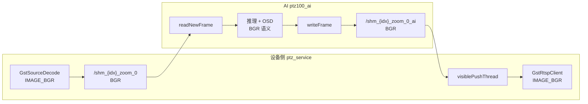

# 视频共享内存 BGR 格式改造设计文档

> **文档版本**：v1.0  
> **更新日期**：2026-06-24  
> **状态**：已按方案 B 在 develop 分支实现（设备侧 + GstRtspClient）  
> **关联模块**：`gstSourceDecode`、`GstRtspClient`、`ShmTransferFrame`、`ptz_service`、`ptz100_ros`、`laser_service`、`ptz100_ai`

---

## 一、概述

### 1.1 背景

平台视频链路通过 POSIX 共享内存（SHM）在**设备进程**与 **AI 进程**之间传递原始帧，AI 处理后再经 `_ai` SHM 回传给设备进程做 RTSP 编码推流。

历史上设备侧解码输出 **RGB** 写入 SHM，而 AI 侧 `blob_cuda_preprocess`、OpenCV 画框等逻辑按 **BGR** 字节序解读，存在通道语义不一致。AI 团队要求原始帧统一为 **BGR**，与 OpenCV 默认格式及预处理代码对齐。

### 1.2 改造目标

| 目标 | 说明 |
|------|------|
| 原始 SHM | 设备写入 **BGR** 三通道帧 |
| AI 推理 / OSD | 与 preprocess、OpenCV `Scalar` 语义一致 |
| `_ai` SHM | **BGR**（与原始帧、画框结果一致） |
| RTSP 推流 | `GstRtspClient` appsrc 声明 **IMAGE_BGR**，避免红蓝对调 |

### 1.3 选型结论

采用 **方案 B：全链路 BGR**，一次性统一原始 SHM、AI 内部、`_ai` SHM 与推流输入格式。

未采用方案 A（原始 BGR + AI 写 `_ai` 前 BGR2RGB + 推流仍 RGB），以避免 `_ai` 与原始 SHM 格式分裂及 AI 侧每帧额外 CPU 转换。

---

## 二、颜色格式说明

### 2.1 RGB 与 BGR

二者均为 3 通道、每像素 3 字节，区别仅在于 R/G/B 在内存中的排列顺序：

| 格式 | 字节 0 | 字节 1 | 字节 2 |
|------|--------|--------|--------|
| **RGB** | R | G | B |
| **BGR** | B | G | R |

混用会导致**红蓝通道对调**（画面偏色），宽高与通道数不变。

### 2.2 BGR 与 BGRx

| 格式 | 每像素字节 | 说明 |
|------|-----------|------|
| **BGR** | 3 | OpenCV `CV_8UC3` 默认；SHM 写入格式 |
| **BGRx** | 4 | GStreamer `nvvidconv` GPU 中间格式，第 4 字节为 padding |

和普/耐杰解码管道：`NVDEC → nvvidconv(BGRx) → videoconvert(BGR) → appsink`。

### 2.3 SHM 协议限制

`cameraFrameHeader_t`（`shmTransferFrame.h`）仅记录 `width/height/channels/frameDataSize`，**无 pixelFormat 字段**。RGB/BGR 靠进程间约定，升级须**设备与 AI 同步发版**。

---

## 三、改造前现状（RGB 时代）

### 3.1 和普 PTZ 视频链路

```
RTSP → GstSourceDecode(IMAGE_RGB)
     → /shm_{idx}_zoom_0          【RGB，原始 SHM】
     → AI readNewFrame → clone
     → 推理(preprocess 按 BGR 误读 RGB 字节)
     → frame_for_c2 → /shm_{idx}_zoom_0_ai  【RGB】
     → visiblePushThread → GstRtspClient(IMAGE_RGB) → MediaMTX
```

关键代码：

- 解码：`ptzDeviceHepu.cpp` → `SinkType::IMAGE_RGB`
- 写原始 SHM：`shmVisibleRaw_->writeFrame(bgr_frame)`（改造前变量名 `rgb_frame`）
- 读 `_ai` 推流：`visiblePushThread()` → `shmVisible_->readNewFrame()` → `pushFrame`
- 推流参数：`s_visibleRtspParam.source = IMAGE_RGB`

### 3.2 耐杰 PTZ

与和普类似：`ptz_app.cpp` 中 `GstSourceDecode::IMAGE_RGB` 写原始 SHM；`alg_app.cpp` 读 `_ai` SHM 后 `IMAGE_RGB` 推流。

### 3.3 激光 PTZ

```
JPEG → cv::imdecode(BGR) → cvtColor(BGR2RGB) → 原始 SHM(RGB)
                          → IMAGE_RGB 推流（不经 _ai）
```

AI 仍从原始 SHM 读帧，经 `_ai` SHM 回传后由对应节点推流（与和普架构类似）。

### 3.4 问题归纳

| 环节 | 改造前格式 | 问题 |
|------|-----------|------|
| 原始 SHM | RGB | 与 AI preprocess BGR 假设不一致 |
| AI 画框 | OpenCV BGR `Scalar` 画在 RGB buffer | 框/字颜色语义错误 |
| `_ai` SHM | RGB | 与推流 IMAGE_RGB 一致，**推流画面正常** |
| 推流 | IMAGE_RGB | 与 `_ai` 匹配 |

---

## 四、方案 B 目标架构

### 4.1 统一数据流（和普可见光示例）



### 4.2 各段格式（改造后）

| 段 | SHM / 接口 | 格式 |
|----|-----------|------|
| 原始 SHM | `/shm_{dev}_{type}_{ch}` | **BGR** |
| AI 内部 `inputs.frame` / `frame_for_c2` | — | **BGR** |
| `_ai` SHM | `/shm_{dev}_{type}_{ch}_ai` | **BGR** |
| 推流 appsrc | `GstRtspClient::IMAGE_BGR` | **BGR** |

### 4.3 方案 A 对比（未采用）

| 段 | 方案 A | 方案 B（已采用） |
|----|--------|-----------------|
| 原始 SHM | BGR | BGR |
| AI 写 `_ai` | **新增 BGR2RGB** | 直写 BGR |
| `_ai` SHM | RGB | BGR |
| 推流 | IMAGE_RGB 不变 | IMAGE_BGR |
| GstRtspClient | 不改 | 增加 IMAGE_BGR |
| 联调面 | 较小 | 需推流一起改 |

---

## 五、模块改动说明

### 5.1 GstRtspClient（`public/gstNvDeeps/gstRtspClient/`）

**新增枚举值：**

```cpp
enum class Source : uint8_t {
    ...
    IMAGE_RGB    = 3,
    IMAGE_GRAY8  = 4,
    IMAGE_BGR    = 5,   // 新增
};
```

**行为：**

- `createSourceImagePipeline`：appsrc caps 支持 `video/x-raw,format=BGR`
- `runPipelineLoop` / `setParam`：BGR 与 RGB 同等校验（需填 inputWidth/Height）
- `pushFrame`：仍为零拷贝 memcpy，**不做颜色转换**

默认 `Param.source` 改为 `IMAGE_BGR`。

### 5.2 GstSourceDecode（`public/gstNvDeeps/gstSourceDecode/`）

- 已有 `SinkType::IMAGE_BGR`，管道：`nvvidconv(BGRx) → videoconvert → appsink(format=BGR)`
- 默认 `Param.sinkType` 改为 `IMAGE_BGR`

### 5.3 和普 PTZ（`ros_ws/src/ptz_service/.../ptzDeviceHepu.cpp`）

| 配置项 | 改造后 |
|--------|--------|
| `s_decodeParam.sinkType` | `IMAGE_BGR` |
| `s_visibleRtspParam.source` | `IMAGE_BGR` |
| `s_thermalRtspParam.source` | `IMAGE_BGR` |
| `onRawVideoFrame` | `bgr_frame` 写 `shmVisibleRaw_` / `shmThermalRaw_` |
| `visiblePushThread` / `thermalPushThread` | 读 `_ai` SHM 后 `pushFrame`（数据为 BGR，与 IMAGE_BGR 一致） |

调试宏 `HEPU_STREAM_MODE_RAW`（默认关闭）：原始帧直推时也使用 IMAGE_BGR 客户端。

### 5.4 耐杰 PTZ（`src/app/ptz/ptz_app.cpp`、`src/app/alg_app/alg_app.cpp`）

| 文件 | 改动 |
|------|------|
| `ptz_app.cpp` | `IMAGE_BGR` 解码；`frameBGR` 写原始 SHM |
| `alg_app.cpp` | 两路 `s_rtspClientParam.source = IMAGE_BGR` |

### 5.5 激光 PTZ（`ros_ws/src/laser_service/.../laserDeviceHe.cpp`）

| 改动 |
|------|
| 删除 `cv::cvtColor(BGR2RGB)` |
| `imdecode` 得到的 `frameBGR` 直接写 SHM、OSD、推流 |
| `s_rtspParam.source = IMAGE_BGR` |

### 5.6 AI（`ros_ws/src/ptz100_ai`）

**主链路无需修改：**

```cpp
inputs.frame = frame.clone();
inputs.frame_for_c2 = inputs.frame.clone();
// ...
m_write_visible_ShmTransferFrame.writeFrame(frame, ...);
```

设备侧原始 SHM 改为 BGR 后，AI 读入、`_ai` 写出自然为 BGR，与 `blob_cuda_preprocess`、`visualization` 的 BGR 假设一致。

**未改动的可选路径：**

- `is_day.cpp` 中 `COLOR_RGB2GRAY` 保持原样；`SkyfendAI::is_day()` 在生产代码中为注释状态，不影响主链路。

### 5.7 示例与默认值

`public/gstNvDeeps/examples/` 下 `videoRtspTest`、`videoShmTest`、`videoDecodeTest`、`cloudPusherTest` 等已同步为 BGR。

---

## 六、SHM 命名（不变）

| 名称 | 方向 | 改造后像素格式 |
|------|------|---------------|
| `/shm_{idx}_zoom_0` | 设备 → AI | BGR |
| `/shm_{idx}_infrared_0` | 设备 → AI | BGR |
| `/shm_{idx}_zoom_0_ai` | AI → 推流 | BGR |
| `/shm_{idx}_infrared_0_ai` | AI → 推流 | BGR |

生成函数：`ShmTransferFrame::generateShmName()` / `generateShmNameAi()`。

---

## 七、发版与兼容性

### 7.1 必须同步升级

| 组件 | 说明 |
|------|------|
| `ptz_service` / `ptz100_ros` / `laser_service` | 写 BGR 原始 SHM + IMAGE_BGR 推流 |
| `ptz100_ai` | 读 BGR、写 BGR `_ai`（主链路无代码变更，但须同版本部署） |
| MediaMTX / 拉流端 | H264 解码显示不受 RGB/BGR 影响（编码前已转 YUV） |

### 7.2 版本不匹配风险

| 场景 | 现象 |
|------|------|
| 设备 BGR + AI/推流仍按 RGB | 推理通道错、推流红蓝对调 |
| 设备 RGB + 推流 IMAGE_BGR | 推流红蓝对调 |
| 仅升设备不升 AI | 原始 SHM 格式变，AI 行为异常 |

### 7.3 回滚

恢复各模块 `IMAGE_RGB` / `SinkType::IMAGE_RGB`，激光恢复 `BGR2RGB`，移除 `GstRtspClient::IMAGE_BGR` 调用即可。

---

## 八、验证清单

### 8.1 功能

- [ ] 和普可见光：原始 SHM 有帧，AI 推理正常，`_ai` SHM 有帧
- [ ] 和普可见光 RTSP 拉流：**无红蓝对调**，OSD 框颜色正常（红框为红、绿框为绿）
- [ ] 和普红外：同上
- [ ] 耐杰双路：原始 SHM + alg_app 推流正常
- [ ] 激光：SHM + 直推 RTSP 颜色正常

### 8.2 性能

- [ ] 对比改造前后解码回调耗时（BGR 路径可能少一次 BGRx→RGB 转换）
- [ ] 激光路径少一次 `cvtColor`，CPU 略降

### 8.3 工具

- sysmonit SHM 诊断：`/api/video/shm` 帧 age、frame_id 正常
- 可选：保存 `_ai` SHM 一帧，`cv::imwrite` 直接写盘（OpenCV 默认 BGR，显示应正常）

---

## 九、涉及源文件清单

| 路径 | 改动类型 |
|------|----------|
| `public/gstNvDeeps/gstRtspClient/gstRtspClient.h` | 新增 IMAGE_BGR，默认 source |
| `public/gstNvDeeps/gstRtspClient/gstRtspClient.cpp` | BGR caps / 分支 |
| `public/gstNvDeeps/gstSourceDecode/gstSourceDecode.h` | 默认 sinkType BGR |
| `ros_ws/src/ptz_service/src/ptzDevice/ptzDeviceHepu.cpp` | 解码 + 推流 + SHM |
| `src/app/ptz/ptz_app.cpp` | 耐杰解码 + SHM |
| `src/app/alg_app/alg_app.cpp` | 耐杰推流 |
| `ros_ws/src/laser_service/src/laserDevice/laserDeviceHe.cpp` | 去 BGR2RGB + 推流 |
| `public/gstNvDeeps/examples/*.cpp` | 示例同步 |

**AI 主链路文件（无功能性修改）：** `ros_ws/src/ptz100_ai/skyfend_ai_main/ai_main.cpp` 等。

---

## 十、附录

### 10.1 相关文档

- [PTZ设备处理模块设计文档](./PTZ设备处理模块设计文档.md) — 视频流整体架构  
- [sysmonit方案设计文档](./sysmonit方案设计文档.md) — SHM 诊断与 `/api/video/shm`

### 10.2 缩略语

| 缩略语 | 含义 |
|--------|------|
| SHM | POSIX 共享内存（`ShmTransferFrame`） |
| NVDEC | NVIDIA 硬件解码 |
| `_ai` | AI 处理后结果 SHM 后缀 |
