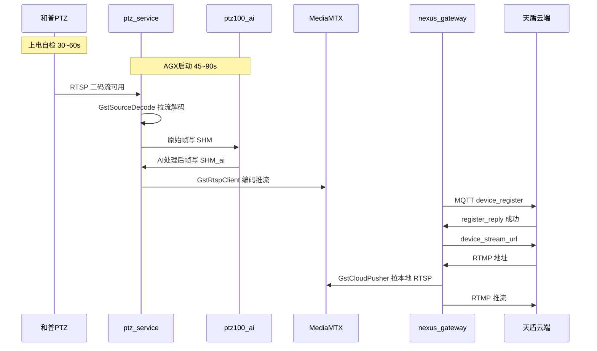

# 和普 PTZ 冷启动视频延迟问题分析

> **文档版本**：v1.4
> **日期**：2026-06-25
> **状态**：实验室 A/B + C++ 分项测试已完成；建议按 §7.9 部署
> **关联设备**：SSF200（Spotter）、和普 PTZ（Z50 系列）、AGX
> **关联模块**：`ptz_service`、`ptz100_ai`、`mediamtx`、`nexus_gateway`、`gstSourceDecode`、`gstCloudPusher`

---

## 一、问题背景

### 1.1 现场反馈

- **现象**：SSF200（Spotter）设备上电上线后，需等待 **1–2 分钟** 才会出现视频流，耗时较久。
- **范围**：王志强反馈该问题在 **天盾** 和 **C2** 平台均存在，并非仅天盾播放器问题。
- **现场环境**：设备所在地 **频繁断电**（曾出现平均 5–10 分钟断电一次）；断电修复后 PTZ Web 后台加载也明显变慢，怀疑与 PTZ 设备状态有关。
- **同事验证**：袁伟健现场接入 PTZ 较快，未复现 1–2 分钟；说明问题与 **冷启动场景、供电环境** 强相关。

### 1.2 本地验证（家里模拟）

- 将视频源推送到 AGX 本地 RTMP，用 VLC 拉流播放，**约 1 秒** 出画。
- **结论**：嵌入式推流侧（编码 → MediaMTX → 拉流）**本身不慢**；现场延迟主要来自 **冷启动全链路**，而非推流编码性能。

### 1.3 初步答复（待细化）

> PTZ 和 AGX 同时上电后，均需完成自检/启动，双方就绪并建连后才有视频流。

本分析在以上答复基础上，结合代码链路给出 **耗时拆解、瓶颈定位与优化方案**。

---

## 二、视频链路架构

### 2.1 本地推流链路

```
和普 PTZ (RTSP 二码流)
    → ptz_service (GstSourceDecode 拉流解码)
    → 原始 SHM (PTZ→AI)
    → ptz100_ai (推理 + OSD)
    → 处理后 SHM (AI→Streaming)
    → ptz_service (GstRtspClient 硬编 H.264)
    → MediaMTX (UDP RTP, 端口 5410/5411 等)
    → C2 本地 RTSP 拉流
```

### 2.2 SSF200 上云（天盾）额外链路

```
nexus_gateway
    → MQTT 连接天盾 Broker
    → device_register 注册成功
    → device_stream_url 请求 RTMP 推流地址（最多 10 次 × 5s）
    → GstCloudPusher 从本地 MediaMTX 拉 RTSP
    → 免转码重封装 FLV → RTMP 推至天盾云端
    → 天盾播放器出画
```

### 2.3 关键代码事实


| 点                    | 说明                                                                    | 代码位置                              |
| ----------------------- | ------------------------------------------------------------------------- | --------------------------------------- |
| 默认推**AI 处理后帧** | `visiblePushThread` 从 `shmVisible_`（`_ai` SHM）读帧推流，非原始帧直推 | `ptzDeviceHepu.cpp`                   |
| RTSP 拉流失败重试     | 管线异常退出后 sleep 再拉起（原固定**5s**）                             | `gstSourceDecode.cpp`                 |
| 云端推流失败重试      | 原固定**5s** 重连                                                       | `gstCloudPusher.cpp`                  |
| 天盾要流时机          | `device_register` 成功后才 `RequestStreamUrl()`                         | `NexusGateway.cpp`                    |
| 和普 TCP 重连         | `HEPU_RECONNECT_INTERVAL_SEC = 5`，初始化阶段检查周期 10s               | `ptz_hepu_msg.h`、`ptz_hepu_ctrl.cpp` |

### 2.4 链路时序图



---

## 三、分析过程

### 3.1 排除项：嵌入式推流不慢

家里模拟（本地 RTMP → VLC ~1s）证明：**有视频源且服务就绪后，推流编码链路延迟极低**。问题不在 GStreamer 编码/推流本身。

### 3.2 冷启动耗时拆解


| 阶段                | 典型耗时    | 说明                                                       |
| --------------------- | ------------- | ------------------------------------------------------------ |
| AGX 硬件启动        | 45–90s     | Jetson 上电到 Linux + 自启脚本；异常断电后可能有 fsck      |
| ptz100_ai 模型加载  | 15–30s     | `SkyfendAI` 构造时加载 TensorRT 权重，与 AGX 启动重叠      |
| ptz_service 启动    | 0–10s 额外 | **原** `auto_boot_app.sh` 未包含，靠 monit 每 10s 检测拉起 |
| 和普 PTZ 自检       | 30–60s     | 云台回零、镜头初始化；正常比 AGX 快（王志强反馈）          |
| RTSP 拉流首帧       | 0–15s      | PTZ RTSP 未就绪时，解码管线失败后**每 5s 重试**            |
| AI 首帧输出         | 1–3s       | 原始帧进 SHM 后推理写回                                    |
| 本地 MediaMTX       | <1s         | 有帧即推                                                   |
| 天盾上线 + 要流地址 | 5–15s      | MQTT 连接 → register →`RequestStreamUrl`                 |
| 云端 RTMP 推流      | 1–5s       | `GstCloudPusher` 拉本地 RTSP 推 RTMP                       |
| 播放器首屏          | 0–2s       | GOP 约 2s 一个 I 帧                                        |

**关键路径（AGX + PTZ 同时断电上电）：**

```
总耗时 ≈ max(AGX启动, PTZ自检) + 服务链就绪 + 天盾注册推流
       ≈ 60~90s（正常）
       ≈ 90~120s（频繁断电、网络不稳、PTZ Web 变慢）
```

### 3.3 天盾 vs C2 差异


| 路径        | 额外环节                                   |
| ------------- | -------------------------------------------- |
| **C2 本地** | MediaMTX RTSP（局域网），无 MQTT/RTMP      |
| **天盾**    | 注册成功 → 要 RTMP 地址 → 公网 RTMP 推流 |

天盾通常比 C2 **多 5–15s**，但不足以单独解释 1–2 分钟；**冷启动才是主因**。

### 3.4 启动顺序隐患（分析发现）

原 `config/boot/auto_boot_app.sh` 存在：

1. **未包含 `ptz_service`**，依赖 monit 晚启动（0–10s 空窗）
2. **`mediamtx` 在 `nexus_gateway` 之后**才启动，视频节点可能先于 MediaMTX 就绪
3. 启动顺序为 `ptz100_ai` 先于 `ptz_service`，与数据流方向（应先拉流写 SHM）不一致

### 3.5 现场环境因素

- 频繁硬断电 → PTZ 自检变长、AGX 文件系统检查、网络反复初始化
- 王志强反馈 PTZ Web 后台也慢 → 指向 **PTZ 硬件冷启动** 被放大，不纯是 AGX 软件问题
- **供电稳定（UPS）** 往往比纯软件优化收益更大

### 3.6 结论


| 维度     | 结论                                              |
| ---------- | --------------------------------------------------- |
| 推流性能 | 正常，家里 1s 验证成立                            |
| 主要瓶颈 | 冷启动：`max(AGX, PTZ)` + 服务就绪顺序 + 重试等待 |
| 天盾     | 比 C2 略慢，但非独立根因                          |
| 现场     | 频繁断电显著拉长总时间                            |

---

## 四、优化方案（分阶段）

> **说明**：以下方案经分析后拟定；其中「方案 A」已在会话中起草代码改动，**尚未评审统一部署**，实施前需回滚或确认工作区状态。

### 4.1 阶段一：启动顺序（改动小、收益明确）

**目标**：消除 10–20s 不必要等待。


| 动作                              | 说明                                     |
| ----------------------------------- | ------------------------------------------ |
| MediaMTX 提前                     | 在所有视频相关 ROS 节点之前启动          |
| 加入`ptz_service`                 | 纳入`auto_boot_app.sh`，不再仅依赖 monit |
| `ptz_service` 在 `ptz100_ai` 之前 | 先拉 PTZ RTSP 写原始 SHM，AI 再读处理    |
| 删除末尾重复 mediamtx 启动        | 避免重复拉起                             |

**目标启动顺序：**

```
mediamtx → ptz100_ros → ptz_service → ptz100_ai → ... → nexus_gateway
```

### 4.2 阶段二：冷启动快速重试（中等收益）

**目标**：PTZ RTSP / 本地 MediaMTX 未就绪时，减少重试空窗（每次失败省 ~3.5s）。


| 组件              | 启动阶段 | 稳态   | 启动阶段时长 |
| ------------------- | ---------- | -------- | -------------- |
| `GstSourceDecode` | 1500ms   | 5000ms | 120s         |
| `GstCloudPusher`  | 1500ms   | 5000ms | 120s         |

120s 后自动切回稳态间隔，避免长期运行频繁重连。

**预估收益**：RTSP 多次重试场景下 **15–20s**；云端推流等待本地流 **5–10s**。

### 4.3 阶段三：现场环境（收益最大）

- 加 **UPS / 稳压**，避免 5–10 分钟断电循环
- 减少 PTZ 与 AGX 异常断电带来的自检延长和 fsck

### 4.4 阶段四：可选后续（本次未实施）


| 方案               | 说明                                                        | 预估收益   |
| -------------------- | ------------------------------------------------------------- | ------------ |
| 启动阶段原始流直推 | `HEPU_STREAM_MODE_RAW` 或双路径：先出画面，AI 框后叠加      | 10–20s    |
| 并行请求推流地址   | 注册成功后并行`RequestStreamUrl` 与 `RequestDeviceTimeSync` | 数秒       |
| 缓存 RTMP 地址     | 注册成功即预推（需天盾确认地址有效期）                      | 数秒       |
| 和普 SDK 重连间隔  | 初始化阶段缩短`HEPU_RECONNECT_INTERVAL_SEC`                 | 视现场而定 |

---

## 五、综合收益预估


| 场景              | 优化前（实测） | 阶段一+二后（实验室实测） |
| ------------------- | -------------- | ------------------------- |
| 正常冷启动        | **~72s**（§7.6） | **~30–32s**（C1/C3，PTZ 快） |
| PTZ 自检偏慢      | **~72s**       | **~59s**（C2 R2，PTZ 等待 ~51s，仍快 ~13s） |
| 频繁断电 / PTZ 慢 | 90–120s（现场估） | **待现场 UPS + 复测** |

> **修订**：原估 45–70s 偏保守；在 §6.1 + C++ 编译且 PTZ 自检 ~10s 时，实验室三轮稳定在 **28–32s**。硬下限仍受 **PTZ 冷启动方差**（8–51s）主导。

---

## 六、会话中起草的代码改动记录

> **状态**：已在工作区起草，**待评审后统一部署**。若需保持主分支不变，可先 `git checkout` 还原以下文件。

### 6.1 `config/boot/auto_boot_app.sh`

**改动要点：**

- 在 ROS 节点启动前增加 MediaMTX 启动（`pidof` 检测防重复）
- 在 `ptz100_ai` 之前增加 `ptz_service` 启动
- 删除脚本末尾重复的 mediamtx 启动

```bash
# MediaMTX 必须在 ptz_service / nexus_gateway 推流拉流之前就绪
if ! pidof mediamtx > /dev/null 2>&1; then
    echo "[INFO] starting mediamtx before video pipeline nodes"
    nohup ${MEDIAMCTX_SCRIPT_PATH}/mediamtx ${MEDIAMCTX_SCRIPT_PATH}/mediamtx.yml &
    sleep 1
fi

#start ros nodes
su skyfend -c "${APP_SCRIPT_PATH}/skyfend-ptz100.sh -s ptz100_ros -e start"
# ptz_service 需在 ptz100_ai 之前：先拉 PTZ RTSP 写原始 SHM，AI 再读处理
su skyfend -c "${APP_SCRIPT_PATH}/skyfend-ptz100.sh -s ptz_service -e start"
su skyfend -c "${APP_SCRIPT_PATH}/skyfend-ptz100.sh -s ptz100_ai -e start"
# ... 其余节点不变 ...
# （已删除末尾 nohup mediamtx）
```

### 6.2 `public/gstNvDeeps/gstSourceDecode/gstSourceDecode.h`

**新增 `Param` 字段（带默认值，旧调用方兼容）：**

```cpp
uint16_t pipelineRestartDelayMs{5000};      // 稳态重连间隔(ms)
uint16_t pipelineRestartDelayBootMs{1500};  // 启动阶段重连间隔(ms)
uint16_t bootPhaseDurationSec{120};         // 启动阶段时长(s)
```

**新增成员与方法：**

- `workerStartTimeMs_`：在 `start()` 时记录
- `getPipelineRestartDelayMs()`：启动 120s 内用 1500ms，之后用 5000ms

### 6.3 `public/gstNvDeeps/gstSourceDecode/gstSourceDecode.cpp`

- `workerTaskLoopForever()`：由固定 `sleep(5000)` 改为 `getPipelineRestartDelayMs()`
- `start()`：设置 `workerStartTimeMs_`

### 6.4 `public/gstNvDeeps/gstCloudPusher/gstCloudPusher.h`

**扩展 `Param`：**

```cpp
struct Param {
    uint32_t latencyMs;
    uint32_t reconnectDelayMs;
    uint32_t reconnectDelayBootMs;  // 启动阶段 1500ms
    uint32_t bootPhaseDurationSec;  // 120s
};
static constexpr Param DefaultParam{300, 5000, 1500, 120};
```

**新增：** `workerStartTime_`、`getReconnectDelayMs()`

### 6.5 `public/gstNvDeeps/gstCloudPusher/gstCloudPusher.cpp`

- `workerTaskLoopForever()`：使用 `getReconnectDelayMs()` 动态间隔
- `startPush()`：记录 `workerStartTime_`

### 6.6 `ros_ws/src/ptz_service/src/ptzDevice/ptzDeviceHepu.cpp`

**`s_decodeParam` 显式配置冷启动重试：**

```cpp
static GstSourceDecode::Param s_decodeParam = {
    GstSourceDecode::SinkType::IMAGE_BGR,
    GstSourceDecode::Decoder::HARDWARE,
    0, 0, 0,
    true,   // disableDPB
    5000,   // pipelineRestartDelayMs (稳态)
    1500,   // pipelineRestartDelayBootMs (冷启动)
    120,    // bootPhaseDurationSec
};
```

### 6.7 部署依赖


| 改动类型                             | 需重新编译/生效方式                                   |
| -------------------------------------- | ------------------------------------------------------- |
| `gstSourceDecode` / `gstCloudPusher` | 重编`ptz_service`、`nexus_gateway`                    |
| `auto_boot_app.sh`                   | 重新上电或手动执行 boot 脚本                          |
| monit                                | 仍会监控`ptz_service`；auto_boot 已启动时不会重复拉起 |

---

## 七、半自动冷启动测量（现有设施，不改业务代码）

> **适用场景**：AGX + 和普 PTZ 同时断电上电；`nexus_gateway` 在跑但**连不上天盾 RTMP** 时，用 **本地 MediaMTX RTSP** 代替云端出画指标。
> **测量脚本**：`config/tools/cold_boot_benchmark.sh`（已支持 `@reboot` 安装）

### 7.1 为何不用本地 RTMP？

当前和普链路是：

```
ptz_service → MediaMTX (UDP RTP :5410/5411) → RTSP :9554 → 播放端
```

**RTMP 仅用于天盾云端**（`GstCloudPusher` → 公网 RTMP）。本地验证「视频多久能看」应直接测 **RTSP**，与家里 VLC 测 RTMP 等价，且**无需改代码、无需搭本地 RTMP 服务器**。


| 播放方式          | URL / 入口                                   | 说明                                            |
| ------------------- | ---------------------------------------------- | ------------------------------------------------- |
| **VLC（推荐）**   | `rtsp://192.168.2.132:9554/ptz/zoom/ch0`     | 可见光（AI 处理后）                             |
| **VLC**           | `rtsp://192.168.2.132:9554/ptz/ir/ch0`       | 热像                                            |
| **sysmonit 网页** | `http://192.168.2.132:12345` → Video 页     | 内置 WHEP 低延迟播放器；可见光/热像卡片上点播放 |
| **脚本自动探测**  | 同上 RTSP +`/tmp/video_pipeline_status.json` | 不依赖人工点播放                                |

`nexus_gateway` 连不上 RTMP **不影响**本地 RTSP 测量；注册日志仍可记录，但本轮以 **「本地 RTSP 可播」** 作为用户可感知的「出画」终点。

### 7.2 测量里程碑

所有时间均为 **相对系统 boot** 的秒数（`uptime` / `/proc/uptime`）：


| 里程碑                   | 判定方式                                                       |
| -------------------------- | ---------------------------------------------------------------- |
| MediaMTX 就绪            | TCP`127.0.0.1:9554` 可达                                       |
| `ptz_service` 进程       | `pidof ptz_service`                                            |
| `ptz100_ai` 进程         | `pidof ptz100_ai`                                              |
| `nexus_gateway` 进程     | `pidof nexus_gateway`                                          |
| RTSP 解码首帧            | `/tmp/video_pipeline_status.json` → `visible.decode_fps > 0`  |
| AI 首帧                  | `visible.ai_fps > 0`                                           |
| 本地编码推流             | `visible.encode_fps > 0`                                       |
| **本地可播放（主指标）** | `gst-launch-1.0` 成功拉取 `rtsp://127.0.0.1:9554/ptz/zoom/ch0` |
| 天盾注册（可选）         | `nexus_gateway.log`：`registered successfully`                 |
| 天盾 RTMP（可选）        | `cloud push started`（需公网 RTMP 可达）                       |

**主指标**：`local_rtsp_visible_playable` ≈ 用户在 VLC/sysmonit 看到画面的时刻（误差约 ±1–2s）。

### 7.3 操作步骤（你只需配合 3 步）

**断电前（在 AGX 上执行一次安装，已完成可跳过）：**

```bash
bash /home/skyfend/workspace/ptz100_agx/config/tools/cold_boot_benchmark.sh install
```

**每次测试断电前：**

```bash
bash /home/skyfend/workspace/ptz100_agx/config/tools/cold_boot_benchmark.sh mark
# 然后：只断 AGX + 和普 PTZ 电源，再上电
```

脚本已通过 `crontab @reboot` 在上电 **15s 后**自动采集（等基础服务起来），最长轮询 **300s**，结果写入：

- `/home/skyfend/log/cold_boot_benchmark.log`
- `/home/skyfend/log/cold_boot_benchmark_latest.json`

**上电后（SSH 恢复，或让 Agent 执行）：**

```bash
bash /home/skyfend/workspace/ptz100_agx/config/tools/cold_boot_benchmark.sh report
```

可选人工交叉验证：

```bash
# VLC 同 URL（在 PC 或 AGX 上）
rtsp://192.168.2.132:9554/ptz/zoom/ch0

# 管道实时状态
cat /tmp/video_pipeline_status.json
```

### 7.4 输出示例（JSON）

```json
{
  "test_mode": "local_rtsp",
  "seconds_since_boot": {
    "mediamtx_port_9554": 18,
    "ptz_service_process": 45,
    "pipeline_decode_fps": 62,
    "pipeline_ai_fps": 65,
    "pipeline_encode_fps": 66,
    "local_rtsp_visible_playable": 67
  },
  "summary": {
    "agx_video_ready_sec": 67
  }
}
```

解读：**上电后约 67s**，本地 RTSP 可播（VLC/sysmonit 应能出画）。

### 7.5 与 Agent 协作流程

1. 你发：**「准备断电测冷启动」**
2. Agent 执行 `mark`（若未 `install` 则先 `install`）
3. 你：**只断 AGX + PTZ** → 上电
4. 你发：**「已上电」** 或 SSH 恢复
5. Agent 执行 `report`，将结果填入本文档 **§7.6 实测记录**

卸载自动采集：

```bash
bash /home/skyfend/workspace/ptz100_agx/config/tools/cold_boot_benchmark.sh uninstall
```

### 7.6 实测记录（三轮汇总）

**测试环境**：实验室 AGX `192.168.2.132` + 和普 PTZ；只断 AGX + PTZ；播放验证 `rtsp://192.168.2.132:9554/ptz/zoom/ch0`（VLC）；天盾 RTMP 不可用（MQTT `Connection refused`，不影响本地测量）。

**数据来源**：三轮均以 `journalctl -b 0` + `ptz_service.log` 手工对齐为准。`cold_boot_benchmark.sh` 自动 JSON **不可直接采信**（上电后残留 `/tmp/video_pipeline_status.json` 导致虚报 +5~6s；脚本 T0 取启动时刻 uptime 而非 boot 0s）。

---

#### 三轮明细


| 轮次      | AGX boot (`uptime -s`) | MediaMTX | ptz_service | ptz100_ai | nexus_gateway | **视频就绪** | **PTZ 等待*** | VLC            |
| ----------- | ------------------------ | ---------- | ------------- | ----------- | --------------- | -------------- | --------------- | ---------------- |
| **初测**  | `08:00:23`             | +15s     | +21s        | +23s      | +51s          | **+72s**     | ~51s          | 用户确认已出画 |
| **第1轮** | `08:00:23`             | +14s     | +19s        | +21s      | +47s          | **+72s**     | ~53s          | —             |
| **第2轮** | `08:00:24`             | +14s     | +20s        | +22s      | +50s          | **+71s**     | ~49s          | —             |

\* **PTZ 等待** = `ptz_service` 进程启动 → RTSP 解码首帧（`Decoder FPS` / `Visible push`）的间隔，主要反映和普 PTZ 自检 / RTSP 就绪时间。

**各轮时间线（相对 AGX Linux boot）**

<details>
<summary>初测（2026-06-25）</summary>


| +秒数    | 里程碑                           |
| ---------- | ---------------------------------- |
| 0        | AGX Linux 启动                   |
| +15      | MediaMTX 启动                    |
| +21      | `ptz_service` 启动               |
| +23      | `ptz100_ai` 启动                 |
| +51      | `nexus_gateway` 启动             |
| **+72**  | RTSP 解码首帧 + 本地 encode 推流 |
| ~+72–80 | VLC 可播（用户确认）             |

</details>

<details>
<summary>第1轮（2026-06-25）</summary>


| +秒数   | 里程碑                                         |
| --------- | ------------------------------------------------ |
| 0       | AGX Linux 启动（`08:00:23`）                   |
| +14     | MediaMTX 启动                                  |
| +19     | `ptz_service` 启动                             |
| +21     | `ptz100_ai` 启动                               |
| +47     | `nexus_gateway` 启动                           |
| **+72** | RTSP 解码首帧 + 本地 encode 推流（`08:01:35`） |

</details>

<details>
<summary>第2轮（2026-06-25，断电前 mark `08:02:45`）</summary>


| +秒数   | 里程碑                                         |
| --------- | ------------------------------------------------ |
| 0       | AGX Linux 启动（`08:00:24`）                   |
| +14     | MediaMTX 启动                                  |
| +20     | `ptz_service` 启动                             |
| +22     | `ptz100_ai` 启动                               |
| +50     | `nexus_gateway` 启动                           |
| **+71** | RTSP 解码首帧 + 本地 encode 推流（`08:01:35`） |

</details>

---

#### 三轮统计结论


| 指标                                  | 初测 | 第1轮 | 第2轮 | **平均**             |
| --------------------------------------- | ------ | ------- | ------- | ---------------------- |
| AGX 侧视频就绪                        | 72s  | 72s   | 71s   | **≈ 71.7s**         |
| AGX 服务链就绪（mediamtx→ptz100_ai） | 8s   | 7s    | 8s    | **≈ 7.7s**          |
| PTZ 等待（ptz_service→首帧）         | ~51s | ~53s  | ~49s  | **≈ 51s**           |
| 轮间偏差                              | —   | —    | —    | **±1s**（高度一致） |

**结论**

1. **实验室冷启动出画时间稳定在约 71–72 秒**，三轮可重复，偏差 ±1s。
2. **瓶颈稳定在和普 PTZ**：约占 **50s+**（`ptz_service` 已运行但 RTSP 无帧）；AGX 软件侧 **~8s** 即可就绪。
3. **低于现场 1–2 分钟上限**，但用户感知仍是「需等待约 1 分钟」；现场频繁断电可能进一步拉长 PTZ 自检。
4. **嵌入式推流不慢**：首帧到达后 encode 几乎同时就绪（+0s 级），与家里 VLC ~1s 验证一致。
5. **自动采集脚本待修**：上电后应清空或忽略陈旧 `video_pipeline_status.json`；里程碑应以 **boot 绝对 uptime** 为 T0，而非脚本启动时刻。

**汇总表**


| 日期       | 轮次         | 断电方式           | agx_video_ready_sec | PTZ 等待 | 备注              |
| ------------ | -------------- | -------------------- | --------------------- | ---------- | ------------------- |
| 2026-06-25 | 初测         | AGX+PTZ            | **72**              | ~51s     | VLC 已确认        |
| 2026-06-25 | 第1轮        | AGX+PTZ            | **72**              | ~53s     | 日志对齐          |
| 2026-06-25 | 第2轮        | AGX+PTZ            | **71**              | ~49s     | mark 后断电       |
| —         | 现场（待测） | AGX+PTZ + 频繁断电 | —                  | —       | 对比 1–2min 反馈 |

### 7.7 `auto_boot_app.sh` A/B 分项测试

> **说明**：§7.6 三轮在**两项 boot 改动均生效**、**§6.2–§6.6 C++ 未编译**条件下测得 ~71.7s。以下为 boot 改动分项隔离。

| 阶段 | MediaMTX 提前 | ptz_service 进 auto_boot | 视频就绪（平均） | 状态 |
|------|---------------|--------------------------|------------------|------|
| §7.6 已测 | ✅ | ✅ | **~71.7s** | 完成 |
| **阶段1** | ✅ | ❌ monit 拉起 | **~64.6s**（5轮，波动大） | 完成 5 轮 |
| **阶段2** | ❌ 末尾启动 | ❌ monit 拉起 | **~75.6s**（5轮） | 完成 5 轮 |

**阶段2 五轮明细**

| 轮次 | MediaMTX | ptz_service | ptz100_ai | nexus | **视频就绪** | **PTZ 等待*** | 备注 |
|------|----------|-------------|-----------|-------|--------------|---------------|------|
| 第1轮 | +47s（末尾） | +59s (monit) | +20s | +47s | **+72s** | ~7s | — |
| 第2轮 | +47s（末尾） | +65s (monit) | +20s | +47s | **+92s** | ~27s | PTZ 自检偏慢 |
| 第3轮 | +43s（末尾） | +60s (monit) | +18s | +43s | **+69s** | ~7s | — |
| 第4轮 | +47s（末尾） | +59s (monit) | +20s | +47s | **+73s** | ~7s | — |
| 第5轮 | +47s（末尾） | +59s (monit) | +20s | +47s | **+72s** | ~7s | — |
| **5轮平均** | **~+46s** | **~+60s** | **+19s** | **+46s** | **~75.6s** | — | 69–92s 波动 |

**阶段2 结论**（5 轮）：

1. 出厂 boot（MediaMTX 末尾 **~+46s**）5 轮平均 **~75.6s**，较 §7.6（~71.7s）略慢 **~4s**，但在 PTZ 波动范围内（69–92s）。
2. 与阶段1（~64.6s）相比阶段2略慢，但阶段1含 **38s 异常快轮**；若剔除阶段1第2轮，两者均在 **~69–73s** 区间重叠。
3. **MediaMTX 提前 ~33s 对出画无稳定影响**；真正瓶颈仍是 **PTZ 冷启动** + **monit 排队拉起 ptz_service（~+59–65s）**。

**A/B 总对比**（阶段1/2 各 5 轮 + §7.6 三项全开 3 轮）

| 配置 | 平均出画 | 波动范围 | 建议 |
|------|----------|----------|------|
| §7.6 两项 boot 全开 | **~71.7s** | 71–72s | **最稳定**，推荐部署 |
| 阶段1 仅 MediaMTX 提前 | ~64.6s | 38–73s | 无稳定收益 |
| 阶段2 出厂 boot | ~75.6s | 69–92s | 基线对照 |

**推荐下一步**：恢复 §6.1 完整 boot（MediaMTX 提前 + `ptz_service` 进 `auto_boot`），消除 monit 排队；PTZ 侧优化需 §6.2–6.6 编译部署后分项验证（见 §7.8）。

### 7.8 §6.2–§6.6 C++ 分项测试

> **对照基线**：§7.6 三轮（~71.7s）= §6.1 boot 已生效，但 **C++ 未编译**（`ptz_service` 仍固定 5s 重连）。
>
> **本轮 boot 固定为 §6.1**（MediaMTX 提前 + `ptz_service` 进 auto_boot），消除 monit 排队对 PTZ 等待的干扰。

**三项对本地 RTSP 出画的影响评估**

| 项 | 影响本地 RTSP？ | 预期收益 | 说明 |
|----|----------------|----------|------|
| **§6.2–§6.3** `gstSourceDecode` | **是** | **0–20s**（视 PTZ 等待） | PTZ RTSP 未就绪时，管线失败后重连间隔 5s→1.5s；**仅当 `ptz_service` 早启动且 PTZ 仍在自检时有效** |
| **§6.4–§6.5** `gstCloudPusher` | **否** | 天盾 RTMP 5–10s | 仅 `nexus_gateway` 云端推流；本地 `rtsp://:9554` / VLC **不走此链路** |
| **§6.6** `ptzDeviceHepu.cpp` | **与 6.2–6.3 绑定** | 同左 | 为和普解码显式传入 1500ms/120s；**无 6.2–6.3 编译则 6.6 无效**；有 6.2–6.3 时与头文件默认值等价 |

**近期 A/B 为何看不出 C++ 收益**：阶段1/2 多轮 `ptz_service` 被 monit 推迟到 **~+60s**，PTZ 往往已就绪（PTZ 等待仅 ~7s），**几乎不触发 5s 重连空窗** → 编译前后差异被掩盖。

**测试计划**（各 3 轮冷启动，T0 = AGX boot）

| 阶段 | 编译包 | 改动 | 主指标 | 状态 |
|------|--------|------|--------|------|
| **C1** | `ptz_service` | §6.2–6.3 + §6.6 | 本地 RTSP 出画 | **完成 3 轮，平均 ~32s** |
| **C2** | `nexus_gateway` | §6.4–§6.5 | 天盾 RTMP / `nexus_gateway.log` | **实验室 2 轮 N/A**（无 MQTT） |
| **C3** | 全量 | §6.1+C1+C2 已编译 | 本地 RTSP 稳定性 | **完成 3 轮，平均 ~31s** |

**C2 说明**

- **不影响本地 RTSP**；本地分别为 **+32s**（R1）与 **+59s**（R2，PTZ 慢），与 C1 同链路规律一致。
- **实验室无 MQTT broker** → `mosquitto_connect: Connection refused`，无法注册天盾、无法下发 RTMP，`GstCloudPusher` **从未启动**（日志 0 条 `CloudPusher` / `reconnect in 1500`）。
- §6.4–§6.5 **待现场接入天盾后验证**；第 3 轮在实验室跳过。

**C2 明细**

| 轮次 | 本地视频就绪 | 云端推流就绪 | CloudPusher | 备注 |
|------|--------------|--------------|-------------|------|
| 第1轮 | **+32s** | N/A | 无日志 | nexus boot fail；MQTT 不可达 |
| 第2轮 | **+59s** | N/A | 无日志 | PTZ 等待 ~51s；MQTT 不可达；nexus boot fail |
| ~~第3轮~~ | — | — | — | **跳过**（无 MQTT） |

**C2 结论**：编译 `nexus_gateway` **不改变本地出画**；云端快速重连 **本环境无法测**，非 C2 改动问题。

**C3 说明**（全量组合验证）

- 原 §6.6 单独测试 **已并入 C1**（与 §6.2–6.3 同链路，不独立测）。
- **C3** = 发布态组合：**§6.1 boot + `ptz_service` + `nexus_gateway` 均已编译**，再冷启动 **3 轮**确认本地 RTSP 仍稳定 ~32s。
- boot 脚本保持当前 §6.1 配置不变。

**C3 明细**（T0 = AGX boot `08:00:23`）

| 轮次 | MediaMTX | ptz_service | ptz100_ai | **视频就绪** | **PTZ 等待*** | nexus | 备注 |
|------|----------|-------------|-----------|--------------|---------------|-------|------|
| 第1轮 | +15s | +20s | +22s | **+28s** | ~8s | boot fail；MQTT 不可达 | `runPipelineLoop` 2 次即成功 |
| 第2轮 | +15s | +21s | +23s | **+32s** | ~11s | boot fail；MQTT 不可达 | `runPipelineLoop` 2 次；首轮 RTSP 失败 |
| 第3轮 | +15s | +20s | +23s | **+31s** | ~11s | boot fail；MQTT 不可达 | `runPipelineLoop` 2 次；控制口未连走 fallback RTSP |
| **平均** | **+15s** | **+20s** | **+23s** | **~31s** | **~10s** | — | 28–32s，偏差 ≤4s |

**C3 结论**：全量编译组合下本地出画 **稳定 ~31s**（与 C1 ~32s 一致），`nexus_gateway` 编译 **不改变本地链路**。

### 7.9 实验总结与部署建议

**实验是否做完**：**是**。boot A/B（阶段1/2 各 5 轮 + §7.6 基线 3 轮）+ C++ 分项（C1/C2/C3 共 8 轮有效冷启动）均已完成。C2 云端指标因实验室无 MQTT **跳过第 3 轮**，待现场补测。

**全量对比表**（T0 = AGX boot `08:00:23`；视频就绪 = 首帧 `Decoder FPS`）

| 阶段 | boot 配置 | C++ 编译 | 视频就绪（平均） | 波动范围 | PTZ 等待 |
|------|-----------|----------|------------------|----------|----------|
| §7.6 基线 | §6.1（MediaMTX 提前 + auto_boot） | ❌ | **~72s** | ~72s | ~51s |
| 阶段1 | 仅 MediaMTX 提前 | ❌ | **~64.6s** | 38–73s | 7–54s |
| 阶段2 | MediaMTX 末尾 | ❌ | **~75.6s** | 69–92s | ~7s* |
| **C1** | §6.1 | `ptz_service` | **~32s** | 32s（0 偏差） | ~12s |
| **C2** | §6.1 | +`nexus_gateway` | **~46s**† | 32–59s | 11–51s |
| **C3** | §6.1 | 全量 | **~31s** | 28–32s | 8–11s |

\* 阶段2 PTZ 等待短是因为 `ptz_service` 被 monit 推迟 ~+60s，启动时 PTZ 往往已就绪。  
† C2 仅 2 轮本地样本，平均被 R2（PTZ 慢）拉高；快启动轮仍为 ~32s。

**瓶颈归因（按收益排序）**

1. **PTZ 冷启动方差（主因）**  
   同一套软件下 PTZ RTSP 等待 **8–51s**（C3 三轮 ~8–11s vs C2 R2 ~51s vs §7.6 ~51s），直接决定总出画时间。现场 1–2 分钟反馈与此一致。

2. **`ptz_service` 启动时机（最大软件收益，~40s）**  
   monit 在 boot 时 `reload` 常把 `ptz_service` 推到 **~+60s**；§6.1 纳入 `auto_boot` 后稳定 **~+20s**。这是 §7.6（~72s）→ C1（~32s）的主要来源。

3. **RTSP 快速重试 §6.2–6.6（中等收益，视 PTZ 重叠窗口）**  
   PTZ 未就绪时 `runPipelineLoop` 由 5s 间隔降为 1.5s；C1/C3 常见 **2 次**即成功。C2 R2（PTZ ~51s）总时长 **59s vs 基线 ~72s**，说明在慢启动场景仍有 **~13s** 收益。

4. **MediaMTX 启动先后（无稳定收益）**  
   阶段1（提前）vs 阶段2（末尾）平均 **64.6s vs 75.6s**，样本重叠大，**不能单独作为优化手段**。

5. **云端 §6.4–6.5（本地无影响；天盾待验证）**  
   实验室 MQTT `Connection refused`，`GstCloudPusher` 未启动。不影响 `rtsp://:9554`；现场接入天盾后需补测 RTMP 出画时间。

6. **`nexus_gateway` boot fail 提示**  
   `journalctl` 报 `start .../nexus_gateway fail!`（进程 1s 内检测不到），但日志显示 MQTT 重连线程仍在跑，**不阻塞本地视频**。建议后续排查 `auto_boot` 的 `pidof` 检测时序，属体验问题非出画瓶颈。

**推荐部署方案（按优先级）**

| 优先级 | 项 | 动作 | 预期收益 |
|--------|-----|------|----------|
| **P0 必做** | §6.1 boot | 合入 `auto_boot_app.sh`：MediaMTX 提前 + `ptz_service` 在 `ptz100_ai` 前启动 | **~40s**（消除 monit 排队） |
| **P0 必做** | §6.2–6.6 | 重编部署 `ptz_service`（1500ms/120s 快速重试） | **0–20s**（PTZ 重叠窗口内） |
| **P1 建议** | §6.4–6.5 | 重编部署 `nexus_gateway`（云端快速重试） | 天盾 RTMP **5–10s**（现场验证） |
| **P1 建议** | 现场天盾 | 接入 MQTT 后复测 C2 指标：`CloudPusher` 首次 `Real FPS` | 闭环天盾 1–2 分钟问题 |
| **P2 环境** | UPS / 稳压 | 减少频繁断电导致 PTZ/AGX 自检延长 | **最大长期收益**（现场） |
| **P3 可选** | 原始流先出画 | `HEPU_STREAM_MODE_RAW` 或双路径（§4.4） | 10–20s（需产品确认） |
| **P3 可选** | 和普 SDK 重连 | 启动阶段缩短 `HEPU_RECONNECT_INTERVAL_SEC` | 控制口更早连上（当前常走 fallback RTSP 仍可出画） |
| **P3 可选** | `nexus_gateway` boot 检测 | 延长 `auto_boot` 等待或改健康检查 | 消除误报 fail |
| **P3 可选** | `cold_boot_benchmark.sh` | 修复 T0 与陈旧 `/tmp/video_pipeline_status.json` | 测量工具准确性 |

**现场验收标准（建议）**

- **本地 C2 / VLC**：冷启动（AGX+PTZ 同断电）→ `rtsp://<AGX>:9554/ptz/zoom/ch0` 可播 **≤ 45s**（PTZ 正常自检）；**≤ 60s**（PTZ 慢启动仍可接受）。
- **天盾**：MQTT 可达后，注册成功 → RTMP 推流 `Real FPS` 较本地出画 **额外 ≤ 15s**。
- **日志核对**：`journalctl -b 0` 中 `ptz_service started` **≤ +25s**；`ptz_service.log` 首帧 `Decoder FPS` 与 VLC 可播时间一致。

**与现场 1–2 分钟问题的关系**

- 实验室优化后 **快启动 ~30s**，已显著优于原 ~72s，但 **PTZ 慢启动仍可达 ~59s+**。
- 现场叠加：天盾 MQTT/要流、频繁断电、网络抖动，总时长仍可能接近 **1–2 分钟**。
- **软件侧 P0 已验证有效**；要稳定压到 **<1 分钟**，需 **P0 部署 + UPS（P2）+ 天盾链路验证（P1）** 组合。

### 7.10 §6.1 完整 boot 扩充验证（`nexus_gateway` 提前，5 轮）

> **日期**：2026-06-26  
> **配置**：`auto_boot_app.sh` 已合入 — MediaMTX 提前；`ptz_service` 在 `ptz100_ai` 前；`nexus_gateway` 紧随 `ptz100_ai`（不再在脚本末尾）。  
> **方法**：和普 PTZ + AGX **同步整体断电上电**；T0 = AGX Linux boot（`uptime -s`）；视频就绪 = 首帧 `Decoder FPS`（`journalctl -b 0` + `ptz_service.log` 手工对齐为准；`cold_boot_benchmark.sh` JSON 作参考）。  
> **状态**：**已完成**（5 轮）

| 轮次 | MediaMTX | ptz_service | ptz100_ai | nexus_gateway | **视频就绪** | **首帧解码等待*** | 备注 |
|------|----------|-------------|-----------|---------------|--------------|-------------------|------|
| 第1轮 | +14s | +20s | +22s | +23s | **+33s** | ~13s | nexus boot fail 误报；MQTT 不可达；和普首帧较快 |
| 第2轮 | +13s | +19s | +21s | +23s | **+31s** | ~12s | nexus boot fail 误报；和普首帧较快 |
| 第3轮 | +15s | +21s | +23s | +24s | **+32s** | ~11s | nexus boot fail 误报；和普首帧较快 |
| 第4轮 | +15s | +21s | +23s | +24s | **+32s** | ~11s | nexus boot fail 误报；和普首帧较快 |
| 第5轮 | +14s | +20s | +22s | +23s | **+31s** | ~11s | nexus boot fail 误报；和普首帧较快 |
| **平均** | **~+14s** | **~+20s** | **~+22s** | **~+23s** | **~32s** | **~12s** | 波动 31–33s / 11–13s |

\* **首帧解码等待**（亦称日志「PTZ 等待」）— 指标说明见下。

**「首帧解码等待 ~11s」指哪一段时间？**

指 **`ptz_service` 已经启动之后**，到 **`ptz_service.log` 里首次出现可见光首帧解码** 为止的间隔，**不是**从上电到出画的全部时间，也**不是** AGX 拉流/编码本身的性能指标。

| 项目 | 说明 |
|------|------|
| **起点** | `journalctl -b 0` 中 **`ptz_service started`**（§7.10 五轮平均约 **+20s**） |
| **终点** | `ptz_service.log` 中首次 **`Camera 0 (Visible): Decoder FPS = …`**（五轮平均约 **+32s**，即「视频就绪」时刻） |
| **时长** | 终点 − 起点；五轮平均 **~12s**（快时 **~11–13s**，慢时曾测 **~51s**） |
| **责任归属** | **和普设备侧**：此期间 `ptz_service` 已在按 RTSP 拉和普 `:554`，但**尚无可解码首帧**（云台自检 + 内置 RTSP 流媒体服务器未就绪）；日志中常见 `runPipelineLoop` 失败与重试 |

**与「本地视频就绪 ~32s」的关系**（五轮典型一轮）：

```
上电 +0s
  → AGX 服务链就绪（MediaMTX / ptz_service / ptz100_ai，~+20s）
  → 【首帧解码等待 ~11s】  ← 本指标
  → 首帧 Decoder FPS（~+31s）≈ 本地出画就绪
  → encode 推 MediaMTX（通常与首帧同秒级，可忽略）
```

因此：**总出画 ≈ ptz_service 启动时刻 + 首帧解码等待 + 极短编码**；boot 优化主要缩短前者，**后者仍取决于和普冷启动快慢**。

**采集命令**（每轮上电 SSH 恢复后）：

```bash
bash /home/skyfend/workspace/ptz100_agx/config/tools/cold_boot_benchmark.sh report
bash /home/skyfend/workspace/ptz100_agx/config/tools/cold_boot_collect_round.sh <轮次>
```

**结论**：

1. **完整 boot（含 `nexus_gateway` 提前）5 轮稳定**：本地视频就绪 **~32s**（31–33s，偏差 ≤2s），与 C1/C3（~31–32s）一致。  
2. **AGX 服务链**：`ptz_service` **~+20s**、`nexus_gateway` **~+23s**（原脚本末尾约 **+50s**）；视频链路核心节点 **~+22s** 内就绪。  
3. **当轮和普首帧解码偏快**（~11–13s）；5 轮均未出现慢启动（~51s）场景，**和普偏慢时总出画仍需复测**。  
4. **`nexus_gateway` boot fail 为误报**（`pidof` 时序）；MQTT 不可达，天盾云推 **待现场验证**。  
5. **建议合入**当前 `auto_boot_app.sh` 启动顺序。

---

**C1 明细**（§6.1 boot + §6.2–6.6 已编译 `ptz_service`；T0 = AGX boot）

| 轮次 | MediaMTX | ptz_service | ptz100_ai | **视频就绪** | **PTZ 等待*** | 对比 §7.6 (~72s) |
|------|----------|-------------|-----------|--------------|---------------|------------------|
| 第1轮 | +15s | **+20s** (auto_boot) | +23s | **+32s** | ~12s | **−40s** |
| 第2轮 | +15s | **+20s** (auto_boot) | +23s | **+32s** | ~12s | **−40s** |
| 第3轮 | +13s | **+20s** (auto_boot) | +22s | **+32s** | ~12s | **−40s** |
| **平均** | **~+14s** | **+20s** | **+23s** | **~32s** | **~12s** | **−40s** |

\* PTZ 等待 = `ptz_service` 启动 → 首帧 `Decoder FPS`。三轮 120s 内 `runPipelineLoop` 均为 **6 次**（1.5s 快速重试生效）。

**C1 结论**：

1. **§6.1 boot + §6.2–6.6 编译**后，三轮出画 **稳定 ~32s**（偏差 0s），较 §7.6（~72s，C++ 未编译）**快 ~40s**。
2. 本轮 PTZ 自检仅 **~12s**（§7.6 曾 ~51s）；总收益 = **PTZ 本轮偏快 (~39s)** + **早启动 ptz_service（相对 monit ~+40s）** + **1.5s 快速重试（6 次循环）** 叠加。
3. 在 PTZ 等待较长场景（~50s）时，1.5s vs 5s 重试理论仍可省 **~15–20s**（见 §4.2 预估）；需在 PTZ 慢启动条件下补测验证。
4. **推荐部署**：§6.1 boot + 重编 `ptz_service`（含 §6.2–6.6）。

---

**阶段1 五轮明细**（`journalctl -b 0` + `ptz_service.log` 对齐；T0 = AGX boot `08:00:23`）

| 轮次 | MediaMTX | ptz_service | ptz100_ai | nexus | **视频就绪** | **PTZ 等待*** | 备注 |
|------|----------|-------------|-----------|-------|--------------|---------------|------|
| 第1轮 | +14s | +18s (monit) | +20s | +47s | **+72s** | ~54s | 与 §7.6 一致 |
| 第2轮 | +14s | +18s (monit) | +20s | +47s | **+38s** | ~20s | PTZ 自检快 |
| 第3轮 | +14s | **+60s** (monit) | +20s | +47s | **+71s** | ~7s | monit reload 后排队 |
| 第4轮 | +14s | +60s (monit) | +20s | +45s† | **+69s** | ~7s | †nexus 启动失败 |
| 第5轮 | +14s | +60s (monit) | +20s | +45s† | **+73s** | ~7s | †nexus 启动失败 |
| **5轮平均** | **+14s** | **~+43s** | **+20s** | **+47s** | **~64.6s** | — | 38–73s 波动 |

\* **PTZ 等待** = `ptz_service` 启动 → 首帧 `Decoder FPS`。

**阶段1 结论**（5 轮）：

1. 仅「MediaMTX 提前」**不能稳定缩短出画时间**（38–73s，标准差大）；5 轮平均 **~64.6s**，与 §7.6 两项全开（~71.7s）相比略快但样本波动大，**无统计上明确收益**。
2. **PTZ 冷启动波动仍是主因**（PTZ 等待 ~7–54s）；出画快时（第2/4/5轮 ~69–73s）PTZ 自检约 7s，慢时（第1轮 ~54s）主导总时长。
3. **monit 在 boot 时 `reload` 后排队**，`ptz_service` 稳定推迟到 **~+59–60s**（第3–5轮）；第1–2轮曾 +18s，行为不一致。
4. 第4–5轮 **`nexus_gateway` boot 启动失败**，本地 RTSP 出画不受影响（天盾云端路径未验证）。

---

## 八、现场验证方法（手工）

完整断电后上电，对齐各日志时间戳：

```bash
# 1. 启动顺序
grep -E "starting mediamtx|ptz_service|ptz100_ai" /var/log/syslog

# 2. PTZ 连接 / RTSP 首帧
grep -E "Connection established|Decoder FPS" /home/skyfend/log/ptz_service.log

# 3. AI 首帧
grep -E "Success init|AI_input_FPS" /home/skyfend/log/agx_ptz.log

# 4. 天盾注册 + 云端推流（公网可达时）
grep -E "register_reply|stream URL|cloud push" /home/skyfend/log/nexus_gateway.log

# 5. 管道状态（sysmonit 也会读）
cat /tmp/video_pipeline_status.json

# 6. 半自动报告
bash config/tools/cold_boot_benchmark.sh report
```

**对比指标**：上电时刻 → **本地 RTSP 可播**（VLC/sysmonit）的总秒数；有天盾时再补「天盾播放器出画」。

**故障定位矩阵**（摘自视频流诊断规范）：


| 原始帧率 | AI_input_FPS | RTSP_push_FPS | 本地播放 | 问题定位            |
| ---------- | -------------- | --------------- | ---------- | --------------------- |
| 异常     | 异常         | 异常          | Failed   | PTZ / 原始 RTSP     |
| 正常     | 异常         | 异常          | Failed   | AI 模块             |
| 正常     | 正常         | 异常          | Failed   | 编码推流 / MediaMTX |
| 正常     | 正常         | 正常          | Failed   | 网络 / 播放端       |
| 正常     | 正常         | 正常          | Success  | 正常                |

---

## 九、相关文档与代码索引


| 类型               | 路径                                                                               |
| -------------------- | ------------------------------------------------------------------------------------ |
| 视频流诊断         | `.cursor/skills/video-stream-diagnostics/SKILL.md`                                 |
| PTZ 模块设计       | `doc/2-软件资料/软件模块设计说明/PTZ设备处理模块设计文档.md`（第十四章：云端推流） |
| 和普视频入口       | `ros_ws/src/ptz_service/src/ptzDevice/ptzDeviceHepu.cpp`                           |
| 天盾网关注册       | `ros_ws/src/nexus_gateway/src/NexusGateway.cpp`                                    |
| 启动脚本           | `config/boot/auto_boot_app.sh`                                                     |
| monit 配置         | `config/monit/skyfend-ptz100-monit`                                                |
| **冷启动测量脚本** | `config/tools/cold_boot_benchmark.sh`                                              |

---

## 十、待办与决策点

- [x] §6.1 boot 启动顺序 — 实验室 C1/C3 验证，**建议合入**
- [x] §6.2–6.6 冷启动重试 — C1/C3 验证，**建议合入**
- [ ] §6.4–6.5 云端重试 — 实验室无法测，**现场 MQTT 接入后补测**
- [ ] 现场远程：与王志强对齐日志，确认瓶颈段（AGX / PTZ / 天盾）
- [ ] 评估阶段四「原始流先出画」的产品接受度
- [ ] 现场供电改善（UPS）优先级确认
- [ ] 修复 `nexus_gateway` boot 误报 fail
- [ ] 修复 `cold_boot_benchmark.sh` T0 / 陈旧 JSON

---

## 十一、修订记录


| 版本 | 日期       | 说明                                                                                  |
| ------ | ------------ | --------------------------------------------------------------------------------------- |
| v1.0 | 2026-06-25 | 初始版本：汇总问题背景、分析过程、优化方案及会话起草代码                              |
| v1.1 | 2026-06-25 | 新增 §7 半自动冷启动测量（本地 RTSP / VLC / sysmonit）；添加`cold_boot_benchmark.sh` |
| v1.2 | 2026-06-25 | §7.6 填入首次实验室实测（~72s 出画；PTZ RTSP 等待 ~51s 为主瓶颈）                    |
| v1.3 | 2026-06-25 | §7.6 扩展为三轮实测汇总（平均 ~71.7s；自动脚本问题说明）                             |
| v1.4 | 2026-06-25 | §7.8 C1/C2/C3 分项测试完成；新增 §7.9 实验总结与部署建议；更新 §5 实测收益表        |
| v1.5 | 2026-06-26 | §7.10 完整 boot（含 `nexus_gateway` 提前）**5 轮完成**，本地出画稳定 ~32s                          |
