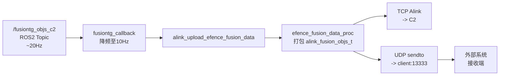

# 0xEA 融合目标 UDP 转发方案

## 1. 架构




## 2. 修改文件清单


| 文件                                              | 类型  | 说明                                     |
| ----------------------------------------------- | --- | -------------------------------------- |
| `src/srv/alink/command/efence/alink_efence.cpp` | 修改  | UDP socket 创建 + sendto + 配置自动拷贝 (~75行) |
| `config/tools/udp_forward.json`                 | 新增  | 默认配置模板 (仓库中, 首次启动自动拷贝到运行时路径)           |
| `test/test_udp_0xea_client.py`                  | 新增  | Python 接收端示例 (310行, 完整注释, 供客户参考)       |
| `test/test_udp_0xea_sender.py`                  | 新增  | Python 模拟发送端 (174行, 无真实目标时测试)          |
| `docs/0xEA_UDP_融合目标数据接口说明.md`                   | 新增  | 客户/测试使用说明文档                            |


## 3. C++ 实现细节

### 3.1 新增全局变量 (line 55-59)

```cpp
static int          g_udp_fwd_sock    = -1;
static struct sockaddr_in g_udp_fwd_addr = {};
static bool         g_udp_fwd_enabled = false;
#define UDP_FWD_CFG_PATH     "/home/skyfend/config/udp_forward.json"
#define UDP_FWD_CFG_DEFAULT  "/home/skyfend/workspace/ptz100_agx/config/tools/udp_forward.json"
```

### 3.2 udp_forward_init() (line 796-872)

- 先尝试打开运行时配置 `/home/skyfend/config/udp_forward.json`
- 不存在时自动从仓库默认配置 `config/tools/udp_forward.json` 拷贝
- 用 cJSON 解析 `enabled`, `client_ip`, `client_port`
- 创建 UDP DGRAM socket, 填充目标地址

### 3.3 udp_forward_send() (line 857-865)

- 非阻塞 `sendto(MSG_DONTWAIT)` 发送已打包的二进制数据
- 在 `efence_fusion_data_proc` return 前调用 (line 903)
- 数据已在 `pbyBuffer` 中打包好, 零额外开销

### 3.4 调用链

```
alink_efence_init()
    -> udp_forward_init()          // 读配置, 创建socket

efence_fusion_data_proc()          // 0xEA 打包回调
    -> memcpy(pbyBuffer, ...)      // 打包到缓冲区
    -> udp_forward_send(pbyBuffer) // UDP 转发
    -> return pkt_len              // 继续 TCP Alink 发送
```

## 4. 数据格式

原始二进制, 小端序, `#pragma pack(1)` 紧凑排列:

```
包头 (18B): [timestamp:8B][fusion_tracker_num:2B][reserve:8B]
目标 (286B x N): 每个 alink_fusion_obj_item_t
总包长 = 18 + 286 * N
```

详细字段定义见 `docs/0xEA_UDP_融合目标数据接口说明.md`

## 5. JSON 配置

```json
{
    "enabled": true,
    "client_ip": "127.0.0.1",
    "client_port": 13333
}
```

- 运行时路径: `/home/skyfend/config/udp_forward.json`
- 默认模板: `config/tools/udp_forward.json` (仓库中)
- 首次启动自动拷贝, 换 AGX 无需手动操作
- 修改配置后需重启 ptz100_ros 生效

## 6. 测试结果

### 6.1 端到端验证 (模拟发送端 -> 接收客户端)

- 发送: 30 帧, 5 目标/帧, 100ms 间隔 (10Hz)
- 接收: 30 帧全部正确接收, **0 丢帧**
- 包大小: 1448B (18 + 286*5), 完全匹配
- 所有字段解析正确: id, 经纬高, 距离/方位/俯仰, 速度, 频率, 威胁等级等

### 6.2 结构体大小验证

- Python `struct.calcsize` = 286B/目标 = C 端 `sizeof(alink_fusion_obj_item_t)`
- 包头 `struct.calcsize` = 18B = C 端 `EFENCE_CMD_0XEA_MIN_PAYLOAD_LEN`

## 7. 自测步骤

```bash
# 1. 本机自测 (无真实目标时)
# 终端 1: 启动接收客户端
python3 test/test_udp_0xea_client.py

# 终端 2: 启动模拟发送端
python3 test/test_udp_0xea_sender.py --targets 3 --interval 0.1

# 2. 真实数据测试
# 确保 /home/skyfend/config/udp_forward.json 配置正确
# 重启 ptz100_ros, 有融合目标时客户端自动收到数据
```

## 8. 不影响项

- 现有 TCP Alink 通信 (0xEA 仍正常发给 C2)
- 无 UDP 目标时 (配置不存在/disabled) 主程序正常运行
- 不新增编译依赖 (cJSON/socket 头文件已在项目中)

