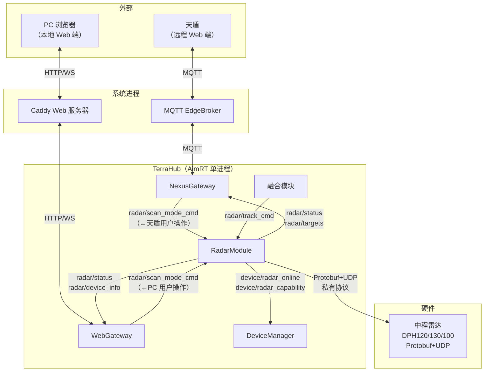
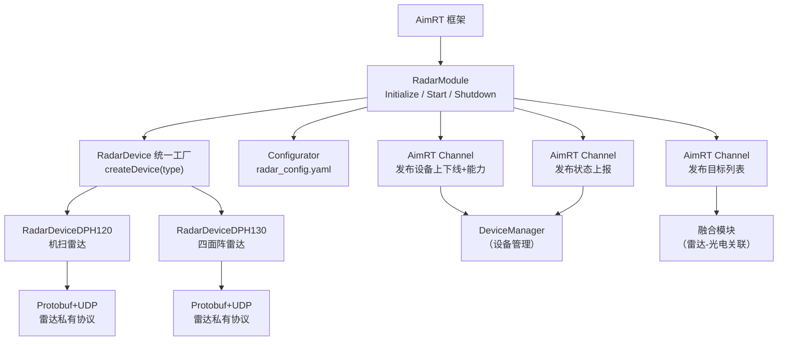
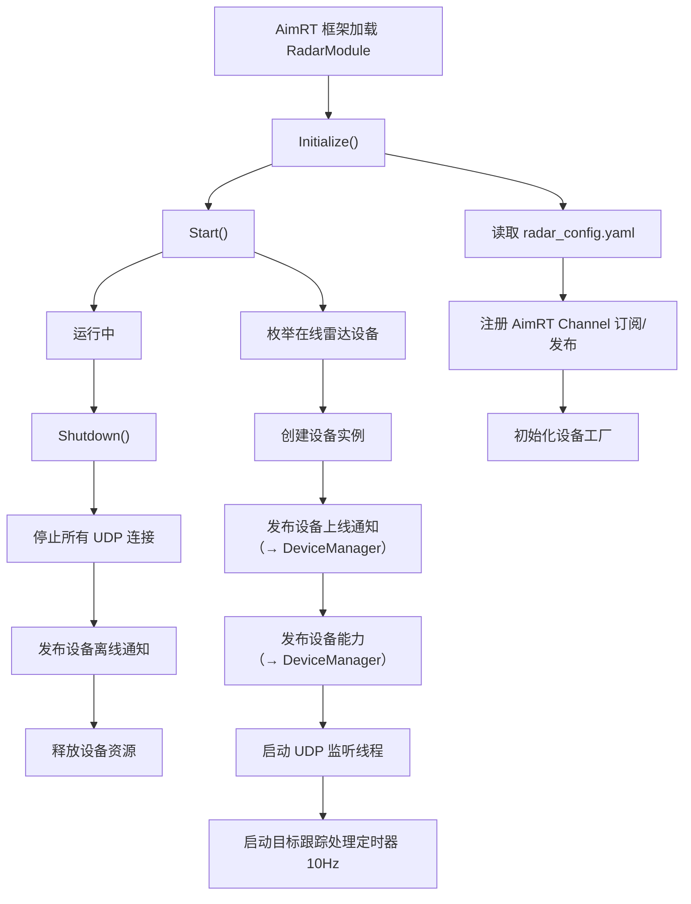
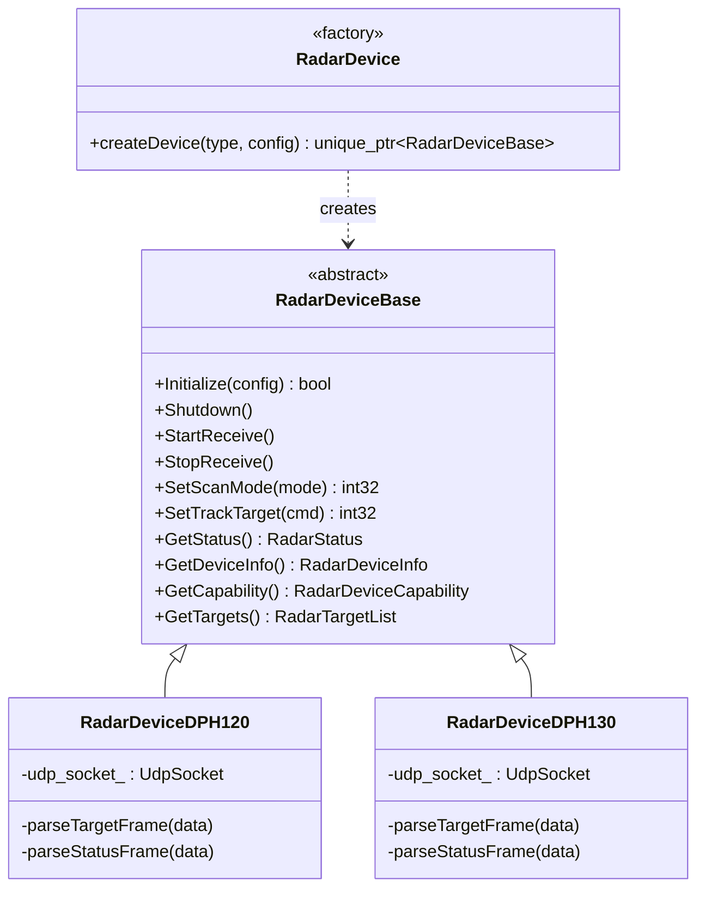
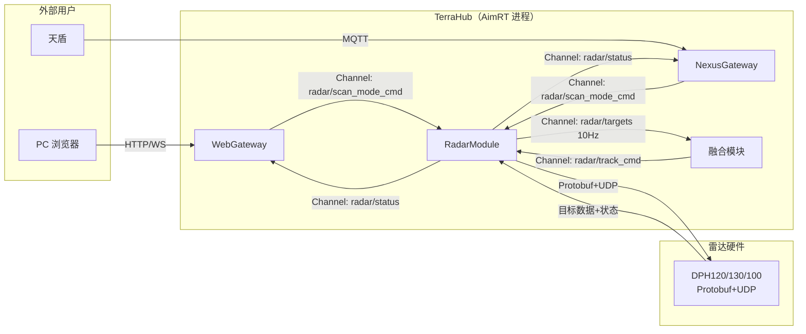
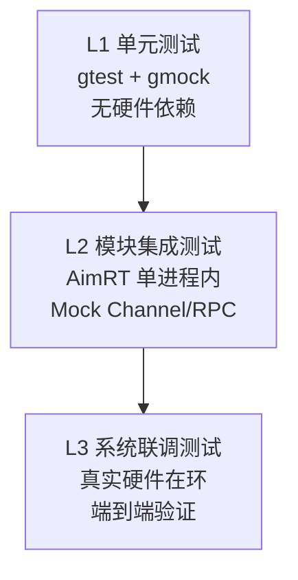

# DeviceAbs 中程雷达迁移方案设计

> **文档版本**：v2.0
> **更新日期**：2026-04-09
> **状态**：迁移方案设计（v2.0 修订：补充详细方案，与 PTZ 迁移方案对齐设计维度）
> **关联文档**：[DeviceAbs_PTZ设备抽象迁移方案](DeviceAbs_PTZ设备抽象迁移方案_f8dc8031.plan.md)、[视频直播服务设计文档](视频直播服务设计文档_f939159b.plan.md)

## 一、概述

### 1.1 迁移目标

将 `ptz100_agx` 中分散在 2 个 ROS2 节点（`dhp100_link`、`dhp100_tracker`）的中程雷达处理逻辑，重构为 AimRT Module 架构下的 **RadarModule**，统一管理 DPH120（机扫）、DPH130（四面阵）、DPH100 三种中程雷达设备的**设备接入、目标上报、状态管理**三条链路，并向 DeviceManager 发布设备上下线及能力信息。

> **注意**：`dhp100_link` / `dhp100_tracker` 的源码位于旧仓库 `ptz100_agx`，当前 TerraHub 仓库尚未包含这些代码。迁移时需从 `ptz100_agx` 中提取相关逻辑。

### 1.2 范围

| 设备 | 本次迁移 | 说明 |
|------|---------|------|
| **DPH120**（中程机扫雷达） | 优先实现 | SSF200/SRP210 标配，机械旋转扫描 |
| **DPH130**（中程四面阵雷达） | 其次实现 | SRP200/SSF200 高配，电子扫描，四面阵 |
| **DPH100**（早期型号） | 兼容支持 | 老型号，协议兼容 DPH120 |

### 1.3 现状要点

> **待确认**：以下基于对 `ptz100_agx` 旧代码的初步理解，具体代码散落分析需在获取旧代码后细化。

| 维度 | 说明 |
|------|------|
| ROS2 节点 | `dhp100_link`（设备通信）、`dhp100_tracker`（目标跟踪处理） |
| 通信协议 | 雷达 ↔ AGX：Protobuf + UDP 私有协议 |
| 目标上报频率 | `dhp100_tracker` 主循环 `LOOP_FREQUENCY = 10.0` Hz |
| 支持设备枚举 | `SubDevType::DEV_TYPE_RADAR_DPH100` (8)、`DEV_TYPE_RADAR_DPH120` (12)、`DEV_TYPE_RADAR_DPH130` (13) |
| 雷视产品对应 | DPH120 → SRP210，DPH130 → SRP200 |

---

## 二、对外交互接口与能力清单

> RadarModule、NexusGateway、WebGateway **均为 TerraHub 内部的 AimRT Module**，运行在同一个 AimRT 进程中。RadarModule 不直接与天盾或 PC 浏览器通信，对外交互通过 Gateway 模块中转：
> - **天盾（远程）**：RadarModule → AimRT Channel → **NexusGateway**（内部 Module） → MQTT EdgeBroker → TailscaleClient → 天盾
> - **PC 浏览器（本地）**：RadarModule → AimRT Channel → **WebGateway**（内部 Module） → Caddy → Web 前端
> - 雷达原始数据通过 Protobuf + UDP 私有协议与中程雷达硬件通信
>
> RadarModule 与 Gateway 之间的 AimRT 通信**统一使用 SAPIENT 协议的 Protobuf 消息定义**（详见 §三 SAPIENT 协议对齐）。

### 2.1 RadarModule 发布的 AimRT Channel（其他模块可订阅）

| Channel Topic              | 消息类型 (protobuf)        | 频率      | 优先级      | 订阅方                                     | 说明                       |
| -------------------------- | ----------------------- | ------- | -------- | --------------------------------------- | ------------------------ |
| `radar/targets`            | `RadarTargetList`       | 10 Hz（`dhp100_tracker` 主循环 `LOOP_FREQUENCY=10.0`） | P-High   | 融合模块, NexusGateway（→天盾）               | 雷达目标列表（方位、距离、速度、RCS 等）  |
| `radar/status`             | `RadarStatus`           | 事件驱动（雷达心跳/状态包到达时发布） | P-Normal | DeviceManager, WebGateway（→PC）, NexusGateway（→天盾） | 雷达工作状态（在线、扫描模式、故障码）      |
| `radar/device_info`        | `RadarDeviceInfo`       | 低频      | P-Low    | DeviceManager, WebGateway（→PC）, NexusGateway（→天盾） | 设备详情（SN、IP、型号、固件版本）      |
| `device/radar_online`      | `RadarOnlineNotify`     | 事件触发    | P-High   | DeviceManager                           | 设备上线通知                   |
| `device/radar_offline`     | `RadarOfflineNotify`    | 事件触发    | P-High   | DeviceManager                           | 设备离线通知                   |
| `device/radar_capability`  | `RadarDeviceCapability` | 事件触发    | P-Normal | DeviceManager                           | 设备能力（探测距离、扇区数、扫描模式等）    |

### 2.2 RadarModule 订阅的 AimRT Channel（其他模块发布）

| Channel Topic              | 消息类型 (protobuf)     | 发布方          | 说明                   |
| -------------------------- | ------------------- | ------------ | -------------------- |
| `radar/scan_mode_cmd`      | `RadarScanModeCmd`  | WebGateway（←PC）/ NexusGateway（←天盾） | 设置扫描模式（全向/扇区/TAS）    |
| `radar/track_cmd`          | `RadarTrackCmd`     | 融合模块         | 启动/停止目标跟踪（TAS 模式）    |

### 2.3 RadarModule 提供的能力

| 能力               | 说明                                                      | 对应接口                              |
| ---------------- | ------------------------------------------------------- | --------------------------------- |
| 雷达设备接入           | 通过 Protobuf + UDP 协议连接 DPH120/DPH130/DPH100 中程雷达       | 内部协议栈                             |
| 目标实时上报           | 10 Hz 发布雷达探测目标（方位、距离、速度、RCS），供融合算法做雷达-光电关联              | `radar/targets`                   |
| 设备发现与状态管理        | 自动发现雷达设备，维护连接状态，发布上下线事件                                | `device/radar_online/offline`     |
| 设备能力上报           | 上报雷达型号对应的探测能力（探测距离、扇区数、支持扫描模式等），供 DeviceManager 维护全局设备表 | `device/radar_capability`         |
| 扫描模式切换           | 接收 WebGateway（←PC）/ NexusGateway（←天盾）转发的用户指令，切换雷达扫描模式   | `radar/scan_mode_cmd`             |
| TAS 跟踪支持         | 接收融合模块的跟踪指令，驱动雷达进入目标照射/跟踪模式                            | `radar/track_cmd`                 |
| 雷达工作状态上报         | 事件驱动发布扫描模式、工作状态（随雷达心跳/状态包到达），供 WebGateway 转发给 PC 浏览器、NexusGateway 经 MQTT 转发给天盾 | `radar/status`                    |

### 2.4 交互路径图



---

## 三、SAPIENT 协议对齐

### 3.1 SAPIENT 协议分层

SAPIENT 标准（BSI Flex 335 v2.0）包含两个独立层次：

| 层次 | 内容 | 是否可替换 |
| --- | --- | --- |
| **消息层（Message Schema）** | Protobuf 消息定义（`SapientMessage`、`Registration`、`StatusReport`、`DetectionReport`、`Task` 等） | **不可替换**——SAPIENT 的核心 |
| **传输层（Transport Binding）** | MQTT 是参考传输绑定 | **可替换**——AGX 内部使用 AimRT Channel/RPC（SHM/本地 IPC）替代 |

"统一使用 SAPIENT 协议"的含义：**所有模块间的 Protobuf 消息统一采用 SAPIENT 定义的消息结构（Schema），传输层根据场景选择不同机制。** NexusGateway 和 WebGateway 也是 TerraHub 内部的 AimRT Module，它们仅做传输适配（AimRT ↔ MQTT / HTTP），不做消息格式转换。

### 3.2 RadarModule 在 SAPIENT 体系中的角色

RadarModule 对应 SAPIENT 中的 **Sensor Edge Node**（传感器边缘节点），负责在本地完成雷达信号处理和目标跟踪，上报结构化目标信息。

| SAPIENT 消息类型 | 方向 | 标准含义 | RadarModule 对应概念 | 当前文档中的接口 |
| --- | --- | --- | --- | --- |
| **Registration** | Edge → Fusion | 节点注册（传感器类型、探测范围、扫描模式） | 雷达设备上线 + 能力上报 | `device/radar_online` + `device/radar_capability` |
| **RegistrationAck** | Fusion → Edge | 注册确认 | 天盾/PC 确认雷达注册 | 待定（新增） |
| **StatusReport** | Edge → Fusion | 周期状态上报（健康度、扫描模式） | 雷达状态上报 | `radar/status`、`radar/device_info` |
| **DetectionReport** | Edge → Fusion | 目标检测报告（方位、距离、速度、RCS、分类） | 雷达目标列表上报 | `radar/targets` |
| **Task** | Fusion → Edge | 任务下发（扫描模式切换、TAS 跟踪指令） | 扫描模式指令 / 跟踪指令 | `radar/scan_mode_cmd`、`radar/track_cmd` |
| **TaskAck** | Edge → Fusion | 任务确认 | 指令执行结果 | 待定（新增） |

### 3.3 对现有 Proto 设计的影响

> **说明**：RadarModule 不直接与天盾或 PC 浏览器通信，只需按 SAPIENT 规范定义好自身的 Protobuf 消息（`protocols/device/radar/`），供 NexusGateway / WebGateway / DeviceManager 等对接模块订阅使用。Gateway 与外部系统（天盾 MQTT、PC HTTP/WS）的协议转换由各 Gateway 负责人定义，不阻塞 RadarModule 的 Proto 开发。

当前 `protocols/device/radar/` 下的 Proto 文件需要根据 SAPIENT 标准重新设计：

| 影响范围 | 当前设计 | SAPIENT 对齐后 | 状态 |
| --- | --- | --- | --- |
| 目标上报格式 | 自定义 `RadarTargetList` | 对齐 SAPIENT `DetectionReport`（含 location、classification、confidence 标准字段） | **RadarModule 侧可先行定义，参考 SAPIENT 官方 Proto** |
| 状态上报格式 | 自定义 `RadarStatus` | 基于 SAPIENT `StatusReport` 扩展 | **RadarModule 侧可先行定义** |
| 消息封装 | 各消息独立 | 统一封装为 `SapientMessage`（含 `node_id`、`timestamp`、`oneof content`） | **RadarModule 侧可先行定义** |
| 扫描模式切换 | `RadarScanModeCmd` Channel | 对齐 SAPIENT `Task` 消息类型（可能改为 RPC，类似 PTZ 用户操作） | **RadarModule 侧可先行定义** |
| 设备注册流程 | `device/radar_online` 通知 | 增加 SAPIENT `Registration` → `RegistrationAck` 流程 | **RadarModule 侧可先行定义** |

### 3.4 SAPIENT 与雷达业务字段的映射分析

> **结论**：与 PTZ 不同，SAPIENT 对雷达类设备有较好的原生支持——`NodeType = NODE_TYPE_RADAR`，`DetectionReport` + `RangeBearing` 可表达方位、距离、仰角，`Signal` 可表达频率/脉冲等 RF 特征。但 **RCS（雷达散射截面积）** 在 SAPIENT 标准中没有命名字段，需通过 `TrackObjectInfo` 的 key-value 扩展或自定义消息承载。

| 雷达业务字段 | SAPIENT 标准机制 | 能否直接表达 | 方案 B 实现方式 |
|------------|---------------|-----------|-------------|
| 设备类型标识 | `Registration.NodeDefinition.NodeType` | `NODE_TYPE_RADAR` 直接可用 | 注册时设置 |
| 目标方位角 | `DetectionReport.RangeBearing.azimuth` | **可直接复用** | 复用标准字段 |
| 目标距离 | `DetectionReport.RangeBearing.range` | **可直接复用** | 复用标准字段 |
| 目标仰角 | `DetectionReport.RangeBearing.elevation` | **可直接复用** | 复用标准字段 |
| 目标速度 | `DetectionReport.ENUVelocity` | **可直接复用** | 复用标准字段 |
| RCS（散射截面积）| `DetectionReport.TrackObjectInfo` | key-value 扩展，精度有限 | 扩展：自定义 `RadarTarget.rcs_dbsm` |
| 目标分类 | `DetectionReport.classification` | **可直接复用** | 复用标准字段 |
| 扫描模式 | `StatusReport.mode` | 通用 string，可用 | 复用标准字段或扩展 |
| 扫描模式切换 | `Task.Command.mode_change` | **可直接复用** | 复用标准字段 |
| TAS 跟踪指令 | `Task.Command.look_at` / `follow` | 部分可用 | 需扩展 TAS 特有参数 |
| 故障码 | `StatusReport.status[]` | 通用 key-value | 扩展：自定义 `RadarStatus.fault_code` |

### 3.5 参考资料

见 PTZ 迁移方案文档 §13.8 参考资料列表。

---

## 四、目标架构

### 4.1 AimRT Module 设计

`RadarModule` 作为 AimRT Module，遵循 `Initialize` → `Start` → `Shutdown` 生命周期，统一管理所有中程雷达设备的**设备接入、目标上报、状态管理**。



### 4.2 Module 生命周期



### 4.3 统一设备工厂

> **待确认**：DPH120 和 DPH130 的协议差异程度决定是否需要不同子类。如果协议完全兼容，可用同一实现类通过配置区分。



**工厂类型**：

| 枚举值 | 设备类型 | SubDevType | 实现类 | 状态 |
|-------|---------|-----------|-------|------|
| `RADAR_DPH100` (8) | DPH100 早期型号 | `DEV_TYPE_RADAR_DPH100` | `RadarDeviceDPH120` (兼容) | 兼容 |
| `RADAR_DPH120` (12) | DPH120 机扫雷达 | `DEV_TYPE_RADAR_DPH120` | `RadarDeviceDPH120` | **优先** |
| `RADAR_DPH130` (13) | DPH130 四面阵雷达 | `DEV_TYPE_RADAR_DPH130` | `RadarDeviceDPH130` | **其次** |

---

## 五、控制链路与数据链路

### 5.1 Channel vs RPC 选型分析

| 接口 | 来源 | 频率 | 选型 | 理由 |
|------|------|------|------|------|
| `radar/targets` | RadarModule 发布 | **10 Hz**（主循环驱动） | **Channel** | 高频广播，融合模块不应阻塞雷达上报 |
| `radar/status` | RadarModule 发布 | 事件驱动（心跳包到达） | **Channel** | 多订阅者（DeviceManager、Gateway） |
| `radar/device_info` | RadarModule 发布 | 低频 | **Channel** | 一对多广播 |
| `radar/scan_mode_cmd` | Gateway 转发用户操作 | 用户操作（<1 Hz） | **Channel** | 与 PTZ 架构一致，Gateway 发布 Channel，RadarModule 订阅 |
| `radar/track_cmd` | 融合模块 | 事件触发 | **Channel** | 融合模块 fire-and-forget，不等待雷达确认 |
| 设备直控 RPC（校准等） | Gateway 直接调用 | 极低频 | **RPC** | 需要执行结果反馈 |

> **待确认**：`radar/scan_mode_cmd` 是否改用 **RPC**（用户设置扫描模式后需要成功/失败反馈）？当前暂定 Channel，待与领导对齐。如需反馈，可改为 RPC `RadarSetScanMode`。

### 5.2 控制路由

雷达的控制逻辑比 PTZ 简单——没有"引导节点"概念。扫描模式切换和 TAS 跟踪指令直接到达 RadarModule：



---

## 六、Protobuf 消息定义

Proto 文件按**设备类别**组织，放在 `protocols/device/radar/radar.proto`。与 PTZ 方案一致，采用统一文件而非按型号拆分（DPH120/DPH130 的差异在 C++ 工厂内部处理）。

> **说明**：RadarModule 不直接与天盾或 PC 浏览器通信，只需定义好自身的 SAPIENT Protobuf 消息，供 NexusGateway / WebGateway / DeviceManager 等对接模块订阅使用。

### 6.1 `protocols/device/radar/radar.proto`

> **待确认**：以下字段基于对 `ptz100_agx` 中 `dhp100_link` / `dhp100_tracker` 的初步理解和 SAPIENT `DetectionReport` 标准字段推导。具体字段需在获取旧代码后与实际数据结构对齐。

**目标数据**（RadarModule 发布，10 Hz）：

```protobuf
syntax = "proto3";
package terrahub.device.radar;

message RadarTarget {
  uint32 target_id = 1;              // 目标 ID（雷达内部分配）
  float azimuth_deg = 2;             // 方位角 deg（北偏东）
  float elevation_deg = 3;           // 仰角 deg
  float range_m = 4;                 // 距离 m
  float velocity_mps = 5;            // 径向速度 m/s（正=远离）
  float rcs_dbsm = 6;               // 雷达散射截面积 dBsm
  float detection_confidence = 7;    // 检测置信度 [0,1]
  uint32 classification = 8;         // 目标分类（0=未知 1=无人机 2=鸟 3=其他）
  float snr_db = 9;                  // 信噪比 dB
  float longitude = 10;              // 目标经度（若雷达支持定位）
  float latitude = 11;               // 目标纬度
  float altitude_m = 12;             // 目标海拔 m
  uint64 timestamp_ms = 13;          // 目标检测时间戳
}

message RadarTargetList {
  string device_sn = 1;
  uint64 timestamp_ms = 2;
  uint32 scan_cycle_id = 3;          // 扫描周期编号
  uint32 scan_mode = 4;              // 当前扫描模式（0=全向 1=扇区 2=TAS）
  repeated RadarTarget targets = 5;
  uint32 target_count = 6;
}
```

**设备状态**（RadarModule 发布，事件驱动）：

```protobuf
message RadarStatus {
  string device_sn = 1;
  uint64 timestamp_ms = 2;
  uint32 work_status = 3;            // 0=离线 1=在线 2=故障 3=初始化中
  uint32 scan_mode = 4;              // 0=全向 1=扇区 2=TAS
  uint32 fault_code = 5;             // 故障码（0=无故障）
  string fault_message = 6;          // 故障描述
  float temperature = 7;             // 设备温度 ℃
  uint32 rotation_speed_rpm = 8;     // 转速 rpm（仅机扫 DPH120 有效）
  uint32 active_panels = 9;          // 活跃面板数（仅四面阵 DPH130 有效，0-4）
  uint64 uptime_s = 10;              // 运行时长 s
}
```

**设备信息与管理**：

```protobuf
message RadarDeviceInfo {
  string device_sn = 1;
  uint32 device_type = 2;            // SubDevType 枚举
  string ip = 3;
  uint32 port = 4;
  string firmware_version = 5;
  string model = 6;                  // "DPH120" / "DPH130" / "DPH100"
  uint32 work_status = 7;
  uint32 scan_mode = 8;
  float max_range_m = 9;             // 最大探测距离 m
  uint32 sector_count = 10;          // 扇区数（四面阵为 4）
  uint64 timestamp_ms = 11;
}

message RadarOnlineNotify {
  string device_sn = 1;
  uint32 device_type = 2;
  string ip = 3;
  uint32 port = 4;
  string model = 5;
}

message RadarOfflineNotify {
  string device_sn = 1;
  uint32 device_type = 2;
}

message RadarDeviceCapability {
  string device_sn = 1;
  uint32 device_type = 2;
  string model = 3;
  float max_range_m = 4;             // 最大探测距离 m
  float min_range_m = 5;             // 最小探测距离 m
  float azimuth_coverage_deg = 6;    // 方位覆盖角 deg（全向=360，扇区<360）
  float elevation_coverage_deg = 7;  // 仰角覆盖范围 deg
  uint32 sector_count = 8;           // 扇区数
  bool support_tas = 9;              // 是否支持 TAS 跟踪
  repeated uint32 supported_scan_modes = 10; // 支持的扫描模式列表
  uint32 max_targets = 11;           // 最大同时跟踪目标数
  float range_resolution_m = 12;     // 距离分辨率 m
  float azimuth_resolution_deg = 13; // 方位分辨率 deg
}
```

**控制指令**：

```protobuf
message RadarScanModeCmd {
  string device_sn = 1;
  uint64 timestamp_ms = 2;
  uint32 scan_mode = 3;              // 0=全向 1=扇区 2=TAS
  float sector_start_deg = 4;        // 扇区模式：起始方位角 deg
  float sector_end_deg = 5;          // 扇区模式：结束方位角 deg
}

message RadarTrackCmd {
  string device_sn = 1;
  uint64 timestamp_ms = 2;
  uint32 ctrl_cmd = 3;               // 0=启动 TAS 跟踪 1=停止 TAS 跟踪
  uint32 target_id = 4;              // 要跟踪的目标 ID
  float target_azimuth_deg = 5;      // 目标方位角提示（TAS 指向）
  float target_range_m = 6;          // 目标距离提示
}

message RadarCmdResult {
  int32 code = 1;                    // 0=成功, 非0=错误码
  string message = 2;
  string device_sn = 3;
}
```

### 6.2 TerraHubMessage 信封中的 Radar 扩展（field 200+）

> **与 PTZ 文档 §13.6 对齐**：`TerraHubMessage.oneof content` 中 Radar 设备使用 field 200-299 区间。

```protobuf
// 在 protocols/common/terrahub_message.proto 的 oneof content 中追加：

    // ── Radar 设备扩展（field 200+）──
    terrahub.device.radar.RadarTargetList radar_targets = 200;
    terrahub.device.radar.RadarStatus radar_status = 201;
    terrahub.device.radar.RadarDeviceInfo radar_device_info = 202;
    terrahub.device.radar.RadarOnlineNotify radar_online = 203;
    terrahub.device.radar.RadarOfflineNotify radar_offline = 204;
    terrahub.device.radar.RadarDeviceCapability radar_capability = 205;
    terrahub.device.radar.RadarScanModeCmd radar_scan_mode_cmd = 210;
    terrahub.device.radar.RadarTrackCmd radar_track_cmd = 211;
    terrahub.device.radar.RadarCmdResult radar_cmd_result = 212;
```

---

## 七、目录结构

```
TerraHub/src/02_DevAbsLayer/01_Detector/Radar/
│
│   ── 公共文件（Module 入口 + 设备抽象 + 工厂）──
├── CMakeLists.txt
├── radar_module.h                     # RadarModule 类定义（AimRT Module）
├── radar_module.cpp                   # RadarModule 实现（Initialize/Start/Shutdown）
├── radar_config.yaml                  # 设备配置（设备列表、IP、端口等）
├── radar_device_base.h                # RadarDeviceBase 抽象基类
├── radar_device_factory.h             # RadarDevice 工厂
├── radar_device_factory.cpp
│
│   ── 中程雷达 DPH120（机扫）──
├── MiddleRangeRadar/
│   ├── dph120_radar_device.h          # DPH120 设备实现
│   ├── dph120_radar_device.cpp
│   ├── dph120_protocol.h              # DPH120 Protobuf+UDP 协议封装
│   ├── dph120_protocol.cpp
│   └── dph120_target_tracker.h        # 目标跟踪处理（从 dhp100_tracker 迁移）
│   └── dph120_target_tracker.cpp
│
│   ── 中程雷达 DPH130（四面阵）──（结构预留，待确认是否独立子类）
│   ├── dph130_radar_device.h
│   ├── dph130_radar_device.cpp

TerraHub/protocols/device/radar/        # Protobuf 消息定义（仓库级）
└── radar.proto                         # 雷达设备消息（目标+状态+设备信息+能力+控制）
```

> **待确认**：DPH130 四面阵是否需要独立实现类。如果与 DPH120 的 UDP 协议格式兼容，可复用 `dph120_*` 实现，仅通过配置区分（`sector_count=4`）。

---

## 八、配置文件设计

```yaml
radar:
  devices:
    - sn: "RADAR-DPH120-001"
      type: 12                          # DEV_TYPE_RADAR_DPH120
      ip: "192.168.1.200"
      port: 6000                        # UDP 数据接收端口
      model: "DPH120"
      max_range_m: 3000.0
      sector_count: 1                   # 机扫，单扇区

    - sn: "RADAR-DPH130-001"
      type: 13                          # DEV_TYPE_RADAR_DPH130
      ip: "192.168.1.201"
      port: 6001
      model: "DPH130"
      max_range_m: 5000.0
      sector_count: 4                   # 四面阵

  target_tracker:
    loop_frequency: 10.0                # 目标跟踪主循环频率 Hz（对齐旧代码 LOOP_FREQUENCY）
    max_targets: 200                    # 最大同时跟踪目标数
    target_timeout_s: 5.0               # 目标消失超时 s
```

> **与现有配置的关系**：旧架构中雷达配置分散在 `subDevicesCfg.yaml`（子设备列表）和 `sentryv_calibrate.yaml`（雷达位姿校准）中。新架构中雷达设备基础信息统一到 `radar_config.yaml`，位姿校准参数待与 DeviceManager 协调（可能归 DeviceManager 配置）。

---

## 九、代码迁移分析

> **待完善**：`dhp100_link` / `dhp100_tracker` 源码在 `ptz100_agx` 仓库，当前 TerraHub 仓库中没有这些代码。以下迁移分析基于对旧架构的理解和 PTZ 迁移经验推测，需在获取旧代码后逐项核实。

### 9.1 迁移映射（预估）

| 来源（ptz100_agx） | 迁移目标（TerraHub） | 说明 |
|------------------|-------------------|------|
| `dhp100_link` 主要逻辑 | `RadarModule` + `dph120_protocol.*` | 设备通信、UDP 收发、协议解析 |
| `dhp100_tracker` 主要逻辑 | `dph120_target_tracker.*` | 目标跟踪处理、航迹管理 |
| `dhp100_link` 中 ROS2 Topic 发布 | `RadarModule` AimRT Channel 发布 | 替换 ROS2 Topic 为 AimRT Channel |
| `dhp100_link` 中设备发现/心跳 | `RadarModule::Start()` 设备枚举 | 设备上下线管理 |
| `dhp100_tracker` 中目标数据 ROS2 发布 | `radar/targets` Channel 发布 | 10 Hz 目标上报 |
| Alink 上报（如有） | 废弃 | 新架构无 Alink |

### 9.2 迁移步骤

#### 阶段一：DPH120 机扫雷达（优先，P0）

| 步骤 | 工作内容 | 说明 |
|------|---------|------|
| 1 | 创建 RadarModule 骨架 | 新建 `radar_module.h/cpp`，实现 AimRT Module 生命周期 |
| 2 | 迁移 RadarDeviceBase 基类 | 定义抽象接口（接收、解析、状态查询） |
| 3 | 迁移 DPH120 设备通信 | 从 `dhp100_link` 提取 UDP 协议收发逻辑 |
| 4 | 迁移目标跟踪处理 | 从 `dhp100_tracker` 提取目标航迹管理逻辑 |
| 5 | 定义 Protobuf 消息 | 填充 `protocols/device/radar/radar.proto` |
| 6 | 替换 ROS2 Topic 为 AimRT Channel | 订阅/发布逻辑改为 AimRT Channel |
| 7 | 实现 DeviceManager 上报接口 | 发布 `device/radar_online`、`device/radar_capability`、`radar/status` |
| 8 | 编写 CMakeLists.txt | 链接 skyfendlibs 等依赖 |
| 9 | 集成测试 | 验证目标上报、状态上报、控制链路 |

#### 阶段二：DPH130 四面阵（待确认是否需要独立实现）

| 步骤 | 工作内容 | 说明 |
|------|---------|------|
| 1 | 评估 DPH130 与 DPH120 协议差异 | 决定复用还是新建子类 |
| 2 | 实现 DPH130 设备类（如需要） | `dph130_radar_device.*` |
| 3 | 扩展工厂注册 | 增加 `RADAR_DPH130` 分支 |
| 4 | 集成测试 | 验证四面阵目标上报 |

---

## 十、不迁移的部分

| 内容 | 原因 | 归属 |
|------|------|------|
| Alink 相关上报/控制 | 新架构无 Alink | 废弃 |
| C2 心跳/设备列表 | 新架构无 C2 app | 废弃 |
| 雷达-PTZ 引导逻辑（如 `radarGuide*`） | 属于融合算法逻辑 | → 融合模块 |
| 雷达目标到融合目标的关联 | 属于融合算法逻辑 | → 融合模块 |
| 雷达校准位姿管理 | 待确认归属 | **待确认**：归 DeviceManager 或 RadarModule |

---

## 十一、风险与依赖

| 风险/依赖 | 影响 | 缓解措施 |
|---------|------|---------|
| **旧代码不在 TerraHub 仓库中** | `dhp100_link` / `dhp100_tracker` 在 `ptz100_agx`，需先获取 | 从旧仓库 checkout 相关代码进行分析 |
| **DPH120 与 DPH130 协议差异不明** | 不确定是否需要两个设备实现子类 | 先实现 DPH120，获取 DPH130 硬件后评估复用程度 |
| **雷达校准位姿归属不明** | 旧架构在 `sentryv_calibrate`，新架构归属待定 | 与 DeviceManager 负责人协调 |
| **目标跟踪算法（dhp100_tracker）复杂度** | 航迹管理、关联逻辑可能较复杂 | 先整体迁移，后续优化 |
| **融合模块同步迁移** | RadarModule 上报目标后，融合模块需订阅处理 | RadarModule 先提供 Channel 接口，融合模块后续对接 |
| **Infra 层先行完成** | RadarModule 依赖 skyfendlibs 编译通过 | 按 Infra → Radar → 融合 顺序实施 |
| **雷达 Protobuf+UDP 私有协议文档** | 需从旧代码或硬件文档中提取协议格式 | 与硬件团队确认 DPH 系列通信协议文档 |

---

## 十二、测试与验证

> 与 PTZ 迁移方案 §14 保持一致的三层测试策略。

### 12.1 测试分层策略



| 层级 | 工具 | 运行环境 | 执行频率 | 覆盖目标 |
|------|------|---------|---------|---------|
| **L1 单元测试** | gtest + gmock | 开发机/CI，无硬件 | 每次编译 | 协议解析、数据转换、工厂模式 |
| **L2 模块集成测试** | gtest + AimRT MockChannel | AGX 开发板，无真实雷达 | 每日构建 | Channel 链路、消息序列化、目标上报流程 |
| **L3 系统联调测试** | 手动 + 自动化脚本 | AGX + 真实雷达硬件 | 里程碑节点 | 端到端目标检测、扫描模式切换、异常恢复 |

### 12.2 L1 单元测试用例

| 测试文件 | 测试项 | 验证内容 |
|---------|-------|---------|
| `radar_proto_test.cc` | Proto 序列化/反序列化 | `RadarTargetList` 含 10 个目标 → 序列化→反序列化，字段值一致 |
| | Proto 默认值 | 新建空 `RadarTarget`，所有字段为默认值 |
| | Proto 字段边界 | `azimuth_deg` 设置 0~360°，`range_m` 设置极限值 |
| `radar_device_factory_test.cc` | 工厂创建 DPH120 | `createDevice(RADAR_DPH120, config)` 返回正确实例 |
| | 工厂创建 DPH130 | `createDevice(RADAR_DPH130, config)` 返回正确实例 |
| | 未知设备类型 | `createDevice(999, config)` 返回 `nullptr` |
| `dph120_protocol_test.cc` | 目标报文解析 | 构造已知字节序列 → 解析出正确的方位角/距离/速度/RCS |
| | 状态报文解析 | 解析心跳包 → 正确提取扫描模式/故障码 |
| | 异常报文处理 | 短报文/校验错误 → 返回错误码，不崩溃 |
| | 控制指令打包 | 构造 `RadarScanModeCmd` → 序列化为 UDP 报文 → 字节对比预期 |

### 12.3 L2 模块集成测试用例

| 测试项 | 步骤 | 预期结果 |
|-------|------|---------|
| 目标上报 Channel | 启动 RadarModule → Mock 设备返回目标数据 | 收到 `radar/targets` Channel 消息，频率 ≈10Hz |
| 状态 Channel | Mock 设备发送心跳包 | 收到 `radar/status` Channel 消息 |
| 扫描模式切换 | 发布 `radar/scan_mode_cmd` Channel | Mock 设备的 `SetScanMode()` 被调用，参数匹配 |
| TAS 跟踪 | 发布 `radar/track_cmd` Channel | Mock 设备的 `SetTrackTarget()` 被调用 |
| 设备上线通知 | RadarModule 检测到设备连接 | 发布 `device/radar_online` + `device/radar_capability` |
| 设备离线通知 | Mock 设备断开 | 发布 `device/radar_offline` |

### 12.4 L3 系统联调测试用例

| 测试项 | 设备 | 步骤 | 通过标准 |
|-------|------|------|---------|
| 目标检测 | DPH120 | 开机等待目标 → 观察 `radar/targets` | 目标方位/距离/速度合理 |
| 扫描模式切换 | DPH120 | 下发扇区模式 → 观察 | `radar/status` 中扫描模式更新 |
| 设备断电恢复 | DPH120 | 拔电源 5s → 重插 | 离线通知 → 重新上线，目标上报恢复 |
| 多雷达并发 | DPH120+DPH130 | 同时接入 | 各自独立上报，SN 路由正确 |
| 长时间稳定性 | 任意雷达 | 连续运行 24h | 无内存泄漏、无崩溃、目标上报持续正常 |
| 目标上报频率 | 任意雷达 | 统计 10s 内 `radar/targets` 消息数 | 频率 9.5~10.5 Hz |

### 12.5 测试代码组织

```
src/02_DevAbsLayer/01_Detector/Radar/
├── radar_module.h
├── radar_module.cpp
├── radar_device_factory_test.cc       ← L1: 工厂
├── MiddleRangeRadar/
│   ├── dph120_radar_device.h
│   ├── dph120_radar_device.cpp
│   ├── dph120_protocol.h
│   ├── dph120_protocol.cpp
│   ├── dph120_protocol_test.cc        ← L1: 协议解析
│   └── dph120_target_tracker.h
│   └── dph120_target_tracker.cpp
└── test/
    ├── radar_proto_test.cc            ← L1: Proto 消息
    ├── radar_channel_test.cc          ← L2: Channel 链路
    └── radar_lifecycle_test.cc        ← L2: 设备生命周期
```

### 12.6 CMake 集成

```cmake
if(AIMRT_BUILD_TESTS)
  add_gtest_target(
    TEST_TARGET radar_module
    TEST_SRC
      radar_device_factory_test.cc
      MiddleRangeRadar/dph120_protocol_test.cc
      test/radar_proto_test.cc
      test/radar_channel_test.cc
      test/radar_lifecycle_test.cc
  )
endif()
```