# 视频直播服务设计文档

> **文档版本**：v2.0
> **更新日期**：2026-04-09
> **状态**：迁移方案设计（v2.0 修订：补充 Proto 定义、目录结构、测试策略、风险依赖，与 PTZ/Radar 对齐设计维度）
> **关联文档**：[DeviceAbs_PTZ设备抽象迁移方案](DeviceAbs_PTZ设备抽象迁移方案_f8dc8031.plan.md)、[中程雷达迁移方案设计](中程雷达迁移方案设计_9ad5dc6c.plan.md)

## 1. 功能说明

### 1. 定位与职责

视频直播服务（LiveStream）是 AimRT 架构下的一个**独立 App（Module）**，负责管理设备视频的「拉流 → 解码 → AI 处理 → 编码 → 推流 → 分发」全链路，并通过 **AimRT RPC/Channel** 对外提供直播控制与状态服务。**天盾**是我司对浏览器形态上位机的内部称呼，本质即 Web 端（页面在浏览器中运行），与本地 AGX 自带页面（如 sysmonit）相对。对外交互路径：PC 浏览器通过 **Caddy → WebGateway** 到达 LiveStream；天盾通过 **MQTT → NexusGateway** 到达 LiveStream。其设计是通用的、平台无关的，当前应用于 PTZ 设备，未来可扩展至多路监控摄像头等场景。

#### 1.1 核心职责

- **多设备并行管理**：支持同时接入 1～N 台 PTZ 设备（耐杰、和普、激光等），每台设备独立创建和维护视频 Pipeline，突破现有系统"同一时刻仅支持一台 PTZ"的限制
- **Pipeline 生命周期管理**：管理各设备视频 Pipeline（创建、启动、停止、重建），以 `{sn}` 为维度隔离
- **状态与能力维护**：维护全局直播能力（`live_capacity`）与各设备/各路流状态模型，主动上报或被动查询
- **指令路由**：接收外部指令（开始/停止推流、镜头切换等），按 `video_id` 精确路由到对应设备 Pipeline
- **双场景统一接入**：支持本地 Web（WebRTC 点播）和天盾远程（RTMP/WHIP 推流，经 NexusGateway/MQTT 触发）两种播放场景
- **设备热插拔感知**：运行中自动发现新设备上线或已有设备离线，动态创建/销毁 Pipeline

#### 1.2 与平台软件部的分工及通信路由

- **嵌入式（本方案中的 LiveStream）职责**：**设备侧视频流处理全链路**（拉流、解码、与 AI 的 SHM 帧接口、编码进 MediaMTX、按需转推等），**不包含 AI 算法本体**。天盾侧业务页面、账号体系、拉流播放及与业务平台的对接编排主要由**平台软件部**实现；AGX 提供**统一、与客户端形态无关**的直播能力接口（如 `live_capacity` / `live_start_push` 等）及底层管道。

**通信路由架构**（参见《AGX-天盾-PC 数据交互视图》）：

LiveStream 的控制指令、状态上报等**非视频流**通信通过两条 Gateway 路径处理：

```
PC 浏览器  ──────────────────▶ Caddy ──http/ws──▶ WebGateway ──AimRT RPC/Channel──▶ LiveStream
天盾(web端) ──Tailscale VPN──▶ MQTT EdgeBroker ──▶ NexusGateway ──AimRT RPC/Channel──▶ LiveStream
```

> **WebGateway** 负责 PC 浏览器（HTTP/WebSocket）的控制与状态通信；**NexusGateway** 负责天盾（MQTT）的控制与状态通信。LiveStream 无需区分来源，统一通过 AimRT RPC/Channel 接口处理。

**LiveStream 是否需要区分天盾与本地 Web？**
**不需要。** LiveStream 只暴露 AimRT RPC/Channel 接口，**不关心调用方来源**——PC 浏览器的 HTTP/WebSocket 由 **WebGateway** 处理，天盾的 MQTT 由 **NexusGateway** 处理。LiveStream **只处理「哪条指令、推哪路 `video_id`」**，状态上报通过 AimRT Channel 广播，WebGateway 订阅后转发给 PC 浏览器，NexusGateway 订阅后经 MQTT 转发给天盾。

#### 1.3 控制面 和 媒体面

通信类型	路由	说明
控制面|（PC 浏览器）	     | PC 浏览器 → Caddy → **WebGateway** → LiveStream	WebGateway 处理 PC 端 HTTP/WS
控制面|（天盾）	         | 天盾 → Tailscale → MQTT EdgeBroker → **NexusGateway** → LiveStream	NexusGateway 处理天盾 MQTT
媒体面|（视频流）	       | PTZ → LiveStream → MediaMTX ← RTSP/WebRTC ← 天盾/PC客户端	视频数据不经过 Gateway

### 2. 两种播放场景

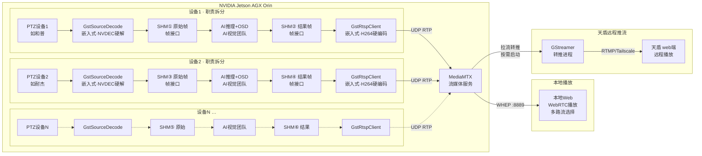


> **职责与接口**：**AI 推理、检测与 OSD 算法由 AI 视觉团队负责**；**拉流解码、共享内存读写封装、编码推流、MediaMTX 与两种播放分发由嵌入式（视频 Pipeline / LiveStream）负责**。**嵌入式与 AI 视觉之间的图像帧交互接口为共享内存（SHM）**——典型为「原始帧 SHM」供 AI 读入，「结果帧 SHM」供编码侧取图（与现网多段 SHM 设计一致），双方通过约定好的 Key/布局/生命周期协作，直播服务不替代 AI 模块实现，只编排全链路。
>
> **多设备并行架构**：每台设备独立一条 Pipeline（上图结构复制 N 份），各 Pipeline 使用独立的 UDP RTP 端口对推送至同一个 MediaMTX 实例。MediaMTX 通过不同路径（如 `ptz/zoom/ch0`、`ptz/ir/ch0`、`laser/zoom/ch0`）区分各路流。本地 Web 可同时或切换观看多路流。远程推流（天盾场景）从 MediaMTX 拉取已编码码流再转推（passthrough 不重编码），每路独立启停，不额外占用 GPU 编码资源。

#### 常驻边缘计算 + 按需云端分发

> RTSP 常驻 vs WebRTC 按需（类似点播）：

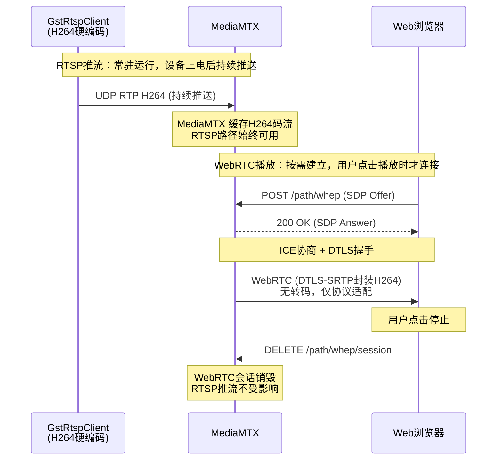


- **GstRtspClient → MediaMTX（常驻）**：设备 Pipeline 上电即启动，H264 编码后通过 UDP RTP 持续推送到 MediaMTX，无论是否有人观看都在运行。MediaMTX 的 RTSP 路径（如 `rtsp://127.0.0.1:9554/ptz/zoom/ch0`）始终可用
- **MediaMTX → Web 浏览器（按需/点播式）**：只有当用户在 Web 页面点击「Play」时，浏览器才通过 WHEP 协议向 MediaMTX 发起 WebRTC 握手（POST SDP Offer → 接收 SDP Answer → ICE/DTLS 协商）。**此过程不涉及转码**——MediaMTX 仅将已有的 H264 RTP 流从 UDP 传输层适配到 WebRTC 的 DTLS-SRTP 传输层，编码格式（H264）和码率不变，CPU/GPU 零额外开销
- 用户停止播放时 WebRTC 会话销毁，但底层 RTSP 推流不受影响，其他用户仍可随时发起新的 WHEP 播放请求


| 场景            | 协议                 | 运行模式         | 触发方式                                       | 是否转码                   | 延迟      | 多设备说明                                                                                                       |
| ------------- | ------------------ | ------------ | ------------------------------------------ | ---------------------- | ------- | ----------------------------------------------------------------------------------------------------------- |
| **RTSP 推流**   | UDP RTP → MediaMTX | **常驻**       | 设备上电自动启动                                   | H264 硬编码（仅一次）          | -       | 各设备各通道独立推流到不同 MediaMTX 路径                                                                                   |
| **本地 Web 播放** | WebRTC (WHEP)      | **按需（点播式）**  | 用户点击播放，浏览器发起 WHEP 握手                       | **否**，纯协议适配            | < 300ms | 客户端通过 `http://agx_ip:8889/{device}/{camera}/whep` 拉流（如 `http://127.0.0.1:8889/ptz/zoom/ch0/whep`），可同时打开多路画面 |
| **天盾远程推流**    | RTMP / WHIP        | **按需（指令触发）** | 天盾经 NexusGateway（MQTT）下发 `live_start_push` | **否**，passthrough 不重编码 | 1-3s    | 按 `video_id` 指定具体设备的流，经 Tailscale 推送至天盾侧                                                                    |


**远程推流触发全流程**：

```
天盾 Web 用户点击「开始直播」
       │
       ▼
① POST /api/live/start_push ──▶ Caddy ──▶ WebGateway（HTTP 入口）
       │                         参数：video_id, url_type=rtmp,
       │                               url=rtmp://tiandun/live/key
       ▼
② WebGateway ──AimRT RPC──▶ LiveStream 接收并解析指令
       │
       ▼
③ LiveStream 映射 video_id → MediaMTX 内部 RTSP 路径
       例：PTZ-HEPU-001/visible-0/main-0
         → rtsp://127.0.0.1:9554/ptz/zoom/ch0
       │
       ▼
④ LiveStream 启动一个独立的 GStreamer 转推进程
       │
       ▼
⑤ GStreamer 转推进程持续运行：
       从 MediaMTX 拉流(RTSP) → 剥离RTP → 重封装FLV → RTMP 推送
       │
       ▼
⑥ 天盾侧接收 RTMP 流 → 天盾 Web 拉流播放
```

**转推的本质——"换信封"**：转推进程**不做任何解码或重新编码**（passthrough），只是把 H264 码流从 **RTP 封装**（MediaMTX 内部传输）换到 **FLV/RTMP 封装**（经 Tailscale VPN 推送到天盾侧）。里面的"信"（H264 压缩数据）**原封不动**，因此 GPU 编码资源零消耗、CPU 开销极低（单路 < 2%）、画质与本地播放完全一致。GStreamer Pipeline 各元素详见 §2.3.3。

### 3. PTZ 设备类型参考

设备类型定义来自 `public/config/yamlConfig/ptzDevicesCfg.h` 中的 `PtzDeviceParam::PtzType` 枚举。当前系统采用**双槽位**架构——第 1 个设备为**雷视 PTZ**（常规云台），第 2 个设备为**激光 PTZ**（仅在激光设备存在时配置）：


| Code | 枚举值               | 说明                   | 适用槽位         |
| ---- | ----------------- | -------------------- | ------------ |
| 0    | `PTZ_NAIJIE`      | 耐杰近程 PTZ             | 雷视 PTZ（槽位 1） |
| 4    | `PTZ_HEPU`        | 和普 PTZ · 三型 Z50（非制冷） | 雷视 PTZ（槽位 1） |
| 5    | `PTZ_NAIJIE_MID`  | 耐杰中程 PTZ             | 雷视 PTZ（槽位 1） |
| 6    | `PTZ_HEPU_COOLED` | 和普 PTZ · 四型 Z50（制冷）  | 雷视 PTZ（槽位 1） |
| 1    | `PTZ_HEF100`      | 霍克眼激光 PTZ · HEF100   | 激光 PTZ（槽位 2） |
| 2    | `PTZ_HEP10`       | 霍克眼激光 PTZ · HEP10    | 激光 PTZ（槽位 2） |
| 3    | `PTZ_HEP21`       | 霍克眼激光 PTZ · HEP21    | 激光 PTZ（槽位 2） |
| 0xFF | `PTZ_UNKNOW`      | 未知 / 无效              | —            |


> **可扩展性**：LiveStream 的 `device_type` 字段直接对应上述枚举值（整型或字符串均可），新增 PTZ 型号只需在 `PtzType` 中添加新枚举、在 `livestream_config.yaml` 的 `devices` 段补充相机通道定义即可，**Pipeline 管理逻辑无需改动**——因为 Pipeline 的创建、编码、推流均以 `camera_index` 粒度驱动，与具体设备型号解耦。
>
> **槽位说明**：双槽位是现有 `ptzDevicesCfg.yaml` 的默认约定（`getFirstDevType()` / `getSecondDevType()`）。LiveStream 的 `pipeline_registry` 以 SN 为 key，**不限于两个槽位**——只要设备在线，无论几台都可创建独立 Pipeline 组，兼容未来多设备扩展。

### 4. 直播能力模型

参考 **[DJI Cloud API — 直播功能](https://developer.dji.com/doc/cloud-api-tutorial/cn/feature-set/dock-feature-set/live.html)** 的 `live_capacity` 设计，LiveStream 维护一个层级化的能力描述。三类核心接口（**状态上报**、**参数设置**、**参数获取**）的设计模式、`video_id` 层级标识等均参照 DJI 北向交互接口规范。`device_list` 为动态数组，随设备上下线实时更新：

```
live_capacity
├── available_video_number: 4          // 全局可选码流总数（所有在线设备之和）
├── coexist_video_number_max: 6        // 最大同时编码推流路数（= NVENC并发上限，见§7.1）
└── device_list[]                      // 在线设备列表（动态，可1～N台）
    │
    ├── [0] PTZ设备 - 和普
    │   ├── sn: "PTZ-HEPU-001"
    │   ├── type: 4                       // PTZ_HEPU（见 §1.3）
    │   ├── available_video_number: 2
    │   ├── coexist_video_number_max: 2
    │   └── camera_list[]
    │       ├── camera_index: "visible-0"
    │       │   └── video_list: [{video_index:"main-0", video_type:"normal", switchable:["normal","infrared"]}]
    │       └── camera_index: "infrared-0"
    │           └── video_list: [{video_index:"main-0", video_type:"infrared", switchable:["infrared","normal"]}]
    │
    └── [1] PTZ设备 - 耐杰
        ├── sn: "PTZ-NAIJIE-001"
        ├── type: 0                       // PTZ_NAIJIE（见 §1.3）
        ├── available_video_number: 2
        ├── coexist_video_number_max: 2
        └── camera_list[]
            ├── camera_index: "zoom-0"
            │   └── video_list: [{video_index:"main-0", video_type:"zoom", switchable:["zoom"]}]
            └── camera_index: "ir-0"
                └── video_list: [{video_index:"main-0", video_type:"infrared", switchable:["infrared"]}]
```

**video_id** 标识每一路流，格式为 `{sn}/{camera_index}/{video_index}`，例如：

- `PTZ-HEPU-001/visible-0/main-0`（和普可见光主码流）
- `PTZ-NAIJIE-001/zoom-0/main-0`（耐杰变焦主码流）

> **与现有系统的关键区别**：现有 PTZ 模块同一时刻仅支持接入一台 PTZ 设备（耐杰或和普二选一），而 LiveStream 的 `device_list` 是动态数组，支持多台设备同时在线，每台设备独立管理各自的 Pipeline 和编码资源。

### 5. 三类核心接口

LiveStream 通过 **AimRT RPC/Channel** 提供以下三类接口。PC 浏览器经 **WebGateway**（HTTP/WS）访问，天盾经 **NexusGateway**（MQTT）访问：

#### 5.1 直播状态上报（live_status）

App **主动**周期或事件驱动上报当前直播状态。上报内容覆盖**所有在线设备的所有流**。


| 字段             | 类型     | 说明                                          |
| -------------- | ------ | ------------------------------------------- |
| `video_id`     | string | 流标识 `{sn}/{camera_index}/{video_index}`     |
| `status`       | enum   | `idle` / `pushing` / `error`                |
| `video_type`   | string | 当前镜头类型，见下「`video_type` 与 `camera_index` 命名」 |
| `resolution`   | string | 当前分辨率，如 `1920x1080`                         |
| `bitrate_kbps` | int    | 当前码率 (Kbps)                                 |
| `fps`          | float  | 当前帧率                                        |
| `push_url`     | string | 当前推流目标地址（远程推流场景）                            |
| `error_msg`    | string | 错误信息（status=error 时有值）                      |


`**video_type` 与 `camera_index` 命名**：可见光在 `**video_type` 中取值为 `normal`**，与参考的 DJI Cloud API 等北向习惯一致（`normal` / `infrared` 对举，表示常规可见光相对红外）。`**camera_index`** 则使用 `**visible-0**` 等，强调物理通道名（与 MediaMTX 路径 `ptz/hepu/visible` 一致）。二者语义相同，**不是**要求把 `video_type` 写成 `visible`——若项目内部希望统一成 `visible`，需在北向协议与实现中**全局替换**并评估与 DJI 类接口的兼容性。

上报方式：

- **AimRT Channel `live/status`**：LiveStream 发布状态消息
- **WebGateway** 订阅后通过 WebSocket / HTTP 推送至 PC Web 浏览器
- **NexusGateway** 订阅后通过 MQTT 推送至天盾

#### 5.2 直播参数设置（live_set_param）

外部向 App 下发控制指令（PC 浏览器经 **WebGateway**，天盾经 **NexusGateway**），App 执行后返回结果。所有指令均通过 `**video_id` 精确定位到具体设备的具体流**。


| 方法                   | 参数                                       | 说明                                                                        |
| -------------------- | ---------------------------------------- | ------------------------------------------------------------------------- |
| **live_start_push**  | `video_id`, `url_type`(rtmp/whip), `url` | 开始远程推流（天盾经 NexusGateway/MQTT 触发，PC 经 WebGateway 触发）；从 MediaMTX 拉流转推，不重新编码 |
| **live_stop_push**   | `video_id`                               | 停止指定流的推流                                                                  |
| **live_lens_change** | `video_id`, `video_type`                 | 切换镜头（可见光/红外）                                                              |


#### 5.3 直播参数请求获取（live_get_param）

外部向 App 查询当前配置与设备能力。返回结果包含**所有在线设备**的能力与状态。


| 方法                    | 参数             | 返回                   | 说明                                             |
| --------------------- | -------------- | -------------------- | ---------------------------------------------- |
| **live_get_capacity** | 无              | `live_capacity` 完整结构 | 查询设备直播能力（设备列表、相机列表等）；响应字段说明与带注释示例见 **§3.3**    |
| **live_get_status**   | `video_id`（可选） | `live_status[]`      | 查询当前各路/指定路流的直播状态                               |
| **live_get_config**   | `video_id`     | 当前编码参数               | 查询指定流的编码配置（codec、bitrate、resolution、framerate） |


### 6. 底层组件依赖


| 组件                     | 来源                                            | 职责                                                                                                                               |
| ---------------------- | --------------------------------------------- | -------------------------------------------------------------------------------------------------------------------------------- |
| `**GstSourceDecode`**  | `skyfendlibs/gst_nv_deeps/gst_source_decode/` | RTSP 拉流 → **NVDEC 硬解** → RGB 帧回调                                                                                                 |
| `**GstRtspClient`**    | `skyfendlibs/gst_nv_deeps/gst_rtsp_client/`   | RGB 帧 → **H264 硬编码** → RTP/UDP 推流至 MediaMTX                                                                                      |
| `**ShmTransferFrame`** | `skyfendlibs/shm_transfer_frame/`             | **共享内存**传帧（设备 ↔ AI ↔ 推流，写入侧 `memcpy`，读取侧可零拷贝），多设备需按设备编号动态分配 key                                                                  |
| `**MediaMTX`**         | `deploy/mediamtx/`                            | 流媒体服务（**常驻运行**）：接收 UDP RTP，对外提供 RTSP(:9554) / WebRTC(:8889) / HLS(:8888) / RTMP(:1935)；远程推流时作为源端，由转推进程从中拉流；**WebRTC 会话按需建立，不转码** |
| **转推进程**（远程推流）         | GStreamer CLI 或 C API                         | 从 MediaMTX 拉流（RTSP）→ 转推至天盾（RTMP/WHIP，经 Tailscale），passthrough 不重编码，由 LiveStream 按需启停                                             |


**GStreamer 运行环境（已验证）**：

确保 NVIDIA Jetson AGX Orin已安装 **GStreamer**，文档涉及的所有插件均可用：


| 插件                   | 所属包                  | 用途                                           |
| -------------------- | -------------------- | -------------------------------------------- |
| `rtspsrc`            | gst-plugins-good     | 从 MediaMTX 拉取 RTSP 流（远程转推源端）                 |
| `rtph264depay`       | gst-plugins-good     | RTP H264 解包                                  |
| `rtph264pay`         | gst-plugins-good     | RTP H264 打包（编码后推到 MediaMTX）                  |
| `h264parse`          | gst-plugins-bad      | H264 码流解析                                    |
| `flvmux`             | gst-plugins-good     | FLV 封装（RTMP 推流需要 FLV 容器）                     |
| `rtmpsink`           | gst-plugins-bad      | RTMP 推流输出（经 Tailscale 推至天盾侧）                 |
| `nvv4l2decoder`      | nvidia-l4t-gstreamer | **NVIDIA NVDEC 硬件解码**（GstSourceDecode 底层）    |
| `nvv4l2h264enc`      | nvidia-l4t-gstreamer | **NVIDIA NVENC H264 硬件编码**（GstRtspClient 底层） |
| `udpsrc` / `udpsink` | gst-plugins-good     | UDP 收发（RTP 推流到 MediaMTX）                     |


> 验证命令：`gst-inspect-1.0 <插件名>` 可查看插件详情；`gst-launch-1.0 --version` 查看版本。

### 7. 多设备资源约束与扩展性

#### 7.1 硬件资源约束

NVIDIA Jetson AGX Orin 的硬件编解码能力决定了可同时接入的设备与流路数上限：


| 资源             | 限制                            | 说明                                                        |
| -------------- | ----------------------------- | --------------------------------------------------------- |
| **NVDEC 硬解码器** | 并发 **≤ 8 路** 1080p@30fps      | 每台设备每个相机占用 1 路解码器                                         |
| **NVENC 硬编码器** | 并发 **≤ 6 路** 1080p@30fps      | 每个 GstRtspClient 占用 1 路编码器，由 `max_concurrent_encoders` 限制 |
| **GPU/系统内存**   | **32GB**（统一内存）                | AI 推理 + 编解码 + CUDA 上下文 + SHM，需统筹规划                        |
| **SHM 共享内存**   | 每通道 **~48MB**（原始帧+结果帧各 ~24MB） | 满配 7 通道约 **336MB**，详见 3.5 节                               |
| **UDP 端口**     | `port_pool` 配置范围              | 每个相机通道占用 1 对端口（RTP + RTCP）                                |
| **AI 推理线程**    | 每个 SHM 原始帧段 **1 个线程**         | 满配 7 通道需 **7 个** AI 读取线程                                  |
| **网络带宽**       | 千兆以太网                         | 多路流同时推流时需注意上行带宽瓶颈                                         |


##### 关于 `coexist_video_number_max` / `max_concurrent_encoders` 中「6」的由来

- **不是运行时从某个 API「查询」到的固定返回值**：设计文档中的 **6** 与 `livestream_config.yaml` 里的 `**max_concurrent_encoders: 6`** 一致，属于**工程配置 + 硬件能力假设**；LiveStream 实现时应**读配置**（或启动时按平台探测/查表）再填入 `live_get_capacity`，而不是假定 GPU 会返回字面量 `6`。
- **依据来源**：① **NVIDIA Jetson** 官方文档（Jetson Linux Developer Guide、Multimedia API 等）中对 **NVENC 并发会话数**在典型分辨率/帧率下的说明（具体数字随 SoC、编码参数而变）；② **目标板卡实测**（同时起多路 `nvv4l2h264enc` / 完整 Pipeline，观察从第几路开始失败）；③ **产品配置**可按实测将上限改为 4、5、7 等，与 `max_concurrent_encoders` 同步。
- **与 `live_get_capacity` 的关系**：全局字段 `**coexist_video_number_max`** 应对齐当前生效的 `**max_concurrent_encoders`**（及资源策略）；表中「≤ 6 路 1080p@30fps」为**文档撰写时的参考假设**，部署前请按**实际型号与负载**复核。

#### 7.2 设计约束

- **编码器资源保护**：LiveStream 在创建新 Pipeline 前检查已用编码器数量，超出 `max_concurrent_encoders` 时拒绝创建并返回错误
- **Pipeline 隔离**：各设备 Pipeline 独立运行，一台设备故障（如 RTSP 断流、解码错误）不影响其他设备的正常推流
- **动态 live_capacity**：全局 `available_video_number` 和 `coexist_video_number_max` 随设备上下线实时更新，Web 端可据此动态渲染设备列表和播放窗口
- **端口复用**：设备离线后其端口归还到端口池，可被新上线设备复用

#### 7.3 典型部署规模


| 场景  | PTZ 设备数     | 相机通道总数    | 本地推流路数    | 远程推流路数 |
| --- | ----------- | --------- | --------- | ------ |
| 单设备 | 1（和普或耐杰）    | 2（可见光+红外） | 2         | 0-2    |
| 双设备 | 2（和普+耐杰）    | 4         | 4         | 0-4    |
| 满配  | 3（和普+耐杰+激光） | 7         | 6（受编码器限制） | 0-6    |


> **满配场景说明**：7 个相机通道超出 NVENC 并发编码器上限（6 路），LiveStream 在创建第 7 路编码 Pipeline 时会被拒绝。实际部署时可按优先级选择 6 路编码（例如低优先级的红外通道降级为仅解码不推流），具体策略由 `livestream_config.yaml` 中的设备优先级或人工配置决定。

---

## 2. 启动流程

### 1. AimRT App 生命周期

LiveStream 作为 AimRT Module，遵循标准生命周期：

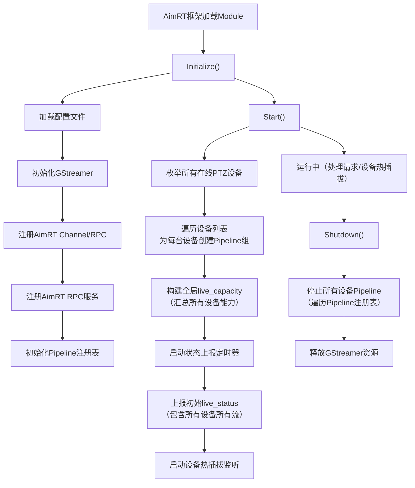


### 2. 启动时序

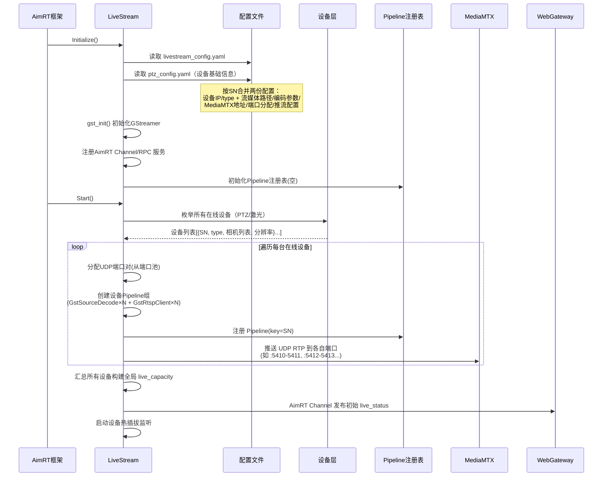


### 3. 视频 Pipeline 创建策略

LiveStream 通过 **Pipeline 注册表** 以设备 SN 为 key 管理所有 Pipeline，支持多台设备同时运行。

#### 3.1 Pipeline 注册表

```
pipeline_registry: map<string/*SN*/, DevicePipelineGroup>

DevicePipelineGroup {
    sn: string                          // 设备唯一标识
    device_type: uint8_t                // PtzType 枚举值（0=naijie, 4=hepu, 1=hef100 等，见 §1.3）
    status: enum                        // online / offline / error
    pipelines: map<string/*camera_index*/, SinglePipeline>
    cloud_forwarders: map<string/*video_id*/, ForwarderProcess> // 扩展字段，系统不仅支持本地推流，还支持远程分发（天盾）
}

SinglePipeline {
    camera_index: string                // "visible-0", "zoom-0" 等
    decoder: GstSourceDecode*           // 拉流解码实例
    encoder: GstRtspClient*             // 编码推流实例
    shm_raw_key: string                 // 原始帧共享内存标识（设备→AI）
    shm_result_key: string              // AI结果帧共享内存标识（AI→推流）
    udp_rtp_port: int                    // 推至 MediaMTX 的 UDP RTP 端口（RTCP 自动 +1）
    mediamtx_path: string               // MediaMTX 中的路径
    state: enum                         // 当前管道状态: idle / decoding / encoding / error
}
```

**实际工作流程示例**（以 HepuPtz001 的 visible-0 为例）：

1. **启动时**：
  - LiveStream 创建 `DevicePipelineGroup` for `"HepuPtz001"`
  - 在其中创建 `SinglePipeline` for `"visible-0"`
  - 分配 UDP 端口 5410
  - 设置 `mediamtx_path = "ptz/zoom/ch0"`
  - 注册到 `pipeline_registry["HepuPtz001"].pipelines["visible-0"]`
2. **用户点击「开始直播」**：
  - LiveStream 找到该 Pipeline
  - 调用 `decoder->start()` → 开始拉流
  - 调用 `encoder->start()` → 开始编码并推送到 :5410
  - 更新 `state = encoding`
  - 通过 AimRT Channel `live/status` 通知 WebGateway（→PC 浏览器）和 NexusGateway（→天盾）："visible-0 已开播"
3. **AI 模块介入**：
  - AI 服务订阅 `shm_raw_key` → 实时获取原始帧
  - 推理后写入 `shm_result_key` → 包含检测框坐标
  - GstRtspClient 从 `shm_result_key` 读取结果帧 → 编码推流

#### 3.2 RTSP 编码推流 Pipeline（常驻，每设备独立）

**每台在线设备**上电发现后即创建各自的「拉流 → 解码 → AI → 编码 → 推流至 MediaMTX」Pipeline 组并**常驻运行**，无论是否有客户端观看。WebRTC 会话由 MediaMTX 按需管理，不在此 Pipeline 范围内：

```
[设备1-和普]                            [设备2-耐杰]
GstSourceDecode(RTSP拉流)              GstSourceDecode(RTSP拉流)
  → SHM① → AI推理+OSD                    → SHM③ → AI推理+OSD
  → SHM② → GstRtspClient              → SHM④ → GstRtspClient
  → UDP RTP :5410 → MediaMTX          → UDP RTP :5412 → MediaMTX
    路径: ptz/zoom/ch0                    路径: ptz/zoom/ch0（端口不同）
    ↑ 以上为常驻部分                        ↑ 以上为常驻部分
    ↓ 以下为按需部分（用户点播时建立）         ↓ 以下为按需部分
  ← WebRTC WHEP ← 本地Web              ← WebRTC WHEP ← 本地Web
```

#### 3.3 远程转推（按需启动，逐流独立）

仅在收到 `live_start_push` 指令（天盾经 NexusGateway/MQTT 下发，或 PC 经 WebGateway 下发）后，针对指定 `video_id` 启动一个 GStreamer 转推进程，从 MediaMTX 拉取已编码 H264 码流并"换信封"推至天盾（passthrough，不重编码，详见 §1.2 "换信封"类比）：

```bash
# GStreamer 转推命令示例：rtspsrc 拉流 → 剥离RTP → 解析NAL → 封FLV → RTMP推送
gst-launch-1.0 rtspsrc location=rtsp://127.0.0.1:9554/ptz/zoom/ch0 latency=0 \
  ! rtph264depay ! h264parse ! flvmux streamable=true \
  ! rtmpsink location=rtmp://tiandun:1935/live/ptz_visible
```

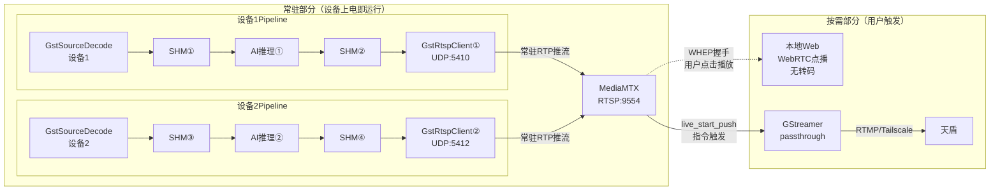


> 常驻/按需边界、passthrough 原理等已在 §2 详述，此处不再重复。
>
> **按需部分（On-Demand）**：
>
> - **本地观看**：Web 端通过 WHEP（WebRTC）直接从 MediaMTX 拉流（无转码，极低延迟）。
> - **远程转推**：天盾经 NexusGateway（MQTT）下发指令后，动态启动一个独立的 GStreamer 进程，把流经 Tailscale「搬运」到天盾侧。

#### 3.4 设备热插拔处理

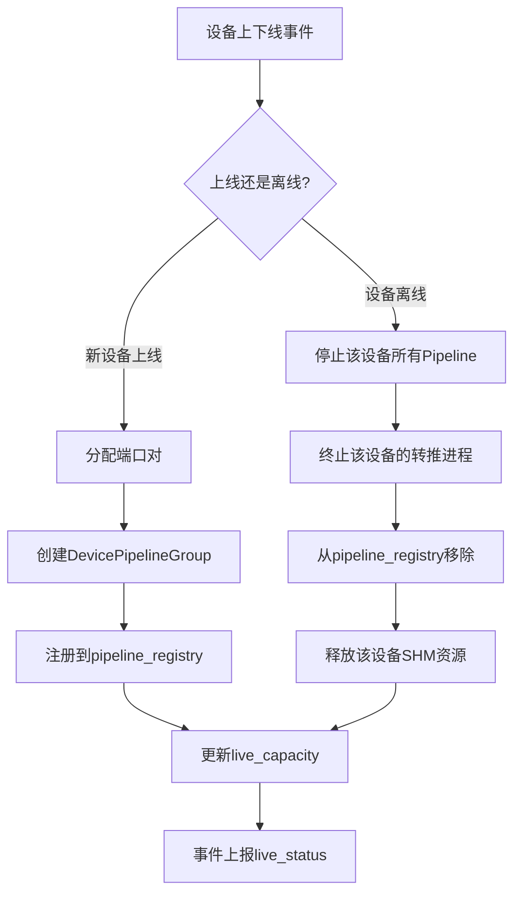


#### 3.5 共享内存（SHM）多设备管理

##### 现有系统的限制

当前 `ShmTransferFrame` 使用**硬编码宏**作为 SHM key：

```c
// shmTransferFrame.h — 当前定义（全局唯一，不区分设备）
#define SHM_TRANSFER_ZOOM_CAMERA0             "/shm_transfer_zoom_camera0"
#define SHM_TRANSFER_INFRARED_CAMERA0         "/shm_transfer_infrared_camera0"
#define SHM_TRANSFER_AI_RESULT_ZOOM_CAMERA0   "/shm_transfer_ai_result_zoom_camera0"
#define SHM_TRANSFER_AI_RESULT_INFRARED_CAMERA0 "/shm_transfer_ai_result_infrared_camera0"
```

所有设备（和普 `ptzDeviceHepu`、耐杰 `ptz_app`、激光 `laserDeviceHe`）以及 AI 模块（`ai_main`）、推流模块（`alg_app`）都硬编码使用相同的 key。**多台设备同时写入同一组 SHM 会导致数据覆盖和帧错乱，这是现有系统仅能支持单 PTZ 设备的根本原因之一**。

##### 多设备 SHM 命名规范

> 基于动态命名空间的共享内存多路复用机制

LiveStream 采用**按设备编号动态生成 SHM key** 的方式，每台设备的每个相机通道拥有独立的 SHM 段对（原始帧 + AI 结果帧）：

```
命名格式: /shm_{device_index}_{camera_type}_{channel}
          /shm_{device_index}_{camera_type}_{channel}_ai_result

device_index: 设备在 pipeline_registry 中的序号（0, 1, 2, ...）
camera_type:  与 camera_index 前缀一致（visible / zoom / infrared / wide）
channel:      0, 1, ...
```

示例（双设备场景）：


| 设备      | 相机  | 原始帧 SHM（设备→AI）      | AI 结果帧 SHM（AI→推流）             |
| ------- | --- | ------------------- | ----------------------------- |
| 设备0（和普） | 可见光 | `/shm_0_visible_0`  | `/shm_0_visible_0_ai_result`  |
| 设备0（和普） | 红外  | `/shm_0_infrared_0` | `/shm_0_infrared_0_ai_result` |
| 设备1（耐杰） | 变焦  | `/shm_1_zoom_0`     | `/shm_1_zoom_0_ai_result`     |
| 设备1（耐杰） | 红外  | `/shm_1_infrared_0` | `/shm_1_infrared_0_ai_result` |


##### 与 AI 模块的交互数据流

下图按**逻辑分区**从左到右：**拉流解码**（和普 / 耐杰两套 Pipeline）→ **SHM**（原始帧）→ **AI Module**（四路推理线程）→ **SHM AI**（结果帧）→ **推流编码**。跨阶段使用 `writeFrame` / `readNewFrame`，SHM key 与上文命名规范一致。

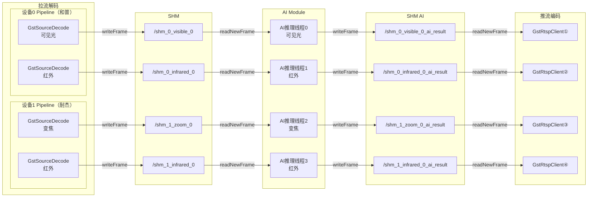


**交互说明**：

- 每台设备的 GstSourceDecode 解码后通过 `**writeFrame()`** 写入**各自的**原始帧 SHM
- AI Module 为每个 SHM 原始帧段启动**独立的读取线程**，通过 `**readNewFrame()`** 阻塞等待新帧
- AI 推理完成后将带 OSD 标注的结果帧写入对应的 **AI 结果帧 SHM**
- GstRtspClient 从 AI 结果帧 SHM 读取并编码推流
- **各设备的 SHM 完全独立，互不干扰**

##### SHM 内存开销

每个 SHM 段按最大 4K RGB 分配（`MAX_4K_FRAME_RGB_DATA_SIZE = 3840×2160×3 ≈ 24MB`）：


| 部署场景         | SHM 段数          | 总内存占用   |
| ------------ | --------------- | ------- |
| 单设备 2 通道     | 4（2 原始 + 2 结果）  | ~96 MB  |
| 双设备 4 通道     | 8（4 原始 + 4 结果）  | ~192 MB |
| 满配 3 设备 7 通道 | 14（7 原始 + 7 结果） | ~336 MB |


> NVIDIA Jetson AGX Orin 统一内存 32GB/64GB，SHM 开销占比较小，但仍需在资源约束章节（7.1）中将其纳入 GPU 显存/系统内存的统筹规划。

##### 设备上下线时的 SHM 生命周期


| 事件         | SHM 操作                                                                                       |
| ---------- | -------------------------------------------------------------------------------------------- |
| **新设备上线**  | 分配 `device_index` → 生成 SHM key → `**shm_open()` + `mmap()`** 创建段 → 通知 AI Module **启动新的读取线程** |
| **设备离线**   | 通知 AI Module **停止对应读取线程** → `**munmap()` + `shm_unlink()`** 释放段 → 回收 `device_index`          |
| **App 关闭** | 遍历 `pipeline_registry`，逐设备执行离线流程                                                             |


### 4. 配置文件结构

**此配置文件与现有配置的关系说明**：


| 配置文件                         | 归属                 | 位置                 | 说明                                                                  |
| ---------------------------- | ------------------ | ------------------ | ------------------------------------------------------------------- |
| `**ptz_config.yaml`**        | PtzModule 配置       | AimRT Module 配置目录  | PTZ 设备列表（sn、type、ip、RTSP URL），由 AimRT Configurator 加载               |
| `**mediamtx.yml`**           | MediaMTX 服务        | `deploy/mediamtx/` | MediaMTX **自身**的配置（RTSP/WebRTC/RTMP 端口、ICE 参数等），**非 LiveStream 管理** |
| `**livestream_config.yaml`** | **LiveStream（新建）** | AimRT Module 配置目录  | 直播服务**专属配置**，包含设备流媒体映射、端口分配、编码参数、远程推流策略等                            |


> **设计决策**：`livestream_config.yaml` 是 LiveStream 的**新建独立配置文件**，不复用 `mediamtx.yml`（后者管理 MediaMTX 服务本身）。其中的 `devices` 段可与现有 `ptzDevicesCfg.yaml` 中的设备列表联动——LiveStream 启动时先读取 `ptzDevicesCfg.yaml` 获取设备基础信息（SN、type、IP），再从 `livestream_config.yaml` 中匹配对应设备的流媒体配置（MediaMTX 路径、相机通道定义）。若 AimRT 架构统一配置管理，此文件也可作为 AimRT Module 配置的一部分（`aimrt_cfg.yaml` 内嵌或外部引用）。

```yaml
# livestream_config.yaml — LiveStream 专属配置（新建文件）
# 位置：AimRT Module 配置目录，或 ~/config/livestream_config.yaml
livestream:
  mediamtx: # MediaMTX 连接锚点
    ip: "127.0.0.1"
    rtsp_port: 9554
    webrtc_port: 8889

  # UDP端口分配池：每个相机通道占用一对端口（RTP偶数 + RTCP奇数）
  # LiveStream 启动时按设备顺序从池中依次分配
  port_pool:
    start: 5410                        # 必须为偶数
    end: 5430                          # (5430-5410)/2 = 最多 10 个相机通道

  # 多设备流媒体配置模板
  # 设备基础信息（SN、type、IP）来自现有 ptzDevicesCfg.yaml
  # 此处补充每台设备的流媒体相关配置（MediaMTX路径、相机通道定义）
  # 运行时 LiveStream 将两份配置按 SN 关联合并
  devices:
    - sn: "PTZ-HEPU-001"
      type: 4                           # PTZ_HEPU（和普三型Z50），见 §1.3
      cameras:
        - camera_index: "visible-0"
          mediamtx_path: "ptz/zoom/ch0"
          description: "可见光（AI处理后）"
        - camera_index: "infrared-0"
          mediamtx_path: "ptz/ir/ch0"
          description: "红外（AI处理后）"

    - sn: "PTZ-NAIJIE-001"
      type: 0                           # PTZ_NAIJIE（耐杰近程），见 §1.3
      cameras:
        - camera_index: "zoom-0"
          mediamtx_path: "ptz/zoom/ch0"
          description: "变焦（AI处理后）"
        - camera_index: "ir-0"
          mediamtx_path: "ptz/ir/ch0"
          description: "红外（AI处理后）"

    - sn: "LASER-HEP21-001"
      type: 3                           # PTZ_HEP21（霍克眼激光），见 §1.3
      cameras:
        - camera_index: "zoom-0"
          mediamtx_path: "laser/zoom/ch0"
          description: "激光粗跟踪"
        - camera_index: "zoom-1"
          mediamtx_path: "laser/zoom/ch1"
          description: "激光精跟踪"
        - camera_index: "ir-0"
          mediamtx_path: "laser/ir/ch0"
          description: "激光红外"

  cloud: # 云端转推策略
    enabled: false
    default_protocol: "rtmp"           # rtmp / whip
    forward_tool: "gstreamer"           # 转推工具: gstreamer（与项目技术栈统一）

  encoding: # 编码参数
    codec: "h264"
    encoder: "hardware"
    profile: "high"
    default_bitrate_bps: 2000000        # 与 default_quality=3(高清) 对应
    default_framerate: 25
    iframe_interval: 50
    max_concurrent_encoders: 6         # GPU硬编码器并发上限
```

> **端口分配策略**：LiveStream 在启动时从 `port_pool` 中按顺序为每个相机通道分配 UDP 端口对（偶数 RTP + 奇数 RTCP）。端口与 MediaMTX 路径的映射关系记录在 Pipeline 注册表中，并通过 `live_capacity` 对外暴露。
>
> **配置加载顺序**：`ptzDevicesCfg.yaml`（获取设备 SN、type、IP）→ `livestream_config.yaml`（按 SN 匹配流媒体配置）→ 运行时枚举在线设备 → 为在线设备分配端口并创建 Pipeline。

---

## 3. 交互时序

### 1. 直播状态上报

LiveStream 以两种方式上报 `live_status`（覆盖**所有在线设备的所有流**）：

- **周期上报**：每 **5 秒**汇总一次各路流状态
- **事件上报**：Pipeline 状态变化（启动/停止/异常）时**即时上报**

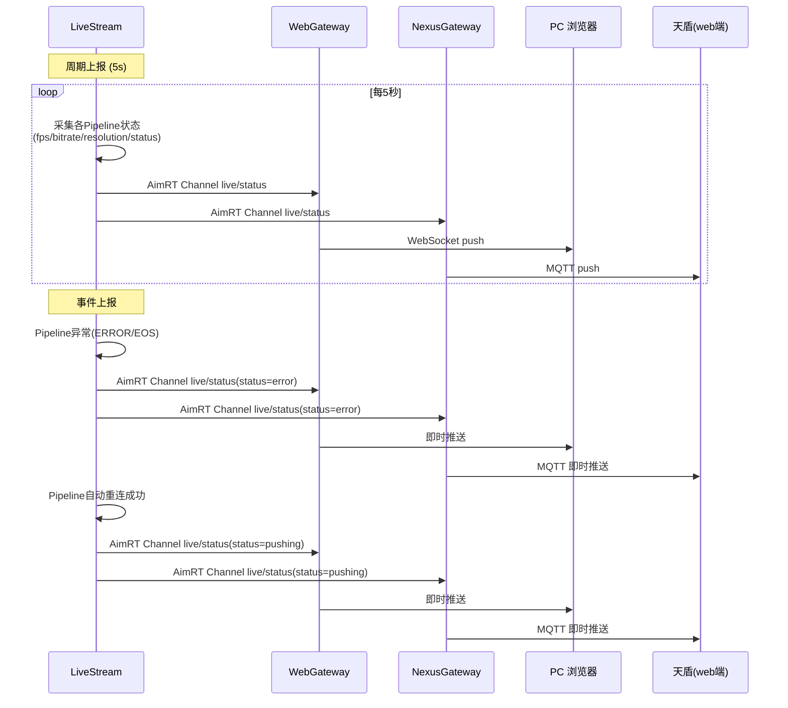


**live_status 上报数据示例：**

```json
{
  "timestamp": 1710000000000,
  "streams": [
    {
      "video_id": "PTZ-HEPU-001/visible-0/main-0",
      "status": "pushing",
      "video_type": "normal",
      "resolution": "1920x1080",
      "bitrate_kbps": 4000,
      "fps": 25.0,
      "push_url": "",
      "error_msg": ""
    },
    {
      "video_id": "PTZ-HEPU-001/infrared-0/main-0",
      "status": "pushing",
      "video_type": "infrared",
      "resolution": "640x512",
      "bitrate_kbps": 1500,
      "fps": 25.0,
      "push_url": "",
      "error_msg": ""
    },
    {
      "video_id": "PTZ-NAIJIE-001/zoom-0/main-0",
      "status": "pushing",
      "video_type": "zoom",
      "resolution": "1920x1080",
      "bitrate_kbps": 2000,
      "fps": 25.0,
      "push_url": "",
      "error_msg": ""
    },
    {
      "video_id": "PTZ-NAIJIE-001/ir-0/main-0",
      "status": "idle",
      "video_type": "infrared",
      "resolution": "640x480",
      "bitrate_kbps": 0,
      "fps": 0,
      "push_url": "",
      "error_msg": ""
    }
  ]
}
```

### 2. 直播参数设置

#### 2.1 开始推流（天盾远程场景）

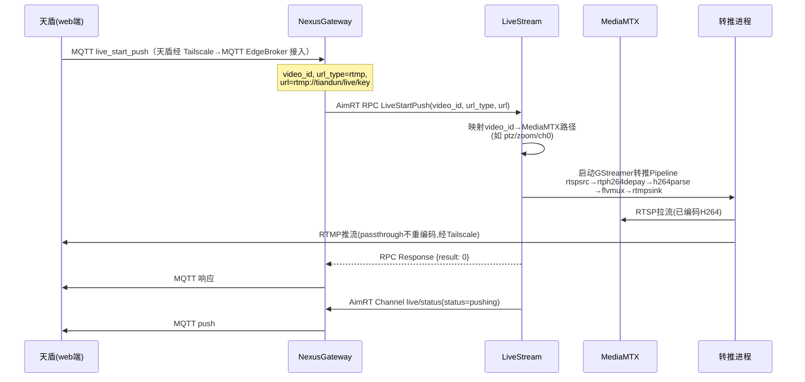


#### 2.2 停止推流

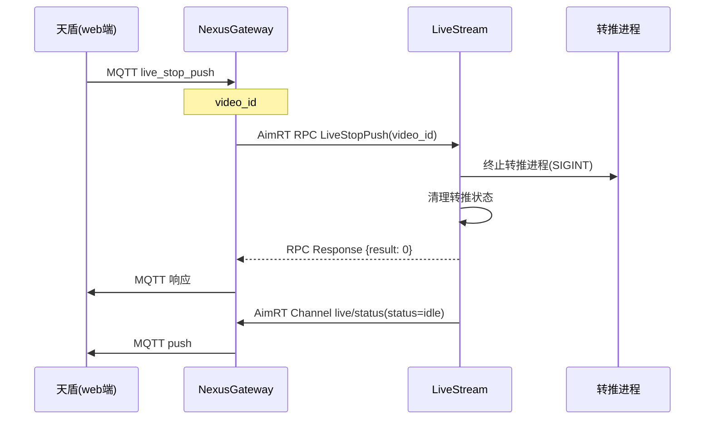


#### 2.3 镜头切换

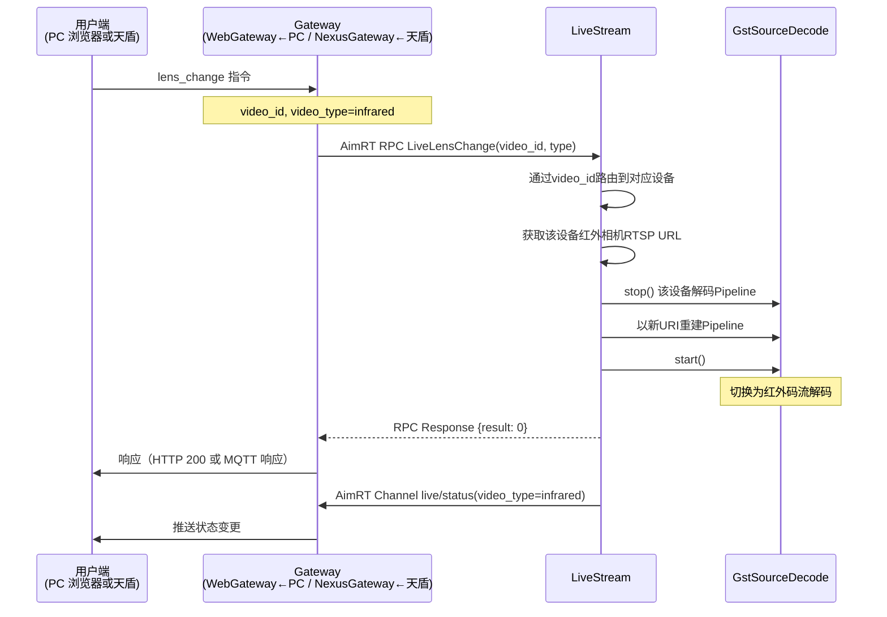


### 3. 直播参数请求获取

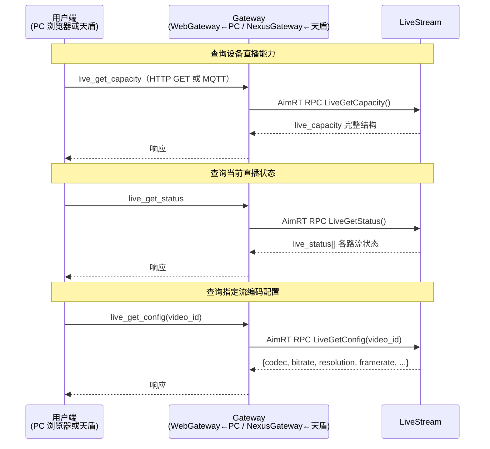


**live_get_capacity 响应示例：**

行尾 `//` 仅作文档说明；AimRT RPC 响应和 Gateway 对外 HTTP 响应中不含注释。

```jsonc
{
  "available_video_number": 4,       // 全局：当前可播流总数（本例 和普2路 + 耐杰2路）
  "coexist_video_number_max": 6,     // 全局：整机最多同时编码推流路数，对齐 max_concurrent_encoders / §7.1
  "device_list": [                    // 在线设备列表，随上下线变化
    {
      "sn": "PTZ-HEPU-001",           // 设备 SN，拼 video_id 第一段
      "type": 4,                      // PtzType 枚举值：4 = PTZ_HEPU（见 §1.3）
      "status": "online",             // 直播模块视角的在线状态
      "available_video_number": 2,    // 本设备可播流路数（可见光 + 红外）
      "coexist_video_number_max": 2,  // 本设备并发推流上限
      "camera_list": [                // 物理/逻辑相机通道
        {
          "camera_index": "visible-0",              // 通道名 = video_id 第二段
          "available_video_number": 1,              // 该通道下可播 video 条数
          "coexist_video_number_max": 1,
          "video_list": [
            {
              "video_index": "main-0",              // 码流名 = video_id 第三段
              "video_type": "normal",               // 可见光（北向用 normal，与 infrared 对举；非 visible，见 §5.1）
              "switchable_video_types": ["normal", "infrared"]  // 可切换到红外（另一路相机）
            }
          ]
        },
        {
          "camera_index": "infrared-0",           // 和普红外通道
          "available_video_number": 1,
          "coexist_video_number_max": 1,
          "video_list": [
            {
              "video_index": "main-0",
              "video_type": "infrared",             // 当前：红外
              "switchable_video_types": ["infrared", "normal"]  // 可切回可见光（另一路相机）
            }
          ]
        }
      ]
    },
    {
      "sn": "PTZ-NAIJIE-001",           // 第二台设备：耐杰
      "type": 0,                      // PtzType 枚举值：0 = PTZ_NAIJIE（见 §1.3）
      "status": "online",
      "available_video_number": 2,    // 变焦 + 红外 共 2 路
      "coexist_video_number_max": 2,
      "camera_list": [
        {
          "camera_index": "zoom-0",               // 耐杰变焦通道
          "available_video_number": 1,
          "coexist_video_number_max": 1,
          "video_list": [
            {
              "video_index": "main-0",
              "video_type": "zoom",
              "switchable_video_types": ["zoom"]      // 变焦与红外分通道，此处不可切到 ir
            }
          ]
        },
        {
          "camera_index": "ir-0",                 // 耐杰红外通道（与 zoom 分通道）
          "available_video_number": 1,
          "coexist_video_number_max": 1,
          "video_list": [
            {
              "video_index": "main-0",
              "video_type": "infrared",
              "switchable_video_types": ["infrared"]  // 仅红外，不与 zoom 在同条 video 上互切
            }
          ]
        }
      ]
    }
  ]
}
```

**响应字段说明（阅读顺序）**

1. **顶层**：`available_video_number` = 当前所有在线设备**可选择的码流总数**；`coexist_video_number_max` = **整机**最多同时**编码推流**路数（与 `max_concurrent_encoders`、§7.1 一致）；`device_list` = 在线设备数组。
2. **设备级**：`sn` / `type` / `status` 标识设备；`available_video_number` = **该设备**有几路可播流；`coexist_video_number_max` = **该设备维度**下并发推流上限（与全局含义层级不同）。
3. **相机级**：`camera_index` 对应 `video_id` 的中间段；`video_list` 中每条对应 `video_id` 末段的 `video_index`（常为 `main-0`）。
4. **码流级**：`video_type` = 当前镜头类型（可见光为 `**normal`**，与 `camera_index` 的 `visible-0` 同义，命名差异见 §5.1）；`switchable_video_types` = `live_lens_change` 允许切换到的类型列表。
5. **拼 `video_id`**：`{sn}/{camera_index}/{video_index}`，例如 `PTZ-HEPU-001/visible-0/main-0`。本接口**不包含**当前码率、分辨率、是否在推流——见 `live_get_status` / `live_get_config`。

> **说明**：全局 `available_video_number`（如 4）与单设备下的数字（如每设备 2）是**不同层级**的汇总关系；全局 `coexist_video_number_max`（如 6）与单设备 `2` 不可直接相加减推断「剩余设备数」。

### 4. LiveStream 接口汇总（AimRT RPC/Channel）

LiveStream 通过 AimRT RPC 接收控制指令，通过 AimRT Channel 广播状态。PC 浏览器经 **WebGateway**（HTTP/WS）访问，天盾经 **NexusGateway**（MQTT）访问。

**AimRT RPC 方法（Gateway → LiveStream）：**


| RPC 方法                | 类型   | 调用方                                | 说明                |
| --------------------- | ---- | ---------------------------------- | ----------------- |
| `**LiveGetCapacity`** | 参数获取 | WebGateway（←PC）/ NexusGateway（←天盾） | 查询设备直播能力（所有在线设备）  |
| `**LiveGetStatus`**   | 参数获取 | WebGateway（←PC）/ NexusGateway（←天盾） | 查询当前直播状态（所有流或指定流） |
| `**LiveGetConfig`**   | 参数获取 | WebGateway（←PC）/ NexusGateway（←天盾） | 查询指定流编码配置         |
| `**LiveStartPush`**   | 参数设置 | WebGateway（←PC）/ NexusGateway（←天盾） | 开始远程推流            |
| `**LiveStopPush`**    | 参数设置 | WebGateway（←PC）/ NexusGateway（←天盾） | 停止推流              |
| `**LiveLensChange**`  | 参数设置 | WebGateway（←PC）/ NexusGateway（←天盾） | 切换镜头（可见光/红外）      |


**AimRT Channel（LiveStream → Gateway / 其他 Module）：**


| Channel Topic     | 方向                                     | 订阅方                                                     | 说明                |
| ----------------- | -------------------------------------- | ------------------------------------------------------- | ----------------- |
| `**live/status`** | LiveStream → WebGateway / NexusGateway | WebGateway 转 WebSocket 给 PC 浏览器；NexusGateway 转 MQTT 给天盾 | 实时推送直播状态变更（周期+事件） |


### 5. 与 AimRT 内部通信

LiveStream 通过 AimRT Channel 和 RPC 与其他 Module 交互（替代原有 ROS2 Topic；注：新架构已无 C2 app 和 Alink 协议）：

**AimRT Channel（发布/订阅）：**


| Channel                   | 方向                                                | 说明                                                       |
| ------------------------- | ------------------------------------------------- | -------------------------------------------------------- |
| `**live/status`**         | LiveStream → WebGateway / NexusGateway / 其他Module | 直播状态广播（WebGateway 转 WS 给 PC 浏览器，NexusGateway 转 MQTT 给天盾） |
| `**live/control`**        | 其他Module → LiveStream                             | 内部控制指令（如 AI 模块请求切换码流）                                    |
| `**device/ptz_online`**   | PtzModule → LiveStream                            | **设备上线通知**（SN/type/IP/相机列表/分辨率）                          |
| `**device/ptz_offline`**  | PtzModule → LiveStream                            | **设备离线通知**                                               |
| `**ai/frame_ready`**      | AI Module → LiveStream                            | AI 处理完成通知（SHM 可读），携带 `device_index` 和 `camera_index`     |
| `**live/shm_register`**   | LiveStream → AI Module                            | 设备上线时通知 AI **新增 SHM 段**（key、分辨率等），AI 启动新读取线程             |
| `**live/shm_unregister`** | LiveStream → AI Module                            | 设备离线时通知 AI **释放对应 SHM 段**，AI 停止读取线程                      |


**AimRT RPC（请求/响应，WebGateway / NexusGateway 调用）：**


| RPC 方法                | 调用方 → 服务方                                      | 说明          |
| --------------------- | ---------------------------------------------- | ----------- |
| `**LiveGetCapacity`** | WebGateway（←PC）/ NexusGateway（←天盾）→ LiveStream | 查询设备直播能力    |
| `**LiveGetStatus`**   | WebGateway / NexusGateway → LiveStream         | 查询当前各路流直播状态 |
| `**LiveGetConfig`**   | WebGateway / NexusGateway → LiveStream         | 查询指定流编码配置   |
| `**LiveStartPush`**   | WebGateway / NexusGateway → LiveStream         | 开始远程推流      |
| `**LiveStopPush`**    | WebGateway / NexusGateway → LiveStream         | 停止远程推流      |
| `**LiveLensChange**`  | WebGateway / NexusGateway → LiveStream         | 切换镜头        |


---

### 文档结构速览

```
视频直播服务设计文档
│
├── §1 功能说明
│   ├── §1 定位与职责
│   │   ├── 1.1 核心职责（多设备并行、Pipeline 生命周期、指令路由、双场景、热插拔）
│   │   └── 1.2 与平台软件部的分工及通信路由（WebGateway→PC, NexusGateway→天盾）
│   ├── §2 两种播放场景
│   │   ├── 全链路数据流图（PTZ → 解码 → SHM → AI → 编码 → MediaMTX → 播放）
│   │   ├── 常驻 + 按需 双模架构（RTSP 常驻 / WebRTC 点播 / RTMP 天盾远程推流）
│   │   └── 远程推流触发全流程 + "换信封"类比
│   ├── §3 PTZ 设备类型参考（7 种型号、双槽位、可扩展）
│   ├── §4 直播能力模型（live_capacity、video_id 三段标识）
│   ├── §5 三类核心接口
│   │   ├── 5.1 直播状态上报（live_status）
│   │   ├── 5.2 直播参数设置（start_push / stop_push / lens_change）
│   │   └── 5.3 直播参数请求获取（get_capacity / get_status / get_config）
│   ├── §6 底层组件依赖（GstSourceDecode / GstRtspClient / SHM / MediaMTX / 转推进程）
│   └── §7 多设备资源约束与扩展性（NVDEC≤8 / NVENC≤6 / SHM 内存 / 典型部署规模）
│
├── §2 启动流程
│   ├── §1 AimRT App 生命周期（Initialize → Start → Shutdown）
│   ├── §2 启动时序（配置双源合并 → 设备枚举 → Pipeline 创建 → 状态上报）
│   ├── §3 视频 Pipeline 创建策略
│   │   ├── 3.1 Pipeline 注册表（DevicePipelineGroup / SinglePipeline）
│   │   ├── 3.2 RTSP 编码推流 Pipeline（常驻）
│   │   ├── 3.3 远程转推（按需 passthrough，经 WebGateway 触发）
│   │   ├── 3.4 设备热插拔处理
│   │   └── 3.5 共享内存（SHM）多设备管理（动态命名 / AI 交互 / 内存开销 / 生命周期）
│   ├── §4 配置文件结构（livestream_config.yaml 完整示例）
│
├── §3 交互时序
│   ├── §1 直播状态上报（周期 5s + 事件即时，含 JSON 示例）
│   ├── §2 直播参数设置（3 个时序图：开始/停止推流、镜头切换）
│   ├── §3 直播参数请求获取（live_get_capacity JSON 示例 + 逐层字段说明）
│   ├── §4 LiveStream 接口汇总（6 条 AimRT RPC + 1 条 AimRT Channel，WebGateway 映射 HTTP/WS）
│   └── §5 与 AimRT 内部通信（7 条 Channel + 6 条 RPC）
│
└── 附录
    ├── 参考资料
    ├── 缩略词说明（WHIP / WHEP / RTMP / RTSP / SHM / MediaMTX）
    └── 关于「天盾」与通信路由
```

### 核心要点总结


| #   | 要点                          | 说明                                                                                                                                                                                                                                     |
| --- | --------------------------- | -------------------------------------------------------------------------------------------------------------------------------------------------------------------------------------------------------------------------------------- |
| 1   | **多设备并行**                   | 以 `pipeline_registry`（key=SN）管理 N 台 PTZ 设备的独立 Pipeline，突破现有"仅支持 1 台"限制                                                                                                                                                                 |
| 2   | **双模流媒体**                   | **常驻**（编码 → UDP RTP → MediaMTX，上电即运行）+ **按需**（WebRTC 本地点播 / RTMP 天盾远程转推）                                                                                                                                                               |
| 3   | **全程不转码**                   | 本地 WebRTC 仅协议适配；远程转推 passthrough "换信封"（RTP→FLV），GPU 零额外开销                                                                                                                                                                              |
| 4   | **三类 AimRT RPC/Channel 接口** | 参考 DJI Cloud API：状态上报（AimRT Channel `live/status`）、参数设置（RPC `LiveStartPush`/`LiveStopPush`/`LiveLensChange`）、参数获取（RPC `LiveGetCapacity`/`LiveGetStatus`/`LiveGetConfig`），**WebGateway** 转 HTTP/WS 给 PC 浏览器，**NexusGateway** 转 MQTT 给天盾 |
| 5   | `**video_id` 三段标识**         | `{sn}/{camera_index}/{video_index}` 从设备→相机通道→码流精确定位每一路流                                                                                                                                                                                |
| 6   | **SHM 动态命名**                | `/shm_{device_index}_{camera_type}_{channel}` 解决硬编码 key 导致多设备帧覆盖问题                                                                                                                                                                     |
| 7   | **职责边界清晰**                  | 嵌入式=全链路 Pipeline；AI 算法=AI 视觉团队；天盾业务=平台软件部。LiveStream 不区分来源，统一暴露 AimRT RPC/Channel（WebGateway→PC，NexusGateway→天盾）                                                                                                                       |
| 8   | **硬件资源约束**                  | NVDEC≤8 路、NVENC≤6 路（1080p@30fps）；SHM 满配≈336MB；满配第 7 路编码被拒绝                                                                                                                                                                             |
| 9   | **设备热插拔**                   | 运行中自动感知上下线，动态创建/销毁 Pipeline + SHM + 端口，实时更新 `live_capacity`                                                                                                                                                                            |
| 10  | **配置双源合并**                  | `ptzDevicesCfg.yaml`（设备基础信息）+ `livestream_config.yaml`（流媒体配置），按 SN 关联                                                                                                                                                                  |


---

## 4. 迁移实施

### 1. 迁移来源


| 来源代码/模块                                                  | 迁移到 LiveStream 中的功能                                                               | 说明                                        |
| -------------------------------------------------------- | --------------------------------------------------------------------------------- | ----------------------------------------- |
| `public/gstNvDeeps/gstSourceDecode/`                     | Pipeline RTSP 拉流硬解码                                                               | 已迁移到 `skyfendlibs/gstNvDeeps/`，直接引用       |
| `public/gstNvDeeps/gstRtspClient/`                       | Pipeline H264 编码推流                                                                | 已迁移到 `skyfendlibs/gstNvDeeps/`，直接引用       |
| `public/shmTransferFrame/`                               | SHM 帧交互                                                                           | 已迁移到 `skyfendlibs/shmTransferFrame/`，直接引用 |
| `ros_ws/src/ptz_service/src/ptzDevice/ptzDeviceHepu.cpp` | 和普设备的拉流解码 + 推流线程逻辑（`visiblePushThread` / `thermalPushThread`）                     | 视频全链路归 LiveStream；设备控制归 PtzModule         |
| `src/app/ptz/ptz_app.cpp`                                | **耐杰设备的 RTSP 拉流解码**（`GstSourceDecode` 使用 + `ShmTransferFrame::writeFrame`）        | 嵌入式视频代码，迁移到 LiveStream                    |
| `src/app/alg_app/alg_app.cpp`                            | **耐杰设备的编码推流**（`GstRtspClient` + `image_get_thread` / `image_get_thread_infrared`） | 嵌入式视频代码，迁移到 LiveStream                    |


### 2. 与 PtzModule 的集成方式

LiveStream **不直接**操作 PTZ 设备硬件，而是通过 AimRT Channel 与 PtzModule 交互：

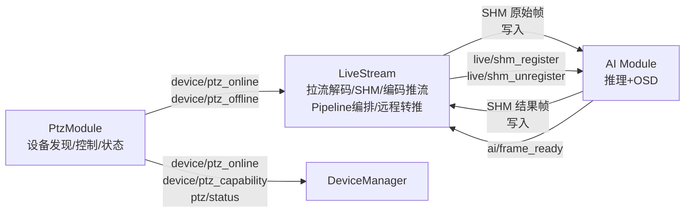


**职责边界**：

- **PtzModule**：设备发现、控制指令转发、设备状态上报、向 DeviceManager 上报设备能力。**不负责任何视频处理**
- **LiveStream**：完整视频全链路（RTSP 拉流解码 → SHM 原始帧写入 → AI 交互 → SHM 结果帧读取 → H264 编码推流 → MediaMTX），Pipeline 注册表管理、远程转推（天盾）、直播能力/状态维护
- **AI Module**：SHM 原始帧读取 → 推理 + OSD → SHM 结果帧写入
- **DeviceManager**：维护全局设备在线表和设备拓扑，提供设备查询 RPC

### 3. 实施顺序

```
① Infra 层（skyfendlibs/thirdpartylibs）            ← 已有方案
② Mediamtx 部署（deploy/mediamtx/）                  ← 已有方案
③ PtzModule（设备发现/控制/状态，不含视频）             ← DeviceAbs_PTZ设备抽象迁移方案
④ LiveStream（视频全链路：拉流→解码→SHM→编码→推流）  ← 本文档
```

依赖关系：④ 依赖 ③ 提供设备上下线通知（含 RTSP URL、分辨率），依赖 ① 提供 GStreamer/SHM 组件，依赖 ② 提供 MediaMTX 服务。

### 4. 激光 PTZ 视频（预留设计，暂不实现）

> 激光 PTZ（霍克眼 HEF/HEP）的控制和状态不在 PTZ 迁移方案范围内，但其视频接入应在 LiveStream 中预留设计。


| 维度       | 激光 PTZ                                               | 与和普/耐杰的差异                            |
| -------- | ---------------------------------------------------- | ------------------------------------ |
| 视频接入     | SDK JPEG 回调（非 RTSP）                                  | 和普/耐杰为 RTSP 拉流                       |
| 解码       | `cv::imdecode` 软解                                    | 可考虑替换为 GStreamer `nvjpegdec` 硬解      |
| 推流       | `GstRtspClient` → UDP RTP → MediaMTX                 | 与和普/耐杰一致                             |
| Pipeline | 需特殊 Pipeline（JPEG 回调 → decode → SHM → encode → push） | 与 RTSP Pipeline 不同，LiveStream 需支持此类型 |


**设计预留**：LiveStream 的 Pipeline 工厂应支持 `JPEG_CALLBACK` 类型的 Pipeline 模板，但暂不实现。

### 5. 迁移检查清单

- `livestream_config.yaml` 配置文件创建，MediaMTX 路径与 `deploy/mediamtx/mediamtx.yml` 一致
- AimRT RPC 服务注册（6 个 RPC 方法），WebGateway 可调用
- AimRT Channel 发布 `live/status`，WebGateway 可订阅并转 WebSocket
- 订阅 `device/ptz_online` / `device/ptz_offline`，动态创建/销毁 Pipeline
- 接收 `PtzOnlineNotify` 中的 RTSP URL 和分辨率，创建拉流解码 Pipeline（GstSourceDecode）
- SHM 原始帧写入（ShmTransferFrame），命名动态生成
- 订阅 `ai/frame_ready`，从 SHM 结果帧读取并推流
- GstRtspClient 编码推流到 MediaMTX 各路径（UDP RTP 5400-5420）
- 远程转推 GStreamer Pipeline（RTMP passthrough，经 Tailscale 至天盾）正常工作
- `live_capacity` 随设备上下线动态更新
- SHM 动态命名（`/shm_{device_index}_{camera_type}_{channel}`）与 AI Module 对齐
- 耐杰视频代码（`ptz_app.cpp` 拉流 + `alg_app.cpp` 推流）迁移验证

---

## 5. 对外交互接口与能力清单

> LiveStream、NexusGateway、WebGateway **均为 TerraHub 内部的 AimRT Module**，运行在同一个 AimRT 进程中。LiveStream 不直接与天盾或 PC 浏览器通信，控制面和状态面通过 Gateway 模块中转，媒体面通过 MediaMTX 分发：
>
> - **控制面（PC → LiveStream）**：PC 浏览器 → Caddy → **WebGateway**（内部 Module） → AimRT RPC → LiveStream
> - **控制面（天盾 → LiveStream）**：天盾 → Tailscale → MQTT EdgeBroker → **NexusGateway**（内部 Module） → AimRT RPC → LiveStream
> - **状态面（LiveStream → PC）**：LiveStream → AimRT Channel `live/status` → **WebGateway** → WebSocket → PC 浏览器
> - **状态面（LiveStream → 天盾）**：LiveStream → AimRT Channel `live/status` → **NexusGateway** → MQTT → 天盾
> - **媒体面（视频流）**：LiveStream → GstRtspClient → UDP RTP → **MediaMTX** → RTSP/WebRTC/HLS → 天盾/PC（视频流不经 Gateway）
>
> LiveStream 与 Gateway 之间的 AimRT 通信**统一使用 SAPIENT 协议的 Protobuf 消息定义**（详见末尾 SAPIENT 协议说明章节）。

### 5.1 LiveStream 提供的 AimRT RPC（由 WebGateway / NexusGateway 调用）


| RPC 方法            | 请求/响应消息       | 调用方                                | 说明                     |
| ----------------- | ------------- | ---------------------------------- | ---------------------- |
| `LiveGetCapacity` | Req/Resp (pb) | WebGateway（←PC）/ NexusGateway（←天盾） | 查询所有设备直播能力（在线设备、视频流列表） |
| `LiveGetStatus`   | Req/Resp (pb) | WebGateway / NexusGateway          | 查询当前各路流直播状态            |
| `LiveGetConfig`   | Req/Resp (pb) | WebGateway / NexusGateway          | 查询指定流编码配置（分辨率、码率、帧率）   |
| `LiveStartPush`   | Req/Resp (pb) | WebGateway / NexusGateway          | 开始远程推流（天盾或 PC 均可触发）    |
| `LiveStopPush`    | Req/Resp (pb) | WebGateway / NexusGateway          | 停止远程推流                 |
| `LiveLensChange`  | Req/Resp (pb) | WebGateway / NexusGateway          | 切换镜头（可见光/红外）           |


### 5.2 LiveStream 发布的 AimRT Channel


| Channel Topic         | 消息类型 (protobuf)       | 频率    | 订阅方                                | 说明                                                   |
| --------------------- | --------------------- | ----- | ---------------------------------- | ---------------------------------------------------- |
| `live/status`         | `LiveStatus`          | 周期+事件 | WebGateway（→PC）, NexusGateway（→天盾） | 直播状态变更（WebGateway 转 WS 给 PC，NexusGateway 转 MQTT 给天盾） |
| `live/shm_register`   | `ShmRegisterNotify`   | 事件触发  | AI Module                          | 新增 SHM 段（设备上线时）                                      |
| `live/shm_unregister` | `ShmUnregisterNotify` | 事件触发  | AI Module                          | 释放 SHM 段（设备离线时）                                      |


### 5.3 LiveStream 订阅的 AimRT Channel


| Channel Topic        | 消息类型 (protobuf)    | 发布方       | 说明                                  |
| -------------------- | ------------------ | --------- | ----------------------------------- |
| `device/ptz_online`  | `PtzOnlineNotify`  | PtzModule | 设备上线（携带 RTSP URL、分辨率），触发创建 Pipeline |
| `device/ptz_offline` | `PtzOfflineNotify` | PtzModule | 设备离线，触发销毁 Pipeline                  |
| `ai/frame_ready`     | `AiFrameReady`     | AI Module | AI 处理完成通知（SHM 可读），触发编码推流            |
| `live/control`       | `LiveControl`      | 其他 Module | 内部控制指令（如 AI 请求切换码流）                 |


### 5.4 LiveStream 提供的能力


| 能力                | 说明                                                                            | 对应接口                          |
| ----------------- | ----------------------------------------------------------------------------- | ----------------------------- |
| 视频 Pipeline 全链路管理 | RTSP 拉流 → NVDEC 硬解码 → SHM 原始帧写入 → AI 交互 → SHM 结果帧读取 → NVENC 硬编码 → MediaMTX 推流 | 内部流水线，对外通过 `live/status` 暴露状态 |
| 多设备并行 Pipeline    | 以 `pipeline_registry`(key=SN) 管理 N 台 PTZ 设备独立 Pipeline                        | `device/ptz_online` 触发        |
| 设备热插拔             | 运行中自动感知 PTZ 上下线，动态创建/销毁 Pipeline + SHM + 端口                                   | `device/ptz_online/offline`   |
| 直播能力查询            | 查询所有在线设备的视频流能力列表（`live_capacity`）                                             | RPC `LiveGetCapacity`         |
| 直播状态实时推送          | 周期+事件推送各路流状态，WebGateway 转 WS 给 PC 浏览器，NexusGateway 转 MQTT 给天盾                 | Channel `live/status`         |
| 远程推流控制            | 按需开启/停止 RTMP 远程转推到天盾侧流媒体服务                                                    | RPC `LiveStartPush/StopPush`  |
| 镜头切换              | 运行时切换可见光/红外 Pipeline                                                          | RPC `LiveLensChange`          |
| SHM 生命周期通知        | 设备上下线时通知 AI Module 创建/销毁 SHM 读取线程                                             | Channel `live/shm_register`   |


---

### 参考资料


| 来源                                                                                                                     | 说明                                                                 |
| ---------------------------------------------------------------------------------------------------------------------- | ------------------------------------------------------------------ |
| **[DJI Cloud API — 直播功能](https://developer.dji.com/doc/cloud-api-tutorial/cn/feature-set/dock-feature-set/live.html)** | `live_capacity` 层级化能力模型、三类接口（状态上报/参数设置/参数获取）、`video_id` 标识规范的设计参考  |
| **[AimRT 框架文档](https://docs.aimrt.org/)**                                                                              | App（Module）生命周期、Channel/RPC 通信机制                                   |
| **[MediaMTX (GitHub)](https://github.com/bluenviron/mediamtx)**                                                        | 流媒体服务配置、WebRTC/WHEP 协议、RTSP/RTMP/HLS 多协议支持                         |
| **PTZ 设备处理模块设计文档**                                                                                                     | 现有视频流处理架构、GstSourceDecode/GstRtspClient 使用方式、ShmTransferFrame 实现细节 |


### 缩略词说明


| 缩略词                | 含义                             | 说明                                                                                                                                                |
| ------------------ | ------------------------------ | ------------------------------------------------------------------------------------------------------------------------------------------------- |
| **WHIP**           | WebRTC-HTTP Ingestion Protocol | **推流 / 上行（ingest）** 侧约定：把已编码视频从发送端**送上去**到接收服务。典型场景：AGX 上 GStreamer 转推进程向天盾侧流媒体服务发起 WebRTC 推流（与 RTMP 推流二选一或并存，依平台能力）。                             |
| **WHEP**           | WebRTC-HTTP Egress Protocol    | **拉流 / 下行（playback）** 侧约定：播放端用 HTTP 交换 SDP，从服务器**取下来**一路 WebRTC 视频。典型场景：浏览器访问 `http://agx_ip:8889/.../whep`，向 **MediaMTX** 拉本地直播画面（与本地 Web 点播一致）。 |
| **RTMP**           | Real-Time Messaging Protocol   | 推流常用协议（TCP），用于经 Tailscale 向天盾侧**推送** FLV 封装流；本文远程转推示例以 RTMP 为主。                                                                                   |
| **RTSP**           | Real-Time Streaming Protocol   | 拉流常用协议；摄像机端常作为 **RTSP Server**，AGX **拉流**；MediaMTX 对外也提供 RTSP 供客户端或转推进程拉取。                                                                        |
| **SHM**            | Shared Memory，共享内存             | 嵌入式与 **AI 视觉**之间的**图像帧**传递接口（写入 `memcpy`、读取侧可零拷贝），非网络协议。                                                                                          |
| **MTX / MediaMTX** | 开源流媒体服务器                       | 本仓库 `deploy/mediamtx/`，汇聚 UDP RTP，对外提供 RTSP / WebRTC(WHEP) / HLS / RTMP 等。                                                                        |


**关于「天盾」与通信路由**：

- **天盾**为我司对**浏览器形态上位机**的内部称呼，本质即 **Web 端**（页面在浏览器中运行），与本地 AGX 自带页面（如 `sysmonit`）相对。**不使用「天盾云」**。
- 文中可用 **天盾 Web**、**天盾侧**等辅助说法区分页面操作与流媒体接入。**时序图**中统一用参与者 **「天盾(web端)」** 表示。
- **控制面路由**：PC 浏览器的控制指令通过 **Caddy → WebGateway** 到达 LiveStream；天盾的控制指令通过 **MQTT EdgeBroker → NexusGateway** 到达 LiveStream。两条路径对 LiveStream 透明，统一为 AimRT RPC/Channel。
- **媒体面路由**：天盾拉流（RTSP）和 AGX 推流（RTMP 转推）的视频数据经 Tailscale VPN 直达 **MediaMTX**，不经过 Gateway——Gateway 仅承载控制面和状态面。

---

## SAPIENT 协议说明

### SAPIENT 协议分层

SAPIENT 标准（BSI Flex 335 v2.0）包含两个独立层次：


| 层次                         | 内容                                                                                       | 是否可替换                                             |
| -------------------------- | ---------------------------------------------------------------------------------------- | ------------------------------------------------- |
| **消息层（Message Schema）**    | Protobuf 消息定义（`SapientMessage`、`Registration`、`StatusReport`、`DetectionReport`、`Task` 等） | **不可替换**——SAPIENT 的核心                             |
| **传输层（Transport Binding）** | MQTT 是参考传输绑定                                                                             | **可替换**——AGX 内部使用 AimRT Channel/RPC（SHM/本地 IPC）替代 |


"统一使用 SAPIENT 协议"的含义：**所有模块间的 Protobuf 消息统一采用 SAPIENT 定义的消息结构（Schema），传输层根据场景选择不同机制。** NexusGateway 和 WebGateway 也是 TerraHub 内部的 AimRT Module（与 LiveStream 同进程），它们仅做传输适配（AimRT ↔ MQTT / HTTP），不做消息格式转换。

### LiveStream 与 SAPIENT 的关系

LiveStream 在 SAPIENT 体系中**不直接对应标准节点类型**。SAPIENT 标准主要定义传感器（Sensor Edge Node）与融合节点（Fusion Node）之间的检测/状态/任务消息，而视频流属于**媒体面**，SAPIENT 标准不覆盖原始视频流传输。

但 LiveStream 的**控制面**（直播启停、镜头切换、参数设置）和**状态面**（直播状态上报）通信需要遵循 SAPIENT 协议的 Protobuf 消息格式：


| 通信类型         | SAPIENT 对齐方式                   | 传输机制                  | 说明                                                                   |
| ------------ | ------------------------------ | --------------------- | -------------------------------------------------------------------- |
| 控制面（RPC）     | 对齐 SAPIENT `Task` 消息类型         | AimRT RPC（内部 SHM）     | WebGateway（←PC）/ NexusGateway（←天盾）下发的直播控制指令，使用 SAPIENT Protobuf 消息定义 |
| 状态面（Channel） | 对齐 SAPIENT `StatusReport` 消息类型 | AimRT Channel（内部 SHM） | `live/status` 状态上报，使用 SAPIENT Protobuf 消息定义，经 Gateway 转发             |
| 媒体面（视频流）     | **不涉及 SAPIENT**                | UDP RTP → MediaMTX    | 视频流通过 MediaMTX 分发（RTSP/WebRTC/HLS/RTMP），不经过 Gateway，不使用 SAPIENT 封装   |


> **说明**：LiveStream 不直接与天盾或 PC 浏览器通信，只需定义好自身的 SAPIENT Protobuf 消息（`protocols/livestream/`），供 NexusGateway / WebGateway 订阅使用。Gateway 与外部系统（天盾 MQTT、PC HTTP/WS）的协议转换由各 Gateway 负责人定义，不阻塞 LiveStream 的 Proto 开发。（与 PTZ/Radar 方案一致，LiveStream 侧可先行定义。）

---

## 6. Protobuf 消息定义

Proto 文件放在 `protocols/livestream/livestream.proto`。

> **说明**：LiveStream 的 Proto 消息主要服务于**控制面**（RPC 请求/响应）和**状态面**（Channel 广播），不涉及视频流本身。视频流通过 SHM + GStreamer + MediaMTX 的媒体面传输，不经过 Protobuf 序列化。

### 6.1 `protocols/livestream/livestream.proto`

**直播状态上报**（LiveStream 发布，周期 5s + 事件驱动）：

```protobuf
syntax = "proto3";
package terrahub.livestream;

message LiveStreamInfo {
  string video_id = 1;                // 流标识 {sn}/{camera_index}/{video_index}
  uint32 status = 2;                  // 0=idle 1=pushing 2=error
  string video_type = 3;              // "normal" / "infrared" / "zoom"
  string resolution = 4;              // "1920x1080"
  uint32 bitrate_kbps = 5;            // 当前码率 Kbps
  float fps = 6;                      // 当前帧率
  string push_url = 7;                // 远程推流目标地址（推流中有值）
  string error_msg = 8;               // 错误信息（status=error 时有值）
}

message LiveStatus {
  uint64 timestamp_ms = 1;
  repeated LiveStreamInfo streams = 2;
}
```

**直播能力查询**（RPC 响应）：

```protobuf
message VideoInfo {
  string video_index = 1;             // "main-0"
  string video_type = 2;              // "normal" / "infrared" / "zoom"
  repeated string switchable_video_types = 3;
}

message CameraInfo {
  string camera_index = 1;            // "visible-0" / "zoom-0" / "ir-0"
  uint32 available_video_number = 2;
  uint32 coexist_video_number_max = 3;
  repeated VideoInfo video_list = 4;
}

message LiveDeviceInfo {
  string sn = 1;
  uint32 device_type = 2;             // PtzType 枚举
  string status = 3;                  // "online" / "offline" / "error"
  uint32 available_video_number = 4;
  uint32 coexist_video_number_max = 5;
  repeated CameraInfo camera_list = 6;
}

message LiveCapacity {
  uint32 available_video_number = 1;
  uint32 coexist_video_number_max = 2;
  repeated LiveDeviceInfo device_list = 3;
}
```

**RPC 请求/响应**：

```protobuf
message LiveGetCapacityRequest {}
message LiveGetCapacityResponse {
  int32 code = 1;                     // 0=成功
  LiveCapacity capacity = 2;
}

message LiveGetStatusRequest {
  string video_id = 1;                // 可选，为空时返回所有流
}
message LiveGetStatusResponse {
  int32 code = 1;
  LiveStatus status = 2;
}

message LiveGetConfigRequest {
  string video_id = 1;
}
message LiveGetConfigResponse {
  int32 code = 1;
  string codec = 2;                   // "h264"
  uint32 bitrate_bps = 3;
  string resolution = 4;
  uint32 framerate = 5;
  string profile = 6;                 // "high" / "main" / "baseline"
}

message LiveStartPushRequest {
  string video_id = 1;
  string url_type = 2;                // "rtmp" / "whip"
  string url = 3;                     // 推流目标地址
}
message LiveStartPushResponse {
  int32 code = 1;
  string message = 2;
}

message LiveStopPushRequest {
  string video_id = 1;
}
message LiveStopPushResponse {
  int32 code = 1;
  string message = 2;
}

message LiveLensChangeRequest {
  string video_id = 1;
  string video_type = 2;              // 目标镜头类型
}
message LiveLensChangeResponse {
  int32 code = 1;
  string message = 2;
}
```

**SHM 生命周期通知**（LiveStream → AI Module）：

```protobuf
message ShmRegisterNotify {
  string device_sn = 1;
  string camera_index = 2;
  string shm_raw_key = 3;             // 原始帧 SHM key（如 /shm_0_visible_0）
  string shm_result_key = 4;          // 结果帧 SHM key（如 /shm_0_visible_0_ai_result）
  uint32 resolution_w = 5;
  uint32 resolution_h = 6;
  uint32 channels = 7;                // 3=RGB
}

message ShmUnregisterNotify {
  string device_sn = 1;
  string camera_index = 2;
  string shm_raw_key = 3;
  string shm_result_key = 4;
}

message AiFrameReady {
  uint32 device_index = 1;
  string camera_index = 2;
  uint64 frame_id = 3;
  uint64 timestamp_ms = 4;
}

message LiveControl {
  string video_id = 1;
  uint32 ctrl_cmd = 2;                // 0=切换码流 1=重启 Pipeline ...
  string param = 3;                   // 附加参数（JSON 或特定值）
}
```

### 6.2 TerraHubMessage 信封中的 LiveStream 扩展（field 300+）

> **与 PTZ 文档 §13.6 对齐**：`TerraHubMessage.oneof content` 中 LiveStream 使用 field 300-399 区间。
>
> **待确认**：LiveStream 的控制面消息是否需要纳入 `TerraHubMessage` 信封。由于 LiveStream 不对应 SAPIENT 标准节点类型（非传感器、非打击设备），其 RPC 消息可能不需要 SAPIENT 信封封装。当前预留 field 编号，待与领导确认。

```protobuf
// 在 protocols/common/terrahub_message.proto 的 oneof content 中追加：

    // ── LiveStream 扩展（field 300+）── 预留
    terrahub.livestream.LiveStatus live_status = 300;
    terrahub.livestream.LiveCapacity live_capacity = 301;
    terrahub.livestream.LiveControl live_control = 310;
    terrahub.livestream.ShmRegisterNotify live_shm_register = 311;
    terrahub.livestream.ShmUnregisterNotify live_shm_unregister = 312;
```

---

## 7. 目录结构

> **待确认**：LiveStream 作为独立模块的代码归属层级。当前暂放在 `03_InfraLayer/` 下，因为视频流处理属于基础设施能力，不归设备抽象层。

```
TerraHub/src/03_InfraLayer/LiveStream/
│
├── CMakeLists.txt
├── livestream_module.h                # LiveStream 类定义（AimRT Module）
├── livestream_module.cpp              # LiveStream 实现（Initialize/Start/Shutdown）
├── livestream_config.yaml             # 直播服务专属配置
├── pipeline_registry.h                # Pipeline 注册表（DevicePipelineGroup / SinglePipeline）
├── pipeline_registry.cpp
├── pipeline_factory.h                 # Pipeline 工厂（RTSP / JPEG_CALLBACK 类型）
├── pipeline_factory.cpp
├── cloud_forwarder.h                  # 远程转推进程管理（RTMP/WHIP passthrough）
├── cloud_forwarder.cpp
├── shm_manager.h                      # SHM 动态命名与生命周期管理
├── shm_manager.cpp
└── test/
    ├── livestream_proto_test.cc        # L1: Proto 消息
    ├── pipeline_registry_test.cc       # L1: Pipeline 注册表
    ├── shm_manager_test.cc             # L1: SHM 命名与生命周期
    ├── livestream_channel_test.cc      # L2: Channel 链路
    ├── livestream_rpc_test.cc          # L2: RPC 接口
    └── livestream_lifecycle_test.cc    # L2: 设备上下线 Pipeline 创建/销毁

TerraHub/protocols/livestream/          # Protobuf 消息定义（仓库级）
└── livestream.proto                    # 直播服务消息（状态+能力+控制+SHM 通知）
```

---

## 8. 风险与依赖


| 风险/依赖                       | 影响                                                          | 缓解措施                                        |
| --------------------------- | ----------------------------------------------------------- | ------------------------------------------- |
| **PtzModule 先行完成**          | LiveStream 依赖 PtzModule 的 `device/ptz_online` 通知获取 RTSP URL | 按 Infra → PtzModule → LiveStream 顺序实施       |
| **MediaMTX 部署**             | LiveStream 依赖 MediaMTX 提供 RTSP/WebRTC 分发                    | MediaMTX 部署方案已有，需先部署                        |
| **AI Module SHM 接口对齐**      | SHM 动态命名规范需与 AI 模块开发者对齐                                     | 通过 `live/shm_register` Channel 通知，约定 key 格式 |
| **NVENC 并发上限实测**            | 文档中 6 路为假设值，实际需实测                                           | 部署前实测多路编码，更新 `max_concurrent_encoders`      |
| **Infra 层 GStreamer 组件**    | 依赖 `skyfendlibs/gstNvDeeps/` 和 `shmTransferFrame/` 编译通过     | Infra 层先行完成                                 |
| **激光 PTZ JPEG 回调 Pipeline** | 与 RTSP Pipeline 不同，需特殊处理                                    | 当前预留设计，暂不实现                                 |
| **多设备端口冲突**                 | 多台设备同时推流时 UDP 端口需不冲突                                        | `port_pool` 统一分配 + Pipeline 注册表管理           |
| **SHM 内存满配开销**              | 满配 7 通道约 336MB SHM                                          | 在 32GB 统一内存中占比约 1%，可接受                      |
| **远程转推 Tailscale 带宽**       | 多路 RTMP 同时推流时上行带宽可能不足                                       | 按需启停，限制同时远程推流路数                             |
| **WebGateway RPC 接口对齐**     | LiveStream 的 6 个 RPC 需 WebGateway 映射为 HTTP 端点               | 与 WebGateway 负责人协调 HTTP 路由                  |


---

## 9. 测试与验证

> 与 PTZ/Radar 迁移方案保持一致的三层测试策略。

### 9.1 测试分层策略

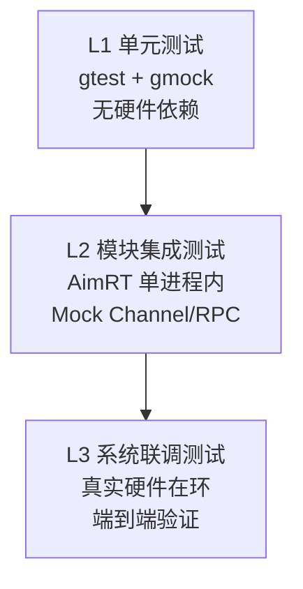


| 层级            | 工具                        | 运行环境                    | 执行频率  | 覆盖目标                                |
| ------------- | ------------------------- | ----------------------- | ----- | ----------------------------------- |
| **L1 单元测试**   | gtest + gmock             | 开发机/CI，无硬件              | 每次编译  | Proto 消息、Pipeline 注册表、SHM 命名、端口分配   |
| **L2 模块集成测试** | gtest + AimRT MockChannel | AGX 开发板，无真实 PTZ         | 每日构建  | Channel/RPC 链路、设备上下线 Pipeline 创建/销毁 |
| **L3 系统联调测试** | 手动 + 自动化脚本                | AGX + 真实 PTZ + MediaMTX | 里程碑节点 | 端到端视频流、远程推流、WebRTC 播放               |


### 9.2 L1 单元测试用例


| 测试文件                        | 测试项                 | 验证内容                                                           |
| --------------------------- | ------------------- | -------------------------------------------------------------- |
| `livestream_proto_test.cc`  | Proto 序列化/反序列化      | `LiveStatus` 含多个 `LiveStreamInfo` → 序列化→反序列化，字段值一致             |
|                             | `LiveCapacity` 层级结构 | 构造含 2 设备 4 相机的 `LiveCapacity` → 序列化后层级完整                       |
|                             | RPC 请求/响应           | `LiveStartPushRequest` 字段赋值 → 序列化正确                            |
| `pipeline_registry_test.cc` | 注册设备 Pipeline       | 注册 SN="PTZ-001" → `pipeline_registry` 中可查到                     |
|                             | 移除设备 Pipeline       | 注册后移除 → 查不到，端口回收                                               |
|                             | 多设备并发注册             | 同时注册 3 台设备 → SN 不冲突，端口不重叠                                      |
|                             | 编码器资源保护             | 超出 `max_concurrent_encoders` → 创建被拒绝                           |
| `shm_manager_test.cc`       | SHM 命名生成            | device_index=0, camera=visible, channel=0 → `/shm_0_visible_0` |
|                             | SHM AI 命名           | 同上 → `/shm_0_visible_0_ai_result`                              |
|                             | 设备离线回收              | 设备离线 → SHM key 标记为可回收                                          |


### 9.3 L2 模块集成测试用例


| 测试项                 | 步骤                              | 预期结果                                          |
| ------------------- | ------------------------------- | --------------------------------------------- |
| 设备上线创建 Pipeline     | 发布 `device/ptz_online` Mock 消息  | LiveStream 创建 Pipeline，发布 `live/shm_register` |
| 设备离线销毁 Pipeline     | 发布 `device/ptz_offline` Mock 消息 | Pipeline 销毁，发布 `live/shm_unregister`          |
| 状态 Channel 上报       | 启动 LiveStream → 等待 5s           | 收到 `live/status` Channel 消息                   |
| RPC LiveGetCapacity | 上线 2 台设备 → 调用 RPC               | 返回 `LiveCapacity` 含 2 台设备信息                   |
| RPC LiveStartPush   | 调用 `LiveStartPush` RPC          | 返回 code=0，状态变为 pushing                        |
| RPC LiveStopPush    | 推流中调用 `LiveStopPush`            | 返回 code=0，状态变为 idle                           |
| RPC LiveLensChange  | 调用切换镜头 RPC                      | Pipeline 重建，video_type 更新                     |
| 编码器资源上限             | 上线 7 通道设备（超限）                   | 第 7 路 Pipeline 创建失败，返回错误                      |


### 9.4 L3 系统联调测试用例


| 测试项          | 设备        | 步骤                          | 通过标准             |
| ------------ | --------- | --------------------------- | ---------------- |
| 本地 WebRTC 播放 | 和普 PTZ    | 上电 → 浏览器访问 WHEP URL         | 画面正常，延迟 < 300ms  |
| 远程 RTMP 推流   | 和普 PTZ    | 调用 `live_start_push` → 天盾接收 | 画面正常，延迟 1-3s     |
| 镜头切换         | 和普 PTZ    | 可见光→红外 → 可见光                | 切换成功，画面无黑屏超过 2s  |
| 双设备并行        | 和普+耐杰     | 两台设备同时在线推流                  | 各路独立，互不影响        |
| 设备热插拔        | 耐杰 PTZ    | 拔网线 → 重插                    | Pipeline 自动销毁→重建 |
| SHM AI 交互    | 任意 PTZ    | AI 推理 + OSD → 推流            | 推流画面含 AI 标注      |
| 长时间稳定性       | 任意 PTZ    | 连续运行 24h                    | 无内存泄漏、无崩溃、帧率稳定   |
| 编码器满载        | 3 设备 7 通道 | 尝试创建全部 Pipeline             | 6 路成功，第 7 路拒绝    |


### 9.5 CMake 集成

```cmake
if(AIMRT_BUILD_TESTS)
  add_gtest_target(
    TEST_TARGET livestream_module
    TEST_SRC
      test/livestream_proto_test.cc
      test/pipeline_registry_test.cc
      test/shm_manager_test.cc
      test/livestream_channel_test.cc
      test/livestream_rpc_test.cc
      test/livestream_lifecycle_test.cc
  )
endif()
```

