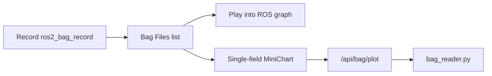

# sysmonit Bag 页：录包后 Foxglove 风格图表增强

## 现状结论

**能做到「先录包再图表」——而且已经半成品；做不到开箱即用的完整 Foxglove。**

当前 Bag 页（[`web/index.html`](ros_ws/src/sysmonit/web/index.html) `#page-bag`）三块：



| 能力 | 现状 |
|------|------|
| 录制指定/全部 topic | 有（`POST /api/bag/record`） |
| 列表 / 播放 / 删除 | 有 |
| 下载 tar.gz | API 有，文件表未挂按钮 |
| 离线数值曲线 | **仅 1 topic × 1 field**，静态 `MiniChart`，无缩放/游标 |
| 多面板 / 图像 / 3D / 同步 scrubber | 无 |
| 数组元素 `foo[i]` | fields 列出 `[]`，plot 无法取下标 |
| 大 bag | 全量扫库一次吐 JSON，响应体上限约 2MB |

后端真源：[`http_api.cpp`](ros_ws/src/sysmonit/src/http_api.cpp) `handle_bag`；数据提取：[`scripts/bag_reader.py`](ros_ws/src/sysmonit/scripts/bag_reader.py)。

补充（[Explore sysmonit bag UI](e2734136-0a72-4c23-81d9-0df0a8958edc)）：`kScriptsDir` 硬编码到源码树，`CMakeLists.txt` 未 install `scripts/`；`MiniChart` 目前基本忽略 Chart.js 风格 `options`。实施时顺带：安装脚本到 share 或按包路径解析；画布交互在扩展 MiniChart 时一并做实。

与 Foxglove 的差距主要在**前端交互 + 多序列 API**，不是「能不能录包」。嵌入完整 Foxglove Studio（MCAP/bridge/CDN）过重，且与单文件无构建 SPA 冲突。**默认方案：在 sysmonit 内做成「Foxglove Plot 面板」子集。**

---

## 目标体验（本方案范围）

1. **录制** → 停录 → 在文件表点 **Analyze/Plot** 进入分析区（工作流打通）。
2. **多曲线叠加**：可添加多条 `topic.field` 系列，共用时间轴。
3. **时间轴交互**：拖拽缩放、平移、竖线游标显示各系列当前值（类似 Foxglove Plot）。
4. **性能**：服务端按时间窗 / 最大点数下采样，避免大 bag 卡死。
5. **非目标（本阶段不做）**：图像/点云/3D、布局预设、真正嵌入 Foxglove、录包时实时画图。

---

## 改造要点

### 1. 扩展 `bag_reader.py`

- 新增 `plot_multi`（或扩展 `plot`）：参数支持多组 `topic:field`、可选 `t0/t1`、`max_points`。
- 一次顺序读 bag，按 topic 过滤，输出：
  ```json
  { "t0": ..., "t1": ..., "series": [ { "topic", "field", "ts":[], "val":[], "count" } ] }
  ```
- 下采样：均匀取点或 bucket min/max（优先简单均匀，保证前端可画）。
- `resolve_field` 支持 `arr[0]` 下标。

### 2. HTTP API（[`http_api.cpp`](ros_ws/src/sysmonit/src/http_api.cpp)）

- `GET /api/bag/plot` 增加 query：`series=topic1.field1,topic2.field2`（或重复 `series=`）、`max_points`、`t0`/`t1`。
- 兼容旧单字段调用，前端旧路径不破坏。
- 适当提高大响应上限（或强制 `max_points` 默认 2000）。

### 3. 前端 Bag Plot 区（[`index.html`](ros_ws/src/sysmonit/web/index.html)）

- **系列管理**：Add Series 列表（topic + field），可删、换色；Draw / Clear。
- **增强画布**（扩展现有 `MiniChart`，不引 CDN）：
  - 绝对时间轴（相对 bag 起点的秒）
  - 鼠标滚轮缩放、拖拽平移
  - 十字线 + 图例旁数值
  - 多 dataset 叠加
- 文件表增加 **Plot**（跳转并预选 bag）、补上已有 **Download**。
- 录制停止后自动刷新列表并提示「可到下方绘图」。

### 4. 验证

- 录短 bag（如 `/ptz_status` + `/host_sw_version` 相关数值 topic）→ 多系列绘制 → 缩放游标可用。
- 回归单字段旧 API。
- 大点数时确认 `max_points` 生效、页面不卡死。

---

## 关键文件

- [`ros_ws/src/sysmonit/scripts/bag_reader.py`](ros_ws/src/sysmonit/scripts/bag_reader.py) — 多系列 + 下采样 + 数组下标
- [`ros_ws/src/sysmonit/src/http_api.cpp`](ros_ws/src/sysmonit/src/http_api.cpp) — plot API 参数
- [`ros_ws/src/sysmonit/web/index.html`](ros_ws/src/sysmonit/web/index.html) — Plot UI + MiniChart 交互
- [`ros_ws/src/sysmonit/readme.md`](ros_ws/src/sysmonit/readme.md) — 文档补一节（若你希望同步文档）

改完前端需 **重新 colcon install sysmonit 并重启节点** 才生效。
