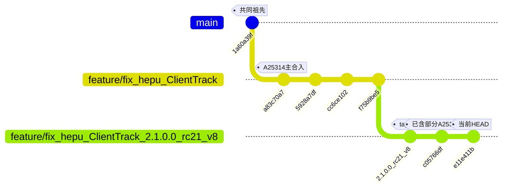
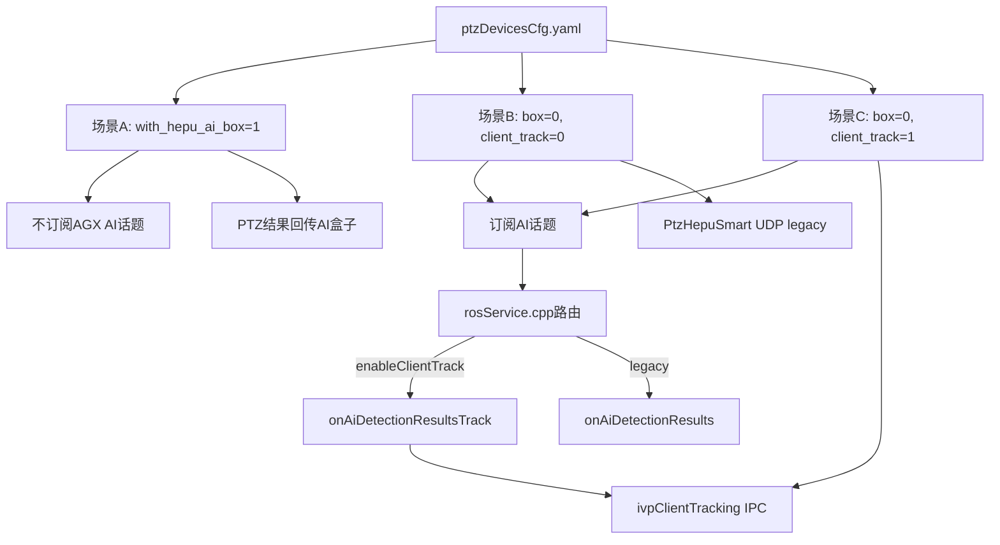

# ClientTrack A25314 合入方案

## 背景与分支关系




- **目标分支** `[feature/fix_hepu_ClientTrack_2.1.0.0_rc21_v8](feature/fix_hepu_ClientTrack_2.1.0.0_rc21_v8)`：基于 `user/2.1.0.0_dev21_fix20260528` 的 tag `2.1.0.0_rc21_v8`，当前 HEAD `e11e411b`，**尚无 ClientTrack 主体代码**。
- **源分支** `[origin/feature/fix_hepu_ClientTrack](origin/feature/fix_hepu_ClientTrack)`：HEAD `4f49d515`，相对目标分支多 29 个提交；其中 **A25314 = 作者 `a25314 <yuanweijian@skyfend.cn>`**。
- **共同祖先**：`1a60a39f`（两分支在此分叉）。

## A25314 提交清单（仅 ClientTrack 相关）


| 提交         | 说明                                                 | 目标分支状态 | 合入动作                        |
| ---------- | -------------------------------------------------- | ------ | --------------------------- |
| `a83c70a7` | feat(hepu): 合入 ClientTrack 配置、SDK 与 ptz_service 主体 | 缺失     | **必须合入**                    |
| `5928a7df` | obj_num=0 且 tracking=1 时跳过 ivpClientTracking       | 缺失     | **必须合入**                    |
| `a80a7960` | 释放 status=0 用上一帧有效框                                | 缺失     | **跳过**（被 `cc6ce102` 取代）     |
| `cc6ce102` | ClientTrack 释放改用画面中心框                              | 缺失     | **必须合入**                    |
| `0f0ea10c` | 适配 GstSourceDecode FpsStats 参数                     | 已等效    | **跳过**（目标分支 `38f712ed` 已适配） |
| `f75b9be5` | 开启目标跟踪状态回传 / SetSmartInfo 防清零                      | 已有     | **跳过**（目标 `c05766df` 同内容）   |
| `8a0c01ac` | 优化释放跟踪逻辑，仅停当前通道                                    | 已有     | **跳过**（目标 `01690f83`）       |
| `ffeff8a6` | 释放后转固定执勤位并拉远视场                                     | 已有     | **跳过**（目标 `bfc0160d`）       |
| `aa5e424f` | configureNtp ntpMode                               | 已有     | **跳过**（目标 `76552b20`）       |


**排除（非 ClientTrack）**：`f4cf16b6`（sysmonit 文档）、`d5fc29be`（chrony）、`e949963c`（nexus_gateway config）、所有 merge commit。

**目标分支已有 A25314 前置提交**（无需再合）：

- `5650746b` 场景 A 不订阅 AI
- `0c8e163c` 场景 C 订阅 AI（后因缺 config 字段被 `1f1f65be` 回退为仅场景 B）
- `1f1f65be` 编译报错修复（去掉 `enable_client_track` 引用）

## 涉及文件（13 个，终态取自源分支）


| 文件                                                                                                                     | 变更性质                                                       | 冲突风险   |
| ---------------------------------------------------------------------------------------------------------------------- | ---------------------------------------------------------- | ------ |
| `[iotDevices/ptzHepuSDK/include/ptz_hepu_ctrl.h](iotDevices/ptzHepuSDK/include/ptz_hepu_ctrl.h)`                       | 新增 `clientTrack()` / FOV 缓存 / `setTargetTrackInertiaTrack` | **高**  |
| `[iotDevices/ptzHepuSDK/src/ptz_hepu_ctrl.cpp](iotDevices/ptzHepuSDK/src/ptz_hepu_ctrl.cpp)`                           | 实现 ivpClientTracking IPC                                   | **高**  |
| `[iotDevices/ptzHepuSDK/include/ptz_hepu_msg.h](iotDevices/ptzHepuSDK/include/ptz_hepu_msg.h)`                         | 场景 A/B/C 注释                                                | 无      |
| `[public/config/yamlConfig/ptzDevicesCfg.h](public/config/yamlConfig/ptzDevicesCfg.h)`                                 | 新增 `enable_client_track`                                   | 无（纯增量） |
| `[public/config/yamlConfig/ptzDevicesCfg.cpp](public/config/yamlConfig/ptzDevicesCfg.cpp)`                             | yaml 读写 `enable_client_track`                              | 无      |
| `[ros_ws/src/ptz_service/src/ptzDevice/ptzHepuLatencyCfg.h](ros_ws/src/ptz_service/src/ptzDevice/ptzHepuLatencyCfg.h)` | **新文件**                                                    | 无      |
| `[ros_ws/src/ptz_service/src/ptzDevice/ptzDeviceHepu.h](ros_ws/src/ptz_service/src/ptzDevice/ptzDeviceHepu.h)`         | ClientTrack 成员/接口                                          | **高**  |
| `[ros_ws/src/ptz_service/src/ptzDevice/ptzDeviceHepu.cpp](ros_ws/src/ptz_service/src/ptzDevice/ptzDeviceHepu.cpp)`     | 场景 C 主逻辑（~1100 行增量）                                        | **高**  |
| `[ros_ws/src/ptz_service/src/rosService/rosService.cpp](ros_ws/src/ptz_service/src/rosService/rosService.cpp)`         | 场景 B/C AI 订阅路由                                             | 低      |
| `[ros_ws/src/ptz_service/scripts/ai_link_test/*](ros_ws/src/ptz_service/scripts/ai_link_test/)`                        | 3 个新脚本 + readme                                            | 低      |


## 冲突分析（git merge-tree 模拟）

### 1. 主合入 `a83c70a7` — 4 个文件 `changed in both`

`**[ptz_hepu_ctrl.h](iotDevices/ptzHepuSDK/include/ptz_hepu_ctrl.h)` / `[ptz_hepu_ctrl.cpp](iotDevices/ptzHepuSDK/src/ptz_hepu_ctrl.cpp)`**

- 冲突根因：`a83c70a7` 基于旧版 SDK（无 `enableIvpResPassBack`），目标分支已有 `c05766df` 新增该接口。
- **终态源分支已同时包含两者**（`clientTrack()` + `enableIvpResPassBack` 共存）。
- 解决策略：**以源分支终态为底，确认保留 `enableIvpResPassBack` 及 `enableObjectDetect` 的 passback 回填逻辑**。

`**[ptzDeviceHepu.cpp](ros_ws/src/ptz_service/src/ptzDevice/ptzDeviceHepu.cpp)` / `[.h](ros_ws/src/ptz_service/src/ptzDevice/ptzDeviceHepu.h)`** — 最大冲突点

- 源分支新增：场景 A/B/C 三分支、`onAiDetectionResultsTrack()`、`ivpClientTracking` 状态机、延迟统计、释放中心框逻辑。
- 目标分支独有（源分支没有，**合入后必须保留**）：
  - `6c1f3101` **auto focus**：`CTRL_CMD_TRIGGER_AUTO_FOCUS` 处理（`ptz_auto_focus` 调用链）
  - `day_night_status` 周期查询与状态上报（目标已有）
  - `hasInitIvpResPassBackLight/Ir` 连接后配置（与 ClientTrack 场景 A 共存）
- 解决策略：**以源分支 ClientTrack 终态为底，手工补回目标分支的 auto focus 代码块**。

### 2. 后续提交 `5928a7df` / `cc6ce102`

- 若 `a83c70a7` 已采用源分支终态合入，这 2 个 fix **已包含在终态中**，无需再 cherry-pick。
- 若仅 cherry-pick `a83c70a7` 而未取终态，后续 2 个提交仍会在 `ptzDeviceHepu.cpp` 产生冲突。

### 3. 无冲突文件

- `ptzDevicesCfg.`*、`ptz_hepu_msg.h`、`ptzHepuLatencyCfg.h`（新文件）、联调脚本 — 可直接 checkout。

### 4. 编译阻塞（按你的选择：不含 message，另开任务）

ClientTrack 代码引用 `AiTargetInfo.hepu_tracking_status(_valid)`，当前目标分支 message 子模块 `86d7a48` **无此字段**。严格只合 A25314 代码时：

- `**colcon build --packages-select ptz_service` 将编译失败**（缺少 msg 字段）。
- 需在后续独立任务中将 `srp100_message` 更新至 `697fb5a8`（或至少包含 `4fc203c clientTrack方案适配` 的 commit）。

## 推荐合入步骤

### Step 0：建集成分支

```bash
git checkout feature/fix_hepu_ClientTrack_2.1.0.0_rc21_v8
git checkout -b integrate/clientTrack_a25314
```

### Step 1：无冲突文件 — 直接从源分支取终态

```bash
git checkout origin/feature/fix_hepu_ClientTrack -- \
  iotDevices/ptzHepuSDK/include/ptz_hepu_msg.h \
  public/config/yamlConfig/ptzDevicesCfg.h \
  public/config/yamlConfig/ptzDevicesCfg.cpp \
  ros_ws/src/ptz_service/src/ptzDevice/ptzHepuLatencyCfg.h \
  ros_ws/src/ptz_service/scripts/ai_link_test/generate_client_track_report.py \
  ros_ws/src/ptz_service/scripts/ai_link_test/test_client_track_stub_ai.py \
  ros_ws/src/ptz_service/scripts/ai_link_test/verify_client_track.py \
  ros_ws/src/ptz_service/scripts/ai_link_test/readme.md
```

### Step 2：冲突文件 — 取源终态 + 手工保留目标独有逻辑

```bash
# 取 ClientTrack 终态
git checkout origin/feature/fix_hepu_ClientTrack -- \
  iotDevices/ptzHepuSDK/include/ptz_hepu_ctrl.h \
  iotDevices/ptzHepuSDK/src/ptz_hepu_ctrl.cpp \
  ros_ws/src/ptz_service/src/ptzDevice/ptzDeviceHepu.h \
  ros_ws/src/ptz_service/src/ptzDevice/ptzDeviceHepu.cpp \
  ros_ws/src/ptz_service/src/rosService/rosService.cpp
```

**手工核对清单**（`[ptzDeviceHepu.cpp](ros_ws/src/ptz_service/src/ptzDevice/ptzDeviceHepu.cpp)` 的 `ctrlPtzLens`）：

- 确认 `CTRL_CMD_TRIGGER_AUTO_FOCUS` 分支仍存在（来自目标 `6c1f3101`）。
- 若被覆盖，从目标分支 `6c1f3101` 对应 hunk 补回。

**SDK 核对清单**（`[ptz_hepu_ctrl.h](iotDevices/ptzHepuSDK/include/ptz_hepu_ctrl.h)`）：

- 确认 `enableIvpResPassBack()` 声明仍在（源终态应已包含，与 `c05766df` 一致）。

### Step 3：配置 yaml 示例

在 `/home/skyfend/config/ptzDevicesCfg.yaml` 为目标和普 PTZ 增加（场景 C）：

```yaml
with_hepu_ai_box: 0
enable_client_track: 1
```

默认 `enable_client_track: 0` 保持场景 B legacy 行为不变。

### Step 4：提交

```bash
git add iotDevices/ptzHepuSDK/ public/config/yamlConfig/ ros_ws/src/ptz_service/
git commit -m "$(cat <<'EOF'
feat(hepu): 合入 A25314 ClientTrack 至 rc21_v8 基线

从 feature/fix_hepu_ClientTrack 同步 ivpClientTracking 配置、SDK 与 ptz_service 场景 C 逻辑；
保留 rc21_v8 已有 enableIvpResPassBack 与 auto focus。message 字段另任务合入。
EOF
)"
```

### Step 5：验证（message 合入前预期失败）

```bash
cd ros_ws && colcon build --packages-select ptz_service
# 预期：AiTargetInfo 缺少 hepu_tracking_status 字段 → 编译错误
```

message 子模块更新后复编：

```bash
cd ros_ws/src/srp100_message && git checkout 697fb5a8
cd ../../.. && colcon build --packages-select skyfend_interfaces ptz_service
```

### Step 6：功能验证（message + AI 就绪后）

```bash
python3 ros_ws/src/ptz_service/scripts/ai_link_test/verify_client_track.py check --skip-track --ptz-ip <IP>
python3 ros_ws/src/ptz_service/scripts/ai_link_test/test_client_track_stub_ai.py run --pre-check
```

## 不推荐方案：顺序 cherry-pick

若按时间顺序 `git cherry-pick a83c70a7 5928a7df cc6ce102`：

- `a83c70a7` 在 4 个核心文件产生冲突（同上）。
- 跳过的 `f75b9be5/8a0c01ac/ffeff8a6` 已在目标分支以不同 hash 存在，顺序 cherry-pick 容易重复或遗漏。
- **终态文件同步更可靠**，避免 replay 中间态 API 变迁（`a83c70a7` 曾移除 `enableIvpResPassBack`，后续又在目标/源分支加回）。

## 架构说明（合入后的场景路由）




## 风险与后续任务


| 项               | 说明                                                                 |
| --------------- | ------------------------------------------------------------------ |
| message 子模块     | **必须另开任务**合入 `hepu_tracking_status(_valid)`，否则 ptz_service 无法编译    |
| ptz100_ai 子模块   | 需发布上述字段（非 A25314 范围，依赖 AI 侧 `user/hepu_client_track` 工作）           |
| ptz100_guide_ai | 需提供 `/ptz_guiding_info_vis.working_state==3` 触发 valid 标志（非 A25314） |
| auto focus      | 合入时务必保留目标分支 `6c1f3101` 逻辑，避免覆盖                                     |
| 场景 B 回归         | 默认 `enable_client_track=0`，现有 legacy UDP 路径不应受影响                   |


