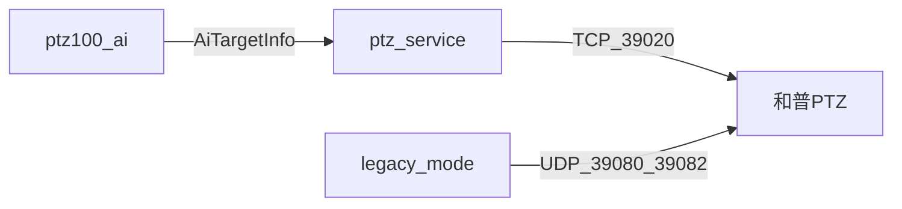
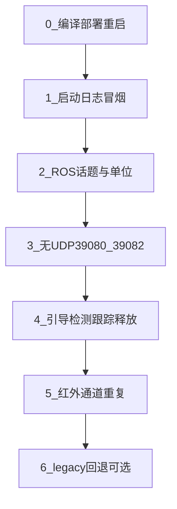

# HVS_ClientTrack 方案实机验证计划

## 验证范围与通过标准

本方案验证的是 **AI ↔ ptz_service ↔ 和普 PTZ（TCP `HVS_ClientTrack` / `HVS_PositionView`）**，不是 legacy UDP。

| 通过 | 含义 |
|------|------|
| 配置生效 | 和普设备 `enable_client_track: 1`，启动日志出现 ClientTrack 分支 |
| 链路通 | AI 发布 track topic，ptz_service 订阅并走 `onAiDetectionResultsTrack` |
| 单位对 | `PtzLensInfo` 度×100；`next_view` 为度，ptz_service 不二次 ×100 |
| 行为对 | 引导态不变倍；PTZ 跟踪态 + `next_view_valid==1` 才变倍；无 UDP 39080/39082 |
| 可回退 | `enable_client_track: 0` 恢复 legacy，无功能回归 |

**注意**：[ai_link_test/readme.md](ros_ws/src/ptz_service/scripts/ai_link_test/readme.md) 里的 `test_hepu_e2e_ai_link.py e2e` 仅验证 **legacy UDP**（`enable_client_track: 0`）。ClientTrack 联调**不要**用该脚本作为通过依据。

---

## 0. 前置条件（两台节点都改完后做一次）

```bash
cd ~/workspace/ptz100_agx/ros_ws
source /opt/ros/humble/setup.bash   # 或本机实际 ROS 路径
source install/setup.bash

# 消息与节点必须同一 install 树（避免 clock skew 导致头文件未更新）
colcon build --packages-select skyfend_interfaces ptz_service
# AI 节点按你们现有流程单独编 ptz100_ai
```

- 配置文件：[ `/home/skyfend/config/ptzDevicesCfg.yaml` ](/home/skyfend/config/ptzDevicesCfg.yaml)（和普 **type=4**，`ip: 192.168.2.4`，`with_hepu_ai_box: 0`，**`enable_client_track: 1`**）
- 通过 **sysmonit** 重启 `ptz_service`、`ptz100_ai`（及联调需要的 `ptz100_guide_ai`），避免裸 `ros2 run` 环境不一致
- 确认和普 PTZ TCP 可达（默认 **39020**）

---

## 1. 启动冒烟（约 5 分钟）

### 1.1 日志关键字（ptz_service）

日志路径通常为 `/home/skyfend/log/ptz_service.log`（以现场为准）。

```bash
grep -E "enable_client_track|ClientTrack|skip PtzHepuSmart|skip trackAbility|skip smartAnalysis|Lens zoom/fov range cached|onAiDetectionResultsTrack" /home/skyfend/log/ptz_service.log | tail -30
```

**期望至少出现**：

- `enable_client_track=1` → `ClientTrack (HVS_ClientTrack)`
- `skip PtzHepuSmart UDP senders`
- `enable_client_track=1, skip trackAbility` / `skip smartAnalysis/objectDetect/trackMode/smartServer`
- 连接后：`Lens zoom/fov range cached` 且 `fov_min=... fov_max=... (x100 deg)`

**不应出现**（ClientTrack 模式下）：`ai_smart_sender` / `AI Smart Sender started`（场景 B 且 clientTrack 时应跳过 UDP sender）。

### 1.2 ROS 图连通

```bash
ros2 topic info /visiblelight_track_objs -v
ros2 topic info /infrared_track_objs -v
ros2 topic info /ptz_lens_info -v
```

| Topic | 期望 |
|-------|------|
| `/visiblelight_track_objs` | Publisher: ptz100_ai；Subscription: ptz_service ≥1 |
| `/infrared_track_objs` | 同上 |
| `/ptz_lens_info` | Publisher: ptz_service；Subscription: ptz100_ai ≥1 |

回调日志（INFO 级）：`onAiDetectionResultsTrack (visible)` / `(infrared)`，而非仅 `onAiDetectionResults`。

---

## 2. 消息与单位契约（ROS 静态检查，可并行）

与 AI 同事对齐的约定：**读 PTZ 时 ÷100，回传 ptz_service 时用度、不 ×100**。

### 2.1 PTZ → AI：`/ptz_lens_info`

```bash
ros2 topic echo /ptz_lens_info --once
```

| 字段 | msg 单位 | 人工换算 |
|------|----------|----------|
| `visible_horizontal_fov_angle` | 度×100 | ÷100 = ViewNow（度） |
| `visible_horizontal_fov_min/max` | 度×100（SDK 原样） | ÷100 = clamp 范围（AI 若仍用 yaml 也可先只核对 PTZ 侧非 0） |
| `thermal_*` | 同上 | 热像通道 |

**通过**：PTZ 连接成功后，四个 min/max **非 0**（`getLensZoomAmp` 成功）；angle 与 Web/和普当前视场量级一致（例如 msg=512 → 5.12°）。

### 2.2 AI → PTZ：track topics

```bash
ros2 topic echo /visiblelight_track_objs --field next_view,next_view_valid,ptz_source,h_fov --once
# 跟踪过程中
ros2 topic hz /visiblelight_track_objs
```

| 字段 | 期望 |
|------|------|
| `next_view` | **度**（如 3.5），不是 350 |
| `next_view_valid` | 检测态多为 `0`；满足 AI 跟踪条件后为 `1` |
| `h_fov` | 度（AI 内部已 ÷100），与 LensInfo angle÷100 同量级 |

AI 日志（`ptz100_ai`）：`next_view src:... now:5.12 ... next:3.50 valid:1`（[ai_main.cpp](ros_ws/src/ptz100_ai/skyfend_ai_main/ai_main.cpp) 约每 40 帧一条）。

### 2.3 ptz_service 消费侧

跟踪态且变倍时，日志应出现：

- `setPositionView(x.xxx) vt=...`（数值与 topic 中 `next_view` 一致，**无 ×100**）
- 或失败时 `setPositionView(...) failed`

```bash
grep -E "setPositionView|clientTrack|onAiDetectionResultsTrack" /home/skyfend/log/ptz_service.log | tail -20
```

---

## 3. ClientTrack 与 legacy 区分（必做）



**ClientTrack 模式（`enable_client_track: 1`）**

```bash
# AGX 上：不应有发往 PTZ 的 39080/39082（联调时抓 10s）
sudo timeout 10 tcpdump -i any -n 'host 192.168.2.4 and (udp port 39080 or udp port 39082)'
```

**期望**：无包或极少（与 ClientTrack 无关的其它流量除外）。

可选：抓 **39020** 确认控制通道有持续交互（ClientTrack 每帧）：

```bash
sudo timeout 10 tcpdump -i any -n 'host 192.168.2.4 and tcp port 39020'
```

---

## 4. 分阶段行为验证（需引导 + 实目标）

对照 [readme ClientTrack 清单](ros_ws/src/ptz_service/scripts/ai_link_test/readme.md) 与计划 §测试项。

| 阶段 | 操作 | 观察（现象 + 日志） |
|------|------|---------------------|
| **引导态** | 融合目标进入，引导发 Guidance/Motion/Lens | PTZ 指向/转台/镜头正常；AI 可能 `next_view_valid=1` 但 **镜头不因 next_view 变化**（`onAiDetectionResultsTrack` 引导态不调 `setPositionView`） |
| **检测态** | AI 有框，`track_state` TENTATIVE/CONFIRMED，`next_view_valid=0` | PTZ 开始跟随（ClientTrack）；**不变倍**；日志有 `clientTrack`，无 `setPositionView` |
| **跟踪态+变倍** | AI `next_view_valid=1`，且 PTZ `tracking=true` | 约 2s 级 `setPositionView`；视场向 `next_view` 靠拢 |
| **释放** | AI `track_state=LOST/REMOVED` | `trackingStatus=0`；**不**依赖引导 `PtzTrackCmd`/`stopTrack`；云台停跟 |
| **引导 no-op** | PTZ 已在跟踪，引导仍发 Motion/Lens | 日志 `skip motion/lens cmd during PTZ tracking`；云台不被引导抢控 |

**可见光**：`/visiblelight_track_objs`，框用 `visible_light_*`。  
**红外**：`/infrared_track_objs`，`ptz_source=1`，框用 `infrared_*`，同样走 `onAiDetectionResultsTrack`。

---

## 5. 与 AI 节点联调核对表（双人可勾选）

| # | 检查项 | AI 侧 | ptz_service 侧 |
|---|--------|-------|----------------|
| 1 | 同一 `skyfend_interfaces` 版本 | 已编 install | 已编 install |
| 2 | `next_view` / `next_view_valid` 有发布 | `ros2 topic echo` 可见 | 订阅回调为 Track 路径 |
| 3 | ViewNow | `horizontal_fov = angle/100` | `visible_horizontal_fov_angle` 有值 |
| 4 | 变倍条件 | `valid=1` 且 guider+work_mode 跟踪 | `isPtzInTrackingPhase()` 且 `valid==1` 才 `setPositionView` |
| 5 | clamp | 当前多为 config.yaml 度 | min/max 已发布，AI 接 ROS 范围为可选二期 |

---

## 6. Legacy 回退验证（约 10 分钟）

1. yaml 仅和普项：`enable_client_track: 0`
2. 重启 `ptz_service`
3. 日志应出现 `ai_smart_sender` / `Scenario B` UDP sender（`with_hepu_ai_box: 0`）
4. `tcpdump` 可见 **39080/39082** 有 UDP
5. 原跟踪/释放（`EnableSmartToTrack` / UDP）行为与改前一致

通过后改回 `enable_client_track: 1` 继续 ClientTrack 外场测试。

---

## 7. 常见问题与定位

| 现象 | 可能原因 | 查什么 |
|------|----------|--------|
| 有 AI 框但云台不跟 | PTZ 未连 / `clientTrack` 失败 | `clientTrack failed`；TCP 39020 |
| 有 `valid=1` 不变倍 | PTZ 仍引导态 | `isPtzInTrackingPhase`；`/ptz_status` `work_mode` |
| min/max 全 0 | 未连上或未调 `getLensZoomAmp` | `Lens zoom/fov range cached` |
| 编译报无 `next_view_valid` | interfaces 未重编 | clean rebuild `skyfend_interfaces` |
| 仍走 UDP | yaml 未生效或未重启 | 启动日志 `enable_client_track` |

---

## 建议执行顺序（单日联调）



最小可交付：**完成 0 + 1 + 2 + 3 + 4（可见光）** 即可认为 ClientTrack 方案联调通过；红外与 legacy 回退作为同日复测项。
