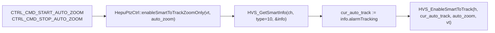

# enableSmartToTrack 读改写: 仅改 auto_zoom

## 背景与现状

- `HVS_EnableSmartToTrack(h, auto_track, auto_zoom, vt)` 一次同时设置两个字段, 现有 6 处调用都把 `auto_track` 跟 `auto_zoom` 写成同一个布尔 (`true,true` 或 `false,false`)。
- 在 [`ros_ws/src/ptz_service/src/ptzDevice/ptzDeviceHepu.cpp`](ros_ws/src/ptz_service/src/ptzDevice/ptzDeviceHepu.cpp) L1092-L1109 的 `CTRL_CMD_START_AUTO_ZOOM` / `CTRL_CMD_STOP_AUTO_ZOOM` 两条路径上, 引导只想切换 auto_zoom, 但当前实现会把 PTZ 上原本的 auto_tracking 一起翻掉。
- 和普供应商微信群确认: `auto_tracking` 状态可以从 `HVS_GetSmartInfo(channel, type=10, &info)` 出参的 `SmartAnalyseInfo_t.alarmTracking` 字段读到 (见 [`thirdpart/hepuSdk/include/datdefs.h`](thirdpart/hepuSdk/include/datdefs.h) L2284-L2285 字段注释 "是否联动目标跟踪")。
- 已有相同骨架 `enableObjectDetect` 走 `HVS_GetSmartInfo + HVS_SetSmartInfo` (见 [`iotDevices/ptzHepuSDK/src/ptz_hepu_ctrl.cpp`](iotDevices/ptzHepuSDK/src/ptz_hepu_ctrl.cpp) L1349-L1384), 命名/日志风格可对齐。

## 数据流



## 变更点

### 1. SDK 适配层: 新增 `enableSmartToTrackZoomOnly`

- [`iotDevices/ptzHepuSDK/include/ptz_hepu_ctrl.h`](iotDevices/ptzHepuSDK/include/ptz_hepu_ctrl.h) 在 L103 `enableSmartToTrack` 声明之后追加新接口声明 + 中文说明 (保持现有注释风格):

```cpp
// 仅修改 auto_zoom, 保留 PTZ 当前 auto_tracking 状态.
//   场景: 标定流程的 CTRL_CMD_START_AUTO_ZOOM / STOP_AUTO_ZOOM, 只想切自动变倍,
//   不能把 PTZ 上已配置的 auto_tracking 一起翻掉.
//   实现: HVS_GetSmartInfo(channel, type=10 目标分类, &info)
//         → 取 info.alarmTracking 作为当前 auto_track
//         → HVS_EnableSmartToTrack(h, cur_auto_track, auto_zoom, vt)
//   Get 失败 → 返回 -1, 不裸下发兜底, 避免覆盖 auto_tracking.
int32_t enableSmartToTrackZoomOnly(VideoType_e video_type, bool auto_zoom);
```

- [`iotDevices/ptzHepuSDK/src/ptz_hepu_ctrl.cpp`](iotDevices/ptzHepuSDK/src/ptz_hepu_ctrl.cpp) 在 `enableSmartToTrack` (L1328-L1347) 之后新增实现, 复用 `enableObjectDetect` 的骨架:
  - `isReallyConnected()` 守卫
  - `std::lock_guard<std::mutex> lock(m_device_mutex)`
  - `channel = (vt == VT_LIGHT) ? 0 : 1`, `type=10`
  - `SmartAnalyseInfo_t info{};` + `memset(&info, 0, sizeof(info));`
  - `HVS_GetSmartInfo(device_, channel, 10, &info)` 失败打 `HVS_GetLastErrMsg`, 返回 `-1`
  - `cur_auto_track = info.alarmTracking;`
  - `HVS_EnableSmartToTrack(device_, cur_auto_track, auto_zoom, video_type)` 失败 → ERROR + 返回 `-1`
  - 成功 → `LOG_INFO("Smart zoom-only: %s, auto_track preserved=%d, auto_zoom=%d", type_str, cur_auto_track?1:0, auto_zoom?1:0)`

### 2. 应用层: 替换 2 处调用

[`ros_ws/src/ptz_service/src/ptzDevice/ptzDeviceHepu.cpp`](ros_ws/src/ptz_service/src/ptzDevice/ptzDeviceHepu.cpp) L1092-L1109:

- L1093-L1094 (START_AUTO_ZOOM): `enableSmartToTrack(video_type, true, true)` → `enableSmartToTrackZoomOnly(video_type, true)`, 删掉 `//xu yao xiu gai` placeholder 注释
- L1102-L1103 (STOP_AUTO_ZOOM):  `enableSmartToTrack(video_type, false, false)` → `enableSmartToTrackZoomOnly(video_type, false)`, 同样删 placeholder
- 周边 LOG_INFO/LOG_WARN 文案保持, 不动 `ret` 处理分支
- 另外 4 处 (L1141, L1153, L1170, L1174) **不动** —— 那些路径业务语义就是要同时设置 auto_track + auto_zoom

### 3. 构建确认

- 受影响包: `iotDevices/ptzHepuSDK` (头/实现) + `ros_ws/src/ptz_service`
- 接口只增不改, 二进制兼容; 直接 `colcon build --packages-select ptz_service` 即可拉到新符号
- 完成后 ReadLints 两个文件

## 不做的事

- 不动 `enableSmartToTrack` 原签名/原 4 处调用
- 不做 `HVS_SetSmartInfo` 全字段 RMW (`HVS_EnableSmartToTrack` 本身就是 SDK 专为该状态封装的 setter, 没必要绕到设备配置全量回写)
- Get 失败不做兜底裸下发 (避免覆盖 auto_tracking, 错误返回交由引导层 5s 重试自然兜底)
