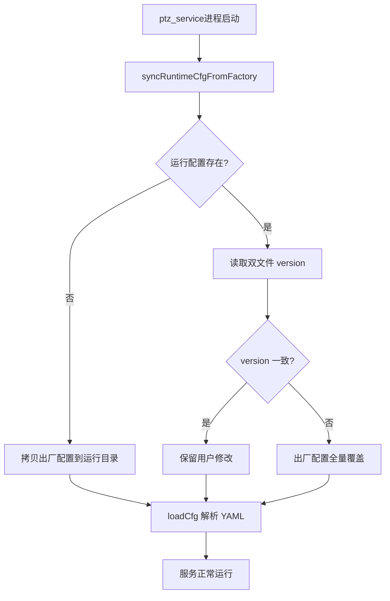

# FOV 配置文件自动更新实现计划

## 问题根因（已确认理解）

当前 [`ptzHepuViewCfg.cpp`](ptz100_agx/iotDevices/ptzHepuSDK/src/ptzHepuViewCfg.cpp) 的 `createDefaultCfg()` 逻辑是：

```105:111:ptz100_agx/iotDevices/ptzHepuSDK/src/ptzHepuViewCfg.cpp
        std::ifstream existCheck(cfgPath);
        if (existCheck.good())
        {
            LOG_INFO("Config file already exists, skip default creation: %s", cfgPath.c_str());
            existCheck.close();
            return true;
        }
```

- 运行配置路径：`/home/skyfend/config/ptzHepuViewCfg.yaml`
- **文件一旦存在就永不更新**，即使 C++ 中默认表已改为 xiaojian 修正值
- 无 `version` 字段、无出厂模板文件、无启动校验
- 测试同事升级软件后，旧 AGX 本地 yaml 仍是旧表 → 行为与新版代码不一致

你的设计（方案二）正是为此：**出厂配置随 OTA 更新，运行配置可手改，version 不一致时全量覆盖**。

---

## 目标架构



**双文件路径：**

| 角色 | 路径 | 说明 |
|------|------|------|
| 出厂配置 | `PTZ100_APP_ROOT_CONFIG_DIR/ptz/ptzHepuViewCfg.yaml` | 即 `ptz100_agx/config/ptz/ptzHepuViewCfg.yaml`，随 OTA `pack_app.sh` 打包 |
| 运行配置 | `PTZ100_APP_CONFIG_DIR/ptzHepuViewCfg.yaml` | 即 `/home/skyfend/config/ptzHepuViewCfg.yaml`，业务生效 |

**版本规则（已确认）：**
- 格式：`V1.0.0`、`V1.0.1` ...
- 运行配置**缺少 version** → 视为过期，触发覆盖（解决旧 AGX 迁移）
- 比较方式：字符串相等（`version` 不同即覆盖，不做 semver 大小比较）

---

## 实现步骤

### 1. 新增出厂配置文件

创建 [`config/ptz/ptzHepuViewCfg.yaml`](ptz100_agx/config/ptz/ptzHepuViewCfg.yaml)：

- 顶层第一字段：`version: "V1.0.0"`
- 内容从当前 `#if 1` 分支的 xiaojian 修正表迁移（`visible_table` / `uncooled_thermal_table` / `cooled_thermal_table`）
- 保留现有头部使用说明注释
- **后续改表只改此文件并递增 version**，不再改 C++ 硬编码（符合周益辉「避免参数写死在代码里」的要求）

OTA 打包无需改动：[`pack_app.sh`](ptz100_agx/config/tools/ota_tools/build_host/pack_app.sh) 已 `cp -a config` 到 `app/config/`。

### 2. 路径常量

在 [`configCommDef.h`](ptz100_agx/public/config/configUtils/configCommDef.h) 增加：

```cpp
#define PTZ_HEPU_VIEW_CFG_FACTORY_FILE  PTZ100_APP_ROOT_CONFIG_DIR"/ptz/ptzHepuViewCfg.yaml"
#define PTZ_HEPU_VIEW_CFG_RUNTIME_FILE  PTZ100_APP_CONFIG_DIR"/ptzHepuViewCfg.yaml"
```

### 3. 核心同步逻辑（`PtzHepuViewCfg`）

修改 [`ptzHepuViewCfg.h`](ptz100_agx/iotDevices/ptzHepuSDK/include/ptzHepuViewCfg.h) / [`.cpp`](ptz100_agx/iotDevices/ptzHepuSDK/src/ptzHepuViewCfg.cpp)：

**新增 `syncRuntimeCfgFromFactory()`：**

1. 确保 `/home/skyfend/config/` 目录存在
2. 出厂文件不存在 → `LOG_ERROR` 并返回 false（不破坏已有运行配置）
3. 运行文件不存在 → `cp` 出厂 → 运行，打 INFO 日志
4. 运行文件存在 → 分别读取 `version` 字段：
   - 运行侧缺 version → 视为 `"<missing>"`，与出厂不等 → 覆盖
   - version 字符串不等 → 覆盖
   - version 相等 → 跳过，保留用户修改
5. 覆盖使用文件级 `cp`（全量替换，满足 Key 增删/结构迭代）

**重构 `createDefaultCfg()`：**

- 删除 200+ 行硬编码表数据（`#if 1` / `#else` 两分支均可移除）
- 改为调用 `syncRuntimeCfgFromFactory()` 的薄封装

**调整 `loadCfg()`：**

- 先 `syncRuntimeCfgFromFactory()`，再 `YAML::LoadFile` 解析
- 默认路径改用 `PTZ_HEPU_VIEW_CFG_RUNTIME_FILE` 宏

**辅助函数 `readCfgVersion(path)`：**

- 用 yaml-cpp 读顶层 `version`，缺省返回空字符串

### 4. ptz_service 启动校验（方案二落点）

在 [`rosService.cpp`](ptz100_agx/ros_ws/src/ptz_service/src/rosService/rosService.cpp) 的 `RosService::init()` **最开头**（创建设备之前）显式调用：

```cpp
#include "ptzHepuViewCfg.h"
// ...
if (!PtzHepuViewCfg::getInstance().loadCfg()) {
    LOG_WARN("ptzHepuViewCfg load failed, distance-to-FOV may use empty tables");
}
```

**说明：** `ptz_hepu_ctrl.cpp` 中有静态初始化也会调 `loadCfg()`，但 `loadCfg` 内嵌 sync 后两次调用是幂等的（version 一致时第二次不再覆盖）。`rosService::init` 的显式调用满足设计文档「ptz_service 初始化阶段校验」的可观测性。

### 5. 旧配置迁移行为（解决测试问题）

| 场景 | 行为 |
|------|------|
| 旧 AGX 有老 yaml、无 version | 视为过期 → 覆盖为 `V1.0.0` 新表 |
| 用户手改后 version 仍为 V1.0.0 | 保留用户修改 |
| 下次软件升级，出厂改为 V1.0.1 | 重启 ptz_service → 全量覆盖为新结构 |
| 全新设备 | 直接拷贝出厂配置 |

### 6. 其他消费者（不改代码，行为自动受益）

- [`ptz_guider_utils.cpp`](ptz100_agx/ros_ws/src/ptz100_guide_ai/ptz_guider_ctl/src/ptz_guider_utils.cpp)（guide_ai）独立读运行配置 → ptz_service 先启动/sync 后，guide_ai 读到已更新的 yaml
- SDK 静态加载 [`ptz_hepu_ctrl.cpp:1859`](ptz100_agx/iotDevices/ptzHepuSDK/src/ptz_hepu_ctrl.cpp) → sync 在 `loadCfg` 内执行，FOV 查表路径一致

---

## 不在本次范围

- guide_ai 侧独立实现 version sync（依赖 ptz_service 先启动即可）
- 字段级 merge（设计明确要求全量覆盖）
- `ptzDevicesCfg` 式跨进程 autoSync（FOV 表无多进程写需求）

---

## 验证计划

1. **旧 AGX 模拟**：手动放一份无 `version` 的旧 yaml 到 `/home/skyfend/config/`，启动 ptz_service，确认被覆盖且 `version: V1.0.0`
2. **用户配置保留**：version 一致时修改某距离 FOV，重启 → 修改仍在
3. **升级模拟**：出厂 yaml 改 `V1.0.1` 并改表项，重启 → 运行配置全量更新
4. **新设备**：删除运行 yaml，启动 → 自动从出厂拷贝
5. 检查日志关键字：`Config version mismatch`、`skip overwrite (version matched)`
