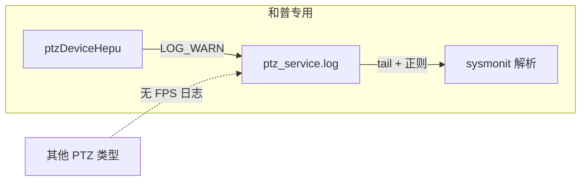
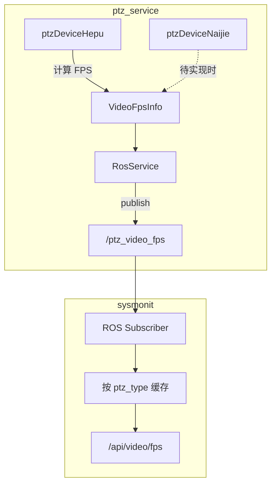

# FPS 监控方案：耐杰 + 和普 双设备观测

## 一、当前状态

**FPS 监控功能尚未实现**。对话摘要中描述的 `build_video_fps_json`、`/api/video/fps`、前端 FPS 卡片等均未出现在当前代码库中。需要从零实现。

---

## 二、当前方案是否只能检测和普？

**结论：是的，当前基于日志解析的方案本质上只适用于和普（Hepu）设备。**

### 原因分析

1. **FPS 日志仅在 Hepu 实现中输出**
  - 日志输出位置：`[ptzDeviceHepu.cpp](ros_ws/src/ptz_service/src/ptzDevice/ptzDeviceHepu.cpp)`
  - Decoder FPS：`fpsStatistics()`（约 401–402 行）输出 `Camera 0 (Visible): Decoder FPS = X`
  - Push FPS：`visiblePushThread()`（约 516 行）、`thermalPushThread()`（约 569 行）输出 `Visible stream: Real FPS = Xfps`
2. **PTZ 设备实现仅支持和普**
  - `[rosService.cpp](ros_ws/src/ptz_service/src/rosService/rosService.cpp)` 第 96–104 行：仅创建 `PTZ_HEPU`(4) 或 `PTZ_HEPU_COOLED`(6)
  - 工程中仅有 `ptzDeviceHepu.cpp`，无其他 PTZ 实现（如 Naijie 等）
3. **日志解析本身是通用的**
  - 若其他 PTZ 实现也按相同格式写入同一日志文件，解析逻辑可复用
  - 但当前只有 Hepu 会写入这些 FPS 日志，因此实际效果是“和普专用”




---

## 三、是否可以使用 ROS 实时发布 topic 到 sysmonit？

**可以。** 通过 ROS topic 实时发布 FPS 是可行且更优的方案。

### 方案对比


| 维度   | 日志解析方案           | ROS Topic 方案        |
| ---- | ---------------- | ------------------- |
| 实时性  | 依赖轮询（如 3s）+ 解析延迟 | 接近实时（按发布频率）         |
| 设备扩展 | 需在各自实现中写日志       | 任意 PTZ 实现都可发布 topic |
| 依赖   | 依赖 zlog 配置和日志路径  | 仅依赖 ROS 通信          |
| 可靠性  | 受日志轮转、磁盘 I/O 影响  | 进程间直接通信，更稳定         |


### 耐杰 + 和普 双设备观测设计

**必须采用 ROS 方案**，才能实现设备无关、耐杰与和普均可观测：

- 日志解析方案：仅和普有 FPS 日志，耐杰无实现且无日志
- ROS 方案：统一 topic + 消息中携带 `ptz_type`，任一 PTZ 实现都可发布

**当前实现状态**：ptz_service 仅支持和普（`ptzDeviceHepu.cpp`），耐杰（PTZ_NAIJIE=0、PTZ_NAIJIE_MID=5）在配置/UI 中存在但未实现。ROS 接口设计为设备无关，后续实现 `ptzDeviceNaijie.cpp` 时只需按相同接口发布即可。

### ROS 方案架构




### 实现要点

1. **新增消息类型**（设备无关）
  - 在 `skyfend_interfaces` 中增加 `VideoFpsInfo.msg`：

```
   std_msgs/Header header
   uint8 ptz_type        # 0=PTZ_NAIJIE, 4=PTZ_HEPU, 5=PTZ_NAIJIE_MID, 6=PTZ_HEPU_COOLED
   string device_sn      # 设备序列号，用于多设备区分
   float32 visible_decoder_fps
   float32 thermal_decoder_fps
   float32 visible_push_fps
   float32 thermal_push_fps
   

```

1. **ptz_service 发布 FPS**
  - 在 `[rosService.cpp](ros_ws/src/ptz_service/src/rosService/rosService.cpp)` 中增加 `/ptz_video_fps` 的 publisher 及 `pub_video_fps()` 接口  
  - 在 `[ptzDeviceHepu.cpp](ros_ws/src/ptz_service/src/ptzDevice/ptzDeviceHepu.cpp)` 中，在 `fpsStatistics()` 和 push 线程统计处调用发布（约 1–2 Hz）  
  - 在 `ptzDeviceNaijie.cpp`（待实现）中，同样在 FPS 统计处调用发布接口
2. **sysmonit 订阅并对外提供 API**
  - 订阅 `/ptz_video_fps`，按 `ptz_type` 或 `device_sn` 缓存多设备数据  
  - `/api/video/fps` 返回 `{ "devices": [ { "ptz_type": 4, "name": "和普", ... }, { "ptz_type": 0, "name": "耐杰", ... } ] }`  
  - 前端按设备类型展示不同卡片或标签页
3. **不使用日志解析**
  - 仅依赖 ROS，实现更简洁，且天然支持耐杰与和普

---

## 四、推荐实施顺序

1. **先实现 ROS 方案**：实时性好、易扩展、不依赖日志
2. **再实现前端**：FPS 卡片、KPI、时序图、告警
3. **可选**：增加日志解析作为 ROS 不可用时的备用数据源

---

## 五、关键文件清单


| 文件                                                | 修改内容                                           |
| ------------------------------------------------- | ---------------------------------------------- |
| `skyfend_interfaces/msg/ptz_msg/VideoFpsInfo.msg` | 新建消息定义（含 `ptz_type`、`device_sn`）               |
| `ptz_service/rosService/rosService.cpp`           | 增加 FPS publisher 及 `pub_video_fps()` 接口        |
| `ptz_service/rosService/rosService.h`             | 声明 FPS 发布接口                                    |
| `ptz_service/ptzDevice/ptzDeviceHepu.cpp`         | 在 FPS 统计处调用 `rosService_.pub_video_fps()`      |
| `ptz_service/ptzDevice/ptzDeviceNaijie.cpp`       | 待实现时：在 FPS 统计处调用 `rosService_.pub_video_fps()` |
| `sysmonit/src/main.cpp`                           | 订阅 `/ptz_video_fps`，按设备缓存，实现 `/api/video/fps`  |
| `sysmonit/CMakeLists.txt`                         | 添加 `skyfend_interfaces` 依赖                     |
| `sysmonit/web/index.html`                         | 增加 FPS 监控卡片，按设备类型展示（和普/耐杰）                     |


