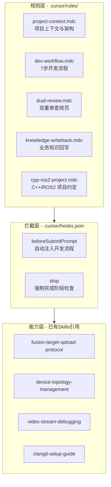

# Harness Engineering 开发环境搭建

## 现状分析

当前工作区 **没有** 项目级 `.cursor/` 目录，所有规则和技能都在用户级 `~/.cursor/` 下。缺失以下关键组件：

- 没有 `.cursor/rules/` (项目级规则)
- 没有 `.cursor/hooks.json` (流程自动化)
- 没有 `.cursor/hooks/` (Hook 脚本)
- 没有项目上下文文件 (CLAUDE.md / AGENTS.md 等效物)

已有的基础：

- 用户级 37 条规则 (`~/.cursor/rules/`)，包含 `commit-cn`, `code-review-cn`, `bug-fix-cn` 等
- 用户级 9 个领域 Skill (`~/.cursor/skills/`)，覆盖 融合上报/设备拓扑/视频流/clangd 等
- `cursor-ide-browser` MCP 已配置

---

## 架构总览




---

## 第一层：规则层 (.cursor/rules/)

创建 5 个项目级规则文件，全部放在 `.cursor/rules/` 下：

### 1. `project-context.mdc` — 项目上下文 (alwaysApply: true)

等效于 CLAUDE.md，让 AI 在每次对话开始时就理解项目全貌：

- 项目名称：PTZ100 AGX 反无人机系统
- 架构：ROS2 colcon 工作区 (`ros_ws/`) + CMake 独立构建 (`src/`)
- 核心模块：PTZ 云台服务、激光服务、AI 推理、雷达-视觉融合、电子围栏、云融合网关
- 设备 SDK：`iotDevices/` (和普 PTZ、激光器、GNSS、传感器)
- 公共库：`public/` (config、GStreamer、socket、MQTT、utils)
- 构建方式：colcon build (ROS2) + cmake (独立 app)
- 目标平台：NVIDIA Jetson AGX (aarch64, Linux 5.15.136-tegra)
- 编译数据库：根目录 `compile_commands.json`

### 2. `dev-workflow.mdc` — 7 步开发流程 (alwaysApply: true)

将视频中的 7 步流程编码为 AI 的标准工作方式：

1. 梳理上下文 — 读取相关文件，理解改动范围
2. 规划 — 列出需要修改的文件和改动方案
3. 实现 — 编写代码
4. 实现审查 — 用 readonly Task 检查功能正确性
5. 质量审查 — 用 Task 检查代码质量并优化
6. 测试 — 编译验证 / 运行测试
7. 知识回写 — 将新发现的业务规则写入 Skill 或规则文件

### 3. `dual-review.mdc` — 双重审查规范 (alwaysApply: false, description 触发)

规定审查的具体执行方式：

- 实现审查：启动 `readonly: true` 的 Task subagent，只检查功能是否满足需求，输出审查报告
- 质量审查：启动 `readonly: false` 的 Task subagent，检查代码质量（线程安全、内存管理、错误处理），可直接修复问题
- 两步审查之间传递上下文：实现审查的结论作为质量审查的输入

### 4. `knowledge-writeback.mdc` — 业务知识回写 (alwaysApply: false, description 触发)

指导 AI 在完成任务后主动回写知识：

- 何时触发：修复了一个隐含的业务规则、发现了文档未记录的约束、解决了一个反复出现的问题
- 回写目标：更新或创建 `~/.cursor/skills/` 下的 SKILL.md，或在 `doc/` 下补充文档
- 回写格式：包含问题背景、决策理由、边界情况、代码位置引用

### 5. `cpp-ros2-project.mdc` — C++/ROS2 项目约定 (globs: `**/*.cpp, **/*.hpp, **/*.h, **/CMakeLists.txt, **/package.xml`)

项目特定的编码约定：

- 引用已有的 `embedded-cpp-cn.mdc` 和 `ros2-node-cn.mdc` 中的规则
- 补充项目特有约定：命名空间、日志宏、消息类型命名
- 构建命令参考：`colcon build --packages-select <pkg>`

---

## 第二层：拦截层 (.cursor/hooks.json + .cursor/hooks/)

### 1. `hooks.json` — Hook 配置文件

```json
{
  "version": 1,
  "hooks": {
    "beforeSubmitPrompt": [
      {
        "type": "prompt",
        "prompt": "...(注入7步流程提示)",
        "matcher": "UserPromptSubmit"
      }
    ],
    "stop": [
      {
        "command": ".cursor/hooks/check-workflow-phase.sh",
        "loop_limit": 3
      }
    ]
  }
}
```

### 2. `beforeSubmitPrompt` Hook — 自动注入流程

使用 **prompt 类型** hook，在用户提交 prompt 时自动注入标准化流程提示，让 AI 按照 7 步流程执行。

### 3. `stop` Hook — 阶段完成检查

使用 **command 类型** hook (`check-workflow-phase.sh`)：

- 检查 AI 是否完成了当前阶段的所有步骤
- 如果未完成，返回 `followup_message` 让 AI 继续
- 设置 `loop_limit: 3` 防止无限循环
- 仅在需求补充和偏差裁决时才允许停止

---

## 第三层：能力层 (Skills 组织)

已有的 Skills 已经覆盖核心领域，无需重复创建。计划：

- 在 `project-context.mdc` 中列出可用 Skills 及其用途，引导 AI 在适当时机调用
- 后续通过"知识回写"机制持续积累新 Skill

---

## 目录结构预览

```
/home/skyfend/workspace/ptz100_agx/
  .cursor/
    rules/
      project-context.mdc      # 项目上下文 (alwaysApply)
      dev-workflow.mdc          # 7步开发流程 (alwaysApply)
      dual-review.mdc           # 双重审查规范
      knowledge-writeback.mdc   # 业务知识回写
      cpp-ros2-project.mdc      # C++/ROS2 约定
    hooks.json                  # Hook 配置
    hooks/
      check-workflow-phase.sh   # stop hook 脚本
```

---

## 备份机制

通过 crontab 每天自动备份项目级 `.cursor/` 到 `/home/skyfend/ywj/`，防止被误删。

### 备份脚本 `/home/skyfend/bin/backup-cursor-config.sh`

```bash
#!/bin/bash
SRC="/home/skyfend/workspace/ptz100_agx/.cursor"
DST="/home/skyfend/ywj/ptz100_agx_cursor_backup"
[ -d "$SRC" ] && rsync -a --delete "$SRC/" "$DST/"
```

### crontab 条目

```
0 2 * * * /home/skyfend/bin/backup-cursor-config.sh
```

每天凌晨 2 点执行，使用 rsync 增量同步，保持备份与源目录一致。

恢复方式：`cp -r /home/skyfend/ywj/ptz100_agx_cursor_backup /home/skyfend/workspace/ptz100_agx/.cursor`

---

## 实施顺序

先搭建规则层（立即生效，零风险），再搭建拦截层（需要测试验证），最后配置备份 crontab。