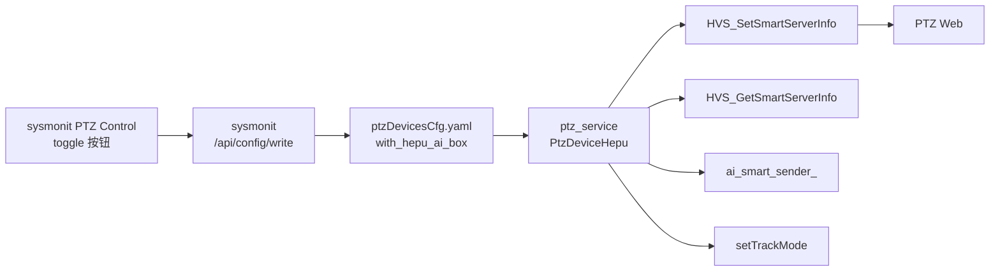

# Hepu AI Box 场景自适配方案

## 场景对照

- **场景 A（接和普 AI 盒子）**：PTZ Web 的"智能分析服务器" = 盒子 IP:端口（示例 192.168.2.249:7000，**由用户另行提供，不写死**），AGX 不启动 ai_smart_sender_，跟踪模式 = `TRACK_DETECT_AUTO(5)` 识别自适应
- **场景 B（无盒子，默认）**：PTZ Web 的"智能分析服务器" = **本机 eth1 IP**:`HEPU_AI_SMART_UDP_PORT`(39080)，AGX 启动 ai_smart_sender_，跟踪模式 = `TRACK_AIR_SEMIAUTO(0)` 对空半自动

## 数据流




## 核心改动清单（按文件）

### 1. `public/config/yamlConfig/ptzDevicesCfg.h`

- `PtzDeviceParam` 新增字段 `bool with_hepu_ai_box{false};`（默认 false = 场景 B）

### 2. `public/config/yamlConfig/ptzDevicesCfg.cpp`

- `readFromFile`：按现有四必填字段之外，把 `with_hepu_ai_box` 作为**可选**字段读取；缺失时不触发 `keyIsMissing`，直接默认 `false`（向后兼容旧 yaml）
- `writeToFile`：写出 `with_hepu_ai_box` 键
- `createInitCfg`：默认模板两条记录都填 `with_hepu_ai_box: 0`

### 3. `ros_ws/src/ptz_service/src/ptzDevice/ptzDeviceHepu.h`

- 新增私有成员 `bool withHepuAiBox_{false};`（从 yaml 读取后保存）
- 保留之前已加的 `cachedSmartServer_` / `cachedSmartServerValid_`

### 4. `ros_ws/src/ptz_service/src/ptzDevice/ptzDeviceHepu.cpp`

**4.1 `loadPtzConfigBySn`**：从 `PtzDeviceParam` 把 `with_hepu_ai_box` 拷到成员 `withHepuAiBox_`

**4.2 `startVideoPipeline` 第 10/11 段**改为：

```
if (withHepuAiBox_) {
    // 场景 A：不启动 ai_smart_sender_
    // 期望 PTZ Web 配置 = 盒子 IP/端口，由人工填（SDK 不知盒子 IP）
    // 只查询并透传给 sysmonit 展示；若未启用或未指向第三方，只 WARN 一次
} else {
    // 场景 B：先下发 HVS_SetSmartServerInfo(enable=1, mode=UDP, udpAddr=eth1IP, udpPort=39080)
    // 再启动 ai_smart_sender_
    // 查询并透传给 sysmonit 展示
}
```

关键子操作：

- 新增静态方法 `std::string getIfaceIpv4("eth1")`（参考 sysmonit/main.cpp:848 实现）
- 先 `HVS_GetSmartServerInfo` 读当前配置 → 若与期望不一致再 `HVS_SetSmartServerInfo` 下发（减少不必要写入）
- SDK 写接口在 `HepuPtzCtrl` 里包一层：新增 `int32_t setSmartServerInfo(const HepuSmartServerInfo& info);`

**4.3 `configureOnceAfterConnected` 跟踪模式选择**（当前约 1623-1640 行）：

```cpp
int32_t trackMode = withHepuAiBox_ ? TRACK_DETECT_AUTO : TRACK_AIR_SEMIAUTO;
// 对 VT_LIGHT / VT_IRD 都用 trackMode
```

并修正日志文案不一致问题（现有日志写 `TRACK_AIR_SEMIAUTO` 实际传 `TRACK_DETECT_AUTO`）。

### 5. `iotDevices/ptzHepuSDK/include/ptz_hepu_ctrl.h` + `src/ptz_hepu_ctrl.cpp`

- 新增 `int32_t setSmartServerInfo(const HepuSmartServerInfo& info);` 封装 `HVS_SetSmartServerInfo`
- 实现里把 `HepuSmartServerInfo` 映射到 `SmartServerInfo_t`（只填 UDP 模式需要的字段 + enable + mode），成功/失败都打日志

### 6. `ros_ws/src/sysmonit/src/main.cpp` + `web/index.html`

- **后端**：新增缓存/透出 `with_hepu_ai_box` 的途径。两种方案二选一：
  - 方案 a（推荐，零后端改动）：前端直接调已有 `GET /api/config/read?file=ptzDevicesCfg.yaml` 读 yaml，解析字段展示；toggle 后通过 `POST /api/config/write` 写回
  - 方案 b：扩展 `/api/video` JSON 加 `with_hepu_ai_box` 字段（需 ptz_service 先把它加到 `PtzDeviceInfo.msg`）
- **前端 index.html**：在 PTZ Control 卡片顶部、紧邻现有 `ptz-smart-server-list` 下方，新增一行开关：
  - 显示文本 "接和普 AI 盒子：[ON/OFF]"
  - 点击弹确认对话框 -> 写入 yaml -> 提示"需要重启 ptz_service 生效"
  - 若用户在 sysmonit 已有"重启 ptz_service"按钮，可一并显示提示

### 7. `ros_ws/src/srp100_message/skyfend_interfaces/msg/ptz_msg/PtzDeviceInfo.msg`（可选）

若选后端方案 b：新增 `bool with_hepu_ai_box`，供 sysmonit 实时显示当前 ptz_service 实际在用的场景（避免 yaml 改完未重启导致前端显示不一致）。**推荐做这个**，成本低、观感好。

## 关键代码片段预览

**ptzDevicesCfg.cpp::readFromFile 可选字段片段**：

```cpp
dev.with_hepu_ai_box = false; // 默认场景 B
if (devNode["with_hepu_ai_box"]) {
    dev.with_hepu_ai_box = devNode["with_hepu_ai_box"].as<int>() != 0;
}
```

**ptzDeviceHepu.cpp 场景分支伪代码**：

```cpp
if (withHepuAiBox_) {
    LOG_INFO("[PtzHepu] 场景 A：外接和普 AI 盒子，本节点不启动 ai_smart_sender_，跟踪模式=识别自适应");
    // 仅查询 + 透传展示，不下发（盒子 IP 由人工填）
    deviceApi_->ctrl->getSmartServerInfo(cachedSmartServer_);
} else {
    LOG_INFO("[PtzHepu] 场景 B：直连 AGX，本节点启动 ai_smart_sender_，跟踪模式=对空半自动");
    std::string eth1 = getIfaceIpv4("eth1");
    HepuSmartServerInfo desired{true, 1 /*UDP*/, eth1, HEPU_AI_SMART_UDP_PORT};
    HepuSmartServerInfo cur{};
    if (deviceApi_->ctrl->getSmartServerInfo(cur) == 0 &&
        (!cur.enable || cur.mode != 1 ||
         cur.udp_addr != eth1 || cur.udp_port != HEPU_AI_SMART_UDP_PORT)) {
        LOG_WARN("[PtzHepu] PTZ Web 当前配置与期望不符，自动下发: %s:%d", eth1.c_str(), HEPU_AI_SMART_UDP_PORT);
        deviceApi_->ctrl->setSmartServerInfo(desired);
    }
    deviceApi_->ctrl->getSmartServerInfo(cachedSmartServer_); // 重新查一次作展示
    ai_smart_sender_ = std::make_unique<PtzHepuSmart>(...);
    ai_smart_sender_->start();
}
```

## 风险与注意

- `**HVS_SetSmartServerInfo` 副作用**：可能会触发 PTZ 内部重启某些服务，建议在日志里警示
- **多台 PTZ**：每台独立 `with_hepu_ai_box`，互不干扰（得益于架构已改为多设备）
- **yaml 写回时丢注释**：sysmonit 的 `write_config_file` 直接覆盖，可能丢失用户手写注释；已存在备份 `.bak` 机制
- **向后兼容**：旧 yaml 无该字段 → 默认场景 B → 与现行代码行为一致（除跟踪模式：现行硬编码 `TRACK_DETECT_AUTO`，新方案默认走 `TRACK_AIR_SEMIAUTO`，**这是现行行为的改变，需要你确认**）
- **onAiDetectionResults 行为**：场景 A 下 `ai_smart_sender_` 为 null，现有代码已有 `if (!ai_smart_sender_)` 分支，但原本是 WARN 级日志，建议改为 DEBUG 以避免刷屏

