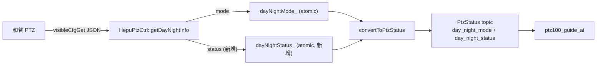

## 关键背景

- 微信讨论确认：`dayNightMode` (ICR 设置：白天/黑夜/自动/定时) 与 `dayNightStatus` (当前实际感知：白天/夜晚) **不是同一字段**，自动模式下只有 `dayNightStatus` 能告诉引导端"实际是彩色还是黑白"。
- SDK 已在 `VisibleLightImageInfo_t.dayNightStatus` ([thirdpart/hepuSdk/include/datdefs.h:2052](thirdpart/hepuSdk/include/datdefs.h)) 暴露此字段。
- 但当前 develop 已经走 `visibleCfgGet` JSON 路径取 `dayNightMode` ([iotDevices/ptzHepuSDK/src/ptz_hepu_ctrl.cpp:601](iotDevices/ptzHepuSDK/src/ptz_hepu_ctrl.cpp))，同一份响应里**就带着 `dayNightStatus`**（见你给的协议截图），只多解一字段即可，无需新增网络调用。
- `getDayNightMode` 只有 1 个 caller (`PtzDeviceHepu::dayNightPollLoop`)，重命名/扩签名零跨包风险。

## 改动 1：SDK 控制类一次返回 mode + status

文件：

- [iotDevices/ptzHepuSDK/include/ptz_hepu_ctrl.h](iotDevices/ptzHepuSDK/include/ptz_hepu_ctrl.h)
- [iotDevices/ptzHepuSDK/src/ptz_hepu_ctrl.cpp](iotDevices/ptzHepuSDK/src/ptz_hepu_ctrl.cpp)

把现有 `int32_t getDayNightMode(int32_t& mode);` **直接替换**为：

```cpp
// 一次 visibleCfgGet 同时返回:
//   mode   : 和普 dayNightMode  (0=白天/1=黑夜/2=自动/3=定时)        — 用户手动设置的 ICR 模式
//   status : 和普 dayNightStatus (0=白天/1=夜晚)                       — PTZ 当前实际感知, 自动模式下尤其关键
// 任一字段缺失/解析失败时, 该出参保持 -1, 函数仍返回 0 (尽量给上层尽可能多的信息).
// 完全失败 (sendCommonCmd 失败) 才返回 -1.
int32_t getDayNightInfo(int32_t& mode, int32_t& status);
```

实现：

- 仍走 `sendCommonCmd("visibleCfgGet", "{\"mode\":0}", resp, 4096)`。
- 抽一个内部小 lambda `parseInt(resp, "\"dayNightMode\"")` 复用现有 sscanf 风格的解析，分别提取 `dayNightMode` 与 `dayNightStatus`。
- 失败日志保留 LOG_ERROR；成功 LOG_DEBUG 打两个值。

唯一 caller (`dayNightPollLoop`) 是同 PR 内统一更新（见改动 3），不留 `getDayNightMode` 兼容包装以免歧义。

## 改动 2：PtzStatus.msg 新增字段

文件：[ros_ws/src/srp100_message/skyfend_interfaces/msg/ptz_msg/PtzStatus.msg](ros_ws/src/srp100_message/skyfend_interfaces/msg/ptz_msg/PtzStatus.msg)

在现有 `day_night_mode` 段下追加：

```
# -- day_night_status enum: 和普 PTZ 当前实际感知的日夜状态 (与 day_night_mode 区别在于:
#    day_night_mode 是 ICR 设置, 自动模式下不能告诉你"实际"是白天还是黑夜;
#    day_night_status 在手动 + 自动模式下都返回实际感知值, 引导端在 PTZ 自动模式下应优先用此字段)
uint8 DAY_NIGHT_STATUS_DAY     = 0    # 当前实际白天 (彩色)
uint8 DAY_NIGHT_STATUS_NIGHT   = 1    # 当前实际黑夜 (黑白 / IR cut)
uint8 DAY_NIGHT_STATUS_UNKNOWN = 255  # 未连通 / 查询失败 / 字段缺失 (不要回退到 DAY, 否则误导引导算法)

uint8 day_night_status  # 和普 PTZ visibleCfgGet.dayNightStatus, 见 day_night_status enum
```

## 改动 3：PtzDeviceHepu 缓存与透传

文件：

- [ros_ws/src/ptz_service/src/ptzDevice/ptzDeviceHepu.h](ros_ws/src/ptz_service/src/ptzDevice/ptzDeviceHepu.h)
- [ros_ws/src/ptz_service/src/ptzDevice/ptzDeviceHepu.cpp](ros_ws/src/ptz_service/src/ptzDevice/ptzDeviceHepu.cpp)

(1) 头文件 `dayNightMode`_ 旁加：

```cpp
std::atomic<uint8_t> dayNightStatus_{255};  // 初始 UNKNOWN(255); 失败/未连通同样回退 UNKNOWN
```

(2) `dayNightPollLoop()` 改用新接口，同时刷新两个 atomic：

```cpp
while (dayNightPollRunning_.load()) {
    uint8_t outMode   = 2;   // 默认 AUTO (沿用现状)
    uint8_t outStatus = 255; // 默认 UNKNOWN (新增)
    if (deviceApi_ && deviceApi_->ctrl && deviceApi_->ctrl->isReallyConnected()) {
        int32_t rawMode   = -1;
        int32_t rawStatus = -1;
        int32_t ret = deviceApi_->ctrl->getDayNightInfo(rawMode, rawStatus);
        if (ret == 0) {
            // mode 映射保持原逻辑
            if      (rawMode == 0) outMode = 0; // DAY
            else if (rawMode == 1) outMode = 1; // NIGHT
            // rawMode==2/3/其它 -> AUTO

            // status 直接透传 0/1, 其它值 (含 -1 缺失) 维持 UNKNOWN(255)
            if      (rawStatus == 0) outStatus = 0; // DAY
            else if (rawStatus == 1) outStatus = 1; // NIGHT
        }
    }
    dayNightMode_.store(outMode);
    dayNightStatus_.store(outStatus);
    sleepInterruptible(...);
}
```

(3) `stopVideoPipeline()` 在重置 `dayNightMode_.store(2)` 旁加：

```cpp
dayNightStatus_.store(255);  // 管线停止后回退到 UNKNOWN, 避免引导端拿到陈旧 DAY/NIGHT
```

(4) `convertToPtzStatus` 紧跟现有 `ptz_status.day_night_mode` 一行后追加：

```cpp
ptz_status.day_night_status = dayNightStatus_.load();
```

## 不做的事

- 不动 `day_night_mode` 字段语义/枚举/回退逻辑（向后兼容）。
- 不修改 `ptz100_guide_ai` 等下游消费者（纯增量字段，他们想用再用）。
- 不改用 `HVS_GetLightImgInfo` 二进制接口（一次 JSON 已能拿全 mode + status，无需引入巨大结构体和 mode 参数）。
- 不动 `setIcr` / `getDayNightMode` 之外的 ICR 相关逻辑。

## 影响面




## 验证

- `colcon build --packages-select skyfend_interfaces ptz_service` 通过。
- 节点起来连上和普 PTZ 后，`ros2 topic echo /ptz_status` 看到 `day_night_status` 在 `0/1` 之间随实际光照变化（或手动 ICR 切换时）。
- 断开 PTZ 网线 5–10s 后该字段回退到 `255 (UNKNOWN)`，与 `day_night_mode = 2 (AUTO)` 行为对称。
- PTZ Web 切到"自动"档下，对镜头遮光 → `day_night_mode` 仍报 AUTO(2)，但 `day_night_status` 应能从 0 翻到 1，验证"自动模式下也有真实反馈"的核心需求。

