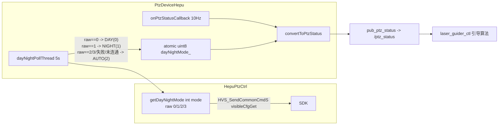

## 方案概览



和普查询走独立线程 5s 一次，不阻塞 10Hz 回调；引导算法需要 DAY / NIGHT / AUTO 三态信息。映射规则：和普原值 `0=Day` → DAY(0)，`1=Night` → NIGHT(1)；其它（`2=Auto` / `3=Timing` / 查询失败 / 未连通 / 耐杰 PTZ）全部回落到 AUTO(2)。这样只有"PTZ 明确读到白天或黑夜"时才把对应具体值给引导端，否则一律告诉引导端"自动/未知"，避免把未连通/错误状态误报成 DAY。

## 变更清单

### 1. msg 字段新增 (DAY / NIGHT / AUTO 三态)

[ros_ws/src/srp100_message/skyfend_interfaces/msg/ptz_msg/PtzStatus.msg](ros_ws/src/srp100_message/skyfend_interfaces/msg/ptz_msg/PtzStatus.msg) 在文件末尾追加 (放在最后, 不影响旧字段偏移):

```
# -- day_night_mode enum: ICR 日夜状态
# 仅和普 PTZ 实际驱动;  查询失败 / 未连通 / 和普 TIMING(定时) 模式统一回落到 AUTO
uint8 DAY_NIGHT_MODE_DAY   = 0    # 白天 (彩色 / 非黑夜)
uint8 DAY_NIGHT_MODE_NIGHT = 1    # 黑夜 (红外 / IR cut)
uint8 DAY_NIGHT_MODE_AUTO  = 2    # 自动 (和普 visibleCfgGet.dayNightMode == 2)

uint8 day_night_mode  # 当前 PTZ ICR 模式, 见 day_night_mode enum
```

注意: 这里与 `PtzDetectCameraStatus.msg` 里的 `ICR_VALUE_ON/OFF/AUTO` (C2 控制/回传链路, ON=0 表示夜视) 是两套独立的 enum, 数值含义不相同, 调用方按常量名语义使用即可, 不需要数值对齐.

### 2. HepuPtzCtrl 新增查询接口 (保留原始 4 态返回, 不在这里做收敛)

[iotDevices/ptzHepuSDK/include/ptz_hepu_ctrl.h](iotDevices/ptzHepuSDK/include/ptz_hepu_ctrl.h) 在 `setIcr(int mode)` 下方增加:

```cpp
// 查询当前 ICR 日夜切换状态; 内部走 HVS_SendCommonCmdS("visibleCfgGet", {"mode":0}, ...),
// 只解析 dayNightMode 字段, 仍返回和普原值 (0=day, 1=night, 2=auto, 3=timing),
// 由调用方决定如何对外表达 (ptz_service 会把 1->NIGHT, 2->AUTO, 其它->DAY).
// 返回 0 成功并填 mode, -1 失败 (mode 不变).
int32_t getDayNightMode(int32_t& mode);
```

[iotDevices/ptzHepuSDK/src/ptz_hepu_ctrl.cpp](iotDevices/ptzHepuSDK/src/ptz_hepu_ctrl.cpp) 实现复用已存在的 `sendCommonCmd`:

```cpp
int32_t HepuPtzCtrl::getDayNightMode(int32_t& mode) {
    if (!isReallyConnected()) { LOG_WARN("Not really connected"); return -1; }
    std::string resp;
    int32_t ret = sendCommonCmd("visibleCfgGet", "{\"mode\":0}", resp, 4096);
    if (ret != 0) return -1;
    auto pos = resp.find("\"dayNightMode\"");
    if (pos == std::string::npos) { LOG_ERROR("visibleCfgGet resp no dayNightMode: %s", resp.c_str()); return -1; }
    pos = resp.find(':', pos);
    if (pos == std::string::npos) return -1;
    ++pos;
    while (pos < resp.size() && (resp[pos] == ' ' || resp[pos] == '\t')) ++pos;
    int v = 0;
    if (sscanf(resp.c_str() + pos, "%d", &v) != 1) { LOG_ERROR("parse dayNightMode fail: %s", resp.c_str()); return -1; }
    mode = v;
    LOG_DEBUG("getDayNightMode raw=%d", v);
    return 0;
}
```

说明: 不做全量 JSON 解析, 与工程现有风格 (`getTrackingStatus`/smart server 解析) 一致; 只读首个 `dayNightMode` 键.

### 3. PtzDeviceHepu 周期查询 + 向 PtzStatus 做三态收敛

[ros_ws/src/ptz_service/src/ptzDevice/ptzDeviceHepu.h](ros_ws/src/ptz_service/src/ptzDevice/ptzDeviceHepu.h) 新增成员:

```cpp
// ICR 日夜状态周期查询 (5s); 对外表达 DAY(0)/NIGHT(1)/AUTO(2),
// 和普 raw==2(Auto) / raw==3(Timing) / 查询失败 / 未连通 都回落到 AUTO(2).
std::atomic<uint8_t> dayNightMode_{2};   // 初始 AUTO
std::thread          dayNightPollThread_;
std::atomic<bool>    dayNightPollRunning_{false};

void dayNightPollLoop();   // 5s 周期: getDayNightMode -> 三态收敛 -> dayNightMode_
```

[ros_ws/src/ptz_service/src/ptzDevice/ptzDeviceHepu.cpp](ros_ws/src/ptz_service/src/ptzDevice/ptzDeviceHepu.cpp):

- 实现 `dayNightPollLoop()`: 5s 周期里调 `getDayNightMode(raw)`，映射规则：
  - `ret==0 && raw==0` -> 0 (DAY)
  - `ret==0 && raw==1` -> 1 (NIGHT)
  - 其它（raw==2 Auto / raw==3 Timing / 未连通 / 查询失败 / 解析失败）-> 2 (AUTO)
- 在 `startVideoPipeline()` 末尾启动线程 (`dayNightPollRunning_ = true; dayNightPollThread_ = std::thread(&PtzDeviceHepu::dayNightPollLoop, this);`), 在 `stopVideoPipeline()`/析构里 stop+join, 并把 atomic 重置为 2 (AUTO)。
- `convertToPtzStatus` 末尾追加一行:

```cpp
ptz_status.day_night_mode = dayNightMode_.load();  // 0=DAY, 1=NIGHT, 2=AUTO
```

### 4. 耐杰 / 其它 PTZ

- 耐杰 PTZ 当前不具备 ICR 查询能力，其发布链路 (`ptz100_ros`) 对 `day_night_mode` 不主动赋值，ROS 默认会是 0 (=DAY)。由于 `ptz100_ros` 不经过本服务，**若耐杰侧也希望默认回落到 AUTO(2)**，需要在 `ptz100_ros` 端的 `convertToPtzStatus` / 发布前赋一句 `ptz_status.day_night_mode = skyfend_interfaces::msg::PtzStatus::DAY_NIGHT_MODE_AUTO;`；这属于跨模块改动，不在本方案范围，引导侧暂按"收到 0 就当 DAY、收到 2 就当未确定"解释即可，后续再跟进。
- 若后续耐杰具备 ICR 查询能力，再按与和普一致的"raw==0 → DAY, raw==1 → NIGHT, 其它 → AUTO"规则填充即可。

### 5. 编译/部署

- 改了 `.msg` 必须先重编 `skyfend_interfaces`, 再重编 `ptz_service`:
`colcon build --packages-select skyfend_interfaces && colcon build --packages-select ptz_service`
- 由于仓里频繁出现 clock skew 导致的增量 build 漏编 (典型症状：`undefined reference to HepuPtzCtrl::getDayNightMode`)，碰到时先 `rm -rf ros_ws/build/ptz_service ros_ws/install/ptz_service ros_ws/build/ptz_service_ptzHepuSDK* ...` 或 `find ros_ws/build -exec touch {} +` 再重编。
- 引导侧 (laser_guider_ctl 等) 消费新字段时也需要把 skyfend_interfaces 重新链一次。

## 需要注意

- **三态收敛策略**：和普 `dayNightMode` 原始有 4 档 (0/1/2/3)，本方案把 `0=Day -> DAY(0)`、`1=Night -> NIGHT(1)` 透传给引导端；`2=Auto` 和 `3=Timing(定时)` 一起折叠到 AUTO(2)，与"查询失败 / 未连通 / 耐杰 PTZ"共用同一个回退值。若后续 Timing 需要独立回传，只需在 msg 里加一个 `DAY_NIGHT_MODE_TIMING=3` 并把 `dayNightPollLoop` 的 `raw==3` 分支改为 `outMode=3`，完全向后兼容。
- 5s 周期查询失败 (断线/超时/解析失败) 立即把 atomic 置 2 (AUTO)，让引导端明确区分"明确读到 DAY/NIGHT"与"不确定"，避免把未连通状态误报成 DAY 或 NIGHT。
- visibleCfgGet 返回体较大 (~几十个字段 KB 级), 分配 4096 字节 buffer；dayNightMode 基本在返回体前部, 截断不影响解析。
- 查询线程只在 pipeline running 期间活跃, 避免设备未连通时刷日志; `sendCommonCmd` 内部已 `isReallyConnected` 保护。

