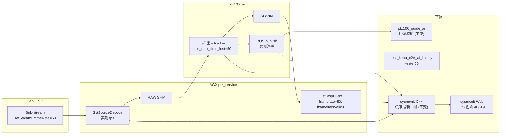

# 和普 PTZ 帧率 25 → 50 fps

## 关键风险 / 前置确认

- SDK 头 `[thirdpart/hepuSdk/include/datdefs.h](thirdpart/hepuSdk/include/datdefs.h)` L1576 的 `visibleMaxFrameRate` 能力枚举只列了 `0=25fps / 1=30fps`。和普二码流默认能力可能不足 50fps; 实际范围由设备运行时返回的 `framerateRange[1]` 决定。
- `[iotDevices/ptzHepuSDK/src/ptz_hepu_ctrl.cpp](iotDevices/ptzHepuSDK/src/ptz_hepu_ctrl.cpp)` L1769-L1772 会把超界帧率自动 clamp 并打 LOG_WARN, 但 GStreamer 推流 caps 仍按 50 写, 上下游帧率不一致会导致编码端时间戳错乱 / 推流卡顿。
- 因此**实施前必须先做一次能力探测**: 在 PTZ Web 二码流帧率下拉框确认是否能选到 50fps (设备未升级到支持 50 → 走方案 B 维持现状或与供应商对齐); 或临时打补丁 LOG 出 `framerateRange` 后再决定。
- 算力侧: AI 推理需在 ~20ms/帧 内完成 (现 25fps 预算 ~40ms), GPU 占用、AI 节点延迟告警 (`[ros_ws/src/ptz100_ai/skyfend_ai_main/ai_main.cpp](ros_ws/src/ptz100_ai/skyfend_ai_main/ai_main.cpp)` ms>200 告警) 实际表现需在测试时观察。

## 主链路 (必改)

### 1. 顶部宏定义: 帧率单点开关

在 `[ros_ws/src/ptz_service/src/ptzDevice/ptzDeviceHepu.cpp](ros_ws/src/ptz_service/src/ptzDevice/ptzDeviceHepu.cpp)` L41 (`#define HEPU_THERMAL_HEIGHT 512`) 之后, 紧贴现有 `HEPU_VISIBLE_*/HEPU_THERMAL_`* 宏区块, 新增三宏:

```cpp
// 视频帧率 / GOP / 编码 I 帧间隔 (单点开关)
//   - HEPU_VIDEO_FRAMERATE      : 帧率, 同时决定 SDK 二码流帧率与 GstRtspClient 推流 caps;
//                                 改这一处即可全链路联动. 必须 ≤ PTZ 二码流 framerateRange[1]
//                                 上限, 否则会被 SDK clamp, 与推流 caps 不一致导致编码时
//                                 间戳错乱.
//   - HEPU_VIDEO_GOP            : SDK 二码流 GOP, 默认 1s 一个 I 帧 (= 帧率).
//   - HEPU_VIDEO_IFRAME_INTERVAL: GstRtspClient 编码端 I 帧间隔 (单位"帧"), 默认 1s 一个
//                                 I 帧 (= 帧率), 与 GOP 对齐减小 RTP 缓冲压力.
#define HEPU_VIDEO_FRAMERATE       50
#define HEPU_VIDEO_GOP             HEPU_VIDEO_FRAMERATE
#define HEPU_VIDEO_IFRAME_INTERVAL HEPU_VIDEO_FRAMERATE
```

说明:

- 后续切回 25 / 切到 30 等只动 `HEPU_VIDEO_FRAMERATE` 一处。
- 如果将来想恢复 2s/I 帧 (原 25fps 下 iframeinterval=50 的语义), 把 `HEPU_VIDEO_IFRAME_INTERVAL` 改成 `(HEPU_VIDEO_FRAMERATE * 2)` 即可, GOP 不受影响。

### 2. 应用宏: 替换 6 处硬编码

`[ros_ws/src/ptz_service/src/ptzDevice/ptzDeviceHepu.cpp](ros_ws/src/ptz_service/src/ptzDevice/ptzDeviceHepu.cpp)` 内 4 + 2 处:

(a) GstRtspClient::Param 推流 caps (L46-L74):

```cpp
static GstRtspClient::Param s_visibleRtspParam = {
    ...
    HEPU_VIDEO_IFRAME_INTERVAL,        // iframeinterval  (原: 50)
    HEPU_VISIBLE_WIDTH,
    HEPU_VISIBLE_HEIGHT,
    0, 0,
    HEPU_VIDEO_FRAMERATE               // framerate       (原: 25)
};
static GstRtspClient::Param s_thermalRtspParam = {
    ...
    HEPU_VIDEO_IFRAME_INTERVAL,        // iframeinterval  (原: 50)
    HEPU_THERMAL_WIDTH,
    HEPU_THERMAL_HEIGHT,
    0, 0,
    HEPU_VIDEO_FRAMERATE               // framerate       (原: 25)
};
```

(b) SDK 二码流帧率 / GOP (L1813-L1830):

```cpp
// 当前
const int32_t TARGET_FRAME_RATE = 25;
const int32_t TARGET_GOP = 25;
// 改后 (宏化, 单点开关)
const int32_t TARGET_FRAME_RATE = HEPU_VIDEO_FRAMERATE;
const int32_t TARGET_GOP        = HEPU_VIDEO_GOP;
```

- LOG_INFO 文案保留 `%dfps` 占位符自动反映新值; 周边 `hasInitStreamFrameRate.compare_exchange_strong` 重试机制不动。
- **不动**比特率 (visible 4Mbps / thermal 2Mbps): 帧率翻倍不必同步翻倍码率, 首测先看实际画质再决定是否上调; 若画质明显劣化可后续把 visible 调到 6Mbps、thermal 调到 3Mbps。

### 3. AI tracker 帧数窗口

`[ros_ws/src/ptz100_ai/perception/tracker/src/tracker.cpp](ros_ws/src/ptz100_ai/perception/tracker/src/tracker.cpp)` L43-L46:

```cpp
// 当前
m_max_time_lost = 25;   // 单位是帧数 → 25fps 下约 1s 容忍
// 目标
m_max_time_lost = 50;   // 50fps 下保持 1s wall-clock 容忍
```

**不动**的相关阈值 (改动收益不明显, 留作首测观察):

- AI 单帧推理 `ms > 200` 告警 (`[ai_main.cpp](ros_ws/src/ptz100_ai/skyfend_ai_main/ai_main.cpp)` L2012)
- 热像 det/track 切换 `pre_elapsed_time < 35` (同上 L1740 / L1850)
- 日志周期 `frame_id % 40 == 0` (同上 L1797 / L1905)
- `perception.cpp` `base_dt_30fps=0.033f` (运行时按真实 ts 缩放, 不影响)

### 4. E2E 测试脚本默认 rate

`[ros_ws/src/ptz_service/scripts/ai_link_test/test_hepu_e2e_ai_link.py](ros_ws/src/ptz_service/scripts/ai_link_test/test_hepu_e2e_ai_link.py)`:

- L629 (e2e 子命令): `default=25.0` → `50.0`
- L643 (pub-vis): `default=25.0` → `50.0`
- L648 (pub-ir):  `default=25.0` → `50.0`
- 默认 `n_frames = rate × duration = 50 × 3 = 150` (脚本本身按公式计算, 无需改)

### 5. sysmonit Web FPS 健康色阶

`[ros_ws/src/sysmonit/web/index.html](ros_ws/src/sysmonit/web/index.html)` L1925:

```js
function fpsColor(v) { return v >= 20 ? '#3fb950' : v >= 10 ? '#d29922' : v > 0 ? '#f85149' : '#484f58'; }
function fpsColor(v) { return v >= 40 ? '#3fb950' : v >= 20 ? '#d29922' : v > 0 ? '#f85149' : '#484f58'; }
```

绿/黄/红三档同步从 (20, 10) 提升到 (40, 20), 保持"目标值 80% / 40%"的语义。

### 6. readme 文案同步

`[ros_ws/src/ptz_service/scripts/ai_link_test/readme.md](ros_ws/src/ptz_service/scripts/ai_link_test/readme.md)` L34-L35 / L86 (以及任何 "25Hz × 3s = 75 帧" 描述) 同步改为 "50Hz × 3s = 150 帧"。

## 不做的事 / 不影响

- 旧示例程序 (`public/gstNvDeeps/examples/*.cpp`、`src/app/alg_app/alg_app.cpp`、`src/app/ptz/ptz_app.cpp`) 的 framerate=25 与生产链路无关, 不改; 文档 `gstRtspClient.h` L132 示例 25 是注释, 不改。
- 共享内存 `[public/shmTransferFrame/](public/shmTransferFrame/shmTransferFrame.h)`: `readNewFrame timeoutMs=1000` 与帧率解耦, 无需调整。
- 引导节点 `[ros_ws/src/ptz100_guide_ai/](ros_ws/src/ptz100_guide_ai/)`: 回调驱动 + `m_trackingTimeout=3000ms` 是 wall-clock, 不需要改; 引导主循环 Rate(10) 与视频帧率独立。
- `sysmonit` C++ 侧的 AI snapshot 缓存 + 1Hz 拉取与帧率解耦, 不动。

## 数据流总览




## 验证

- PTZ Web 二码流帧率下拉框确认能选 50fps; 否则需先与和普供应商对齐。
- `colcon build --packages-select ptz_service ptz100_ai sysmonit`
- 重启 `ptz_service`, 看启动日志:
  - `Successfully set visible(VT_LIGHT) sub-stream frame rate to 50fps, GOP=50`
  - `Successfully set thermal(VT_IRD) sub-stream frame rate to 50fps, GOP=50`
  - 无 `frame_rate=50 out of range, clamped to [a,b]` 警告
- sysmonit Web 上 Decode/AI/Encode fps 三档稳态接近 50; AI 在 25-40 区间属黄色 (需 GPU 调优); 低于 20 红色。
- E2E 测试 `python3 test_hepu_e2e_ai_link.py e2e` 在 loopback 下默认收到 150 帧 (含 vis+ir 各 150)。
- ReadLints 改动的 6 个文件。

