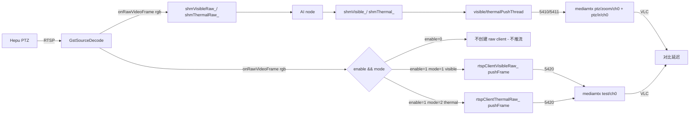

## 一、设计要点

### 复用现有资源（不改 mediamtx.yml）

- AI 流仍走 `ptz/zoom/ch0:5410` / `ptz/ir/ch0:5411`（不变）。
- 原始旁路流复用已存在但当前空闲的 `test/ch0:5420`（[mediamtx.yml](thirdpart/mediamtx/mediamtx.yml) L809-815）。
- 由于只有一条 test path，约定**可见光与热像旁路互斥**（同一时间只开一路）。

### 配置语义：enable + mode 解耦

- `enable=0`：完全不启动 raw 旁路客户端，5420 端口空闲，CPU/GPU 不增加任何负载（等价于"不做对比测试"的常态）。
- `enable=1, raw_bypass_mode=1`：启动可见光原始流 → `test/ch0:5420`。
- `enable=1, raw_bypass_mode=2`：启动热像原始流 → `test/ch0:5420`。
- 把"开关"和"选哪一路"分成两个字段，便于在测试间隔保留上一次的通道选择，下次只翻 `enable` 即可。

### 与 HEPU_STREAM_MODE_RAW 的边界

- `HEPU_STREAM_MODE_RAW` 定义 → 老语义不变（完全旁路 SHM/AI，把可见光+热像原始流推 5410/5411）。
- `HEPU_STREAM_MODE_RAW` 未定义（默认/生产）→ AI 流不受影响，**额外**根据 yaml 启动一路旁路推到 5420。

### 数据流




## 二、改动清单（按"最小化"排序）

### 1. 新增 yaml 配置类（参考 [demoSingleCfg.h](public/config/yamlConfig/demoSingleCfg.h) / [demoSingleCfg.cpp](public/config/yamlConfig/demoSingleCfg.cpp)）

新增 `public/config/yamlConfig/hepuStreamCfg.h`：

```cpp
#pragma once
#include "singleCfgBase.h"
#include "configCommDef.h"

struct HepuStreamParam {
    enum RawBypassMode : uint8_t {
        VISIBLE  = 1,  // 可见光原始流 -> test/ch0:5420
        THERMAL  = 2,  // 热像原始流   -> test/ch0:5420
    };
    uint8_t enable{0};            // 总开关，0=不启动 raw 旁路（默认/生产）
    uint8_t raw_bypass_mode{1};   // enable=1 时生效，1=可见光，2=热像（互斥）
};

class HepuStreamCfg : public SingleCfgBase<HepuStreamParam> {
public:
    static HepuStreamCfg& getInstance() { static HepuStreamCfg s; return s; }
private:
    HepuStreamCfg();
    ~HepuStreamCfg();
    const std::string filePath_ = PTZ100_APP_CONFIG_DIR"/hepuStreamCfg.yaml";
    ConfigErrorCode readFromFile(HepuStreamParam& msg) override;
    ConfigErrorCode writeToFile(HepuStreamParam& msg) override;
    ConfigErrorCode createInitCfg(void) override;
};
```

新增 `public/config/yamlConfig/hepuStreamCfg.cpp`：

- `createInitCfg`：写入 `enable: 0` 和 `raw_bypass_mode: 1`（默认关，但保留一个合法的通道选择）。
- `readFromFile`：读 `enable` 和 `raw_bypass_mode`；`raw_bypass_mode` 非法时降级为 1，`enable` 非 0/1 时降级为 0。
- `writeToFile`：用 `safeWriteFile` 写。

初始 yaml 内容示例（首次启动自动创建于 `/home/skyfend/config/hepuStreamCfg.yaml`）：

```yaml
enable: 0           # 0=关闭旁路（生产默认）, 1=启用 raw 旁路推 5420
raw_bypass_mode: 1  # 1=可见光, 2=热像 （仅 enable=1 时生效；二者互斥）
```

> [yamlConfig/CMakeLists.txt](public/config/yamlConfig/CMakeLists.txt) L26 已经 `aux_source_directory(. SOURCES)`，新增 .cpp 自动纳入静态库 `yamlConfig`，ptz_service 不需要改 CMake。

初始化文件位置：`/home/skyfend/config/hepuStreamCfg.yaml`，由首次启动自动创建。

### 2. 改 [ptzDeviceHepu.h](ros_ws/src/ptz_service/src/ptzDevice/ptzDeviceHepu.h) 和 [ptzDeviceHepu.cpp](ros_ws/src/ptz_service/src/ptzDevice/ptzDeviceHepu.cpp)

#### 2.1 头文件保持不变（已有 `rtspClientVisibleRaw_/rtspClientThermalRaw`_ 字段，刚好复用）。

#### 2.2 cpp 顶部添加：

```cpp
#include "hepuStreamCfg.h"

// 旁路原始流复用 mediamtx test/ch0:5420（互斥）
#define RAW_BYPASS_UDP_PORT  5420
```

新增成员（写在 .h 里）：

```cpp
// 运行期 raw 旁路开关与通道快照（仅启动时读一次，重启生效）
bool                          rawBypassEnable_{false};
HepuStreamParam::RawBypassMode rawBypassMode_{HepuStreamParam::VISIBLE};
```

#### 2.3 `startVideoPipeline()` 改造（[ptzDeviceHepu.cpp](ros_ws/src/ptz_service/src/ptzDevice/ptzDeviceHepu.cpp) L208-247）

在 `#ifdef HEPU_STREAM_MODE_RAW … #else … #endif` 的 `#else` 分支末尾追加 raw 旁路构造与启动：

```cpp
#else
    rtspClientVisible_ = std::make_unique<GstRtspClient>("127.0.0.1", visibleUdpPort, s_visibleRtspParam);
    rtspClientThermal_ = std::make_unique<GstRtspClient>("127.0.0.1", thermalUdpPort, s_thermalRtspParam);

    // 读取运行期 raw 旁路配置（enable 总开关 + 通道二选一推 5420/test/ch0）
    HepuStreamParam streamParam{};
    HepuStreamCfg::getInstance().read(streamParam);
    rawBypassEnable_ = (streamParam.enable != 0);
    rawBypassMode_   = static_cast<HepuStreamParam::RawBypassMode>(streamParam.raw_bypass_mode);
    if (!rawBypassEnable_) {
        LOG_INFO("Hepu raw bypass: DISABLED (enable=0), test/ch0 not used");
    } else if (rawBypassMode_ == HepuStreamParam::VISIBLE) {
        rtspClientVisibleRaw_ = std::make_unique<GstRtspClient>(
            "127.0.0.1", RAW_BYPASS_UDP_PORT, s_visibleRtspParam);
        LOG_WARN("Hepu raw bypass: VISIBLE -> rtsp://<host>:9554/test/ch0");
    } else if (rawBypassMode_ == HepuStreamParam::THERMAL) {
        rtspClientThermalRaw_ = std::make_unique<GstRtspClient>(
            "127.0.0.1", RAW_BYPASS_UDP_PORT, s_thermalRtspParam);
        LOG_WARN("Hepu raw bypass: THERMAL -> rtsp://<host>:9554/test/ch0");
    } else {
        LOG_WARN("Hepu raw bypass: enable=1 but invalid mode=%u, skip bypass",
                 static_cast<unsigned>(streamParam.raw_bypass_mode));
    }
#endif
```

启动段相应在 `#else` 分支再加：

```cpp
if (rtspClientVisibleRaw_ && rtspClientVisibleRaw_->start() != 0) {
    LOG_ERROR("Failed to start visible raw bypass RTSP client");
    return false;
}
if (rtspClientThermalRaw_ && rtspClientThermalRaw_->start() != 0) {
    LOG_ERROR("Failed to start thermal raw bypass RTSP client");
    return false;
}
```

#### 2.4 `stopVideoPipeline()` 改造（[ptzDeviceHepu.cpp](ros_ws/src/ptz_service/src/ptzDevice/ptzDeviceHepu.cpp) L516-531）

在 `#else` 分支补齐 raw 客户端关闭：

```cpp
#else
    if (rtspClientVisible_) rtspClientVisible_->stop();
    if (rtspClientThermal_) rtspClientThermal_->stop();
    if (rtspClientVisibleRaw_) rtspClientVisibleRaw_->stop();
    if (rtspClientThermalRaw_) rtspClientThermalRaw_->stop();
#endif
```

#### 2.5 `onRawVideoFrame()` 改造（[ptzDeviceHepu.cpp](ros_ws/src/ptz_service/src/ptzDevice/ptzDeviceHepu.cpp) L614-637）

`#else` 分支保留 SHM 写入，**额外**追加旁路推帧（不影响 AI 路径）：

```cpp
#else // 写共享内存（保持原有 AI 路径不变）
    if (camera_index == 0) shmVisibleRaw_->writeFrame(rgb_frame);
    else                   shmThermalRaw_->writeFrame(rgb_frame);

    // 运行期 raw 旁路：互斥推一路原始 RGB 帧到 mediamtx test/ch0:5420
    size_t expected_size = rgb_frame.total() * rgb_frame.elemSize();
    if (expected_size > 0 && rgb_frame.data != nullptr) {
        if (camera_index == 0 && rtspClientVisibleRaw_) {
            rtspClientVisibleRaw_->pushFrame(rgb_frame.data, expected_size);
        } else if (camera_index == 1 && rtspClientThermalRaw_) {
            rtspClientThermalRaw_->pushFrame(rgb_frame.data, expected_size);
        }
    }
#endif
```

### 3. sysmonit 不必动代码（零改动）

[sysmonit/main.cpp](ros_ws/src/sysmonit/src/main.cpp) L756-757 的 yaml 编辑器会自动列出 `/home/skyfend/config/*.yaml`，新建的 `hepuStreamCfg.yaml` 直接出现在 Web 编辑列表里。运维流程：

1. Web 打开 yaml 编辑器 → 选 `hepuStreamCfg.yaml` → 改 `enable`（开/关旁路）和 `raw_bypass_mode`（选通道）→ 保存。
2. 在节点页点"重启 ptz_service"（已有现成按钮）。
3. VLC 同时拉：
  - AI 流：`rtsp://<AGX>:9554/ptz/zoom/ch0`（或 `ptz/ir/ch0`）
  - 原始流：`rtsp://<AGX>:9554/test/ch0`
4. 测试结束后把 `enable` 改回 0 + 重启，旁路客户端不再启动，5420 端口空闲。

> 可选增强（不在本计划必做项）：在 PTZ 设备卡片加一个 raw_bypass 下拉框，参考 [index.html](ros_ws/src/sysmonit/web/index.html) L2240-2279 `togglePtzAiBox` 的实现，封装一键切换+重启。

## 三、关键风险与防护

- **5420 端口冲突**：`enable=1` 时 rtspClientVisibleRaw_ / rtspClientThermalRaw_ 在 `startVideoPipeline()` 中按 mode 二选一构造，不会同时绑 5420；`enable=0` 时根本不构造。
- **非法字段值**：`readFromFile` 在解析时校验 `enable ∈ {0,1}`、`raw_bypass_mode ∈ {1,2}`，越界值降级为安全默认（enable=0 / mode=1），不会误启动旁路。
- **raw 流码率/分辨率**：直接复用 `s_visibleRtspParam`（4 Mbps）/ `s_thermalRtspParam`（2 Mbps），AGX nvv4l2h264enc 多一路 1080p 4Mbps 编码压力可控。
- `**HEPU_STREAM_MODE_RAW` 被定义时**：上述新增分支位于 `#else`，不参与编译，老调试模式语义零变化。
- **旁路启动失败不影响 AI 流**：raw client start 失败时只 LOG_ERROR + 销毁 raw 客户端 (`rtspClientXxxRaw_.reset()`)，不让整条 pipeline 返回 false，AI 流照常推。

## 四、验证步骤

1. 编译：`colcon build --packages-select ptz_service`，启动 ptz_service，确认默认 `enable=0` 时 AI 流（5410/5411）正常、test/ch0 无流。
2. Web 把 `enable` 改为 1、`raw_bypass_mode` 保持 1（可见光），重启 ptz_service。
3. VLC 同时打开 `rtsp://<AGX>:9554/ptz/zoom/ch0` 和 `rtsp://<AGX>:9554/test/ch0`，确认两窗口同帧时间差，记录延迟。
4. Web 把 `raw_bypass_mode` 改为 2 + 重启，验证热像旁路同样工作（VLC 拉 `ptz/ir/ch0` 与 `test/ch0` 对比）。
5. Web 把 `enable` 改回 0 + 重启，验证 raw 客户端未启动、test/ch0 不出流、AI 流不受影响。

