# 和普场景 B：RTSP→AI→引导→selectRectTrack 延迟分析计划

> 实机现场 runbook 看 `tools/e2e_latency/README.md`。

---

## 0. TL;DR（30 秒读完）

- **责任边界**：本人主责 `**ptz_service`（嵌入式模块）**；`ptz100_ai`（**数据/AI 视觉团队**）与 `ptz_guider_ctl`（**引导算法团队**）的内部段不深入分析，**只关注与 ptz_service 交互的入口 / 出口时间戳**（详见 §3.1）。链路上发现的"非 ptz_service 责任"问题独立成 §13 [跨团队问题清单（待提）](#13-跨团队问题清单待提)，本轮测试拿到数据后据此提需求。
- **场景 B 触发方式**：`ptzDevicesCfg.yaml` 中目标 PTZ 的 `with_hepu_ai_box=0`。即将在 AGX (192.168.3.104) 上以此配置验证。
- **链路实际跨 3 个 ROS2 进程**：`ptz_service` / `ptz100_ai` / `ptz_guider_ctl`，加 1 个外部进程（和普 PTZ）。
- **完整链路有 5 类数据通路**（不是 1 条）：
  1. **主链路**：**和普RTSP拉流 → 解码 → SHM(raw) → AI推理** → AI发布AiTargetInfo → 引导guider 决策 → 手动锁定目标指令下发(PtzManualLockTargetCmd → ptz_service::ctrlPtzManualLockTarget → SDK selectRectTrack → HVS_SelectRectTrack)
  2. **UDP 旁路（无和普盒子时上报目标识别信息）**： AI发布AiTargetInfo → ptz_service订阅目标跟踪信息→ sendDetectionInfo → UDP 39080/39082 → 和普 PTZ叠加识别框
  3. **编码推流旁路**：AI OSD叠加 → SHM(ai) 回写 → 嵌入式回读进行编码推理（ptz_service::visiblePushThread → GstRtspClient::pushFrame → 本地 RTSP流媒体服务器）
  4. **PTZ 状态回流**：和普PTZ设备 → HepuPtzCtrl 状态回调 → onPtzStatusCallback → 内部状态/事件(是否进入跟踪状态等)
  5. **Smart Server 配置回流（与延迟无关，仅交代场景 B 启动条件）**：onPtzStatusCallback 连上后 ptz_service 对齐 PTZ Web "智能分析服务器" 配置（场景 B 强制 OFF + 写 eth1:39080）
- **现状**：13 个 [E2E] 节点已打（A1→E2），离线工具已可生成 frames.csv / sys.csv / report.md。**§13 A-3 已落地**（按帧追踪基础设施全打通）：`ShmTransferFrame::writeFrame` 加 3 参重载、`GstSourceDecode` 加 with-meta 回调把 `curFrameId_` + `wall_ms` 透传出去、ptz_service `onRawVideoFrame` 把 GST frame_id 写进 raw SHM header、ai_main visible/thermal 都把输入帧的 `frame_id/timestamp` 透传到 ai SHM；A2/A3/A4 三行 [E2E] 都带上了 frame_id。**结果**：A1 / A4 / B1 / B4 / B4r 整条输入侧 + 反向推流入口（ai SHM 写入端）现在共用同一个 frame_id（=GST `curFrameId_`），离线分析时可按 frame_id 直接关联（数据分析意义上的"按公共字段把两条 csv 记录配对"，**与线程 `join()` 同步语义无关**），不再依赖 t_us 时间窗。**仍缺**：PtzManualLockTargetCmd.msg 透传源帧 ID（§13 G-2，跨团队）、反向推流旁路其余段 [E2E]（§7.6 + §13 X-1，**本人主责待补 6 个打点位**）、设备执行边沿 D6（§13.0 P-1，**本人主责可推进**）。**明确不做**：A4 之前 RTSP / 解码缓冲拆分（§11.3 + §13 X-2，需扩公共 `cameraFrameHeader_t`、动三团队、收益不抵风险，A1 现有 `pts_ns` vs `mono_us` 抖动观测足够）。
- **测试前必须先核对的关键变量**：见 §10。**当前现场已确认**：PTZ 型号 = `PTZ_HEPU_DMA35`（10.1 ✅）、`with_hepu_ai_box=0`（10.4 ✅）；**生产环境永不定义 `HEPU_STREAM_MODE_RAW`**（默认走 ai SHM 反向推流路径）。
- **⚠️ 重要概念澄清（叠加视频有 2 条独立通路，不要混）**：
  - **通路 A（PTZ 设备主码流叠加）= 和普 PTZ Web 看的视频**：和普 PTZ **设备内部**直接在主码流上画跟踪框（设备触发条件 = 收到 `HVS_SelectRectTrack` 即 D5），完全**不经过 AGX**。AGX 这边能测的只有 D5→D6 的 RTT 区间（SDK 推送 `tracking` 状态作为近似边沿，§13.0 P-1 / §13 H-1）；PTZ 内部锁框、主码流编码、Web 客户端解码这几段 AGX **测不到**，只能反馈给 PTZ 厂家。
  - **通路 B（AGX 反向推流叠加）= C2 指挥端看的视频**：AGX 拉 PTZ **二码流** → 解码 → AI 推理 + 渲染（在 RGB 上画跟踪框）→ ai SHM → ptz_service `visiblePushThread` → `GstRtspClient::pushFrame` → AGX 本地 RTSP（MediaMtx）→ C2 拉流。**全程在 AGX 内**，所有段都能打 [E2E]。这条就是 §7.6 / §13 X-1 那条路径，对应 §10.3 ✅。
  - **两路用户都报告了"叠加滞后"**：
    - C2 端滞后 → 主因路径 = AI 渲染（B1→B3）+ ai SHM 跨进程 + ptz_service 编码推流 + 客户端解码缓冲 = §13 X-1 P0 的 6 个打点位（**本人主责**）。
    - PTZ Web 端滞后 → 主因路径 = (D5 RTT) + PTZ 设备内部 AI/锁框延迟 + PTZ 主码流编码 + Web 解码 = §13 H-1（**跨厂家，本人能做的就是把 D5→D6 RTT 提供出来**）。

---

## 1. 问题陈述（书面润色稿）

**分析范围**：和普 PTZ 链路上的端到端时间延迟。

**视频路径**：`HepuPtzCtrl::getRtspUrl` 取得 RTSP 地址→ ptz_service 内 `GstSourceDecode` 拉流解码 → `PtzDeviceHepu::onRawVideoFrame` 回调 → `ShmTransferFrame::writeFrame` 写 raw SHM。

**AI 路径**：ptz100_ai (`skyfend_ai_main`) 从 raw SHM 读帧 → 推理 + 跟踪 + 渲染叠加 → 通过 ROS2 话题 `/visiblelight_track_objs` 发布 `AiTargetInfo`，**同时**把渲染叠加帧 `writeFrame` 回写到 ai SHM。

AiTargetInfo 分两条下游：

- **场景 B 主路径（手动锁定）**：ptz_guider_ctl 在 10 Hz `process_loop` 节拍下从单元素队列 `m_vl_track_q` 取最新一帧（>500ms 帧龄丢弃）→ `chooseGuide` → `ptzManualLockUAV` → 节流（`manuallock_cmd_send_duration_thresh`）通过则 `ptzManualLockTarget` 装包 `sPtzManualLockTargetCmd_t` → 经 adapter 转 ROS msg `PtzManualLockTargetCmd` 发布到 `/ptz_manual_lock_target_cmd` → ptz_service `RosService::cb_ptz_manual_lock_target` 收到后调 ptz_service 设备适配层 `PtzDeviceHepu::ctrlPtzManualLockTarget`（**注意：此函数不在 SDK 里，在 ptz_service 进程内**）→ 进入 SDK 包装 `HepuPtzCtrl::selectRectTrack`（位于 `iotDevices/ptzHepuSDK`）→ 厂家原生 API `HVS_SelectRectTrack`。
- **场景 B 旁路（UDP 上报，触发主码流叠加）**：ptz_service 同时订阅相同话题，经 `onAiDetectionResults` → `PtzHepuSmart::sendDetectionInfo` 走 UDP 39080/39082 上报和普 PTZ；这条仅在 `with_hepu_ai_box=0` 时由 ptz_service 启动 `ai_smart_sender_visible_/thermal`_。

**编码推流（= 反向推流旁路 = AGX 本地编码推流，AGX 拉的是 PTZ 二码流）**：ptz_service `visiblePushThread` / `thermalPushThread` 从 ai SHM 读取 AI 渲染叠加帧（这些帧的源头是 AGX 拉到的 **PTZ 二码流** 解码后再由 AI 在 RGB 上画框），经 `GstRtspClient::pushFrame` 编码推到本地 UDP 端口（`127.0.0.1:5410+idx*2` 等）→ 本地 RTSP 服务（MediaMtx）→ **C2（指挥端）拉这条流当作主显示视频**（§10.3 ✅，与"和普 PTZ Web 看的设备主码流"是**两条不同的通路**，详见 §0 通路 A/B 区分）。该路径在 `HEPU_STREAM_MODE_RAW` **未定义**时启用，**生产环境永不定义此宏**。

**视频源**：海思 3403 → 和普 PTZ 内部处理 → 和普原始 RTSP 服务；AGX 拉流。

**现象与对比**：

- **场景 B**：AI 结果通过 `onAiDetectionResults` UDP 上报、AI 渲染帧通过反向推流回本地后，**两路视频**都报告"跟踪框"相对真实位置肉眼可见滞后：
  - **C2 端（AGX 推的二码流叠加流，通路 B）**：滞后主因 = AGX 内 AI 渲染 + ai SHM + 编码推流 + 客户端解码（§13 X-1 P0 待补）
  - **PTZ Web 端（PTZ 设备主码流叠加，通路 A）**：滞后主因 = PTZ 设备收到 D5 后内部锁框 + 设备主码流编码 + Web 解码（AGX 不可见，仅 D5→D6 RTT 可测，§13 H-1）
  - 参考：场景 A 下和普本地 AI 盒直接叠加时跟随更紧
- **场景 A**（`with_hepu_ai_box=1`，外接和普 AI 盒子，使用 `ctrlPtzTrack`）：可较快锁定，现象不明显。
- **场景 B 偶发**：锁定变慢或锁不住。和普解释：拉流/解码/AI/下发的端到端延迟让手动跟踪指令依据的画面对象位置「过时」，目标可能已飞出 20×20 像素手动跟踪框（见 `BOX_SIZE` 常量）。

**核心命题**：定量回答「目标出现在画面 → 下发锁定指令」的耗时及其分段构成；划清 AGX 侧（拉流/解码/AI/引导/SDK）与上游（3403 编码 + 和普 RTSP 缓冲）各自占比。

---

## 2. 归纳：核心问题与目标

### 2.1 核心问题

1. **归因是否合理**：场景 B 下，从画面到指令整条链路上的延迟，是否足以解释**两条叠加视频通路（通路 A：PTZ Web 主码流 / 通路 B：C2 端 AGX 反向推流二码流）**跟踪框相对真实位置明显滞后（与场景 A 和普本地直接叠加对比），以及偶尔锁定慢或锁不上（目标已飞出小范围手动跟踪框）。
2. **AGX 侧排查范围**：分清延迟主要来自拉流、解码、缓冲队列、AI、ROS2/中间件、引导节拍/节流/坐标算法、PTZ SDK、还是 PTZ 设备本身的执行；以便回应"是事实瓶颈还是被误判"，并指明优化方向。

### 2.2 目标

- **工程目标**：对场景 B 做可讨论的延迟画像，至少分段到：采集/编码侧 vs AGX 拉流解码 vs AI vs 引导节拍/节流 vs ptz_service 适配层 vs SDK + 设备 RTT。
- **业务目标**：解释或改善相对场景 A 的体验差距，尤其是锁不上/锁得慢是否与 AGX 视频与推理链路延迟相关。

### 2.3 答复摘要（理解与澄清）

- 描述清楚。理解的路径见 §1。
- 后续若做延迟对照，宜澄清"PTZ 主码流（通路 A）/AGX 推的二码流叠加流（通路 B）/AI 输入帧（来自 PTZ 二码流）是否同一路、同档位"，以及"手动框坐标相对哪一时刻的画面"；便于与官方"飞出框"说法做时间对齐论证。
- **澄清点（已纠正）**：~~PTZ Web 主码流叠加框的真实视频源 = AGX 本地编码推流~~ → **错**。事实是：**和普 PTZ Web** 看的"主码流"由 **PTZ 设备内部** 自己渲染（通路 A，AGX 不可见）；**C2 指挥端** 看的"叠加流"才是 **AGX 拉 PTZ 二码流 + AI 渲染再推回本地 RTSP**（通路 B，AGX 全程可测）。两条通路都报告滞后，归因路径不同（详见 §0 通路 A/B 区分 + §13 X-1（通路 B）+ §13 H-1（通路 A））。

---

## 3. 现阶段范围与实机测量约定

### 3.1 责任边界与关注度模型（重要）


| 模块                              | 归属团队         | 我方关注度        | 范围                                                                                                                                               |
| ------------------------------- | ------------ | ------------ | ------------------------------------------------------------------------------------------------------------------------------------------------ |
| `**ptz_service`**               | 嵌入式（本人主责）    | **🔴 全段细粒度** | 进程内全部段（A、D、E0/E1/E2、反向推流旁路 + visiblePushThread）+ 与 AI/guider 的所有交互边界                                                                             |
| `ptz100_ai` (`skyfend_ai_main`) | 数据 / AI 视觉团队 | **🟡 仅边界**   | 只关心：(a) **入口**：从 ptz_service 写的 raw SHM 读到 frame 的时刻；(b) **出口**：发布 `AiTargetInfo` 的时刻、回写 ai SHM 的时刻。内部 B1→B2→B3 仅作为对照不深入。                        |
| `ptz_guider_ctl`                | 引导算法团队       | **🟡 仅边界**   | 只关心：(a) **入口**：`camera_measurements_callback` 收到 `AiTargetInfo` 的时刻；(b) **出口**：publish `PtzManualLockTargetCmd` 的时刻。内部 10Hz 节拍 / 节流 / 决策算法不深入分析。 |


**实机数据出来后的归因路径**：

1. 先用 [E2E] 报告对账三段「跨模块边界耗时」：
  - `B4 → B4r/C1`：**ptz_service 与 AI 出口** 的衔接（AI 发布 → 各订阅方收到），高代表 ROS2 中间件 / 调度有问题
  - `C3 → D1`：**guider 出口 → ptz_service 入口**，高代表 ROS2 / 节点忙
  - `B4r/E0..E2`：**ptz_service 自己** 处理 AI 结果的耗时
2. ptz_service 内部段（A/D/反向推流）出尖峰 → 我方主责，直接定位
3. AI/guider 内部段出尖峰 → 仅作为现象记录，转交对应团队（用 §13 的清单）

### 3.2 时间基约定

- **当前阶段（实机测试前）**：链路梳理、打点埋点、报告工具已就绪；不在无实机条件下给出毫秒级结论。
- **实机阶段**：用 13 段 `[E2E]` 打点 + `parse_e2e_logs.py` 做端到端汇总。**所有进程统一时间基 + 业务键**，所以即便 AI/guider 是友团代码，也能在我方报告里一并呈现。所有打点同时携带：
  - `t_us`：`steady_clock` 微秒（用于做差）
  - `t_wms`：壁钟毫秒（用于和 SHM `timeStampMs`、`AiTargetInfo.timestamp` 对齐）
  - 业务键（**关联键 / pivot key**，离线把不同进程/不同 [E2E] 行的两条记录按同一字段值拼成一行；与 `thread.join()` 等同步原语无关）：`frame_id`（A1→B4 关联键）、`ai_ts`（B4r/E0/E1/E2/C1 关联键，等于 SHM `timeStampMs` = `AiTargetInfo.timestamp`）、`sys_ts`（C2→D5 关联键，等于 `m_currentGuidingTime`，通过 `ScopedSysTs` thread-local 在 ptz_service 内透传给 SDK 段）
- **交付形态**：实机测量后输出"分段耗时表 + 瓶颈标注"，再讨论优化是否落在拉流解码、AI、ROS/引导、ptz_service 适配层或 SDK 逻辑。

---

## 4. 链路全景（含进程边界 + 5 类数据通路）

```mermaid
flowchart LR
    subgraph upstream["上游 (非 AGX)"]
        Hi[海思 3403]
        HepuRTSP[和普 RTSP 服务器]
        Hi --> HepuRTSP
    end

    subgraph proc_svc["进程 ptz_service"]
        URL["HepuPtzCtrl::getRtspUrl<br/>(SDK)"]
        Pull["GstSourceDecode<br/>appsink_new_sample_cb<br/>(A1)"]
        Cb["onRawVideoFrame<br/>(A2/A3/A4)"]
        ShmRaw[("SHM raw<br/>generateShmName<br/>PTZ→AI")]
        ShmAi[("SHM ai<br/>generateShmNameAi<br/>AI→Streaming")]
        VPush["visiblePushThread<br/>thermalPushThread"]
        RtspClient["GstRtspClient::pushFrame<br/>本地 RTSP 推流<br/>127.0.0.1:5410+idx*2"]
        Sub2["RosService::cb_visible_track<br/>(B4r)"]
        UDP["onAiDetectionResults (E0)<br/>→ sendDetectionInfo (E1/E2)<br/>UDP 39080/39082"]
        Sub1["RosService::cb_ptz_manual_lock_target<br/>(D1)"]
        Adapter["PtzDeviceHepu::ctrlPtzManualLockTarget<br/>适配层 (D2/D3)<br/>注: 不在 SDK"]
        SDK["HepuPtzCtrl::selectRectTrack<br/>SDK 包装 (D4/D5)<br/>含 lock_us/hvs_us 拆分"]
        HVS["HVS_SelectRectTrack<br/>(厂家原生)"]
    end

    subgraph proc_ai["进程 ptz100_ai"]
        Read["readNewFrame<br/>(B1)"]
        Infer["推理 + 跟踪 + 渲染<br/>(B2/B3)"]
        Write["m_write_visible_ShmTransferFrame<br/>writeFrame (回写 ai SHM)"]
        Pub["发布 AiTargetInfo<br/>(B4)"]
    end

    subgraph proc_guide["进程 ptz_guider_ctl (10 Hz)"]
        SubAI["camera_measurements_callback<br/>(C1) push m_vl_track_q"]
        Loop["process_loop tick<br/>rclcpp::Rate(10)"]
        Get["get_cur_rgb_vision_targets<br/>帧龄 > 500ms 丢弃<br/>(m_max_vision_latency_time)"]
        Choose["chooseGuide<br/>三选一 user/rvfusion/vision"]
        Decide["ptzManualLockUAV<br/>节流: cur - last > thresh<br/>(C2 stage=decide)"]
        Pub2["发布 PtzManualLockTargetCmd<br/>(C3)"]
    end

    HepuRTSP --> Pull --> Cb --> ShmRaw
    URL -.提供 URL.-> Pull
    ShmRaw -.SHM 读.-> Read --> Infer --> Pub
    Infer --> Write -.SHM 写.-> ShmAi
    ShmAi -.SHM 读.-> VPush --> RtspClient
    Pub -.ROS2.-> SubAI --> Loop
    Loop --> Get --> Choose --> Decide --> Pub2
    Pub -.ROS2.-> Sub2 --> UDP
    Pub2 -.ROS2.-> Sub1 --> Adapter --> SDK --> HVS

    HVS -.私有协议.-> 和普PTZ设备
    UDP -.UDP.-> 和普PTZ设备
    RtspClient -.RTSP.-> 本地观看端
```




> 4 个进程 / 3 个 ROS2 节点 + 1 个外部设备。
> 进程边界对应：SHM（raw + ai 各一）+ ROS2 中间件（话题 4 条）+ UDP（场景 B 旁路）+ 私有协议（SDK→设备）。

---

## 5. 仓库内代码锚点对照

### 5.1 主链路（场景 B 手动锁定）


| 段        | 文件                                                                           | 函数 / 锚点                                                                                      |
| -------- | ---------------------------------------------------------------------------- | -------------------------------------------------------------------------------------------- |
| RTSP URL | `iotDevices/ptzHepuSDK/src/ptz_hepu_ctrl.cpp`                                | `HepuPtzCtrl::getRtspUrl`                                                                    |
| 主调用方     | `ros_ws/src/ptz_service/src/ptzDevice/ptzDeviceHepu.cpp`                     | `PtzDeviceHepu::startVideoPipeline` (取 URL + 兜底拼接 + 起 GstSourceDecode)                       |
| A1 解码    | `public/gstNvDeeps/gstSourceDecode/gstSourceDecode.cpp`                      | `appsink_new_sample_cb`                                                                      |
| A2/A3/A4 | `ros_ws/src/ptz_service/src/ptzDevice/ptzDeviceHepu.cpp`                     | `PtzDeviceHepu::onRawVideoFrame` (入口 / `videoFrameToMat` 后 / `shmVisibleRaw_->writeFrame` 后) |
| B1/B2/B3 | `ros_ws/src/ptz100_ai/skyfend_ai_main/ai_main.cpp`                           | `visible_process_loop` (readNewFrame / 推理入口 / 推理出口)                                          |
| B4       | `ros_ws/src/ptz100_ai/ptz100_ai_ros/include/ai_ros_adapter.h`                | `camTrack_msg_publisher` (含 thermal)                                                         |
| B4r      | `ros_ws/src/ptz_service/src/rosService/rosService.cpp`                       | `cb_visible_track`                                                                           |
| C1       | `ros_ws/src/ptz100_guide_ai/ptz_guider_ctl/include/ptz_guider_ros_adapter.h` | `camera_measurements_callback`                                                               |
| C2       | `ros_ws/src/ptz100_guide_ai/ptz_guider_ctl/src/ptz_guider_controller.cpp`    | `ptz_guider::ptzManualLockTarget` (stage=C2 暴露 `target_ts`)                                  |
| C3       | `ros_ws/src/ptz100_guide_ai/ptz_guider_ctl/include/ptz_guider_ros_adapter.h` | `GUIDER_CMD_MAMUAL_LOCK_TARGET` 分支 publish                                                   |
| D1       | `ros_ws/src/ptz_service/src/rosService/rosService.cpp`                       | `cb_ptz_manual_lock_target`                                                                  |
| D2/D3    | `ros_ws/src/ptz_service/src/ptzDevice/ptzDeviceHepu.cpp`                     | `PtzDeviceHepu::ctrlPtzManualLockTarget` (含 `event=early_return reason=*`)                   |
| D4/D5    | `iotDevices/ptzHepuSDK/src/ptz_hepu_ctrl.cpp`                                | `HepuPtzCtrl::selectRectTrack` (拆 `lock_us` / `hvs_us`)                                      |


### 5.2 UDP 旁路（**通路 A 触发源**：AI 检测结果通过 UDP 39080/39082 上报给和普 PTZ，PTZ 设备内部据此在主码流上画框）


| 段     | 文件                                                       | 函数 / 锚点                                       |
| ----- | -------------------------------------------------------- | --------------------------------------------- |
| E0    | `ros_ws/src/ptz_service/src/ptzDevice/ptzDeviceHepu.cpp` | `PtzDeviceHepu::onAiDetectionResults`         |
| E1/E2 | `iotDevices/ptzHepuSDK/src/ptz_hepu_smart.cpp`           | `PtzHepuSmart::sendDetectionInfo` (sendto 前后) |


### 5.3 反向推流旁路（**通路 B**：AGX 拉 PTZ 二码流后 AI 渲染再推回本地 RTSP，C2 端拉这条；**目前全段无 [E2E] 打点**，§13 X-1 P0 待补）


| 段                    | 文件                                                       | 函数 / 锚点                                                                           |
| -------------------- | -------------------------------------------------------- | --------------------------------------------------------------------------------- |
| AI 写 ai SHM          | `ros_ws/src/ptz100_ai/skyfend_ai_main/ai_main.cpp`       | `m_write_visible_ShmTransferFrame.writeFrame` (`#elif defined(NEW_SHM_FRAME)` 分支) |
| ptz_service 读 ai SHM | `ros_ws/src/ptz_service/src/ptzDevice/ptzDeviceHepu.cpp` | `visiblePushThread` / `thermalPushThread` (`shmVisible_->readNewFrame`)           |
| 编码 + UDP 推           | `ros_ws/src/ptz_service/src/ptzDevice/ptzDeviceHepu.cpp` | `rtspClientVisible_->pushFrame`                                                   |
| 编译开关                 | `ros_ws/src/ptz_service/src/ptzDevice/ptzDeviceHepu.cpp` | `#ifdef HEPU_STREAM_MODE_RAW` / `#else` 分支                                        |


### 5.4 场景开关与启动条件


| 锚点                                                                           | 含义                                                                                     |
| ---------------------------------------------------------------------------- | -------------------------------------------------------------------------------------- |
| `public/config/yamlConfig/ptzDevicesCfg.h::PtzDeviceParam::with_hepu_ai_box` | yaml 字段，决定场景 A/B                                                                       |
| `ptzDeviceHepu.cpp:268-` 注释段                                                 | `with_hepu_ai_box=1` → 场景 A，不启动 ai_smart_sender_*；`=0` → 场景 B，启动 PtzHepuSmart 走 UDP 转发 |
| `ptzDeviceHepu.cpp:1827-` (`configureOnceAfterConnected`)                    | 场景 B 强制 PTZ Web 智能分析服务器 OFF + 写本机 eth1:39080/39082                                     |
| `ptzDeviceHepu.h:117-127`                                                    | `with_hepu_ai_box` 默认值与跟踪模式对照（A=识别自适应；B=对空半自动）                                         |


---

## 6. 分段延迟定义

### 6.1 段编号速查（缩写词典 + 责任团队）

> 文档与 [E2E] 日志里到处用 `A1/B4/B4r/C1/D2/E0` 等缩写。这里给出统一对照，对外汇报时可直接拿这张表当词典。
>
> **编号规律**：字母 = 阶段（A 视频入口 / B AI / C 引导 / D 适配层+SDK / E UDP 旁路），数字 = 段内顺序。**带 `r` 后缀**表示"接收侧"（receive），通常与不带后缀的"发送侧"是同一个事件的两端，差值 = ROS2 / SHM 中间件传输耗时。
>
> **打点状态**列：✅ 已打 / ⏳ 计划中 / 💡 建议中。**责任**列：🔴 ptz_service 主责（嵌入式） / ⚪ 友团内部（AI / guider 主责，但代码已打点） / 🟡 跨团队边界（仅看时间戳差）。
> ⚠️ 注意责任 ⚪ ≠ 未打点：B1/B2/B3 / C2 等行虽然由友团代码维护，但 [E2E] 都**已实际落地**，可以直接消费。


| 编号         | 短名                   | 含义（中文）                                                                                                                     | 进程 / 函数锚点                                                                             | 打点状态  | 责任        |
| ---------- | -------------------- | -------------------------------------------------------------------------------------------------------------------------- | ------------------------------------------------------------------------------------- | ----- | --------- |
| **A1**     | Decode               | RTSP 解码完成（appsink 拿到原始帧）；行带 `frame_id`（GST 内部 `curFrameId_`）+ `pts_ns` + `mono_us`                                         | ptz_service · `gstSourceDecode.cpp::appsink_new_sample_cb`                            | ✅ 已打  | 🔴        |
| **A2**     | RawFrameIn           | 原始帧到达 ptz_service 设备适配层；**行带 `frame_id`（=GST `curFrameId_`，已透传）**                                                          | ptz_service · `ptzDeviceHepu.cpp::onRawVideoFrame` 入口                                 | ✅ 已打  | 🔴        |
| **A3**     | RGBConverted         | NV12→RGB 转换完成；**行带 `frame_id`** + `dur_us`                                                                                 | ptz_service · `videoFrameToMat` 后                                                     | ✅ 已打  | 🔴        |
| **A4**     | RawShmWritten        | raw SHM 写完成（PTZ→AI 通路）；**raw SHM `header.frameId/timeStampMs` = GST `curFrameId`_ / `wall_ms`** + `dur_us` + `shm_wall_ms` | ptz_service · `shmVisibleRaw_->writeFrame` 后                                          | ✅ 已打  | 🔴        |
| **B1**     | AiInputConsumed      | AI 从 raw SHM 读到帧；`inputs.frame_id = header.frameId = GST curFrameId`_；行带 `cam_ts` + `age_ms`（cam_ts→B1 的老龄）                | ptz100_ai · `ai_main.cpp:1930`（visible）                                               | ✅ 已打  | ⚪         |
| **B2**     | InferStart           | 推理开始；行带 `frame_id` + `cam_ts`                                                                                              | ptz100_ai · `ai_main.cpp:1968`（`visible_process` 入口）                                  | ✅ 已打  | ⚪         |
| **B3**     | InferEnd             | 推理 + 跟踪结束；**行带 `model_ms`（纯推理+跟踪时长，B3 内部 `chrono::steady_clock` 直接测）**+ `total_ms`（cam_ts→B3 老龄）+ `obj_num`（检测目标数）         | ptz100_ai · `ai_main.cpp:1976`（`visible_process` 出口）                                  | ✅ 已打  | ⚪         |
| **B4**     | AiResultPub          | AI 发布 AiTargetInfo（ROS2 publish）；行带 `ai_ts` + `age_ms`（cam_ts→pub 老龄）+ `obj_num`                                           | ptz100_ai · `ai_ros_adapter.h:230`（visible）/ `:249`（thermal）                          | ✅ 已打  | 🟡（AI 出口） |
| **B4r**    | AiResultRecvByPtzSvc | **ptz_service 收到** AiTargetInfo（B4 的接收端）                                                                                   | ptz_service · `rosService.cpp::cb_visible_track`                                      | ✅ 已打  | 🔴        |
| **C1**     | GuiderRecvAi         | **guider 收到** AiTargetInfo（B4 的另一接收端）                                                                                      | ptz_guider_ctl · `camera_measurements_callback`                                       | ✅ 已打  | 🟡（引导入口）  |
| **C2**     | GuiderDecide         | guider 决策 → 调 `ptzManualLockTarget`；行带 `target_ts`（决策依据帧的 ai_ts，用于反推那一帧）                                                   | ptz_guider_ctl · `ptz_guider_controller.cpp::ptzManualLockTarget`                     | ✅ 已打  | ⚪         |
| **C3**     | GuiderPub            | guider 发布 PtzManualLockTargetCmd                                                                                           | ptz_guider_ctl · `ptz_guider_ros_adapter.h` `GUIDER_CMD_MAMUAL_LOCK_TARGET` 分支        | ✅ 已打  | 🟡（引导出口）  |
| **D1**     | LockCmdRecv          | ptz_service 收到 PtzManualLockTargetCmd（C3 的接收端）                                                                             | ptz_service · `rosService.cpp::cb_ptz_manual_lock_target`                             | ✅ 已打  | 🔴        |
| **D2**     | CtrlIn               | 进入 ctrl 适配层                                                                                                                | ptz_service · `ptzDeviceHepu.cpp::ctrlPtzManualLockTarget` 入口（含 `event=early_return`） | ✅ 已打  | 🔴        |
| **D3**     | CtrlOut              | 离开 ctrl 适配层                                                                                                                | ptz_service · `ctrlPtzManualLockTarget` 出口                                            | ✅ 已打  | 🔴        |
| **D4**     | SdkIn                | 进入 SDK `selectRectTrack`（互斥 lock_guard 之后）                                                                                 | ptz_service · `iotDevices/ptzHepuSDK::HepuPtzCtrl::selectRectTrack` 入口                | ✅ 已打  | 🔴        |
| **D5**     | SdkOut               | 离开 SDK（`HVS_SelectRectTrack` 调后）                                                                                           | ptz_service · `selectRectTrack` 出口                                                    | ✅ 已打  | 🔴        |
| **D6**（建议） | DevExecEdge          | "设备已开始执行 lock"近似信号：`HepuPtzStatus.tracking` false→true 边沿（SDK 推送频率 ~10Hz，分辨率上限 ±100ms）                                     | ptz_service · `ptzDeviceHepu.cpp::onPtzStatusCallback`（详见 §13.0 P-1）                  | 💡 建议 | 🔴        |
| **E0**     | UdpHandlerIn         | 进入 onAiDetectionResults（UDP 旁路）                                                                                            | ptz_service · `ptzDeviceHepu.cpp::onAiDetectionResults`                               | ✅ 已打  | 🔴        |
| **E1**     | UdpSendBefore        | sendto 前（JSON 拼装后）                                                                                                         | ptz_service · `ptz_hepu_smart.cpp::sendDetectionInfo`                                 | ✅ 已打  | 🔴        |
| **E2**     | UdpSendAfter         | sendto 后（含 `sendto_us` / `bytes`）                                                                                          | 同上                                                                                    | ✅ 已打  | 🔴        |


> **关键边界对（同事件两端，差值 = 中间件 / 跨设备耗时）**：
>
> - `B4 → B4r`：AI publish → ptz_service 订阅收到（ROS2）
> - `B4 → C1`：AI publish → guider 订阅收到（ROS2，与 B4r 并行）
> - `C3 → D1`：guider publish → ptz_service 订阅收到（ROS2）
> - `A4 → B1`：raw SHM 写 → AI 读（POSIX 共享内存 + 信号量）
> - `D5 → D6`：ptz_service SDK 出口 → 设备真正进入跟踪态（PTZ TCP 协议口 + 设备内部锁框 + SDK 状态回报，**唯一能近似得到"AGX 主导 vs 设备主导"判据的对**，受限于 SDK 推送频率 ~10Hz）

> **AI 段延迟分解（B 区可直接读出的 5 个段位）**——AI 推理处理过程的时长分布**完全可测**，B1/B2/B3/B4 都已打点：
>
>
> | 段位            | 含义                                                | 取值方式                                                                             |
> | ------------- | ------------------------------------------------- | -------------------------------------------------------------------------------- |
> | `A4 → B1`     | raw SHM 老化 + AI 取帧排队（视频跨进程的等待时间）                  | 同帧 frame_id 关联做差；或直接读 B1 行的 `age_ms` 字段                                          |
> | `B1 → B2`     | AI 内部前置（`getPTZStatus` / `device_info` 装配 / 深拷贝等） | `B2.t_us - B1.t_us`（同 frame_id 关联）                                               |
> | `**B2 → B3`** | **纯推理 + 跟踪算法时长（最重要）**                             | **B3 行的 `model_ms` 字段**——B3 内部用 `chrono::steady_clock` 直接测好，每帧一行立即可读，不用做关联       |
> | `B3 → B4`     | 推理结束 → ROS publish（结果转 msg + DDS 序列化 publish）     | `B4.t_us - B3.t_us`（同 frame_id 关联）                                               |
> | `B1 → B4`     | AI 模块全段（输入到出口）                                    | `B4.t_us - B1.t_us`；或读 B3 行的 `total_ms` 字段（=cam_ts→B3 老龄，会比 B1→B4 略偏大一个 A4→B1 段） |
>
>
> 离线工具 `parse_e2e_logs.py` 已经把这些都算好放进 `frames.csv`，**无需重新打点**。

### 6.2 锚点字段


| 名           | 来源                                                                                                                              | 用途                                  |
| ----------- | ------------------------------------------------------------------------------------------------------------------------------- | ----------------------------------- |
| `T_capture` | `cameraFrameHeader_t.timeStampMs`，由 `ShmTransferFrame::writeFrame` 用 `gettimeofday` 写入                                          | **当前 = SHM 写时刻**，不是 RTP 接收 / 解码完成时刻 |
| `frame_id`  | `GstSourceDecode` 内部 counter；A2/A3/A4 由 ptz_service 透传写入 raw SHM；AI 端 `inputs.frame_id`（=raw SHM header）；ai SHM 写时也带过去（A-3 已落地） | A1→B4 关联键（按帧追踪）                     |
| `ai_ts`     | == `cameraFrameHeader_t.timeStampMs` (ms) == `AiTargetInfo.timestamp`                                                           | B4r/E0/E1/E2/C1 关联键                 |
| `sys_ts`    | == `m_currentGuidingTime` (ms)，guider 决策当下的 ROS 时间                                                                              | C2→D5 关联键（thread-local 透传给 SDK 段）   |


> **术语澄清**：本文档中 "关联 / 关联键 / pivot" 均指 **数据分析（SQL JOIN / pandas merge）意义上**的"用某个公共字段把两条独立日志记录配在一起"，与 `std::thread::join()` / `pthread_join` / `MPI_Wait` 这类**线程或进程同步等待**语义**完全无关**。所有跨进程操作都是离线读取 [E2E] csv 后做的 group/merge，不涉及任何运行时同步。

### 6.3 主路径分段


| 段         | 起                 | 止                    | 备注                                                        |
| --------- | ----------------- | -------------------- | --------------------------------------------------------- |
| A1→A4     | RTSP 解码 buffer    | SHM(raw) 写完成         | 上游 RTSP 缓冲对 AGX 是黑盒；A1 暴露 PTS-vs-mono 抖动作为间接观测            |
| A4→B1     | SHM(raw) 写        | AI 读                 | SHM "老化"；ai_main 有 150ms 丢帧阈值                             |
| B1→B4     | AI 读              | AiTargetInfo publish | 推理 + 跟踪 + 渲染叠加（注意推理过程同时回写 ai SHM 给推流，会占用 CPU）             |
| B4→C1     | AI publish        | guider 收到            | ROS2 中间件传输；同 1 台机器主要看 QoS / 节点忙                           |
| C1→C2     | guider 收到         | guider 决策            | **包含 10 Hz 节拍等待**（最坏 100ms）                               |
| C2→C3     | guider 决策         | adapter publish      | 包含节流命中（manuallock_cmd_send_duration_thresh）后才会真正 publish  |
| C3→D1     | guider publish    | ptz_service 收到       | ROS2 中间件                                                  |
| D1→D2     | ptz_service cb 入口 | ctrl 适配层入口           | 函数派发开销                                                    |
| D2→D3     | ctrl 入口           | ctrl 出口              | **覆盖 SDK 全部调用**；含 `event=early_return reason=`* 过滤        |
| D2→D4     | ctrl 入口           | SDK 调用前              | 业务条件判断（坐标转换、is_thermal、early-return 检查）                   |
| D4→D5     | SDK 入口            | SDK 出口               | **拆分为 lock_us（互斥等待）+ hvs_us（HVS_SelectRectTrack 原生 RTT）** |
| **C2→D5** | guider 决策         | SDK 出站               | **目前能直接拿到的「guider→PTZ 设备」下界**（不依赖 msg 透传）                 |


> 由于 `PtzManualLockTargetCmd.msg` 不携带源帧时间，**严格意义的「画面 → 下发」**（B4 wall_ms → D2 wall_ms 同帧）目前只能通过弱关联：用 `sys_ts` 关联 D 段，再用 `target_ts` (C2 暴露) 反推该帧 `ai_ts`。误差范围 ≤ 1 个 10Hz 周期 + 节流抖动。

---

## 7. 打点完成度盘点（按团队分类）

> 全部 [E2E] 打点默认行格式：
> `[E2E] run=<id> t_us=<steady> t_wms=<wall> stage=<code> <key=val ...>`
> `E2E_TRACE` 环境变量未设时一行不打，零开销。
>
> **状态标识**：
>
> - 🔴 **ptz_service 主责段**：我方主责，需要逐子段分析尖峰原因
> - 🟡 **跨团队边界段**：仅看边界时间戳，分析延迟主要看是否与 ROS2 / SHM 中间件相关
> - ⚪ **友团内部段**：保留打点便于现象观察，不深入；尖峰转 §13 清单交对应团队

### 7.1 阶段 A：RTSP → SHM(raw)　🔴 ptz_service 主责


| 子段                                  | stage | 状态               | 关键字段                                                                                                                                                                                                                                                                                              |
| ----------------------------------- | ----- | ---------------- | ------------------------------------------------------------------------------------------------------------------------------------------------------------------------------------------------------------------------------------------------------------------------------------------------- |
| GstSourceDecode appsink (decode 输出) | A1    | ✅ 已打             | `frame_id`、`pts_ns`、`mono_us` (PTS vs steady_clock 对比，原 `#if 0` 块已替代)                                                                                                                                                                                                                             |
| onRawVideoFrame 入口                  | A2    | ✅ 已打             | `cam_ts`、间隔异常事件                                                                                                                                                                                                                                                                                   |
| videoFrameToMat 完成（NV12→RGB）        | A3    | ✅ 已打             | `dur_us`                                                                                                                                                                                                                                                                                          |
| shmVisibleRaw_->writeFrame 完成       | A4    | ✅ 已打             | `cam_ts`（=新 `timeStampMs`）、`dur_us`                                                                                                                                                                                                                                                               |
| **拆解 RTSP 缓冲 / 解码缓冲**               | —     | 🚫 **明确不做**（已决定） | 拆分到这个粒度需要扩公共组件 `cameraFrameHeader_t` 携带"上层源时刻"（GST PTS 转壁钟），动 ptz_service / ptz100_ai / ptz_guider_ctl 三个团队的代码 + 重编公共库，**改动面与本课题（场景 B 端到端归因）不成比例**。当前 A1 已经暴露 `pts_ns` vs `mono_us`（GST PTS vs 单调时钟）抖动作为"上游进 AGX 节拍是否平稳"的间接观测，足以判断"AGX 拉流是否被上游卡住"，不需要进一步细分到 RTSP 缓冲层 vs 解码缓冲层。详见 §11.3 / §13 X-2。 |


### 7.2 阶段 B：SHM(raw) → 推理 → 发布 AiTargetInfo（同时回写 ai SHM）　⚪ AI 视觉团队内部 + 🟡 边界（B1 入口 / B4 出口）

> **我方关注点**：
>
> - **B1 入口**：`ai_ts` 与 ptz_service 写 SHM 的 `cam_ts` 是否一致 → 若不一致是 SHM 时间字段被覆盖的问题
> - **A4 → B1**（跨进程 SHM 老化）：是 ptz_service ↔ AI 边界，高值代表 AI 消费跟不上
> - **B4 出口**：AI 发布的 `ai_ts` 与 ptz_service 在 B4r/E0 收到的时刻差 → ROS2 中间件抖动
> - 内部 B1→B2→B3 不深入，仅作为现象观察


| 子段                        | stage | 状态              | 关键字段                                                               |
| ------------------------- | ----- | --------------- | ------------------------------------------------------------------ |
| readNewFrame 取得帧          | B1    | ✅ 已打            | `frame_id`、`ai_ts`、`start_delay`（>150ms 丢帧）                        |
| visible_process 推理入口      | B2    | ✅ 已打            | `frame_id`                                                         |
| visible_process 推理出口（含跟踪） | B3    | ✅ 已打            | `model_ms`、`all_consumed_ms`（相对 perception_result.timestamp）       |
| 写 ai SHM（含给推流的渲染叠加）       | —     | ⚠️ 未直接打点        | 现有日志 `write_delay = s2 - s1`、`delay = now - results.timestamp` 可代用 |
| 发布 AiTargetInfo           | B4    | ✅ 已打（含 thermal） | `frame_id`、`ai_ts`、`obj_num`、`pub_delay`                           |


### 7.3 阶段 C：guider 订阅 → 10Hz 节拍 → 决策 → publish　⚪ 引导算法团队内部 + 🟡 边界（C1 入口 / C3 出口）

> **我方关注点**：
>
> - **C1 入口**：guider 收到 `AiTargetInfo` 的时刻 vs AI 发布时刻（B4 → C1 段）= ROS2 中间件
> - **C3 出口**：guider 发布 `PtzManualLockTargetCmd` 的时刻 vs ptz_service 在 D1 收到的时刻 = ROS2 中间件
> - **C1 → C3** 内部很大（10Hz 节拍 + 节流 + 三选一决策 + HEPU 无外推），但**不属于我方主责**；现象记录后转 §13 清单
> - C1 行已暴露 `ai_ts`（弱：原始 AI 帧时间，进入 m_target 后会被覆盖为 `m_currentGuidingTime`），用于做"画面 → 下发"弱重建


| 子段                                                                         | stage | 状态          | 关键字段                                                                                  |
| -------------------------------------------------------------------------- | ----- | ----------- | ------------------------------------------------------------------------------------- |
| `camera_measurements_callback` 入口 → 入队                                     | C1    | ✅ 已打        | `ai_ts`（弱：原始 AI 帧时间，仅在此处可见，进入 m_target 后会被覆盖为 `m_currentGuidingTime`）                 |
| `process_loop` 10Hz tick → `get_cur_rgb_vision_targets` 取数 → `chooseGuide` | —     | ⚠️ 未直接打点    | 现有 debug 日志 `vl delay:%lu ms` 可代用；丢帧条件 `delay > m_max_vision_latency_time` 命中时打 warn  |
| `ptz_guider::ptzManualLockTarget` 装包决策                                     | C2    | ✅ 已打        | `sys_ts`、`target_ts`（暴露原始 AI 帧时间）、`chn`、`u`、`v`、`ptz_type`、`event=decide_manual_lock` |
| 节流（`manuallock_cmd_send_duration_thresh` 未通过则跳过）                           | —     | ⚠️ 未打节流命中事件 | 实测中可对比 C2 与 C3 数量差反推                                                                  |
| adapter publish PtzManualLockTargetCmd                                     | C3    | ✅ 已打        | `sys_ts`、`src`、`target_x`、`target_y`、`event=pub_manual_lock`                          |


### 7.4 阶段 D：ptz_service 订阅 → 适配层 → SDK　🔴 ptz_service 主责


| 子段                                         | stage  | 状态           | 关键字段                                                                                                                                                                                                                                                                                                                      |
| ------------------------------------------ | ------ | ------------ | ------------------------------------------------------------------------------------------------------------------------------------------------------------------------------------------------------------------------------------------------------------------------------------------------------------------------- |
| `cb_ptz_manual_lock_target` 入口             | D1     | ✅ 已打         | `sys_ts`、`dev_id`、`src`、`target_x/y`、`event=cb_in`                                                                                                                                                                                                                                                                        |
| `ctrlPtzManualLockTarget` 入口（SDK 调前）       | D2     | ✅ 已打         | `sys_ts`、`event` 含 `early_return reason=`* 分支                                                                                                                                                                                                                                                                             |
| `ctrlPtzManualLockTarget` 出口（SDK 调后）       | D3     | ✅ 已打         | `sys_ts`、`sdk_dur_us`、`total_dur_us`、`ret`、`event=ctrl_out`                                                                                                                                                                                                                                                               |
| `selectRectTrack` 入口（lock_guard 之后、HVS 调前） | D4     | ✅ 已打         | `sys_ts`、`lock_us`（互斥等待）                                                                                                                                                                                                                                                                                                  |
| `selectRectTrack` 出口（HVS 调后）               | D5     | ✅ 已打         | `sys_ts`、`hvs_us`、`dur_us`、`ret`                                                                                                                                                                                                                                                                                          |
| "设备已开始执行 lock"近似信号                         | D6（建议） | ❌ 未打 / ⚠️ 间接 | **现场限制**：进不了和普 PTZ 设备内部、不能在 PTZ 上抓 SDK 协议口。本端能拿到的只有：(1) `ctrlPtzManualLockTarget` / `selectRectTrack` 的同步返回值（D3/D5 已打）；(2) `PtzDeviceHepu::onPtzStatusCallback` 里 `HepuPtzStatus.tracking` **false→true 边沿**（SDK 从设备拿回的状态推送，即 PTZ 真的进入跟踪态的近似时刻）。后者目前**未打 [E2E]**，建议补一行 D6（见 §13 P-1）。SDK 推送频率本身是分辨率上限（实测~10Hz 抖动 ±100ms）。 |


### 7.5 阶段 E：UDP 旁路（onAiDetectionResults → sendDetectionInfo）　🔴 ptz_service 主责


| 子段                                          | stage | 状态   | 关键字段                                                |
| ------------------------------------------- | ----- | ---- | --------------------------------------------------- |
| `cb_visible_track` → `onAiDetectionResults` | E0    | ✅ 已打 | `ai_ts`、`obj_num`、`dur_us`、`event=on_ai_det_in/out` |
| `sendDetectionInfo` 调用前（JSON 拼装后）           | E1    | ✅ 已打 | `ai_ts`、`port`                                      |
| `sendDetectionInfo` 调用后（sendto 返回）          | E2    | ✅ 已打 | `ai_ts`、`sendto_us`、`bytes`、`ret`                   |


### 7.6 反向推流旁路 = AGX 本地编码推流（**通路 B：C2 端二码流叠加流**——已确认主因路径）　🔴 ptz_service 主责（AI 写 ai SHM 是边界）

> ⚠️ **不要混淆**：本节是"通路 B"——AGX 拉 PTZ **二码流** + AI 渲染 + 推回 AGX 本地 RTSP，**C2 看这条**。"和普 PTZ Web 看的主码流"是另一条（"通路 A"，PTZ 设备内部渲染，AGX 不可见，归因看 §13 H-1）。两条同时滞后，但走的代码路径完全不同。

> **观测度说明**（所有进程都跑在同一台 AGX，时间基统一 = `steady_clock` + `system_clock`，做差永远可信）：
>
> - **AI 渲染时长**（B1 输入帧到达 → AI 渲染完成准备写 ai SHM）：✅ AI 进程**内部**可直接打点测量。
> - **ai SHM 老化**（AI 渲染完成 → ptz_service `visiblePushThread` 读到）：✅ 可补两个 [E2E] 节点（AI 在 `writeFrame` 前打 stage，ptz_service 在 `readNewFrame` 返回后打 stage）。
> - **ptz_service 推流耗时**（`readNewFrame` 返回 → `pushFrame` 出栈）：✅ 都在 ptz_service 内同一线程，加两个 stage 即可。
> - **§13 A-3 已落地（2026-05-07）**：ai SHM 里 `frameHeader_.frameId / timeStampMs` 现在 = AI 输入帧（即 raw SHM = GST `curFrameId`_），**ptz_service 读出来直接就是输入帧 ID**，可与 A1/A4/B1/B4 直接按 frame_id 关联（离线 csv 配对，不涉及任何运行时同步）。
>
> **结论**：本轮要观测这条旁路，仅需补这 6 个 [E2E] 打点位（见下表 § X-1），即可同时拿到延迟分布（P50/P95）和按帧追踪两层结果。


| 子段                                       | [E2E] 打点状态      | 按帧追踪能力                                                                              |
| ---------------------------------------- | --------------- | ----------------------------------------------------------------------------------- |
| AI 写 ai SHM 前后                           | ❌ 待补打点（§13 X-1） | ✅ ai SHM `header.frameId` 已等于 raw SHM frameId（A-3 已落地），打点后可按 frame_id 直接关联（同字段精确配对） |
| ptz_service `visiblePushThread` 读 ai SHM | ❌ 待补打点（§13 X-1） | ✅ `visible_header.frameId / timeStampMs` 直接是输入帧值，可对回 A1/A4/B1/B4                    |
| `GstRtspClient::pushFrame`               | ❌ 待补打点（§13 X-1） | ✅ ptz_service 内部同一线程，pushFrame 与上一步共享 frame_id 上下文                                  |


> **§10.3 已锁定**：C2 端的"叠加视频"= 这条 AGX 本地编码推流（=通路 B）→ 这是 **C2 端"叠加滞后"** 的唯一主因路径，§13 X-1 已升级为 **P0 必须补全**（6 个打点位）。生产环境永不定义 `HEPU_STREAM_MODE_RAW`，所以默认就是这条路径，不需要切换 raw 推流来对照。
> **PTZ Web 端的"主码流叠加"** 不在本节范围（参见 §13 H-1，AGX 不可见）。

---

## 8. 离线汇总（已就绪）

- 工具：`tools/e2e_latency/parse_e2e_logs.py`
- 输入：`/tmp/e2e_logs/${E2E_RUN_ID}.log`（环境变量 `E2E_TRACE=1` + `E2E_RUN_ID=...` 由 launch / systemd 注入）
- 输出三件套：
  - `frames.csv`：每帧一行，A1→B4 按 `frame_id` 关联，B4r/E0/E1/E2/C1 按 `ai_ts` 关联
  - `sys.csv`：每条手动锁定一行，C2→D5 按 `sys_ts` 关联
  - `report.md`：表格总览（P50/P95/P99/Max），支持 `--window-sec N` 时间窗口切片
- 报告解读规则见 `tools/e2e_latency/README.md` §"How to read the report"。

---

## 9. 既有非 [E2E] 观测手段（互为印证）

- **AI**：`start_delay` / `delay > 150 drop` / `model elapsed` / `All consumed` / `visible light delay`（ai_ros_adapter.h，debug 等级）
- **ptz_service**：`onAiDetectionResults (visible) took` / `ctrlPtzManualLockTarget took` / `Visible stream: Real FPS / push Mbps`
- **guider**：`vl delay` / `manuallock_cmd_send_duration_thresh: %d`（启动时打印一次）/ `[manualLock] u v vx vy w h source`（debug）
- **网络**：PTZ 上 tcpdump UDP 39080/39082 + SDK 协议口；与 `[E2E]` 时间序对齐
- **和普侧**：~~主码流的视频源到底是和普 PTZ 内部还是 AGX 推回去的本地 RTSP~~（已澄清，**两路独立**：通路 A=PTZ 厂家自渲染主码流、通路 B=AGX 二码流叠加推回给 C2，详见 §10.3）；官方"飞出框"是否与"小框 + 高相对速度 + 无速度外推"匹配；**通路 A 滞后**需向和普索要"D5 → PTZ 主码流出帧"内部延迟（§13 H-1）。

---

## 10. 测试前 P0 必须先核对的关键变量（在 AGX 上静态可查，**先做**）

> 这一节是**测试前的静态自查清单**——只用读 yaml / 看启动日志 / 看 PTZ Web 就能查完，**不需要任何代码改动**。
> 这 4 项里只要有一项不对，后续 [E2E] 打点收上来也解释不了现象。
>
> **当前状态总览**：§10.1 ✅`PTZ_HEPU_DMA35` / §10.3 ✅ 叠加视频通路已澄清（**两路独立**：A=PTZ 主码流厂家自渲染、B=AGX 本地编码推流给 C2，§13 X-1 P0 / §13 H-1 跨厂家） / §10.4 ✅`with_hepu_ai_box=0`；**§10.2 yaml 阈值仍需开测前跑一遍读出来**。
>
> **不要把 §13 的"度量空白"塞进 §10**：本节聚焦"测试前能查的配置"；§13 G-2（msg 不带源帧 ID，跨团队）/ X-1（反向推流旁路全段，**已升级为 P0 必补**）/ §13.0 P-1（D6 设备执行边沿，本人主责可推进）属于"代码改动"，参见 §3.1 责任边界与 §13 跨团队问题清单。**已决定不做**：§13 X-2 / §11.3「A4 之前 RTSP/解码缓冲拆分」，详见 §0 与 §7.1 该行说明。

### 10.1 PTZ 设备型号（决定能否走到 ptzManualLockUAV）　✅ **已确认 = `PTZ_HEPU_DMA35`**

`ros_ws/src/ptz100_guide_ai/ptz_guider_ctl/src/ptz_guider_controller.cpp` 与相关 search 状态机里：

- 纯 `PTZ_HEPU` / `PTZ_HEPU_COOLED` 在 search 收敛后倾向走 `ptzSearch(true, ...)`（搜索 + 自动跟踪），**不直接** `ptzManualLockUAV`。
- 只有 `PTZ_HEPU_DMA35` 等支路才会直接走到 `ptzManualLockUAV` → `ptzManualLockTarget` 装包发出 `PtzManualLockTargetCmd`。

**现场状态**：用户已将 yaml 配置为 `PTZ_HEPU_DMA35`，决策路径会走到 `ptzManualLockUAV`，C2/C3/D1-D5 段在出现目标时可正常触发。

**测试时仍需关注 ptz_service 启动日志确认**：

```
PtzHepu[idx=N sn=...]: with_hepu_ai_box=0 => Scenario B (direct to AGX)
PTZ config loaded: SN=..., IP=..., Type=<int>, Index=N, with_hepu_ai_box=0
```

### 10.2 关键阈值

从 yaml 实读这三个值，写进测试笔记：


| 变量                                    | 文件 / 出处                                             | 影响                                                                                        |
| ------------------------------------- | --------------------------------------------------- | ----------------------------------------------------------------------------------------- |
| `manuallock_cmd_send_duration_thresh` | `ptz_guider.cpp` 启动时 `fs[...] >> ...`，启动日志会 INFO 一次 | 低于阈值的连续锁定请求被节流丢弃，会让 D1/D2/D3 计数远少于 C2                                                     |
| `m_max_vision_latency_time`           | `ptz_guider.cpp:54` `static const = 500ms`          | 超过则 `m_vl_track_q.pop()` 丢帧；guider 100% 视觉饥饿                                              |
| 150ms 帧龄阈值                            | `ai_main.cpp::get_visible_inputs_loop`（A4→B1 段）     | 超过则丢帧 + WARN                                                                              |
| 20px BOX_SIZE                         | `ptzDeviceHepu.cpp`                                 | 手动框尺寸；与下条共同作用                                                                             |
| **HEPU 路径无速度外推**                      | `ptz_guider_controller.cpp:264-271`                 | HEPU/HEPU_COOLED/HEPU_DMA35 都只取 `rect_x + 0.5*rect_w` 中心；**没有** `+5.0*rect_vx`（NAIJIE 才有） |


> **业务推论**：HEPU 路径下，「飞出 20×20 框」现象主要由（a）链路总延迟 + （b）20px 小框 + （c）无速度外推 三者叠加。优化空间不全在 AGX 链路，也包括在 guider 端给 HEPU 加上速度外推（独立子任务）。

### 10.3 叠加视频通路（两路独立）　✅ **已澄清**

> **这是归因方向的决定性问题**。之前我**误把"主码流"等同于"AGX 本地编码推流"**，2026-05-07 用户纠正：和普 PTZ 设备主码流和 AGX 推出去的二码流叠加流是**两条完全独立的通路**，**两路都报告滞后**，但归因路径不同。

**事实陈述**：


| 维度       | 通路 A：PTZ 设备主码流叠加                              | 通路 B：AGX 反向推流二码流叠加                            |
| -------- | --------------------------------------------- | --------------------------------------------- |
| 谁在画跟踪框   | **和普 PTZ 设备内部** AI / SDK                      | **AGX 上的 AI 节点**（`draw_visible_pip_for_c2`）   |
| 视频源      | PTZ 设备主码流（高清）                                 | PTZ 二码流（次清）→ AGX 拉流                           |
| 触发条件     | 收到 `HVS_SelectRectTrack`（D5）后设备自己启动跟踪         | 每帧 AI 检测到目标后渲染                                |
| 谁拉这条流    | **和普 PTZ Web**（厂家自带 UI）                       | **C2（指挥端）** 主显示                               |
| AGX 的参与度 | 仅下发 D5 + 通过 SDK 状态回调（D6 边沿）观察 `tracking`      | 全程：拉流 / 解码 / SHM / AI / 推流                    |
| AGX 可测段  | **仅 D5→D6 RTT**（受限于 SDK 状态推送 ~10Hz）           | A1 / A4 / B1-B4 / B4r + 6 个待打点位（§13 X-1）      |
| 滞后归因     | PTZ 内部锁框 + 主码流编码 + Web 解码（AGX 不可见，需推动 PTZ 厂家） | AGX 内 AI 渲染 + ai SHM + 编码推流 + 客户端解码（**本人主责**） |
| 文档锚点     | §13 H-1（跨厂家） + §13.0 P-1（D6 RTT）              | §7.6 + §13 X-1（P0 必做）                         |


**附带确认**：生产环境永不定义 `HEPU_STREAM_MODE_RAW`，所以 ptz_service 始终从 ai SHM（带 AI 渲染叠加的帧）读取并推流——通路 B 默认就是这条路径，不存在"切到 raw SHM 推流"的对照分支。

**测试时怎么对照**：

- 想观察通路 B 滞后 → 截 C2 端实时画面 + 实物对比 → 同时跑 [E2E] 看 §13 X-1 打点位的分布
- 想观察通路 A 滞后 → 截 PTZ Web 实时画面 + 实物对比 → 只能比对 D5→D6 RTT 看是不是设备主导（受限于 SDK 推送频率，仅做趋势）

### 10.4 场景 B 启动条件（再确认一遍）　✅ **已确认 `with_hepu_ai_box=0`**

- yaml 中 `with_hepu_ai_box=0` —— 现场已配置✅
- ptz_service 启动后 ai_smart_sender_visible_/thermal_ 应启动（看 LOG_INFO `start ai_smart_sender`_* 类）
- PTZ Web "智能分析服务器" 应被自动改为 `eth1:39080/39082` + ivpServerSet bEnable=false（看 `configureOnceAfterConnected` 日志）

---

## 11. 代码层面已知风险点（排查时顺带核对）

### 11.1 ptz_service 适配层 / SDK

- **设备执行确认信号缺失（D6 候选打点位）**：现场无法进入和普 PTZ 设备内部、不能在 PTZ 上抓 SDK 协议口，所以"指令真正到达 PTZ 并开始执行"的信号只能用 SDK 推回的状态边沿做近似 —— 即 `PtzDeviceHepu::onPtzStatusCallback`（`ptzDeviceHepu.cpp:1300`）里 `HepuPtzStatus.tracking` 字段从 `false → true` 的时刻。当前这一边沿**未打 [E2E]**，建议补一行 D6（详见 §13 P-1）。  
注意几点：(a) `tracking` 翻为 true 不一定来自我们刚下发的 `selectRectTrack`——PTZ Web、其他通道的操控也会让它变 true，需要用最近一次 D5 出口的 `sys_ts` 做"靠近时间窗"过滤；(b) SDK 状态推送频率是分辨率上限（约 10Hz，对应 ±100ms 抖动），D5→D6 段适合做 P50/P95 而非追求毫秒级精度；(c) D5→D6 这一段实际上是「ptz_service SDK 出口 → 设备真正进入跟踪态」的端到端往返，包括 PTZ TCP 协议口处理 + 设备内部锁框 + 状态回报。
- `ctrlPtzManualLockTarget` **early-return**：当 PTZ 已在跟踪状态时分两种情况——
  - `tracking_video_type == video_type`（同通道）→ `event=early_return reason=same_channel`，直接 `return 0`；
  - 否则检查 `input.second_tracking_flag`。该字段是和普 msg 的预留位（`# 目前不存在二次跟踪模式，和普预留`），**guider 端目前任何分支都不会对它赋值**（全仓库 grep 只在 msg 定义和此处读取出现），所以恒为 0 → 走 `event=early_return reason=other_channel`，直接 `return 0`。
  - 影响：当残留另一通道（红外）的跟踪未停止时，可见光场景 B 的 cmd 会在 D2 被吞，看到 D1→early_return 而无后续 D3/D4。开测前先在 PTZ Web 停掉非测试通道；测试中 D2 早返回比例可由 `[E2E]` reason 字段直接统计，不影响延迟测量本身。
- `selectRectTrack` 中 `lock_guard<m_device_mutex>`：D4/D5 之间的 `lock_us` 反映互斥等待，长尾时排查 SDK 内部其他控制是否抢锁。

### 11.2 guider 节拍 / 节流 / 坐标

- **10 Hz 固定节拍**：AI 帧最多每 100ms 才被消费一次；AI 端 25Hz 出帧的话，guider 实际丢弃 60% 帧。
- **m_vl_track_q 单元素队列**：`set_cur_rgb_vision_targets` 先 pop 完再 push，永远只留最新一帧；与 AI 端的"insert_visible_inputs 单帧策略"叠加，链路两处都是「仅留最新」。
- **节流**：`m_ptzManualLockLastTime + manuallock_cmd_send_duration_thresh` 不到则跳过，**不发 cmd**。这意味着即便 AI/guider 都准时，cmd 也可能被吃掉。
- **坐标无速度外推**：HEPU 系列分支只取目标框中心 `rect_x + 0.5*rect_w`，没有像 NAIJIE 那样做 `+5.0*rect_vx` 的外推。链路延迟越大、目标速度越快，"指令打到的位置"与"指令到达时目标实际位置"偏离越大，越容易"飞出 20×20 框"。

### 11.3 视频入口

- `cameraFrameHeader_t.timeStampMs` 在 `writeFrame` 内被 `gettimeofday` 覆盖，因此 A4/B1 的 `cam_ts` = AGX 写 SHM 时刻，**不是** RTSP 包接收 / 解码完成时刻。RTSP 缓冲 + 解码缓冲对当前打点是黑盒；A1 的 `pts_ns` vs `mono_us` 偏差只能给"上游进 AGX 节拍是否平稳"的间接观测。
- **已决定不做**：扩 `cameraFrameHeader_t` 携带 GST PTS 转壁钟字段以拆分 RTSP/解码缓冲。理由——动 `public/shmTransferFrame` 公共组件，影响 ptz_service / ptz100_ai / ptz_guider_ctl 三方编译与运行，且即便拆出来对场景 B 归因（"锁不上"用 D5→D6 + A1→D5 拆 AGX vs 设备主导；"C2 端二码流叠加滞后"用 §7.6 反向推流路径；"PTZ Web 主码流叠加滞后"用 §13 H-1 跨厂家路径）的解释力没有实质性提升。当前 A1 的 `pts_ns / mono_us` 抖动观测已能识别"上游送帧节拍是否被卡"，足够。

### 11.4 AI 端单帧策略

- `insert_visible_inputs` 只保留最新一帧 → 降低帧龄，但跟踪器时序断点；异常时要对照跟踪稳定性。
- 推理过程同时回写 ai SHM 给推流线程读 → 推理本身的时间也包含了一次 SHM 写；理论上几十 µs 量级，但需关注 4K 帧的内存带宽。

---

## 12. 关键风险：帧戳不透传 → 端到端命题取下界

- `PtzManualLockTargetCmd.msg` 当前承载的字段：`timestamp` / `sys_timestamp` / `photoelectricity_no` / `track_video_source` / `target_x` / `target_y` / `reserver`。其中 `timestamp` 与 `sys_timestamp` 都被赋值为 `cmd->sys_timestamp`（即 `m_currentGuidingTime`），**没有** `source_frame_timestamp` / `source_frame_id`。
- guider 内部 `m_target.timestamp` 在多处（`ptz_guider.cpp:1287/1405`、`ptz_guider_bph110.cpp:425`）被覆盖为 `m_currentGuidingTime`，原始 AI 帧时间在 guider 内丢失。
- 因此到 ptz_service 端只能算 `T_pub_in_guider → T_recv_in_ptzsvc`，**算不到「目标在画面（AI 帧戳）→ 下发」端到端值**。
- **退化方案（已实施）**：C2 行暴露 `target_ts`（决策依据帧的 `m_target.timestamp`）；测试中可用它配合 `sys_ts` 关联，做"画面 → 下发"的弱重建。
- **建议改动（最小集，P2 候选）**：
  - 给 `PtzManualLockTargetCmd.msg` 加 `uint64 source_frame_timestamp` + `uint64 source_frame_id` 两个字段；
  - guider adapter publish 时填入"决策依据帧"的 `AiTargetInfo.timestamp` / `frame_id`（C2 处的 `target_ts` 已经在打点了）；
  - ptz_service 端 D1 直接计算 end-to-end。
- 工作量：1 个 msg 字段 + 1 处 publish + 1 处日志。
- **风险**：动 `srp100_message` 子模块要走 GitLab MR，本轮决策不动它（避免阻塞测试）；测试结果定性后再立项。

---

## 13. 跨团队问题清单（待提） + ptz_service 自责任改进项

> §13.0 是 ptz_service 自己负责的改进项（本人主责，不需要找别的团队），可在本轮测试同步推进；§13.1~§13.3 是友团代码里发现的、**会显著影响场景 B 体验**但不是本人主责的问题，应在测试拿到数据后整理成对应团队的需求 / 风险项。
> 优先级：🔥 高（直接影响"飞出框"或"锁不上"现象）/ ⚡ 中（影响延迟可观测性）/ 💡 低（优化建议）

### 13.0 ptz_service 自责任改进项（本人主责，本轮可推进）


| #   | 优先级 | 问题                                                                                                                                                                                                                                                                                                                                    | 代码锚点                                                                                                                                         | 建议 / 实施步骤                                                                                                                                                                                                                                                                                                                                                                                                                                                                                          |
| --- | --- | ------------------------------------------------------------------------------------------------------------------------------------------------------------------------------------------------------------------------------------------------------------------------------------------------------------------------------------- | -------------------------------------------------------------------------------------------------------------------------------------------- | -------------------------------------------------------------------------------------------------------------------------------------------------------------------------------------------------------------------------------------------------------------------------------------------------------------------------------------------------------------------------------------------------------------------------------------------------------------------------------------------------- |
| P-1 | ⚡   | **D6 打点位缺失：「设备已开始执行 lock」近似信号未打 [E2E]**。现场限制：进不了和普 PTZ 内部、不能在 PTZ 上抓 SDK 协议口。本端能做的就是利用 SDK 推回的 `HepuPtzStatus.tracking` 字段 false→true 边沿——这是"PTZ 真的进入跟踪态"的近似时刻，在 `PtzDeviceHepu::onPtzStatusCallback` 里可观测。打了 D6 之后，「ptz_service SDK 出口（D5）→ 设备真正执行（D6）」这一段才有数据；这段 RTT 包含 PTZ TCP 协议口处理 + 设备内部锁框 + 状态回报，是判断"AGX 主导延迟 vs 设备主导延迟"的关键证据。 | `ros_ws/src/ptz_service/src/ptzDevice/ptzDeviceHepu.cpp:1300` `PtzDeviceHepu::onPtzStatusCallback` 入口；保留前一帧 `currentStatus_.tracking` 用作边沿检测 | (1) 在 `onPtzStatusCallback` 里加一个简单的边沿检测：`if (!prev_tracking && status.tracking) E2E_TRACE("stage=D6 mod=ptz_service event=tracking_edge prev_tracking=0 cur_tracking=1 video_type=%d sys_ts=%lu", status.tracking_video_type, last_d5_sys_ts)`；其中 `last_d5_sys_ts` 由 `ctrlPtzManualLockTarget` 出口（D3）保存为 `std::atomic<uint64_t>`，给 D6 用作时间窗过滤——只对"最近 N 秒内有过 D5"的边沿做有效配对。 (2) 离线工具里把 D5/D6 按 `sys_ts` 时间窗关联计算 P50/P95。 (3) 注意分辨率上限：SDK 推送 `tracking` 状态的频率约 10Hz，D6 自带 ~±100ms 抖动，做趋势观察足够，不追求毫秒级精度。 |


### 13.1 给「引导算法团队」（`ptz_guider_ctl`）


| #   | 优先级 | 问题                                                                                                                                                                                                                                                                                                                                                                     | 代码锚点                                                                                                                                                                                    | 建议 / 求证                                                                                                                                                                                                                       |
| --- | --- | ---------------------------------------------------------------------------------------------------------------------------------------------------------------------------------------------------------------------------------------------------------------------------------------------------------------------------------------------------------------------- | --------------------------------------------------------------------------------------------------------------------------------------------------------------------------------------- | ----------------------------------------------------------------------------------------------------------------------------------------------------------------------------------------------------------------------------- |
| G-1 | 🔥  | **HEPU 路径没有目标速度外推**：`ptzManualLockUAV` 中 NAIJIE 系列分支会做 `center + 5.0 * rect_vx/vy` 外推，HEPU/HEPU_COOLED/HEPU_DMA35 三个分支都只用 `rect_x + 0.5*rect_w` 中心，无外推。链路延迟越大、目标速度越快，"指令打到的位置"与"指令到达时目标实际位置"偏离越大，叠加 20px BOX_SIZE 即"飞出框"。                                                                                                                                              | `ros_ws/src/ptz100_guide_ai/ptz_guider_ctl/src/ptz_guider_controller.cpp:264-271`（HEPU 分支） 对比 `:244-262`（NAIJIE 分支）                                                                     | 在 HEPU 分支也加上 `+ k * rect_vx` 外推；外推系数 `k` 应按链路延迟测量值（从 [E2E] 报告的 C2→D5 段拿）整定，不是固定 `5.0`                                                                                                                                         |
| G-2 | 🔥  | `**PtzManualLockTargetCmd.msg` 不携带源帧时间戳 / frame_id**：guider 内 `m_target.timestamp` 在 `ptz_guider.cpp:1287/1405` / `ptz_guider_bph110.cpp:425` 多处被覆盖为 `m_currentGuidingTime`；msg 里 `timestamp` 与 `sys_timestamp` 都被赋值为 `m_currentGuidingTime`（即 guider 决策当下的 ROS 时间，**不是 AI 帧时间**）。导致下游 ptz_service 端无法严格回答"目标出现在画面 → 下发指令"端到端延迟，只能用 `target_ts` 弱重建（误差 ≤ 1 周期 + 节流抖动）。 | `ros_ws/src/ptz100_guide_ai/ptz_guider_ctl/include/ptz_guider_ros_adapter.h:670-700`（C3 publish） `ros_ws/src/ptz100_guide_ai/ptz_guider_ctl/src/ptz_guider.cpp`（m_target.timestamp 覆盖处） | 给 `PtzManualLockTargetCmd.msg` 加 `uint64 source_frame_timestamp` / `uint64 source_frame_id` 两字段（动 `srp100_message` 子模块走 GitLab MR）；guider 在 publish 时填入"决策依据帧"的 `AiTargetInfo.timestamp` / `frame_id`（即 C2 处已暴露的 `target_ts`） |
| G-3 | ⚡   | **10 Hz 固定节拍**：`process_loop` 用 `rclcpp::Rate(10)` 驱动决策，AI 端 25 Hz 出帧时 guider 实际丢弃约 60% 帧；最坏情况下一帧从入队到被消费要等 100ms。链路总延迟里这是一段"固定且较大"的开销。                                                                                                                                                                                                                                 | `ros_ws/src/ptz100_guide_ai/ptz_guider_ctl/src/ptz_guider_ros_adapter.cpp:8`（`rclcpp::Rate(10)`）                                                                                        | 评估提到 25 Hz（与 AI 出帧节拍对齐）的可行性；或改成事件驱动（`m_vl_track_q` push 时唤醒决策线程，10 Hz 仅作为 watchdog 兜底）                                                                                                                                        |
| G-4 | ⚡   | **节流 `manuallock_cmd_send_duration_thresh` 默认值不明**：决策通过但节流未通过则**完全跳过**，cmd 不发；可能让 D1 计数远少于 C2，看起来像"锁不住"。当前 [E2E] 也没打节流命中事件，只能从 C2/C3 计数差反推。                                                                                                                                                                                                                            | `ros_ws/src/ptz100_guide_ai/ptz_guider_ctl/src/ptz_guider.cpp:377`（yaml 读取） `ptz_guider_controller.cpp:186/242`（节流条件）                                                                   | 公开当前 yaml 中阈值默认值；评估是否过保守；可选在节流跳过分支加一行 `[E2E] stage=C2 event=throttled` 便于统计                                                                                                                                                   |
| G-5 | 💡  | **m_vl_track_q 与 AI 端单帧策略叠加**：链路两处都"仅留最新一帧"，对低帧率友好，但跟踪算法时序断点；高速目标可能频繁掉跟。                                                                                                                                                                                                                                                                                               | `ptz_guider_ros_adapter.h::set_cur_rgb_vision_targets` `ai_main::insert_visible_inputs`                                                                                                 | 评估改成深度=2 的滑窗或纯事件触发                                                                                                                                                                                                            |


### 13.2 给「数据 / AI 视觉团队」（`ptz100_ai`）


| #   | 优先级       | 问题                                                                                                                                                                                                                                                                                                                                                                                                                                                                                                                                                           | 代码锚点                                                                                                                                                                                                                                                                                                                                                                                     | 建议 / 求证                                                                                    |
| --- | --------- | ------------------------------------------------------------------------------------------------------------------------------------------------------------------------------------------------------------------------------------------------------------------------------------------------------------------------------------------------------------------------------------------------------------------------------------------------------------------------------------------------------------------------------------------------------------ | ---------------------------------------------------------------------------------------------------------------------------------------------------------------------------------------------------------------------------------------------------------------------------------------------------------------------------------------------------------------------------------------- | ------------------------------------------------------------------------------------------ |
| A-1 | ⚡         | **150ms 帧龄丢帧阈值**：`get_visible_inputs_loop` 中 `start_delay > 150ms` 直接丢帧 + WARN。在场景 B 链路总延迟未优化前可能误伤；丢帧本身会让 frame_id 序列出现跳跃。                                                                                                                                                                                                                                                                                                                                                                                                                                   | `ros_ws/src/ptz100_ai/skyfend_ai_main/ai_main.cpp::get_visible_inputs_loop`                                                                                                                                                                                                                                                                                                              | 公开当前阈值的整定依据；与 ptz_service 的端到端 P95 实测值做对照，必要时调整                                            |
| A-2 | ⚡         | **AiTargetInfo 内 `timestamp` 语义需明确**：B4 出口的 `ai_ts` 含义当前等同 SHM 写时刻（`cameraFrameHeader_t.timeStampMs`，由 ptz_service 写）。AI 团队若改成"推理输出时刻"或"模型读入时刻"会破坏现有关联（按 ai_ts 配对）。                                                                                                                                                                                                                                                                                                                                                                                          | `ros_ws/src/ptz100_ai/ptz100_ai_ros/include/ai_ros_adapter.h::camTrack_msg_publisher`                                                                                                                                                                                                                                                                                                    | 文档化该字段语义并固定；任何修改前知会下游（ptz_service / guider）                                                |
| A-3 | ✅ **已落地** | ~~AI 写 ai SHM 时不携带"输入帧"的 frameId / timestamp~~ —— **2026-05-07 已实现**：`ShmTransferFrame::writeFrame` 加 3 参重载 + `GstSourceDecode` 加 with-meta 回调把 `curFrameId`_ 透传到 raw SHM + ai_main visible/thermal 都把输入帧 `results.frame_id/timestamp` 透传到 ai SHM + 清理 NX_HARDWARE_PLATFORM 死代码。**结果**：A1 / A4 / B1 / B4 / B4r 全部共用同一个 frame_id（GST `curFrameId`_），可按 frame_id 直接关联（同字段精确配对，不再依赖 t_us 时间窗近似匹配）。**仍未做的辅助**：A1 行打的是 GST 原始 curFrameId*（前 150 帧已被 GstSourceDecode 内部丢弃，所以 A1 与 A4 起始 frame_id 可能差 150 是预期行为）；ai SHM 写入端在 ai_main 里仍是同一推理线程同步执行（参见 A-4，与按帧追踪无关）。 | `public/shmTransferFrame/shmTransferFrame.{h,cpp}`（3 参重载已加） `public/gstNvDeeps/gstSourceDecode/gstSourceDecode.{h,cpp}`（with-meta 回调） `ros_ws/src/ptz_service/src/ptzDevice/ptzDeviceHepu.{h,cpp}`（注册 with-meta + 透传到 raw SHM + A2/A3/A4 [E2E] 加 frame_id） `ros_ws/src/ptz100_ai/skyfend_ai_main/ai_main.cpp`（visible 1138-1144 / thermal 1521-1523 改为 3 参 + 删除 NX_HARDWARE_PLATFORM 分支） | 已完成。后续若离线工具升级要按 frame_id pivot，可直接用 frames.csv 中现成的 frame_id 列做硬关联（同字段精确配对，详见 §16 工具升级建议）。 |
| A-4 | 💡        | **回写 ai SHM 在推理同一线程**：`m_write_visible_ShmTransferFrame.writeFrame` 在 `visible_process_loop` 里同步执行，4K RGB 一次大约几十 MB 内存带宽；理论上几十 µs 但放在主推理线程里可能影响推理稳定性。                                                                                                                                                                                                                                                                                                                                                                                                        | `ros_ws/src/ptz100_ai/skyfend_ai_main/ai_main.cpp:1140`（`m_write_visible_ShmTransferFrame.writeFrame`）                                                                                                                                                                                                                                                                                   | 评估异步化（独立线程负责回写）                                                                            |


### 13.3 跨团队共同问题（结构性）


| #   | 优先级         | 问题                                                                                                                                                                                                                                                                                                                                                                                                                                             | 建议                                                                                                                                                                                                                                                        |
| --- | ----------- | ---------------------------------------------------------------------------------------------------------------------------------------------------------------------------------------------------------------------------------------------------------------------------------------------------------------------------------------------------------------------------------------------------------------------------------------------- | --------------------------------------------------------------------------------------------------------------------------------------------------------------------------------------------------------------------------------------------------------- |
| X-1 | 🔥          | **C2 端二码流叠加流（通路 B）= AGX 本地编码推流，归因路径需补全**：§10.3 已确认。**C2 端**滞后主因 = AI 渲染 + ai SHM + ptz_service 推流 + 客户端解码，**与"锁不上"链路完全不同，与 PTZ Web 主码流叠加通路（H-1）也是不同路径**，必须单独补打点。当前 §7.6 表内三项子段（AI 写 ai SHM / ptz_service 读 ai SHM / `pushFrame`）全部 ❌ 未打。                                                                                                                                                                                                       | **P0 必做**：在 AI 写 ai SHM 前后、ptz_service `readNewFrame` 前后、`GstRtspClient::pushFrame` 前后各加 [E2E]（约 6 个打点位）。先用统计法（双方各自 `t_us` 做差，取 P50/P95）；§13 A-3 已落地，因此可同时拿到按帧关联（同 frame_id 精确配对）的逐帧追踪。                                                                   |
| H-1 | ⚡           | **PTZ Web 主码流叠加通路（通路 A）滞后归因 = 跨厂家**：和普 PTZ 设备**自己**在主码流上画框，**画框信息有两种来源**：(a) **每帧检测框** = AGX `sendDetectionInfo`（E0/E1/E2）经 UDP 39080/39082 推到 PTZ 后由 PTZ 内部渲染；(b) **手动跟踪框** = D5 `HVS_SelectRectTrack` 下发后 PTZ 内部 SDK 跟踪渲染。两种路径的 AGX 侧都已打 [E2E]（A1→A4→B1→B4→B4r→E0→E1→E2 / D1→D2→D3→D4→D5），但 **PTZ 内部"收到 UDP / D5 → 主码流真正出现框"那段 AGX 完全测不到**。AGX 这边能贡献的"PTZ 内部延迟近似下界"只有 D5→D6 RTT（§13.0 P-1，仅覆盖手动跟踪那一支，分辨率上限 ±100ms）；UDP 检测框那一支无类似回报通道，无法本地估算。 | **跨厂家 issue**：把 (1) AGX 段总延迟分布（A1→E2 / A1→D5）+ (2) D5→D6 RTT 分布 + (3) 现场实测的"用户感知滞后"（视频对照实物目视估算）三组数据一起反馈给和普；要求和普给出 PTZ 内部"UDP 收到 → 主码流出框"和"D5 收到 → 主码流出框"的延迟数据。**AGX 内部辅助**：§13.0 P-1 落地后把 D5→D6 RTT 分布写入交付物（§14）作为通路 A 手动跟踪支的延迟下界证据；UDP 检测框支只能给"AGX 段下界"。 |
| X-2 | 💡 / 🚫 暂不做 | **进程间 SHM 时间字段语义** —— `cameraFrameHeader_t.timeStampMs` 在 `ShmTransferFrame::writeFrame` 内被 `gettimeofday` 覆盖；ptz_service 写入时给出的"上层源时刻"丢失。理论建议是给 frame header 扩字段携带 GST PTS 转壁钟值。                                                                                                                                                                                                                                                              | **本轮决定不做**（用户裁定：相对场景 B 归因目标过细）。原因：动公共组件 + 三团队编译；当前 A1 暴露的 `pts_ns / mono_us` 抖动观测够用；场景 B 的两条主因路径（"锁不上" / "主码流叠加滞后"）都不依赖这个字段。如果将来要做更细的端到端帧时序追踪（不只是延迟分布、要做按帧追踪），再立项。                                                                                        |


---

## 14. 交付物建议

- 一页表：A1..D5/D6 + UDP 旁路 + 反向推流（X-1 补全后）各段实测区间 + 瓶颈标注；按 🔴/🟡/⚪ 分组
- 简短结论：AGX 侧是否主导延迟（对比和普内置 `ctrlPtzTrack` 闭环）；若 D5→D6（设备 RTT）大于 AGX 全段（A1→D5），说明设备/SDK 协议口主导，否则 AGX 链路主导
- 现象归因（双线）：
  - **锁不上 / 锁慢** = 链路延迟（A1→D5 + D5→D6）+ 20px BOX_SIZE + HEPU 无速度外推（G-1）（对应优化：扩 msg G-2 + guider 加速度外推 G-1 + 降节拍 G-3 / 调阈值 G-4）
  - **C2 端二码流叠加滞后（通路 B）** = AI 渲染 + ai SHM + 编码推流 + 客户端解码（§10.3 已确认；X-1 对应 §7.6 三段）—— 这是与"锁不上"完全独立的另一条路径，优化方向也不同（动 AI 渲染 / SHM 写读 / GstRtspClient pushFrame / MediaMtx 客户端）
  - **PTZ Web 主码流叠加滞后（通路 A）** = PTZ 设备内部锁框 + 主码流编码 + Web 解码（AGX 不可见；§13 H-1 跨厂家）—— AGX 仅贡献 D5→D6 RTT 作为下界证据，主体优化在 PTZ 厂家
- **跨团队需求清单**：把 §13.1~§13.3 表格直接拷成对应团队 issue / 邮件主题，附 [E2E] 报告 P95 数据 → 让对应团队领走
- **本人推进项**：§13.0 P-1（D6 打点位）+ §13 X-1（反向推流 6 个打点位）—— 两项都在 ptz_service 主责范围内

---

## 15. 修订记录

- 2026-04-30：首次写入 doc 文档后并入本计划。
- 2026-04-30：删除独立 doc 文档，统一单一归档为本计划文件。
- 2026-04-30：将"原始描述"改为书面润色稿。
- 2026-05-06：在另一台机器（192.168.3.103）上完成 13 段 [E2E] 打点 + 离线汇总工具，迁移到 AGX (192.168.3.104)。
- 2026-05-07：本次大改 —— 修正 §1 "原始描述"中 `ctrlPtzManualLockTarget` 模块归属错位（在 ptz_service 适配层而非 SDK）；补充 AI → ai SHM → ptz_service 编码推流的反向链路与 5 类数据通路；补充 ptz_guider_ctl 内部 10 Hz 节拍 / 节流 / HEPU 无速度外推 / m_vl_track_q 单元素队列等关键细节；§7 把"已打/未打"重写为"打点完成度盘点"；新增 §10「测试前 P0 必须先核对的关键变量」；删除已迁移的 `doc/hepu_scenario_b_e2e_handoff.md`。
- 2026-05-07（second pass）：明确责任边界 —— ptz_service 主责（嵌入式），ptz100_ai / ptz_guider_ctl 仅关注与 ptz_service 的入口/出口时间戳。新增 §3.1「责任边界与关注度模型」三档分类（🔴 主责 / 🟡 边界 / ⚪ 友团内部）；§7 各小节加责任标识；新增 §13「跨团队问题清单（待提）」覆盖 G-1 ~ G-5（引导团队）/ A-1 ~ A-3（AI 团队）/ X-1 ~ X-2（共同问题）；后续章节顺延（§13 交付物建议→§14，§14 修订记录→§15，§15 入口提示词→§16，§16 路径速查→§17）。
- 2026-05-07（third pass）：新增 §6.1「段编号速查（缩写词典）」消除 A1/B4/B4r/C1/D2/E0 等缩写歧义，含责任团队三档标注 + 关键边界对（B4→B4r / B4→C1 / C3→D1 / A4→B1 = 中间件耗时）；原 §6.1/6.2 顺延为 §6.2/6.3。新增 §13 A-3：AI 写 ai SHM 时不带源帧 frameId/timestamp，公共组件 `ShmTransferFrame::writeFrame` 仅单参数版本；ai_main 那行 NX_HARDWARE_PLATFORM 下的 3 参调用是死代码（接口不存在）。原 A-3（回写 ai SHM 同线程）顺延为 A-4。
- 2026-05-07（fourth pass）：(1) 全文 "注码流" → "主码流"（13 处）：以现场实际看到的视频源命名为准；§1 同步把"AGX 上报到注码流 vs 和普本地到主码流"的对比简化为单方向描述。(2) 软化 §7.6 与 §13 A-3 措辞：明确"所有进程同 AGX、时间基统一（steady_clock）→ 单段时长用 P50/P95 统计法**仍可测**，不阻塞本轮测试"；A-3 优先级从 🔥 调整为 ⚡（仅影响"按帧追踪"分析能力，不影响延迟分布度量）。
- 2026-05-07（fifth pass）：去掉全文"今天/明天"等带时间倾向的措辞（§0 / §10 标题 / §10 开头说明 / §13 X-1 / §16 入口提示词共 8 处），改为"测试前 / 本轮 / 下一步"等中性表达；§10 章首补一段说明，明确 §10 是"测试前静态自查清单"而非"度量空白补全清单"，并指向 §13 G-2 / X-1 / §11.3 由报告结果决定是否动代码的位置。
- 2026-05-07（sixth pass）：现场状态落地——用户已确认 PTZ 型号 = `PTZ_HEPU_DMA35`（§10.1 ✅），`with_hepu_ai_box=0`（§10.4 ✅），主码流叠加视频源 = AGX 本地编码推流（§10.3 ✅，原选项 B 钉死），生产环境永不定义 `HEPU_STREAM_MODE_RAW`。同步：§0 TL;DR 加现场状态摘要 + 把"反向推流旁路全段"显式列入 P0 缺项；§1 编码推流段落改为"反向推流旁路 = AGX 本地编码推流"；§2.3 删除"待核实"措辞；§7.6 标题加"已确认 = 场景 B 主码流叠加主因路径"；§10.1/10.3/10.4 加 ✅ 状态戳，§10.3 删除选项 A、3 步核对方法等已废弃内容；§13 X-1 由"待评估"升级为 **P0 必做**，明确 6 个待打点位 + 不依赖 A-3。
- 2026-05-07（seventh pass）：现场观测能力收紧——用户明确进不了和普 PTZ 内部、不能在 PTZ 上抓 SDK 协议口，原 §7.4 表里"真正『指令到达 PTZ 设备』时刻"那一行的"PTZ 上 tcpdump / Web 看主码流响应"两条核对路径**作废**。改写为：仅有 (a) D3/D5 SDK 同步返回值 + (b) `PtzDeviceHepu::onPtzStatusCallback` 里 `HepuPtzStatus.tracking` false→true 边沿（SDK 推回的近似设备执行信号）。新增 §13.0「ptz_service 自责任改进项」，列入 P-1：在 `onPtzStatusCallback` 加 D6 打点 + 配合 D5 出口的 `last_d5_sys_ts` 做时间窗关联（数据配对），得到「ptz_service SDK 出口 → 设备真正进入跟踪态」的 RTT（含 SDK 推送 ~10Hz 分辨率上限）。§11.1 加注意事项；§14 交付物里"AGX 主导 vs 设备主导"判据写成 D5→D6 vs A1→D5 比较。
- 2026-05-07（eighth pass）：用户裁定「拆解 RTSP 缓冲 / 解码缓冲」（§7.1 / §11.3 / §13 X-2）**太细，不做**——理由是要扩 `cameraFrameHeader_t` 公共组件、动三团队代码、且不影响场景 B 两条主因路径的归因。同步收尾：§0 TL;DR "仍缺"列表里把这条移到"明确不做"分组；§7.1 表格该行状态从 "⚠️ 未做" 改为 "🚫 明确不做（已决定）" 并补上理由；§10 章首"度量空白"括注里删掉这条引用、改为指向 §13.0 P-1 / X-1；§11.3 加"已决定不做"段落 + 当前 `pts_ns / mono_us` 抖动观测够用的解释；§13 X-2 优先级从 ⚡ 降为 💡 / 🚫 暂不做，写明"本轮决定不做"+"将来若要按帧追踪再立项"的退出条件。
- 2026-05-07（ninth pass）：**§13 A-3 落地（按帧追踪基础设施全打通）**。代码改动：(1) `public/shmTransferFrame/shmTransferFrame.{h,cpp}` 新增 3 参重载 `writeFrame(frame, timeStampMs, frameId)`，单参版作为 wrapper 保留兼容；(2) `public/gstNvDeeps/gstSourceDecode/gstSourceDecode.{h,cpp}` 新增 `CallbackOnVideoFrameWithMeta` 回调签名（带 `frame_id / mono_us / wall_ms`），保留旧 `CallbackOnVideoFrame` 兼容 laser_service / ptz_app / examples；in `appsink_new_sample_cb` 优先派发新回调；(3) `ros_ws/src/ptz_service/src/ptzDevice/ptzDeviceHepu.{h,cpp}` 改 `onRawVideoFrame` 用新签名（接收 GST `curFrameId`_ + `wall_ms`），调 3 参 `writeFrame` 透传到 raw SHM；A2/A3/A4 三行 [E2E] 都加 `frame_id` 字段；(4) `ros_ws/src/ptz100_ai/skyfend_ai_main/ai_main.cpp` 删除 `#ifdef NX_HARDWARE_PLATFORM` 死代码分支，visible/thermal 都统一调 3 参 `writeFrame(frame, results.timestamp, results.frame_id)` 把输入帧透传到 ai SHM。文档同步：§0 TL;DR 把"缺源帧 ID 透传"移出仍缺清单 + 加落地状态摘要；§6.1 段编号速查 A1-B1 行说明里写明 `frame_id` 字段含义及"= GST curFrameId_" 这个事实；§7.6 把"AI 写 ai SHM 后 frame_id 与输入帧不对齐"那条限制取消，更新观测度说明；§13 A-3 行从 ⚡ 改为 ✅ 已落地，记录代码锚点。**结果**：A1 / A4 / B1 / B4 / B4r 整条输入侧 + 反向推流入口（ai SHM）共用同一个 frame_id，可按 frame_id 直接硬关联（同字段精确配对）；离线工具升级时无需做时间窗近似关联。
- 2026-05-07（eleventh pass，**重大概念纠正：叠加视频两通路区分**）：用户纠正了我之前对"主码流叠加视频源 = AGX 本地编码推流"的误判——事实是和普 PTZ 设备**主码流（厂家 Web 看的高清流）**和 **AGX 反向推流的二码流叠加流（C2 端看的）是两条完全独立的通路**，**两路用户都报告了滞后**，但归因路径完全不同：
  - **通路 A（PTZ 设备主码流）**：跟踪框由 PTZ **设备内部**渲染（每帧检测框来自 UDP `sendDetectionInfo` 上报；手动跟踪框来自 D5），AGX 不可见 PTZ 内部延迟，能贡献的只有 D5→D6 RTT（§13.0 P-1）+ AGX 段总延迟（A1→E2 / A1→D5）。归因主体在和普 PTZ 厂家。
  - **通路 B（C2 端 AGX 反向推流）**：AGX 拉 PTZ **二码流** + AI 渲染 + 推回本地 RTSP，**全程 AGX 内**，§13 X-1 6 个打点位精准对应这条。归因主体本人主责。
  同步修改：§0 TL;DR 新增 ⚠️ 通路 A/B 区分段；§1 编码推流段落显式说明"AGX 拉的是 PTZ **二码流**"+"C2 拉这条 ≠ PTZ Web 主码流"；§1 场景 B 部分把"PTZ Web 主码流叠加滞后"拆成两路；§2.3 把"已确认主码流 = AGX 推流"反转为"已纠正"+ 两路分述；§5.2 重命名为"通路 A 触发源（UDP 上报）"；§5.3 重命名为"通路 B（AGX 二码流叠加推回）"；§7.6 标题与开头加 ⚠️ 不混淆段；§10.3 完全重写为两路对比表（增加"AGX 可测段"/"滞后归因"/"测试时怎么对照"等列）；§13 新增 H-1（通路 A 跨厂家 issue），描述检测框（UDP 路径）与手动框（D5 路径）两种触发；§13 X-1 描述明确"= 通路 B / C2 端"；§14 交付物的"主码流叠加滞后"拆成 C2 端（X-1）与 PTZ Web（H-1）两条；§10 状态总览改写。
- 2026-05-07（tenth pass，**术语澄清**）：用户指出 "join" 在中文里有歧义（既可指 `thread.join()` 同步等待，也可指 SQL/pandas 数据关联）。统一替换文档中所有口语化的 "join" 为更明确的中文术语 **关联 / 配对 / 同字段精确配对**；在 §6.2 关键变量表后新增 **术语澄清** 段，明确指出本文档所有 "关联 / 关联键 / pivot" 均为**数据分析（SQL JOIN / pandas merge）意义**上的"用某个公共字段把两条独立日志记录配在一起"，**与线程 / 进程同步等待（`std::thread::join()` / `pthread_join` / `MPI_Wait`）完全无关**——所有跨进程操作都是离线读取 [E2E] csv 后做的 group/merge。涉及修改：§0 TL;DR、§6.2 表头说明 + 新增术语澄清段、§7.4 弱关联说明、§7.6 观测度说明 + 表内"按帧追踪能力"列、§9.5 离线工具说明、§11 退化方案、§13 A-2 / A-3 / X-1、§13.0 P-1 共 ~10 处。**唯一保留大写 `JOIN` 的位置**：§6.2 术语澄清段中作为 SQL 关键字示例。

---

## 16. 给 AGX 上 Cursor 新会话的入口提示词（直接复制）

> 我在另一台机器上完成了和普场景 B 的端到端延迟打点和报告工具，已迁移到本机 (AGX, 192.168.3.104)。请先读 `~/.cursor/plans/hepu场景b链路延迟分析_77707e3c.plan.md` 和 `tools/e2e_latency/README.md` 掌握上下文。**关键概念：叠加视频有两条独立通路** —— 通路 A（和普 PTZ Web 主码流，PTZ 厂家自渲染，AGX 不可见，§13 H-1）/ 通路 B（C2 端看的 AGX 反向推流二码流叠加，全程 AGX 内，§7.6 + §13 X-1 P0 必做 6 个打点位）。先在 AGX 静态完成 §10 的关键变量核对（PTZ 设备型号、yaml 阈值、§10.3 两路视频源已澄清不必再选），再决定是否补 §13 X-1 的 6 个打点位；接 PTZ 后用 `with_hepu_ai_box=0` 触发场景 B，按 runbook 跑首份报告。

---

## 17. 参考路径速查


| 用途          | 路径                                                                                                  |
| ----------- | --------------------------------------------------------------------------------------------------- |
| 计划文档（本文件）   | `~/.cursor/plans/hepu场景b链路延迟分析_77707e3c.plan.md`                                                    |
| 打点头         | `public/e2e_trace/e2e_trace.h`                                                                      |
| 报告脚本        | `tools/e2e_latency/parse_e2e_logs.py`                                                               |
| 现场 runbook  | `tools/e2e_latency/README.md`                                                                       |
| 场景开关注释      | `ros_ws/src/ptz_service/src/ptzDevice/ptzDeviceHepu.cpp:268-`                                       |
| guider 节拍   | `ros_ws/src/ptz100_guide_ai/ptz_guider_ctl/src/ptz_guider_ros_adapter.cpp:8` (`rclcpp::Rate(10)`)   |
| guider 节流阈值 | `ros_ws/src/ptz100_guide_ai/ptz_guider_ctl/src/ptz_guider.cpp::manuallock_cmd_send_duration_thresh` |
| HEPU 无速度外推  | `ros_ws/src/ptz100_guide_ai/ptz_guider_ctl/src/ptz_guider_controller.cpp:264-271`                   |
| 测试日志收集（建议）  | `/tmp/e2e_logs/<E2E_RUN_ID>.log`                                                                    |
| 测试报告输出（建议）  | `reports/<E2E_RUN_ID>/{frames.csv,sys.csv,report.md}`                                               |


