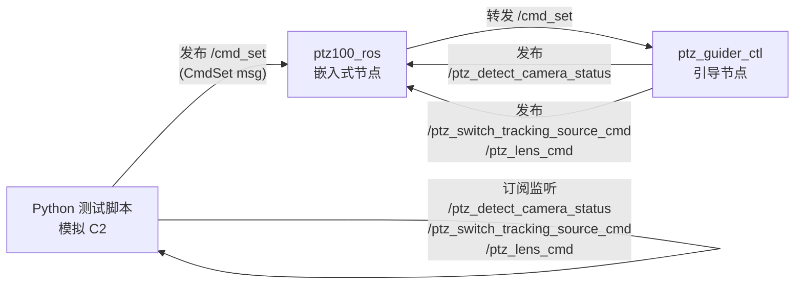

# 室内自测方案：嵌入式与引导节点交互验证

## 测试原理




注意：Python 脚本**直接发布到 /cmd_set**（跳过 alink 层），因为没有 C2 硬件。引导节点订阅 `/cmd_set` 后处理，嵌入式节点订阅引导节点的输出。脚本同时监听所有下游 topic 验证结果。

## 测试脚本功能

创建一个 Python 脚本 `test_ptz_interaction.py`，放在 `/home/skyfend/workspace/ptz100_agx/` 根目录。

### 脚本功能

1. **发送命令**：通过交互式菜单向 `/cmd_set` 发布 4 种命令
2. **监听反馈**：同时订阅 3 个下游 topic，实时打印收到的消息

### 发送的命令（/cmd_set）


| 菜单选项 | cmd_id | state_code | 说明               |
| ---- | ------ | ---------- | ---------------- |
| 1    | 53     | 0 or 1     | 设置跟踪源切换模式（自动/手动） |
| 2    | 54     | 0 or 1     | 手动切换跟踪相机（可见光/红外） |
| 3    | 55     | 0, 1, 或 2  | ICR 切换（自动/开/关）   |
| 4    | 56     | 0 or 1     | PTZ 控制模式（自动/全手动） |


### 监听的 topic


| Topic                             | 消息类型                         | 验证内容                                                                 |
| --------------------------------- | ---------------------------- | -------------------------------------------------------------------- |
| `/ptz_detect_camera_status`       | `PtzDetectCameraStatus`      | 引导节点状态回传（detect_camera_mode, detect_camera, icr_value, ptz_ctl_mode） |
| `/ptz_switch_tracking_source_cmd` | `PtzSwitchTrackingSourceCmd` | 引导节点执行跟踪源切换（tracking_source）                                         |
| `/ptz_lens_cmd`                   | `PtzLensCmd`                 | 引导节点执行 ICR 切换（ctrl_cmd=18/19/20）                                     |


### 验证用例

**用例 1：跟踪源切换模式**

- 发送 cmd_id=53, state_code=1（手动）
- 预期：`/ptz_detect_camera_status` 中 `detect_camera_mode=1`

**用例 2：手动切换跟踪相机**

- 先发 cmd_id=53, state_code=1（手动模式）
- 再发 cmd_id=54, state_code=1（切换到红外）
- 预期：`/ptz_switch_tracking_source_cmd` 中 `tracking_source=1`（红外）
- 预期：`/ptz_detect_camera_status` 中 `detect_camera=1`

**用例 3：ICR 切换**

- 发送 cmd_id=55, state_code=1（ICR 开/夜视）
- 预期：`/ptz_lens_cmd` 中 `ctrl_cmd=18`（CTRL_CMD_ICR_ON）
- 预期：`/ptz_detect_camera_status` 中 `icr_value=0`（ICR_VALUE_ON）

**用例 4：PTZ 控制模式**

- 发送 cmd_id=56, state_code=1（全手动）
- 预期：`/ptz_detect_camera_status` 中 `ptz_ctl_mode=1`

## 运行方式

```bash
# 终端1：启动嵌入式和引导节点（已有的启动方式）

# 终端2：运行测试脚本
source /home/skyfend/workspace/ptz100_agx/ros_ws/install/setup.bash
python3 /home/skyfend/workspace/ptz100_agx/test_ptz_interaction.py
```

## 前置条件

- PtzLensCmd.msg 的 ICR 枚举值已更新，需重新编译 `skyfend_interfaces`
- `ptz100_ros` 和 `ptz_guider_ctl` 节点需要正常启动（不需要实际 PTZ 设备和 C2）

