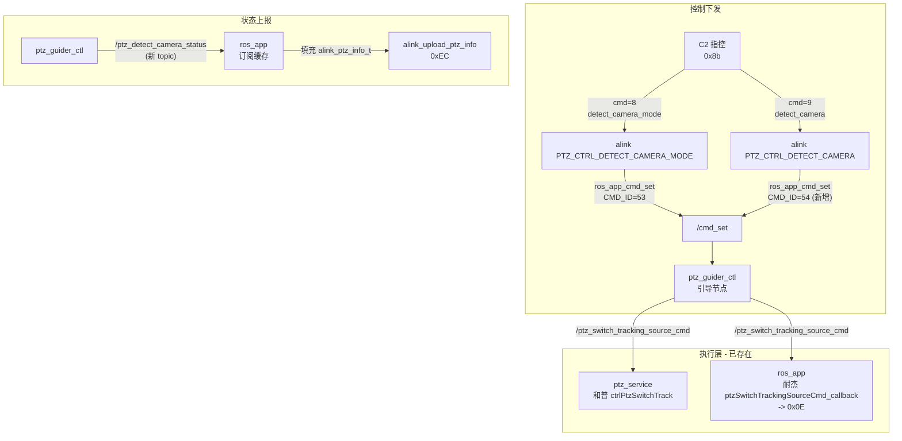

# PTZ 跟踪源切换开发方案

## 一、现有基础设施（已存在，无需修改）

大量代码已就位，只是 alink 层没有为非激光设备打通：

- **`PtzSwitchTrackingSourceCmd.msg`**: 已定义 `VISIBLE_LIGHT_SOURCE=0`, `INFRARED_SOURCE=1`
- **`CmdEnum.msg`**: 已有 `CMD_ID_SETTING_USER_PTZ_CONTROLLER_DETECT_CAMERA_MODE=53`
- **引导节点 `ptz_guider_ctl`**: 已订阅 `/cmd_set`，已有 `ptzSwitchTrackingSource()` 函数，已发布 `/ptz_switch_tracking_source_cmd`
- **`ptz_service` (和普)**: 已订阅 `/ptz_switch_tracking_source_cmd` -> `ctrlPtzSwitchTrack()`
- **`ros_app` (耐杰)**: 已订阅 `/ptz_switch_tracking_source_cmd` -> `ptzSwitchTrackingSourceCmd_callback()` -> `send_ptz_tracking_source()` (0x0E)
- **`alink_system.h`**: 已有 `PTZ_CTRL_DETECT_CAMERA_MODE=8`, `PTZ_CTRL_DETECT_CAMERA=9`, `detect_camera_mode`, `detect_camera` 字段

## 二、架构图



## 三、需要修改的文件

### Step 1: CmdEnum.msg - 新增 detect_camera 的 CMD_ID

文件: [ros_ws/src/srp100_message/skyfend_interfaces/msg/common_msg/CmdEnum.msg](ros_ws/src/srp100_message/skyfend_interfaces/msg/common_msg/CmdEnum.msg)

在 `CMD_ID_SETTING_USER_PTZ_CONTROLLER_DETECT_CAMERA_MODE = 53` 之后新增:

```
uint8 CMD_ID_SETTING_USER_PTZ_CONTROLLER_DETECT_CAMERA = 54
```

### Step 2: alink_system.cpp - 补充非激光设备的下发路径

文件: [src/srv/alink/command/system/alink_system.cpp](src/srv/alink/command/system/alink_system.cpp) 第 577~604 行

当前 `PTZ_CTRL_DETECT_CAMERA_MODE` 和 `PTZ_CTRL_DETECT_CAMERA` 的 else 分支都是 `LOG_ERROR("not supported")`，需要改为通过 `/cmd_set` 发给引导节点:

```cpp
case PTZ_CTRL_DETECT_CAMERA_MODE : {
    if (sendToLaserPtzGuidance) {
        // ... 激光路径不变 ...
    } else {
        int32_t cmd_id = skyfend_interfaces::msg::CmdEnum::CMD_ID_SETTING_USER_PTZ_CONTROLLER_DETECT_CAMERA_MODE;
        ros_app::ros_app_cmd_set(cmd_id, 0, sizeof(req->detect_camera_mode), (uint8_t*)&req->detect_camera_mode);
    }
} break;

case PTZ_CTRL_DETECT_CAMERA : {
    if (sendToLaserPtzGuidance) {
        // ... 激光路径不变 ...
    } else {
        int32_t cmd_id = skyfend_interfaces::msg::CmdEnum::CMD_ID_SETTING_USER_PTZ_CONTROLLER_DETECT_CAMERA;
        ros_app::ros_app_cmd_set(cmd_id, 0, sizeof(req->detect_camera), (uint8_t*)&req->detect_camera);
    }
} break;
```

### Step 3: alink_system.h - 0xEC 结构体增加跟踪源状态字段

文件: [src/srv/alink/command/system/alink_system.h](src/srv/alink/command/system/alink_system.h) 第 129~150 行

从 `reserve[10]` 中拆出 2 字节:

```cpp
typedef struct alink_ptz_info {
    // ... 现有字段不变 ...
    uint16_t visible2_focus;
    uint8_t  detect_camera_mode;  // 跟踪源模式: 0=自动, 1=手动（原 reserve[0]）
    uint8_t  detect_camera;       // 当前跟踪源: bit0=可见光, bit1=红外（原 reserve[1]）
    uint8_t  reserve[8];          // 剩余 8 字节
} alink_ptz_info_t;
```

### Step 4: 定义引导节点上报状态的 topic + ros_app 订阅

**新 topic**: `/ptz_detect_camera_status`（名称预定义，告知引导节点同学）

消息类型方案有两种，建议复用 `CmdSet` 或新建一个简单 msg。考虑到只有 2 个 uint8 字段，建议**先用现有 `PtzSwitchTrackingSourceCmd.msg` 中增加 mode 字段**，或者直接在 `ros_app` 中预留订阅回调和缓存变量，等引导同学确定后填充。

**ros_app.cpp 新增**:
- 静态缓存变量: `static uint8_t s_detect_camera_mode = 0; static uint8_t s_detect_camera = 0;`
- 订阅回调: 收到引导节点发布的状态后更新缓存
- 在 `cb_sub_hepuPtzInfo` 等 0xEC 上报回调中: 将缓存值填入 `ptzInfo.detect_camera_mode` 和 `ptzInfo.detect_camera`

### Step 5: 验证

- 确认无编译错误
- 确认无遗漏引用
