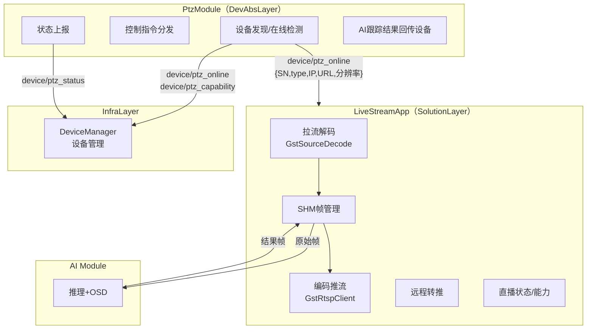
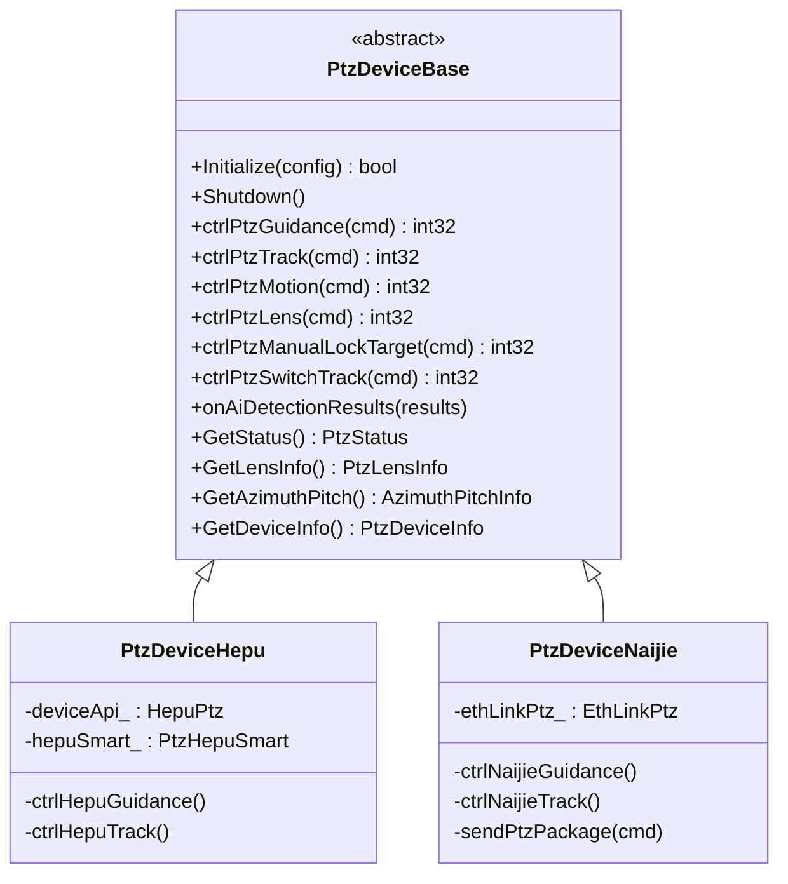
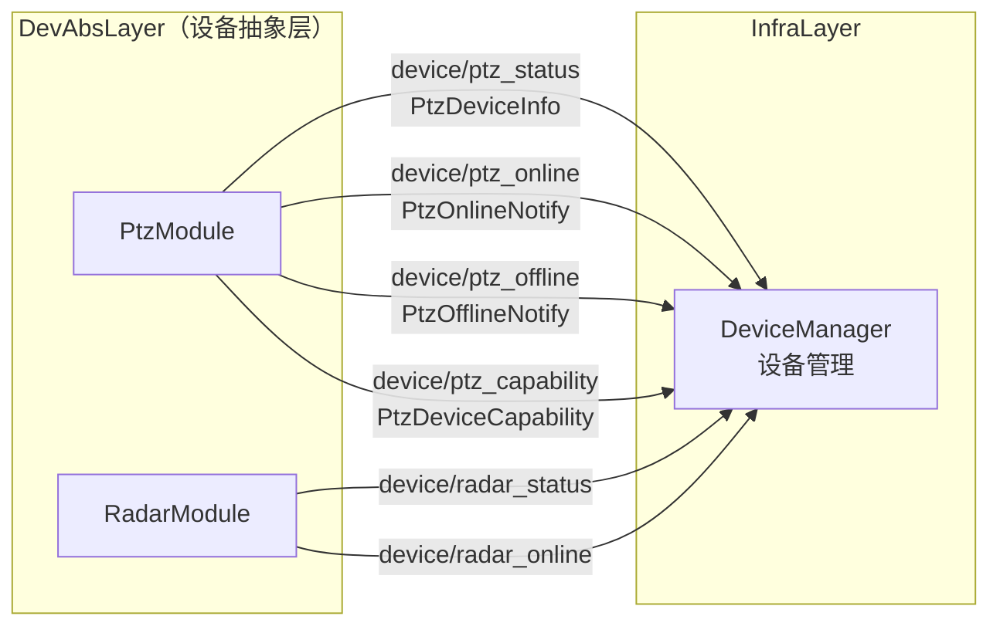

# PTZ 迁移方案修订计划

## 一、修订背景（5 个问题的结论）

### 1. 视频流链路归属 -- PtzModule 仅保留控制+状态

**结论：拉流解码（GstSourceDecode）、SHM 管理、编码推流（GstRtspClient）全部归 LiveStreamApp。**

PtzModule 仅负责：

- **控制链路**：订阅 AimRT Channel 控制指令 → 分发到设备（和普 SDK / 耐杰 eth_link 协议）
- **状态上报链路**：采集设备状态 → 通过 AimRT Channel 发布
- **设备上下线通知**：发现设备后通过 `device/ptz_online` Channel 通知 LiveStreamApp（携带 SN、type、IP、RTSP URL、分辨率等），由 LiveStreamApp 创建视频 Pipeline

各模块关系：




### 2. 激光 PTZ

- 控制和状态上报：**不纳入本次 PTZ 迁移方案**，从方案中移除（原 PTZ_HEF100/PTZ_HEP10/PTZ_HEP21 设备类型仍在枚举中预留，但不实现）
- 视频相关：在 **视频直播服务设计文档** 中预留设计（已有激光设备 camera_list 配置示例），暂不实现

### 3. Proto 文件组织 -- 每个设备一个 proto

按照团队规范（参考 `protocols/README.md`），`device/` 目录下的 proto 是**设备本身的数据**（状态数据、配置参数、控制指令），每个设备一个 proto 文件。与 ROS2 不同，proto 一个文件可包含多个 message。

**Proto 文件分布**：

- `protocols/device/ptz/hepu.proto` -- 和普设备所有消息（状态、镜头信息、方位角、转台/镜头控制指令、设备信息等）
- `protocols/device/ptz/naijie.proto` -- 耐杰设备所有消息（同上，字段相同但独立定义，便于后续各自演化）
- `protocols/fusion/` 或其他外部目录 -- 引导类指令（PtzGuidanceCmd、PtzTrackCmd），由融合算法模块定义，不属于设备自身

**不新建** `ptz_control.proto` / `ptz_status.proto` / `ptz_device.proto` 等拆分文件。

**设备上下线通知**（PtzOnlineNotify、PtzOfflineNotify）和 **AI 跟踪结果**（AiTrackResult）属于跨模块通信消息，归属待定（可放 `common/` 或由各自模块定义）。

### 4. 耐杰 GStreamer 代码迁移归属

纠正原方案：耐杰的拉流解码代码（`ptz_app.cpp` 中 `GstSourceDecode` 使用）和编码推流代码（`alg_app.cpp` 中 `GstRtspClient` + `image_get_thread`）**均为嵌入式模块代码**，需要迁移。在新架构中这些代码归入 **LiveStreamApp**（不是 PtzModule）：


| 现有代码                                                 | 功能            | 迁移目标                   |
| ---------------------------------------------------- | ------------- | ---------------------- |
| `ptz_app.cpp` → `GstSourceDecode`                    | 耐杰 RTSP 拉流硬解码 | LiveStreamApp Pipeline |
| `ptz_app.cpp` → `ShmTransferFrame::writeFrame`       | 耐杰解码帧写 SHM    | LiveStreamApp SHM 管理   |
| `alg_app.cpp` → `GstRtspClient` + `image_get_thread` | 耐杰编码推流        | LiveStreamApp Pipeline |
| `alg_app.cpp` → `image_get_thread_infrared`          | 耐杰红外编码推流      | LiveStreamApp Pipeline |
| `ros_app.cpp` → 控制回调 + `eth_link_ptz`                | 耐杰控制指令        | **PtzModule**（仅此项）     |


### 5. Protobuf 消息细化

基于 ROS2 `.msg` 文件（`skyfend_interfaces/msg/ptz_msg/`）逐字段映射为 proto3，详见下方。

---

## 二、PTZ 方案文档具体修改项

### 2.1 PtzDeviceBase 类 -- 移除所有视频成员

原方案中 `PtzDeviceBase` 包含 `sourceDecoderVisible`*、`rtspClientVisible`*、`shmVisibleRaw_` 等视频相关成员和方法（`StartVideoPipeline`、`StopVideoPipeline`、`visiblePushThread`）。修改后的基类仅保留：




**移除项**：`sourceDecoderVisible_`、`sourceDecoderThermal_`、`rtspClientVisible_`、`rtspClientThermal_`、`shmVisibleRaw_`、`shmThermalRaw_`、`StartVideoPipeline()`、`StopVideoPipeline()`、`visiblePushThread()`、`thermalPushThread()`、`onRawVideoFrame()`

### 2.2 Module 架构图 -- 移除视频组件

PtzModule 架构图中移除 `GstSourceDecode`、`GstRtspClient`、`ShmTransferFrame`，增加 `device/ptz_online` 通知 Channel。

### 2.3 移除"三条链路"中的"视频流链路"章节

原方案第三节有 3.1 视频流链路、3.2 控制链路、3.3 状态上报链路。修改为仅保留两条链路（控制+状态），并新增"设备上下线通知"作为第三条链路（与 LiveStreamApp 的接口）。

### 2.4 更新耐杰章节（七、耐杰 PtzDeviceNaijie 设计要点）

原方案的"代码来源映射"表中耐杰的拉流解码、SHM 写入、AI结果读取+推流逻辑当前映射到 PtzDeviceNaijie 内部。修改后这些行标记为"→ LiveStreamApp"，PtzDeviceNaijie 仅保留控制指令和状态上报。

### 2.5 更新目录结构

移除 `Ptz/proto/` 目录（proto 文件改放 `protocols/device/ptz/`），移除 `Ptz/device/laser/` 目录（激光不在本方案中）。

### 2.6 迁移步骤精简

阶段一（和普）和阶段二（耐杰）中移除视频 Pipeline 相关步骤（如"启动视频 Pipeline"、"迁移推流线程"），仅保留控制和状态相关步骤。阶段三（激光）整体移除。

---

## 三、Protobuf 消息详细定义

按照团队规范，`protocols/device/` 下**每个设备一个 proto 文件**，包含设备本身的所有数据（状态、配置、控制指令）。引导类指令（来自融合算法）放在 `device/` 外部。

基于现有 ROS2 `.msg` 字段 1:1 映射，确保迁移零丢失。

### 3.1 `protocols/device/ptz/hepu.proto` -- 和普设备消息

> `naijie.proto` 结构相同，`package` 改为 `terrahub.device.ptz.naijie`，字段一致。两个文件独立定义，便于后续各自演化（如耐杰新增 eth_link 特有字段、和普新增 SDK 特有字段）。

```protobuf
syntax = "proto3";
package terrahub.device.ptz.hepu;

// ============================================================
// 设备类型枚举
// ============================================================
enum PtzType {
  PTZ_NAIJIE = 0;          // 耐杰近程 PTZ
  PTZ_HEF100 = 1;         // 霍克眼激光（预留）
  PTZ_HEP10 = 2;          // 霍克眼激光（预留）
  PTZ_HEP21 = 3;          // 霍克眼激光（预留）
  PTZ_HEPU = 4;            // 和普三型 Z50（非制冷）
  PTZ_NAIJIE_MID = 5;     // 耐杰中程 PTZ
  PTZ_HEPU_COOLED = 6;    // 和普四型 Z50（制冷）
}

// ============================================================
// 一、状态数据（PtzModule → 上层模块 / DeviceManager）
// ============================================================

// PTZ 工作状态
// 原 ROS2 Topic: /ptz_status
message PtzStatus {
  enum WorkStatus {
    WORK_STATUS_ABNORMAL = 0;
    WORK_STATUS_NORMAL = 1;
  }
  enum WorkMode {
    WORK_MODE_IDLE = 0;
    WORK_MODE_SEARCHING = 1;
    WORK_MODE_TRACKING = 2;
  }
  enum DetectCameraMode {
    DETECT_CAMERA_MODE_AUTO = 0;
    DETECT_CAMERA_MODE_MANUAL = 1;
  }

  uint64 timestamp = 1;               // ms
  uint32 dev_id = 2;
  uint32 photoelectricity_no = 3;
  uint64 photoelectricity_status_timestamp = 4;  // ms, from ptz dev
  uint32 work_status = 5;             // WorkStatus enum
  uint32 work_mode = 6;               // WorkMode enum
  uint64 bitcode = 7;
  uint32 tracking_video_source = 8;    // 0=VISIBLE, 1=INFRARED, 3=VISIBLE_FINE
  uint32 ir_power = 9;                // 0=ON, 1=OFF
  uint32 detect_camera_mode = 10;      // DetectCameraMode enum
  uint32 laser_work_mode = 11;        // 1=START, 2=END, 3=STANDBY
}

// PTZ 镜头信息
// 原 ROS2 Topic: /ptz_lens_info
message PtzLensInfo {
  uint64 timestamp = 1;
  uint32 dev_id = 2;
  uint64 photoelectricity_timestamp = 3;
  uint32 visible_horizontal_fov_angle = 4;     // degree
  uint32 visible_vertical_fov_angle = 5;
  uint32 visible_fine_horizontal_fov_angle = 6;
  uint32 visible_fine_vertical_fov_angle = 7;
  uint32 thermal_horizontal_fov_angle = 8;
  uint32 thermal_vertical_fov_angle = 9;
  uint32 visible_lens_mag = 10;
  uint32 visible_fine_lens_mag = 11;
  uint32 thermal_lens_mag = 12;
  int32 visible_zoom = 13;
  int32 visible_focal = 14;
  int32 visible_fine_zoom = 15;
  int32 visible_fine_focal = 16;
  int32 thermal_zoom = 17;
  int32 thermal_focal = 18;
}

// PTZ 方位角/俯仰角信息
// 原 ROS2 Topic: /ptz_azimuth_pitch_info
message AzimuthPitchInfo {
  uint64 timestamp = 1;
  uint32 dev_id = 2;
  uint32 photoelectricity_no = 3;
  uint64 photoelectricity_status_timestamp = 4;
  double horizontal_angle = 5;         // 方位角
  double pitching_angle = 6;           // 俯仰角
  double distance = 7;
  double horizontal_angle_speed = 8;   // 方位角速度
  double pitch_angle_speed = 9;        // 俯仰角速度
  uint32 target_height = 10;           // 原 uint16
  uint32 lens_magnification = 11;      // 原 uint8
}

// ============================================================
// 二、设备信息
// ============================================================

// 相机通道信息
message CameraInfo {
  string camera_index = 1;            // "visible-0" / "infrared-0"
  uint32 width = 2;
  uint32 height = 3;
  string rtsp_url = 4;                // RTSP 拉流地址
}

// PTZ 设备详细信息（周期上报）
// 原 ROS2 Topic: /ptz_device_info
message PtzDeviceInfo {
  uint64 timestamp = 1;
  uint32 dev_id = 2;
  uint32 device_type = 3;             // PtzType enum
  bool connected = 4;
  string sn = 5;
  string ip = 6;
  uint32 port = 7;
  string url_rgb = 8;                 // 可见光 RTSP URL
  string url_infrared = 9;            // 红外 RTSP URL
  float azimuth = 10;                 // 方位角(度)
  float elevation = 11;               // 俯仰角(度)
  float omega_az = 12;                // 方位角速度
  float omega_el = 13;                // 俯仰角速度
  float zoom = 14;                    // 变焦值
  float focus = 15;                   // 聚焦
  float focal = 16;                   // 焦距
}

// 设备上线通知 (PtzModule → LiveStreamApp / DeviceManager)
message PtzOnlineNotify {
  string sn = 1;
  uint32 device_type = 2;             // PtzType enum
  string ip = 3;
  repeated CameraInfo cameras = 4;    // 该设备所有相机通道及 RTSP URL
}

// 设备离线通知 (PtzModule → LiveStreamApp / DeviceManager)
message PtzOfflineNotify {
  string sn = 1;
  uint32 device_type = 2;
}

// ============================================================
// 三、设备控制指令（设备自身的控制，非引导类）
// ============================================================

// PTZ 转台运动指令
// 原 ROS2 Topic: /ptz_motion_cmd
message PtzMotionCmd {
  enum MotionDirCmd {
    MOTION_DIR_CMD_STOP = 0;
    MOTION_DIR_CMD_LEFT = 1;
    MOTION_DIR_CMD_RIGHT = 2;
    MOTION_DIR_CMD_UP = 3;
    MOTION_DIR_CMD_DOWN = 4;
    MOTION_DIR_CMD_LEFTUP = 5;
    MOTION_DIR_CMD_LEFTDOWN = 6;
    MOTION_DIR_CMD_RIGHTUP = 7;
    MOTION_DIR_CMD_RIGHTDOWN = 8;
  }

  uint64 timestamp = 1;
  uint32 dev_id = 2;
  uint32 photoelectricity_no = 3;
  uint64 sys_timestamp = 4;
  uint32 motion_dir_cmd = 5;           // MotionDirCmd enum
  uint32 angle_speed_level = 6;
  uint32 motion_type = 7;
  uint32 reserver = 8;
}

// PTZ 镜头控制指令
// 原 ROS2 Topic: /ptz_lens_cmd
message PtzLensCmd {
  enum LensCtrlCmd {
    LENS_CTRL_CMD_STOP = 0;
    LENS_CTRL_CMD_GOTO_PHYSICAL_FOCAL_LENS = 1;
    LENS_CTRL_CMD_GOTO_FOCAL_RATE = 2;
    LENS_CTRL_CMD_GOTO_ZOOM_FOCUS = 3;
    LENS_CTRL_CMD_CONTINUOUS_ZOOM_OUT = 4;
    LENS_CTRL_CMD_CONTINUOUS_ZOOM_IN = 5;
    LENS_CTRL_CMD_ONCE_ZOOM_OUT = 6;
    LENS_CTRL_CMD_ONCE_ZOOM_IN = 7;
    LENS_CTRL_CMD_CONTINUOUS_FOCUS_OUT = 8;
    LENS_CTRL_CMD_CONTINUOUS_FOCUS_IN = 9;
    LENS_CTRL_CMD_ONCE_FOCUS_OUT = 10;
    LENS_CTRL_CMD_ONCE_FOCUS_IN = 11;
    LENS_CTRL_CMD_GOTO_ZOOM = 12;
    LENS_CTRL_CMD_GOTO_FOCUS = 13;
    LENS_CTRL_CMD_DEFOG_ON = 14;
    LENS_CTRL_CMD_DEFOG_OFF = 15;
    LENS_CTRL_CMD_WINDOW_HEAT_ON = 16;
    LENS_CTRL_CMD_WINDOW_HEAT_OFF = 17;
    LENS_CTRL_CMD_ICR_AUTO = 18;
    LENS_CTRL_CMD_ICR_ON = 19;
    LENS_CTRL_CMD_ICR_OFF = 20;
    LENS_CTRL_CMD_START_AUTO_ZOOM = 21;
    LENS_CTRL_CMD_STOP_AUTO_ZOOM = 22;
  }

  uint64 timestamp = 1;
  uint32 dev_id = 2;
  uint32 photoelectricity_no = 3;
  uint32 sys_no = 4;
  uint64 sys_timestamp = 5;
  uint32 ctrl_cmd = 6;                 // LensCtrlCmd enum
  uint32 focal = 7;
  int32 zoom = 8;
  int32 focus = 9;
  uint32 reserver = 10;
  uint32 camera_id = 11;              // video source enum
}

// PTZ 手动锁定目标指令
// 原 ROS2 Topic: /ptz_manual_lock_target_cmd
message PtzManualLockTargetCmd {
  uint64 timestamp = 1;
  uint32 dev_id = 2;
  uint32 photoelectricity_no = 3;
  uint64 sys_timestamp = 4;
  uint32 track_video_source = 5;       // 0=RGB, 1=INFRARED, 2=RGB_FINE
  int32 target_x = 6;                 // 画面坐标 X（像素）
  int32 target_y = 7;                 // 画面坐标 Y（像素）
  uint32 second_tracking_flag = 8;     // 二次跟踪标志（和普预留）
  uint32 reserver = 9;
}

// PTZ 切换跟踪源指令
// 原 ROS2 Topic: /ptz_switch_tracking_source_cmd
message PtzSwitchTrackCmd {
  enum TrackingSource {
    VISIBLE_LIGHT_SOURCE = 0;
    INFRARED_SOURCE = 1;
    VISIBLE_LIGHT_SOURCE_FINE = 2;
  }

  uint64 timestamp = 1;
  uint32 dev_id = 2;
  uint32 photoelectricity_no = 3;
  uint64 sys_timestamp = 4;
  uint32 tracking_source = 5;         // TrackingSource enum
  uint32 reserver = 6;
}

// ============================================================
// 四、设备能力描述（PtzModule → DeviceManager）
// ============================================================

// 设备能力上报（设备上线时或 DeviceManager 查询时返回）
message PtzDeviceCapability {
  string sn = 1;
  uint32 device_type = 2;              // PtzType enum
  repeated CameraInfo cameras = 3;     // 该设备拥有的相机通道列表
  bool support_tracking = 4;           // 是否支持跟踪
  bool support_guidance = 5;           // 是否支持引导
  bool support_lens_control = 6;       // 是否支持镜头控制
  bool support_ir_power = 7;           // 是否支持红外功率控制
}
```

### 3.2 `protocols/device/ptz/naijie.proto` -- 耐杰设备消息

结构与 `hepu.proto` 相同，`package` 为 `terrahub.device.ptz.naijie`，所有 message 名和字段一致（此处不重复展示完整内容）。后续耐杰如需新增 `eth_link` 特有字段（如帧计数器、协议版本等），在此文件中扩展。

### 3.3 引导类指令 -- 放在 `protocols/fusion/` 目录（不属于 device/）

引导指令由融合算法模块发出，不属于 PTZ 设备自身数据。张总已将其放在 `device/` 外部。

```protobuf
// protocols/fusion/ptz_guidance.proto（示意，具体路径由融合模块负责人确定）
syntax = "proto3";
package terrahub.fusion;

// PTZ 引导控制指令
// 来源：融合算法 PtzGuidance → PtzModule
// 原 ROS2 Topic: /ptz_guidance_cmd
message PtzGuidanceCmd {
  uint64 timestamp = 1;               // ms
  uint32 dev_id = 2;
  uint32 ctrl_cmd = 3;                // 0=雷达指引, 1=位置环
  uint32 photoelectricity_no = 4;
  uint32 sys_no = 5;
  uint64 guidance_count = 6;
  uint32 guidance_mode = 7;            // 0=AUTOMATIC, 1=MANUAL
  uint32 working_state = 8;            // 0=IDLE, 1=STEERING, 2=SEARCHING, 3=TRACKING
  uint32 camera_id = 9;               // video source enum
  float guiding_azimuth = 10;          // degree
  float guiding_elevation = 11;        // degree
  float guiding_range = 12;            // m
}

// PTZ 跟踪控制指令
// 原 ROS2 Topic: /ptz_track_cmd
message PtzTrackCmd {
  enum CtrlCmd {
    CTRL_CMD_UNSPECIFIED = 0;
    CTRL_CMD_SEARCH_TRACKING = 1;
    CTRL_CMD_TRACKING = 2;
    CTRL_CMD_RELEASE = 3;
    CTRL_CMD_JUST_SEARCH = 4;
    CTRL_CMD_HORIZONTAL_SEARCH_TRACKING = 5;
    CTRL_CMD_VERTICAL_SEARCH_TRACKING = 6;
    CTRL_CMD_AUTO_TRACKING_FAIL = 7;
  }
  enum TrackVideoSource {
    TRACK_VIDEO_SOURCE_RGB = 0;
    TRACK_VIDEO_SOURCE_INFRARED = 1;
    TRACK_VIDEO_SOURCE_RGB_FINE = 2;
  }

  uint64 timestamp = 1;
  uint32 dev_id = 2;
  uint32 photoelectricity_no = 3;
  uint64 sys_timestamp = 4;
  uint32 ctrl_cmd = 5;                 // CtrlCmd enum
  uint32 horizontal_search_begin = 6;
  uint32 horizontal_search_end = 7;
  uint32 pitching_search_begin = 8;
  uint32 pitching_search_end = 9;
  uint32 cmd_id = 10;                  // 0=CTRL_CMD_TRACK, 1=IR_POWER
  uint32 ir_power = 11;                // 0=ON, 1=OFF
  uint32 track_video_source = 12;      // TrackVideoSource enum
}
```

### 3.4 AI 跟踪结果 -- 归属待定

AI 检测/跟踪结果（原 `/visiblelight_track_objs`、`/infrared_track_objs`）由 AI 模块定义，PtzModule 仅订阅。建议放在 AI 模块的 proto 目录，此处仅列出字段供参考：

```protobuf
// 归属：AI 模块 proto 目录（如 protocols/ai/ 或由 AI 团队定义）
message AiTargetItem {
  uint32 target_id = 1;
  uint32 class_id = 2;
  float score = 3;
  float x = 4;
  float y = 5;
  float w = 6;
  float h = 7;
}

message AiTrackResult {
  uint64 timestamp = 1;
  uint64 frame_id = 2;
  uint32 device_type = 3;
  string device_sn = 4;
  uint32 ptz_source = 5;              // 0=VISIBLE, 1=INFRARED, 2=FUSION
  bool is_day_time = 6;
  string version = 7;
  uint32 target_id = 8;               // fusion tracking target id
  float zoom = 9;
  float h_fov = 10;                   // degree
  float v_fov = 11;                   // degree
  repeated AiTargetItem target_points = 12;
}
```

---

## 四、DeviceManager 接口

PtzModule（以及 RadarModule 等其他设备模块）需要向 **DeviceManager（设备管理模块，Infra 层）** 发布设备状态信息和设备能力，DeviceManager 负责构建全局设备拓扑。

### 4.1 通信方式




### 4.2 PtzModule 上报内容


| AimRT Channel           | 消息类型                  | 触发时机                      | 订阅者                          |
| ----------------------- | --------------------- | ------------------------- | ---------------------------- |
| `device/ptz_online`     | `PtzOnlineNotify`     | 设备上线时                     | DeviceManager, LiveStreamApp |
| `device/ptz_offline`    | `PtzOfflineNotify`    | 设备离线时                     | DeviceManager, LiveStreamApp |
| `device/ptz_status`     | `PtzDeviceInfo`       | 周期上报（如每 5s）               | DeviceManager, WebGateway    |
| `device/ptz_capability` | `PtzDeviceCapability` | 设备上线时 / DeviceManager 查询时 | DeviceManager                |


### 4.3 DeviceManager 职责（概要）

- 维护全局设备在线表（PTZ、Radar、Tracer、Laser 等）
- 构建主从设备拓扑关系
- 提供设备查询 RPC（供 WebGateway、融合模块等调用）
- 设备能力汇总（如全局可用相机数、设备列表等）

> DeviceManager 的详细设计由鲍工负责（见分工表 "Infra → DeviceManager(设备管理)"），此处仅定义 PtzModule 作为数据源的上报接口。

---

## 五、LiveStreamApp 文档需同步更新

在 [视频直播服务设计文档](~/.cursor/plans/TerraHub/视频直播服务设计文档_f939159b.plan.md) 中需同步修改：

1. **Section 4.2 职责边界**：确认 PtzModule 不再负责拉流解码，LiveStreamApp 完整拥有从 RTSP 拉流到推流的全链路
2. **激光设备预留**：在 `livestream_config.yaml` 的 devices 段已有激光设备 camera_list 示例（3 个相机通道），保持设计预留、标注"暂不实现"
3. **耐杰 Pipeline 迁移来源**：在 Section 4.1 迁移来源表中增加 `ptz_app.cpp`（耐杰 GstSourceDecode）和 `alg_app.cpp`（耐杰 GstRtspClient + image_get_thread）作为迁移来源

