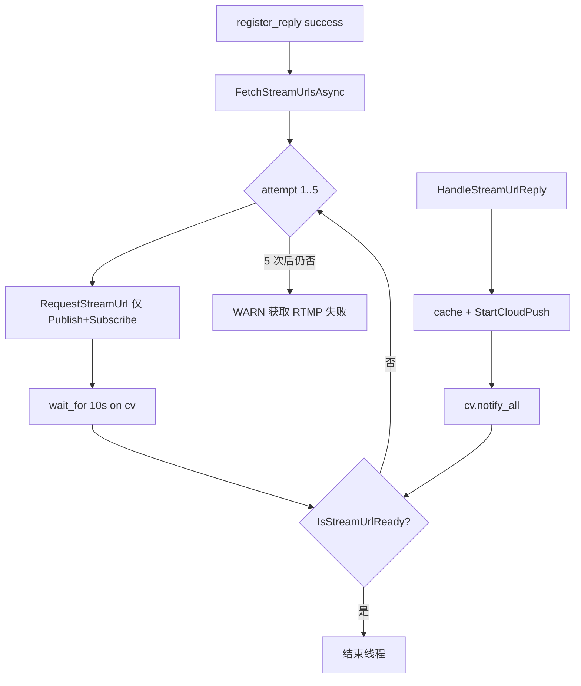

# RTMP 地址获取 — 最终简化方案（无状态机）

## 现状（保持不变的部分）

- **触发**：`register_reply` 且 `result==0` → 要推流地址（断网/断电重启后 **注册成功仍会再要**）。
- **单次注册窗口内**：目前只 `Publish` 一次，无超时重试 — **这是要补的唯一核心缺口**。
- **推流**：拿到 URL 后 `StartCloudPush`；`GstCloudPusher` 只负责管道断线重连，不负责重新要 URL。

## 目标

- nexus **必须**在冷启动/重连注册后拿到天盾下发的 zoom+ir 两路 RTMP。
- 实现简单：不搞 `enum State`、不复制 `DeviceLifecycle` 整套状态机。
- 日志可控：重试期 WARN 有界（最多 5 次请求 + 1 条失败汇总），不每秒刷。

---

## 最终方案：后台重试循环 + 就绪标志

### 核心思路

用一个 **后台线程 + for 循环 + `std::condition_variable`**，对齐 `DeviceLifecycle` 的「5 次 × 超时」习惯，但**不定义状态枚举**：




### 新增成员（`[ServiceRequestor](ros_ws/src/nexus_gateway/src/service/ServiceRequestor.h)`）


| 成员                                                            | 作用                    |
| ------------------------------------------------------------- | --------------------- |
| `std::atomic<bool> m_fetching{false}`                         | 防止并发启动多个重试线程          |
| `std::atomic<bool> m_streamUrlReady{false}`                   | zoom+ir 均已缓存          |
| `std::mutex m_fetchMtx` + `std::condition_variable m_fetchCv` | 等待 reply              |
| `std::thread m_fetchThread`                                   | 重试循环（`Stop()` 时 join） |


常量（与 register 对齐，可写死在 cpp）：

- `kMaxAttempts = 5`
- `kReplyWaitSec = 10`（单次 publish 后最长等 reply）

### 三个函数分工

1. `**bool IsStreamUrlReady() const**`
  `m_streamUrls` 中同时存在非空 `zoom`、`ir`。
2. `**void RequestStreamUrl()**`（保留，语义不变）
  只做：取 PTZ SN → Subscribe → **Publish 一次**。供重试循环反复调用。
3. `**void FetchStreamUrlsAsync()`**（对外入口，替代 NexusGateway 直接调 `RequestStreamUrl`）
  - 若 `m_fetching` 已为 true → **直接 return**（避免重连风暴叠线程）。  
  - 注册成功时：`**m_streamUrlReady = false`**（重连后强制重新认定；旧 CloudPusher 可继续跑，新 URL 到达后 `StartCloudPush` 会 stop+restart，与现逻辑一致）。  
  - 启动 `m_fetchThread`：

```text
     for (attempt = 1..5 && running):
       RequestStreamUrl()
       wait_for(10s) until m_streamUrlReady || stop
       if ready: break
     if !ready: skyfend_log_warn("stream URL fetch failed after 5 attempts")
     m_fetching = false
     

```

1. `**HandleStreamUrlReply**`（小改）
  - 解析成功后：写 `m_streamUrls` → `StartCloudPush`（不变）。  
  - 若 `IsStreamUrlReady()` → `m_streamUrlReady = true` → `m_fetchCv.notify_all()`。  
  - `result!=0` / 无 streams：**不 notify**（等本轮超时后进下一轮 attempt）。
2. `**Stop()`**
  - 置停止标志 → `notify_all` → `join` 重试线程 → 现有 `StopAllCloudPush()`。

### NexusGateway 改动

`[NexusGateway.cpp](ros_ws/src/nexus_gateway/src/NexusGateway.cpp)` 第 197 行：

```cpp
// 原：m_serviceReq->RequestStreamUrl();
m_serviceReq->FetchStreamUrlsAsync();
```

`RequestDeviceTimeSync()` 不变。

### 重连 / 断电行为（方案后）


| 场景                  | 行为                                              |
| ------------------- | ----------------------------------------------- |
| 断网 → MQTT 重连 → 注册成功 | `FetchStreamUrlsAsync()` 再跑 5 次循环，**会重新要 RTMP** |
| 断电进程重启 → 注册成功       | 同上                                              |
| 5 次内天盾已回            | 线程提前退出，**不**再 publish                           |
| 5 次仍失败              | 一条 WARN；**不**做 60s 永久轮询（保持简单；若现场需要再加配置项）        |


### 明确不做（简化裁剪）

- 无 `enum StreamUrlState`、无 `Idle/Pending/Failed` 状态机图。
- 无 tid/bid reply 门控（二期再考虑）。
- 不改 MQTT QoS、不改 `GstCloudPusher`。
- 无 PTZ SN 等待轮询（若 yaml 已配置真实 SN，与现网一致；fallback 问题靠配置解决）。
- 无「已 ready 则跳过 refetch」：注册成功一律 `m_streamUrlReady=false` 后重拉，保证重连后 URL 刷新。

### 日志（生产 WARN 可查）

- 已有：`stream URL cached [type]: rtmp://...`（建议保持 WARN）。  
- 新增：`stream URL fetch failed after 5 attempts`（汇总失败）。  
- 重试期可选：`device_stream_url request sent` 仍为 INFO，或仅在 attempt==1 打一次减少重复 — **推荐每 attempt 打一条 INFO**，5 条可接受。

---

## 改动文件与规模


| 文件                                                                                  | 变更                                                    |
| ----------------------------------------------------------------------------------- | ----------------------------------------------------- |
| `[ServiceRequestor.h](ros_ws/src/nexus_gateway/src/service/ServiceRequestor.h)`     | 成员 + `FetchStreamUrlsAsync()` 声明                      |
| `[ServiceRequestor.cpp](ros_ws/src/nexus_gateway/src/service/ServiceRequestor.cpp)` | 重试线程、`IsStreamUrlReady`、`HandleStreamUrlReply` notify |
| `[NexusGateway.cpp](ros_ws/src/nexus_gateway/src/NexusGateway.cpp)`                 | 1 行调用替换                                               |


预计 **~60 行**，仅 `nexus_gateway` 包内。

---

## 验证

```bash
# 成功：zoom/ir 各一行 + 不应出现 fetch failed
grep -E 'stream URL cached|stream URL fetch failed|device_stream_url request sent' \
  /home/skyfend/log/nexus_gateway.log | tail -20

# 重连后应再次出现 request sent（最多 5 条）和 cached
```

1. 正常启动：26ms 级 reply → 第 1 次 attempt 即 ready，线程退出。
2. 重连：断 MQTT → 恢复注册 → 再次出现 cached。
3. （可选）模拟无 reply：应看到最多 5 次 `request sent` + 1 条 `fetch failed`。

