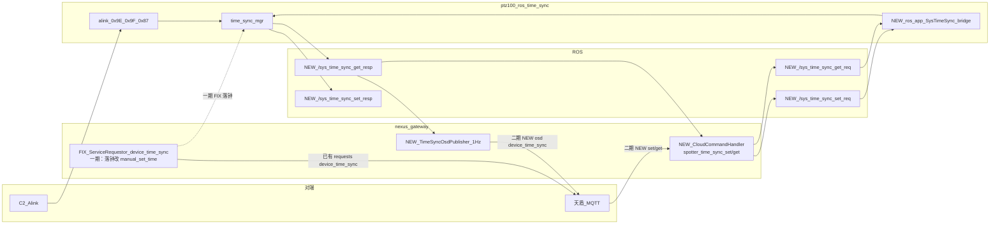

# SFL300 时间同步上云方案（双通道 · 三期）

## 先回答你的确认点

### 1) 天盾 4.8.6 `device_time_sync` 是否等于 C2 `0x87`？

**含义相同（都是 AGX 向对端要一个 UTC 做粗对齐兜底），协议链路不同，落钟入口目前也不同。**

| | C2 0x87 C2Time | 天盾 4.8.6 `device_time_sync` |
|--|----------------|------------------------------|
| 含义 | AGX 向 C2 要时间并 step 本机钟 | AGX 向天盾要时间并 step 本机钟 |
| 触发 | C2 TCP 建连 + AUTO + SyncSource=LOCAL | MQTT 注册成功后（nexus 现状） |
| 传输 | Alink：空请求 / 时间字符串应答 | MQTT `requests`/`requests_reply`：`output.timeStamp`（UTC ms） |
| 落钟（现状→一期后） | `time_sync_mgr_on_c2time_response` → **`time_sync_mgr_manual_set_time`** | **一期已改**：`HandleDeviceTimeSyncReply` → 同逻辑（`time_sync_settime_cap` / `settimeofday`；保留 `|delta|≥2s`） |

**feature/sfl300 现状结论（已核实）**：仓库内 **无** `set_time_c2.sh`（zhangzhaoquan 在 `8ae69e6b` 删除，已进 main）；未设置 `PTZ100_SET_TIME_C2_SH` 时，即使偏差 ≥2s 也会因脚本缺失失败，**云端粗校时实际上落不了钟**。`|delta|<2s` 则主动 skip。

因此：**不是“走 0x87”**；是同类兜底方案的云端版。**更新 AGX 系统时间目前不是同一函数，且云端路径当前基本无效——一期先修落钟。**

### 2) `SysTimeSyncSet/Get.msg` 是谁提交的？

**不是 zhangzhaoquan。** 在子仓 `ros_ws/src/srp100_message`：

- Commit `206a5c0`（2026-07-31）
- Author: **zhouyihui** `<zhouyihui@skyfend.cn>`
- Subject: `增加系统控制指令msg`

结论：周益辉预埋的 ROS 接口（topic 注释已写 `/sys_time_sync_*`），**无业务实现**；**二期**落地对接。

### 3) AGX↔C2 是否已实现 `LastSetTimestamp`？

**未实现，仅协议文档有。**

- [`time_sync_0x9f_report_t`](src/srv/time_sync/time_sync_types.h) 仍是：`… NtpTimeSourceStatus + Reserved[32]`，**无** `LastSetTimestamp` 字段
- `src/srv/time_sync/**`、`alink_system.cpp` 中无 `LastSetTimestamp` / `last_set_timestamp` 符号

聊天结论（产品语义，**三期**实现）：**上位机（C2/天盾）下发授时设置接口成功的时刻**（设备侧记录的成功时间，写入配置后在 0x9F/OSD 回传），**不是** 0x9E 载荷里的 `SetTimestamp`（那是手动设时要写入的系统时间值）。赵宁“含自动”与鲍工“仅 C2 手动值”已由方明纠正为：**下发设置成功时间（手动/自动改配置都算）**。

**二期**：云端 JSON / ROS msg 可带 `last_set_timestamp`（暂填 0）。  
**三期**：Alink 二进制布局改造 + 持久化记成功时刻并回填真实值。

### 4) `device_time_sync` 同名是否靠 topic 区分？

**是，保持现状。**

- OSD 上报：`thing/product/{SN}/osd` + `method=device_time_sync`（完整 0x9F 状态）
- 粗校时：`…/requests` + `…/requests_reply` + `method=device_time_sync`（只要 `timeStamp`）

靠 **topic + data 形状** 区分，不改 method 名。

### 5) 通道策略

**双通道并存**：C2 Alink 0x9E/0x9F/0x87 **保留**；天盾增量 MQTT；两边都可设/查/看状态。单一真相源仍是进程内 `time_sync_mgr`（chrony + `g_persist`）。

---

## 分期

| 期 | 内容 |
|----|------|
| **一期** | 修好天盾粗校时**落钟**（请求已有；去掉已删 `set_time_c2.sh`，改调 `time_sync_mgr_manual_set_time`，保留 ≥2s） |
| **二期** | set/get/OSD 上云 + ROS 桥（`spotter_time_sync_set/get`、osd `device_time_sync`；`last_set_timestamp` 填 0） |
| **三期** | `LastSetTimestamp` 真实值（Alink 二进制 + 持久化） |

---

## 架构图：已有 / 一期修 / 二期新增

说明（mermaid 不用颜色，用节点名前缀）：

- **无前缀**：已有
- **`FIX_`**：一期只改落钟（模块已有）
- **`NEW_`**：二期新增

### 对照表（对应上图）

| 图中节点 | 状态 | 做什么 |
|----------|------|--------|
| C2 / alink_0x9E_0x9F_0x87 / time_sync_mgr | **已有** | C2 双通道一侧，不动 |
| ServiceRequestor + requests | **已有请求** | MQTT 要时间已通 |
| ServiceRequestor **落钟** | **一期 FIX** | 去掉 `set_time_c2.sh`，`≥2s` 时调 `time_sync_mgr_manual_set_time` |
| CloudCommandHandler set/get | **二期 NEW** | 天盾 services 下发 |
| ROS `/sys_time_sync_*` 四 topic | **二期 NEW** | msg 预埋、代码无 |
| ros_app_SysTimeSync_bridge | **二期 NEW** | req → mgr → resp |
| TimeSyncOsdPublisher 1Hz | **二期 NEW** | osd `device_time_sync` |
| LastSetTimestamp 真实值 | **三期** | 二期 JSON/msg 可先填 0 |

---

## 一期：粗校时落钟修复（已实现）

**改动文件**：
- [`ServiceRequestor.cpp`](ros_ws/src/nexus_gateway/src/service/ServiceRequestor.cpp) / [`.h`](ros_ws/src/nexus_gateway/src/service/ServiceRequestor.h)
- [`nexus_gateway/CMakeLists.txt`](ros_ws/src/nexus_gateway/CMakeLists.txt)：安装 `time_sync_settime_cap`
- [`time_sync_settime_cap_install.sh`](config/time_sync/time_sync_settime_cap_install.sh)：同时为 nexus helper 打 `cap_sys_time`

**实现要点**：
- 保留：注册后请求、解析 `output.timeStamp`、`|delta|≥2s` 才 step、异步线程
- 删除：对已删 `set_time_c2.sh` 的依赖
- 落钟：与 `time_sync_mgr_manual_set_time` **同逻辑**（优先 `time_sync_settime_cap`，失败 `settimeofday`）；不链整库 `time_sync`（避免拖入 alink）
- helper 查找：本进程旁 → `../ptz100_ros/time_sync_settime_cap` → `/usr/local/bin/ptz100_settime_cap`

**验收**：冷启动偏差 >2s 时 `requests_reply` 后 UTC 被 step；<2s skip；部署后跑一次 `time_sync_settime_cap_install.sh` 确保 cap。

---

## 二期：双通道设/查/OSD

### 协议映射

| 能力 | C2 | 天盾 | AGX 内部 |
|------|----|------|----------|
| 设置 | 0x9E | `spotter_time_sync_set` | ROS Set → `apply_cmd_0x9e` |
| 查询 | 0x9F 查询 | `spotter_time_sync_get` | ROS Get → `fill_0x9f` |
| 周期状态 | 0x9F 1Hz | osd `device_time_sync` | get_resp / 同填表 → MQTT |
| 粗校时 | 0x87 | requests `device_time_sync` | **一期已修好** |

`last_set_timestamp`：二期 JSON/msg **带字段，填 0**。

### 实现要点

- **ptz100**：`ros_app` 订 set/get_req，调 `time_sync_mgr`，发 resp；C2 Alink 路径不动
- **nexus**：CloudCommandHandler + RosDataBridge + OSD 1Hz Builder
- **msg**：`SysTimeSyncGet.msg` 增加 `last_set_timestamp`

**原则**：nexus **不**自己改 chrony；设/查经 ROS 进 `time_sync_mgr`。粗校时一期已直调 `manual_set_time`（仅 step 钟，不改 mode/conf）。

---

## 三期：LastSetTimestamp

- `time_sync_0x9f_report_t`：插入 `LastSetTimestamp`，Reserved 32→23
- 0x9E / 天盾 set **成功**时记录「成功时刻」并持久化
- C2 0x9F / 天盾 OSD / get 回真实值（语义：上位机下发设置成功时刻，非 SetTimestamp 载荷值）

---

## 风险与约定

- 双写 chrony：C2 与天盾后写覆盖，双通道预期内
- `device_time_sync` 同名：靠 topic（osd vs requests）区分
- 0x9E Result=0：不等 chrony restart 完成；用后续 get/OSD 看是否生效
- 分支：`feature/sfl300`

---

## 验收

**一期**：天盾粗校时在大偏差下真正落钟；C2 0x87/0x9E 回归不受影响。

**二期**：天盾 set/get/osd 通；C2 原路径回归；双通道状态一致。

**三期**：C2 与天盾 `last_set_timestamp` / `LastSetTimestamp` 为真实成功时刻。
