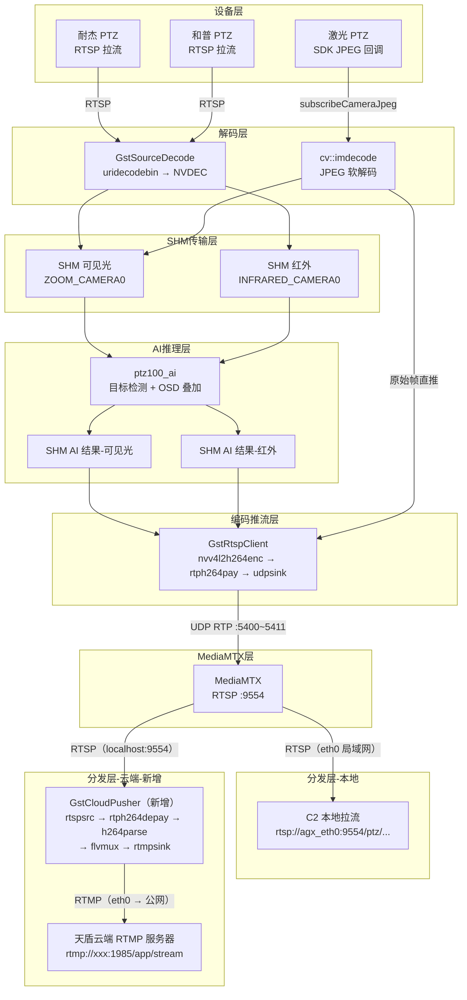
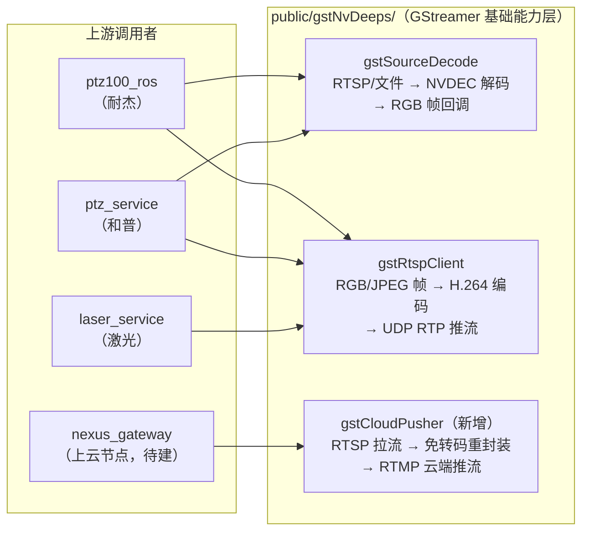
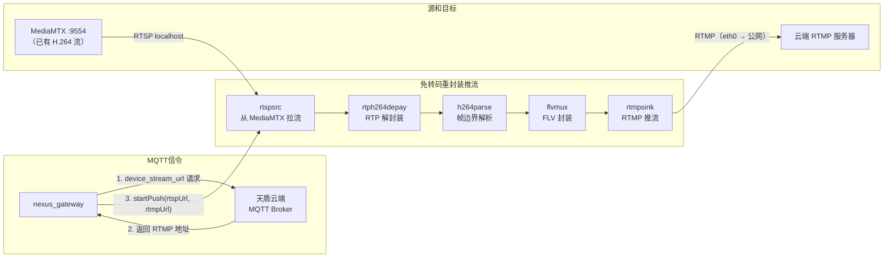
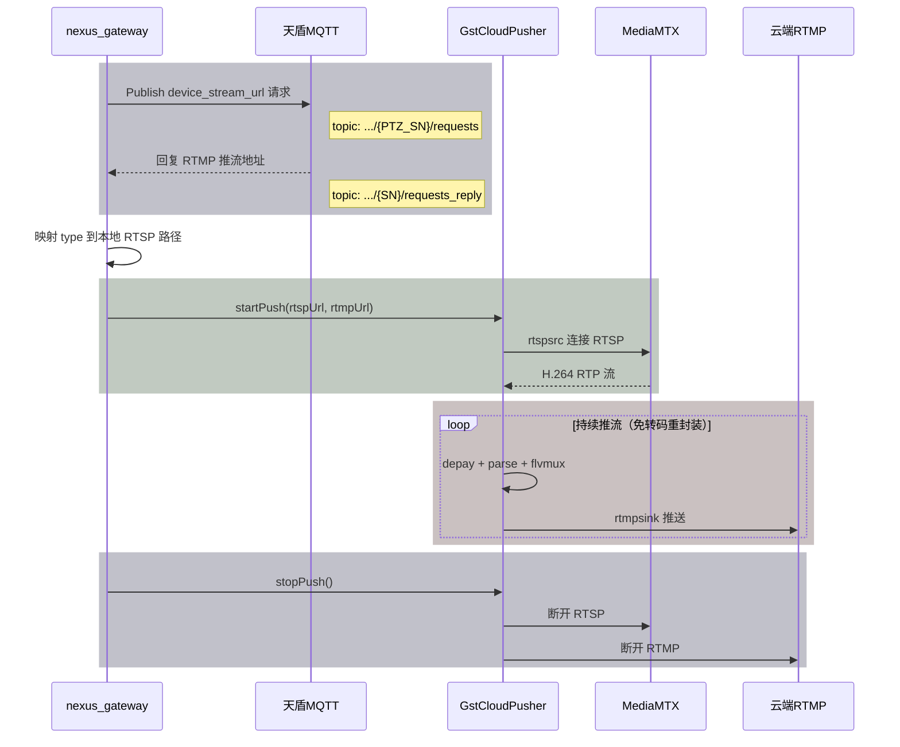
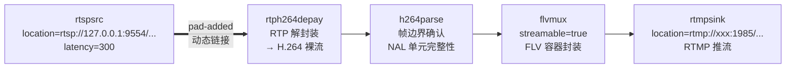
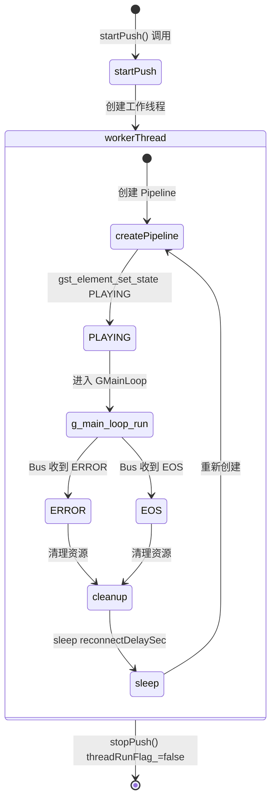
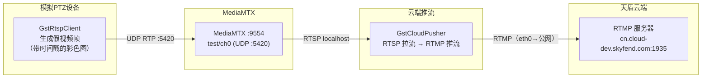

# SSF200 云端推流方案设计（v3）

> **变更说明**：`electronic_fence` 后续将弃用，上云功能将迁移到新建的 `nexus_gateway` 节点。因此 GstCloudPusher 设计为**独立模块**，不绑定任何特定节点，MQTT 交互由上层节点负责。

## 一、现有架构 + 云端推流扩展

下图在设计文档第二章「整体数据流」基础上，新增**云端分发层**（虚线框部分为新增）。现有管道完全不修改，GstCloudPusher 作为 MediaMTX 的下游消费者接入：




**现有链路**（设备层 → 解码层 → SHM → AI → 编码推流 → MediaMTX → C2）完全不变。

**新增链路**：MediaMTX → GstCloudPusher → 云端 RTMP。GstCloudPusher 从 MediaMTX 本地 RTSP 接口拉取已编码的 H.264 流，免转码重封装为 FLV，通过 RTMP 推送到天盾云端。

## 二、关键问题分析

### 1. 方案是否可行？

**可行。** MQTT 请求/回复获取 RTMP 推流地址，再用 GStreamer 推流到云端，是成熟的技术方案。

### 2. 网络隔离问题

**SSF200 上云部署要求 eth0 具备公网访问能力**（通过路由器/4G/VPN）。现有 `electronic_fence` 的 MQTTAgent 已连接 `cn.cloud-dev.skyfend.com:30010`，说明上云场景下公网出口是前置条件。eth0 能走 MQTT，同样能走 RTMP，二者使用同一网络接口。

### 3. 直接推流 还是 从 MediaMTX 中转？

**推荐方案：从本地 MediaMTX 拉 RTSP 流，免转码重封装（remux），推 RTMP 到云端。**

理由：

- **零重编码**：MediaMTX 中已有 H.264 流，只需换封装（RTP -> FLV）和协议（RTSP -> RTMP），CPU/GPU 开销极低
- **完全解耦**：不动现有视频管道（GstRtspClient/ptzDeviceHepu/alg_app），零风险
- **设备无关**：无论耐杰、和普还是激光 PTZ，流最终都汇入 MediaMTX 统一路径
- **可并行**：C2 本地拉流和云端推流可从同一个 MediaMTX 源同时工作

## 三、方案架构

### 3.1 GstCloudPusher 在 GStreamer 组件体系中的位置

GstCloudPusher 与现有 GstSourceDecode、GstRtspClient 并列，属于 `public/gstNvDeeps/` 下的 GStreamer 基础能力层：




### 3.2 云端推流数据流

聚焦云端推流链路，展示从 MQTT 获取地址到推流的完整流程：




### 3.3 时序图




> 推流期间，C2 仍可从 MediaMTX 拉 RTSP，互不影响。多路推流时上层创建多个 GstCloudPusher 实例，各实例独立工作线程和管道。

### 3.4 模块职责分离


| 模块                    | 职责                                     | 位置                                  |
| --------------------- | -------------------------------------- | ----------------------------------- |
| **GstCloudPusher**    | 纯粹的推流执行器：接收 RTSP 源 + RTMP 目标，构建管道并推流   | `public/gstNvDeeps/gstCloudPusher/` |
| **nexus_gateway**（待建） | MQTT 通信、上云协议解析、推流调度、多路管理               | `ros_ws/src/nexus_gateway/`（未来）     |
| **MediaMTX**          | 流媒体中转：同时服务 C2 本地拉流 + GstCloudPusher 拉流 | `thirdpart/mediamtx/`               |


**关键设计思想**：

- **GstCloudPusher** 只负责「给我一个 RTSP 源地址和一个 RTMP 目标地址，我来推流」，不关心 MQTT、协议、业务逻辑
- **MQTT 通信和上云协议** 由上层节点（当前 `electronic_fence`，未来 `nexus_gateway`）负责
- 这样 GstCloudPusher 可以被任意节点复用，`nexus_gateway` 定型后直接调用即可

## 四、GstCloudPusher 模块设计

### 4.1 位置与定位

**位置**：`public/gstNvDeeps/gstCloudPusher/`

与现有的 `gstSourceDecode`（拉流解码）和 `gstRtspClient`（编码推流）并列，属于 GStreamer 基础能力层。这样做的好处：

- 和其他 GStreamer 模块共享编译配置和依赖
- 任何 ROS2 节点（ptz_service、laser_service、nexus_gateway）都可以链接使用
- 与业务逻辑完全解耦

### 4.2 GStreamer 管道（重封装，免转码）




各环节作用：


| Element        | 作用                    | 关键参数                      |
| -------------- | --------------------- | ------------------------- |
| `rtspsrc`      | 从本地 MediaMTX 拉 RTSP 流 | `location`, `latency=300` |
| `rtph264depay` | RTP 解封装，提取 H.264 NALU | --                        |
| `h264parse`    | 确保 H.264 帧边界正确        | --                        |
| `flvmux`       | 封装为 FLV（RTMP 要求的容器格式） | `streamable=true`         |
| `rtmpsink`     | 推送到天盾返回的 RTMP 地址      | `location=<rtmpUrl>`      |


> **注意**：`rtspsrc` 的 pad 是动态创建的（RTSP 协商完成后才出现），需要通过 `pad-added` 信号回调连接到 `rtph264depay`。这与 `GstSourceDecode` 中 `uridecodebin` 的动态 pad 处理方式一致。

命令行等价（可用于单独测试）：

```bash
gst-launch-1.0 \
  rtspsrc location=rtsp://127.0.0.1:9554/ptz/zoom/ch0 latency=300 \
  ! rtph264depay \
  ! h264parse \
  ! flvmux streamable=true \
  ! rtmpsink location="rtmp://xxx.xxx.xxx:1985/app/stream_key"
```

### 4.3 类设计

```cpp
// public/gstNvDeeps/gstCloudPusher/gstCloudPusher.h

class GstCloudPusher {
public:
    struct Param {
        uint32_t latencyMs{300};        // rtspsrc 缓冲延迟
        uint32_t reconnectDelaySec{5};  // 断线重连等待时间
    };

    GstCloudPusher(const Param& param = {});
    ~GstCloudPusher();

    int32_t startPush(const std::string& rtspUrl, const std::string& rtmpUrl);
    void    stopPush();

    bool isRunning() const;
    float getFps() const;

private:
    bool threadRunFlag_{};
    std::thread workerThread_{};
    Param param_{};
    bool isOnRunning_{};
    std::string rtspUrl_{};
    std::string rtmpUrl_{};
    GMainLoop* gMainLoopPtr_{};

    volatile float fps_{};
    uint32_t frameCount_{};
    uint64_t lastTimestampMs_{};

    GstElement* createPipeline();
    void workerTaskLoopForever();
    static void onPadAdded(GstElement* src, GstPad* pad, gpointer data);
    static gboolean onBusMessage(GstBus* bus, GstMessage* msg, gpointer data);
};
```

**设计风格**与现有 `GstRtspClient` 保持一致：

- `workerTaskLoopForever()` 循环 + 自动重连（与设计文档 5.6 管道生命周期一致）
- GstBus 监听 ERROR/EOS
- FPS 统计

### 4.4 管道生命周期与自动重连

与 GstRtspClient 一致的重连机制（设计文档 5.6 章节）：




### 4.5 多路推流管理

一个 AGX 可能同时推送多路（如可见光 + 红外），上层节点负责管理多个 `GstCloudPusher` 实例：

```cpp
// 上层节点（nexus_gateway）中的使用方式
std::map<std::string, std::unique_ptr<GstCloudPusher>> cloudPushers_;

void onStreamUrlReply(const std::string& type, const std::string& rtmpUrl) {
    std::string rtspUrl = mapTypeToRtspUrl(type);
    auto pusher = std::make_unique<GstCloudPusher>();
    pusher->startPush(rtspUrl, rtmpUrl);
    cloudPushers_[type] = std::move(pusher);
}
```

### 4.6 摄像头类型与本地 RTSP 路径映射

基于现有 `mediamtx.yml` 路径配置（设计文档 7.2 路径映射）：


| 天盾 type    | 本地 RTSP 路径                             | MediaMTX UDP 端口 | 说明        |
| ---------- | -------------------------------------- | --------------- | --------- |
| `zoom`     | `rtsp://127.0.0.1:9554/ptz/zoom/ch0`   | 5410            | 和普/耐杰 可见光 |
| `ir`       | `rtsp://127.0.0.1:9554/ptz/ir/ch0`     | 5411            | 和普/耐杰 红外  |
| `zoom`（激光） | `rtsp://127.0.0.1:9554/laser/zoom/ch0` | 5400            | 激光粗跟踪     |
| `ir`（激光）   | `rtsp://127.0.0.1:9554/laser/ir/ch0`   | 5402            | 激光红外      |


### 4.7 与现有推流的对比


| 对比维度       | GstRtspClient（现有本地推流）              | GstCloudPusher（新增云端推流）              |
| ---------- | ---------------------------------- | ----------------------------------- |
| 数据源        | appsrc（RGB/JPEG 帧）                 | rtspsrc（RTSP 已编码流）                  |
| 是否编码       | 是（nvv4l2h264enc 硬编码）               | 否（免转码重封装）                           |
| 输出格式       | RTP over UDP                       | FLV over RTMP                       |
| 目标         | 本地 MediaMTX（127.0.0.1）             | 天盾云端 RTMP 服务器（公网）                   |
| CPU/GPU 开销 | 较高（硬件编码）                           | 极低（仅容器转换）                           |
| 代码位置       | `public/gstNvDeeps/gstRtspClient/` | `public/gstNvDeeps/gstCloudPusher/` |
| 调用者        | ptz_service / alg_app              | nexus_gateway（未来）                   |


## 五、MQTT 协议交互（上层节点负责）

> 以下部分由 `nexus_gateway`（或临时由 `electronic_fence`）实现，GstCloudPusher 不涉及。

### 5.1 请求推流地址

```
Topic: thing/product/{PTZ_设备 SN}/requests
{
    "tid": "<uuid>",
    "bid": "<uuid>",
    "timestamp": <utc毫秒>,
    "method": "device_stream_url",
    "gateway": "<Spotter Pro 设备 SN>",
    "data": {
        "Camera": [{
            "type": "zoom",       // zoom-变焦 wide-广角 normal-普通 ir-红外 night-夜视
            "camera_id": "<摄像头ID>"
        }]
    }
}
```

### 5.2 接收推流地址

```
Topic: thing/product/{设备SN}/requests_reply
{
    "tid": "<uuid>",
    "bid": "<uuid>",
    "timestamp": <utc毫秒>,
    "method": "device_stream_url",
    "data": {
        "result": 0,             // 0-成功，非0-失败
        "output": {
            "streams": [{
                "type": "zoom",
                "streamUrl": "rtmp://xxx.xxx.xxx:1985/app/stream_key"
            }]
        }
    }
}
```

### 5.3 上层节点处理流程

```
收到 requests_reply
  -> 解析 data.result（0=成功）
  -> 遍历 data.output.streams[]
  -> 根据 type 查询本地 RTSP 路径（见 4.6 映射表）
  -> 调用 GstCloudPusher::startPush(rtspUrl, rtmpUrl)
```

## 六、文件变更清单

### 6.1 新建文件

- `public/gstNvDeeps/gstCloudPusher/gstCloudPusher.h` -- GStreamer 云端推流类声明
- `public/gstNvDeeps/gstCloudPusher/gstCloudPusher.cpp` -- 管道构建、生命周期、断线重连

### 6.2 修改文件

- `doc/PTZ设备处理模块设计文档.md` -- 新增「第十四章：云端推流」+ 更新附录

### 6.3 修改文件（nexus_gateway 集成）

- `ros_ws/src/nexus_gateway/CMakeLists.txt` -- 链接 GStreamer 库和 GstCloudPusher
- `ros_ws/src/nexus_gateway/src/service/` -- 在 StreamPushHandler（同事新建）中调用 GstCloudPusher

### 6.4 不修改的文件

- `public/gstNvDeeps/gstRtspClient/` -- 现有编码推流模块
- `public/gstNvDeeps/gstSourceDecode/` -- 现有解码模块
- `thirdpart/mediamtx/mediamtx.yml` -- 现有路径配置已满足需求

### 6.5 同事负责的部分（nexus_gateway 协议对接）

- `TopicManager.h` -- 新增 requests/requests_reply topic
- `NexusGateway.cpp` -- 订阅 requests_reply
- `MessageDispatcher` -- 路由 device_stream_url 回复
- `service/StreamPushHandler` -- 收到 RTMP 地址后调用 GstCloudPusher

## 七、设计文档更新计划

现有 `doc/PTZ设备处理模块设计文档.md` 需要在以下位置新增内容：

### 7.1 新增「第十四章：云端推流（SSF200 上云）」

内容包括：

- 背景：SSF200 上云场景，从本地 MediaMTX 分发转为推送至天盾云端
- 架构图：在设计文档 2.1 整体数据流中增加「分发层-云端」
- GstCloudPusher 管道详解：remux 免转码流程、Element 说明
- 与现有推流的对比表（GstRtspClient vs GstCloudPusher）
- 网络要求：eth0 公网出口
- 摄像头类型映射表
- MQTT 协议交互说明（4.8.5 设备获取推流地址）

### 7.2 更新附录

- 附录 A 端口分配表：增加 RTMP 推流（出站至云端，目标端口 1935/1985）
- 附录 B 关键源文件索引：增加 `public/gstNvDeeps/gstCloudPusher/`
- 附录 E 缩略语：增加 RTMP、FLV、天盾、remux 等术语

### 7.3 更新第七章 MediaMTX

- 7.1 服务配置表：说明本地 RTMP 1935 端口（MediaMTX 入站）与云端 RTMP 目标（GstCloudPusher 出站）是不同概念
- 增加说明：MediaMTX 同时支持多客户端拉流（C2 + GstCloudPusher 并行），不会冲突

## 八、开发分工

### 8.1 你的工作

| 序号 | 内容 | 说明 |
|------|------|------|
| 1 | 开发 GstCloudPusher 模块 | `public/gstNvDeeps/gstCloudPusher/`，纯推流能力，入参 rtspUrl + rtmpUrl |
| 2 | nexus_gateway 集成 | CMakeLists 链接 GStreamer/GstCloudPusher，在同事的 StreamPushHandler 中调用 |
| 3 | 手动测试管道 | 用 `gst-launch-1.0` 验证推流到天盾云端 |
| 4 | 更新设计文档 | `doc/PTZ设备处理模块设计文档.md` 新增第十四章 + 更新附录 |

测试命令（用天盾实际返回的完整地址）：

```bash
gst-launch-1.0 \
  rtspsrc location=rtsp://127.0.0.1:9554/ptz/zoom/ch0 latency=300 \
  ! rtph264depay ! h264parse \
  ! flvmux streamable=true \
  ! rtmpsink location="rtmp://cn.cloud-dev.skyfend.com:1935/live/dev/spotter-pro-test-001/spotter-pro-ptz-001/1"
```

> 天盾已确认：`streamUrl` 返回的是拼接好的完整 RTMP 地址，GstCloudPusher 直接用作 `rtmpsink location` 参数即可。

### 8.2 同事的工作（nexus_gateway 协议对接）


| 序号  | 内容                | 说明                                       |
| --- | ----------------- | ---------------------------------------- |
| 1 | TopicManager 新增 | `TopicRequests()` / `TopicRequestsReply()` |
| 2 | NexusGateway 订阅 | 订阅 `requests_reply`，注册到 MessageDispatcher |
| 3 | MessageDispatcher 路由 | `device_stream_url` 回复分发到 StreamPushHandler |
| 4 | StreamPushHandler 新建 | 收到回复后调用 GstCloudPusher，管理多路实例生命周期 |

> 同事已在开发中（协议对接 + StreamPushHandler）。

### 8.3 对接方式

同事在 StreamPushHandler 中调用你提供的 GstCloudPusher：

```cpp
#include "gstCloudPusher.h"

// 天盾返回完整 RTMP 地址，直接使用
auto pusher = std::make_unique<GstCloudPusher>();
pusher->startPush("rtsp://127.0.0.1:9554/ptz/zoom/ch0",
                   "rtmp://cn.cloud-dev.skyfend.com:1935/live/dev/spotter-pro-test-001/spotter-pro-ptz-001/1");
```

## 九、测试用例设计

### 9.1 测试场景：无 PTZ 设备，模拟假视频流与天盾联调

参照现有 `videoRtspClientTest.cpp` 的模式，设计 `cloudPusherTest.cpp`，完整模拟「设备推流 → MediaMTX → 云端推流」链路：



### 9.2 测试程序设计（`cloudPusherTest.cpp`）

**文件位置**：`public/gstNvDeeps/examples/cloudPusherTest.cpp`

**运行方式**：

```bash
# 确保 MediaMTX 已启动（test/ch0 路径监听 UDP 5420）
# 参数1：天盾返回的 RTMP 完整地址
./cloudPusherTest "rtmp://cn.cloud-dev.skyfend.com:1935/live/dev/spotter-pro-test-001/spotter-pro-ptz-001/1"
```

**程序逻辑**：

```cpp
// cloudPusherTest.cpp 设计（伪代码）

#include "gstRtspClient.h"
#include "gstCloudPusher.h"

int main(int argc, char* argv[]) {
    // 1. 解析参数：RTMP 目标地址
    std::string rtmpUrl = argv[1];  // 天盾返回的完整地址

    // 2. 启动假视频源：生成带时间戳的 1080P 彩色帧 → MediaMTX test/ch0
    //    复用 videoRtspClientTest 的模式，推到 UDP 5420（MediaMTX test/ch0）
    GstRtspClient fakeSource("127.0.0.1", 5420, rtspClientParam);
    fakeSource.start();

    // 3. 等待 MediaMTX 建立流（给 2 秒缓冲）
    sleep(2);

    // 4. 启动云端推流：从 MediaMTX test/ch0 拉流 → 推到天盾 RTMP
    GstCloudPusher cloudPusher;
    cloudPusher.startPush("rtsp://127.0.0.1:9554/test/ch0", rtmpUrl);

    // 5. 持续推送假视频帧（带时间戳 OSD，方便在天盾端看到画面变化）
    cv::Mat frame(1080, 1920, CV_8UC3, cv::Scalar(0, 128, 255));
    while (true) {
        GstRtspClient::osdFrameTimestampText(frame);  // 叠加当前时间
        fakeSource.pushFrame(frame);
        std::this_thread::sleep_for(std::chrono::milliseconds(40)); // 25fps
    }
}
```

### 9.3 验证方式

| 步骤 | 操作 | 预期结果 |
|------|------|---------|
| 1 | 启动 MediaMTX | `test/ch0` 路径就绪 |
| 2 | 运行 `cloudPusherTest` + 天盾 RTMP 地址 | 终端显示推流 FPS |
| 3 | 在天盾云平台查看直播画面 | 看到带时间戳的橙色测试画面 |
| 4 | 检查延迟 | 对比画面时间戳与当前时间，评估端到端延迟 |
| 5 | 断网测试 | 断开 eth0 后，GstCloudPusher 应报错并自动重连 |
| 6 | 恢复网络 | 重连后继续推流 |

### 9.4 CMakeLists 新增

在 `public/gstNvDeeps/examples/CMakeLists.txt` 中新增：

```cmake
set(EXEC_TEST5 cloudPusherTest)
add_executable(${EXEC_TEST5} cloudPusherTest.cpp)
target_link_libraries(${EXEC_TEST5}
    gstNvDeeps
)
```

### 9.5 文件清单

| 文件 | 说明 |
|------|------|
| `public/gstNvDeeps/examples/cloudPusherTest.cpp` | **新建** -- 云端推流测试用例 |
| `public/gstNvDeeps/examples/CMakeLists.txt` | **修改** -- 新增 cloudPusherTest 编译目标 |

## 十、健壮性设计

- **管道看门狗**：GstBus 监听 ERROR/EOS，自动重启（与 GstRtspClient 一致的 workerTaskLoopForever 模式）
- **重连策略**：管道异常后等待 N 秒重建，可配置
- **带宽感知**：H.264 码率约 4Mbps/路，需确保 eth0 上行带宽充足
- **优雅关闭**：析构时停止管道，释放 GStreamer 资源
- **日志**：推流状态、FPS、错误信息通过 `skyfend_log` 输出

