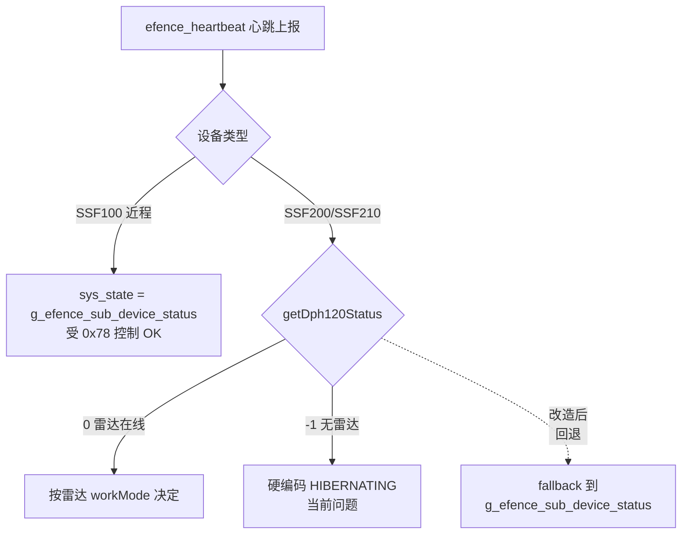

## 一、根因

`efence_heartbeat()` 中 SSF200/SSF210 分支强行用 DPH120 雷达状态决定 `sys_state`，无雷达时 `getDph120Status()` 因 3 秒内无 `DhpStatusUpload` 返回 -1，导致 `sys_state` 恒为 `HIBERNATING (0x02)`，C2 看到永远是休眠。

## 二、关键发现

- `handle_one_click_start()` 已经维护了用户意图标志 `g_efence_sub_device_status`，0x78 唤醒会置 RUNNING、休眠置 HIBERNATING
- 近程 SSF100（`[alink_efence.cpp](src/srv/alink/command/efence/alink_efence.cpp)` 第 1242-1244 行 else 分支）**正是用这个标志作为 sys_state 的权威源**，运行良好
- SSF200/SSF210 分支没有任何 `g_efence_sub_device_status` 兜底，只看 DPH120




## 三、改动方案（仅 1 处）

**文件**：`[src/srv/alink/command/efence/alink_efence.cpp](src/srv/alink/command/efence/alink_efence.cpp)` 第 1235-1241 行

**当前代码**：

```cpp
if (ALINK_DEV_ID_SSF200 == agx_device_type || ALINK_DEV_ID_SSF210 == agx_device_type) {
    uint8_t workMode = 0;
    if ((0 == ros_app::getDph120Status(workMode)) && (1 == workMode)) {
        efence_msg.sys_state = ALINK_EFENCE_STATE_RUNNING;
    } else {
        efence_msg.sys_state = ALINK_EFENCE_STATE_HIBERNATING;
    }
}
```

**目标代码**：

```cpp
if (ALINK_DEV_ID_SSF200 == agx_device_type || ALINK_DEV_ID_SSF210 == agx_device_type) {
    uint8_t workMode = 0;
    int dph_ret = ros_app::getDph120Status(workMode);
    if (0 == dph_ret) {
        // 雷达在线：以雷达实时 workMode 为准（保留原有行为）
        efence_msg.sys_state = (1 == workMode) ? ALINK_EFENCE_STATE_RUNNING
                                                : ALINK_EFENCE_STATE_HIBERNATING;
    } else {
        // 雷达不在线（仅 PTZ 等子设备）：回退到 0x78 用户意图标志
        // 与近程 SSF100 分支同语义，handle_one_click_start/hibernation 已维护此变量
        efence_msg.sys_state = g_efence_sub_device_status;
    }
}
```

## 四、为什么这样改最稳

- **复用已验证逻辑**：与近程 SSF100 的 else 分支语义完全一致
- **零新增状态**：`g_efence_sub_device_status` 已存在，且由 0x78 完整维护（启动赋值 RUNNING / 休眠赋值 HIBERNATING / 上电默认 HIBERNATING）
- **不破坏有雷达场景**：`dph_ret == 0` 时行为完全不变
- **handle_one_click_start 不动**：原本就在设 `g_efence_sub_device_status = RUNNING`，原本就发了雷达搜索命令（无消费者会自然丢弃，对 PTZ 无副作用）
- **子设备 sys_state 自动联动**：第 1279 行 `efence_msg.sub_dev[i].sys_state = efence_msg.sys_state` 会跟随主 sys_state，PTZ 在线时也会显示 RUNNING

## 五、验证步骤

1. 在 SSF200 上拔掉雷达只接 PTZ，启动后 0x77 心跳应为 `sys_state=HIBERNATING (0x02)`、子设备列表含 PTZ
2. C2 点唤醒按钮 → AGX 收到 0x78 cmd_state=1 → `g_efence_sub_device_status = RUNNING`
3. 下一周期 0x77 心跳应变为 `sys_state=RUNNING (0x01)`，C2 显示已唤醒
4. 点休眠按钮 → 心跳回到 `HIBERNATING (0x02)`
5. 回归测试：插上雷达，确认有雷达场景行为不变（雷达 workMode 决定状态）

