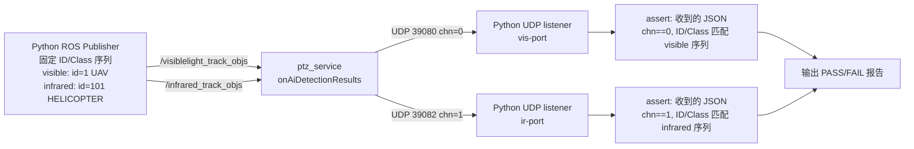

## 1. sysmonit 后端：订阅 AI 摘要 + 聚合 JSON

### 1.1 数据缓存

在 [ros_ws/src/sysmonit/src/main.cpp](ros_ws/src/sysmonit/src/main.cpp) 顶层加缓存（参考既有 `g_ptz_smart_cache`/`g_ptz_smart_mtx`）：

```cpp
struct AiTargetSummary {
    bool     valid{false};
    uint64_t timestamp_ms{0};         // 顶层 timestamp
    uint16_t obj_num{0};
    uint8_t  ptz_source{0};           // 顶层 ptz_source
    std::map<uint8_t, uint16_t> class_count;  // classification -> 计数 (只统计 valid==1 目标)
    uint64_t recv_wall_ms{0};         // 后端收到的墙钟时间, 用于前端判活
};

static std::mutex g_ai_target_mtx;
static AiTargetSummary g_ai_target_visible;
static AiTargetSummary g_ai_target_infrared;
```

### 1.2 订阅

在 `main()` 现有 `sub_ptz_dev_info` 紧邻位置追加两条订阅，BEST_EFFORT QoS（与 ptz_service 一致）：

```cpp
auto make_ai_cb = [&](AiTargetSummary& slot) {
    return [&slot](skyfend_interfaces::msg::AiTargetInfo::ConstSharedPtr m){
        AiTargetSummary s;
        s.valid = true;
        s.timestamp_ms = m->timestamp;
        s.obj_num      = m->obj_num;
        s.ptz_source   = m->ptz_source;
        for (const auto& it : m->target_points) {
            if (it.valid == 0) continue;
            s.class_count[it.classification]++;
        }
        s.recv_wall_ms = wall_now_ms();
        std::lock_guard<std::mutex> lk(g_ai_target_mtx);
        slot = std::move(s);   // 25Hz -> 覆盖式
    };
};
auto sub_ai_vis = node->create_subscription<skyfend_interfaces::msg::AiTargetInfo>(
    "/visiblelight_track_objs", rclcpp::QoS(10).best_effort(),
    make_ai_cb(g_ai_target_visible));
auto sub_ai_ir  = node->create_subscription<skyfend_interfaces::msg::AiTargetInfo>(
    "/infrared_track_objs",      rclcpp::QoS(10).best_effort(),
    make_ai_cb(g_ai_target_infrared));
```

### 1.3 把摘要并进 `/api/video`

在 `build_video_perf_json` 末尾、`}` 之前加两个新字段：

```cpp
auto dump_ai = [](std::ostringstream& o, const char* key, const AiTargetSummary& s){
    o << ",\"" << key << "\":{"
      << "\"valid\":" << (s.valid?"true":"false")
      << ",\"timestamp_ms\":" << s.timestamp_ms
      << ",\"obj_num\":" << s.obj_num
      << ",\"ptz_source\":" << (int)s.ptz_source
      << ",\"recv_wall_ms\":" << s.recv_wall_ms
      << ",\"class_count\":[";
    bool first = true;
    for (auto& kv : s.class_count) {
        if (!first) o << ",";
        first = false;
        o << "{\"cls\":" << (int)kv.first << ",\"n\":" << kv.second << "}";
    }
    o << "]}";
};
{ std::lock_guard<std::mutex> lk(g_ai_target_mtx);
  dump_ai(out, "ai_target_visible",  g_ai_target_visible);
  dump_ai(out, "ai_target_infrared", g_ai_target_infrared);
}
```

同时在每个 `ptz_smart_servers` 元素里增补 `"is_hepu_type": <bool>`（按 `PtzDeviceParam::PtzType::PTZ_HEPU/HEPU_COOLED/HEPU_DMA35` 判断），前端用它来判断显示条件。

## 2. sysmonit 前端：AI Target Info 卡片

### 2.1 DOM

在 [ros_ws/src/sysmonit/web/index.html](ros_ws/src/sysmonit/web/index.html) PTZ Control 卡片下方新增（默认隐藏）：

```html
<div class="card accent-blue" id="ai-target-card" style="display:none;margin-top:10px">
  <h2 data-i18n="h_ai_target">AI Target Info</h2>
  <div style="display:grid;grid-template-columns:1fr 1fr;gap:10px">
    <div id="ai-target-vis"></div>
    <div id="ai-target-ir"></div>
  </div>
</div>
```

### 2.2 渲染 + 显示条件

在 `loadVideoPerf()` 现有 `renderPtzSmartServerList(...)` 后追加 `renderAiTargetCard(data.ai_target_visible, data.ai_target_infrared, data.ptz_smart_servers || [])`。

`renderAiTargetCard` 逻辑：

- 显示条件：`ptz_smart_servers` 中存在 `e.is_hepu_type && e.online && e.with_hepu_ai_box === 0` 才显示卡片，否则 `display:none` 隐藏
- 每栏内容：`obj_num | ptz_source | timestamp(转 HH:MM:SS.mmm) | 各 classification 数量统计`
- classification 数字 -> 名字映射表内置在前端（与 [AiTargetItem.msg](ros_ws/src/srp100_message/skyfend_interfaces/msg/ai_msg/AiTargetItem.msg) 19-31 行枚举对齐：UAV / HELICOPTER / BIRD / DRAGONFLY / AIRLINER / FIXWING / DELTAWING / ROCKET / BIRDFLOCK / PERSON / CAR / UNKNOWN）
- 用 `recv_wall_ms` 与当前 wall 比较，超过 2 秒未刷新显示「stale」灰底提示

### 2.3 频率

无需新增轮询定时器，复用现有 `loadVideoPerf` 的 1Hz 节奏（`/api/video` 已经 1Hz 拉一次）。

## 3. 升级 Python 测试脚本

### 3.1 升级 [test_udp_smart_listen.py](ros_ws/src/ptz_service/scripts/ai_link_test/test_udp_smart_listen.py)

- 默认端口 `30980` → `39080`
- 新增 `--port-thermal 39082`，同时绑 vis+ir 两个 socket，用 `select.select` 多路读取，打印行带 `[VIS]`/`[IR]` 前缀

### 3.2 新增 [test_e2e_link.py](ros_ws/src/ptz_service/scripts/ai_link_test/test_e2e_link.py)

参数：`--mode {loopback,real}`，`--ptz-ip 127.0.0.1`，`--vis-port 39080`，`--ir-port 39082`，`--duration 5`，`--rate 25`。

逻辑：




每条断言：

- vis 端口收到的所有报文 `Info.chn == 0` 且 `Result[*].ID == 1` 且 `Class == "uav"`
- ir 端口收到的所有报文 `Info.chn == 1` 且 `Result[*].ID == 101` 且 `Class == "airplane-helicopter"`
- 关键交叉断言：vis 端口绝不应收到 ID=101，ir 端口绝不应收到 ID=1（验证端口分流正确，是这次方案 A 改造的核心点）
- `width/height` 与发布的 `image_width/image_height` 一致
- `Info.timestamp` 与发布的 ROS msg `timestamp` 偏差 < N ms

模式区分：

- `loopback`：脚本启动前提示用户「请确认 ptzDevicesCfg.yaml PTZ IP=127.0.0.1 且 with_hepu_ai_box=0」，不自动改 yaml
- `real`：不起 listener，只起 publisher + 自动调用 `tcpdump -i eth1 -n udp port 39080 or udp port 39082` 抓包 N 秒，把抓到的包数和"发出包数应≈ duration*rate*2"做粗校验，PTZ 端实际是否收到由人工确认 PTZ Web

### 3.3 更新 [AI_LINK_TEST.md](ros_ws/src/ptz_service/scripts/ai_link_test/AI_LINK_TEST.md)

- 全量把 `30930` / `30980` 替换成 `39080`(visible) + `39082`(thermal)
- 在「脚本说明」表里新增 `test_e2e_link.py` 一行
- 增加「方案 A 双端口分流验证」专节，描述交叉断言的预期

## 4. 编译/部署

- sysmonit：`colcon build --packages-select sysmonit`
- ptz_service / skyfend_interfaces 已编过，本次不动
- Web：sysmonit 二进制把 `index.html` 内嵌进可执行（看 [ros_ws/src/sysmonit/CMakeLists.txt](ros_ws/src/sysmonit/CMakeLists.txt)），需重启 sysmonit
- Python 脚本：`source ros_ws/install/setup.bash` 后直接 `python3 test_e2e_link.py --mode loopback`

## 需要注意

- AiTargetInfo 25Hz，sysmonit 订阅做的是「覆盖式快照」，前端 1Hz 拉取看不到逐帧但能稳定看到 obj_num 波动与 classification 占比，符合"摘要"诉求。
- `is_hepu_type` 字段加在后端 `ptz_smart_servers` 里前端单点判断，避免再写一份 PTZ 类型常量到 JS。
- e2e 测试 loopback 模式的成功判定基于「vis 端口只收到 visible ID + ir 端口只收到 infrared ID」，正是验证方案 A 改造（双 sender 拆分）正确性的最直接证据，可直接作为回归测试。

