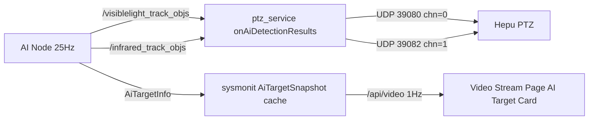

## 目标

1. **sysmonit Video Stream 页面**：在和普 PTZ 在线 + `with_hepu_ai_box==0` 时，展示 AI 目标信息（可见光/红外两栏：obj_num + ptz_source + 帧时间 + 各 classification 计数）。AI 节点 25Hz 发布，前端 1Hz 拉取。
2. **`ros_ws/src/ptz_service/scripts/ai_link_test/`**：删除现有 3 个 .py，合并为单文件 `test_e2e_link.py`（子命令模式），并重写 `AI_LINK_TEST.md`。

---

## 一. sysmonit AI 目标信息卡片

### 1.1 后端 ([ros_ws/src/sysmonit/src/main.cpp](ros_ws/src/sysmonit/src/main.cpp))

- 在节点构造里新增 `AiTargetSnapshot` 结构（obj_num, ptz_source, header.stamp, classification 计数 map），visible/infrared 各一个，配 `std::mutex`。
- 订阅 `/visiblelight_track_objs` 和 `/infrared_track_objs`（QoS Best Effort，类型 `skyfend_interfaces::msg::AiTargetInfo`）。回调里只更新「最新一帧」缓存（25Hz 进，缓存覆盖即可）。
- 在 `build_video_perf_json` 末尾追加：
  - `ai_target_visible`: { `present`: bool（最近 1s 内有帧）, `obj_num`, `ptz_source`, `timestamp`, `classifications`: { "person": N, ... } }
  - `ai_target_infrared`: 同上结构
- 在 `ptz_smart_servers` 数组的每个元素里加 `is_hepu_type`（解析 yaml 时顺手判断 `isHepuPtzType(type)`）。
- `with_hepu_ai_box` 字段已经在 ptz_smart_servers 里有，复用即可。

### 1.2 前端 ([ros_ws/src/sysmonit/web/index.html](ros_ws/src/sysmonit/web/index.html))

- 在 Video Stream 页面 PTZ Control 卡片下方加 `ai-target-card` DOM：标题「AI Target Info」，左右两栏（Visible / Infrared）。
- 新增 `renderAiTargetCard(payload)`：
  - 显示条件：`payload.ptz_smart_servers` 中至少一台 `is_hepu_type === true && online === true && with_hepu_ai_box === 0`，否则整张卡片 `display:none`。
  - 每栏渲染：`obj_num`、`ptz_source`、`timestamp`（人读时间）、classification 计数表（一行一种类型）。
  - 若 `present === false` 或 timestamp 距 `Date.now()` > 2s，显示 stale 灰底提示。
- 在已有 `pollVideoStatus()`（1Hz）回调里调用 `renderAiTargetCard`。无需新增轮询。

---

## 二. ai_link_test 脚本合并

### 2.1 删除文件

- `ros_ws/src/ptz_service/scripts/ai_link_test/test_udp_smart_listen.py`
- `ros_ws/src/ptz_service/scripts/ai_link_test/test_pub_ai_visible.py`
- `ros_ws/src/ptz_service/scripts/ai_link_test/test_pub_ai_infrared.py`

### 2.2 新建 [ros_ws/src/ptz_service/scripts/ai_link_test/test_e2e_link.py](ros_ws/src/ptz_service/scripts/ai_link_test/test_e2e_link.py)

argparse 顶层 5 个子命令：

```text
test_e2e_link.py e2e      [--mode loopback|real] [--ptz-ip IP] [--duration 3] [--rate 25]
test_e2e_link.py listen   [--port-vis 39080] [--port-ir 39082] [--bind 0.0.0.0]
test_e2e_link.py pub-vis  [--rate 25] [--objs 1]
test_e2e_link.py pub-ir   [--rate 25] [--objs 1]
test_e2e_link.py pub-once [--channel vis|ir] [--objs 1]
```

各子命令职责：

- **`e2e`**（核心自动化回归）：
  - `loopback` 模式：本进程同时起 UDP 双绑（39080/39082）+ rclpy `AiTargetInfo` 双 topic 发布；每 topic 发 N 帧（默认 75 帧 = 3s × 25Hz），收完后断言 chn 分流正确（visible 包只到 39080，infrared 只到 39082），且 ID/Class/width/height/timestamp 与发送一致。
  - `real` 模式：仅发布到两个 topic，提示用户在 PTZ 端用 `tcpdump -i ethX -n 'udp port 39080 or udp port 39082'` 看分流。
  - 退出码 0=PASS，1=FAIL，便于 CI。
- **`listen`**：select 多路读 39080/39082，打印 `[VIS] ...` / `[IR] ...` 前缀的 JSON 内容（替代旧 `test_udp_smart_listen.py`）。
- **`pub-vis` / `pub-ir`**：持续以指定速率发布单 topic（替代旧两个持续 publisher）。
- **`pub-once`**：发一条然后退出（用于 sysmonit 卡片刷新等单触发场景）。

实现要点：
- 公共构造 `AiTargetInfo` 的工具函数复用，避免重复。
- rclpy import 延迟到子命令真正需要时（`listen` 子命令不依赖 ROS，可在没装 rclpy 的机器上运行）。
- `e2e` 的断言细节参考 [iotDevices/ptzHepuSDK/include/ptz_hepu_msg.h](iotDevices/ptzHepuSDK/include/ptz_hepu_msg.h) 中 chn=0 可见光 / chn=1 红外 的约定。

### 2.3 重写 [ros_ws/src/ptz_service/scripts/ai_link_test/AI_LINK_TEST.md](ros_ws/src/ptz_service/scripts/ai_link_test/AI_LINK_TEST.md)

- 端口全量更新 30930/30980 → 39080(vis) / 39082(ir)。
- 「场景 A（with_hepu_ai_box=1）」段：链路是 AI 节点 → 和普 AI Box(192.168.2.249) → PTZ；ptz_service 不发 UDP；本目录脚本不适用，跳过。
- 「场景 B（with_hepu_ai_box=0）」段：链路是 AI 节点 → ptz_service `onAiDetectionResults` → PTZ:39080/39082。
- 把表格从「按脚本说明」改为「按子命令说明」，每个子命令一行。
- 「室内自测」三步法用 `e2e --mode loopback` 替代。
- 「外场联调」用 `pub-once` 或 `pub-vis` + `tcpdump` 替代。

---

## 数据流（场景 B）



---

## 验收

- 启动 ptz_service + 接和普 PTZ（with_hepu_ai_box=0）+ AI 节点 → sysmonit Video Stream 页面出现 AI Target Info 卡片，1Hz 刷新；切到耐杰 PTZ / 改 with_hepu_ai_box=1 → 卡片消失。
- 在 ros_ws 下 `python3 src/ptz_service/scripts/ai_link_test/test_e2e_link.py e2e --mode loopback` → 退出码 0、所有断言 PASS。
- 旧三个脚本被删除，目录下仅剩 `test_e2e_link.py` + `AI_LINK_TEST.md`。