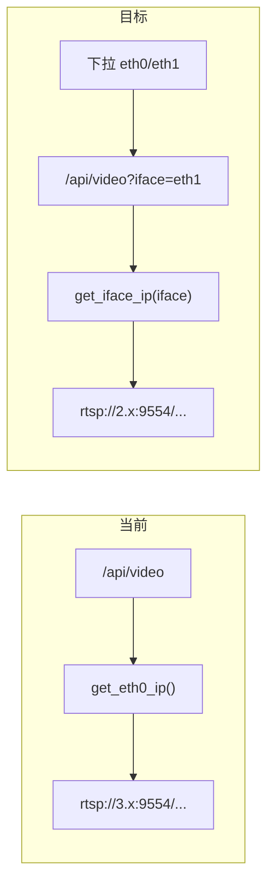

# sysmonit Video Streams 网卡选择（eth0 / eth1）

## 问题

当 PC 只接 **eth1**（如 `192.168.2.132`）访问 `http://192.168.2.132:12345/` 时：

- HTTP 服务监听 `INADDR_ANY`，页面可打开
- [`build_video_perf_json()`](ros_ws/src/sysmonit/src/main.cpp) 固定使用 `get_eth0_ip()` 作为 `agx_ip`，生成 `rtsp://192.168.3.104:9554/...` 等 Proxy URL
- eth0 未接线时 `get_iface_ip("eth0")` 为空，会回退到 `127.0.0.1`，导致 Proxy 显示/检测均错误
- WebRTC 播放器已用 `location.hostname`（[`index.html` L1762](ros_ws/src/sysmonit/web/index.html)），从 eth1 访问时通常正常；需修复的是 **Video Streams 列表、Proxy URL 输入框、智能分析服务器卡片中的 AGX IP 对比**



## 实现方案

### 1. 后端：按网卡生成视频 JSON

**文件：** [`ros_ws/src/sysmonit/src/main.cpp`](ros_ws/src/sysmonit/src/main.cpp)

| 改动 | 说明 |
|------|------|
| `normalize_video_iface(s)` | 仅允许 `eth0` / `eth1`，非法或空则 `eth0` |
| `get_agx_ip_for_iface(iface)` | `get_iface_ip(iface)`，空则 `127.0.0.1`（保留现有回退逻辑） |
| `build_video_perf_json(iface)` | 将 `get_eth0_ip()` 替换为 `get_agx_ip_for_iface(iface)`；`check_port(agx_ip, 9554)` 同步使用所选 IP |
| JSON 新增字段 | `"iface"`, `"eth0_ip"`, `"eth1_ip"`（两网卡 IP 一并返回，便于 UI 展示） |
| `get_video_perf_json(iface)` | `iface==eth0` 时继续读后台缓存；`eth1` 时**同步**调用 `build_video_perf_json("eth1")`（构建成本低，避免双缓存线程） |
| `/api/video` handler | 从 `path` 解析 query（如 `/api/video?iface=eth1`），子路径 `/api/video/fps` 等不受影响 |

解析 query 示例（与现有 ROS handler 内 `get_query_param` 思路一致）：

```cpp
static std::string parse_query_param(const std::string& path, const std::string& key) {
    auto q = path.find('?');
    if (q == std::string::npos) return "";
    // 解析 key=value ...
}
```

`video_cache_thread_fn` 仍每 10s 缓存 **eth0** 默认数据，不改变现有轮询负载。

**不涉及：** SHM 探测、`cam_reachable`（仍看 PTZ IP + `/dev/shm`）、`/api/video/fps`、`/api/video/shm`（与 AGX 出口 IP 无关）。

### 2. 前端：网卡选择器 + API 带参

**文件：** [`ros_ws/src/sysmonit/web/index.html`](ros_ws/src/sysmonit/web/index.html)

在 Video Streams 卡片 toolbar（[`#refresh-video-btn`](ros_ws/src/sysmonit/web/index.html) 旁）增加：

```html
<select id="video-agx-iface">
  <option value="eth0">eth0 — AGX ↔ C2 (192.168.3.x)</option>
  <option value="eth1">eth1 — AGX ↔ 子设备 (192.168.2.x)</option>
</select>
```

逻辑（与抓包页 [`#cap-iface`](ros_ws/src/sysmonit/web/index.html) 风格一致，但**默认 eth0**）：

| 函数/行为 | 说明 |
|-----------|------|
| `getVideoAgxIface()` | 读 `localStorage.videoAgxIface`，默认 `eth0` |
| `setVideoAgxIface(v)` | 写入 localStorage |
| `videoApiUrl()` | 返回 `/api/video?iface=` + 当前选择 |
| `loadVideoPerf()` | `req(videoApiUrl())`；表头改为 `AGX IP (eth0)` / `(eth1)` 随 `data.iface` 动态显示；选项文案可用 `data.eth0_ip` / `data.eth1_ip` 更新 |
| `startFpsPolling()` | 每 5 次 tick 的 `/api/video` 改为 `videoApiUrl()` |
| `onchange` | 切换网卡 → 重载 `loadVideoPerf()`；若 WebRTC 正在播放可提示用户 Stop/Play（可选，不强制改播放器） |
| `renderPtzSmartServerList(items, agxIp)` | 继续用 API 返回的 `agx_ip`（已按 iface 计算），`isAgx` 判断保持正确 |

**不改动：** `webrtcBaseUrl = location.protocol + '//' + location.hostname + ':8889'`（从 eth1 打开时已指向正确主机）。

### 3. 文档（可选）

[`ros_ws/src/sysmonit/readme.md`](ros_ws/src/sysmonit/readme.md) 补充 `/api/video?iface=eth0|eth1` 说明一行即可。

## 验证步骤

1. eth0、eth1 均接线：默认 eth0 显示 `192.168.3.x` Proxy；切 eth1 后 Proxy 变为 `192.168.2.x:9554/...`，MediaMTX Status 对该 IP 的 `check_port` 为 online
2. 仅 eth1 接线：从 `http://<eth1_ip>:12345/` 打开，手动选 eth1，Proxy URL 与 VLC 可播地址一致；eth0 选项可显示 `-` 或不可用提示
3. 刷新页面：localStorage 记住上次选择（默认仍为 eth0）
4. 确认 `/api/video/fps`、SHM 面板、AI Target 轮询仍正常

## 改动范围

仅 **2 个文件**（+ 可选 readme）：`main.cpp`、`index.html`。不修改 `ptz_service`、MediaMTX 配置或网络路由。
