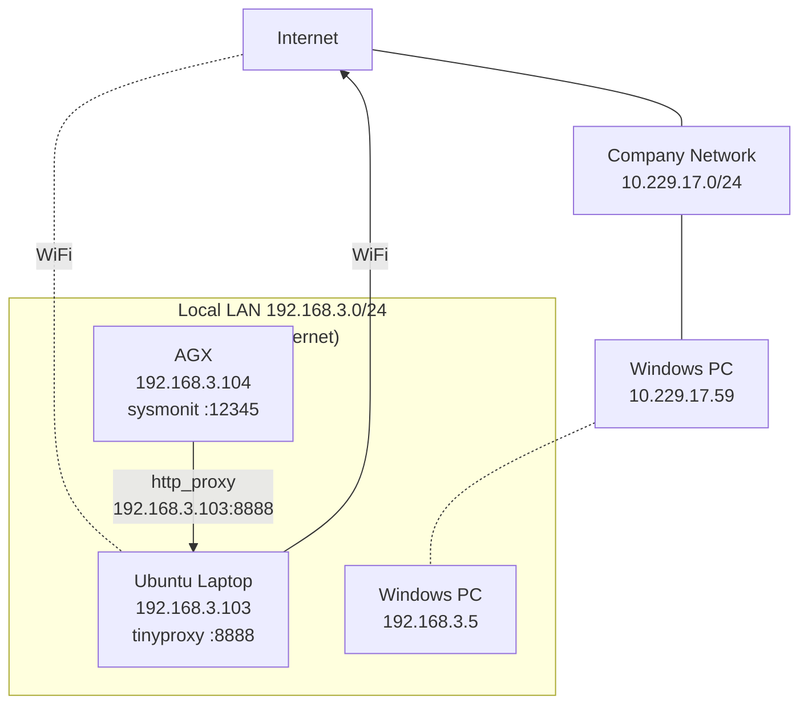
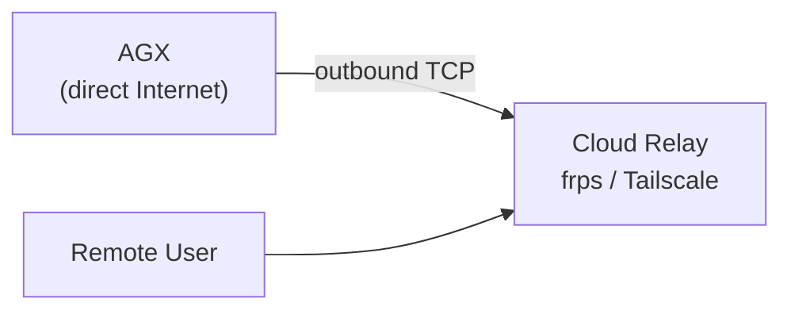
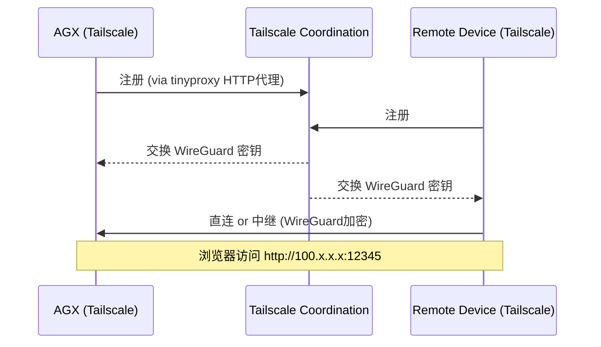
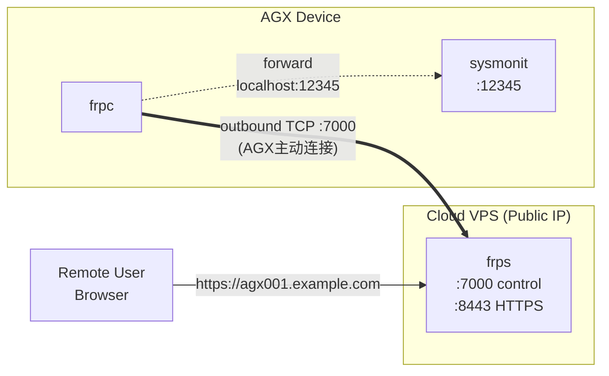
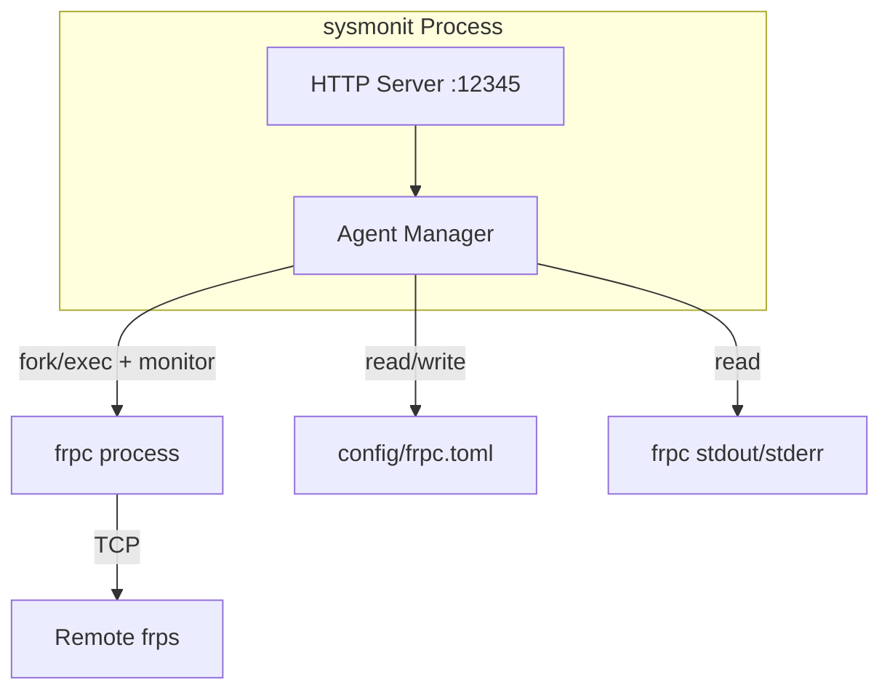
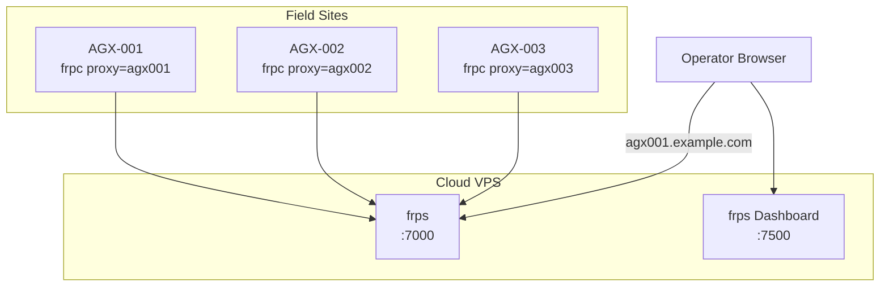

# Sysmonit 远程访问 Agent 设计文档

## 1. 背景与目标

### 1.1 现状

sysmonit 是部署在 AGX（Jetson AGX Orin）上的轻量级 Web 监控系统，HTTP 服务运行在 `0.0.0.0:12345`。当前只能通过同一局域网（192.168.3.x）的设备用浏览器访问。

### 1.2 目标

- 公司内网（10.x 网段）的同事能通过浏览器访问 sysmonit
- 任意地点通过互联网远程访问 sysmonit
- 未来支持多台 AGX 设备统一接入管理

### 1.3 约束

- AGX 是 ARM64（aarch64）平台，运行 Ubuntu 20.04 / JetPack
- AGX 当前无法直接上网，但可通过 Ubuntu 笔记本上的 tinyproxy (HTTP 代理) 间接访问互联网
- 暂无公网服务器（VPS），未来可能采购
- 安全性要求：需要鉴权，不能裸露在公网无认证

---

## 2. 网络拓扑

### 2.1 当前环境




**关键路径**：AGX 已能通过 `http_proxy=http://192.168.3.103:8888` 经 tinyproxy 访问互联网。

### 2.2 未来环境（AGX 直连上网路由器）




---

## 3. 方案设计（三阶段）

### Phase 1：即时方案 — Tailscale 组网（零代码改动，推荐先用）

**原理**：Tailscale 是基于 WireGuard 的 mesh VPN，设备之间自动 NAT 穿透，不需要公网服务器。AGX 通过 tinyproxy 的 HTTP 代理连接 Tailscale 协调服务器，建立虚拟网络。

**数据流**：




**部署步骤**：

1. AGX 上安装 Tailscale（通过 tinyproxy 下载）：

```bash
   export http_proxy=http://192.168.3.103:8888
   export https_proxy=http://192.168.3.103:8888
   curl -fsSL https://tailscale.com/install.sh | sh
   

```

1. AGX 上启动 Tailscale（配置走 HTTP 代理）：

```bash
   sudo systemctl edit tailscaled  # 添加 Environment="HTTPS_PROXY=http://192.168.3.103:8888"
   sudo systemctl restart tailscaled
   sudo tailscale up
   

```

1. 任何需要访问的设备（Windows PC、手机等）安装 Tailscale，登录同一账号
2. 通过 Tailscale 分配的虚拟 IP（100.x.x.x）访问 `http://100.x.x.x:12345`

**优缺点**：

- 优点：5 分钟部署，零代码改动，端到端加密，免费（100 设备），自动 NAT 穿透
- 缺点：每台访问设备都需安装 Tailscale 客户端，不能给未装客户端的人用公网 URL 直接访问
- 适用：团队内部日常开发调试

---

### Phase 2：正式方案 — frp 隧道（需公网服务器）

**前提**：AGX 接入能上网的路由器 + 有一台公网 VPS

**原理**：frpc（客户端）部署在 AGX，主动建立 TCP 长连接到公网的 frps（服务端）。远程用户通过公网域名/IP 访问 frps，frps 将流量转发到 AGX 上的 sysmonit。

**架构**：




**服务端部署（VPS）**：

frps.toml:

```toml
bindPort = 7000
vhostHTTPSPort = 8443
auth.method = "token"
auth.token = "your-secret-token"
webServer.addr = "0.0.0.0"
webServer.port = 7500
webServer.user = "admin"
webServer.password = "admin-password"
```

**客户端部署（AGX）**：

frpc.toml:

```toml
serverAddr = "your-vps-ip.com"
serverPort = 7000
auth.token = "your-secret-token"

[[proxies]]
name = "sysmonit-web"
type = "tcp"
localIP = "127.0.0.1"
localPort = 12345
remotePort = 12345
```

**AGX 开机自启**：

```ini
# /etc/systemd/system/frpc.service
[Unit]
Description=frpc tunnel agent
After=network-online.target
Wants=network-online.target

[Service]
Type=simple
ExecStart=/usr/local/bin/frpc -c /home/skyfend/config/frpc.toml
Restart=always
RestartSec=5

[Install]
WantedBy=multi-user.target
```

**优缺点**：

- 优点：任何人通过浏览器直接访问公网 URL，无需安装客户端；完全自主可控
- 缺点：需要一台公网 VPS（约 50-100 元/月），需要维护 frps 服务
- 适用：正式部署、客户演示、远程运维

---

### Phase 3：sysmonit 集成 Agent 管理（代码开发）

**目标**：将 frpc 隧道的管理集成到 sysmonit 中，通过 Web UI 查看状态、修改配置，无需 SSH 登录 AGX。

#### 3.1 架构




#### 3.2 配置文件

新增 `/home/skyfend/config/tunnel_agent.yaml`：

```yaml
agent:
  enabled: false           # 是否启用隧道 Agent
  type: "frpc"             # 隧道类型：frpc / tailscale
  frpc:
    binary: "/usr/local/bin/frpc"
    config: "/home/skyfend/config/frpc.toml"
    server_addr: ""        # frps 服务器地址
    server_port: 7000
    token: ""              # 鉴权 token
    proxy_name: ""         # 隧道名称（默认用设备 SN）
    remote_port: 0         # 远程端口（0=由服务端分配）
  auto_restart: true       # frpc 崩溃自动重启
  restart_delay_ms: 5000   # 重启延迟
```

#### 3.3 后端 API

在 [sysmonit/src/main.cpp](ros_ws/src/sysmonit/src/main.cpp) 中新增：


| 接口                  | 方法   | 功能                                                 |
| ------------------- | ---- | -------------------------------------------------- |
| `/api/agent/status` | GET  | Agent 状态：running/stopped/error、进程 PID、连接时长、frps 地址 |
| `/api/agent/start`  | POST | 启动 Agent（根据配置文件启动 frpc）                            |
| `/api/agent/stop`   | POST | 停止 Agent（kill frpc 进程）                             |
| `/api/agent/config` | GET  | 返回当前 Agent 配置                                      |
| `/api/agent/config` | POST | 更新 Agent 配置（写入 yaml + 重启 frpc）                     |
| `/api/agent/log`    | GET  | 返回 frpc 最近 N 行日志                                   |


**Agent Manager 核心逻辑**：

```cpp
class AgentManager {
    pid_t frpcPid_ = -1;
    std::string lastError_;
    uint64_t startTimeMs_ = 0;
    std::thread monitorThread_;

    int start();        // fork+exec frpc, 启动监控线程
    void stop();        // kill frpc
    bool isRunning();   // 检查 frpc 进程是否存活
    std::string getStatus();  // 返回 JSON 状态
};
```

#### 3.4 前端 UI

在 [sysmonit/web/index.html](ros_ws/src/sysmonit/web/index.html) 中新增 "Remote Access" 页签：

```
+-------------------------------------------------------+
| Remote Access                                          |
+-------------------------------------------------------+
| Agent Status:  [●Connected]  /  [○Disconnected]       |
| Agent Type:    frpc                                    |
| PID:           12345                                   |
| Uptime:        2h 15m                                  |
|                                                        |
| Server:        relay.example.com:7000                  |
| Remote URL:    http://relay.example.com:12345          |
|                                                        |
| [Start]  [Stop]  [Restart]                             |
+-------------------------------------------------------+
| Configuration                                          |
+-------------------------------------------------------+
| Server Address:  [relay.example.com    ]               |
| Server Port:     [7000                 ]               |
| Auth Token:      [••••••••             ]               |
| Remote Port:     [12345                ]               |
| [Save & Restart]                                       |
+-------------------------------------------------------+
| Recent Logs                                    [Refresh]|
| 2026-03-01 10:30:15 login to server success            |
| 2026-03-01 10:30:15 [sysmonit-web] start proxy success |
| ...                                                    |
+-------------------------------------------------------+
```

#### 3.5 安全考虑

- sysmonit 本身已有登录鉴权（token），远程访问时仍需登录
- frpc 与 frps 之间使用 token 鉴权
- 建议 frps 端启用 TLS（`tls_enable = true`）
- 生产环境建议 frps 前置 nginx + HTTPS 证书

---

## 4. 多设备扩展（长期规划）

当多台 AGX 部署到不同现场时：




每台 AGX 的 frpc 使用设备 SN 作为 proxy name，frps dashboard 可查看所有在线设备。未来可在此基础上建设统一的设备管理平台。

---

## 5. 推荐执行顺序

1. **Phase 1（立即）**：在 AGX 上通过 tinyproxy 代理安装 Tailscale，5 分钟实现远程访问，验证链路可行性
2. **Phase 2（短期，需 VPS）**：购买云服务器，部署 frps；AGX 直连上网路由器后部署 frpc，systemd 开机自启
3. **Phase 3（中期）**：将 frpc 进程管理集成到 sysmonit，增加 Agent 管理 API 和 UI 页面
4. **扩展（长期）**：多台 AGX 统一接入 frps，建设设备管理平台

