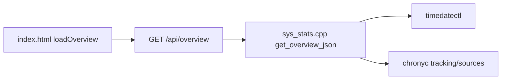

# sysmonit Time & Date 增加 chrony 状态显示

## 背景

当前 Time & Date 仅通过 `timedatectl` 填充 [`ros_ws/src/sysmonit/src/sys_stats.cpp`](ros_ws/src/sysmonit/src/sys_stats.cpp)（约 364–394 行），前端在 [`ros_ws/src/sysmonit/web/index.html`](ros_ws/src/sysmonit/web/index.html) `loadOverview()` 渲染 4 个字段。

**问题**：AGX 使用 chrony 授时，但 `timedatectl` 的 `NTP Sync` 常与 chrony 实际状态不一致（截图中 chrony 在跑却显示 `no`）。需要在同一页面展示 **chrony 真实状态**。



## 实现范围（用户选择：标准档）

在保留现有 4 项基础上，新增：

| 字段 | 来源 | 说明 |
|------|------|------|
| `chrony_running` | `systemctl is-active chrony` | `yes` / `no`，绿色/红色 |
| `chrony_ref_id` | `chronyc -c tracking` | 当前参考源（C2 IP / LOCAL 等） |
| `chrony_stratum` | `chronyc -c tracking` | 层数 |
| `chrony_offset_ms` | `chronyc -c tracking` | 系统时钟偏移（ms，保留 1 位小数） |
| `chrony_leap_status` | `chronyc -c tracking` | 如 `Normal` |
| `chrony_sources[]` | `chronyc -c sources` | 上游 NTP 源列表（name/mode/stratum/offset/reachable） |

**不纳入本版**（完整档留作后续）：`chronyc clients`（当前非授权用户返回 `501 Not authorised`）、RTC 时间展示（后端已采集 `rtc_time` 但未显示，可顺手补上）。

## 后端改动

**文件**：[`ros_ws/src/sysmonit/src/sys_stats.cpp`](ros_ws/src/sysmonit/src/sys_stats.cpp)

1. 在 `get_overview_json()` 的 `timedate` 段后，新增静态辅助函数（同文件内）：
   - `query_chrony_running()`：`popen("systemctl is-active chrony 2>/dev/null")`，输出 `active` → `yes`
   - `append_chrony_tracking_json(std::ostringstream&)`：执行 `chronyc -c tracking`，解析 CSV 第 1 行（Reference ID、Stratum、offset 等，与现场 `7F7F0101,,10,...` 格式一致）
   - `append_chrony_sources_json(std::ostringstream&)`：执行 `chronyc -c sources`，逐行解析为 JSON 数组

2. 扩展 `timedate` JSON 结构示例：

```json
"timedate": {
  "local_time": "...",
  "utc_time": "...",
  "timezone": "...",
  "ntp_sync": "no",
  "chrony_running": "yes",
  "chrony_ref_id": "192.168.3.4",
  "chrony_stratum": 10,
  "chrony_offset_ms": 0.0,
  "chrony_leap_status": "Normal",
  "chrony_sources": [
    {"name":"192.168.3.4","mode":"?","stratum":0,"offset_ms":0.0,"reachable":false}
  ]
}
```

3. **复用现有 `ShellCmdLock`**，与 `timedatectl` 调用保持互斥，避免并发 `popen` 问题。

4. **不链接** [`src/srv/time_sync/chrony_ctrl.cpp`](src/srv/time_sync/chrony_ctrl.cpp)：sysmonit 保持轻量，与现有 `timedatectl` 风格一致，避免引入 `time_sync` 依赖。

## 前端改动

**文件**：[`ros_ws/src/sysmonit/web/index.html`](ros_ws/src/sysmonit/web/index.html)

1. **第一行状态卡片**（`#overview-timedate`）：
   - 保留 Local Time / Time Zone / UTC Time
   - 将 `NTP Sync` 标签改为 **System Sync**（`timedatectl` 语义），避免与 chrony 混淆
   - 新增 **Chrony**（running/stopped，颜色 `#3fb950` / `#f85149`）
   - 新增 **Reference**、**Stratum**、**Offset**

2. **第二行**：在卡片内 `#overview-timedate` 下方或同卡片内增加紧凑表格 **NTP Sources**：
   - 列：Source / Mode / Stratum / Offset / Reachable
   - `mode` 用颜色区分：`*` 绿、`+` 蓝、`?` 橙、`-` 灰

3. **布局**：`grid-template-columns: repeat(auto-fill, minmax(140px, auto))`，容纳更多字段；小屏自动换行。

4. **i18n**：在 `I18N` 对象中补充 `td_chrony`、`td_reference`、`td_stratum`、`td_offset`、`td_system_sync`、`td_ntp_sources` 等中英文键，替换硬编码英文标签。

5. **空态**：chrony 未运行时，tracking/sources 显示 `-`，不报错。

## 验证

1. 编译：`cd ros_ws && colcon build --packages-select sysmonit`
2. 重启 sysmonit 节点后访问 `http://<agx>:12345`，打开 **Time & Date**
3. 命令行对照：
   - `systemctl is-active chrony` → 页面 Chrony = yes
   - `chronyc -c tracking` → Reference / Stratum / Offset 一致
   - `chronyc -c sources` → 表格行数与内容一致

## 后续可选增强（本计划不实现）

- **RTC Time**：后端已有 `rtc_time`，可加一张卡片显示硬件时钟
- **NTP Clients**：需在 chrony.conf 增加 `cmdallow <sysmonit来源IP>` 或以 root 查询，展示下游子设备对时情况
- **GPS refclock 状态**：需解析 `chronyc sources` 中 `SHM`/`GPS` 源或对接 `time_sync_manager`
- **eth0 直连外网后**：可弱化 tinyproxy 依赖，但 chrony 状态展示仍有效

## 涉及文件

- [`ros_ws/src/sysmonit/src/sys_stats.cpp`](ros_ws/src/sysmonit/src/sys_stats.cpp) — 后端数据采集
- [`ros_ws/src/sysmonit/web/index.html`](ros_ws/src/sysmonit/web/index.html) — UI 与 i18n
