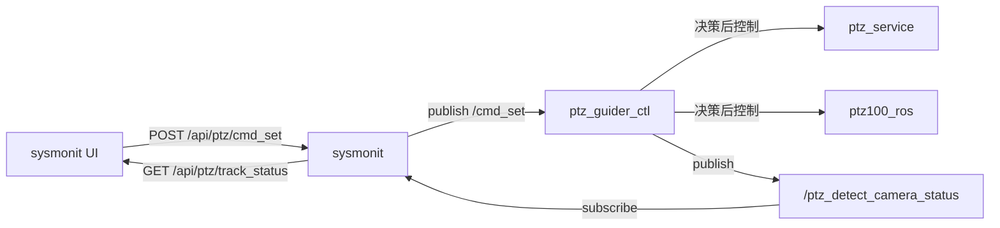

# sysmonit 增加跟踪源 2 个功能开关

## 背景与目标

根据 [transcript](file:///home/skyfend/.cursor/projects/home-skyfend-workspace-ptz100-agx/agent-transcripts/d19d4d53-861b-4f74-a267-759a199d9757/d19d4d53-861b-4f74-a267-759a199d9757.jsonl) 与 C2 0x8B 协议，**跟踪源切换**与 ICR/透雾/除霜是独立功能：

| 功能 | C2 cmd | 下发路径 | 适用 |
|------|--------|----------|------|
| 跟踪源模式 | 8 `detect_camera_mode` | `/cmd_set` CMD_ID=53 | 和普/耐杰 |
| 跟踪源 | 9 `detect_camera` | `/cmd_set` CMD_ID=54 | 和普/耐杰 |

现有 [index.html](ros_ws/src/sysmonit/web/index.html) 右侧 `ptz-hepu-features` 仅覆盖和普 ICR/透雾/除霜，且走 `/ptz_lens_cmd`；**新面板应对所有 PTZ 类型可见**，并走 `/cmd_set`。

## 数据流（对齐 C2）



C2 侧映射（复用 [alink_system.cpp](src/srv/alink/command/system/alink_system.cpp) 非激光分支逻辑）：

- **模式自动** → `cmd_id=53`, `state_code=STATE_CODE_USER_PTZ_CONTROLLER_DETECT_CAMERA_MODE_AUTO (0)`
- **模式手动** → `cmd_id=53`, `state_code=STATE_CODE_USER_PTZ_CONTROLLER_DETECT_CAMERA_MODE_MANUAL (1)`
- **跟踪源可见光** → `cmd_id=54`, `state_code=VIDEO_SOURCE_VISIBLE (0)`
- **跟踪源红外** → `cmd_id=54`, `state_code=VIDEO_SOURCE_INFRARED (1)`

状态来源：[PtzDetectCameraStatus.msg](ros_ws/src/srp100_message/skyfend_interfaces/msg/ptz_msg/PtzDetectCameraStatus.msg)（引导节点发布，`ros_app` 已订阅用于 0xEC 上报）

- `detect_camera_mode`: 0=自动, 1=手动
- `detect_camera`: 0=可见光, 1=红外

## 实现步骤

### 1. 后端：新增 `/cmd_set` 发布与状态订阅

**文件**: [main.cpp](ros_ws/src/sysmonit/src/main.cpp), [http_api.hpp](ros_ws/src/sysmonit/include/sysmonit/http_api.hpp), [http_api.cpp](ros_ws/src/sysmonit/src/http_api.cpp)

- `HttpApiDeps` 增加 `pub_cmd_set`（`skyfend_interfaces/msg/CmdSet`）
- `main.cpp` 创建 publisher：`/cmd_set`
- 订阅 `/ptz_detect_camera_status`，回调写入缓存（含 `recv_ms` 用于判断新鲜度，建议 10s 内为有效）
- 新增 API：
  - `POST /api/ptz/cmd_set` — body: `{ "cmd_id": 53|54, "state_code": N }`
  - `GET /api/ptz/track_status` — 返回 `{ present, detect_camera_mode, detect_camera, recv_ms }`

发布 `CmdSet` 时填充 `header.stamp`、`timestamp`、`cmd_id`、`state_code`（`state_reserve_list` 留空）。

### 2. 前端：红框区域 UI

**文件**: [index.html](ros_ws/src/sysmonit/web/index.html)

在 `ptz-hepu-features` 右侧新增 `ptz-track-source-features` 卡片（复用 `.ptz-hepu-features` / `.ptz-feature-row` 样式）：

```
跟踪源模式:  [自动] [手动]
跟踪源:      [可见光] [红外]
```

- 文案 i18n：`ptz_track_mode` / `ptz_track_source` 等
- 说明小字：与 C2 一致，经引导节点控制，适用于和普/耐杰
- **交互**：
  - 点击模式按钮 → `POST /api/ptz/cmd_set` cmd_id=53
  - 点击跟踪源按钮 → `POST /api/ptz/cmd_set` cmd_id=54
  - **自动模式下禁用**可见光/红外按钮（引导节点不响应手动切源，与 C2 行为一致）
- **状态回显**：在现有 1s 轮询（`startFpsPolling`）中增加 `GET /api/ptz/track_status`，调用 `renderTrackSourceControls()` 高亮当前选项；无有效状态时按钮不高亮

显示条件：与 PTZ Control 卡片一致（`Show Player` 打开时显示），**不限制和普**。

### 3. 与现有和普功能区的关系

- 左侧 `ptz-hepu-features`（ICR/透雾/除霜）保持不变，仍仅和普设备可用
- 右侧新面板独立，专注跟踪源，避免混用 `/ptz_lens_cmd` 与 `/cmd_set` 两条链路

### 4. 验证

- 编译 `colcon build --packages-select sysmonit`
- 重启 sysmonit 后：
  1. 打开 Video Stream → Show Player → 确认红框区域出现 2 行开关
  2. `ros2 topic echo /cmd_set` 验证点击后发布 CMD_ID 53/54
  3. `ros2 topic echo /ptz_detect_camera_status` 验证状态回显与按钮高亮一致
  4. 自动模式下可见光/红外按钮应为 disabled

## 不在本次范围

- 不修改 ICR 现有和普按钮路径（仍走 `/ptz_lens_cmd`）；与 C2 最新 ICR 经引导节点方案的对齐可另开任务
- 不修改 `ptz_guider_ctl` / `ros_app` / `alink_system` 底层逻辑（已实现）
