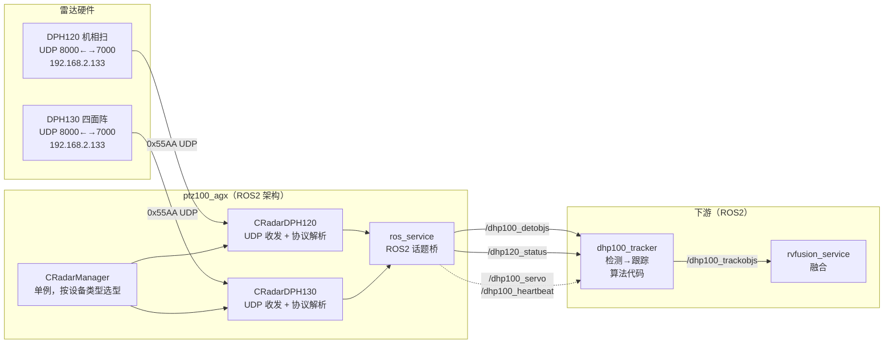
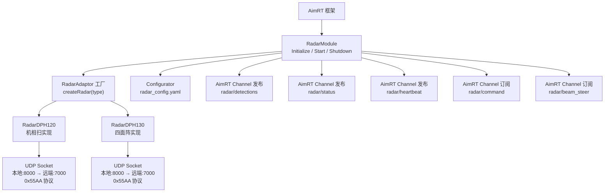
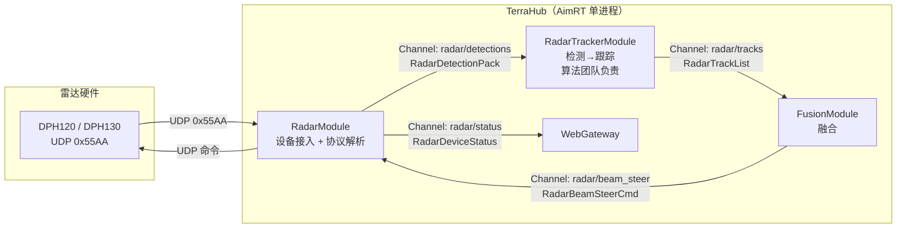
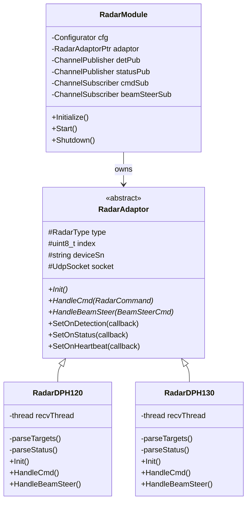
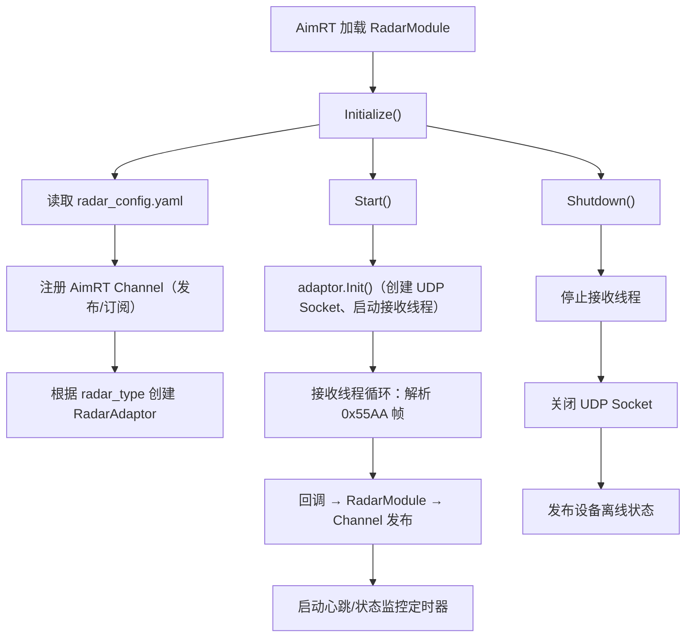

# DeviceAbs Radar 中程雷达（DPH100）迁移方案

## 一、概述

### 1.1 迁移目标

将 `ptz100_agx` 中 `ros_ws/src/dhp100/dhp100_link/` 的中程雷达设备接入逻辑，从 ROS2 节点重构为 AimRT Module 架构下的 **RadarModule**，统一管理 DPH120（机相扫）和 DPH130（四面阵）两种内部型号的 UDP 通信、协议解析、状态上报。

> **本次重构侧重点**：云边端重构项目基于 **SSF200（Spotter Pro 四面阵中程电子围栏）** 进行系统改造，因此 **DPH130（四面阵）优先实现**，DPH120（机扫）其次。
>
> 产品型号对应关系：
> - SSF100：Spotter — 近程电子围栏（不在本次范围）
> - **SSF200：Spotter Pro 四面阵中程电子围栏 — 本次重点**
> - SSF210：Spotter Pro 机扫电子围栏

### 1.2 分工归属


| 模块                                           | 负责人      | 排期                                  | 说明                                      |
| -------------------------------------------- | -------- | ----------------------------------- | --------------------------------------- |
| DeviceAbs Radar（中程雷达）—— 本文档                  | **@袁伟健** | P0, 4/13-4/15                       | RadarModule 设备抽象：UDP 收发、协议解析、Channel 发布 |
| dhp100_tracker（检测→跟踪算法）—— RadarTrackerModule | **@周益辉** | SolutionLayer 算法模块移植 (P0, 4/6-4/12) | 消费 `radar/detections` Channel，独立 Module |


### 1.3 范围


| 设备                                                 | 对外型号   | 内部型号   | 本次迁移        | 说明                                                                |
| -------------------------------------------------- | ------ | ------ | ----------- | ----------------------------------------------------------------- |
| 中程四面阵雷达                                            | DPH100 | DPH130 | **优先迁移**    | `CRadarDPH130`，SSF200 产品，本次重构重点                                    |
| 中程机扫雷达                                             | DPH100 | DPH120 | 迁移（其次）     | `CRadarDPH120`，SSF210 产品                                           |
| dhp100_tracker                                     | -      | -      | **不在本方案范围** | 算法代码，归属 **@周益辉**（SolutionLayer 算法模块移植），作为独立 RadarTrackerModule 迁移 |
| radar_network（eth_link 近程透传）                       | -      | -      | **不迁移**     | 近程雷达旧协议，与中程无关（注：新架构已无 C2 app 和 Alink 协议）                          |
| 标定（sentryv_calibrate / multiple_radar_calibration） | -      | -      | **暂不迁移**    | 标定流程独立排期                                                          |


### 1.4 现状要点




**现有关键文件**：


| 文件                                                                 | 职责                                                       |
| ------------------------------------------------------------------ | -------------------------------------------------------- |
| `ros_ws/src/dhp100/dhp100_link/src/CRadarManager.cpp/.h`           | 单例管理器，按 `get_agx_device_type()` 选 DPH120/DPH130          |
| `ros_ws/src/dhp100/dhp100_link/src/CRadarAdaptor.h`                | 适配器基类：`Init`/`HandleCmd`/`HandleConfig`/`HandleTrackCmd` |
| `ros_ws/src/dhp100/dhp100_link/src/CRadarDPH120.cpp/.h`            | DPH120 UDP 收发 + 协议解析（0x55AA）                             |
| `ros_ws/src/dhp100/dhp100_link/src/CRadarDPH130.cpp/.h`            | DPH130 UDP 收发 + 协议解析（0x55AA）                             |
| `ros_ws/src/dhp100/dhp100_link/src/ros_service/ros_service.cpp/.h` | ROS2 话题桥：发布检测包/状态/心跳；订阅控制指令和 TAS 波束引导                    |
| `ros_ws/src/dhp100/dhp100_link/include/dph120_msg.h`               | DPH120 二进制消息结构体（帧头 0x55AA / 目标体 / 状态体）                   |
| `ros_ws/src/dhp100/dhp100_link/include/dph130_msg.h`               | DPH130 二进制消息结构体                                          |
| `ros_ws/src/dhp100/dhp100_link/include/radardef.h`                 | 雷达类型枚举 `RADAR_DPH100=1, RADAR_DPH120=2, RADAR_DPH130=3`  |


**协议概要**：

- 帧格式：`magic(0x55AA) + msg_type(u16) + seq(u32) + len(u32) + payload + tail(proto_id + ver + checksum)`
- 关键消息类型（DPH120）：`0xFF00` 模式设置、`0xFF01` 跟踪目标、`0xFF02` 搜索目标、`0xFF03` 状态上报、`0xFF04` 参数配置
- 目标数据字段：`path_no / speed / distance / azimuth / pitch / height / fpath_type / LLA / velocity_xyz` 等

---

## 二、目标架构

### 2.1 AimRT Module 设计




### 2.2 系统数据流（迁移后）




### 2.3 类设计




### 2.4 Module 生命周期




---

## 三、通信链路迁移

### 3.1 ROS2 Topic → AimRT Channel 映射


| 现有 ROS2 Topic           | 消息类型                       | AimRT Channel      | Protobuf 消息          | 方向                            | 频率      |
| ----------------------- | -------------------------- | ------------------ | -------------------- | ----------------------------- | ------- |
| `/dhp100_detobjs`       | `DhpTargetPack`            | `radar/detections` | `RadarDetectionPack` | RadarModule → TrackerModule   | 10-20Hz |
| `/dhp120_status`        | `DhpStatusUpload`          | `radar/status`     | `RadarDeviceStatus`  | RadarModule → WebGateway / 上层 | 1Hz     |
| `/dhp100_servo`         | `Dhp100Servo`              | `radar/servo`      | `RadarServoInfo`     | RadarModule → 上层              | 按需      |
| `/dhp100_heartbeat`     | `Dhp100Heartbeat`          | `radar/heartbeat`  | `RadarHeartbeat`     | RadarModule → SysMonit        | 1Hz     |
| `/dhp100_fb_data`       | `Dhp100FbData`             | `radar/feedback`   | `RadarFeedback`      | RadarModule → 上层              | 按需      |
| `/dhp120_cmd_req`       | `Dhp120CmdReq`             | `radar/command`    | `RadarCommand`       | 上层 → RadarModule              | 按需      |
| `/dhp120_param_set_req` | `Dhp120ParamResp`          | `radar/param_set`  | `RadarParamSet`      | 上层 → RadarModule              | 按需      |
| `/dhp_track_cmd_req`    | `DhpTrackCmdReq`           | `radar/track_cmd`  | `RadarTrackCommand`  | TrackerModule → RadarModule   | 按需      |
| `/tas_beam_steer`       | `RadarObjListForBeamSteer` | `radar/beam_steer` | `RadarBeamSteerCmd`  | FusionModule → RadarModule    | 按需      |


### 3.2 与上层 Module 的接口


| 交互方                        | Channel                                                   | 说明                   |
| -------------------------- | --------------------------------------------------------- | -------------------- |
| **RadarTrackerModule**（算法） | 订阅 `radar/detections`；发布 `radar/track_cmd`                | 检测目标 → 跟踪算法 → 跟踪指令回发 |
| **FusionModule**           | 订阅 `radar/tracks`（TrackerModule 发布）；发布 `radar/beam_steer` | 融合消费跟踪航迹；TAS 波束引导回雷达 |
| **WebGateway**             | 订阅 `radar/status`、`radar/heartbeat`                       | 设备状态展示               |
| **SysMonitModule**         | 订阅 `radar/heartbeat`                                      | 设备健康监控               |


---

## 四、目录结构

`Radar/` 根目录放公共文件（Module 入口、适配器基类、工厂、配置、Protobuf），各型号独有实现放在各自子目录下：

```
TerraHub/src/02_DevAbsLayer/01_Detector/Radar/
│
│   ── 公共文件（Module 入口 + 适配器抽象 + 工厂） ──
├── CMakeLists.txt
├── radar_module.h                    # RadarModule 类定义（AimRT Module）
├── radar_module.cpp                  # RadarModule 实现（Initialize/Start/Shutdown）
├── radar_config.yaml                 # 设备配置（类型、IP、端口等）
├── radar_adaptor.h                   # RadarAdaptor 抽象基类
├── radar_factory.h                   # RadarAdaptor 工厂（按 type 创建）
├── radar_factory.cpp
│
│   ── Protobuf 消息定义 ──
├── proto/
│   ├── radar_detection.proto         # 检测目标（替代 DhpTargetPack）
│   ├── radar_status.proto            # 设备状态（替代 DhpStatusUpload）
│   ├── radar_command.proto           # 控制指令（替代 Dhp120CmdReq）
│   └── radar_beam_steer.proto        # TAS 波束引导
│
│   ── DPH120 机相扫实现 ──
├── dph120/
│   ├── radar_dph120.h
│   ├── radar_dph120.cpp
│   └── dph120_protocol.h            # DPH120 二进制协议结构体（从 dph120_msg.h 迁入）
│
│   ── DPH130 四面阵实现 ──
├── dph130/
│   ├── radar_dph130.h
│   ├── radar_dph130.cpp
│   └── dph130_protocol.h            # DPH130 二进制协议结构体（从 dph130_msg.h 迁入）
│
│   ── 公共协议工具 ──
└── common/
    ├── radar_udp.h                   # UDP 收发封装（bind/send/recv）
    └── radar_frame_parser.h          # 0x55AA 帧解析工具（magic校验/checksum/拆包）
```

---

## 五、配置文件

```yaml
# radar_config.yaml
radar:
  type: "DPH120"              # DPH120 | DPH130（对应内部型号）
  device_sn: "RADAR-DPH100-001"

  udp:
    local_port: 8000           # AGX 侧绑定端口
    remote_port: 7000          # 雷达侧端口
    remote_ip: "192.168.2.133" # 雷达 IP
    recv_buffer_size: 65536    # 接收缓冲区

  heartbeat:
    interval_ms: 1000          # 心跳发送间隔
    timeout_ms: 5000           # 心跳超时判定离线

  status:
    report_interval_ms: 1000   # 状态上报间隔
```

---

## 六、Protobuf 消息定义（草案）

```protobuf
// proto/radar_detection.proto
syntax = "proto3";
package terrahub.radar;

message RadarDetectionItem {
  uint32 id = 1;
  uint32 radar_face_id = 2;       // 四面阵雷达面编号
  uint32 classification = 3;      // 目标分类
  float  range = 4;               // 距离（米）
  float  azimuth = 5;             // 方位角（度，北偏东）
  float  elevation = 6;           // 俯仰角（度）
  float  velocity = 7;            // 多普勒速度（m/s）
  float  rcs = 8;                 // RCS（dBm^2）
  float  abs_vel = 9;             // 绝对速度（m/s）
  double longitude = 10;
  double latitude = 11;
  double altitude = 12;
  float  x = 13;                  // ENU 坐标
  float  y = 14;
  float  z = 15;
  float  vx = 16;
  float  vy = 17;
  float  vz = 18;
  uint64 timestamp_ms = 19;
}

message RadarDetectionPack {
  uint32 device_type = 1;         // DPH120=2, DPH130=3
  string device_sn = 2;
  uint32 scan_cycle = 3;
  uint64 timestamp_ms = 4;
  repeated RadarDetectionItem targets = 5;
}
```

```protobuf
// proto/radar_status.proto
syntax = "proto3";
package terrahub.radar;

message RadarDeviceStatus {
  string device_sn = 1;
  uint32 device_type = 2;
  uint32 work_mode = 3;           // 0x00 待机, 0x11 搜索, 0x22 跟踪
  uint32 cmd_status = 4;          // 命令执行情况
  uint32 fault_status = 5;        // 故障类型
  bool   connected = 6;           // 网络连接状态
  float  servo_azimuth = 7;       // 伺服方位角
  float  servo_pitch = 8;         // 伺服俯仰角
  repeated float subarray_temp = 9;    // 子阵温度
  repeated float subarray_current = 10; // 子阵电流
  uint64 timestamp_ms = 11;
}
```

```protobuf
// proto/radar_command.proto
syntax = "proto3";
package terrahub.radar;

message RadarCommand {
  string device_sn = 1;
  uint32 cmd_type = 2;            // 0xFF00 模式设置等
  bytes  payload = 3;             // 原始指令载荷
}

message RadarBeamSteerCmd {
  string device_sn = 1;
  repeated BeamSteerTarget targets = 2;
}

message BeamSteerTarget {
  uint32 target_id = 1;
  float  azimuth = 2;
  float  elevation = 3;
  float  range = 4;
}
```

---

## 七、迁移步骤

### 阶段一：基础框架（P0）

1. 创建目录结构和 CMakeLists.txt
2. 实现 `RadarAdaptor` 抽象基类和工厂
3. 实现 `RadarModule` 骨架（Initialize/Start/Shutdown）
4. 编写 Protobuf 消息定义
5. 实现 `common/radar_udp.h` UDP 收发封装
6. 实现 `common/radar_frame_parser.h` 0x55AA 帧解析

### 阶段二：DPH130 四面阵实现（P0，SSF200 重点）

1. 迁移 `CRadarDPH130` → `RadarDPH130`
2. 迁移 `dph130_msg.h` → `dph130_protocol.h`
3. 实现 UDP 接收线程 + 目标/状态解析
4. 对接 `radar/detections`、`radar/status` Channel 发布
5. 实现 `radar/command`、`radar/beam_steer` Channel 订阅 → UDP 命令下发

### 阶段三：DPH120 机扫实现（P1，SSF210）

1. 迁移 `CRadarDPH120` → `RadarDPH120`
2. 迁移 `dph120_msg.h` → `dph120_protocol.h`
3. 复用 DPH130 的 Channel 接口，仅协议解析不同

### 阶段四：集成验证

1. 与 RadarTrackerModule（算法团队）对接 `radar/detections` Channel
2. 与 FusionModule 对接 `radar/beam_steer` Channel
3. 与 WebGateway 对接 `radar/status` Channel
4. 端到端验证：雷达硬件 → RadarModule → TrackerModule → FusionModule

---

## 八、不迁移的部分


| 组件                                  | 原因                                                     | 归属                             |
| ----------------------------------- | ------------------------------------------------------ | ------------------------------ |
| `dhp100_tracker`（检测→跟踪）             | 算法代码，作为独立 RadarTrackerModule 迁移                        | **@周益辉**（SolutionLayer 算法模块移植） |
| `radar_network.cpp`（eth_link 近程透传）  | 近程雷达旧协议，与中程无关（新架构已无 C2/Alink）                           | 废弃不迁移                          |
| `sentryv_calibrate`（标定）             | 标定流程独立排期                                               | 后续                             |
| `multiple_radar_calibration`（多雷达标定） | 标定流程独立排期                                               | 后续                             |
| `CRadarDPH100`（旧版 DPH100 分支）        | 代码中 DPH100 实际映射到 SRP230 产品的特殊路径，与当前 DPH120/DPH130 主线不同 | 评估后决定                          |
| `ota_radar`（雷达 OTA）                 | 属于 OTA 子系统                                             | OTA Module                     |


---

## 九、风险与依赖


| 风险                                    | 影响                           | 缓解措施                                   |
| ------------------------------------- | ---------------------------- | -------------------------------------- |
| DPH120/DPH130 UDP 协议差异                | 两种型号帧格式相似但字段有差异              | 抽象公共帧解析（magic/checksum），目标体各自解析        |
| 与 RadarTrackerModule 的 Channel 消息格式对齐 | 算法团队需消费 `RadarDetectionPack` | 提前约定 Protobuf 消息，提供样例数据                |
| 雷达 IP/端口可能因部署环境变化                     | 硬编码 `192.168.2.133` 不灵活      | 全部走 `radar_config.yaml` 配置             |
| TAS 波束引导闭环                            | 需 FusionModule 先行就绪          | 先实现单向（雷达→检测），波束引导后补                    |
| 心跳超时与设备状态机                            | 设备离线判定逻辑                     | 复用现有心跳间隔，Module 内维护 ONLINE/OFFLINE 状态机 |


