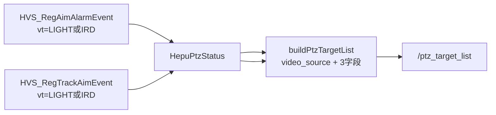

# 和普 PTZ 发布 /ptz_target_list（首期）

## 目标

- `[ptz_service](ros_ws/src/ptz_service)` 发布 `[/ptz_target_list](ros_ws/src/srp100_message/skyfend_interfaces/msg/ptz_msg/PtzTargetList.msg)`
- **PtzTargetItem**：首期只填 **3 字段**，其余 13 字段填 **0**
- **PtzTargetList**：新增 `**video_source`**，标识本包目标是可见光还是热像（与引导对齐）


| 层级            | 字段                    | 含义                      |
| ------------- | --------------------- | ----------------------- |
| PtzTargetItem | `target_type`         | 目标类型（首期可透传和普枚举原值）       |
| PtzTargetItem | `target_position_x/y` | 框**左上角**（已换算到 AGX 流分辨率） |
| PtzTargetList | `video_source`        | **0=可见光，1=热像**（新增）      |


## 耐杰以前怎么处理？

- `[PtzTargetList.msg](ros_ws/src/srp100_message/skyfend_interfaces/msg/ptz_msg/PtzTargetList.msg)` / `[PtzTargetItem.msg](ros_ws/src/srp100_message/skyfend_interfaces/msg/ptz_msg/PtzTargetItem.msg)` **没有**成像源字段（引导同事确认：**耐杰估计也没区分**）。
- 耐杰以太网结构 `[ptz_msg_target_info_t](src/srv/eth_link/ptz_protocol/ptz_control_struct.h)` 同样无 `video_source`。
- 间接手段：`PtzTargetItem.ai_mode` 注释为 `1` 可见光检测 / `2` 可见光跟踪 / `3` 红外检测 / `4` 红外跟踪（见 `[ai_main.cpp](src/srv/algs/ai_alg/ai_main.cpp)`），但 **首期和普不填 ai_mode**，且列表级仍无法表达“本包是哪种源”。
- 相关话题已有成像源枚举，可对齐复用：
  - `[PtzTargetMissingInfo.msg](ros_ws/src/srp100_message/skyfend_interfaces/msg/ptz_msg/PtzTargetMissingInfo.msg)`：`VIDEO_SOURCE_VISIBLELIGHT=0` / `VIDEO_SOURCE_INFRARED=1`
  - `[PtzStatus.msg](ros_ws/src/srp100_message/skyfend_interfaces/msg/ptz_msg/PtzStatus.msg)`：`TRACKING_VIDEO_SOURCE`_*

**结论：** 和普需要在 **PtzTargetList 列表级** 新增 `video_source`；耐杰 `ros_app` 发布路径可暂填 **0（可见光）** 保持兼容，引导侧后续按需消费。

## msg 改动（与引导对齐）

在 `[PtzTargetList.msg](ros_ws/src/srp100_message/skyfend_interfaces/msg/ptz_msg/PtzTargetList.msg)` 增加：

```msg
# imaging / lock source（与 PtzTargetMissingInfo 一致）
uint8 VIDEO_SOURCE_VISIBLELIGHT = 0
uint8 VIDEO_SOURCE_INFRARED = 1

uint8 video_source   # 本包 targets 的成像源
```

- 放在 **列表级**（非 Item 内）：和普每次回调 `vt` 单一（`VT_LIGHT` 或 `VT_IRD`），一包内目标同源。
- 改完后 `colcon build --packages-select skyfend_interfaces` 及依赖包。

引导同事在 `ptz_guider` 侧后续增加对该字段的解析；**首期 AGX 只负责正确填充发布**。

## 数据流




- 检测：`visible_targets` / `thermal_targets`（`[onAimAlarmEvent](iotDevices/ptzHepuSDK/src/ptz_hepu_ctrl.cpp)` 按 `vt` 分流）
- 跟踪：`onTrackAimEvent`（补 `aimType` + 跟踪 rect）
- `video_source`：`VT_LIGHT` → `0`，`VT_IRD` → `1`（来自 `last_alarm_video_type` / `tracking_video_type` / 回调 `vt`）

## 坐标换算 + video_source 联动


| video_source | 和普 rect             | 写入 position_x/y 前                       |
| ------------ | ------------------- | --------------------------------------- |
| 0 可见光        | 640×512（检测像素；跟踪见备注） | **×1920/640，×1080/512** → 1920×1080 左上角 |
| 1 热像         | 640×512             | **1:1** 左上角                             |


可见光（引导已确认按 1920×1080 上报）：

```
position_x = rect.left × 1920 / 640
position_y = rect.top  × 1080 / 512
```

热像： `position_x = rect.left`，`position_y = rect.top`。

跟踪阶段可见光若实测 rect 亦为 640×512 像素，则与检测同一公式；若为 0~1 比例则用 `×1920` / `×1080`。

## 汇聚与发布


| 状态  | 数据源                                          | target_num | video_source          |
| --- | -------------------------------------------- | ---------- | --------------------- |
| 检测  | `visible_targets` 或 `thermal_targets`（谁更新发谁） | 多目标        | 对应 vt                 |
| 跟踪  | 最近一次 `onTrackAimEvent`                       | 1          | `tracking_video_type` |


- 可见光、热像检测**分两次回调**，各发一包，靠 `video_source` 区分（无需在同一包里混两路）。
- 发布：ptz_service；频率跟随回调或限流 ~10Hz。

## 改动文件

1. `[PtzTargetList.msg](ros_ws/src/srp100_message/skyfend_interfaces/msg/ptz_msg/PtzTargetList.msg)` — 新增 `video_source`
2. `[rosService.h/cpp](ros_ws/src/ptz_service/src/rosService/rosService.h)` — Publisher
3. `[ptz_hepu_ctrl.cpp](iotDevices/ptzHepuSDK/src/ptz_hepu_ctrl.cpp)` — 跟踪 `aimType`、rect
4. `[ptzDeviceHepu.cpp](ros_ws/src/ptz_service/src/ptzDevice/ptzDeviceHepu.cpp)` — `buildPtzTargetList()` + 发布
5. （可选兼容）`[ros_app.cpp](src/app/ros_app/ros_app.cpp)` 耐杰发布处 `video_source=0`

## 验证

1. `ros2 topic echo /ptz_target_list`：`video_source` 随可见光/热像回调在 0/1 切换
2. 可见光：`position_x/y` 与 **1920×1080** 画面左上角对齐
3. 热像：与 **640×512** 画面对齐
4. 引导录 bag，按 `video_source` 分流查看

## 二期（本期不做）

`similarity`、`width/height`、`azimuth/pitching`、`distance`、`ai_mode` 等；`target_type` 按 IPCAimType 映射表替换透传。