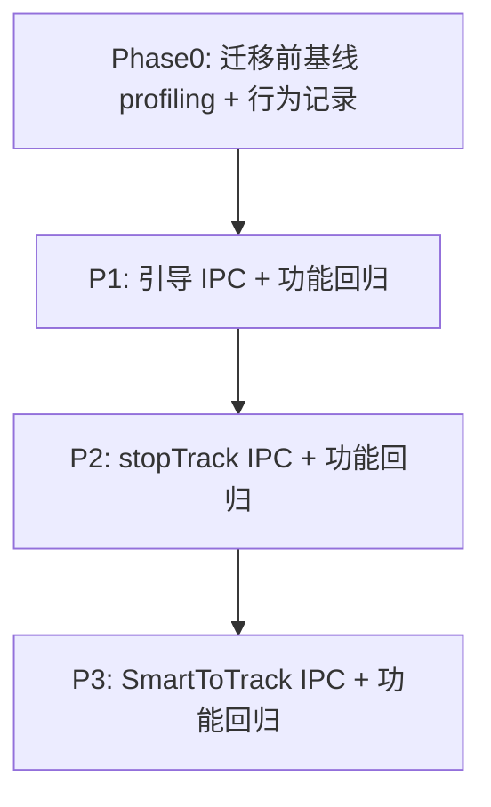

# 和普 SDK → IPC：引导/跟踪迁移计划

## 首要原则：功能等价（不可妥协）

> **迁移到 IPC 的唯一目标是换传输/合并 RTT；对外功能必须与迁移前完全一致。**  
> 若某 IPC 写法无法保证与现 SDK 行为一致，则**不替换**，继续走原 SDK API。

| 要求            | 说明                                                                                                                    |
| ------------- | --------------------------------------------------------------------------------------------------------------------- |
| **对外接口不变**    | `HepuPtzCtrl` **方法函数名不改、入参/出参不改、返回码语义不改**；`ptzDeviceHepu` 业务逻辑（分支/返回值）不改语义；仅在 `.cpp` 内部把 `HVS_`* 实现换成 `sendCommonCmd` |
| **业务分支不变**    | 例如引导在 `tracking==true` 时直接返回、RELEASE 先关双通道搜跟再 `stopTrack` 双通道、搜跟只改 `auto_track` 而保留 `auto_zoom` 等，迁移后逻辑一字不改           |
| **失败语义不变**    | `isReallyConnected` 检查、返回值 `0`/`-1`、日志级别与错误路径与现实现一致；IPC `ackvalue!=100` 等价于 SDK `false`                               |
| **性能优化不得改语义** | 例如 `ptzControl` 51 合并角度+视场时，须等价于先 `setPositionXY` 再 `setViewFromDistance` 的**组合效果**；不能因「单包」省略某字段或改变顺序导致 PTZ 行为变化      |
| **可回退**       | 每项建议保留 `#if 0` 旧 SDK 实现或编译开关，便于现场对比与回滚                                                                                |

---

## 范围约束

| 约束          | 说明                                                                                       |
| ----------- | ---------------------------------------------------------------------------------------- |
| **不自研 TCP** | 一律 `sendCommonCmd` → `HVS_SendCommonCmdS`                                                |
| **协议有据**    | 仅 `[doc/和普IPC远程配置协议_20260506.docx](doc/和普IPC远程配置协议_20260506.docx)` 已有 `cmd`              |
| **和普现网路径**  | `ctrlPtzGuidance`、`ctrlPtzTrack`、`ctrlPtzManualLockTarget`、`configureOnceAfterConnected` |
| **系统内已调用**  | 以 `[ptzDeviceHepu.cpp](ros_ws/src/ptz_service/src/ptzDevice/ptzDeviceHepu.cpp)` 为准       |

---

## 需修改接口一览表

> **命名约束**：`HepuPtzCtrl` 现有公有方法函数名全部保持不变（只改方法体内部实现）。  
> **修改位置**：均在 `[iotDevices/ptzHepuSDK/src/ptz_hepu_ctrl.cpp](iotDevices/ptzHepuSDK/src/ptz_hepu_ctrl.cpp)`（及必要时 `[.h](iotDevices/ptzHepuSDK/include/ptz_hepu_ctrl.h)` 增加私有辅助函数）。  
> `[ptzDeviceHepu.cpp](ros_ws/src/ptz_service/src/ptzDevice/ptzDeviceHepu.cpp)` **不改**调用方与业务分支，仅继续调用同名 `HepuPtzCtrl` 接口。

### 表 1：需要修改（SDK 实现 → IPC，共 7 个对外方法 + 1 个内部方法）

| 序号  | `HepuPtzCtrl` 方法             | 当前 SDK 调用                                     | 目标 IPC（`sendCommonCmd`）                                              | 上游业务入口                               | 优先级 | 修改说明                                                              |
| --- | ---------------------------- | --------------------------------------------- | -------------------------------------------------------------------- | ------------------------------------ | --- | ----------------------------------------------------------------- |
| 1   | `setPositionXY`              | `HVS_PositionXY`                              | `ptzControl`，`actionid=51`（角度字段）                                     | `ctrlPtzGuidance`                    | P1  | 与 `setViewFromDistance` 合并为单包；角度/速度与现网一致                          |
| 2   | `setViewFromDistance`        | `distanceToView` + `setPositionView` →        | 同上 `actionid=51`（`ptzPosCamview` / `ptzPosIrview`）                   | `ctrlPtzGuidance`（`guiding_range>0`） | P1  | `distanceToView` 逻辑**不改**；仅 `setPositionView` 改为走 IPC 或并入 P1 合并函数 |
| 3   | `setPositionView`            | `HVS_PositionView`                            | 随 P1 合并，或单独 `ptzControl` 视场 action                                   | 仅 `setViewFromDistance` 内部           | P1  | 对外仍保留方法；实现改为 IPC，供非合并路径回退                                         |
| 4   | `stopTrack`                  | `HVS_StopTrack`                               | `ivpTrackingCtrl`，`bTracking: false`                                 | `ctrlPtzTrack` RELEASE               | P2  | `channelid` 0/1 与 `VideoType_e` 一致；双通道各调一次                        |
| 5   | `enableSmartToTrack`         | `HVS_EnableSmartToTrack`                      | `ivpGet` + `ivpSet`（`type=4`，`alarmTracking` / `alarmTrackAutoZoom`） | `ctrlPtzTrack` 关搜跟/释放                | P3  | 同时写两字段；与现网一致                                                      |
| 6   | `enableSmartToTrackOnly`     | `HVS_GetSmartInfo` + `HVS_EnableSmartToTrack` | `ivpGet` + `ivpSet`（仅改 `alarmTracking`）                              | `ctrlPtzTrack` SEARCH/JUST_SEARCH    | P3  | 读-改-写，保留 `auto_zoom`                                              |
| 7   | `enableSmartToTrackZoomOnly` | `HVS_GetSmartInfo` + `HVS_EnableSmartToTrack` | `ivpGet` + `ivpSet`（仅改 `alarmTrackAutoZoom`）                         | `ctrlPtzLensCmd` 自动变倍开/关             | P3  | 读-改-写，保留 `auto_track`                                             |
| 8   | `selectRectTrack`            | `HVS_SelectRectTrack`                         | `ivpTrackingCtrl` + `trackingRect`                                   | `ctrlPtzManualLockTarget`            | P2  | 坐标按 `video_rect` 比例映射到 640×512                                    |

### 表 2：引导/跟踪链路相关但不修改（保持现实现）

| `HepuPtzCtrl` 方法              | 当前实现                       | 上游调用                             | 不修改原因              |
| ----------------------------- | -------------------------- | -------------------------------- | ------------------ |
| `getPtzStatus`                | 读 `currentPtzStatus`_ 回调缓存 | `ctrlPtzGuidance`、`ctrlPtzTrack` | 无 SDK/IPC 下发；非性能瓶颈 |
| `distanceToView`              | 本地 YAML/SN 查表              | `setViewFromDistance` 内部         | 非设备协议，逻辑保持不变       |
| `enableTrackAbility`          | `HVS_EnableTrackAbility`   | `configureOnceAfterConnected`    | 协议无独立 cmd；继续 SDK   |
| `setTrackMode`                | `HVS_SetTrackMode`         | `configureOnceAfterConnected`    | 低频一次性设置，保留 SDK 实现  |
| `isReallyConnected` / 连接与回调注册 | SDK                        | 全局                               | 不动                 |

### 表 3：本次范围外（不修改、不讨论）

| 方法 / 业务                                                 | 说明           |
| ------------------------------------------------------- | ------------ |
| `ctrlPtzManualLockTarget` / `selectRectTrack`           | 和普现网不用手动点选锁定 |
| `getTrackingStatus`、`getTrackAbilityState` 等            | 系统内无调用       |
| `controlPtz`、`controlZoom`、`setPreset`、`configureNtp` 等 | 非引导/跟踪主路径    |
| `HVS_RegAngleEvent` 等状态上报回调                             | 接收侧不改        |

### 表 4：`ptzDeviceHepu` 业务函数与改动关系

| 业务函数                          | 是否改 `.cpp` 逻辑 | 依赖的将改 `HepuPtzCtrl` 接口                                                                 |
| ----------------------------- | ------------- | -------------------------------------------------------------------------------------- |
| `ctrlPtzGuidance`             | **否**         | `getPtzStatus`、`setPositionXY`、`setViewFromDistance` → 表 1 第 1～2 项                     |
| `ctrlPtzTrack`                | **否**         | `getPtzStatus`、`enableSmartToTrackOnly`、`enableSmartToTrack`、`stopTrack` → 表 1 第 4～6 项 |
| `ctrlPtzLensCmd`（自动变倍）        | **否**         | `enableSmartToTrackZoomOnly` → 表 1 第 7 项                                               |
| `ctrlPtzManualLockTarget`     | **否**         | `selectRectTrack` → 表 1 第 8 项                                                          |
| `configureOnceAfterConnected` | **否**         | `enableTrackAbility`、`setTrackMode`（均保持 SDK）                                           |

---

## 迁移项与功能等价要点

### P1 引导：`setPositionXY` + `setViewFromDistance` → `ptzControl` actionid=51

**现网行为**（`[ctrlPtzGuidance](ros_ws/src/ptz_service/src/ptzDevice/ptzDeviceHepu.cpp)` + `[ptz_hepu_ctrl.cpp](iotDevices/ptzHepuSDK/src/ptz_hepu_ctrl.cpp)`）：

- `getPtzStatus` → 若 `tracking==true`：**不**下发角度/视场，直接 `return 0`。
- 非跟踪：`setPositionXY(az, el, speed)`，`speed` 默认 100、上限 200。
- `guiding_range > 0` 时：`setViewFromDistance` → 内部 `distanceToView`（YAML/SN 表）→ `setPositionView` → `HVS_PositionView`。

**IPC 实现须保证**：

- 角度：`postionFlaX` / `postionFlaY`（浮点）与 SDK `HVS_PositionXY` 单位、范围一致；速度 `locSpeed`/`locYSpeed` 与现 `speed` 映射一致（含 `bptzSpeedAb` 与现网一致，建议先读设备能力或沿用 SDK 路径所用默认值）。
- 视场：仅当 `guiding_range > 0` 时填 `ptzPosCamview` 或 `ptzPosIrview`（×100），数值与 `distanceToView` 输出一致；另一通道填 0（不动作）。
- **跟踪中仍不发送**（业务层已 return，IPC 层不应被调用；防御性保持一致）。
- 合并单包后：与分两包相比，PTZ 最终方位角、视场角一致（需实机或对比 PTZ 回传验证）。

### P2 释放：`stopTrack` → `ivpTrackingCtrl` `bTracking:false`

**现网行为**（`[ctrlPtzTrack` RELEASE](ros_ws/src/ptz_service/src/ptzDevice/ptzDeviceHepu.cpp)）：

1. 若未在跟踪 → 直接返回。
2. `enableSmartToTrack(VT_LIGHT/IRD, false, false)` 关闭双通道搜跟。
3. `stopTrack(VT_LIGHT)` + `stopTrack(VT_IRD)`（不严格检查返回值）。

**IPC 实现须保证**：

- 仅替换 `stopTrack` 内部；**不**改变 RELEASE 先后顺序与 `enableSmartToTrack` 仍走原实现（或 P3 一并迁移时整段等价）。
- `channelid`：0=可见光，1=热像，与现 `VideoType_e` 一致。
- 双通道均停跟，与现网一致。

### P3 搜跟/自动变倍：`enableSmartToTrack`* → `ivpGet` / `ivpSet`

**现网行为**：

| 方法                           | 行为                                                                                          |
| ---------------------------- | ------------------------------------------------------------------------------------------- |
| `enableSmartToTrackOnly`     | `HVS_GetSmartInfo` 读当前 `alarmTrackAutoZoom` → 只改 `alarmTracking` → `HVS_EnableSmartToTrack` |
| `enableSmartToTrackZoomOnly` | 读当前 `alarmTracking` → 只改 `alarmTrackAutoZoom`                                               |
| `enableSmartToTrack`         | 同时设置两字段                                                                                     |

**IPC 实现须保证**：

- `ivpGet`（type=4 目标跟踪）拿到完整配置 → 仅改目标字段 → `ivpSet` 写回，**禁止**用空/默认 JSON 覆盖其它 IVP 参数（与现 Read-Modify-Write 一致）。
- `channelid`、`smart_type` 与现 `HVS_GetSmartInfo` 所用 channel 一致。
- 失败时：Get 失败则**不** Set（与 `enableSmartToTrackOnly` 现逻辑一致）。

### 不迁移（维持 SDK，功能已满足）

- `enableTrackAbility`、`setTrackMode`（低频一次性配置）、`getPtzStatus`、状态上报回调。

---

## 性能说明（次要目标）

在**满足上表功能等价**前提下，预期收益：

- P1：引导 2 RTT → 1 RTT  
- P3：搜跟 2 RTT → 1～2 RTT（若必须 ivpGet+ivpSet 则 RTT 不变，但字段语义更贴近 Web）

**若合并 RTT 导致 PTZ 动作与分两包不一致，优先回退为分两包 IPC（`ptzControl` 51 仅角度 + 单独视场 cmd），仍算 IPC 迁移，不以牺牲功能换性能。**

---

## 实施与验证路线

### 每项迁移后的功能回归（必做）

| 场景      | 验收标准（与迁移前一致）                          |
| ------- | ------------------------------------- |
| 非跟踪引导   | 云台转到指定方位/俯仰；有距离时视场与距离表一致              |
| 跟踪中引导   | 不下发转动/变倍，函数返回 0                       |
| 开启搜跟    | `ctrlPtzTrack` SEARCH → PTZ 进入识别自适应搜跟 |
| 关闭搜跟/释放 | 双通道搜跟关、跟踪停                            |
| 自动变倍开/关 | 仅变倍联动变化，搜跟开关状态不被误改                    |
| 重连后     | 跟踪模式仍为配置值（0/2/5）                      |

可选：对比迁移前后 `HepuPtzStatus` 回调（角度、视场、`tracking`）时间线是否一致。

**改动文件**：`[ptz_hepu_ctrl.cpp](iotDevices/ptzHepuSDK/src/ptz_hepu_ctrl.cpp)`、`[.h](iotDevices/ptzHepuSDK/include/ptz_hepu_ctrl.h)`；`[ptzDeviceHepu.cpp](ros_ws/src/ptz_service/src/ptzDevice/ptzDeviceHepu.cpp)` 原则上**不改**业务分支。

---

## 简要结论

1. **功能第一**：IPC 替换 SDK 后，引导/搜跟/释放/跟踪模式行为必须与现网相同；性能优化不得改变语义。
2. **范围**：4 项 IPC 迁移（含手动框选 `selectRectTrack`）+ 每项功能回归。
3. **冲突处理**：合并指令若不能证明等价，则拆包或保留 SDK 实现。

