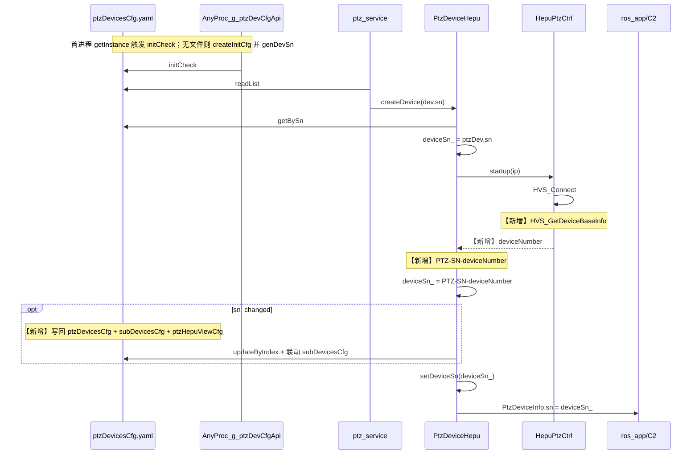

# 和普 PTZ 使用 deviceNumber 作为 SN 设计方案

> **评审精简版**：[和普sn设备编号同步_评审版.md](../../doc/2-软件资料/和普sn设备编号同步_评审版.md)（本文件为详细设计，评审用精简版见链接）

> **修订记录（2026-07-02）**：…(16) **ptzHepuViewCfg** 改为 sn 变更时自动重命名 `devices.<SN>`（用户确认，非手工）。初版结构保留。  
> **修订记录（2026-07-04）**：**(17) 最终确认** yaml 写回均用 `updateByIndex`（`old_sn→getIndexBySn→new_sn`）；**(18) subDevicesCfg 单机约束**：PTZ 类型条目**最多 1 条**（暂不考虑多雷视 PTZ 同时接入，多 PTZ 后期再放开）；**不采用** deleteBySn + 等 ros_app addNew。

## 设计原则（已确认）

**同一台和普 PTZ 在 AGX 中对应唯一、稳定的 SN；仅当更换硬件（`deviceNumber` 变化）时，SN 才允许变化。**


| 含义          | 落地                                                            |
| ----------- | ------------------------------------------------------------- |
| SN 与硬件绑定    | 权威 SN = `PTZ-SN-{deviceNumber}`，非随机、非按启动次数生成                  |
| 同机重启/重连     | `deviceNumber` 不变 → SN 不变，**不写回** yaml                        |
| 首装占位 → 真 SN | 随机 `genDevSn` 仅 bootstrap；连 SDK 后一次性对齐硬件编号                    |
| 换机          | SDK 读到新 `deviceNumber` → `newSn != oldYamlSn` → 写回并 LOG_ERROR |
| 禁止行为        | 每次启动 `genDevSn`、无条件覆盖 yaml sn、无硬件变更却改 SN                      |


本方案（Bootstrap + 条件写回）是为落实上述原则而设计，而非单纯「能读到设备编号就写 yaml」。

## 结论

**已确认策略（用户）**：`[ptzDevicesCfg.yaml](public/config/yamlConfig/ptzDevicesCfg.h)` 先用 `genDevSn` **占位**（或产线预写 `PTZ-SN-{deviceNumber}`）；连 SDK 后以 `PTZ-SN-{deviceNumber}` 为运行态权威 SN。

**写回 yaml / subDevicesCfg 的充要条件**（实现必须遵守）：

```
SDK 成功读到合法 deviceNumber
AND formatHepuAgxSn(deviceNumber) != yaml 当前 sn（即 load 时的 oldYamlSn）
→ 才写回 **ptzDevicesCfg.yaml** + **subDevicesCfg.yaml**（均用 `updateByIndex`）；**可选**联动 **ptzHepuViewCfg**（`devices` 段 SN key 重命名）
```

### 最终确认：两份 yaml 写回方法（2026-07-04）


| 文件                     | 条件                 | 写回步骤                                                                                                                        | 说明                       |
| ---------------------- | ------------------ | --------------------------------------------------------------------------------------------------------------------------- | ------------------------ |
| **ptzDevicesCfg.yaml** | `old_sn != new_sn` | `getIndexBySn(oldYamlSn)`（或已有 `deviceIndex_`）→ `getByIndex` → 改 `dev.sn = newSn` → `**updateByIndex(index, dev)`**          | AGX 主路固定 index 0         |
| **subDevicesCfg.yaml** | `old_sn != new_sn` | `**getIndexBySn(oldYamlSn)`**（fallback `deviceIp_` 遍历）→ `getByIndex` → 改 `dev.sn = newSn` → `**updateByIndex(index, dev)`** | **仅改 sn**，保留 `online`/位姿 |


**subDevicesCfg 单机 PTZ 约束（已确认）**：

- `subDevicesCfg.yaml` 中 **PTZ 类型条目最多 1 条**（type=2/9/23/30/33 等，与 `isPtzSubDev` 一致）。
- **暂不考虑**多台雷视 PTZ 同时接入；支持多 PTZ 时**再放开**此限制（代码加 `TODO(多PTZ)`）。
- SN 写回后 `**syncDeviceSnFromSdk` 内清理**：删除（或 `writeList` 过滤掉）其余 PTZ 类型条目，保证 yaml 中 PTZ **仅保留当前 `newSn` 一条**。
- **不采用** `deleteBySn(old_sn)` 后依赖 `ros_app` 异步 `addNew`（有空窗、丢位姿、无法保证仅一条、新条可能 append 到末尾）。

**无 subDevices PTZ 条目时**：sync 内 `addOrUpdate` 一条 `newSn`（位姿从 `hostDev` 填，与 `ros_app` PTZ 逻辑一致），并仍执行「最多 1 条 PTZ」清理。

相等时：**仅**更新内存 `deviceSn_`（通常已与 yaml 一致），**不写盘**。SDK 读失败 → **保留 yaml 已有 sn**（不另起 `genDevSn`）。




目标图说明：无 **【新增】** 标注为**既有**（含 yaml 由首进程 `g_ptzDevCfgApi` 拉起、`readList`/`getBySn`、连 SDK、`setDeviceSn`、上报 C2）。**现状**运行期不写回 sn；写回为本次新增。yaml/sn 细节见「ptzDevicesCfg.yaml / sn 生成时机」。

## 现状与约束


| 点             | 现状                                                                                                                     | 设计影响                                                            |
| ------------- | ---------------------------------------------------------------------------------------------------------------------- | --------------------------------------------------------------- |
| SDK API       | 全仓未调用；`[DeviceBaseInfo_t.deviceNumber[16]](thirdpart/hepuSdk/include/datdefs.h)`                                       | 有效 ≤15 字符；**已确认** Web 设备编号全局唯一（如 `202506YF0022`、`202604380040`） |
| 连接时机          | `[HepuPtzCtrl::connectInternal](iotDevices/ptzHepuSDK/src/ptz_hepu_ctrl.cpp)` 在 `HVS_Connect` 成功后已调 `getLensZoomAmp()` | 同位置追加 `GetDeviceBaseInfo` 最合适                                   |
| 启动顺序          | `[RosService](ros_ws/src/ptz_service/src/rosService/rosService.cpp)` 用 yaml `dev.sn` 创建设备；控制指令走 `dev_id` 索引            | 运行中改 `deviceSn_` 不影响控制；yaml 需持久化否则重启回退                          |
| SN 格式         | 现有 `genDevSn()` 为 `PTZ-SN-` + 12 位随机                                                                                   | **修订**：SDK 成功时后缀改为设备 `deviceNumber`，前缀保持 `PTZ-SN-`              |
| 下游依赖          | `subDevicesCfg`、`ptzHepuViewCfg.devices.<SN>` 按 SN 索引                                                                  | sn 变更时 **三处自动联动写回**（见 §ptzHepuViewCfg）                          |
| nexus_gateway | `[getFirstDevSn()](ros_ws/src/nexus_gateway/src/ros/RosDataBridge.cpp)` 读 yaml 非 ROS                                   | 写回 yaml 后 gateway 才能一致                                          |


### ptzDevicesCfg.yaml / sn 生成时机

**不是** `ptz_service` 专属；与 `ptz_service` 启动无绑定。

- **路径**：`[PTZ100_APP_CONFIG_DIR/ptzDevicesCfg.yaml](public/config/configUtils/configCommDef.h)` → 现场 `/home/skyfend/config/ptzDevicesCfg.yaml`
- **yaml 文件何时创建**：任意进程**首次**调用 `[PtzDevicesCfg::getInstance()](public/config/yamlConfig/ptzDevicesCfg.cpp)` → 构造函数 `initCheck()`；若 `FILE_NOT_FOUND` 则 `[createInitCfg()](public/config/yamlConfig/ptzDevicesCfg.cpp)` 写默认 2 路并落盘（见结论区时序图 `AnyProc_g_ptzDevCfgApi`）。可能进程：`ptz_service`、`ros_app`、`sysmonit`、`nexus_gateway`、`ptzHepuSDK`、`laser_service` 等——**谁先启动谁可能创建文件**，非 ptz_service 专属。
- **sn 何时生成**：


| 时机                   | 条件                      | 结果                                                                              |
| -------------------- | ----------------------- | ------------------------------------------------------------------------------- |
| 首次 createInitCfg     | `dev.sn=""` 后 writeList | `[genDevSn()](public/config/yamlConfig/ptzDevicesCfg.cpp)` → `PTZ-SN-` + 12 位随机 |
| addNew / addOrUpdate | 传入空 sn                  | 同上                                                                              |
| sysmonit Web 编辑      | 人工改 yaml                | 保留或手填 sn                                                                        |
| 运行期（现状）              | ptz_service 连 SDK       | 不读 deviceNumber，不写回 sn                                                          |
| 运行期（本方案）             | syncDeviceSnFromSdk     | **【新增】** 仅 `newSn != oldYamlSn` 时写回 yaml + subDevicesCfg                        |


现场 `PTZ-SN-Jh0M65tYTped` 为历史上 **genDevSn 随机生成**，非设备硬件编号。

`ptz_service` 启动时通常仅 `readList` 读已有 yaml；`PtzDeviceHepu` → `getBySn` 使用 yaml 中 sn，不在此阶段生成新 sn。

### 现场 yaml 布局（当前约定）

`ptzDevicesCfg.yaml` 为**固定两槽位**数组（见 sysmonit 配置页说明）：


| 索引           | 角色                  | type 范围       | 当前现场示例                                                                 |
| ------------ | ------------------- | ------------- | ---------------------------------------------------------------------- |
| **0（第 1 路）** | **雷视 PTZ**（耐杰 / 和普） | 0, 4, 5, 6, 7 | `type=4` PTZ_HEPU，`sn=PTZ-SN-Jh0M65tYTped`，`ip=192.168.2.4`，`enable=1` |
| 1（第 2 路）     | 激光 PTZ（霍克眼，可选）      | 1, 2, 3       | `type=3` PTZ_HEP21，`enable=0`（未启用）                                     |


**本次 SN 同步范围**：仅针对**第 1 路雷视 PTZ**（和普 type 4/6/7 由 `ptz_service` 管理）。第 2 路激光 PTZ 不在本方案内。

### C2 / 0x77 与单机 PTZ 约定（当前 vs 后期）

**两套「第一台」不可混用**：


| 配置 / 模块                      | 「第一台」含义                                                              | 前面有雷达是否影响                               |
| ---------------------------- | -------------------------------------------------------------------- | --------------------------------------- |
| **ptzDevicesCfg.yaml**       | 固定 **index 0** 槽位（`getFirstDevSn`、`eth_link_ptz_init`、`ptz_service`） | 与 subDevices 顺序无关                       |
| **subDevicesCfg.yaml（C2 侧）** | yaml **按顺序第一个 PTZ 类型**条目（type=2/9/23/30/33…）                         | **不影响**；雷达可在 index 0，PTZ 在 index 1 完全正常 |


示例（C2 认的第二行才是「第一台 PTZ」）：

```yaml
# subDevicesCfg.yaml
- { sn: RADAR-xxx, type: 1,  online: 1 }   # index 0，雷达
- { sn: PTZ-SN-001, type: 23, online: 1 }  # index 1，C2 的「第一台 PTZ」
```

**当前阶段（本方案范围）**：


| 点                                 | 约定                                                                                  |
| --------------------------------- | ----------------------------------------------------------------------------------- |
| **AGX 只认一路雷视 PTZ**                | `ptzDevicesCfg` **index 0**；`ptz_service` 只管理和普 type 4/6/7                          |
| **C2 认 subDevices 里第一个 PTZ 类型条目** | 不要求 PTZ 占全表 index 0；**不要求**按 `online` 自动排序                                          |
| **SN 写回**                         | `getIndexBySn(oldYamlSn)` → `updateByIndex` 改 `newSn`；**PTZ 条目最多 1 条**（写回后清理多余 PTZ） |
| **多 PTZ**                         | **暂不支持**多雷视 PTZ 同时接入；后期再放开                                                          |


**后期再考虑（本方案不实现）**：


| 点             | 说明                                                                 |
| ------------- | ------------------------------------------------------------------ |
| **多台同型号 PTZ** | 用户可能配两台；须按 `online`/`is_online` 选设备、不控离线机等——**届时再改 AGX/C2**        |
| **代码注释要求**    | 多台相关实现须加注释：`// TODO(多PTZ): 当前假定仅 index0/第一台为活跃 PTZ，后期需按 online 选择` |
| **0x77 背景**   | 已支持在线+离线 SN 同报（`dev.online` → `is_online`）；**当前不据此改选路逻辑**          |


```749:755:src/srv/alink/command/efence/alink_efence.cpp
        if (dev.online) {
            efence_msg.sub_dev[i].is_online = ALINK_EFENCE_DEV_ONLINE;
        } else {
            efence_msg.sub_dev[i].is_online = ALINK_EFENCE_DEV_OFFLINE;
        }
```

与代码的对应关系：

- `[RosService](ros_ws/src/ptz_service/src/rosService/rosService.cpp)` 遍历 yaml，`dev_id` = 数组索引；和普条目在 index **0**
- `[getFirstDevSn()](public/config/yamlConfig/ptzDevicesCfg.cpp)` / `[eth_link_ptz_init` getByIndex(0)](src/srv/eth_link/eth_link_ptz.cpp) 取**第 1 路** sn — 与当前和普在 index 0 一致
- 现有 `sn` 已是 `PTZ-SN-` + 12 位随机（`genDevSn`）；SDK 同步后变为 `PTZ-SN-` + **deviceNumber**，替换随机后缀

### subDevicesCfg 排序规则（代码现状）

- **index = yaml 数组下标**，无按 `online` 重排、无 PTZ 自动置顶逻辑。
- **新设备**：`addNew()` → `push_back`，追加到末尾（`[addOrUpdateSubDevicesByAlinkOnlineInfo](src/app/ros_app/ros_app.cpp)` 每秒调用）。
- **已存在设备**：`updateBySn()` 原地更新字段，**不换位置**；离线仅 `online=0`，**不删除**。
- **在线发现顺序**（`getAllOnlineSubDevicesInfo`）：先 eth_link TCP 子设备（雷达等），再耐杰 PTZ，再和普 PTZ，再激光等 → PTZ 首次 `addNew` 时往往在列表**后部**（雷达之后），除非手工调 yaml 顺序。

**0x77 / 0x86 与下标**：


| 协议       | AGX 行为                                      | 是否依赖 subDevices「全表 index 0」   |
| -------- | ------------------------------------------- | ----------------------------- |
| **0x77** | 按 yaml 顺序上报**全部**子设备，`online` → `is_online` | 否；C2 侧跳过非 PTZ，取**第一个 PTZ 类型** |
| **0x86** | `g_subDevCfgApi.getBySn(input->sn)` 取位姿     | 否，按运行态 SN                     |
| **0x73** | 只列 `online==1`，仍按 yaml 顺序                   | 否                             |


### 换机场景与 subDevices 条目行为（评审讨论结论）

**本方案目标**：`subDevicesCfg` **始终最多 1 条 PTZ**；换机 SN 变更时用 `**updateByIndex` 原地改名**，不用 delete + 等 addNew。


| 场景                                  | 行为                                                 | 会 addNew 第二条？ |
| ----------------------------------- | -------------------------------------------------- | ------------- |
| **和普 → 耐杰 → 换回同一台和普**               | 同一 SN → `ros_app` 仅 `updateBySn` 改 `type`/`online` | **否**         |
| **和普 A → B（SN 同步 + updateByIndex）** | `getIndexBySn(old_sn)` → 改 `new_sn` → 清理其它 PTZ 条   | **否**         |
| **历史残留多条 PTZ**                      | sync 写回时 **清理多余 PTZ**，只留 `newSn` 一条                | 清理后 **否**     |


**未做 SN 同步前**（现状）：`ros_app` 仍可能因 SN 变化 `addNew` 第二条；**实现 sync 后**由 `updateByIndex` + PTZ 条数约束消除。

**SN 同步写回 subDevices**：`getIndexBySn(oldYamlSn)`（fallback `deviceIp_`）；**不得**假定 PTZ 在全表 index 0。

## 推荐同步策略（已确认）

1. **loadPtzConfigBySn**：仅 `getBySn(sn)`；失败 `LOG_ERROR` 返回（**已实现**）。
2. **Bootstrap**：yaml 必有 sn（`genDevSn` 占位或产线预写）；构造阶段不改为 index 加载。
3. **运行态**：连接成功且 `deviceNumber` 合法 → `deviceSn_ = PTZ-SN-{deviceNumber}` 用于上报 / `setDeviceSn`。
4. **写回（条件）**：`newSn != oldYamlSn` 时**必写** `ptzDevicesCfg` + `subDevicesCfg`；**可选**写 `ptzHepuViewCfg`（过渡期）。
5. **SDK 读失败**：保留 yaml 已有 sn，打 ERROR/WARN。**不在 sync 阶段补 `genDevSn`**（见下「可省略分支」）。
6. **subDevicesCfg**：第 4 步必联动；无条目 WARN。**ptzHepuViewCfg**：过渡期可选联动；长期或随 `hfov` 直传弃用。

**SN 策略对照**（避免与上文 FAQ「方案 A」混淆）：


| 代号                   | 做法                          | 状态      |
| -------------------- | --------------------------- | ------- |
| 纯随机终态                | 长期 `genDevSn`，不读设备          | 不采用     |
| **Bootstrap + 条件写回** | 占位 sn → SDK 权威 → **仅不等时写回** | **已确认** |


### 构造阶段是否必须 sn？改动大吗？

**现状（必须 sn）**：

```133:135:ros_ws/src/ptz_service/src/ptzDevice/ptzDeviceHepu.cpp
PtzDeviceHepu::PtzDeviceHepu(const std::string& sn) : PtzDeviceBase() {
    frameStatQueue_ = std::make_unique<SafeQueue<FrameStatData>>();
    loadPtzConfigBySn(sn);
```

```311:319:ros_ws/src/ptz_service/src/rosService/rosService.cpp
            auto device = PtzDevice::createDevice(devType, dev.sn);
            ...
            this->indexToSnMap_[i] = dev.sn;
            this->devListApi_.try_emplace(dev.sn, std::move(device));
```

`loadPtzConfigBySn` → `getBySn(sn)`；`sn` 为空会直接 `CHECK_ERROR`。`RosService` 还用 sn 作 `devListApi_` 的 map key。

**构造阶段无 sn 可行吗？** 可以，但需小改，**不建议为 SN 同步单独做大重构**：


| 改法                                       | 改动量               | 说明                                                             |
| ---------------------------------------- | ----------------- | -------------------------------------------------------------- |
| `loadPtzConfigByIndex(i)` + `getByIndex` | **小**（约 3 文件、几十行） | `RosService` 已有循环索引 `i`，改传 index 即可；yaml 可只配 `ip/type`，`sn` 留空 |
| `devListApi_` 改 index 作主键                | **中**             | sn 同步后需 re-key 或换 map 结构，否则 map 仍指向旧 sn                        |
| 推迟构造到 SDK 连上之后                           | **大**             | 牵动 `RosService` 订阅/回调注册顺序，风险高                                  |


**结论**：技术上可用 `getByIndex` 让构造不依赖 sn；**当前推荐仍保留 bootstrap sn**（`genDevSn` 占位或产线预写），改动最小、与现有 `devListApi_[sn]` 一致。若 yaml `sn` 为空，`createInitCfg`/`writeList` 会自动 `genDevSn`，现场几乎不会遇到「无 sn 构造」。

### Bootstrap 占位 + 条件写回（FAQ）

**已确认**：yaml 先用 `genDevSn` 占位，连 SDK 后用和普编号；**仅** `newSn != oldYamlSn` 时写回。

**不会每次启动都写盘**：yaml 已是 `PTZ-SN-202506YF0022` 且 SDK 返回相同编号 → 跳过写回。


| 风险      | 场景                                  | 规避                                              |
| ------- | ----------------------------------- | ----------------------------------------------- |
| **漏覆盖** | SDK 读失败、yaml 写盘失败、subDevicesCfg 未联动 | 打 ERROR/WARN；subDevicesCfg 与 yaml 同事务写回         |
| **漏覆盖** | `devListApi_` 仍用旧 sn 作 key          | sn 变更后更新 `indexToSnMap_` 并 re-key（或改 index 查设备） |
| **错覆盖** | 无校验把空/非法 deviceNumber 写入            | trim + 长度校验；失败则保留 yaml sn                       |
| **错覆盖** | 覆盖运维手改 sn                           | 和普场景以 SDK 为准；手改应在连机前完成                          |


**若实现成「每次 connect 无条件覆盖」**：功能上多数时候无害（deviceNumber 稳定），但多余 IO，且 SDK 偶发读空时会**错覆盖**成空/非法值——必须加「有变化才写」+ 校验。

### 最终推荐

**Bootstrap + 条件写回（已确认）**，不单独做「构造无 sn」重构：

1. **Bootstrap**：yaml 有 sn（`genDevSn` 占位或产线预写）
2. **权威**：连 SDK 后 `PTZ-SN-{deviceNumber}`；**仅 `newSn != oldYamlSn` 时写回**
3. **兜底**：SDK 失败 → 保留 yaml sn；yaml sn 为空属配置异常，**不处理**（见 FAQ）

## 设计澄清

### 连接后的 SN 生成


| 条件                      | 最终 `deviceSn_`                                                |
| ----------------------- | ------------------------------------------------------------- |
| SDK `deviceNumber` 读取成功 | `PTZ-SN-` + trim(deviceNumber)                                |
| SDK 读取失败，yaml 已有 sn     | 保持 yaml 中的 sn                                                 |
| SDK 读取失败，yaml sn 为空     | **不处理**（配置异常：`getBySn` 已失败，现场不应出现；`writeList` 首装会自动 genDevSn） |


### 可省略分支：SDK 失败 + yaml sn 空

**可以不管。** 原因：

1. 首装 `createInitCfg` → `writeList` 对空 sn **自动 `genDevSn`**，正常运行 yaml 必有 sn。
2. 若 yaml sn 真为空，`RosService` 传空 sn → `getBySn` 失败 → `loadPtzConfigBySn` 已 `LOG_ERROR`，属**配置错误**，应在修 yaml 解决。
3. 在 `syncDeviceSnFromSdk` 再 `genDevSn()` 会生成与硬件无关的随机 sn，**违背**「SN 绑定设备」原则。

实现：`syncDeviceSnFromSdk` **无需** `else if (deviceSn_.empty()) genDevSn()` 分支。

### `setDeviceSn(deviceSn_)` 从哪来？

初始值来自 `loadPtzConfigBySn` 读 yaml（`deviceSn_ = ptzDev.sn`）。调用顺序：

1. 构造：`PtzDeviceHepu(sn)` → `loadPtzConfigBySn(sn)` → 从 yaml 得到 `deviceSn`_
2. `startVideoPipeline()` → `deviceApi_->init()` 连接设备
3. 连接成功后 `syncDeviceSnFromSdk()` 可能更新为 `PTZ-SN-{deviceNumber}`
4. **最后** `deviceApi_->ctrl->setDeviceSn(deviceSn_)`（过渡期：FOV 查表按 SN 索引 `ptzHepuViewCfg`；**目标态**：引导指令 `hfov` 直传，不依赖 viewCfg）

### SN 格式：`PTZ-SN-{sdkDeviceNumber}`

SDK 返回的 `deviceNumber`（最长 15 字符）**不直接**作为 AGX SN，统一加 `PTZ-SN-` 前缀（已带前缀则不重复）。写回 yaml、ROS 上报、C2 均用格式化后的完整字符串。实现见下文「§2 SN 格式化」。

### 设备编号唯一性（已确认）

供应商（和普）已确认：**设备编号全局唯一**。现场示例如 `202506YF0022`、`202604380040`（约 12 位 alphanumeric）。

据此可用 `PTZ-SN-{deviceNumber}` 作为 AGX 稳定 SN。仍待实机核对 SDK `deviceNumber` 与 Web「设备编号」字段一致（字段映射，非唯一性）。

### eth_link 与 SN 的关系

和普 C2 **主路径**（活跃）：

`ptz_service deviceSn`_ → ROS `PtzDeviceInfo.sn` → `g_hepu_ptz_info.sn` → `[get_hepu_ptz_dev_info](src/srv/eth_link/eth_link_ptz.cpp)` → `[alink_system` 0x86](src/srv/alink/command/system/alink_system.cpp)

上游 `deviceSn`_ 正确即可，**eth_link 无需为和普改代码**。

- `[eth_link_ptz.cpp:197-200](src/srv/eth_link/eth_link_ptz.cpp)`：**耐杰专用**发现回调，用 yaml `ptzDev.sn` 覆盖 `pEnum->szSerialNumber`；和普不走此逻辑（且 161 行 `return FALSE` 提前返回，实际不可达）。
- `[eth_link_ptz_init` :262-265](src/srv/eth_link/eth_link_ptz.cpp)：启动时 yaml `getByIndex(0)` 填内部 `SerialNumber`；和普 C2 0x86 不依赖此字段。

### 多机和 IP

- **当前**：**第 1 路（index 0）为雷视 PTZ**（和普或耐杰），只上报一台；第 2 路为可选激光 PTZ，可 `enable=0`。
- **发货前**：第 1 路 `ip` 写入 yaml，现场唯一；`type` 按实际型号选 4/6/7（和普）或 0/5（耐杰）。
- **将来**：多和普/多雷视需扩展 `dev_id` 与每路独立 sync；本次仍按 index 0 单路和普实现。

### SN 字段长度

代码中 SN 缓冲区主要为 **25** 或 **32** 字节（此前「22」指格式化后**最大字符数**，不是字段上限）：


| 位置                                                         | 长度             | 说明            |
| ---------------------------------------------------------- | -------------- | ------------- |
| `alink_system.h` `szserialnumber` / `SLAVE_DEVICES_SN_LEN` | **25**         | C2 PTZ 0x86 等 |
| `g_hepu_ptz_info.sn` / 多数 `device_sn`                      | **32**         | ROS 缓存、升级等    |
| `eth_link` `SerialNumber`                                  | **48**         | eth_link 结构体  |
| SDK `deviceNumber`                                         | **16**（有效 ≤15） | 和普设备编号源       |


`PTZ-SN-{deviceNumber}` 示例 `PTZ-SN-202506YF0022` 约 **19** 字符（7+12），小于 25/32 上限。实现时仍对 `snprintf` 做边界保护；`deviceNumber` 不得超过 SDK 字段 15 字符。

### ptzHepuViewCfg 与 FOV 演进说明

`**ptzHepuViewCfg` 为过渡方案，后续可能弃用。** 新方向是引导节点直传 FOV，不再依赖距离-视场角 yaml 查表。


| 路径          | 现状                                                                                      | 目标                                                                                                                     |
| ----------- | --------------------------------------------------------------------------------------- | ---------------------------------------------------------------------------------------------------------------------- |
| **新（推荐）**   | `PtzGuidanceCmd.hfov` 已定义（`fov_deg×100`，0=未指定）                                          | 引导节点 `ptz_guider_ctl` 计算 FOV，经 `/ptz_guidance_cmd` 下发；`ptz_service` 直接 `setPositionView`                               |
| **旧（当前生效）** | `guiding_range` → `setViewFromDistance` → `distanceToView` → `ptzHepuViewCfg` 按 SN/距离查表 | 引导合入后切 `#if 1`（`hfov` 分支），见 `[ptzDeviceHepu.cpp](ros_ws/src/ptz_service/src/ptzDevice/ptzDeviceHepu.cpp)` 990–1015 行注释 |
| **旁路**      | `/ptz_view_from_distance_cmd` 仍走查表                                                      | 跟踪期外备用；与 SN 同步无强耦合                                                                                                     |


```31:31:ros_ws/src/srp100_message/skyfend_interfaces/msg/ptz_msg/PtzGuidanceCmd.msg
uint16 hfov  # horizontal FOV configuration, fov_deg * 100; 0=未指定，走 guiding_range 查表
```

**对本次 SN 同步的影响**：

- **SN 同步主路径**仍是 `ptzDevicesCfg` + `subDevicesCfg`（C2、位姿），与 FOV 方案无关。
- **viewCfg SN 联动**：过渡期**仍实现** `renameDeviceSnInRuntimeCfg`（兼容旧查表、`ptz_view_from_distance_cmd`、引导侧 `getHepuPtzViewFov` 读 yaml）；若全场切到 `hfov` 直传且删除查表，viewCfg 联动可后续移除。
- **不阻塞**：viewCfg 自动同步不作为 SN 方案上线的前置条件；可与 `hfov` 引导合入并行或后置。

### ptzHepuViewCfg 同步（过渡期：自动，非手工）

**文件**：运行态 `/home/skyfend/config/ptzHepuViewCfg.yaml`（**不改**出厂 `config/ptz/ptzHepuViewCfg.yaml`）。

YAML 结构（`devices` 段 key = SN，与 `ptzDevicesCfg.sn` 一致）：

```yaml
devices:
  "PTZ-SN-Jh0M65tYTped":    # ← sn 变更时需重命名为新 SN
    visible_table: { ... }
    thermal_table: { ... }
```

**联动时机**：与 `ptzDevicesCfg` 相同——仅 `newSn != oldYamlSn` 时执行。

**实现**：在 `[PtzHepuViewCfg](iotDevices/ptzHepuSDK/include/ptzHepuViewCfg.h)` 新增：

```cpp
bool renameDeviceSnInRuntimeCfg(const std::string& oldSn, const std::string& newSn);
```

逻辑：


| 条件                                | 行为                                                                                     |
| --------------------------------- | -------------------------------------------------------------------------------------- |
| `devices[oldSn]` 存在               | 复制表项到 `devices[newSn]`，删除 `devices[oldSn]`，写回运行 yaml                                   |
| 无 `devices` 段或 `oldSn` 不在其中       | **跳过**（查表走根级 `visible_table` / `uncooled_thermal_table` / `cooled_thermal_table`，无需迁移） |
| `devices[newSn]` 已存在且与 `oldSn` 不同 | `LOG_ERROR`，不覆盖已有表项                                                                    |
| 写回成功                              | 更新内存 `m_deviceTables` 或 `loadCfg()` 重载                                                 |


在 `syncDeviceSnFromSdk` 内与 subDevicesCfg **同一写回批次**调用；`setDeviceSn(newSn)` 必须在 viewCfg 重命名之后。

### 三份 yaml 的基类与写回 API（已确认）


| 文件                    | 配置类              | 基类                                        |
| --------------------- | ---------------- | ----------------------------------------- |
| `ptzDevicesCfg.yaml`  | `PtzDevicesCfg`  | `DevicesCfgBase` → `VectorCfgBase`        |
| `subDevicesCfg.yaml`  | `SubDevicesCfg`  | `DevicesCfgBase` → `VectorCfgBase`        |
| `ptzHepuViewCfg.yaml` | `PtzHepuViewCfg` | **独立实现**（`ptzHepuSDK`，非 `DevicesCfgBase`） |


**SN 改名不能用 `updateBySn`**：`DevicesCfgBase::updateBySn` 用 `msg.sn` 在列表中**查找**条目；改名时 `newSn` 尚不存在，调用会 `DATA_NOT_FOUND`。  
**设备数组类 yaml（前两个）统一用 `updateByIndex` 写回**；**查找**阶段用 `oldYamlSn`（`subDevicesCfg` 可 fallback `deviceIp_`）。


| 文件                 | 查找（locate）                                                           | 写回（persist）                                                                                 |
| ------------------ | -------------------------------------------------------------------- | ------------------------------------------------------------------------------------------- |
| **ptzDevicesCfg**  | 启动已有 `deviceIndex_`（`loadPtzConfigBySn` → `getIndexBySn`）            | `getByIndex(deviceIndex_, dev)` → `dev.sn = newSn` → `**updateByIndex(deviceIndex_, dev)`** |
| **subDevicesCfg**  | `**getIndexBySn(oldYamlSn)`**（失败则 `readList` 按 `deviceIp_` fallback） | `getByIndex` → **仅改 `dev.sn = newSn`** → `updateByIndex`；**再清理其它 PTZ 条，保证最多 1 条**           |
| **ptzHepuViewCfg** | `devices` 段是否存在 key `oldYamlSn`                                      | `**renameDeviceSnInRuntimeCfg(oldSn, newSn)`**（map key 重命名，与 index 无关）                      |


```cpp
// ptzDevicesCfg（deviceIndex_ 构造时已缓存）
PtzDeviceParam ptzDev{};
if (ptzCfgApi_.getByIndex(deviceIndex_, ptzDev) == ConfigErrorCode::SUCCESS) {
    ptzDev.sn = newSn;
    ptzCfgApi_.updateByIndex(deviceIndex_, ptzDev);
}

// subDevicesCfg：getIndexBySn(oldYamlSn) → updateByIndex；再保证 PTZ 最多 1 条
int32_t subIdx = g_subDevCfgApi.getIndexBySn(oldYamlSn);
if (subIdx < 0) { /* fallback: readList 按 deviceIp_ 找 PTZ 条 */ }
if (subIdx >= 0) {
    DevAttrParam subDev{};
    g_subDevCfgApi.getByIndex(subIdx, subDev);
    subDev.sn = newSn;
    g_subDevCfgApi.updateByIndex(subIdx, subDev);
}
// TODO(多PTZ): 单机阶段 — readList，删除 isPtzSubDev 且 sn != newSn 的条目，writeList
// 若无 PTZ 条：addOrUpdate(newSn)，位姿从 hostDev 填
```

### subDevicesCfg 同步：人工还是自动？

**半自动（代码联动，已确认）**：`newSn != oldYamlSn` 时：

1. `ptzDevicesCfg` / `subDevicesCfg` 均 `**getIndexBySn(oldYamlSn)` → `updateByIndex(newSn)`**
2. **subDevicesCfg PTZ 最多 1 条**：写回后删除其余 PTZ 类型条目
3. **不采用** delete + ros_app addNew

无 PTZ 条目时：sync 内 `addOrUpdate` + 单机 PTZ 约束；位姿优先 `hostDev`（SSF 一体化与 `ros_app` 一致）。

~~`ptzHepuViewCfg.yaml` 顶层 key 随 sn 变更：本次不自动迁移，WARN 提示。~~ → **已改为自动重命名 `devices.<SN>` key**（见上节）。

### 现场验证 deviceNumber（剩余）

- **已确认**：设备编号唯一性（供应商）
- **待实机**：SDK `deviceNumber` 与 Web「设备编号」字段一致（`ptzHepuSDK` test 连机打印即可）

## 实现分层

### 1. ptzHepuSDK：封装读设备编号

在 `[iotDevices/ptzHepuSDK/include/ptz_hepu_ctrl.h](iotDevices/ptzHepuSDK/include/ptz_hepu_ctrl.h)` / `[ptz_hepu_ctrl.cpp](iotDevices/ptzHepuSDK/src/ptz_hepu_ctrl.cpp)` 新增：

```cpp
int32_t getDeviceNumber(std::string& out);  // 0=成功；返回 trim 后原始 deviceNumber，不含 PTZ-SN- 前缀
```

实现要点：

- 前置条件：`device_ && connected_`
- `DeviceBaseInfo_t info{}; HVS_GetDeviceBaseInfo(device_, &info)`
- `out = trim(info.deviceNumber)`；空串返回失败
- 在 `connectInternal` 成功分支（`getLensZoomAmp()` 旁）缓存到 `deviceNumber_`

不在 SDK 层写 yaml，保持 iotDevices 与 config 解耦。

### 2. SN 格式化（ptz_service 或 ptzHepuSDK 内联）

```cpp
static std::string formatHepuAgxSn(const std::string& deviceNumber) {
    const std::string raw = trim(deviceNumber);
    if (raw.empty()) return {};
    constexpr const char* kPrefix = "PTZ-SN-";
    if (raw.rfind(kPrefix, 0) == 0) return raw;
    return std::string(kPrefix) + raw;
}
```

示例：`deviceNumber = "202506YF0022"` → `PTZ-SN-202506YF0022`

### 3. PtzDeviceHepu：启动加载 + 连接后同步

`[loadPtzConfigBySn](ros_ws/src/ptz_service/src/ptzDevice/ptzDeviceHepu.cpp)`：**已实现**仅 `getBySn(sn)`，失败 `LOG_ERROR` 返回。

新增 `syncDeviceSnFromSdk()`，在 `[startVideoPipeline](ros_ws/src/ptz_service/src/ptzDevice/ptzDeviceHepu.cpp)` 中 `deviceApi_->init()` 成功且 `isConnected()` 后、`**setDeviceSn` 之前**调用。

**实现注释（须写）**：在 `syncDeviceSnFromSdk` 及 subDevices 写回处注明：

```cpp
// 单机 PTZ：ptzDevicesCfg index0；subDevicesCfg PTZ 类型条目最多 1 条（getIndexBySn→updateByIndex 改名）。
// TODO(多PTZ): 后期放开多条 PTZ / 按 online 选路，移除「最多 1 条」清理逻辑。
```

```cpp
const std::string oldYamlSn = deviceSn_;  // loadPtzConfigBySn 已从 yaml 填入
std::string rawNumber;
if (deviceApi_->ctrl->getDeviceNumber(rawNumber) == 0) {
    const std::string newSn = formatHepuAgxSn(rawNumber);
    if (!newSn.empty()) {
        deviceSn_ = newSn;  // 运行态权威 SN（上报 / setDeviceSn）
        if (newSn != oldYamlSn) {
            // ptzDevicesCfg: updateByIndex(deviceIndex_, ...)
            // subDevicesCfg: 定位 index 后 updateByIndex
            // ptzHepuViewCfg: renameDeviceSnInRuntimeCfg (可选)
        }
    }
}
deviceApi_->ctrl->setDeviceSn(deviceSn_);
```

**说明**：`setDeviceSn` 初始来源是 `loadPtzConfigBySn` 读 yaml；连接后 sync 可能更新，必须在 sync 之后再 `setDeviceSn`。

~~### 2. PtzDevicesCfg：按 IP 查找/更新 SN~~（**已取消**，yaml 保证 sn 可查）

### 4. 重连场景

`[HepuPtzCtrl](iotDevices/ptzHepuSDK/src/ptz_hepu_ctrl.cpp)` 重连成功后：

- `connectInternal` 内刷新 `deviceNumber_` 缓存
- `**deviceNumber` 与上次一致**：SN 不变，不写回（符合「仅换机才变」原则）
- `**deviceNumber` 变化（换机）**：`newSn != oldYamlSn` → 写回 yaml/subDevicesCfg，打 `LOG_ERROR` 告警换机

### 5. 日志与运维

```
PtzHepu deviceNumber(sn=PTZ-SN-xxx, yaml_sn=..., ip=..., synced=0|1)
```

subDevicesCfg 未匹配：

```
PtzHepu: subDevicesCfg has no entry for sn=..., pose lookup may fail
```

### 6. subDevicesCfg + ptzHepuViewCfg 联动

在 `syncDeviceSnFromSdk` 内，**仅当 `newSn != oldYamlSn`**：

1. `ptzDevicesCfg`：`updateByIndex(deviceIndex_, dev)`（`dev.sn = newSn`）
2. `subDevicesCfg`：`getIndexBySn(oldYamlSn)` → `updateByIndex(newSn)` → **清理其它 PTZ 条（最多 1 条）**
3. `PtzHepuViewCfg::renameDeviceSnInRuntimeCfg`（过渡期可选）

## 本次不改动

- **多台 PTZ / C2 按 `online` 选设备**：**后期**再考虑；当前 AGX 认 `ptzDevicesCfg` index 0，C2 认 subDevices **第一个 PTZ 类型条目**，实现处加 TODO 注释
- **eth_link / C2 主路径**：`[ptz_service](ros_ws/src/ptz_service/src/ptzDevice/ptzDeviceHepu.cpp)` `deviceSn`_ → ROS `PtzDeviceInfo.sn` → `[g_hepu_ptz_info](src/app/ros_app/ros_app.cpp)` → `[get_hepu_ptz_dev_info](src/srv/eth_link/eth_link_ptz.cpp)` → `[alink_system` 0x86](src/srv/alink/command/system/alink_system.cpp)。**上游 `deviceSn`_ 正确即可，eth_link 无需改。**
- **eth_link 发现回调** `[eth_link_ptz.cpp:197-200](src/srv/eth_link/eth_link_ptz.cpp)`：**耐杰专用**（yaml 覆盖 `pEnum->szSerialNumber`）；和普不走此路径，且 161 行 `return FALSE` 提前返回。
- **eth_link_ptz_init** `[eth_link_ptz.cpp:262-265](src/srv/eth_link/eth_link_ptz.cpp)`：启动时 yaml `getByIndex(0)` 填 `SerialNumber`；和普 C2 0x86 不走此路径。
- `RosService::devListApi`_ map key：控制走 `dev_id`，无需同进程 re-key
- 不调用 `HVS_SetDeviceBaseInfo`；不扩展 Z201/DMS15 / 不测距

## 验证

1. `colcon build --packages-select ptz_service`
2. yaml 占位 sn → 连机 → 上报 `PTZ-SN-{deviceNumber}`，**写回** ptzDevicesCfg + subDevicesCfg + ptzHepuViewCfg（若有 per-SN 表）
3. yaml 已是正确 sn → 重启 **不写回**
4. SDK 读失败 → 保持 yaml sn
5. C2 0x86 与 `g_hepu_ptz_info.sn` 一致
6. `ptzHepuViewCfg.devices.<newSn>` 与运行 sn 一致（无 per-SN 表时查根级全局表仍正常）

## 风险与前置确认

- **deviceNumber**：唯一性已确认（供应商）；待实机验证 SDK 字段与 Web 一致（见「设计澄清 §现场验证」）
- **SN 长度**：示例 `PTZ-SN-202506YF0022` 约 19 字符，小于 alink **25** / 通用 **32**；`deviceNumber` ≤15 字符
- **单机场景**：当前仅单路和普 PTZ；yaml `ip` 发货前配置且唯一
- **多和普 PTZ（将来）**：需扩展多 `dev_id` 与每路独立 sync；本次不实现
- **subDevicesCfg**：sn 自动联动；**无 PTZ 条目时**仍需运维补录位姿
- **ptzHepuViewCfg**：过渡期 sn 联动仍做；**长期可能弃用**（引导 `PtzGuidanceCmd.hfov` 直传 FOV，见 §FOV 演进）

