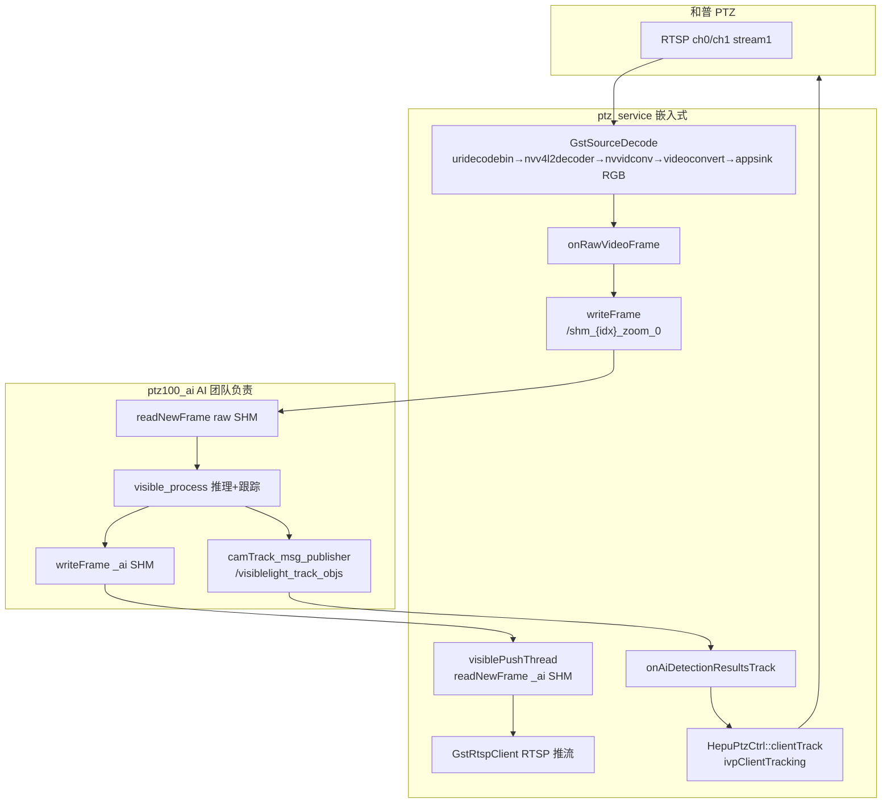
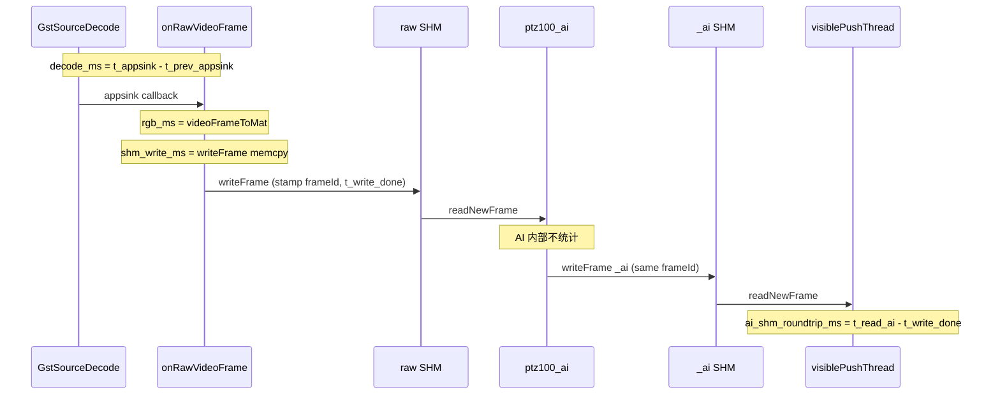
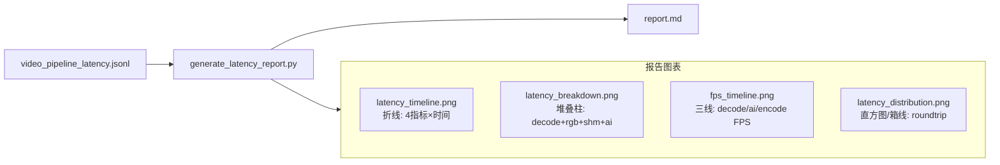

# 和普视频链路延迟梳理与嵌入式侧统计方案

## 1. 完整链路（参考 [hvs_clienttrack 文档](doc/hvs_clienttrack_增量_a736c603.plan.md)）

和普 ClientTrack 模式下存在 **两条并行路径**：视频帧走 SHM，跟踪指令走 ROS。



| 阶段 | 模块 | 关键文件 | 传输 | 嵌入式是否统计 |
|------|------|----------|------|----------------|
| A. RTSP 拉流 + 硬解码 + GPU/CPU 转 RGB | `GstSourceDecode` | [public/gstNvDeeps/gstSourceDecode/gstSourceDecode.cpp](public/gstNvDeeps/gstSourceDecode/gstSourceDecode.cpp) | GStreamer pipeline | **待加** decode_ms |
| B. Mat 包装 / 色彩转换 | `videoFrameToMat()` | 同上 + [ptzDeviceHepu.cpp](ros_ws/src/ptz_service/src/ptzDevice/ptzDeviceHepu.cpp) L688-689 | 函数内（RGB 格式为零拷贝） | **待加** rgb_ms |
| C. 写 AI 输入 SHM | `ShmTransferFrame::writeFrame()` | [public/shmTransferFrame/shmTransferFrame.cpp](public/shmTransferFrame/shmTransferFrame.cpp) L59-89 | `/shm_{idx}_zoom_0` | **待加** shm_write_ms |
| D. AI 推理（不在嵌入式范围） | `ptz100_ai` | [ai_main.cpp](ros_ws/src/ptz100_ai/skyfend_ai_main/ai_main.cpp) | 读 raw SHM → 推理 → 写 `_ai` SHM | AI 团队自统计 |
| E. 读 AI 结果 SHM | `visiblePushThread()` | [ptzDeviceHepu.cpp](ros_ws/src/ptz_service/src/ptzDevice/ptzDeviceHepu.cpp) L788-850 | `/shm_{idx}_zoom_0_ai` | **待加** ai_shm_roundtrip_ms |
| F. RTSP 推流给 C2 | `GstRtspClient::pushFrame()` | 同上 | UDP→mediamtx | 已有 FPS/码率 |
| G. 跟踪下发和普 | `onAiDetectionResultsTrack` → `clientTrack` | [ptzDeviceHepu.cpp](ros_ws/src/ptz_service/src/ptzDevice/ptzDeviceHepu.cpp) L1642+ / [ptz_hepu_ctrl.cpp](iotDevices/ptzHepuSDK/src/ptz_hepu_ctrl.cpp) | ROS `/visiblelight_track_objs` → IPC | 已有 `took X ms`（ROS 回调级） |

**GStreamer 解码配置**（和普低延迟）：[ptzDeviceHepu.cpp](ros_ws/src/ptz_service/src/ptzDevice/ptzDeviceHepu.cpp) L122-127 — `IMAGE_RGB`、`HARDWARE`、`disableDPB=true`；appsink `sync=FALSE, drop=TRUE`。

**SHM 命名**（deviceIndex=0）：可见光 raw `/shm_0_zoom_0`，AI 结果 `/shm_0_zoom_0_ai`；红外对应 `_infrared_0` / `_infrared_0_ai`。

---

## 2. 现有可观测指标 vs 缺口

### 已有（无需改代码）

| 指标 | 位置 | 日志关键字 | 粒度 |
|------|------|-----------|------|
| 解码 FPS | `fpsStatistics()` | `Decoder FPS =` | 每 2s |
| 帧间隔异常 | `onRawVideoFrame` | `input frame fast/slow, diffMs` | 逐帧 WARN |
| AI 输出 FPS | `visiblePushThread` | `Real FPS =` | 每 2s |
| Pipeline 汇总 | `/tmp/video_pipeline_status.json` | decode_fps / ai_fps / encode_fps | 每 1s |
| ivpClientTracking 回调耗时 | `rosService.cpp` L126 | `onAiDetectionResultsTrack (visible) took X ms` | 每帧 INFO |

### 缺口（本次嵌入式需补齐）

| 指标 | 含义 | 现状 |
|------|------|------|
| **decode_ms** | GStreamer 从上一帧 appsink 到本帧 sample 就绪（含网络+解码+转 RGB） | 无；`#if 0` PTS 对比未启用 |
| **rgb_ms** | `videoFrameToMat()` 耗时 | 无（和普 RGB 路径预期 ~0ms 零拷贝） |
| **shm_write_ms** | `writeFrame()` memcpy ~6MB（1080p） | 无；注释估计 clone ~7ms |
| **ai_shm_roundtrip_ms** | raw SHM 写完成 → 同 frameId 的 `_ai` SHM 读完成 | 无；AI 侧 `start_delay` 不在嵌入式范围 |

---

## 3. 延迟定义（嵌入式统计口径）



- **decode_ms**：在 `appsink_new_sample_cb` 记录单调时钟，`decode_ms = now - last_sample_ms`（近似含 RTSP 抖动 + 硬解码 + nvvidconv/videoconvert，不含 SHM）。
- **rgb_ms / shm_write_ms**：在 [onRawVideoFrame](ros_ws/src/ptz_service/src/ptzDevice/ptzDeviceHepu.cpp) 内用 `GstSourceDecode::getTimestampMs()` 分段计时。
- **ai_shm_roundtrip_ms**：raw 写完成后以 `frameId` 为 key 存 `t_write_done`；[visiblePushThread](ros_ws/src/ptz_service/src/ptzDevice/ptzDeviceHepu.cpp) / `thermalPushThread` 读到 `_ai` 帧时查表计算 `now - t_write_done`（含 AI 全处理 + 写回 SHM + 信号量等待，**不拆分 AI 内部**）。

**ivpClientTracking 端到端**（仅文档说明，不在嵌入式 SHM 统计内）：

`T_track ≈ ai_shm_roundtrip_ms`（同帧） + ROS 发布/订阅 + `clientTrack` IPC；现有 `onAiDetectionResultsTrack took X ms` 仅覆盖 G 段。

---

## 4. 实现方案（仅 ptz_service + 公共库，不改 ptz100_ai）

### 4.1 新增轻量统计结构

扩展 [ptzFrameStat.h](ros_ws/src/ptz_service/src/ptzDevice/ptzFrameStat.h) 中 `FrameStatData`：

```cpp
struct FrameStatData {
    uint8_t camera_index;
    float decoder_fps;
    uint64_t frame_id;
    uint32_t decode_ms;
    uint32_t rgb_ms;
    uint32_t shm_write_ms;
};
```

新增 `LatencyRingBuffer`（固定大小 ~64 条）存 `{frameId, t_write_done_ms}`，供 push 线程查 roundtrip。

新增 `LatencyAggregator`（滑动窗口，默认 **10s**）计算 avg / min / max / p50 / p95，在 [frameStatWorkerThread](ros_ws/src/ptz_service/src/ptzDevice/ptzDeviceHepu.cpp) 每 2s 输出一次（与现有 FPS 对齐）。

### 4.2 计时埋点

**A. [gstSourceDecode.cpp](public/gstNvDeeps/gstSourceDecode/gstSourceDecode.cpp)** `appsink_new_sample_cb`：
- 记录 `lastSampleMonotonicMs_`，回调前计算 `decode_ms` 并通过 getter 暴露（或写入 `FrameStatData` 由 Hepu 侧读取）。

**B. [ptzDeviceHepu.cpp](ros_ws/src/ptz_service/src/ptzDevice/ptzDeviceHepu.cpp)** `onRawVideoFrame`：
```cpp
auto t0 = GstSourceDecode::getTimestampMs();
cv::Mat rgb = GstSourceDecode::videoFrameToMat(frame);
auto t1 = GstSourceDecode::getTimestampMs();
shmVisibleRaw_->writeFrame(rgb);  // 返回 frameId 或读 header
auto t2 = GstSourceDecode::getTimestampMs();
// rgb_ms = t1-t0, shm_write_ms = t2-t1
// 入队 FrameStatData + 写入 LatencyRingBuffer
```

**C. `visiblePushThread` / `thermalPushThread`**：
- `readNewFrame` 成功后，按 `visible_header.frameId` 查 ring buffer，记录 `ai_shm_roundtrip_ms` 到 aggregator。

### 4.3 输出方式（三层）

**层 1 — 运行时日志**（每 2s，WARN 级，与 FPS 一致）：
```
Visible latency(10s): decode avg/p95=XX/XX ms, rgb avg=XX ms, shm_write avg/p95=XX/XX ms, ai_roundtrip avg/p95=XX/XX ms
```

**层 2 — 时序数据文件**（供报告脚本画图，每 2s 追加一行 JSONL）：

路径：`/tmp/video_pipeline_latency.jsonl`（可见光/红外各一条 channel 字段）

```json
{"ts_ms":1717123456789,"channel":"visible","decode_avg":40.2,"decode_p95":52.1,"rgb_avg":0.3,"shm_write_avg":7.8,"shm_write_p95":11.2,"ai_roundtrip_avg":98.5,"ai_roundtrip_p95":142.0,"decode_fps":25.0,"ai_fps":24.8,"encode_fps":24.9,"sample_count":250}
```

同时扩展 [writePipelineStatusJson](ros_ws/src/ptz_service/src/ptzDevice/ptzDeviceHepu.cpp) → `/tmp/video_pipeline_status.json` 增加最新 latency 快照，供 [sysmonit](ros_ws/src/sysmonit/src/http_api.cpp) 实时查看。

**层 3 — 报告 + 可视化图表**（采集结束后一键生成，见 §8）

### 4.4 不改动范围

- **不修改** [ptz100_ai](ros_ws/src/ptz100_ai/) 任何计时/日志
- **不修改** SHM 协议（仍用现有 `frameId` + `timeStampMs`）
- **HEPU_STREAM_MODE_RAW** 调试模式下跳过 SHM 统计

---

## 5. 预期参考值（联调对照）

| 指标 | 正常范围（1080p@25fps） | 异常阈值建议 |
|------|------------------------|-------------|
| decode_ms | ~35-45ms（≈帧间隔） | p95 > 80ms |
| rgb_ms | ~0-1ms（RGB 零拷贝） | > 5ms（可能格式回退 NV12） |
| shm_write_ms | ~5-10ms（6MB memcpy） | p95 > 20ms |
| ai_shm_roundtrip_ms | 取决于 AI/GPU，通常 50-150ms | p95 > 200ms |
| ivpClientTracking took | 通常 < 5ms（IPC） | > 20ms |

---

## 6. 验证步骤

1. 启动 `ptz_service` + `ptz100_ai`，确认 `/shm_0_zoom_0` 与 `_ai` 存在
2. 运行 60s（或更长），确认 JSONL 持续写入：
   ```bash
   tail -f /tmp/video_pipeline_latency.jsonl
   ```
3. 生成报告与图表（见 §8）
4. 对比报告中 decode_fps 与 ai_fps 是否匹配（参考 [video-stream-diagnostics skill](~/.cursor/skills/video-stream-diagnostics/SKILL.md)）
5. 可选：对照 `onAiDetectionResultsTrack (visible) took` 确认 G 段 IPC 延迟

---

## 7. 涉及文件

| 文件 | 改动 |
|------|------|
| [ptzFrameStat.h](ros_ws/src/ptz_service/src/ptzDevice/ptzFrameStat.h) | 扩展统计结构 + Aggregator |
| [ptzDeviceHepu.cpp/.h](ros_ws/src/ptz_service/src/ptzDevice/ptzDeviceHepu.cpp) | 埋点 + JSONL 写入 + 周期日志 |
| [gstSourceDecode.cpp/.h](public/gstNvDeeps/gstSourceDecode/gstSourceDecode.cpp) | appsink 帧间隔 → decode_ms |
| **新增** [generate_latency_report.py](ros_ws/src/ptz_service/scripts/generate_latency_report.py) | 报告 + 图表生成 |
| **输出** `doc/reports/hepu_latency_<timestamp>/` | Markdown 报告 + PNG 图表 |

---

## 8. 报告与可视化输出（交付物）

### 8.1 报告脚本

新增 [ros_ws/src/ptz_service/scripts/generate_latency_report.py](ros_ws/src/ptz_service/scripts/generate_latency_report.py)：

**输入**（优先级）：
1. `/tmp/video_pipeline_latency.jsonl`（主数据源，结构化）
2. 回退：`/home/skyfend/log/ptz_service.log` 正则解析 `latency(10s)` 行

**输出目录**：`doc/reports/hepu_latency_<YYYYMMDD_HHMMSS>/`

| 文件 | 内容 |
|------|------|
| `report.md` | 完整 Markdown 报告（见 8.2 结构） |
| `latency_timeline.png` | 各阶段延迟随时间折线图（decode / rgb / shm_write / ai_roundtrip） |
| `latency_breakdown.png` | 嵌入式侧各阶段 **平均耗时堆叠柱状图**（单帧链路分解） |
| `fps_timeline.png` | decode_fps / ai_fps / encode_fps 三线对比 |
| `latency_distribution.png` | ai_roundtrip p50/p95 箱线图或直方图（可见光 vs 红外） |
| `pipeline_diagram.png` | 链路示意图（matplotlib 绘制，标注各段实测均值） |

**依赖**：Python3 + matplotlib（AGX 通常已装；若无则 `pip install matplotlib`）

**用法**：
```bash
# 采集期间 ptz_service 运行 ≥60s 后执行
python3 ros_ws/src/ptz_service/scripts/generate_latency_report.py \
  --jsonl /tmp/video_pipeline_latency.jsonl \
  --duration 60 \
  --output doc/reports/
```

### 8.2 报告 Markdown 结构（`report.md`）

```markdown
# 和普 PTZ 视频链路延迟报告

- 采集时间：2026-05-31 14:00:00 ~ 14:01:00（60s）
- 设备：和普 PTZ / deviceIndex=0
- 统计范围：嵌入式 ptz_service（不含 ptz100_ai 内部）

## 1. 链路概览
（嵌入 pipeline_diagram.png + Mermaid 文字说明）

## 2. 嵌入式侧延迟汇总
| 指标 | 可见光 avg | 可见光 p95 | 红外 avg | 红外 p95 | 阈值 | 结论 |
| decode_ms | ... | ... | ... | ... | 80 | ✅/⚠️ |
| rgb_ms | ... | ... | ... | ... | 5 | ... |
| shm_write_ms | ... | ... | ... | ... | 20 | ... |
| ai_shm_roundtrip_ms | ... | ... | ... | ... | 200 | ... |

## 3. FPS 健康度
| 通道 | decode_fps | ai_fps | encode_fps | 丢帧/超时 |
...

## 4. 图表


## 5. 结论与建议
- 瓶颈段：...
- 是否满足 25fps 实时跟踪：...
```

### 8.3 图表设计



**latency_breakdown.png**（核心可视化 — 回答「各段占多少」）：

```
|████████████████ decode ████████|█ rgb █|██ shm ██|████████████████ AI roundtrip ████████████████|
  ←—— 嵌入式可精确测量 ——→                              ←—— 含 AI 全处理 ——→
```

- X 轴：通道（visible / thermal）
- Y 轴：延迟 (ms)
- 四段堆叠：decode_ms + rgb_ms + shm_write_ms + ai_shm_roundtrip_ms
- 标注每段 avg 数值

**latency_timeline.png**：
- X 轴：时间 (s，相对采集起点)
- Y 轴：延迟 (ms)
- 4 条折线 + p95 虚线参考线

### 8.4 采集与出报告工作流

```bash
# 1. 清空旧数据（可选）
rm -f /tmp/video_pipeline_latency.jsonl

# 2. 启动/确认 ptz_service + ptz100_ai 运行，等待 ≥60s

# 3. 生成报告
python3 ros_ws/src/ptz_service/scripts/generate_latency_report.py

# 4. 查看
ls doc/reports/hepu_latency_*/
cat doc/reports/hepu_latency_*/report.md
```

报告目录可提交到 git 或仅本地留存（建议 `.gitignore` 排除 PNG，保留脚本与 report 模板）。
