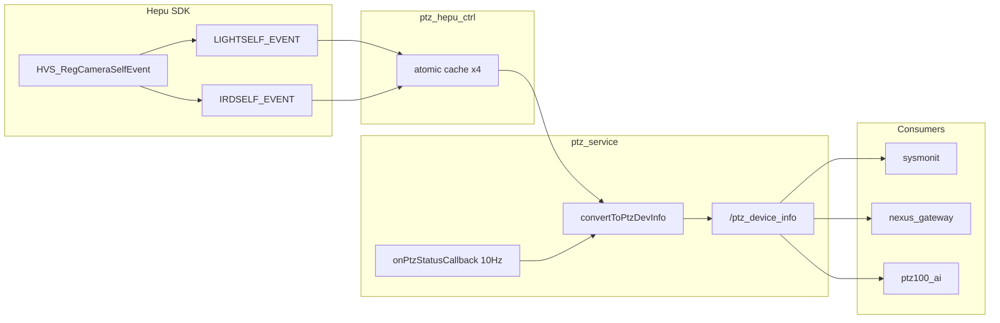

# 和普镜头自检状态 10Hz 发布方案

## 结论：放在 `PtzDeviceInfo.msg` 合适

**推荐用 [`PtzDeviceInfo.msg`](ros_ws/src/srp100_message/skyfend_interfaces/msg/ptz_msg/PtzDeviceInfo.msg)，发布点沿用现有 10Hz `/ptz_device_info`。**

理由：

- **已有 10Hz 发布链路**：[`PtzDeviceHepu::onPtzStatusCallback`](ros_ws/src/ptz_service/src/ptzDevice/ptzDeviceHepu.cpp) 每 100ms 调用 `convertToPtzDevInfo` → `rosService_.pub_ptz_device_info()`，无需新建话题或定时器。
- **语义匹配**：`PtzDeviceInfo` 已是「设备静态/半静态信息 + 和普专有扩展」的载体（`smart_server_*`、`defog_enable`、`win_heat_enable`），镜头自检/初始化完成度属于设备就绪状态，不是运行态跟踪数据。
- **下游已订阅**：sysmonit、NexusGateway（[`ros_app::cb_sub_hepuPtzInfo`](src/app/ros_app/ros_app.cpp) → 0x86 上报 C2）、ptz100_ai 均订阅 `/ptz_device_info`，扩展字段向后兼容（新字段默认 0）。

**不建议放 `PtzStatus.msg`**：该消息描述 work_mode / tracking / ICR 等运行态，与镜头硬件自检语义不同。



---

## SDK 字段映射（图中 4 个）

| SDK 字段 | 含义 | 建议 ROS 字段 |
|----------|------|---------------|
| `visibleSelf` | 可见光自检：0=自检中，1=完成 | `uint8 visible_self` |
| `visibleStateInit` | 可见光初始化：0=未完成，1=完成 | `uint8 visible_init_done` |
| `imgSelf` | 热像自检：0=自检中，1=完成 | `uint8 ir_self` |
| `imgStateInit` | 热像初始化：0=未完成，1=完成 | `uint8 ir_init_done` |

建议在 msg 中加 enum 常量（与现有 `defog_enable` / `win_heat_enable` 风格一致）：

```msg
uint8 CAMERA_SELF_CHECKING = 0
uint8 CAMERA_SELF_DONE     = 1
uint8 CAMERA_INIT_PENDING  = 0
uint8 CAMERA_INIT_DONE     = 1
```

未收到回调前可用 `255` 表示 `UNKNOWN`（可选，与 `day_night_mode` 一致）。

---

## 实现步骤

### 1. 扩展 ROS 消息

文件：[`PtzDeviceInfo.msg`](ros_ws/src/srp100_message/skyfend_interfaces/msg/ptz_msg/PtzDeviceInfo.msg)

在文件末尾追加 4 个 `uint8` 字段 + 注释（仅和普 PTZ 有效）。

### 2. SDK 层注册回调并缓存

文件：[`ptz_hepu_ctrl.cpp`](iotDevices/ptzHepuSDK/src/ptz_hepu_ctrl.cpp)、[`ptz_hepu_ctrl.h`](iotDevices/ptzHepuSDK/include/ptz_hepu_ctrl.h)

- 在 [`initCallbacks()`](iotDevices/ptzHepuSDK/src/ptz_hepu_ctrl.cpp) 中，于 `HVS_RegCameraEvent` 之后增加：

```cpp
HVS_RegCameraSelfEvent(device_, onLightSelfEvent, onIrdSelfEvent, this);
```

- 新增静态回调 `onLightSelfEvent` / `onIrdSelfEvent`，将 SDK 结构体写入 `std::atomic<uint8_t>` 成员（回调线程写，10Hz 读，与 `defogEnable_` 模式相同）。
- 提供 `getCameraSelfState()` 或在现有 `getPtzStatus` 旁增加 getter，供上层读取。

**注意**：`HVS_RegCameraSelfEvent` 目前在工程中**尚未注册**（仅存在于 [`icamera.h`](thirdpart/hepuSdk/include/module/icamera.h) / [`datdefs.h`](thirdpart/hepuSdk/include/datdefs.h)）。

### 3. 设备层填入 10Hz 发布

文件：[`ptzDeviceHepu.cpp`](ros_ws/src/ptz_service/src/ptzDevice/ptzDeviceHepu.cpp)

在 [`convertToPtzDevInfo`](ros_ws/src/ptz_service/src/ptzDevice/ptzDeviceHepu.cpp) 中从 `deviceApi_->ctrl` 读取缓存的 4 个值写入 `ptz_dev_info`。

**不需要**单独开 10Hz 线程；事件回调只更新缓存，发布频率仍由 `onPtzStatusCallback` 的 `lastPublishTime_ > 100` 控制。

### 4. 编译

```bash
colcon build --packages-select skyfend_interfaces ptz_service
```

---

## 不在本次范围（可选后续）

- **sysmonit Web 展示**：[`http_api.cpp`](ros_ws/src/sysmonit/src/http_api.cpp) / [`index.html`](ros_ws/src/sysmonit/web/index.html) 需额外改才能显示 4 个新字段（类似 defog/heat）。
- **C2 0x86 协议上报**：[`ros_app::cb_sub_hepuPtzInfo`](src/app/ros_app/ros_app.cpp) 目前只拷贝 sn/ip/port/connected，若 C2 也要这 4 个状态需另改 alink 结构。
- **SDK 其余 6 个字段**（power/uart/stateSelf 错误）：若后续需要可再加，不影响本次 4 字段方案。

---

## 关键代码锚点

现有 10Hz 发布（无需改动结构，只扩展 fill 逻辑）：

```1451:1468:ros_ws/src/ptz_service/src/ptzDevice/ptzDeviceHepu.cpp
    // 10Hz发布ROS2话题
    if (current_time - lastPublishTime_ > 100) {
        ...
        convertToPtzDevInfo(currentStatus_, ptz_dev_info);
        ...
        rosService_.pub_ptz_device_info(ptz_dev_info);
    }
```

现有和普专有字段填充模式（照此扩展）：

```2001:2002:ros_ws/src/ptz_service/src/ptzDevice/ptzDeviceHepu.cpp
    ptz_dev_info.defog_enable       = defogEnable_.load();
    ptz_dev_info.win_heat_enable = windowHeatEnable_.load();
```
